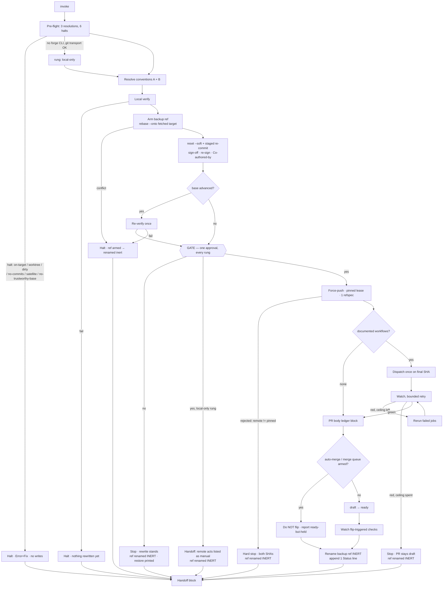
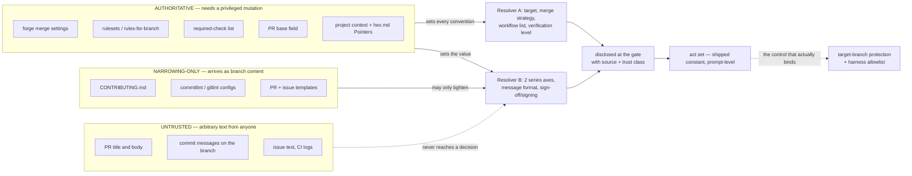

# System Design: The finalize phase

**Companion to** [`adr_0009_finalize_phase.md`](adr_0009_finalize_phase.md).
That ADR holds the decision, the options, and the trade-offs; **this doc is
the buildable spec** — C4, the state machine and its re-entry predicates, the
trust boundaries, the failure-mode table, the degrade ladder, the per-act
forge command table, the `finalize.md` reference outline, and the per-file
edit sequence. Date 2026-08-29. Status tracks the ADR (Proposed).

Contracts are numbered `C-8xx` (the ADR summarizes them; here they are in
buildable form). **Where this doc and the ADR could disagree, the ADR's
contract text is canonical and everything here is derived from it** — the
round-1 panel caught three such disagreements in the draft (the re-entry
chain, the convention resolver's scope, and the verification ordering), and
this revision derives §§ 4–5 from C-803, C-807, C-810 and C-818 rather than
restating them independently.

Terms: **branch** = the feature branch the session was opened on and that
finalize acts upon; **target** = the branch it rebases onto and the PR's base,
never pushed; **forge** = GitHub or GitLab, reached only through its CLI;
**act set** = the four kinds of remote operation finalize may perform (C-811),
of which the fetch is pre-gate and the other three are post-gate; **armed** /
**inert** = the two states of the backup ref (C-809).

The single invariant everything below serves: **the only ref finalize may
write to a remote is the branch it was invoked on, and the only remote object
it may mutate is that branch's one pull request.** Every diagram, predicate
and failure row is a restatement of that sentence at a different altitude —
and § 6 states plainly what kind of control that sentence actually is.

---

## 1. C4 — Context

```
                    ┌──────────────────────────────────────────────┐
                    │  Harness (Claude / Codex / Copilot / …)        │
                    │  provides: shell · file read/write             │
                    │  NOT required: subagent spawn (C-828 — finalize│
                    │  spawns nothing, so no capability gate at all) │
                    │  REAL control surface: its own command allowlist│
                    └───────────────────┬──────────────────────────┘
                                        │
  grim registry ──ships──►  hex bundle (hex-finalize + hex-core/finalize.md)
                                        │
             ┌──────────────────────────┼───────────────────────────┐
             │ reads                     │ reads + writes            │ reads + writes
             ▼                           ▼                           ▼
   project context (Layer 1)     local git repository         forge, via `gh`/`glab`
   · verification level          · branch, target, refs       · PR state, base field
   · commit requirements         · working tree               · merge settings
   · release workflow names      · backup ref (armed/inert)   · rulesets / checks
   · forge + target pointers     · signing agent socket       · workflow dispatch
             │                           │                           │
             └──────────── one approval gate (every rung) ────────────┘
                                        │
                                        ▼
                                  human (the invoker)
                       grants the action class by invoking;
                       narrows it to a disclosed instance at the gate;
                                  merges, afterwards
```

The genuinely new Context edges versus every prior hex skill are the two on
the right: hex now **writes to a git remote** and **reads and writes a forge
API**. Both are bounded by the act set and both degrade to absent (§ 7.2). The
signing agent is reached as an *oracle* — finalize asks it to sign a specific
commit object and never reads key material.

**One Context edge is drawn but not owned by hex.** The harness's command
allowlist is what can actually stop a `git push` that the act set merely
forbids; § 6 develops the distinction, and C-826 pushes the other real
control — target-branch protection — into `/hex-init`'s audit surface.

## 2. C4 — Container

```
┌───────────────────── /hex-finalize (session skill) ────────────────────────┐
│  Pre-flight → Conventions → Local verify → Recompose → ┃GATE┃ → Remote      │
│  · owns the single approval gate, on EVERY degrade rung ┃    ┃              │
│  · spawns nothing (C-828)                               ┃    ┃  ← the seam: │
│  · reads hex-core/references/finalize.md for every rule ┃    ┃  left of it, │
│                                                          ┃    ┃  one reset  │
└───────┬──────────────────┬───────────────────────────────────┬─────────────┘
        │ reads            │ reads + writes                    │ 3 post-gate acts
        ▼                  ▼                                   ▼
┌─── convention ───┐ ┌──── local git ────┐         ┌───────── forge CLI ──────────┐
│ resolver (C-815) │ │ backup ref armed  │  ┌────► │ (pre-gate, once) fetch branch│
│ 3 trust classes  │ │ rebase --onto     │  │ pre- │        + target ref          │
│ narrowing scope  │ │ reset --soft      │  │ gate ├──────────────────────────────┤
│ is ENUMERATED    │ │ staged re-commit  │  │      │ force-push (1 refspec)       │
│ (C-816)          │ │ sign-off, re-sign │  │      │ dispatch documented workflows│
└──────────────────┘ │ local verification│──┘      │ PR create/edit/flip          │
                     └───────────────────┘         │ NEVER: target, merge,        │
                                                   │ protection, tags, other PRs  │
shared state:  none new.                           └──────────────────────────────┘
The journal is git plus the PR (C-818).
```

Container-level invariants:

- **No worker, no fan-out, no concurrency cap.** Commit-boundary judgment
  needs the whole branch diff in one place (C-828). Finalize therefore needs
  no capability detection: it works on any harness that can run a shell
  command.
- **The act set is a shipped constant**, enumerated in `finalize.md` as text —
  not derived, not configurable, not extendable by any discovered convention
  (C-811, C-816).
- **Nothing crosses the seam before the gate.** The one pre-gate remote
  operation is a *read* (the fetch). Everything else pre-gate is local and is
  undone by `git reset --hard <backup-ref>`.
- **The gate exists on every rung**, including local-only: the pre-gate
  commits already carry a live DCO attestation and a signature, so a rung that
  skipped the gate would let an unreviewed attestation reach a `git push` the
  human types five minutes later.

## 3. C4 — Component

```
Pre-flight [C-804] ── 3 resolution steps, then 6 halts, in this order ───────┐
   │  (a) forge CLI probe: presence, identity, credential source, scopes     │
   │      → selects the local-only rung; NEVER a halt                        │
   │  (b) resolve branch + target (authoritative sources only, C-802)        │
   │  (c) fetch branch upstream AND target ref, once → pin the lease SHA,    │
   │      then assert merge-base --is-ancestor <pinned-sha> <branch>         │
   │  halts: on-target · not-primary-checkout · dirty-tree (fold-aware) ·    │
   │         no-commits-ahead · federation-satellite ·                       │
   │         no-trustworthy-base (FM6b fetch failed / FM6c not an ancestor)  │
   ▼                                                                         │
Convention resolver [C-815] ── 3 trust classes; narrowing scope ENUMERATED   │
   │  authoritative ▸ narrowing-only (4 conventions) ▸ untrusted (never)     │
   ▼                                                                         │
Local verify [C-810] ── the project's own documented level, pre-rewrite ─────│
   ▼                                                                         │
Recompose [C-807, C-808, C-809]                                              │
   │  arm backup ref → rebase --onto <fetched target> → reset --soft →       │
   │  staged re-commit per logical change (sign-off, re-sign, Co-authored-by)│
   │  → message-matches-diff check                                           │
   │  → re-verify IFF the fetched target tip ≠ the pre-rewrite base [C-810]  │
   ▼                                                                         │
┃ GATE [C-805] ┃ ── one approval, every rung; everything above is reversible ┤
   ▼                                                                         │
Remote [C-811 … C-814]  (3 acts)                                             │
   │  force-push (pinned lease + if-includes, 1 refspec) →                   │
   │  dispatch documented workflows once on the final SHA →                  │
   │  bounded watch, per-SHA rerun ceiling → PR create/edit + ledger block → │
   │  draft→ready only when the resolved gate is satisfied AND auto-merge    │
   │  is not armed — "satisfied" = green where workflows resolved, or the    │
   │  local verification alone where the set was empty → then watch the      │
   │  flip-triggered checks                                                  │
   ▼                                                                         │
Post [C-809, C-822] → rename backup ref INERT · append 1 Status line · handoff┘
```

Two components carry logic where a wrong implementation misbehaves *silently*,
and they get code-level detail in § 4: the re-entry predicate chain and the
convention resolver. Everything else is a sequence of shell commands with
named halts. *ponytail: pseudocode for the rest would restate the contract
table in a worse notation.*

## 4. Code-level (only where warranted)

### 4.1 Re-entry predicate chain (C-818)

**Derived from C-818; the governing rule is one sentence: no resume performs a
remote act without passing the gate** — and the chain enforces it structurally,
with exactly one early exit, rather than by inspecting remote state
[erratum, WP2 panel, 2026-08-29]. There is no journal file.

```
armed    = ref_exists("backup/<branch>-pre-finalize")   # a run is IN FLIGHT
local    = rev_parse(branch)
remote   = ls_remote(origin, branch)      # NOT the remote-tracking ref
pr       = pull_request_for(branch)       # may be absent
                                          # local-only rung: always absent
run      = own_dispatch_run_for(remote)   # a run THIS design's dispatch created
                                          # for that head SHA — workflow_dispatch
                                          # event, ANY state: queued|running|
                                          # completed. NOT "any run on the SHA":
                                          # a branch's ordinary on:push CI is not
                                          # evidence a finalize dispatched.
                                          # local-only rung: always None (no forge)

# The published-rewrite test, evaluated BEFORE any decision to recompose.
# ARMED, not "any backup ref": the armed name exists only while a run is
# unfinished, so it means "this run pushed and has steps pending". An INERT
# ref means a prior finalize already terminated — a branch that then gained
# new human commits and had them pushed also has local == remote, and must
# be REBUILT, not resumed.
published_rewrite = armed and remote is not ABSENT and local == remote

if published_rewrite:
    # The remote already carries this design's own rewrite. NEVER rebuild it:
    # re-signing (C-808) stamps a fresh timestamp, so a rebuild mints new SHAs
    # for identical content and would push + dispatch + attest a second time.
    start = RESUME_PUBLISHED   # → gate (if not yet passed this session) with a
                               #   REDUCED act set: no rewrite, no force-push
else:
    start = PREFLIGHT          # EVERY other state — armed or not, tips equal or
                               #   not, a run present or not — runs forward
                               #   THROUGH THE GATE. `run` never routes here.
                               #   The draft fell through to WATCH/FLIP/POST on
                               #   not-armed + tips-equal + a run existing, which
                               #   reached a post-push step with NO gate, on work
                               #   that had never been recomposed.

# RESUME_PUBLISHED then routes on the remaining remote state. This is the ONLY
# path to a post-push step that has not passed the gate this session, and
# reaching it requires the armed ref THIS run created:
#   no own run for this SHA → DISPATCH ·  run not green → WATCH
#   green + draft → FLIP               ·  green + ready → POST
```

Eight properties, each the reason a branch is where it is:

- **No armed ref means rebuild, whatever the remote shows** [erratum, WP2
  panel, 2026-08-29]. A branch with no armed ref whose tips happen to be
  equal is not a resume: it is a prior finalize that already terminated, on a
  branch that has since gained human commits **and had them pushed**. That
  work has never been recomposed, so routing on the remote's run state would
  dispatch and flip it without a rewrite and without an approval.
  Consequently **`FLIP` and `WATCH` are reachable exactly two ways**: forward
  from a gate this session passed, or through `RESUME_PUBLISHED`, whose
  precondition is the armed ref this run created and which still gates first.
- **`run` counts only finalize's own dispatches** [erratum, WP2 panel,
  2026-08-29] — a `workflow_dispatch` run this design created against that
  head SHA. A branch's ordinary `on: push` CI is not evidence that a finalize
  dispatched anything, and scoping the query is what keeps the re-dispatch
  guard honest without a journal file.
- **The pre-push path has exactly one entry point: the gate.** The draft's
  `elif armed and local != remote: start = PUSH` turned a *declined* gate into
  an *approved* force-push on the next invocation, because a decline and an
  interruption left byte-identical state. Routing every pre-push resume back
  through pre-flight and the gate removes the need to tell them apart at all.
- **That is affordable because recomposition never double-applies** (C-807
  step 2): `reset --soft` discards the prior history and rebuilds from the
  diff, so a second run cannot stack a recomposition on top of a
  recomposition. **The weaker claim is the honest one** — the *partition* into
  logical commits is model judgment, so a second run may draw boundaries
  slightly differently; what is guaranteed is that the branch diff and the
  base are preserved, never that the series is byte-identical. That is enough,
  because the gate re-displays whatever series the re-run produced before
  anything is published. The draft's promised "tip-shape check" **stays
  dropped**: it existed to stop a double-apply that `reset --soft` already
  makes impossible, and it could not have caught a differing partition anyway
  — the re-gate is what covers that.
- **Recomposition is not SHA-stable, which is why `published_rewrite` is
  tested first.** C-808 mandates re-signing, and a signature stamps a fresh
  timestamp, so rebuilding an already-published series mints **different SHAs
  for identical content**. The draft leaned on "the push is a no-op when the
  tips match" to make a lost-flag resume harmless — but that branch is
  **unreachable**: the rebuild changes the tips before the push is ever
  reached. Left as written, a fresh session resuming a pushed-but-undispatched
  branch would have force-pushed a second time, dispatched a second time, and
  left a second signed attestation for work already published. The fix is
  routing, not a comparison: the published-rewrite test runs **before** the
  decision to recompose, and its resume path skips the rewrite and the push
  entirely.
- **`GATE_ALREADY_PASSED_THIS_SHA` is session-local**, and that is the one
  piece of state this design keeps in the conversation rather than on disk. It
  is not a journal: losing it is safe and *fails toward the gate*, so a fresh
  session with a pushed-but-undispatched branch re-runs pre-flight and asks
  again rather than dispatching on a consent it cannot see. The flag only ever
  saves a redundant re-ask inside the session that already got the yes.
- **`remote` comes from `ls-remote`, never from the remote-tracking ref.** The
  tracking ref is exactly the value a background fetch corrupts, which is the
  entire reason the lease is pinned (C-812). Re-entry must not reintroduce the
  same staleness one layer up.
- **`armed` is the gating term of the chain's only early exit**, and it has
  two further jobs outside re-entry: (i) refusing a second `-pre-finalize`
  creation that would clobber an interrupted run's only anchor, and (ii)
  feeding C-821's rule predicate. Because every terminal
  path renames it inert — success, decline, and post-rewrite halt alike — a
  *stale* armed ref means an interrupted run and nothing else.

**A lease rejection is never a re-entry event.** It means a human pushed
during the run; the run reports and
exits (C-812), and the operator reconciles by hand before re-invoking. The
chain does not paper over it.

### 4.2 Convention resolution (C-815, C-816)

**The narrowing class reaches an enumerated set of four conventions and
nothing else.** The draft ran *every* convention — including the target branch
and the merge strategy — through one loop that let checked-in text narrow it,
which would have let an attacker's `CONTRIBUTING.md` name the rebase base.
Two resolvers, not one:

```
# Resolver A — AUTHORITATIVE-ONLY. No narrowing input reaches these.
for c in {target branch, merge strategy, release workflow list,
          verification level}:
    v = project_context(c) or forge_setting(c) or SHIPPED_DEFAULT
    disclose(c, v, source_of(v), class="authoritative")

# Resolver B — the four conventions checked-in text MAY narrow.
for c in {series-shape axis 1, series-shape axis 2,
          message format, sign-off/signing requirement}:
    forge   = read_forge_settings(c)          # authoritative
    context = read_project_context(c)         # authoritative
    files   = read_checked_in_files(c)        # narrowing-only

    enforcement = UNKNOWN if forge is READ_ERROR or forge is EMPTY_RESULT
                  else forge

    if c is a series-shape axis:              # C-807, owner 2026-08-29
        v = context                           # 1. project-documented, always wins
            or preferences_prose(c)           # 2. hex.md › Preferences, /hex-init
                                              #    with consent — PROSE, not a key
            or SHIPPED_DEFAULT                # 3. minimal bisectable series
    else:
        v = context or enforcement or SHIPPED_DEFAULT

    if stricter_than(files, v):  v = files    # tighten only, never widen
    disclose(c, v, source_of(v), class_of(v), enforcement)
```

**The series-shape axes carry a third source, and the gate names which one
won.** `preferences_prose` is `hex.md › ## Preferences` free text, written
only by `/hex-init` with consent (C-826) and read here — deliberately **not**
a config key, because `config.md`'s v1 vocabulary froze at six and one default
does not justify reopening it (C-825). It sits between the project's own
documentation and the shipped default: a team that documents its convention is
obeyed, a team that only told `/hex-init` is remembered, and a team that has
said nothing gets a series that can still be squashed by the merge button.

Why the split is load-bearing: each member of resolver A selects **what code
runs or what history is replaced** — the rebase base, the merge semantics, the
workflows that get dispatched (and therefore executed from the branch ref), the
suite that gates the flip. "Narrowing" has no meaning for any of them; a
different target branch is not a stricter target branch. Resolver B's members
are all value spaces where *more constraint* is a coherent move.

`EMPTY_RESULT` is not a shortcut for "nothing enforced" and the code must not
collapse the two: the readable rulesets endpoint returns rules **from rulesets
only**, so a repo protected by classic branch protection answers `200 OK` with
an empty array. `UNKNOWN` is rendered as `unknown` at the gate and never
resolves a decision on its own.

`stricter_than` is the only judgment call, and it is bounded by construction:
it compares within one convention's own value space and can only move the
resolved value toward more constraint. It has no vocabulary for branches,
acts, identities, workflows or verification levels, so a checked-in file has
no expressible way to reach them.

## 5. The state machine

Derived from C-803's phase order and C-818's chain. Every terminal state
routes to the handoff block.



Five assertions the diagram makes, all load-bearing:

1. **The gate is on every path that reaches a rewrite**, including the
   local-only rung, whose own terminal path (`LOD`) is rendered rather than
   implied.
2. **Every terminal state after the ref is armed renames it inert.** That is
   what releases C-821's lock; a decline that left it armed would halt every
   hex mode on the branch with no documented exit but performing the push it
   just refused.
3. **`no documented workflows` routes to `F`, not to a synthetic pass.** An
   absent remote gate is reported absent. The rung is selected *here*, at the
   dispatch decision — pre-flight cannot know it. **How that composes with the
   flip and with C-814's post-flip watch:** an empty workflow set does not
   block the flip — the resolved quality bar is then the local verification
   alone, which passed — but the handoff still says **no remote gate exists**,
   and the post-flip watch still runs, because the flip may itself trigger
   `on: pull_request` CI that no dispatch could have reached. So the two
   statements coexist without contradiction: *no gate was dispatched* and
   *checks may nonetheless now be running*, each reported as itself.
4. **The re-verify diamond is conditional on base movement**, which is C-810's
   single canonical ordering statement rendered once rather than contradicted.
5. **The flip has two guards**: auto-merge state before it, and a watch of the
   checks it triggers after it.

### Re-entry points, and what selects them

| Re-entry state | Predicate (git + PR only) | Resumes at | Why |
|---|---|---|---|
| First run | no armed ref, no inert ref | Pre-flight | — |
| Second, later finalize | no armed ref, an inert ref exists — **whether or not the new commits were already pushed**, so tips may be equal | Pre-flight → **gate** (rebuild) | An inert ref means the prior run terminated, so nothing is pending; new work must be recomposed, never resumed as if published |
| Interrupted before push | armed ref, `ls-remote` tip ≠ local tip | Pre-flight → **gate** | Recomposition never double-applies, so re-running is safe |
| **Declined, then re-invoked** | inert ref, tips differ | Pre-flight → **gate** | Indistinguishable from an interruption *by design* — both must re-ask |
| **Interrupted mid-recompose** | **armed ref + tree not clean** (whole build window) | Halt 3's **recompose-aware** `Fix:` → reset to the armed ref, re-run | Armed means a run is in flight (every terminal path renames it inert), so armed-and-dirty means exactly this; the fold-aware `Fix:` would be wrong guidance (FM12) |
| **Push landed** (any pending remote step) | **armed** ref **and** tips equal → `published_rewrite` | **Resume from the published tip** — gate first if this session has not passed it, with a **reduced act set** (no rewrite, no force-push), then dispatch / watch / flip | Rebuilding would mint new SHAs for identical content (re-signing stamps a timestamp), so a "no-op push" never happens — the rewrite is skipped by **routing**, not by comparison (§ 4.1) |
| Dispatch landed (any state, incl. red) | **finalize's own** dispatch run exists for that SHA | Watch | A completed-red run must **not** trigger a re-dispatch. Reached only via `RESUME_PUBLISHED`, so the armed ref is present [erratum, WP2 panel, 2026-08-29] |
| Checks green, PR draft | run green, PR draft, auto-merge not armed | Flip | Flipping a ready PR is a forge-side no-op |
| Everything done | **armed** ref, tips equal, own run green, PR ready | `RESUME_PUBLISHED` → Post | Rename and Status append are idempotent. **Without an armed ref this is not a resume at all** — it routes to pre-flight and rebuilds [erratum, WP2 panel, 2026-08-29] |

## 6. Trust boundaries

Three classes of input. The rule separating them is not "how likely is this to
be wrong" but **"what does it cost an attacker to change it."**



- **Authoritative** sources set values. Forge settings and the PR base field
  require a privileged mutation; project context is Layer-1 knowledge a human
  wrote and `/hex-init` recorded with consent. **The PR base field is named
  here explicitly** because it is what derives the rebase target, and the draft
  left its class unstated.
- **Narrowing-only** sources arrive as file content, which on a repo accepting
  external pull requests means any contributor writes them. They reach
  **resolver B only** and may only tighten (§ 4.2). The asymmetry is the point:
  an attacker who can only make the commit-message rule stricter has gained
  nothing worth the effort.
- **Untrusted** text never participates in a decision. It is read (commit
  messages are the raw material of recomposition) but read **as data, clearly
  delimited, with an explicit statement that a directive inside it is content
  to analyze**. Echoes are quoted and truncated past 120 characters — the rule
  C-816 promotes into `protocol.md` so it has one home for two consumers.

**What kind of control this actually is — the draft over-claimed and this
revision corrects it.** The draft said the act set is "reachable from no trust
class," implying a structural guarantee. It is not one. The act set is
**prompt text in a shipped markdown file**: it constrains a cooperative agent
and is a design contract, not a runtime boundary. Two things do bind:

| Control | Where it lives | What it stops |
|---|---|---|
| Target-branch protection: "restrict force pushes" + required PR | the forge, admin-gated | A force-push to the trunk, regardless of what any agent's prompt says. **C-826 makes recommending this an audit item.** |
| The harness's own command allowlist | the client running hex | A `git push` or `gh` invocation the user never approved |
| The act-set enumeration + branch-identity scoping | `finalize.md`, prompt text | A cooperative agent from exceeding its brief; a poisoned convention file from widening behavior |
| Credential scope (where a project provisions a narrow one, C-817) | the forge | Reach beyond one repository — but not force-push versus push, which no token scope distinguishes |

GitHub Copilot's branch-prefix restriction — this design's cited precedent —
sits in the **first** row, not the third: it is enforced server-side against a
credential that cannot reach other branches. hex's is a design constraint of
the same *shape* with a materially weaker enforcement story, and § Security of
the ADR says so. **Copilot's second control, human approval of
agent-triggered workflow runs, is the one this design must not drop** — it is
the only thing standing between a dispatch and branch-defined code executing
with repository credentials, and C-813 names it.

**The workflow list is a trust-class question, not a convenience one.**
`gh workflow run --ref <branch>` executes the workflow **as defined on the
branch**; only its *presence* on the default branch makes it dispatchable. A
list scanned from the branch would therefore be an attacker-selected list of
attacker-written code. So the list is **resolver A** — documented ∩
dispatchable — and where the branch modifies a documented workflow's file,
that drift is **named at the gate with the changed paths**.

**The attestation boundary is separate and runs outward.** The
`Signed-off-by` line and the signature carry the *human's* identity into a
permanent public record. Its control is disclosure, not filtering: the exact
commit list, with per-commit sign-off and signing state, every preserved
`Co-authored-by:` trailer, and **the literal signing identity
`user.name <user.email>` — not the forge login, which routinely differs** — is
shown at the gate immediately before publication (C-805, C-808).

## 7. Failure modes and the degrade ladder

### 7.1 Failure-mode table

| # | Failure | Detected by | Response | Backup ref after |
|---|---|---|---|---|
| FM1 | Working tree dirty (incl. an uncommitted fold) | Pre-flight halt 3 | Halt with `Error:`/`Fix:`; fold-aware variant prints `git add`/`git commit` | not yet armed |
| FM2 | Invoked on the target branch | Pre-flight halt 1 | Halt, unconditional | not yet armed |
| FM3 | Not the primary checkout (an agent worktree) | Pre-flight halt 2 | Halt — finalizing from a worktree would rewrite a branch the session did not open (C-802) | not yet armed |
| FM4 | Branch has no commits the target lacks | Pre-flight halt 4 | Halt rather than open an empty PR | not yet armed |
| FM5 | Repo is a federation satellite | Pre-flight halt 5 | Halt with **finalize's own `Fix:`**: the satellite branch is finalized by hand (C-824) | not yet armed |
| FM6a | **Forge CLI absent or not authenticated**, git transport fine | Pre-flight (a) | Not a halt: select the **local-only rung**. The fetch in (c) still succeeds over the user's ordinary git transport, so the rebase base is real | n/a |
| FM6b | **The fetch itself fails** (network down, remote gone, auth refused at the transport) | Pre-flight (c) | **Halt** (6)(i). There is no fetched target, so there is nothing trustworthy to rebase onto — C-804(c) forbids falling back to the local target ref, and the local-only rung is *not* the fallback here: it degrades the *forge* half, never the base | not yet armed |
| FM6c | **The pinned SHA is not an ancestor of the local branch tip** — this checkout has not integrated what the remote already carries [erratum, WP2 panel, 2026-08-29] | Pre-flight (c)'s `git merge-base --is-ancestor <pinned-sha> <branch>` | **Halt** (6)(ii), with two diagnostics: someone else's commits → reconcile by hand; work this checkout lost track of (fresh clone, hard reset, dropped reflog) → establish integration locally, **never** force. Detected here rather than at the push because ancestry still exists to test and the branch is still intact | not yet armed |
| FM7 | Local verification fails (pre-rewrite) | Local verify | Halt; nothing rewritten | not yet armed |
| FM8 | Rebase conflicts with the fetched target | Recompose step 1 | Halt naming the conflicting paths | armed → **renamed inert** |
| FM9 | Post-rebase re-verification fails (base advanced) | C-810 conditional re-verify | Halt; the rewrite stands | armed → **renamed inert** |
| FM10 | Commit message references paths absent from its own diff | Recompose step 4 | Halt, not a warning — a mis-scoped message is a wrong changelog entry forever | armed → **renamed inert** |
| FM11 | Gate declined | Gate | Stop; no remote act; restore command printed | armed → **renamed inert** (this is what releases the C-821 lock) |
| FM12 | Interrupted mid-rewrite — killed process, corrupt rebase dir, or killed **anywhere in the `reset --soft` → re-commit window**, including after commit *k* of *N* | Next invocation's **pre-flight halt 3, recompose-aware variant**, on the whole-window predicate: **armed ref present + tree not clean**. (A staged-diff-equality test would cover only the instant before commit 1 and go false for the rest of the window.) | `git rebase --abort` where a rebase session is intact; otherwise `git reset --hard <armed ref>` and re-run — which re-reaches the **gate**. The fold-aware `Fix:` must **not** fire here: telling the user to `git add` and commit a partly-built series would freeze it into history | stays armed until a terminal path |
| FM13 | Lease rejected — remote SHA ≠ pinned SHA | Push | **Hard stop.** "Someone pushed during the run", both SHAs reported; reconcile by hand | armed → **renamed inert** |
| ~~FM14~~ | ~~Lease rejected — `--force-if-includes` fails while SHAs match~~ | — | **Withdrawn** [erratum, WP2 panel, 2026-08-29]: `--force-if-includes` is a documented no-op beside `--force-with-lease=<refname>:<expect>`, so this rejection could never have fired. The property it stood for is now **FM6c**, asserted at pre-flight before the rewrite. Row kept, struck through, rather than renumbering | — |
| FM15 | Push rejected: credential lacks workflow scope | Push | Reported with its actual cause — a series touching the workflow directory needs a right beyond the three. **C-817 surfaces this at the gate**, before the push, when the series touches those paths | armed → **renamed inert** |
| FM16 | Dispatch fails / workflow not dispatchable | Dispatch | Report; a workflow whose file is absent from the default branch is not dispatchable at all, and that reason is named | push already landed |
| FM17 | Branch modifies a documented workflow's file | Convention resolver A + gate | **Not a failure — a disclosure.** The gate names the changed paths and states that the dispatch executes the branch's version (C-813) | — |
| FM18 | Watch times out or the connection drops | Watch | Bounded retry around the watch call; a single call is never trusted to return | run ID already captured |
| FM19 | Remote check red | Watch | One rerun of failed jobs, counted **per SHA**; past the ceiling, stop, **PR stays draft**, failing run named | armed → **renamed inert** |
| FM20 | Auto-merge armed / PR in a merge queue | Pre-flip read | **Do not flip.** Report ready-but-held and name the setting — flipping would make the ready-state the last domino of a real merge (C-814) | proceeds to Post |
| FM21 | Flip-triggered `on: pull_request` CI goes red | Post-flip watch | Reported prominently; finalize does **not** un-flip (not in the act set) | proceeds to Post |
| FM22 | PR body was human-authored | Ledger write | Replace only the marker-fenced block; the rest byte-identical | — |
| FM23 | Signing required, no key configured | Convention resolver B + gate | Disclosed at the gate as a gap; never silently produces unsigned commits | — |
| FM24 | Enforcement read returns empty (classic branch protection) | Resolver B | Record `UNKNOWN`, disclose as `unknown`, proceed on shipped defaults | — |
| FM25 | Another hex mode meets a half-finished finalize | `hex-state` rule line (C-821) | Halt: do not commit onto, rewrite, or merge that branch; re-read `finalize.md`, re-enter, **or release by renaming the ref** | armed |

Three patterns hold across the table, stated once rather than twenty-five
times. **Every failure after the ref is armed is recoverable to the
pre-rewrite tip by one command.** **Every terminal path renames the ref
inert** — the only row that leaves it armed is FM12, which is by definition
not terminal. And **no failure is retried across the seam**: a local failure
may be retried freely by re-invoking (and will re-reach the gate), while a
remote failure either has an explicit bounded retry (FM18, FM19) or is a hard
stop (FM13). Integration is proven at pre-flight (FM6c), not at the push.

### 7.2 Degrade ladder

Four rungs. **Each is selected where the information to select it exists** —
the draft placed all four at pre-flight, which cannot know whether a workflow
set is empty.

| Rung | Selected at | Condition | What runs | What the handoff says |
|---|---|---|---|---|
| **Full** | — | CLI authenticated, documented workflows resolve | All six phases | The PR URL, ready (or ready-but-held, FM20) |
| **No remote gate** | **the dispatch step** | Resolver A's workflow set is empty | All six phases; dispatch and watch skipped | Names that **no remote gate exists** — never rendered as a pass |
| **Partial rights** | the refused act | An act is refused by the forge | Every act that succeeds | Names the refused act and what stays manual — never silently skipped |
| **Local-only** | **pre-flight (a)** | No forge CLI, or not authenticated — **git transport still working** (FM6a) | Phases 1–5 **including the gate**; the fetch in (c) still runs, so the rebase base is a real remote target | Names each remote act as manual; pushed-SHA field explicitly **absent**, never blank |

**The ladder degrades the forge half, never the base.** A failed *fetch* is
not a rung — it is FM6b, a halt — because every rung rebases onto a freshly
fetched target and a rung with no fetched target would have to fall back to
the local ref, which C-804(c) forbids for the reason that a stale local base
silently publishes commits the remote has never seen.

The local-only rung **is** the ADR's Option D, reached automatically rather
than chosen — which is why it keeps a full gate and a full handoff and is not
an error path.

## 8. Per-act forge command table

**Contract owner: C-813**, which already owns forge orchestration; this table
is its per-CLI expansion and ships inside `finalize.md` § 6 (§ 9), not as a
free-floating appendix. Rows for the PR acts elaborate C-814 and the read-only
rows elaborate C-815, but a single owner keeps the table from drifting into
three homes.

Both CLIs are first class. The shipped skill states the **operation** and its
CLI's own name for it; the strings below are the implementation's starting
point and are **verified against the installed CLI's `--help` at build time** —
a CLI that renames a flag is a doc fix, not a design change. Where an act has
no equivalent, that act degrades under the partial-rights rung and is
reported, never silently skipped.

| Act | `gh` | `glab` | Notes |
|---|---|---|---|
| Fetch branch + target | plain `git fetch` | plain `git fetch` | Not a CLI act — git against the remote |
| Force-push | plain `git push` (C-812's literal form) | same | Not a CLI act |
| Identity + scopes | `gh auth status` | `glab auth status` | Feeds C-817's gate disclosure |
| Merge-strategy read | `gh api repos/{owner}/{repo}` (squash/merge/rebase allow flags) | `glab api projects/:id` (`merge_method`) | Authoritative, resolver A |
| Protection / rulesets read | `gh api repos/{owner}/{repo}/rules/branches/<branch>` | `glab api projects/:id/protected_branches` | **Empty ≠ none** (§ 4.2) |
| Required checks read | from the same rules payload | from the same protected-branches payload | Cross-references declared vs enforced |
| PR / MR lookup + base field | `gh pr view --json baseRefName,isDraft,autoMergeRequest` | `glab mr view` | Base field is authoritative-class (§ 6) |
| PR / MR create | `gh pr create` | `glab mr create` | Only when absent |
| PR / MR edit (ledger block) | `gh pr edit --body-file` | `glab mr update --description` | Marker-fenced block only |
| Mark ready | `gh pr ready` | `glab mr update --ready` | Withheld when auto-merge is armed (FM20) |
| Dispatch a workflow | `gh workflow run <file> --ref <branch>` — **once per documented workflow file** | `glab ci run --branch <branch>` — **once per SHA, total** | **Different units, not a degrade.** GitLab has one pipeline config per ref, so there is no per-workflow dispatch to issue; the documented set maps to **jobs/stages within that one pipeline**. Both execute **branch-defined** code (§ 6) |
| Watch a run | `gh run watch <id>` | `glab ci status --branch <branch>` | glab is branch/pipeline-scoped rather than run-id-scoped, and the documented set is verified against the pipeline's job statuses; a documented entry with no matching job is **not present**, never passed. The per-SHA guard compensates for the missing run id; bounded retry either way |
| Rerun failed jobs | `gh run rerun <id> --failed` | `glab ci retry` | Ceiling counted per SHA from the run's own rerun count |

## 9. `hex-core/references/finalize.md` — the reference outline

The sole definition site (C-819):

| § | Owns | Linked from |
|---|---|---|
| 1. Scope | The one-sentence invariant, and **what kind of control it is** (§ 6's honest framing) | every qualifier site |
| 2. The act set | Four kinds — one pre-gate read, three post-gate — plus the explicit never-list | `hex-finalize/SKILL.md` |
| 3. Consent model | The invocation grants the action class; the gate narrows it to a disclosed instance; the gate exists on every rung; a `no` leaves the rewrite standing and releases the lock | `protocol.md` § meta-plan gate |
| 4. Force-push mechanics | The literal command with its single-ref refspec; forbidden flags; the two rejection diagnostics | `DESIGN.md` round 10 |
| 5. Backup-ref lifecycle | Armed and inert names, `/`-preserving, refuse-overwrite, rename on **every** terminal path, `git range-diff` as its second job, **and the one-command release** | `hex-state.md`'s mode line |
| 6. Remote verification | The authoritative-class discovery contract, branch-ref execution and its drift disclosure, the no-untrusted-inputs rule, per-SHA ceilings, flip-triggered watch, **and § 8's per-act `gh`/`glab` command table** (owned by C-813) | `hex-finalize/SKILL.md` |
| 7. Re-entry | § 4.1's chain; **no journal file**; the every-resume-reaches-the-gate rule | `hex-finalize/SKILL.md` |
| 8. Degrade ladder | § 7.2's four rungs **with their selection points** | `hex-finalize/SKILL.md`, README |
| 9. Trust classes | The three classes, the two resolvers, narrow-never-widen; **links `protocol.md` § Untrusted-text echoes rather than restating the echo rule** | `hex-finalize/SKILL.md` |

Nothing here is restated elsewhere. `hex-finalize/SKILL.md` carries the *flow*
— phases, the gate's rendering, the handoff block — and links here for every
*rule*. This is `archive.md`'s relationship to `hex-review`, reproduced.

## 10. The gate, rendered

The one artifact a reviewer should read most carefully: it is the whole safety
story on one screen. Shape follows `protocol.md`'s
`<label>: <resolved value> (<source>)` convention.

```
Finalize: hex/adr-0009-finalize → main         (PR #41, draft)
Conventions — authoritative (no checked-in file can change these):
  target branch     main                       (PR #41 base field)
  merge strategy    squash                     (forge: repo merge settings)
  release workflow  .github/workflows/integration.yml   (CLAUDE.md § Verification)
  verification      task verify                (hex.md › Pointers → CLAUDE.md)
  branch protection unknown                    (rulesets read returned empty — NOT "none")
Conventions — narrowing (checked-in text may tighten, never widen):
  series shape      minimal logical commits    (1 project-documented: CONTRIBUTING.md)
  squash policy     bisectable series          (3 shipped default — undocumented,
                                                and no hex.md › Preferences hint)
  message format    conventional commits       (commitlint config — declared)
  sign-off          DCO required               (forge: required check `dco` — enforced)
  signing           ssh, user.signingkey set   (git config)
Commits: 32 → 3
  1  feat(hex): add the /hex-finalize command        +signoff  +re-signed
  2  chore(ci): pin actions to commit SHAs           +signoff  +re-signed
  3  docs(hex): README member row and quickstart     +signoff  +re-signed
  Signed-off-by identity: Michael Herwig <michael@example.org>   (git config user.*)
  Other authors on this branch: none — no Co-authored-by trailers needed
  Message/diff check: 3/3 pass
Integration: origin/hex/adr-0009-finalize a1b2c3d is an ancestor of the local tip
Local verification: green                       (task verify, pre-rewrite)
Rebase onto main: clean · base advanced 4 commits → verification RE-RAN: green
Workflow drift: none — this branch modifies no file under .github/workflows/
Auto-merge: not armed · no merge queue          (gh pr view --json autoMergeRequest)
Remote acts (3), all against hex/adr-0009-finalize and PR #41:
  force-push    git push --force-with-lease=hex/adr-0009-finalize:a1b2c3d \
                  origin 4e5f6a7:refs/heads/hex/adr-0009-finalize
  dispatch      integration.yml on the final SHA, watch to green (rerun ceiling 1)
  pull request  ledger block, then draft → ready when green
Never: main is not pushed · nothing is merged · branch protection untouched
Identity: michael-herwig via gh · credential: ambient login (no GH_TOKEN override)
          scopes repo, read:org, gist — broader than this run needs
          (contents, actions, pull-requests)
Backup: backup/hex/adr-0009-finalize-pre-finalize @ 9f8e7d6   (armed)

Invoking /hex-finalize granted this action class. These commits already carry
your sign-off and signature, but only in a local ref — approving publishes them
permanently. Approve this instance?
  yes — perform the three remote acts above
  no  — stop here; the rewrite stands, the backup ref is released
        (restore: git reset --hard 9f8e7d6)
```

Eight properties of this block are contractual, not cosmetic:

1. **The two resolver classes are visually separated**, so a reader sees at a
   glance which values a pull request could have influenced and which it
   could not. **The two series-shape rows additionally carry the numbered
   resolution step** — `1` project-documented, `2` `hex.md › Preferences`
   hint, `3` shipped default (C-807) — because "bisectable series" means a
   different thing when the team asked for it than when nobody said anything.
2. **`unknown` appears as `unknown`.** Printing `none` there would be lying in
   the most dangerous available direction (§ 4.2).
3. **The commit list is complete, not summarized** — it is what the human is
   attesting to.
4. **The signing identity is rendered literally**, `user.name <user.email>`,
   beside the forge login and distinct from it. C-808's identity rule is
   invisible otherwise.
5. **The verification line states whether it re-ran**, which is C-810's
   conditional made observable rather than assumed.
6. **Workflow drift and auto-merge state each get a line even when the answer
   is "none"** — an absent line reads as an unasked question.
7. **The force-push command is shown in full**, refspec included. The human
   approving a force-push should see the force-push. It carries the pinned
   lease and **no `--force-if-includes`** — git-push(1) makes that flag a
   no-op beside `--force-with-lease=<refname>:<expect>`, so the integration
   proof is the `Integration:` line above, asserted at pre-flight (c) by
   `git merge-base --is-ancestor` [erratum, WP2 panel, 2026-08-29].
8. **The credential source is named**, not just the identity: an ambient login
   and a `GH_TOKEN` override have different blast radii and are otherwise
   indistinguishable.

The closing prompt carries the **publication-gate framing** (C-805): the
attestation already exists locally, and this is where it becomes permanent.

## 11. Migration — the edit sequence

Ordering rule: **the qualifier sites and `finalize.md` land together** — never
a state where a shipped file says "except `/hex-finalize`" and points at a
file that does not exist.

| # | Site | Change | Wave | Depends on |
|---|---|---|---|---|
| 1 | `hex/hex-core/references/finalize.md` | **New file** — the § 9 outline in full (C-819) | 1 | — |
| 2 | `hex/DESIGN.md:174` | One-clause never-push qualifier + link (C-820) | 1 | #1 |
| 3 | `hex/hex-core/references/protocol.md:544` | One-clause never-push qualifier + link | 1 | #1 |
| 4 | `hex/hex-core/references/protocol.md:850` | **Fetch** qualifier — one pre-flight fetch of the branch and its target, pinning the lease, never informing a landing claim | 1 | #1 |
| 5 | `hex/hex-core/references/archive.md:474` | One-clause never-push qualifier + link | 1 | #1 |
| 6 | `hex/hex-core/references/protocol.md` § meta-plan gate | Third named member in the closed exemption list, with its stated ground | 1 | #1 |
| 7 | `hex/hex-core/references/protocol.md` § Untrusted-text echoes | **New section** — the promoted echo rule (C-816) | 1 | — |
| 8 | `hex/hex-architect/SKILL.md:90-92` | Replace the inline echo rule with a one-line link to #7 (C-816) | 1 | #7 |
| 9 | `hex/hex-core/references/archive.md` § Plan archive | One sentence: a terminal plan may be appended to; not a second archive event (C-822) | 1 | — |
| 10 | `hex/hex-core/references/memory.md` § Federation satellites | `/hex-finalize` **inside** the halt's scope, with its ground **and its own `Fix:` variant** (C-824) | 1 | — |
| 11 | `hex/hex-finalize/SKILL.md` | **New member** — C-801…C-808, C-810, C-814, C-815, C-817; § 10's gate rendering; the handoff block | 2 | #1 |
| 12 | `hex/hex-state.md` | The second mode line **with its release clause**; C-718's cap amended to ≤14 physical lines (C-821) | 2 | #11 |
| 13 | `hex/hex-review/SKILL.md` § Handoff | `Next: /hex-finalize` on a clean branch/PR Approve (C-823) | 2 | #11 |
| 14 | `hex/hex-init/references/audit.md` | The "Commit and landing requirements documented?" item (**no forge reads**, recommends target-branch protection), two Pointers rows, and the discovery-note block's seventh command (C-826) | 3 | #11 |
| 15 | `hex/hex-init/SKILL.md` | Step 1/2 wiring for the new item | 3 | #14 |
| 16 | `hex/hex.toml`, `hex/publish.toml`, `grimoire.toml` | Member entries; `version = "0.3.0"` (C-827) | 3 | #11 |
| 17 | `hex/README.md` | Members row · Quickstart line · intro sentence · tier-grammar exemption's third name · the remote-write sentence | 3 | #11 |
| 18 | `hex/CHANGELOG.md` | `## [0.3.0]` § Added + § Notes (C-828's declined spawn) | 3 | #16 |
| 19 | `hex/DESIGN.md` | **Round 10** in full, including the C-718 cap amendment | 3 | #1–#10 |
| 20 | `CLAUDE.md` (project root) | "Commands:" line gains `/hex-finalize` | 3 | #11 |

**Verification sweep after wave 1.** A grep for a bundle-wide never-push or
never-fetch claim must find **exactly four** qualified sites (rows #2–#5) each
carrying the clause and a link to `finalize.md`, and must find every other row
of C-820's site table **byte-identical to before** — notably
`archive.md:356` (a never-**commits** statement, never a qualifier target),
`protocol.md:540`, `protocol.md:637`, `hex-execute/SKILL.md:495` and **`:570`**,
the three `hex-execute` tier files, `workers.md:39`, `workers/builder.md:29`,
`hex-plan/SKILL.md:303`, `hex-architect/SKILL.md:458`,
`hex-review/SKILL.md`'s three sites, and `hex-init/references/audit.md:171`.
A second grep must find the 120-character echo rule stated **once**, in
`protocol.md`.

**Old runs are unaffected.** Every change is additive and vacuous when
`/hex-finalize` is never invoked. The costs a non-invoking session does pay
are named rather than hidden: the amended rule body, one more member
description, four amended sentences, and one promoted protocol section.

## 12. Open questions

**None — all three are closed.** Kept as the record of what they resolved to,
since §§ 4, 5, 7 and 10 all render the results.

1. **Post-rebase re-verification** — folded into C-803/C-810 at round 1: the
   local suite re-runs once, before the gate, **iff the base advanced**.
   Rendered as § 5's conditional diamond and § 10's verification line.
2. **Series-shape default** — **owner, 2026-08-29**: a minimal bisectable
   series, as the **third** of three resolution steps (documented convention →
   `hex.md › Preferences` prose hint → shipped default). § 4.2's resolver B
   and § 10's gate both name which step resolved.
3. **Flake-rerun ceiling** — **owner, 2026-08-29**: **exactly one rerun,
   failed jobs only, counted per SHA** (FM19). The 50-per-run forge ceiling is
   a shared exhaustible budget, and a second automatic rerun starts laundering
   a real failure into a flake.

## 13. Links

- Decision: [`adr_0009_finalize_phase.md`](adr_0009_finalize_phase.md)
- Source discussion: [`../discussions/finalize-phase.md`](../discussions/finalize-phase.md)
- Compatibility: [`adr_0004_cross_repo_federation.md`](adr_0004_cross_repo_federation.md) (the satellite halt) ·
  [`adr_0005_archive_fold_back.md`](adr_0005_archive_fold_back.md) (the uncommitted-fold consent point) ·
  [`adr_0008_pre_plan_discussion_mode.md`](adr_0008_pre_plan_discussion_mode.md) (the closed gate-exemption list; the C-718 cap this design amends)
- System-design precedent: [`adr_0002_system_design.md`](adr_0002_system_design.md)
- Research: [`../research/adr0009-remote-rights.md`](../research/adr0009-remote-rights.md) ·
  [`../research/adr0009-failure-modes.md`](../research/adr0009-failure-modes.md) ·
  [`../research/adr0009-hex-compat.md`](../research/adr0009-hex-compat.md) ·
  [`../research/discuss-finalize-series-shape-rules.md`](../research/discuss-finalize-series-shape-rules.md) ·
  [`../research/discuss-finalize-rewrite-timing.md`](../research/discuss-finalize-rewrite-timing.md) ·
  [`../research/discuss-finalize-detection-recipe.md`](../research/discuss-finalize-detection-recipe.md) ·
  [`../research/discuss-finalize-teams-policy-surfaces.md`](../research/discuss-finalize-teams-policy-surfaces.md) ·
  [`../research/discuss-finalize-teams-adaptive-tools.md`](../research/discuss-finalize-teams-adaptive-tools.md) ·
  [`../research/discuss-finalize-teams-agent-field.md`](../research/discuss-finalize-teams-agent-field.md) ·
  [`../research/discuss-finalize-teams-oss-landscape.md`](../research/discuss-finalize-teams-oss-landscape.md) ·
  [`../research/discuss-finalize-branch-automation.md`](../research/discuss-finalize-branch-automation.md) ·
  [`../research/discuss-finalize-changelog-frameworks.md`](../research/discuss-finalize-changelog-frameworks.md)

---

## Changelog

| Date | Author | Change |
|------|--------|--------|
| 2026-08-29 | hex-architect (architect worker) | Initial draft — Proposed. C4 at three levels; the re-entry chain and convention resolver as the code-level components; the state machine; three trust classes; sixteen failure modes; a four-rung degrade ladder; the `finalize.md` outline; the rendered gate; an eighteen-row edit sequence. |
| 2026-08-29 | hex-architect (architect worker) | **Panel round 1 fixes.** Leaked EOF scaffolding stripped. Declared the ADR's contract text canonical and re-derived §§ 4–5 from it, closing the three self-contradictions the panel found. § 4.1 rewritten: **every pre-push resume routes through the gate** (the draft turned a decline into an approved force-push), `armed` no longer routes on its own, and idempotence is sourced from C-807's named mechanism instead of a promised tip-shape check. § 4.2 **split into two resolvers** — target branch, merge strategy, workflow list and verification level are authoritative-only and unreachable from checked-in text. § 5 re-rendered with the local-only rung's own terminal path, the conditional re-verify diamond, the auto-merge guard and the flip-triggered watch. § 6 **corrects the "reachable from no trust class" over-claim** — the act set is prompt text; a control table now names target-branch protection and the harness allowlist as what actually binds, and Copilot's human-approval-of-triggered-runs control is restored; the PR base field is classed authoritative; the workflow list is argued as a trust-class question. § 7.1 grown to **25 failure modes** with a backup-ref column (workspace-invariant refusal, message/diff check, both lease diagnostics, workflow-scope rejection, auto-merge hold, flip-triggered red). § 7.2 gives each rung **its own selection point**. **New § 8: per-act gh/glab command table.** § 9 and § 11 reconciled with the corrected four-site never-push table, the promoted echo rule, and the amended C-718 cap; the edit sequence is now twenty rows. § 10's gate gains the resolver split, the literal signing identity, re-verification state, workflow drift, auto-merge, credential source, the full push command, and the publication-gate prompt. § 12 down to two open questions. |
| 2026-08-29 | hex-architect (architect worker) | **Round-2 micro-fixes.** § 5's re-entry table now **derives from § 4.1's chain** — the "Push landed → Dispatch" row is conditioned on the gate having passed *this session*, and a new row covers the mid-recompose interruption; § 4.1 states that `GATE_ALREADY_PASSED_THIS_SHA` is **session-local and fails toward the gate**, which is why it is not a journal, and defines `workflow_run_for`/`pull_request_for` as empty on the local-only rung. FM6 **split into FM6a** (CLI absent or unauthenticated → local-only rung; git transport still fetches a real target) **and FM6b** (the fetch itself fails → **halt**, since no rung may fall back to the local target ref), with § 7.2 gaining the same statement. **FM12's trigger list extended** to the staged-dirty `reset --soft` window, routed to halt 3's new recompose-aware `Fix:`. The **idempotence claim weakened to never-double-applies** in § 4.1 and the table, with the tip-shape guard's removal justified on its own terms. § 3's `draft→ready ONLY when green` corrected to the **resolved** gate, and § 5's assertion 3 gains the composing rule for an empty workflow set beside the post-flip watch. § 8 gains **C-813 as its contract owner** and is folded into § 9's `finalize.md` outline. |
| 2026-08-29 | hex-architect (architect worker) | **Cross-model (codex) round.** § 4.1's chain gains a **`published_rewrite` test evaluated before any decision to recompose** — a backup ref plus tips-equal means the remote already carries this run's rewrite, so re-entry resumes from it with a reduced act set instead of rebuilding; the accompanying property explains why the old "push is a no-op when tips match" branch was unreachable (C-808's re-signing stamps a timestamp, so a rebuild mints new SHAs before the push is reached) and what it would have cost (a second push, dispatch and attestation per resume). § 5's table row rewritten to match. FM12's predicate widened to **armed ref + unclean tree**, covering the whole `reset --soft` → re-commit window rather than the instant before its first commit; the re-entry table row follows. § 8's dispatch and watch rows made **forge-conditional** — GitHub once per workflow file, GitLab one pipeline trigger per SHA with the documented set mapped to jobs inside it — stated as a difference of units, not a degrade. |
| 2026-08-29 | hex-architect (architect worker) | **Final residual round.** The fetch failure is counted as **halt (6)** in § 3's pre-flight box and § 5's mermaid halt edge, matching C-804. `published_rewrite` re-keyed from `anchor` (any backup ref) to **`armed`**: an inert ref means the prior run terminated, so a branch that gained human commits *and had them pushed* has equal tips yet must be **rebuilt** — the old predicate resumed it and would have dispatched and flipped un-recomposed work. The `anchor` binding is deleted, the `run is None` branch routes to `PREFLIGHT`, and the "Second, later finalize" row records that its tips may be equal. |
| 2026-08-29 | Michael Herwig (owner decision), rendered by hex-architect | **Both open questions resolved; § 12 now records three closures and zero markers.** § 4.2's resolver B gains the **three-step series-shape order** — project-documented convention, then a `hex.md › Preferences` **prose** hint written by `/hex-init` with consent, then the shipped minimal bisectable series — with the note that the hint is deliberately not a config key (C-825). § 10's gate renders the **numbered resolution step** on both series-shape rows, and property 1 explains why: "bisectable series" means something different when the team asked for it than when nobody said anything. The rerun ceiling is fixed at **exactly one, failed jobs only, per SHA** (already FM19's text, now the decided value rather than a recommendation). |
| 2026-08-29 | WP2 panel | **Implementation-panel errata, derived from the ADR's own erratum row of the same date.** *E1:* `--force-if-includes` dropped from § 10's rendered command and from C-812 — git-push(1) makes it a **no-op** beside `--force-with-lease=<refname>:<expect>`. The integration proof moves to pre-flight (c)'s `git merge-base --is-ancestor <pinned-sha> <branch>`, rendered at the gate as an `Integration:` line; **FM14 is withdrawn** (struck through, not renumbered) and **FM6c** added in its place; § 3's pre-flight box and § 5's halt edge now read *no-trustworthy-base*; § 7.1's closing pattern drops FM14. *E2:* § 4.1's chain collapses to **one early exit** — every state that is not `published_rewrite` routes to `PREFLIGHT`, so the draft's fall-through to `WATCH`/`FLIP`/`POST` on *not-armed + tips-equal + a run exists* (a post-push step with no gate, on un-recomposed work) is gone; `run` is re-scoped to **finalize's own `workflow_dispatch` run for that head SHA**; the property list gains two entries and its count is corrected from *Four* to **Eight** (it had listed six). § 5's re-entry rows for *Everything done* and *Dispatch landed* now name the armed ref. |
| 2026-08-29 | WP2 panel (addendum) | **§ 10 render fix.** `branch protection unknown` moved from the "Conventions — narrowing" block to "Conventions — authoritative": rulesets / rules-for-branch / required-check reads are authoritative-class (C-815) and resolver B has exactly four conventions, so the narrowing block now lists those four and nothing else. A render defect only — no contract text changed. |
