# System Design: execution runtime contracts

**Companion to** [`adr_0013_runtime_contracts.md`](adr_0013_runtime_contracts.md).
That ADR holds the decision, the options and the trade-off matrices; **this
doc is the buildable spec** — C4 at three altitudes, the exact wire formats,
two state machines, four sequence flows, the failure-mode table, the per-file
change specification, and the rollout sequence. Date 2026-09-05. Status
tracks the ADR (**Proposed**).

Contracts are numbered **C-1201 … C-1226** in the ADR, scenarios
**S-1201 … S-1213**. **`C-1203` (the progress-delta test) and `C-1209` (the
opt-in client enforcement hook) were withdrawn in the 2026-09-05 fix round**;
their ids are retained so nothing else moves, and this doc refers to them
only as withdrawn. **Where this doc and the ADR could disagree, the ADR's contract
text is canonical and everything here is derived from it.** This doc
introduces no contract of its own; where it makes a mechanism choice the
contracts leave open, it says so in place.

Paths are relative to `hex/` unless noted. **Citations:** References into
`hex/**` name a file and section heading, never a line number — `hex/**`
changes under active execution.

Terms: **run root** = the orchestrator's own checkout, never a WP worktree,
and for a federated plan the **lead's** checkout (federation adds no
recursion level — `hex-core/references/protocol.md` § Worker coordination
(*"Federation adds no recursion level"*)); **runtime
root** = `${XDG_CACHE_HOME:-$HOME/.cache}/hex/<run-id>/`, **outside every
checkout**, holding the run's heartbeat directory and its per-WP scratch
roots (C-1201, C-1215); **run id** = `<UTC compact timestamp>-<plan-slug>`,
e.g. `20260905T112800Z-index-claim`, **orchestrator-minted** and slugified
to `[a-z0-9][a-z0-9-]{0,63}`; **agent id** = `orchestrator` for the top,
`<wp-slug>-coord` for a coordinator, `<wp-slug>-<role>[-<focus>]` for a
leaf, with `-r2` appended to a re-spawn — **minted the same way, never
taken verbatim from a plan cell or a filename**, because both strings reach
an `rm -rf` target and a composed shell (C-1201, C-1216); **beat** = one
heartbeat file write; **slot** = one `flock` token in the heavy semaphore,
whose directory is **host-global and outside every checkout** (C-1212);
**pipeline coordinator** = the Q1 kind, one per ready work package, owning
that package's phase pipeline and carrying **none** of the six behavioural
riders the word *coordinator* drags in today; **decomposing coordinator** =
the Q2 kind, which additionally fans its work package out into sub-WPs and
keeps five of the six riders unchanged (C-1219).

The single invariant everything below serves: **every agent writes its own
liveness beat into one flat ephemeral directory outside every checkout,
holds a host slot only around the command that actually costs the host, and
the top orchestrator reads that whole directory — and nothing in it is
authoritative, because the plan remains the sole durable record of what
happened.** Every diagram, format and failure row is that sentence at a
different altitude.

Two qualifiers travel with it wherever it is repeated, because dropping them
would be the dishonest version: **resume never reads any of it**
(`hex-execute/SKILL.md` § 2. Resolve the target is unchanged — unfinished
plan rows are re-run flat), and **a missing check is never a passed check** —
every capability this design uses is detected per run, announced as a
`Degraded:` line, and degrades to a named weaker behaviour rather than to
silence (`hex-core/references/protocol.md` § Worker coordination (*"gated on
the capability class, not the primitive name"*)).

---

## 1. C4 — Context

```
   ┌───────────────────────────────────────────────────────────────────────┐
   │  human owner                                                          │
   │  · approves the one meta-plan gate; reads the handoff                 │
   │  · receives: the run's timing rollup (C-1226), every Degraded: line,  │
   │    every held preflight, every WP marked failed after a second death  │
   │  · never reads the runtime root — it is outside every checkout and    │
   │    gone by the time they see the handoff                              │
   └───────────────────────────────┬───────────────────────────────────────┘
                                   │ one gate, one handoff
                                   ▼
   ┌───────────────────────── top orchestrator ────────────────────────────┐
   │  schedules the ready-set · merges serially in topological order ·     │
   │  runs the merge and checkpoint gates · SOLE LADDER RUNNER FOR THE     │
   │  WHOLE FLEET, at every depth (C-1207) · renders the plan · teardown   │
   │  writes: the plan, its own beat                                       │
   │  reads: <runtime root>/hb/*.json — the WHOLE directory, unfiltered    │
   └───────┬───────────────────────────────────────────────┬───────────────┘
           │ spawns 1 per ready WP (C-1219)                │ flock, preflight,
           ▼                                               │ teardown
   ┌──────────── per-WP PIPELINE coordinator ────────┐     │
   │  runs THIS WP's phase pipeline · spawns leaves  │     │
   │  per phase · RUNS NO LADDER — it writes its own │     │
   │  beat like any worker (C-1207) · blocked while  │     │
   │  awaiting children (C-1211) · carries NONE of   │     │
   │  the six coordinator riders                     │     │
   │  a DECOMPOSING coordinator additionally splits  │     │
   │  the WP into sub-WPs and keeps five riders      │     │
   └───────┬─────────────────────────────────────────┘     │
           │ spawns leaves per phase                       │
           ▼                                               ▼
   ┌──────────────── leaf worker ────────────────┐   ┌──────────────────────┐
   │  builder · tester · reviewer · explorer …   │   │  the host            │
   │  writes: its own beat, the worktree         │──►│  RAM · nproc · disk  │
   │  takes a slot ONLY around the heavy command │   │  /proc/pressure      │
   │  CLASSIFIES its own output and returns a    │   │  cgroup memory.max   │
   │  bounded token — never raw build output     │   │  flock · timeout     │
   └─────────────────────────────────────────────┘   │  systemd-run         │
           ▲                                         └──────────────────────┘
           │ spawn, message, terminate
   ┌───────┴─────────────────────────────────────┐
   │  the harness (capability classes only)       │
   │  · subagent spawning  · programmatic orch.   │
   │  · agent messaging    · agent termination    │
   │  · condition waiting  · scheduled wake       │
   │  · per-spawn model override                  │
   │  Each detected per run, never stored, each   │
   │  absence announced as its own Degraded: line │
   └──────────────────────────────────────────────┘
```

**What crosses each boundary.**

| Boundary | Crossing it, inbound | Crossing it, outbound |
|---|---|---|
| owner ↔ top orchestrator | the invocation, the one gate approval | the announce block (schedule, cap, resolved liveness rung, `Degraded:` lines), the handoff with C-1226's numbers |
| top orchestrator ↔ coordinator | the spawn prompt: WP id, the **runtime root's** absolute path, the **lock directory's** absolute path, agent id, parent id, fan-out budget, phase pipeline, `expect_next_s`; a ping at L1; a termination at L3 | one synthesized WP summary **carrying that WP's per-phase timings** (C-1223); the coordinator's own beats; nothing else — child state never leaks past the summary (`hex-core/references/workers/coordinator.md` § coordinator (*"Child state is scoped to the coordinator and never leaks upward beyond the summary"*)) |
| coordinator ↔ leaf | the spawn prompt with the same runtime fields, plus the leaf's phase and checkpoint | one structured result — including a **bounded, classified** `oom-evidence` / `lock-evidence` token where one applies (C-1217); the leaf's beats |
| any agent ↔ harness | capability *classes*, resolved per run | spawns, messages, terminations — never a named primitive in any shipped file (`hex-core/references/protocol.md` § Worker coordination (*"gated on the capability class, not the primitive name"*)) |
| any agent ↔ host | `flock` slots, the wall-clock backstop, the redirected scratch environment (three variables — C-1215) | the documented verification command's exit status, and the **worker's own classification** of its output — never the raw output itself (C-1217) |
| the run ↔ the repository | the plan, `hex.md › Pointers`, project context | one feature branch, one plan mutated per merge. **Nothing else** — the heartbeat directory, the scratch root and the lock tokens are all outside every checkout, so this design contributes **no `.gitignore` line at all** |

The context diagram makes two claims worth stating plainly.

**First: the coordinator box is not a new role and not a fourth level.** It is
the coordinator that already exists
(`hex-core/references/workers/coordinator.md`), spawned on a different trigger
and given the WP's whole pipeline instead of only its implementation. The
chain is still `orchestrator → coordinator → leaf`
(`hex-core/references/protocol.md` § Worker coordination (*"The depth chain
is fixed at orchestrator → coordinator → leaf"*)), and adr_0010 C-914 holds
literally. What the box now carries is a **kind**: a **pipeline** coordinator
(Q1 — one per ready WP) inherits **none** of the six behavioural riders the
word drags in today, and a **decomposing** coordinator (Q2 — the existing
≥ 3-sub-task judgment) keeps five of them and loses rider (iii) with everyone
else (C-1219, amendments 6–8). Which phases that pipeline holds, at what model
class and at what review breadth, is **adr_0012's** (`C-1104`, `C-1108`,
`C-1109`, `C-1110`) and is referenced here, never decided here; a pipeline
coordinator **does not raise a work package's effective tier**, so `C-1108`'s
collapse still fires on a `low` WP.

**Second: the ladder has exactly one runner, and it is the top orchestrator**
(C-1207). A coordinator writes its own beat like any worker and evaluates
nothing. The heartbeat directory is flat and every beat carries `parent`, so
one unfiltered glob gives the top orchestrator every agent's state at every
depth — and the top orchestrator is the one agent whose turn boundaries are
real, because it schedules, merges and runs the gates. A per-coordinator
evaluator was drafted and cut: C-1211 requires a coordinator awaiting its
children to be `blocked`, a blocked agent takes no turns, and on C-1208's
portable rung nobody would ever have evaluated.

---

## 2. C4 — Container

```
run root = the orchestrator's own checkout
│                          THIS DESIGN WRITES NOTHING ELSE IN HERE
├── .agents/plans/<plan>.md ────────── DURABLE, committed, ONE writer
│      Parallelization table (Status column) + ## Schedule log
│      ▲ the sole record of what happened (C-912, unamended)
│      │ written only by the parent orchestrator (C-1223) — both line kinds
│
└── .agents/worktrees/<wp-slug>/ ───── one per WP, deleted on merge
       (already gitignored at .gitignore:2 — this design adds no line)

outside every checkout — ${XDG_CACHE_HOME:-$HOME/.cache}/hex/
├── locks/heavy-{1..N} ────────────── zero-byte flock tokens, HOST-GLOBAL
│      ▲ held by whichever agent is inside a heavy command
│      ▲ NEVER deleted — not by teardown, not by any sweep (§ 7 FM10)
│      ▲ absolute path resolved by the orchestrator from its OWN
│        unredirected environment and passed in every spawn prompt;
│        a worker never re-derives it (C-1201 states this once, C-1212)
└── <run-id>/ ─────────────────────── THIS RUN'S runtime root
    │      ▲ teardown deletes ONLY this subtree; another run-id's
    │        directory is REPORTED, never deleted (C-1216)
    ├── hb/<agent-id>.json ────────── one writer each: the agent named
    │      ▲ read by the TOP ORCHESTRATOR: one glob, WHOLE directory,
    │        no parent filter (C-1207, C-1208 rung 3)
    │      ▲ flat — one directory per RUN, never one per coordinator
    └── <wp>/ ─────────────────────── disk-backed per-run scratch
           TMPDIR · XDG_CACHE_HOME · XDG_STATE_HOME   (three, C-1215)
           XDG_CONFIG_HOME is NOT redirected — doing so drops
             credential.helper, commit.gpgsign, url.*.insteadOf and
             registry pinning: a supply-chain downgrade
           HOME is NOT redirected by default — a trade, stated in both
             directions in § 8.1 § 5
```

| Artifact | Path | Writer(s) | Reader(s) | Lifetime | Durability | Deleted by |
|---|---|---|---|---|---|---|
| The plan | `.agents/plans/<plan>.md` | **the parent orchestrator, only** (C-1223) | every agent, resume, `/hex-review`, the human | permanent | committed | nobody — the human archives it |
| Heartbeat | `${XDG_CACHE_HOME:-$HOME/.cache}/hex/<run-id>/hb/<agent-id>.json` — **outside every checkout** (C-1201) | **exactly one agent** — the one the filename names | the **top orchestrator**, one unfiltered glob of the whole directory (C-1207) | spawn → teardown | ephemeral; **no gitignore line, because it is not in a checkout** | the orchestrator's teardown, and only for its own `<run-id>` (C-1216) |
| Heavy slot tokens | `${XDG_CACHE_HOME:-$HOME/.cache}/hex/locks/heavy-{1..N}` — **host-global, outside every checkout** (C-1212) | any agent — as a lock holder; the file's *content* is never written | the kernel | created on first use; **permanent, outliving every run** | zero-byte; outside the repo, so no gitignore line | **nobody** — unlinking a held lock file gives the next `open()` a fresh inode and hands one slot to two holders (§ 7 FM10) |
| Per-run scratch | `${XDG_CACHE_HOME:-$HOME/.cache}/hex/<run-id>/<wp>/` | the WP's agents, indirectly through **three** environment variables — `TMPDIR`, `XDG_CACHE_HOME`, `XDG_STATE_HOME` (C-1215) | the same agents' tools | WP spawn → teardown | ephemeral, outside the repo | the orchestrator's teardown, **never a worker `trap`** (C-1215) |
| WP worktree | `.agents/worktrees/<wp-slug>/` | the WP's agents | the parent, at merge | WP spawn → merge | ephemeral, gitignored already (`.gitignore:2`) | the parent, on merge (`hex-core/references/protocol.md` § Worktree work-package mechanics (*"Delete the ephemeral branch and remove the worktree after its WP merges"*)) |
| Resource profile + scratch pointers | `.agents/memory/hex.md › Pointers` | `/hex-init`, and the upkeep step on drift | the orchestrator at preflight and at semaphore sizing | across runs | committed; **a cache, never authoritative** (`hex-core/references/memory.md` § The three sections — the `## Pointers` row (*"Never authoritative: on conflict, project context wins"*)) | nobody — re-measured on drift |

Container-level invariants:

- **One writer per file, everywhere, with no exception left to argue about.**
  The plan has one (the parent orchestrator, both line kinds — C-1223). Each
  heartbeat has one (its own agent). **Nothing in this design is a
  read-modify-write by two parties, and nothing appends concurrently
  either** — the drafted many-writer JSONL spool was deleted outright
  (C-1223), and with it the `PIPE_BUF` premise it rested on, which POSIX
  scopes to pipes and FIFOs and not to regular files.
- **Nothing under the runtime root is authoritative and nothing reads it on
  resume.** The four conditions of the ADR's ephemeral/durable split hold
  structurally: ephemeral (teardown deletes it), non-authoritative (the plan
  is the record), never read by resume (`hex-execute/SKILL.md` § 2. Resolve
  the target is untouched), one flat directory per run.
- **The runtime root is outside every checkout, and that is a security
  decision rather than a tidiness one** (C-1201). A fixed, guessable in-tree
  path *read as a control surface* is plantable by the repository under work:
  a hostile clone ships a beat with `{"parent":"orchestrator", …}`, ages it to
  L3, and its attacker-authored `checkpoint` is interpolated into a re-spawn
  prompt as "where to resume"; a planted directory **symlink** redirects the
  temp-then-rename write out of the checkout entirely. `<run-id>` in the path
  removes a second defect the in-tree form had — two runs in one checkout
  collided on `orchestrator.json`. A **worktree-local** directory is rejected
  for two further reasons: it is deleted with the worktree at exactly the
  moment a post-mortem needs it, and the top orchestrator could not glob N
  worktrees in one read.
- **The lock directory is host-global and permanent**, and it is the only
  object here that is either. Host-global because the semaphore meters a
  *host* resource, so a path inside any checkout scopes it wrongly (C-1212);
  permanent because unlinking a held token breaks mutual exclusion (FM10).
  Two projects deriving different `N` bound the host at `max(N)`, never the
  sum — a project with `N = 2` never locks slot 3.
- **Every absolute path under `${XDG_CACHE_HOME:-$HOME/.cache}/hex/` is
  resolved once by the orchestrator, from its own unredirected environment,
  and passed in every spawn prompt.** A worker never expands
  `${XDG_CACHE_HOME:-…}` for itself, because C-1215 has redirected *its*
  `XDG_CACHE_HOME` into the per-run scratch: a worker's own expansion would
  put its beat inside the scratch root and its lock slots inside a per-run
  directory, which is the no-op semaphore C-1212 exists to prevent. C-1201 is
  the sole statement of this rule; every other site references it.
- **This design contributes zero `.gitignore` lines.** Nothing it writes
  enters a checkout at all — the heartbeat directory moved out (C-1201), the
  spool was deleted (C-1223), and the lock tokens were always host-global
  (C-1212). C-912's "would need a gitignore audit item" objection is not
  answered here, it is **dissolved**.

---

## 3. C4 — Component

```
WORKER SIDE (every agent, including a coordinator)      TOP ORCHESTRATOR ONLY
                                                        (no coordinator runs
┌── beat writer ─────────────────────────┐               a ladder — C-1207)
│ in : HB_DIR, LOCKS, AGENT_ID,          │
│      PARENT_ID, EXPECT_NEXT_S — all    │      ┌── ladder evaluator ────────┐
│      absolute, all from the spawn      │      │ in : ONE glob of           │
│      prompt, none derived              │─────►│      <runtime root>/hb/    │
│      + own step, checkpoint            │      │      *.json — the WHOLE    │
│ out: <runtime root>/hb/<id>.json,      │      │      directory, NO parent  │
│      temp+rename                       │      │      filter, at every      │
│ runs at the 5 points of C-1204         │      │      depth in one read     │
│ seq lives in the agent's context,      │      │      + the previous read,  │
│ never read back from disk              │      │      held in ITS OWN turn  │
└────────────────────────────────────────┘      │      context — no second   │
                                                │      state file            │
┌── heavy semaphore ─────────────────────┐      │ out: L0 nothing · L1 ping  │
│ in : N (limits.heavy → C-1213 derived  │      │      (best-effort, never   │
│      → 1 under degrade), lock dir,     │      │      a gate) · L2 Warn or  │
│      the documented verification cmd,  │      │      promote · L3 stop +   │
│      $WALL, $QUEUE_WAIT (defaults in   │      │      1 respawn · 2nd death │
│      § 3.3)                            │      │      → plan Status:=failed │
│ out: the command's exit status; slot   │      │ runs at the rung C-1208    │
│      released on fd close, incl SIGKILL│      │      resolved and announced│
│ FAILS CLOSED — a failed acquisition    │      └────────────────────────────┘
│      never reaches the command         │
│ runs AROUND the command only, inside   │      ┌── renderer ────────────────┐
│ builder:implement, tester, and the     │      │ in : the parent's OWN      │
│ merge + checkpoint gates (C-1211)      │      │      date -u +%FT%TZ       │
└────────────────────────────────────────┘      │      brackets, + each      │
                                                │      coordinator's EXISTING│
┌── output classifier ───────────────────┐      │      synthesized result    │
│ in : the heavy command's own output,   │      │      (coordinator.md)      │
│      read WHERE IT IS, by the agent    │─────►│ out: one `phase` line per  │
│      that ran it                       │      │      completed phase into  │
│ out: ONE bounded token in the          │      │      the plan's ## Schedule│
│      structured return —               │      │      log, at merge time;   │
│      oom-evidence / lock-evidence,     │      │      C-1226's six figures  │
│      ≤ 120 chars, quoted; NEVER raw    │      │      at handoff, from the  │
│      build output (C-1217)             │      │      COMMITTED plan        │
└────────────────────────────────────────┘      │ the ONLY Schedule log      │
                                                │ writer (C-1223) — no file, │
                                                │ no second writer at all    │
                                                └────────────────────────────┘
```

### 3.1 The beat writer (worker-side)

**Inputs**, all passed literally in the spawn prompt and **never derived**:
the **heartbeat directory's absolute path**
(`${XDG_CACHE_HOME:-$HOME/.cache}/hex/<run-id>/hb/`), the **lock directory's
absolute path**, this agent's id, its parent's id, its default
`expect_next_s`, and — on a re-spawn — the checkpoint to resume from. Plus
the agent's own current `step`, `checkpoint` and chosen `expect_next_s`.
**A worker never expands `${XDG_CACHE_HOME:-…}` itself**: C-1215 has
redirected *its* copy into the per-run scratch, so its own expansion would
write the beat into the scratch root instead of the heartbeat directory
(C-1201, the sole statement of this rule).

**Output**: one file, written temp-then-rename (§ 4.1).

**Where it runs in the existing flow** — the five points of C-1204, mapped
onto shipped text:

| Beat | Existing point in the flow |
|---|---|
| first, `spawning`, within 2 min | immediately on reading the spawn prompt, before rule 1 of the universal protocol (`hex-core/references/workers.md` § Universal worker protocol (*"Read the project's relevant rules and conventions first"*)) |
| every phase boundary, `step` changed | each `**Gate** —` line in the tier files (e.g. `hex-execute/tier-low.md` § Phase 2: Stub, § Phase 3: Verify-Architecture — skipped, § Phase 4: Specify, § Phase 5: Implement) |
| every 5 min while `working` | the floor; a worker that beats at `expect_next_s / 2` satisfies it by construction |
| before a long tool call | immediately before the documented verification command, and before any slot wait — the systemd `EXTEND_TIMEOUT_USEC=` shape |
| terminal, `done` or `failed` | immediately before the structured return of universal rule 6 (`hex-core/references/workers.md` § Universal worker protocol (*"Return a structured result... so the orchestrator can synthesize across workers"*)) |

**Two mechanism choices this design makes**, both derived rather than
contracted. `seq` is incremented in the agent's own working context and is
**never read back from disk** — reading it back would make a torn read
authoritative, which is the one thing the counter exists to prevent. And an
agent **does not delete its own heartbeat file on return**: a deleted file is
indistinguishable from a never-written one, and the `done` beat is what tells
the evaluator the difference. Teardown removes them all.

**And one property that is contract, not choice: `seq` never grades
liveness.** Only `ts` and file completeness do (C-1201). An agent whose
context is compacted and which restarts its counter at 1 must not be
gradeable as dead for it, which is exactly why the counter is a torn-write
guard and nothing more.

### 3.2 The ladder evaluator (the top orchestrator, and nobody else)

**There is exactly one evaluator in a run** (C-1207). A coordinator — pipeline
or decomposing — is **a worker like any other for liveness purposes**: it
writes its own beat and **runs no ladder**. The drafted per-coordinator
evaluator was cut in review because it was **inert by construction**: C-1211
requires a coordinator awaiting its children to be `blocked`, a blocked agent
takes no turns, and on C-1208's rung 3 there is neither condition-waiting nor
scheduled-wake — so nobody would ever have evaluated and the 30-minute silent
death would have recurred unchanged. The top orchestrator is the one agent
whose turn boundaries are real, because it schedules, merges and runs the
gates.

**Inputs**: one glob of `<runtime root>/hb/*.json` — **the whole directory,
unfiltered**, at every depth in one read — plus **the previous read, held in
the evaluator's own turn context**. `parent` stays a field on every beat and
is what makes one flat read legible: it names a dead coordinator's children
so L3 can stop them first, and it lets any reader reconstruct any subtree
after the fact. **It is no longer a filter.** Keeping the previous read in
context rather than on disk is what keeps adr_0010 driver 5's flat state
surface intact; there is no second file.

**Outputs**: nothing at L0; a **best-effort** ping over the harness's
agent-messaging capability at L1 — **the 3-minute wait is the rung and the
ping is not a gate**: L1 proceeds on its timer whether or not the harness can
deliver a message, whether or not one is delivered, and whether or not one is
answered (C-1206); at L2 either a `Warn` finding (adr_0006 severity) or a
promotion to L3; at L3 a termination over the harness's agent-termination
capability plus one re-spawn from `checkpoint`; on a second death in the same
phase, the plan table's Status column set to `failed`
(`hex-core/references/protocol.md` § Worktree work-package mechanics
(*"The plan table's Status column is the WP-level state of record"*) — the
existing writer, the existing column, no fifth status).

**Where it runs**: at the rung C-1208 resolves and the announce block names
— a condition-waiting capability armed once per spawn wave, else a
scheduled-wake capability once per 5 minutes, else at every turn boundary the
orchestrator takes anyway. Rung 3 is one glob per turn and is the portable
floor, not a failure mode. **Its "zero added turns" and its detection figure
both hold only because the evaluator is the top orchestrator** — they did not
hold for the drafted per-coordinator evaluator, which was blocked whenever it
had anything to evaluate.

**Two rules the contracts imply and this design states explicitly**, because
without them the evaluator misbehaves:

- **Retirement.** An agent id the evaluator has taken to L3 is retired from
  its own glob; its file stays on disk for the post-mortem. Without this, a
  dead agent's frozen file re-triggers the ladder forever.
- **A write probe, not a fleet-wide staleness inference.** The evaluator
  writes its **own** beat into the same directory at every evaluation, so an
  unwritable or full heartbeat directory is discovered by **the write
  failing**, directly: announce
  `Degraded: no liveness — heartbeat directory unwritable` and stop running
  the ladder rather than grade a fleet it cannot see (§ 7 FM6). **The
  tempting inference — "if nothing advanced, the directory is broken" — is
  deliberately not used**, because it is indistinguishable from a suspended
  host (§ 7 FM19, the ADR's D-7) and from one shared dependency having
  genuinely killed every worker. A discriminator that announces a diagnosis
  it cannot actually make is worse than none.

### 3.3 The heavy semaphore (worker-side)

**Inputs**: `N` — `limits.heavy` if set, else the C-1213-derived value, else
`1` under the degrades in § 7; the **host-global** lock directory
`${XDG_CACHE_HOME:-$HOME/.cache}/hex/locks/`, whose absolute path the
orchestrator resolves **once from its own unredirected environment** and
passes in every spawn prompt — a worker must never expand it itself, because
C-1215 has redirected that worker's `XDG_CACHE_HOME` to the per-run scratch
root and it would get per-run slots; the project's documented verification
command; and two bounds with **stated defaults**, so the idiom is runnable on
a project with no measured profile — **`$WALL` = 4 × the measured gate wall
time, floor 600 s, default 1800 s where no profile exists**, and
**`$QUEUE_WAIT` = 60 s per bounded attempt**, with a total queue budget of
`$WALL`.

**Output**: the command's exit status, and the slot, released when the last
descriptor referencing the open file description closes — including on
SIGKILL, which is the whole reason `flock` is the primary rung. **Or no
execution at all: the component fails closed** (C-1212), so a failed or
timed-out acquisition surfaces rather than running the command unlocked.

**Where it runs**: around the documented verification command *only*, inside
`builder:implement` (`hex-execute/tier-low.md` § Phase 5: Implement (*"the
scoped check... passes"*) and its medium/high siblings), inside `tester`, and
inside the merge gate (`hex-core/references/protocol.md` § Verification
(*"hex never defines how to verify a project"*)) and the checkpoint
(`hex-core/references/protocol.md` § Checkpoints). Never for a worker's
lifetime; never for a reviewer, explorer, researcher, doc-writer, architect,
or a coordinator between phases (C-1211).

**This block *is* C-1212, not an illustration of it** — it is the ADR's
§ Technical Details idiom, transcribed, and every line of it is load-bearing:

```sh
# $N = limits.heavy; $LOCKS = the host-global lock dir, absolute, from the
# spawn prompt: ${XDG_CACHE_HOME:-$HOME/.cache}/hex/locks — never re-derived
# by the worker, whose own XDG_CACHE_HOME is redirected (C-1201, C-1212, C-1215)
# $WALL      default 1800  (4 x the measured gate wall time, floor 600)
# $QUEUE_WAIT default 60   (per bounded attempt; total queue budget = $WALL)
# a `blocked` beat is written BEFORE the first bounded wait, never after
deadline=$(( $(date +%s) + WALL ))
while :; do
  for i in $(seq 1 "$N"); do                       # pass: non-blocking 1..N scan
    ( flock -n 9 || exit 111                       # 111 = this slot is busy
      timeout --kill-after=10s "$WALL" "$@" 9>&-   # descendants never inherit fd 9
    ) 9>"$LOCKS/heavy-$i"
    rc=$?; [ "$rc" -eq 111 ] || exit "$rc"         # ran under the lock: its rc
  done
  [ "$(date +%s)" -lt "$deadline" ] || exit 75     # 75 = queue budget exhausted
  ( flock -w "$QUEUE_WAIT" 9 || exit 111           # FAIL CLOSED — no fall-through
    timeout --kill-after=10s "$WALL" "$@" 9>&-
  ) 9>"$LOCKS/heavy-1"
  rc=$?; [ "$rc" -eq 111 ] || exit "$rc"           # timed out → rescan all 1..N
done
```

**Four properties, each visible above.**

1. **It fails closed, and that is the component's single most important
   property.** *Every* acquisition is exit-checked — `flock -n 9 || exit 111`
   on the scan and `flock -w "$QUEUE_WAIT" 9 || exit 111` on the bounded wait.
   The drafted idiom omitted the second check, so a **timed-out wait ran the
   command unlocked**: under exactly the saturation the semaphore exists for,
   every waiter fell through at once and the OOM class returned in full. **A
   failed acquisition must never reach the command.** The busy sentinel must
   be a code the documented command cannot return (`flock -E` fixes the choice
   where `flock(1)` is present).
2. **The descriptor is closed for descendants** — `9>&-` on the command, with
   the subshell still holding the lock — so a build tool that daemonizes
   (Gradle, testcontainers) cannot inherit fd 9 and hold the slot after this
   shell exits. With `heavy` clamped to 1 on a small host, one leaked slot
   wedges every later run sharing `$HOME`. **Recovery when a slot leaks
   anyway:** identify the holder with `fuser`/`lsof` on the token and stop it
   — **never unlink the token**. The `9>` creates it on first use and
   **nothing ever removes one** (§ 7 FM10, C-1216): an unlink under a live
   holder gives the next `open()` a fresh inode and hands the same slot to two
   agents, so the tokens are permanent by contract, not by neglect.
3. **No lock convoy.** Scanning with `-n` first means N racing processes take
   N distinct slots in one pass with no wake storm; the overflow waiter blocks
   only briefly (`$QUEUE_WAIT`) and **on timeout re-enters the full
   non-blocking 1..N scan** rather than staying pinned to `heavy-1`. A waiter
   pinned to one slot collapses N-way capacity to 1-way throughput under
   precisely the contention the semaphore exists to relieve.
4. **The terminal outcome on expiry is surfaced, never silently proceeded
   past.** When the total queue budget `$WALL` is spent the wrapper exits `75`
   and runs nothing: the worker writes a `failed` beat naming the exhausted
   wait, returns that failure in its structured result, and the orchestrator
   surfaces it. **It never retries the command unlocked.**

**One filesystem probe, and a degrade rather than a relocation.** Moving the
slots out of every checkout removes the *checkout's* location from the
question, but `$HOME/.cache` is not guaranteed local — a user-set
`XDG_CACHE_HOME`, an NFS or SMB home, or a WSL2 `$HOME` under `/mnt/c` all
defeat a "structurally unreachable" claim, and **over NFS `flock` is emulated
as fcntl byte-range locks, which do not carry the open-file-description
release semantics the whole rung-1 choice rests on**. So: probe the resolved
lock directory's mount type **once**, and where it is not a local filesystem
announce
`Degraded: heavy semaphore on a non-local filesystem — crash-release not guaranteed`
(§ 7 FM18). No relocation rule is restored.

**Write permission is not assumed.** A worker must be able to create files
under the runtime root and under the lock directory. A failed token creation
is announced as a `Degraded:` line and the run proceeds **without** heavy
concurrency (`heavy` forced to 1, the gate serialized) — **never as a silent
unlocked run**.

**Narrowing under C-1217.** A lowering of `heavy` narrows the scan range for
**subsequent** acquisitions only; an agent already holding a now-out-of-range
slot keeps it to completion. Lowering is monotonic downward for the rest of
the run — it never rises again, because the signal that caused it does not
un-happen. **It is also run-scoped and never written back to config**, and it
happens only on a worker's classified `oom-evidence` token **corroborated by a
host source** the orchestrator reads itself (§ 6.4) — never on a string found
in repository-controlled build output alone.

### 3.4 The renderer — one writer, one place, no new file

**There is no spool and no telemetry writer.** The drafted many-writer JSONL
spool at `<run root>/.hex/run.jsonl` was deleted outright (C-1223), for a
wrong premise and then for a better reason. *Wrong premise:* its stated
correctness condition was `pipe(7)`'s `PIPE_BUF` contiguity guarantee, which
POSIX scopes to **pipes and FIFOs**, not to regular files; the applicable
regular-file guarantee is `O_APPEND`'s own atomic-offset rule, which carries
**no size bound** and is filesystem-dependent (open(2) warns it is unsafe on
NFS). *Better reason:* **nothing needed it — the parent already holds both
numbers.**

**Renderer** (parent-side, and the only `## Schedule log` writer — C-1223).
Two inputs, both instruments the run already has:

- **its own `date -u +%FT%TZ` brackets**, the pattern adr_0010 already ships
  (`hex-core/references/protocol.md` § Parallel-by-default decomposition
  (*"the orchestrator brackets each merge-plus-check with `date -u
  +%FT%TZ`"*)), around everything the parent runs itself; and
- **each coordinator's single synthesized structured return**
  (`hex-core/references/workers/coordinator.md` § coordinator — the
  spawn-prompt template's `Return:` block), which **gains fields
  rather than a file** (§ 4.3).

The parent additionally knows when a work package became runnable and when
its coordinator was spawned, which is `wait_ms` at work-package grain.

**At each merge** it appends one `phase` line per completed phase of the WP
just merged to the plan's `## Schedule log`, immediately above that WP's
`merged` line. **At handoff** it prints C-1226's **six** figures — total
wall, per-WP wall, per-phase wall, **the work/wait split**, review rounds and
adversary-gate time — **read back out of the committed plan**. There is
therefore **no ordering constraint against teardown at all**: the drafted
contract had to compute before teardown deleted a spool, and with the spool
gone the handoff reads a file that is committed rather than deleted.

**One honest loss, recorded rather than engineered around.** A coordinator
killed at L3 before it returns takes that work package's unreturned phase
timings with it. That is **telemetry only** — merges, gates, the plan's
Status column and the parent's own merge brackets are all unaffected — and
the handoff **names which figures are missing** rather than estimating
(C-1226, the ADR's D-5, § 7 FM7). A second store to survive it is exactly
the spool this round deleted.

---

## 4. Wire formats

### 4.1 Format requirements that are not asides

Two rules are part of every format below, not commentary on them.

**Atomic write, temp-then-rename.** A heartbeat is written to
`<id>.json.tmp` in the same directory and `mv`'d into place; `rename(2)`
within one directory is atomic on POSIX, so a reader never observes a partial
object. `seq` is the torn-write backstop where it is not (a network
filesystem) — **and it is nothing else: `seq` never grades liveness**
(C-1201).

```sh
hb="$HB_DIR/$AGENT_ID.json"     # $HB_DIR is absolute, from the spawn prompt:
                                # ${XDG_CACHE_HOME:-$HOME/.cache}/hex/<run-id>/hb
printf '%s\n' "$beat" > "$hb.tmp" && mv -f "$hb.tmp" "$hb"
```

**Bounded values, everywhere, and no raw worker output anywhere.** Every
value in every format below is a slug, an id, an ISO timestamp or an integer,
**with exactly one exception**: C-1217's classified evidence tokens, which
are **quoted and truncated to ≤ 120 characters by the worker that produced
them**, per `protocol.md` [§ Untrusted-text echoes](#untrusted-text-echoes) —
the bundle's single copy of that rule, linked and never restated. **No diff,
no prose and no raw build output ever enters any of these formats**, and no
`PIPE_BUF` rule is invoked anywhere: nothing in this design appends
concurrently to a shared file, because the spool that would have is deleted
(C-1223).

### 4.2 The heartbeat, `${XDG_CACHE_HOME:-$HOME/.cache}/hex/<run-id>/hb/<agent-id>.json`

One JSON object, one line, UTF-8. **No schema-version field** (adr_0010
C-915: presence checks, not a version marker). **No `children` field** — the
directory is flat and every file carries `parent`, so a subtree is one glob
and a filter; an aggregation field would be a second copy that can disagree.
**And no `id` field either, for exactly the same reason**: it would be
byte-identical to the filename stem (C-1201). Eight fields, seven of them
always present.

| Field | Type | Required | Meaning |
|---|---|:--:|---|
| `seq` | int, monotonic from 1 | always | **torn-write guard and nothing else — it never grades liveness** (C-1201); incremented per write, never read back from disk. A compacted agent that restarts at 1 must not be gradeable as dead for it |
| `parent` | string \| `null` | always | the spawning agent's id; `null` only for the top orchestrator. **Legibility, not a filter** — the evaluator globs the whole directory (C-1207); `parent` is what lets L3 stop a dead coordinator's children and what lets any reader reconstruct any subtree |
| `state` | one of `spawning` `working` `blocked` `done` `failed` | always | § 5.1 |
| `step` | short string | always | what it is doing now — a phase or step name, never prose |
| `checkpoint` | string \| `null` | always | the resume anchor (C-1205), and **which form depends on the agent**: a **coordinator** writes a commit SHA — its last sub-WP join commit; a **leaf** writes a **path** and never a SHA, because `hex-core/references/workers.md` § Universal worker protocol (*"Never auto-commit"*) forbids a worker to auto-commit, so a leaf has no commit to point at. `null` where nothing durable exists yet |
| `ts` | ISO-8601 UTC, `Z`-suffixed | always | when this beat was written |
| `expect_next_s` | int | always | seconds until the next beat is due; default `300` |
| `blocked_on` | string | **only** when `state` is `blocked` | what is being waited on. **Absent**, not `null`, otherwise. **A `blocked` beat missing it is graded as nothing** — not a violation, not a death; it is a less useful beat, and the ladder reads `ts` (C-1202) |

**Worked example — a leaf mid-implement.** Steady state: `working`, the
default deadline, a checkpoint naming the last file it durably wrote.

```json
{"seq":7,"parent":"wp3-coord","state":"working","step":"implement","checkpoint":"src/index/claim.rs","ts":"2026-09-05T11:42:08Z","expect_next_s":300}
```

**Worked example — a coordinator blocked on its children.** The file is
`wp3-coord.json`, so no `id` field is needed to know whose beat it is.
**`blocked` is load-bearing for exactly one thing: it exempts the agent from
the concurrency cap** (C-1211), which is what keeps Part 3 from deadlocking —
that is the whole of its job. It suspends no progress test, because there is
none: C-1203's delta test was **withdrawn** (see § 5.2). The coordinator still
has to *beat*, and a fresh beat is all the ladder ever asks of it. Its
checkpoint is the SHA of its last sub-WP join commit, which
`hex-core/references/workers/coordinator.md` § coordinator (*"a reset point;
on re-run, reset to the last committed sub-WP boundary"*) already calls a
reset point.

```json
{"seq":12,"parent":"orchestrator","state":"blocked","step":"await-implement-leaves","checkpoint":"a3f19c2","ts":"2026-09-05T11:43:00Z","expect_next_s":300,"blocked_on":"children: wp3.1-builder, wp3.2-builder"}
```

**Worked example — an agent declaring a long deadline.** Written *before*
the tool call that will outrun the current deadline, not after it is blown.
Only `expect_next_s` moves; `state` stays `working` because the agent is
about to work, not about to wait.

```json
{"seq":13,"parent":"wp5-coord","state":"working","step":"validation: documented verification","checkpoint":"tests/index/claim_test.rs","ts":"2026-09-05T11:44:31Z","expect_next_s":1800}
```

A reader that sees `expect_next_s: 1800` computes L1 at
`now − ts > 3600`, per C-1206 — the declaring agent moved its own goalposts,
which is the point, and § 7 FM8 names what stops that from being abuse.

### 4.3 The per-phase field set — fields in an existing return, not a file

**This is not a file format.** It is the field set a coordinator adds to
**the one synthesized structured result it already returns**
(`hex-core/references/workers/coordinator.md` § coordinator — the
spawn-prompt template's `Return:` block), and which the parent
renders into the plan (C-1223, C-1225). No new file, no new writer, no
concurrency question.

Per phase: `ts`, `run`, `wp`, `phase`, `event` (`start` \| `end`), `model` —
**a capability class, never a literal model name** — `agent`, `work_ms`,
`wait_ms`, and `rounds` on review phases only. Field names may borrow
OpenTelemetry's GenAI attribute names where they fit (`gen_ai.agent.id`,
`gen_ai.operation.name`) so a future migration to real spans is a rename
rather than a redesign; that namespace is still maturity level
"Development", so **borrow the names, not the wire format**, and take no SDK
dependency.

**`wait_ms` has exactly one definition and no other: the interval from *the
phase became runnable* to *the phase's worker began work*** (C-1225). Every
other formulation is that same interval named at a coarser grain — a work
package's first phase becoming runnable and its coordinator beginning work is
the **work-package-grain instance** of it, not a second meaning. The drafted
two-branch definition (a `start`-line meaning and an `end`-line "total blocked
time inside the phase" meaning) is **deleted**: two definitions in one field
is how a telemetry number becomes unbelievable. Time an agent spends blocked
*inside* a phase — on a heavy slot, on a lock, on its own children — is
visible where it belongs, in the beat's `state` and `blocked_on`, and is not
folded back into `wait_ms`.

**Where the start is unknown the field is absent, never zero** — a fabricated
zero is worse than a gap, because it is indistinguishable from a real one.

**Worked example — one phase's fields, as the coordinator returns them.**

```json
{"ts":"2026-09-05T11:52:17Z","run":"20260905T112800Z-index-claim","wp":"WP3","phase":"implement","event":"end","model":"fast-balanced","agent":"wp3-builder-implement","work_ms":795000,"wait_ms":48000}
```

A review phase's `end` entry carries `rounds`:

```json
{"ts":"2026-09-05T12:04:22Z","run":"20260905T112800Z-index-claim","wp":"WP3","phase":"review-fix","event":"end","model":"deep-reasoning","agent":"wp3-coord","work_ms":1262000,"wait_ms":370000,"rounds":2}
```

`model` here is `deep-reasoning` because this WP's coordinator is a
**decomposing** one; a **pipeline** coordinator resolves to **its work
package's own effective tier** (C-1219 rider (iv), amendment 8; adr_0012
`C-1109`/`C-1110`), so the same field on a `low` WP carries that WP's class
instead. The class is resolved by adr_0012 and only *reported* here.

### 4.4 The extended `## Schedule log` grammar

The existing line is **unchanged, byte for byte** (grammar line at
`hex-core/references/protocol.md` § Parallel-by-default decomposition —
the schedule-log bullet, and `hex-init/assets/templates/plan.md` § Schedule
log):

```
- <ISO-8601 UTC> · merged <WP> @ <post-merge SHA> · verify <scoped | full(<trigger>)> [<elapsed>] · ready: <ids | —> · blocked: <id (<blocker>), … | —>
```

A second line kind is added, **discriminated by the first word after the
first `·`**:

```
- <ISO-8601 UTC> · phase <WP>/<phase> · model <class> · work <elapsed> · wait <elapsed> [· rounds <n>]
```

**The discriminator is stated that way deliberately.** A whitespace
tokenizer's *second token* is the ISO-8601 timestamp, so "the second token"
would name the wrong field and any consumer implementing it literally would
match nothing.

**Compatibility, as a contract rather than an implication:** every existing
consumer — adr_0010 C-904's bisection walk above all
(`hex-core/references/protocol.md` § Worktree work-package mechanics
(*"the orchestrator bisects the window"*)) — reads **only** lines whose
**first word after the first `·`** is `merged`. That filter becomes explicit
text beside the grammar rather than being inferred from the fact that `phase`
lines happen to look different. Both kinds are append-only and never
reordered, and **both are written by the parent orchestrator and by nobody
else** (C-1223). Neither is versioned; presence is the signal
(`hex-core/references/protocol.md` § Worktree work-package mechanics
(*"Presence checks, not a version field"*)).

**Worked example — rendered phase lines beside their merge line**, as the
renderer emits them at WP3's merge:

```
- 2026-09-05T11:38:14Z · phase WP3/stub · model fast-balanced · work 4m02s · wait 0m11s
- 2026-09-05T11:52:17Z · phase WP3/implement · model fast-balanced · work 13m15s · wait 0m48s
- 2026-09-05T12:04:22Z · phase WP3/review-fix · model deep-reasoning · work 21m02s · wait 6m10s · rounds 2
- 2026-09-05T12:06:51Z · merged WP3 @ 8c41ade · verify scoped [1m32s] · ready: WP5, WP6 · blocked: WP7 (WP5)
```

Read straight down: WP3 cost 38m19s of work and 7m09s of waiting, and the
`merged` line — the only one any existing consumer parses — is byte-identical
in shape to what ships today. Note WP3's `merged` line says `verify scoped`:
WP3 is owned by a **pipeline** coordinator, so it pays its ordinary scoped
check and **not** the `join` full gate (C-1219 rider (i), amendment 6). The
`review-fix` line's `model deep-reasoning` is the class **adr_0012 resolved
for that phase** and is only reported here — a pipeline coordinator's own
class follows its work package's effective tier (amendment 8), and a
`fast-balanced` WP would render `model fast-balanced` on the same line.

---

## 5. State machines

### 5.1 The agent lifecycle

`spawning | working | blocked | done | failed` (C-1202). Every legal
transition, without exception:

| # | From | To | Caused by | What it writes |
|---|---|---|---|---|
| T1 | — | `spawning` | the agent itself, within 2 min of being spawned | beat `seq: 1`, `state: spawning`, `step` naming its first phase, `checkpoint` `null` — or, on a re-spawn, the checkpoint the parent passed |
| T2 | `spawning` | `working` | the agent, entering its first phase | beat, `seq+1`, `step` set |
| T3 | `working` | `working` | the agent, at every phase boundary, at the 5-minute floor, and before a tool call that will outrun the deadline | beat, `seq+1`; a boundary beat changes `step`; a deadline beat changes `expect_next_s`. **Nothing grades the *change*** — C-1203's progress-delta test was withdrawn, and a fresh `ts` is all the ladder asks for |
| T4 | `working` | `blocked` | the agent, **before** waiting on a heavy slot, a lock, or its own children | beat, `seq+1`, `blocked_on` present |
| T5 | `blocked` | `working` | the agent, on acquiring the slot or on the last child returning | beat, `seq+1`, `blocked_on` **absent** |
| T6 | `blocked` | `blocked` | the agent, at the 5-minute floor while still waiting | beat, `seq+1`, `blocked_on` possibly changed. Legal and expected — a long wait still proves liveness |
| T7 | `working` \| `blocked` | `done` | the agent, at its structured return | terminal beat, `seq+1` |
| T8 | `spawning` \| `working` \| `blocked` | `failed` | the agent, on an error it can still report | terminal beat, `seq+1`, `step` naming the failure |
| T9 | `spawning` \| `working` \| `blocked` | *(no transition — the file stops advancing)* | **nobody.** This is death | **nothing.** The absence is the signal, and it is the only signal § 5.2 has |

Three properties the table asserts:

1. **Every transition is written by the agent the filename names.** No
   parent, and no other agent, ever writes into a heartbeat file — not even
   to mark a child it just killed. This is what makes `seq` monotonic and
   what keeps the one-writer-per-file invariant absolute. A killed child's
   `failed`-ness is recorded where WP state has always been recorded: the
   plan's Status column.
2. **`done` and `failed` are terminal.** There is no reopening. A re-spawn is
   a **new agent id** (`<id>-r2`) with its own file starting at `seq: 1`; the
   dead file remains beside it, distinguishable by id.
3. **T9 is not a transition.** Nothing in the enum represents "dead", because
   nothing that is dead can write. Death is a *reader-side* verdict, and § 5.2
   is where it is reached.

### 5.2 The top orchestrator's view of any agent, at any depth, L0 → L3

```mermaid
stateDiagram-v2
    [*] --> Spawned : spawn issued, no beat yet
    [*] --> L0 : first beat seen (state spawning)

    Spawned --> L0 : first beat arrives within 2 min
    Spawned --> L2 : no first beat within 2 min of spawn (nothing to ping)

    L0 --> L0 : a fresh beat — whatever it says
    L0 --> Closed : terminal beat (done or failed)

    L0 --> L1 : age exceeds 2 x expect_next_s

    L1 --> L0 : a new beat arrives, or the ping is answered
    L1 --> L2 : 3 min elapsed, no beat (the ping is best-effort, not a gate)

    L2 --> Warn : output shows tool calls still flowing
    L2 --> L3 : silent, or no output surface to read

    Warn --> L0 : Warn finding logged; the agent is NOT killed

    L3 --> Respawn : first death in this phase, termination capability present
    L3 --> WPFailed : second death in this phase
    L3 --> WPFailed : no agent-termination capability (degraded)

    Respawn --> [*] : NEW agent id, state spawning, checkpoint carried
    Closed --> [*]
    WPFailed --> [*] : plan Status column set to failed, surfaced
```



Seven assertions the diagram makes, all load-bearing:

1. **One test reaches L1, and it is freshness.** `now − ts > 2 ×
   expect_next_s`, and nothing else. The drafted second, progress-only "delta"
   test is **withdrawn** (C-1203) and its edge is gone from this diagram. It
   fired on healthy long phases *by construction* — `step` is the phase name
   and a leaf's `checkpoint` is its last durable artifact, so neither changes
   *inside* a phase, while C-1204 forces a beat every five minutes — so any
   phase over roughly ten minutes tripped L1, and where the harness exposes no
   output L2 has no discriminator and promotes straight to L3. Its precedent
   does not transfer either: Kafka KIP-62 splits pulse from progress because a
   Kafka heartbeat runs on a *separate thread* and keeps beating through a
   deadlock, whereas **a hex beat is a foreground tool call by the agent
   itself, so a beat already *is* evidence the agent is executing**.
2. **The one case the delta test uniquely named is still covered, at the right
   severity.** An agent looping with tool calls flowing but making no progress
   is graded at L2's discriminator as a logged **protocol violation at
   `Warn`** (adr_0006 C-502) — the correct severity, and the ADR's D-2.
3. **The diagram has two entries, and it needs both.** `Spawned` is the state
   between the spawn and the first beat; without it the
   `no first beat within 2 min` edge is unreachable, because a machine whose
   only entry is *first beat seen* can never be in the state where no first
   beat has been seen. That edge **skips L1** — there is nothing to ping
   (C-1204(i)).
4. **L2 has a discriminator, not a timer.** Tool calls still flowing means the
   agent is alive and violating the beat contract: a `Warn` finding, never a
   kill. This is the one path where the contract accepts being disobeyed. Any
   worker text this rung reads or echoes is **quoted and truncated** per
   `protocol.md` [§ Untrusted-text echoes](#untrusted-text-echoes) (C-1206).
5. **L1's ping is best-effort and never a gate.** The 3-minute wait proceeds
   on its timer whether or not the harness can deliver a message, whether or
   not one is delivered, and whether or not one is answered. The capability
   class is kept because an answered ping short-circuits back to L0 — but no
   rung depends on it (C-1206).
6. **The return path re-enters at `spawning`.** A re-spawn is a fresh agent id
   carrying the dead one's checkpoint; the evaluator's ladder starts over for
   it, and the retired id never re-enters the glob.
7. **The terminal path is one retry, then surface.** A second death in the
   same phase marks the WP `failed` and reports it. There is no third
   attempt — OTP intensity/period, Nomad `restart`, Kubernetes `backoffLimit`
   and Temporal `maximumAttempts` all converge on stopping here. A missing
   agent-termination capability reaches the same terminal state one rung
   earlier, announced.

---

## 6. Sequence flows

Common to all four: effective cap `min(8, max-workers)` = **4**
(`hex-core/references/protocol.md` § Worker coordination (*"the effective
cap is `min(8, max-workers)`"*), amended by C-1211 to count live
model-compute); `limits.heavy` = **2**, derived at `/hex-init` from a 31 GB
host and a measured 9 GB peak-RSS gate; the plan is a 7-WP DAG whose wave-1
ready set is `{WP3, WP5, WP6}`.

### 6.1 A healthy wave of three ready WPs

| # | Actor | Step | Cap slots in use |
|---|---|---|---|
| 1 | orchestrator | Schedule steps 1-2 (`hex-execute/SKILL.md` § Schedule): read the table, compute the ready set `{WP3, WP5, WP6}`, critical-path first | 1 (itself, `working`) |
| 2 | orchestrator | Schedule step 3: detect the fan-out capability class and the liveness rung; announce `Recursion:` and the resolved rung in the existing Dispatch announce block | 1 |
| 3 | orchestrator | **Preflight (C-1214), under 2 s, three checks**: disk available on the worktree and scratch volumes against a **derived** threshold — `max(5 GB, measured per-worktree artifact size × the wave's width)`, so a three-WP wave on a project measured at 12 GB of build output needs 36 GB and not 5; `/proc/pressure/memory` `full avg10` ≤ 10 %; no stale worktrees outside the plan's active set. All pass. *(Load average, inotify and file-descriptor headroom were cut — § 8.1 § 4 gives the reason for each.)* | 1 |
| 4 | orchestrator | Partition the wave at schedule time (C-1221): 3 coordinators × floor 1 leaf = 3, leaving 1 borrowable from the unused share. Create three worktrees | 1 |
| 5 | orchestrator | Spawn `wp3-coord`, `wp5-coord`, `wp6-coord` — **pipeline coordinators; Q2 answers no for all three**, so none splits into sub-WPs — each with the **heartbeat directory's** and the **lock directory's** absolute paths (resolved from the orchestrator's **own unredirected** environment), its agent id, `parent: orchestrator`, `expect_next_s`, its fan-out budget, and its phase pipeline | 1 |
| 6 | each coordinator | Beat 1: `spawning`, within 2 min | 4 |
| 7 | orchestrator | Arms the liveness rung once for the wave — a condition-waiting capability where present, else a scheduled wake, else nothing beyond the turn-boundary glob it already takes | 4 |
| 8 | each coordinator | `working`; records its own phase-start timestamp for the structured return it will make; spawns its stub leaf; writes a `blocked` beat with `blocked_on: children` **before** waiting | 4 leaves, 0 coordinators (§ 6.3) |
| 9 | each stub leaf | Beats at the phase boundary; returns its structured result | 4 → 1 |
| 10 | each coordinator | `working`; renders nothing (the renderer is the parent); advances through specify → implement, one leaf per phase, `blocked` between | — |
| 11 | wp3's implement leaf | Writes a beat declaring `expect_next_s: 1800`, then acquires heavy slot 1 and runs the documented verification under the wall-clock backstop | — |
| 12 | wp5's implement leaf | Acquires heavy slot 2 | — |
| 13 | wp6's implement leaf | Both slots busy: writes a `blocked` beat, `blocked_on: heavy-slot`, then waits bounded on slot 1 | — |
| 14 | wp3-coord | All phases done; `done` beat; returns **one** synthesized summary — now carrying WP3's per-phase timings as fields (C-1223, § 4.3) | — |
| 15 | orchestrator | Merges WP3 onto the feature branch, serially, in topological order; re-validates the file set; runs the merge gate **under a heavy slot**, timed by its own `date -u +%FT%TZ` brackets; appends WP3's phase lines — rendered from wp3-coord's return — then its `merged` line to the plan's `## Schedule log`. **WP3 is pipeline-coordinator-owned, so this merge pays its ordinary *scoped* check, not the `join` full gate** (C-1219 rider (i), amendment 6) | — |
| 16 | orchestrator | Recomputes the ready set; WP7 becomes eligible; repeats from step 3 — **preflight runs before every wave, not once** | — |
| 17 | orchestrator | Last merge done. Computes C-1226's **six** figures from the **committed plan's own `phase` lines** — there is no file to read before it is deleted, and therefore no ordering constraint against teardown | — |
| 18 | orchestrator | **Teardown (C-1216)**: removes each worktree and its redirected build directories, and **its own** `${XDG_CACHE_HOME:-$HOME/.cache}/hex/<run-id>/` subtree — scratch root and heartbeat directory together — **refusing any delete target that does not resolve, after symlink resolution, under that prefix or under the worktree root the run created**. Stops daemons. Prunes containers with `docker container prune -f --filter label=<the run's own label>` and **only where the run itself set that label** — otherwise it reports the leftovers and deletes nothing. Signals **only the `setsid` process-group ids it recorded at spawn**, never a group it did not create. The host-global lock tokens are **never touched** — deleting one a live holder owns breaks mutual exclusion (FM10) | — |
| 19 | orchestrator | Handoff block carries the numbers, every `Degraded:` line, and any held preflight | — |

### 6.2 A silently dead leaf, detected and recovered from its checkpoint

| # | Actor | Step |
|---|---|---|
| 1 | `wp5-builder-implement` | Beat `seq: 9`, `working`, `step: implement`, `checkpoint: src/index/lease.rs`, `expect_next_s: 300`, `ts: 12:11:40Z`. Then the agent dies — no `failed` beat, T9 |
| 2 | **top orchestrator** | At its next evaluation (12:22:05Z), globbing the **whole** heartbeat directory: `now − ts = 625 s > 2 × 300`. **L1.** The evaluator is the top orchestrator and nobody else — `wp5-coord` is `blocked` on its children and takes no turns, which is exactly why a per-coordinator evaluator was cut as inert (C-1207) |
| 3 | top orchestrator | Pings over the harness's agent-messaging capability and waits **3 minutes**. **The wait is the rung; the ping is not a gate** — it proceeds on the timer whether or not the harness can deliver a message (C-1206). Meanwhile `wp5-coord` stays `blocked_on: children` and therefore holds no cap slot |
| 4 | top orchestrator | 12:25:05Z: no new beat, no reply. **L2.** Reads the agent's output where the harness exposes it, **quoted and truncated** per `protocol.md` § Untrusted-text echoes |
| 5 | top orchestrator | The output is silent — no tool calls since 12:11. **L3** (had tool calls still been flowing, this would instead be a `Warn` finding and no kill) |
| 6 | top orchestrator | Stops the agent over the harness's agent-termination capability. The leaf has no children, so C-1206's stop-children-first clause is vacuous here — and where it is not, **no exception clause is needed**: a dead coordinator's children are already in the glob the evaluator just read, identified by `parent` |
| 7 | top orchestrator | Retires the id `wp5-builder-implement` from its glob; the dead file stays on disk for the post-mortem |
| 8 | top orchestrator | Re-spawns as `wp5-builder-implement-r2` with `checkpoint: src/index/lease.rs` in the prompt — one retry, this phase. `wp5-coord`'s own pipeline is unaffected: it is still `blocked` on the phase, and the phase now has a live worker again |
| 9 | `wp5-builder-implement-r2` | Beat `seq: 1`, `spawning`, `checkpoint` carried. Resumes from the last durable artifact rather than from the phase's start. **Its `seq` restarting at 1 grades nothing** — only `ts` and file completeness do (C-1201) |
| 10 | `wp5-coord` | Carries the lost interval into its structured return as the implement phase's `wait_ms` — 13m25s of the WP's wall clock, a number in the plan instead of an anecdote |
| 11 | *(counterfactual)* | Had `-r2` also died silently in `implement`, the orchestrator would mark WP5 `failed` in the plan's Status column and surface it. Never a third attempt |

The RCA's traced run lost **30 minutes** to exactly this shape with nobody
watching (`.agents/research/rca-review-fix-loop-wall-clock.md`, root cause 4).
This flow closes it at `2 × expect_next_s + 3 min` — under 13 minutes at the
default deadline.

### 6.3 A blocked coordinator does not consume a cap slot

This is the deadlock-avoidance claim, made visible. Effective cap **4**.
The column tracks agents in state `working` — the only ones C-1211 counts.

| # | Actor | Step | `working` agents | Counted |
|---|---|---|---|---|
| 1 | orchestrator | Wave spawned: `wp3-coord`, `wp5-coord`, `wp6-coord` all `working` | orch, wp3-coord, wp5-coord, wp6-coord | **4 / 4 — full** |
| 2 | wp3-coord | Spawns its implement leaf. **Before** awaiting it, writes `state: blocked`, `blocked_on: children: wp3.1-builder` | orch, wp5-coord, wp6-coord, wp3.1-builder | **4 / 4** |
| 3 | wp5-coord | Same: `blocked`, spawns `wp5.1-builder` | orch, wp6-coord, wp3.1-builder, wp5.1-builder | **4 / 4** |
| 4 | wp6-coord | Same: `blocked`, spawns `wp6.1-builder` | orch, wp3.1-builder, wp5.1-builder, wp6.1-builder | **4 / 4** |
| 5 | — | **Under the unamended rule this state is unreachable.** Counting the three blocked coordinators would put the recursive total at 7 against a cap of 4, so the third leaf could never be spawned — and it is the leaf, not the coordinator, that finishes the work the coordinator is waiting for. That is the Airflow SubDagOperator deadlock, and the same shape as nested submission into a bounded thread pool | — | — |
| 6 | wp3.1-builder | Returns. `wp3-coord` → `working`, merges the sub-WP, → `blocked` again for the next phase, spawns `wp3.2-builder` | orch, wp5.1, wp6.1, wp3.2 | **4 / 4** |
| 7 | wp6-coord | Its WP completes; `done` beat; returns its summary | orch, wp5.1, wp3.2 | **3 / 4 — one free** |
| 8 | orchestrator | Merges WP6, recomputes the ready set: **WP7 is now eligible** | orch, wp5.1, wp3.2 | **3 / 4** |
| 9 | orchestrator | Preflight passes; spawns `wp7-coord` **into the freed slot**. `wp3-coord` and `wp5-coord` are still alive and still blocked, and neither of them is why the slot was free | orch, wp5.1, wp3.2, wp7-coord | **4 / 4** |
| 10 | — | The claim, stated: **at no point did a blocked parent hold a slot its own child needed.** The cap bounded live model-compute — the thing that actually costs an API budget — and nothing else | — | — |

### 6.4 A heavy command waits on a full semaphore, and the output is triaged

`limits.heavy` = 2; both slots held.

| # | Actor | Step |
|---|---|---|
| 1 | `wp6.1-builder` | Reaches the Implement gate. Writes a beat declaring `expect_next_s: 1800` — the command is expected to outrun the 300 s default |
| 2 | `wp6.1-builder` | Scans slots 1..2 non-blocking. Both busy (`wp3.1` holds 1, `wp5.1` holds 2) |
| 3 | `wp6.1-builder` | Writes `state: blocked`, `blocked_on: heavy-slot`, `seq+1`. **One effect, by contract: it stops counting against the concurrency cap** (C-1211), freeing that slot for another WP's leaf. That exemption is the whole of what `blocked` does — there is no progress test to suspend. It is in no danger from the ladder either, which reads only `ts` |
| 4 | `wp6.1-builder` | Blocks **bounded** (`flock -w "$QUEUE_WAIT"`, 60 s) on slot 1 — no wake-storm across all N. **On timeout it re-enters the full non-blocking 1..N scan** rather than staying pinned there; a waiter pinned to one slot collapses N-way capacity to 1-way throughput under exactly the contention the semaphore relieves (C-1212) |
| 5 | `wp3.1-builder` | Finishes; its descriptor closes; slot 1 frees |
| 6 | `wp6.1-builder` | Acquires slot 1 — **the acquisition is exit-checked, so a failure could never have reached the command**. Beat: `working`, `blocked_on` **absent**, `seq+1`. *(Had the total `$WALL` queue budget expired instead, the wrapper would exit 75, the builder would write a `failed` beat naming the exhausted wait, and the orchestrator would surface it — never a run of the command unlocked.)* |
| 7 | `wp6.1-builder` | Runs the documented verification under `timeout --kill-after=10s <bound from the measured profile>`, with `9>&-` so a daemonizing build tool cannot inherit the slot, and under its **own `setsid` process group whose id the orchestrator recorded at spawn** (C-1216) |
| 8 | `wp6.1-builder` | The build's own output carries `Blocking waiting for file lock` — the build tool contending on a shared artifact directory, **not** hex's semaphore |
| 9 | `wp6.1-builder` | **Classifies it where the output is** — this is a build-tool lock wait, C-1217 class 2 — and returns **one bounded token**, `lock-evidence: "Blocking waiting for file lock…"`, quoted and truncated to ≤ 120 characters, naming the shared directory. **Never raw build output for the orchestrator to re-parse**: build output is repository-controlled text, and routing it into the orchestrator's context to key a control decision on is exactly what `protocol.md` [§ Untrusted-text echoes](#untrusted-text-echoes) forbids. It does **not** retry it as a flake |
| 10 | orchestrator | C-1217 triage, **class 2**, decided on the *worker's verdict* rather than on re-parsed text: a *build tool's own* lock wait means two agents share one build directory — a **configuration** fault. The orchestrator **warns and names the shared directory**, and **`heavy` stays at 2**. Lowering concurrency would not un-share a target directory; it would only slow the run while the misconfiguration stood |
| 11 | *(the other branch — S-1213 class 3)* | Had the builder instead classified an out-of-memory kill, a V8 `heap out of memory`, a `dmesg` OOM line, `ENOSPC`, or a command over its measured profile × 1.5, it would return `oom-evidence: "signal 9 (SIGKILL) …"` — again ≤ 120 chars, quoted. **The token alone does not move the cap.** The orchestrator **corroborates against a host source it owns** — `/proc/pressure/memory`, `dmesg`, or the measured-profile overshoot — and only on agreement lowers `heavy` from 2 to **1** for the remainder of the run and logs it, floor 1, **run-scoped and never written back to config**. The scan range then narrows to slot 1 for subsequent acquisitions; `wp5.1`, still holding slot 2, keeps it to completion |
| 12 | orchestrator | A class-3 lowering is monotonic downward: it never rises again this run, because the condition that caused it does not un-happen. **Where no host source is readable** — a platform with no `/proc/pressure` and no `dmesg` access — the evidence is **logged and surfaced and `heavy` does not move**: a missing corroborator is never a passed one, the same rule preflight applies. Steps 3-6 — the wait on hex's own slot — are **class 1** and moved nothing |

**The three-way triage is the whole of steps 9-12, and step 3 is why it
exists — it is scenario S-1213 walked end to end.** Hex's own semaphore
produces lock waiting **by design**, so grading a slot wait as a
concurrency-reduction signal would collapse `heavy` to 1 on the first busy
wave of every run, until it reached the floor. The three classes, stated
once: **(1) waiting on hex's own heavy slot** is the mechanism functioning —
no action, no log entry as a signal, `heavy` unchanged; **(2) a build tool's
own lock wait** (cargo's `Blocking waiting for file lock`, a Gradle daemon
lock) means a shared build directory, so **warn and name it, never lower
`heavy`**; **(3) resource-exhaustion evidence** — an OOM kill, a V8 `heap out
of memory`, a `dmesg` OOM record, `ENOSPC`, or a command over its measured
profile × 1.5 — is the only class that moves the cap. Contention on hex's own
semaphore is the design, contention on a build tool's lock is a
misconfiguration, and resource exhaustion is the only thing that should move
the cap. **None of the three is ever retried as a flake.**

**Two properties of the triage are security properties, not ergonomics.**
**The worker classifies; the orchestrator never re-parses raw build output** —
only the worker's verdict and a ≤ 120-character quoted token cross the
boundary. And **`heavy` moves only on corroboration from a host source**
(`/proc/pressure`, `dmesg`, or the measured-profile overshoot). Without both,
text a hostile repository plants in its own build output would walk a run's
concurrency down to 1 — a denial of service against every later work package
for the cost of one string. This belongs in `resources.md` § 9 as text, with
the echo rule **linked** to `protocol.md` § Untrusted-text echoes and never
restated.

---

## 7. Failure modes

| # | Failure | Trigger | Detected by | The contract's response | Residual risk |
|---|---|---|---|---|---|
| FM1 | **Torn heartbeat read** | a reader opens a file mid-write | JSON parse failure, or `seq` not greater than the last read | Structurally prevented: temp-then-rename makes a same-directory `rename(2)` atomic. A parse failure is treated as **no new beat** — never as a failure — and re-read at the next evaluation; `seq` is the backstop where rename is not atomic | A filesystem where rename is not atomic **and** the agent never beats again costs one wasted ladder cycle (≈ `2 × expect_next_s`), never a wrong kill |
| FM2 | **Clock skew / clock step** | NTP correction, or a WSL2 guest resuming from host sleep | `ts` in the future, or every beat suddenly stale | All agents read **one host clock**, so only a *step* matters. `ts > now` is treated as fresh, never stale. On a forward step, `seq` is the corroborator: an advanced `seq` proves liveness regardless of `ts` | A forward step coinciding with a genuine death is indistinguishable — and fails **safe**, to a ping at L1 |
| FM3 | **Beats but does not progress** | a deadlocked work path with a live beat writer; or an agent looping on the same step | **not by a progress test — there is none.** C-1203's delta test was **withdrawn**: `step` is the phase name and a leaf's `checkpoint` is its last durable artifact, so neither changes *inside* a phase, and the test therefore fired on every healthy phase over ~10 minutes. What detects this case is the same thing that detects everything else — **freshness**, if and when the beats stop | While the beats keep coming the agent is graded **L0 and left alone**. If they stop, L1 → L2, and **L2's discriminator decides**: tool calls still flowing ⇒ a `Warn` protocol violation and **no kill**; silent ⇒ L3 | An agent in a genuine reasoning loop that keeps beating is **never killed by this contract, deliberately** — killing it is the worse error (the ADR's D-2). Its only bound is the wall-clock backstop on a heavy command, and reasoning has no backstop; the RCA's 95-minute adversary hole is exactly this shape and is Wave 0's deadline and adr_0012's ground, not this one's |
| FM4 | **Child inherited the lock descriptor** | a heavy command spawns a daemon (build daemon, container reaper) that inherits fd 9 | a slot that never frees while no agent reports holding one | **Structurally prevented in the idiom itself: the command runs `9>&-`**, so descendants never inherit the descriptor while the subshell still holds the lock (§ 3.3, C-1212). `resources.md` § 7 additionally names the per-ecosystem knobs (no-daemon flags) and § 8 puts daemon stop and container prune in teardown. **Recovery when a slot leaks anyway is stated, not left to be discovered:** identify the holder with `fuser`/`lsof` on the token and stop it — **never unlink the token** | An ecosystem that re-opens its own descriptor defeats `9>&-`. Between that and teardown, `N` is effectively `N − 1`; with `heavy` clamped to 1 on a small host, one leaked slot wedges every later run sharing `$HOME`, which is why the recovery path is documented rather than implied |
| FM5 | **All slots held by dead holders** | the mkdir degrade rung after a SIGKILL | the mandatory PID-file staleness check on that rung | Stale slot reclaimed; the crash-unsafety of the rung is announced when it is selected | A recycled PID makes the staleness check false-negative and the slot is lost for the run. This is the crux of preferring `flock`, whose release is a kernel guarantee |
| FM6 | **The heartbeat directory is full or unwritable** | disk exhaustion, or a `$HOME` mounted read-only | **the evaluator's own beat write failing** (§ 3.2) — direct evidence, not an inference from a quiet fleet | Announce `Degraded: no liveness — heartbeat directory unwritable` and stop running the ladder. **Never** read as N simultaneous deaths. Preflight's derived disk check holds the next wave anyway (C-1214) | Between the disk filling and the next evaluation, the run has no liveness signal. It still has the plan, the merges and every `phase` line already rendered into it. **The inference-based version of this detection is deliberately not used** — it cannot be told apart from a suspended host (FM19) |
| FM7 | **A coordinator dies before returning its phase timings** | L3 on a coordinator, or an external kill, after phases completed but before the structured return | the WP's `phase` lines are absent or partial in the plan | **Telemetry only, and it is stated rather than engineered around** (C-1226, the ADR's D-5). Merges, gates, the plan's Status column and the parent's own merge brackets are all unaffected, because the parent times what it runs itself. The handoff **prints what it has and names which figures are missing**, rather than omitting the section or estimating | That work package's per-phase split is lost for that run. **A second store to survive it is exactly the spool this round deleted** (C-1223) — the loss is cheaper than the writer |
| FM8 | **An agent declares an absurd `expect_next_s`** | a worker moving its own goalposts indefinitely | the value is in every beat the evaluator reads | **Accepted, deliberately, and bounded elsewhere.** This is systemd's identical exposure with `EXTEND_TIMEOUT_USEC=`, and the alternative is one global timeout that either kills slow honest workers or never fires. The bound that survives is **the heavy command's own wall-clock backstop** (`$WALL`, C-1212), which no declaration can extend, and the phase gates and the plan's terminal escalation above it | An agent that declares a huge deadline and keeps beating is un-killable by this ladder. That residual is the ADR's **D-3** and is **not** answered by a client hook: C-1209 and amendment 1 were **withdrawn**, and this design proposes no client-specific enforcement of any kind |
| FM9 | **No `/proc/pressure`** (macOS, older kernels) | non-Linux host | the file's absence | Skip that check and **announce the reduced set**. A missing check is never a passed check (C-1214) | The memory-pressure class is unguarded on macOS; only the derived `limits.heavy` stands between the run and an out-of-memory kill |
| FM10 | **Two sessions oversubscribe one host** | two or more hex runs on one machine | not detected — bounded by construction instead | Slots live at `${XDG_CACHE_HOME:-$HOME/.cache}/hex/locks/`, **outside every checkout**, so every run sharing that `$HOME` contends on **one** slot set — two clones of one project, two different projects, two parallel sessions alike. Differing caps do not sum: a run with `N = 2` only ever locks slots 1..2, so the host's ceiling is `max(N)` across live runs. **Lock tokens are never unlinked** — not by teardown, not by any sweep: unlinking a held token lets the next `open()` create a fresh inode, and two holders both "win" | **Sessions that do not share a `$HOME`** — separate containers, separate user accounts, a devcontainer beside a native session — each see their own slot directory, and the host can run up to the sum of their caps. Closing it needs a cross-user path (`/run`, `/var/tmp`) with a permissions story hex does not want to own. Recorded as the ADR's D-1; the containers that produce it usually carry their own memory bound |
| FM11 | **No `flock(1)`** | minimal image, or macOS without coreutils | `command -v flock` | Rung 2: `python3 -c` with `fcntl.flock` — the same kernel guarantee. Rung 3: mkdir slots plus a mandatory PID staleness check, degrade announced | Rung 3 is crash-unsafe (FM5). Announced, never silent |
| FM12 | **No `systemd-run`** | non-systemd host, WSL2 without `systemd=true`, or no delegated cgroup | `command -v systemd-run` **and** `[ -d /run/systemd/system ]` — both, because the binary alone is not the capability | Containment ladder: raw cgroup v2 on a delegated user cgroup → `nice`/`ionice` (blast radius, no cap) → nothing but the wall-clock backstop. Never `ulimit -v`/RLIMIT_AS for compiled languages; never `cgcreate` | With no cgroup rung there is **no memory cap at all**. The derived `limits.heavy` becomes the only defence, and it is derived from a *measured* profile that a changed build can invalidate |
| FM13 | **No `timeout(1)`** | BSD/macOS base, minimal image | `command -v timeout` / `gtimeout` | `gtimeout`, else `perl -e 'alarm shift; exec @ARGV'`. **If all three are absent, `heavy` is forced to 1 and the degrade is announced** — an unbounded command occupying one of `N` slots makes the whole run unbounded, so this rung has no acceptable "unavailable" outcome | The run serializes its heavy commands. Slower, never unbounded |
| FM14 | **Coordinator killed mid-fan-out** | L3 on a coordinator, or an external kill | its beat goes stale; its children's `parent` field identifies them | **L3 on a sub-orchestrator stops its children first** (C-1206) — orphans holding worktrees, daemons and containers are the documented failure of every kill path that skips this. Re-spawn from `checkpoint` = the last sub-WP join commit SHA, which `coordinator.md` § coordinator (*"a reset point; on re-run, reset to the last committed sub-WP boundary"*) already commits as a reset point | A child stopped mid-write leaves the shared worktree dirty. The reset-to-last-join-commit handles it — this is existing, unchanged behaviour |
| FM15 | **Resume meets an interrupted run** | a killed session | `State: executing` in the plan's Status block | Unchanged (`hex-execute/SKILL.md` § 2. Resolve the target): re-run the plan's unfinished rows, flat, no rehydration. **Nothing under the runtime root is read** — a stale heartbeat directory from a dead run is inert data under a *different* `<run-id>`, and the new run **reports it, never deletes it** (C-1216) | A previous run's runtime root survives until a human acts on the warning, costing bytes and nothing else. It is outside every checkout, so it can never be committed |
| FM16 | **Teardown races a live worker** | teardown reached while an orphan is still writing | any beat in the run's subtree not `done`/`failed`/retired | Teardown runs only after every beat in the subtree is terminal, or after the agent-termination capability has been applied to the remainder. Where there is no termination capability, teardown **skips** the scratch-root deletion and reports the leftover path — the project's own "never delete on ambiguity" rule (C-1216) | A leftover scratch root persists until a later run's sweep-and-warn reports it. Reported, never silently deleted, and never deleted from under a live writer |
| FM17 | **Sweep finds a previous run's leftovers** | worktrees, scratch roots or heartbeat directories from an earlier session | teardown's sweep on start | **Sweep-and-warn, and the rule is now decidable rather than a judgment call**: another `<run-id>`'s directory is **reported, never deleted**; a run deletes only its own `<run-id>` subtree. `<run-id>` is in the path (C-1201, C-1215), so "unambiguously this run's own" is a **string comparison**, not an inference — which is precisely the second defect the in-tree path had, where two runs in one checkout collided on `orchestrator.json` | Disk creep on a host where the human never acts on the warning. Preflight's stale-worktree check holds the next wave, which converts creep into a visible stop |
| FM18 | **The lock directory is not on a local filesystem** | a user-set `XDG_CACHE_HOME`, an NFS or SMB home, or a WSL2 `$HOME` under `/mnt/c` | **a one-line mount probe on the resolved lock directory**, run once per run (C-1212) | Announce `Degraded: heavy semaphore on a non-local filesystem — crash-release not guaranteed` and proceed. **No relocation rule** — a relocation would reintroduce the per-checkout scoping the host-global path exists to remove; a probe plus a `Degraded:` line is enough | Moving the slots out of every checkout removes the *checkout's* location from the question but **does not make the path structurally local**, which is why the probe survives. **Over NFS `flock` is emulated as fcntl byte-range locks, which do not carry the open-file-description release semantics rung 1 rests on** — so on a degraded mount an OOM-killed build can wedge a slot, exactly the failure `flock` was chosen to prevent |
| FM19 | **The host sleeps or suspends mid-run** | a laptop lid closed, a VM suspended, a WSL2 guest paused | **nothing detects it, and that is the design** | On wake, wall-clock time has advanced by hours while **no agent advanced at all**, so **every** beat is stale by `2 × expect_next_s` and a naive ladder pass would grade the whole fleet dead — killing and re-spawning healthy workers, the exact false positive C-1206 exists to avoid. **A fleet-wide staleness discriminator ("if *everyone* is stale, the host slept") is deliberately not adopted**: it announces a diagnosis it cannot distinguish from one shared dependency having genuinely killed every worker, and a wrong announcement is worse than none. **What holds instead is the ladder's own shape** — the evaluator is the top orchestrator (C-1207), which was suspended too, so it takes its next turn *after* the wake, and **L1's 3-minute wait, taken from that turn, gives every live agent a full beat interval to prove itself before anything is killed** | **A suspended run's first post-wake evaluation is unreliable**, and the honest instruction is that a human re-reads the plan's Status column rather than trusting that pass. Recorded, not engineered for — the ADR's **D-7** |

Three patterns hold across the table, stated once rather than nineteen times.
**No failure in this design kills a healthy agent** — every ambiguous
observation degrades to a ping, a `Warn`, or a `Degraded:` line, and the only
kill path requires silence at two consecutive rungs. **That claim was false
while C-1203's delta test stood** and is true now that it is withdrawn:
withdrawing it deleted the only path by which this design could kill a
healthy agent, which is why axis 1's false-positive-kill score moved from 4
to 5. **Every absent capability is announced and mapped to a named weaker
behaviour**, never to silence; a missing check is never a passed check. And
**every ephemeral artifact fails toward being left behind rather than deleted
early**, because a leftover directory is reportable and a deleted one that
was still in use is not — which, with `<run-id>` in every path, is now a
string comparison rather than a judgment call.

---

## 8. Per-file change specification

Paths relative to `hex/` unless noted. **Kind** is one of **new text**, an
**amended clause**, or a **one-clause qualifier**. The sole-definition-site
rule (DESIGN.md round 10) governs: canonical text lands **once**, and every
other site links.

| # | File | Section anchor | Kind | What it must say | Wave |
|---|---|---|---|---|---|
| 1 | `hex-core/references/protocol.md` | `## Worker coordination` — the cap bullet | **amended clause** | The `min(8, max-workers)` cap counts **live model-compute** — agents in state `working`. An agent in state `blocked` (on children, on a heavy slot, on a lock) does not occupy a slot. Recursive counting is otherwise unchanged. Name the ground: charging a blocked parent against the pool its own children need is the documented nested-pool deadlock (Airflow's `SubDagOperator`, `ThreadPoolExecutor`, `ForkJoinPool`; and structured concurrency reaches the same rule from the other direction — `asyncio.TaskGroup`, Trio nurseries and Kotlin `coroutineScope` all make a parent that awaits its children a *scope*, not a *worker*). This is deadlock avoidance, not an optimization. | B |
| 2 | `hex-core/references/protocol.md` | `## Worker coordination` → new `### Worker liveness` | **new text** — **the sole definition site** | The heartbeat file at `${XDG_CACHE_HOME:-$HOME/.cache}/hex/<run-id>/hb/<agent-id>.json`, **outside every checkout**, and why (an in-tree control surface is attacker-plantable by the repository under work; `<run-id>` also fixes the two-runs-one-checkout collision); the **eight** fields — **and no `id` field**, byte-identical to the filename stem; the state enum; the five cadence points and the default `expect_next_s` = 300; the L0–L3 ladder with its 2-minute, 3-minute and `2 ×` thresholds; one retry per phase then surface; L3 stops children first via `parent`; the three-rung zero-turn cost ladder and its `Degraded:` lines. Capability **classes** only. **Six points the text must state rather than imply:** a **leaf's** `checkpoint` is a path and a **coordinator's** is a join-commit SHA (a leaf never commits — `workers.md` § Universal worker protocol, "Never auto-commit"); **every heartbeat file has exactly one writer, its own agent**, so no parent ever stamps a child's beat, and `failed` in the enum therefore means "the agent reported its own failure", with a dead agent's terminal state going to the plan's Status column; **`seq` never grades liveness** — only `ts` and file completeness do, so a compacted agent restarting at 1 is not killed for it; **a `blocked` beat with no `blocked_on` is graded as nothing**; **L1's ping is best-effort and never a gate** — the 3-minute wait proceeds whether or not the harness can deliver a message; and **the orchestrator resolves every path under `…/hex/` once from its own unredirected environment and passes it absolute in every spawn prompt**, because C-1215 redirects a worker's `XDG_CACHE_HOME`. **No progress-delta test** — C-1203 is withdrawn and no shipped file may describe one. | B |
| 3 | `hex-core/references/protocol.md` | `## Worker coordination` → new `### Worker liveness`, the evaluator paragraph | **new text**, one paragraph | **One contract, one evaluator, every depth in one flat read** (C-1207). A sub-orchestrator writes its own beat like any worker and **runs no ladder**; **the top orchestrator is the sole ladder runner for the whole fleet**, and its input is **every file in the directory** — no `parent == self` filter. `parent` stays a field, for legibility and for stopping a dead coordinator's children, not as a filter. State why: a coordinator awaiting children is `blocked`, a blocked agent takes no turns, so a per-coordinator evaluator would be inert on the portable rung. | B |
| 4 | `hex-core/references/protocol.md` | `## Worker coordination`, after the fan-out mechanism block | **new text**, one paragraph | Conditional-load pointer to the new `resources.md`, in the shape `config.md` already uses: read it **only** when a run will issue a heavy command. Name what it owns (profile, semaphore, scratch, containment, knobs, teardown, output signals) so a reader knows whether to open it — **and note that preflight is *not* there: it lives in this file** (row 6). | C |
| 5 | `hex-core/references/protocol.md` | `## Worker coordination` — the allocation invariant, beside the existing fan-out-budget rule | **new text**, one paragraph — **C-1221's sole home** | Guaranteed floor plus borrowing, partitioned **per wave at schedule time, never contended at runtime**: every live coordinator gets a floor of 1 leaf slot, may borrow up to a ceiling from idle siblings, and blocked agents do not count. Effective parallel WP count = `min(\|ready set\|, effective max-workers)`, additionally bounded by `limits.heavy` for phases whose leaves run heavy commands — **the two caps compose, they do not substitute**. Every other site links here and restates nothing. | B |
| 6 | `hex-core/references/protocol.md` | `## Worker coordination`, beside the spawn-wave step | **new text** — **C-1214's sole home** | **The three-check preflight table**, with thresholds and detect commands, under 2 s: **(1) disk**, threshold **derived** — `max(5 GB, measured per-worktree artifact size × the wave's width)`, the size coming from the same `/hex-init` measurement as the resource profile and defaulting to the research's observed 10–18 GB per worktree; a flat `< 5 GB` is too low (a three-WP wave passes it at 6 GB free and then fills the disk), so 5 GB survives as a **floor** only; **(2) memory pressure**, `/proc/pressure/memory` `full avg10` > 10 %; **(3) stale worktrees** outside the plan's active set. Hold, never spawn; 60 s re-check, at most 3, then surface. Non-Linux hosts skip checks whose sources do not exist and **announce the reduced set — a missing check is never a passed check**. **Home is this file, not `resources.md`**, and the reason is stated: preflight is **scheduling, not a resource knob**, and `resources.md` is conditional-load "only when a run will issue a heavy command", so leaving it there would mean a parse-only project never runs the disk or stale-worktree checks — exactly the two that do not care whether the gate is heavy. | C |
| 7 | `hex-core/references/protocol.md` | `## Parallel-by-default decomposition` — the launch/ready-set bullet | **amended clause** | The coordinator gate is **two questions, not one**: **(Q1)** does this WP get a **pipeline** coordinator — yes when the ready set holds ≥ 2 WPs and the harness can nest; **(Q2)** does that coordinator further decompose into sub-WPs — the existing ≥ 3-independent-sub-task judgment, unchanged, producing a **decomposing** coordinator. Name the two kinds here, because every rider below keys on the distinction. **Link row 5 for the allocation invariant; never restate it here** — C-1221 has exactly one home. | D |
| 8 | `hex-core/references/protocol.md` | `## Parallel-by-default decomposition` — the schedule-log bullet, grammar line | **amended clause** | The second line kind, discriminated by **the first word after the first `·`** — never "the second token", which is the ISO-8601 timestamp — with the grammar of § 4.4. State as a contract that existing consumers, the C-904 bisection walk above all, read **only** lines whose first word after the first `·` is `merged`. Append-only and never reordered, as today; presence-checked, never versioned. **Name the parent orchestrator as the section's only writer of both line kinds**, and name its two sources: its own `date -u +%FT%TZ` brackets (same section, above) and each coordinator's existing structured return. **No file, no second writer.** | A |
| 9 | `hex-core/references/protocol.md` | `## Parallel-by-default decomposition` — beside the schedule-log grammar | **new text**, one short list — **C-1225's field list** | The per-phase field set the parent renders and a coordinator returns: `ts`, `run`, `wp`, `phase`, `event`, `model` (**capability class, never a literal model name**), `agent`, `work_ms`, `wait_ms`, `rounds` on review phases. **`wait_ms` has exactly one definition: the interval from the phase becoming runnable to its worker beginning work** — every coarser formulation is that same interval at work-package grain, not a second meaning. Where the start is unknown the field is **absent, never zero**. | A |
| 10 | `hex-core/references/protocol.md` | `## Worktree work-package mechanics` — the delete-the-worktree bullet | **amended clause** | Teardown ownership (C-1216): the orchestrator's teardown owns the worktree, redirected build directories and caches, **its own `${XDG_CACHE_HOME:-$HOME/.cache}/hex/<run-id>/` subtree** (scratch root and heartbeat directory together), daemons, containers and **the process groups it recorded**. **Never a worker `trap`** — SIGKILL skips traps. **Three safety rules, each of which an implementer will transcribe literally:** containers are pruned with **`docker container prune -f --filter label=<the run's own label>` and nothing wider**, and **only where the run itself set that label** — otherwise report the leftovers and delete nothing (`docker system prune -f --volumes` destroys every unused volume, network, dangling image and stopped container on the machine and is **not** used); **every heavy command starts under its own `setsid` process group whose id is recorded at spawn, and teardown signals only recorded group ids, never a group it did not create** (an agent's shell typically shares a group with the harness, so `kill 0` or `kill -- -$$` kills the harness or the user's shell); and **every delete target must resolve, after symlink resolution, under the run-root prefix or the worktree root the run created** — a target that resolves outside both is reported and skipped. Sweep-and-warn on start: **another run's `<run-id>` directory is reported, never deleted; a run deletes only its own**. **The heavy-slot tokens are never deleted by anything.** | C |
| 11 | `hex-core/references/protocol.md` | `## Verification` | **one-clause qualifier** | The project's documented verification command, wherever this section invokes it, runs **inside a heavy slot and under the wall-clock backstop** — link `resources.md`. No restatement of the mechanism. | C |
| 12 | `hex-core/references/protocol.md` | `### Checkpoints` | **one-clause qualifier** | A checkpoint's full documented verification takes a heavy slot like any other heavy command — link `resources.md`. Nothing about the three triggers or `M = 3` changes **here**; the `join` trigger's firing condition is row 13's business. | C |
| 13 | `hex-core/references/protocol.md` | the `join` trigger (`## Worktree work-package mechanics`, the merge-gate bullet) and the checkpoint-counter reset (`### Checkpoints`, condition 1) | **amended clause** — **amendment 6** | Both read "**decomposing**-coordinator-owned", not "coordinator-owned". **This changes `adr_0010` `C-901`'s firing condition and is stated as such, never as a no-op.** Without it, Q1 gives every ready WP a coordinator and therefore makes **every** merge pay the full post-merge gate — ~25 min on the ocx host against the 1m32s scoped check the RCA logged — and resets the `M = 3` counter on every WP so it could never fire. Only the firing *condition* moves: the scoped/full distinction, the `M = 3` value, `C-901`'s other triggers and `C-904`'s bisection walk are unchanged. | D |
| 14 | `hex-core/references/protocol.md` | `## Handoff contract` | **new text**, one paragraph | The handoff additionally prints the run's timing rollup — **six figures**: total wall, per-WP wall, per-phase wall, **the work/wait split**, review rounds, and adversary-gate time — **read out of the plan's own committed `phase` lines**, so there is **no ordering constraint against teardown**. Where a WP's phase lines are absent or partial (an interrupted run, or a coordinator that died before returning), **print what exists and name which figures are missing** — never omit the section, never estimate. The sole definition site for the rollup; the tier files link here. | A |
| 15 | **NEW** `hex-core/references/resources.md` | — | **new file** | The § 8.1 outline below, in full. Conditional-load, knob sheet not policy: hex still never defines how to verify a project. | C |
| 16 | `hex-core/references/workers.md` | `## Universal worker protocol` — new rule 8 | **new text** | Write your heartbeat at the five cadence points, to **the absolute path the spawn prompt gave you** — never re-derived from `XDG_CACHE_HOME`, which is redirected for you — temp-then-rename. Declare a longer `expect_next_s` **before** a long call, not after. Beat `blocked` before waiting on anything. One foreground call each; no background process, no timer, no client hook. Link rule 2's canonical text. | B |
| 17 | `hex-core/references/workers.md` | `## Universal worker protocol` — new rule 9 | **new text** | Run under the per-run scratch environment the prompt gave you (**three variables**). Take a heavy slot **around the documented verification command only**, never for your lifetime, at the absolute lock path the spawn prompt gave you — **never re-derive it**. **A failed or timed-out acquisition never runs the command**: write a `failed` beat naming the exhausted wait and return it. A wait on hex's **own** heavy slot is expected and is reported as a `blocked` beat, **not** as a signal. Link `resources.md`. | C |
| 18 | `hex-core/references/workers.md` | `## Universal worker protocol` — new rule 10 | **new text** — **C-1217's worker half** | **You classify your own command's output; the orchestrator never re-parses it.** Decide which of the three classes a wait or failure is in and return **one bounded, quoted token** — `oom-evidence: "<≤ 120 chars>"` for resource exhaustion, `lock-evidence: "<≤ 120 chars>"` naming the shared directory for a build tool's own lock wait, and **nothing at all** for a wait on hex's own slot. **Never raw build output, never an unbounded echo.** Link `protocol.md` [§ Untrusted-text echoes](#untrusted-text-echoes) — the bundle's single copy of that rule — and restate nothing. Never retry any of the three as a flake. | C |
| 19 | `hex-core/references/workers.md` | the **role index** | **one-clause qualifier** | Name the heavy roles: `builder:implement`, `tester`, and the merge and checkpoint verification gates take a heavy slot; reviewers, explorers, researchers, doc-writers, architects and a coordinator between phases never do (C-1211). One clause, linking `resources.md`. | C |
| 20 | `hex-core/references/workers/coordinator.md` | § coordinator — the **Mission** clause, the **Preconditions** clause, the **Join** clause's 1-round-loop sentence, the **Join** clause's scoped-compile-check sentence, and the **Tools**/**Model** clause | **amended clause** | **The whole rider surface, in one row, because reusing the identity is what drags them in.** *Mission* gains: a **pipeline** coordinator owns **each ready WP** and runs that WP's whole phase pipeline, spawning leaves per phase; the parent only schedules, merges and gates. *Preconditions* become **Q2** — the ≥ 3-independent-sub-task judgment now decides **only** whether this coordinator further decomposes into sub-WPs, producing a **decomposing** coordinator; byte-for-byte otherwise. **The Join clause's 1-round-loop sentence** (the tiny 1-round spec+quality join loop) and **its scoped-compile-check sentence** (a leaf runs a scoped compile check rather than the documented verification) are **scoped to Q2** — a pipeline coordinator has no join to run the loop at, and its leaves are ordinary phase leaves running the phase's documented gate. **The Tools/Model clause** (the `deep-reasoning` class) is **scoped to Q2** as well; see row 21. **Which phases** the pipeline holds, at what class and at what breadth, is adr_0012's (`C-1104`, `C-1108`, `C-1109`, `C-1110`) — referenced, never pre-empted. | D |
| 21 | `hex-core/references/models.md` | the `coordinator` row (`## The matrix`) and rule 5's tier gate (`## Rules`, *"`coordinator` is tier-gated"*) | **amended clause** — **amendment 8** | A **pipeline** coordinator resolves to **the work package's own effective tier** (`adr_0012` `C-1109`, `C-1110`); a **decomposing** coordinator keeps **`deep-reasoning`** and the medium/high tier gate exactly as today. Capability classes only — **no literal model name enters this file**. Without the split, Q1 gives every WP a deep-reasoning agent it did not have (RCA root cause 3) and a `low` WP spawns a coordinator the tier gate says may not exist. | D |
| 22 | `hex-core/references/workers/coordinator.md` | § coordinator, after the **Join** clause | **new text** | The coordinator is a worker to its parent and an orchestrator to its children — **but for liveness it is only a worker: it writes its own beat and runs *no* ladder** (C-1207). Its `checkpoint` is the SHA of its last sub-WP join commit — the reset point the **Join** clause already defines. It writes `blocked` before awaiting children, and therefore holds no cap slot while waiting. Its structured return (the spawn-prompt template's `Return:` block) **gains the per-phase timing fields** of row 9. Link protocol.md's `### Worker liveness`; restate nothing. | B |
| 23 | `hex-core/references/workers/coordinator.md` | § coordinator — the spawn-prompt block | **amended clause** | Input lines added — the heartbeat directory's absolute path, the lock directory's absolute path, this agent's id, parent id, `expect_next_s`, and **which kind this coordinator is** — and two self-check items: "beat written at every phase boundary and before every wait" and "children stopped before returning after a failure". | B |
| 24 | `hex-core/references/config.md` | `## Key vocabulary` table | **new row**, existing five-column shape | `\| \`limits.heavy\` \| **v2** \| int ≥ 1 \| the C-1213-derived value; unset ⇒ nothing to read \| **A host-bound concurrency ceiling for heavy commands, never a floor.** What takes a slot, what a slot means, and the derivation are C-1210/C-1211/C-1213, defined in [\`resources.md\`]; this file adds only the key. \|` — marked **v2**, not v1: v1 froze at six keys, and a v1 reader treats it as unknown under merge rule 8 (warn once, ignore, continue), which is **correct**, because that reader has no semaphore to run. Exactly the `workflows.<skill>.<tier>` row's precedent. **Whether this key ships at all is the ADR's open question 1** — every other contract reads the value through C-1213's derivation, so a decision to defer costs this row and nothing else. | C |
| 25 | `hex-core/references/memory.md` | `## The three sections` — the `## Pointers` row | **amended clause** | Two new pointer kinds inside the existing cell: **`Resource profile:`** — peak RSS, wall time, gate class `light \| heavy`, and the derived `heavy` value, re-measured at upkeep on drift; and **`Scratch:`** — the disk-backed per-run root. Both are cache, never authoritative, under the row's existing ownership rule. | C |
| 26 | `hex-core/references/memory.md` | `## Example file` | **new text**, two bullets | One `Resource profile:` bullet and one `Scratch:` bullet in the example's existing voice, beside the `Worktrees:` bullet. | C |
| 27 | `hex-execute/SKILL.md` | `### Schedule` (steps 1-2; the announce block follows) | **amended clause** | Step 3 gains: run the C-1214 preflight **before every spawn wave** (hold, never spawn; 60 s re-check, at most 3, then surface) and partition the wave's concurrency at schedule time per C-1221. A new step 5: resolve and **arm** the liveness rung, and emit the resolved rung plus every `Degraded:` line into the **existing** announce block — never a new question, never a second gate. | B, C |
| 28 | `hex-execute/SKILL.md` | `### Coordinator spawn` | **amended clause** — **sole source for Q1**, and **amendment 7** | The split gate in dispatch terms: a **pipeline** coordinator owns each ready WP when the ready set holds ≥ 2 and the harness can nest; the parent runs the pipeline **inline** when the ready set is exactly 1, and under the degraded-flattening rung (`protocol.md` § Worker coordination (*"degraded flattening: no coordinators — every WP runs a single builder"*)) — which is Part 3 collapsing to today's behaviour, the correct degradation. The ≥ 3-sub-task text stays, re-labelled as the **decomposition** question. **And the parenthetical in this same section — "a coordinator WP is by definition `panel` — `self`/`light` WPs never qualify for a coordinator" — is deleted outright** (amendment 7): breadth stays the WP's own budgeted `Review` value (`adr_0010` `C-905`, and adr_0012's per-WP effective tier), whatever kind of coordinator owns it. Left standing, Q1 would make **every** WP `panel` — RCA root cause 2, and a reversal of `DESIGN.md` § Worktrees (hex-execute parallel work packages)'s lower-only Review budget (*"a per-WP Review budget (`self \| light \| panel`), lower-only vs the tier baseline"*). Preconditions still live in `coordinator.md`, never restated here. | D |
| 29 | `hex-execute/SKILL.md` | `### 2. Resolve the target` — the resume paragraph | **one-clause qualifier** | Resume reads the plan and nothing else: **nothing under the runtime root is read**, and a previous run's runtime root is inert data under a different `<run-id>` that the new run **reports rather than deletes**. One clause; the surrounding resume rule is unchanged. | B |
| 30 | `hex-execute/tier-low.md` | `## Upkeep and handoff` | **one-clause qualifier** | The handoff block additionally prints the run's six-figure timing rollup, read from the plan's own `phase` lines — link protocol.md § Handoff contract. One clause, no mechanism. | A |
| 31 | `hex-execute/tier-medium.md` | `## Upkeep and handoff` | **one-clause qualifier** | Identical clause, identical link. | A |
| 32 | `hex-execute/tier-high.md` | `## Upkeep and handoff` | **one-clause qualifier** | Identical clause, identical link. | A |
| 33 | `hex-init/references/audit.md` | `## Audit items`, after `### Cross-model adversary skill installed?` | **new text**, **three** items | Three items in the file's own **Look for / Where / Documented looks like / De facto discovery** shape: **"Resource profile measured?"** · **"Agent worktrees excluded from watchers and indexers?"** · **"Scratch / temp convention documented?"**, whose De facto discovery clause carries the **`HOME`-redirect opt-in** and names **two** reasons to take it — a suite known to write to `$HOME`, and **credential exposure to a verification command the project does not fully trust**. Drafted in § 8.2 below. **There is no fourth item**: the drafted "beat enforcement hook" item is **dropped with C-1209 and amendment 1**. **And no gitignore item** — this design writes nothing into a checkout. | C |
| 34 | `hex/publish.toml` | version | **amended clause** | **Minor bump.** Additive reference file (`resources.md`), one new config leaf, no member removed, no breaking change. `hex.toml` / `grimoire.toml` are **unchanged** — `resources.md` is a reference inside the existing `hex-core` member, not a new bundle member. | C |

**Thirty-four changes; one new file; zero `.gitignore` lines.** `resources.md`
is a reference file inside the existing `hex-core` skill directory, not a new
bundle member, so `hex.toml` and `grimoire.toml` are untouched — but
**`publish.toml` takes a minor bump** (row 34), which the earlier draft
wrongly recorded as untouched. `README.md` (one line naming the liveness and
resource contracts), `CHANGELOG.md` (an `### Added` and a `### Changed`
section) and `DESIGN.md`'s dated round carrying the **seven live amendments**
are ordinary release bookkeeping and are outside this table.

**The amendment set, stated once so no site drifts:** amendments are
**numbered 1–8, seven of them live (2–8)**, and **amendment 1 is withdrawn**
with C-1209 — its number kept dead so the rest stay stable. **2** ephemeral
runtime state (heartbeats only; its telemetry half went with the spool);
**3** the cap counts live model-compute; **4** the coordinator gate splits in
two; **5** one artifact enters the bundle's set (`resources.md`); **6** the
`join` trigger and the `M = 3` counter reset key on the *decomposing*
coordinator, **which changes `adr_0010` `C-901`'s firing condition**; **7**
review breadth is decoupled from coordinator existence; **8** a *pipeline*
coordinator resolves to the WP's effective tier while a *decomposing* one
keeps deep-reasoning. **After this round the design proposes no
client-specific enforcement of any kind** — `hex/DESIGN.md` § Spec-kit
comparison round (2026-07-19, round 5) (*"hex ships markdown, the client is
the runtime — portability is the moat"*) forbids it and no carve-out remains
— so every surviving mention of a hook in either
document is a prohibition, a withdrawal record, or the argument for why
option L4 lost.

### 8.1 `hex-core/references/resources.md` — the reference outline

The sole definition site for everything in Part 2:

| § | Owns | Linked from |
|---|---|---|
| 1. Scope | The conditional-load rule (read only when a run will issue a heavy command); the reminder — as a **link**, never a copy — that hex never defines how to verify a project; that this file is a knob sheet, not a policy | `protocol.md` § Worker coordination, `workers.md` rule 9 |
| 2. The measured resource profile | The one-shot measurement at `/hex-init`; the portable measurement ladder (`/usr/bin/time -v` → `/usr/bin/time -l` → `gtime -v`, **each probed with a no-op first** rather than branched on `uname`), and the rule that where none is reachable **no number is fabricated** — the profile is recorded absent, `limits.heavy` falls back to 1, the degrade is announced; the `light` \| `heavy` class test and the rule that a `light` gate is **unbounded** and never consults `limits.heavy`; the derivation `heavy = clamp(floor((RAM − headroom) / peakRSS), 1, nproc)` with `headroom = max(2 GB, 25 % of RAM)`; **the cgroup-aware RAM clamp — `RAM = min(hostRAM, cgroupLimit)`, reading `/sys/fs/cgroup/memory.max` (v2) or `/sys/fs/cgroup/memory/memory.limit_in_bytes` (v1) where either is present *and finite* (`max`, or a v1 sentinel near 2⁶³, means unlimited and the host total stands), and `nproc` read the same way where a CPU quota is set** — without it the design reproduces the pre-container-aware-JVM bug class ([JDK-8146115](https://bugs.openjdk.org/browse/JDK-8146115)) **inside the devcontainers it claims to support**: a 4 GB container on a 128 GB host would derive a `heavy` sized for the host and be OOM-killed by its own cgroup; why the clamp is not decoration (Bazel's own tracker documents its host-RAM fraction misfiring at both 8 GB and 256 GB); the pointer as cache, re-measured on drift | `config.md` `limits.heavy` row, `memory.md` § Pointers |
| 3. The heavy semaphore | What takes a slot (`builder:implement`, `tester`, the merge and checkpoint gates) and what never does; **the slot is held around the command, not for the worker's lifetime**; **the host-global lock path** `${XDG_CACHE_HOME:-$HOME/.cache}/hex/locks/`, why it is host-scoped, why differing `N` values bound the host at `max(N)` rather than summing, and that the orchestrator resolves it once and passes it in the spawn prompt because a worker's `XDG_CACHE_HOME` is redirected; **the idiom of § 3.3, verbatim, because that block *is* the contract** — **fail closed** (`\|\| exit` on *every* acquisition; an unchecked `flock -w` runs the command unlocked under exactly the saturation the semaphore exists for), **`9>&-`** so descendants never inherit the slot, an overflow waiter that **re-enters the full 1..N scan on timeout** rather than pinning to slot 1, and the **stated defaults** `$WALL` = 4 × measured gate wall time, floor 600 s, default 1800 s, and `$QUEUE_WAIT` = 60 s per attempt with a total queue budget of `$WALL`; **the terminal outcome on expiry** — a `failed` beat, a returned failure, surfaced, **never a retry unlocked**; **the leaked-slot recovery path** (`fuser`/`lsof` the token and stop the holder — **never unlink**); **that the token files are zero-byte and never deleted**, with the fresh-inode reason; **the one-line mount probe on the resolved lock directory and its `Degraded:` line**, because over NFS `flock` is emulated as fcntl byte-range locks and loses the open-file-description release semantics rung 1 rests on; **that write permission is not assumed** — a failed token creation is a `Degraded:` line and a serialized gate, never a silent unlocked run; the portability ladder (`flock` → `python3` `fcntl.flock` → mkdir + mandatory PID staleness, announced); the wall-clock backstop and its three rungs | `protocol.md` §§ Verification, Checkpoints; `workers.md` rules 9-10 |
| 4. *(not here — preflight lives in `protocol.md`)* | **Nothing.** The three-check preflight table is `protocol.md`'s (table row 6), because preflight is **scheduling, not a resource knob**: this file is conditional-load "only when a run will issue a heavy command", so a parse-only project would never run the disk or stale-worktree checks — the two that do not care whether the gate is heavy. This section is **one link out**, and the three checks are disk (threshold **derived** as `max(5 GB, per-worktree artifact size × wave width)`, 5 GB a floor only), memory pressure, and stale worktrees. **Load average, inotify and file descriptors were cut**: load average is contradicted by this design's own research (an LTO/linker RSS spike of 7–30 GB happens while loadavg looks idle, so the check passes exactly when it matters); inotify's real failure mode is the human's editor or indexer, which a 60-second hold cannot relieve — it can only burn three holds and surface, so it becomes an `/hex-init` audit item instead of a per-wave gate; and file descriptors named **no threshold at all**, and a check with no threshold is not a check | `protocol.md` § Worker coordination |
| 5. Per-run scratch environment | **Three** redirected variables — `TMPDIR`, `XDG_CACHE_HOME`, `XDG_STATE_HOME` — and the disk-backed per-run root at `${XDG_CACHE_HOME:-$HOME/.cache}/hex/<run-id>/<wp>/`; why disk-backed (a tmpfs `/tmp` — 64 GB on 31 GB of RAM on the measured host — makes "disk full" an out-of-memory event in disguise); **why `XDG_CONFIG_HOME` is *not* in the set**: redirecting it silently detaches git and the package managers from the developer's own configuration — `credential.helper`, `commit.gpgsign`, and the two that matter, **`url.*.insteadOf` rewrites and registry/index pinning**. Losing `insteadOf` and index pinning means a run silently resolving dependencies from somewhere the developer deliberately redirected *away* from — a **supply-chain downgrade**, not merely a broken push. **Why `HOME` is not redirected, stated in both directions**: *availability-positive*, because redirecting it breaks every tool that reads real credentials (git identity, `gh` auth, cargo tokens, ssh) and a run that cannot push is a worse failure than a suite writing a few files under the real home; *security-negative*, because hex runs **a possibly hostile repository's own documented verification command, N-way concurrent and unattended, with read access to `~/.ssh`, `~/.config/gh` and `~/.aws`**. The default is judged right and the exposure is **traded, not absent** — and the per-project opt-in names credential exposure as a first-class reason to take it | `hex-init/references/audit.md`, `memory.md` § Pointers |
| 6. Containment ladder | Four rungs with their detection probes (`systemd-run --user --scope -p MemoryMax=`, gated on the binary **and** `/run/systemd/system`; raw cgroup v2 on a delegated user cgroup; `nice`/`ionice`; nothing but the backstop); never `ulimit -v`/RLIMIT_AS for compiled languages; never `cgcreate` | `protocol.md` § Worker coordination |
| 7. Per-ecosystem knob sheet | Per ecosystem: parallelism default, cap knob, per-worktree artifact, share/redirect, retention. Trimmed from the research catalog; a table, not prose | `workers.md` rule 9 |
| 8. Teardown | What the orchestrator's teardown owns; **never a worker `trap`**; and the **three safety rules of table row 10 in full** — `docker container prune -f --filter label=<the run's own label>` and **only** where the run set that label (never `docker system prune -f --volumes`, which destroys every unused volume, network, dangling image and stopped container on the machine); **`setsid` process groups recorded at spawn and only recorded ids signalled**, never a group teardown did not create; and **every delete target refused unless it resolves, after symlink resolution, under the run-root prefix or the worktree root the run created**. Sweep-and-warn on start, now **decidable** by `<run-id>`: **another run's directory is reported, never deleted; a run deletes only its own subtree**. **The one artifact teardown never deletes and why — the heavy-slot tokens, because unlinking one a live holder owns gives the next `open()` a fresh inode and hands the slot to two agents** | `protocol.md` § Worktree work-package mechanics |
| 9. Output as a resource signal | **The three-way triage, as the section's spine:** a wait on **hex's own** heavy slot is the mechanism working and is **not** a signal; a **build tool's own** lock wait is a shared build directory — **warn and name it, never lower `heavy`**; only **resource-exhaustion evidence** (OOM kill, V8 heap line, `dmesg` OOM, `ENOSPC`, over profile × 1.5) lowers `heavy` by one for the remainder of the run, floor 1, logged, **run-scoped and never written back to config**. **None is ever retried as a flake.** Two rules make this section a security boundary rather than an ergonomic one: **the worker classifies and returns one bounded quoted token (`oom-evidence` / `lock-evidence`, ≤ 120 chars) and the orchestrator never re-parses raw build output** — link `protocol.md` § Untrusted-text echoes, never restate it — and **`heavy` moves only on corroboration from a *host* source** (`/proc/pressure`, `dmesg`, or the measured-profile overshoot), so planted repository text alone cannot walk a run's concurrency down to 1; where no host source is readable the evidence is logged and surfaced and **`heavy` does not move** | `workers.md` rules 9-10, `protocol.md` §§ Worker coordination, Untrusted-text echoes |

### 8.2 The three new audit items, in `audit.md`'s own shape

Written here so row 33 is a transcription, not a design task. **There is no
fourth item**: the drafted "Beat enforcement hook installed?" item was
**dropped in the 2026-09-05 fix round with C-1209 and amendment 1** — hex
does not write executable configuration, `DESIGN.md` § Spec-kit comparison
round (2026-07-19, round 5) (*"portability is the moat"*) names that
non-adopt as the moat, and no carve-out remains. The option is preserved as
the ADR's deferred finding **D-4** and returns only if the beat contract is
*measured* to be unreliable. **And there is no gitignore item**: this design
writes nothing into a checkout.

**Resource profile measured?**
- *Look for:* a recorded peak RSS, wall time and class (`light` \| `heavy`)
  for the project's documented verification gate, and the `limits.heavy`
  value derived from them.
- *Where:* the `Resource profile:` row in the Pointers section of
  `.agents/memory/hex.md`; the `limits.heavy` key in `hex.md › Preferences`
  where the user set one.
- *Documented looks like:* one line carrying all four facts and the date it
  was measured, e.g. `Resource profile: task verify — peak 9.1 GB, 24m, heavy;
  derived limits.heavy = 2 (2026-09-05).`
- *De facto discovery:* run the documented gate **once** under the portable
  measurement ladder and propose the row. A `light` gate (parse-only) is
  recorded as such and takes no slot at all. Re-measure when the pointer has
  drifted, per the verify-on-consumption rule.

**Agent worktrees excluded from watchers and indexers?**
- *Look for:* whether language servers, code indexers and file watchers are
  told to ignore the worktree root.
- *Where:* the indexer's own project config, the editor's workspace settings,
  and any watcher configuration in the repo.
- *Documented looks like:* the worktree path present in an ignore list, so a
  five-worktree wave does not start five more indexers.
- *De facto discovery:* an empty ignore list beside a repo that uses
  worktrees is the gap — propose the path, never rewrite the config.

**Scratch / temp convention documented?**
- *Look for:* whether the test suite writes outside the checkout, and where a
  disk-backed scratch root should live.
- *Where:* the project's verification docs, its test configuration, and the
  `Scratch:` row in `hex.md › Pointers`.
- *Documented looks like:* a named disk-backed root, plus any per-runner
  retention setting the suite needs.
- *De facto discovery:* a `/tmp` that is a tmpfs, or a suite that writes
  under `$HOME`, is the trigger. The first is answered by the shipped
  **three-variable** redirect (`TMPDIR`, `XDG_CACHE_HOME`, `XDG_STATE_HOME` —
  `XDG_CONFIG_HOME` is deliberately not among them, because redirecting it
  drops `url.*.insteadOf` and registry pinning, which is a supply-chain
  downgrade). The second is one of **two** reasons to propose the
  **`HOME`-redirect opt-in**; the other is **credential exposure to a
  verification command the project does not fully trust** — hex runs that
  command N-way concurrent and unattended with read access to `~/.ssh`,
  `~/.config/gh` and `~/.aws`. Either way the cost is stated plainly:
  redirecting `HOME` breaks every tool that reads real credentials from it.

---

## 9. Rollout sequencing

Four waves. **A, B and C are mutually independent and can ship in any order
or in parallel.** Only D has a hard predecessor.

| Wave | Ships | Rows | Depends on | Value on landing |
|---|---|---|---|---|
| **A — telemetry** | the extended Schedule log grammar and its field list, the handoff rollup, the plan template. **No file and no writer is added** | 8, 9, 14, 30-32, and the plan-template row | nothing | The next regression is a number instead of an anecdote |
| **B — liveness** | the heartbeat, the enum, the ladder, the single evaluator, the allocation invariant, the cap amendment, the coordinator's own beat, the resume qualifier, the Schedule arming step | 1, 2, 3, 5, 16, 22, 23, 27 (part), 29 | nothing | A silently dead worker costs ≈ 13 min instead of 30+ |
| **C — resources** | `resources.md`, `limits.heavy`, the pointers, the preflight table, teardown, the three audit items, the output-classification rule, the verification and checkpoint qualifiers, the `publish.toml` bump | 4, 6, 10, 11, 12, 15, 17, 18, 19, 24-26, 27 (part), 33, 34 | nothing | The two documented OOM kills and the 61 GB disk burn become preflight holds |
| **D — sub-orchestration** | the split coordinator gate, the two coordinator kinds, the three rider retargetings (amendments 6-8) | 7, 13, 20, 21, 28 | **B** (hard) · **C** (safety) | The RCA's **53-minute** idle tail closes to roughly the serialized merge lane |

**Why D needs B, and it is a hard dependency.** The cap amendment (row 1) is
stated in terms of the state enum: "an agent in state `blocked` does not
occupy a slot". Without the enum, "blocked" has no observable definition, and
the amendment is unenforceable prose. And without the amendment, Part 3
deadlocks by construction — § 6.3 step 5 shows the state that becomes
unreachable. So B before D, always.

**Why D wants C, and it is not a hard dependency.** D widens real parallelism
across WPs. C is what stops that width from being the resource event the
research already documented on this very host. Shipping D without C is
technically fine and operationally the exact mistake the evidence names. Ship
C first, or ship them together.

**The seam with adr_0012, stated by contract id rather than by name.**
**adr_0012 decides which phases a work package runs and at what model class
and review breadth** (`C-1104`, `C-1108`, `C-1109`, `C-1110`); **adr_0013
decides how the workers running them are supervised, resourced and
sub-orchestrated** (`C-1219`–`C-1222`). Wherever this design touches model
class or review breadth it **defers by id and decides nothing**. The two are
**compounding, not blocking**: D ships against the plan-global tier's
pipeline exactly as it runs today and gets strictly better when adr_0012
lands. Two readings are carried forward. First, **a pipeline (Q1)
coordinator does not raise a work package's effective tier** — adr_0012's
`C-1109` coordinator floor (`min(T, medium)`) and `C-1104`'s sub-WP
inheritance are scoped to the **decomposing (Q2)** kind — so **`C-1108`'s
collapse still fires on a `low` WP that has a pipeline coordinator**, which it
could not if Q1 raised the floor, since Q1 gives a coordinator to every ready
WP. Second, where `C-1108` collapses a small WP's pipeline to a single phase,
C-1220's inline rule covers that case too and no coordinator is spawned for
it. Rider (iii)'s deletion (amendment 7) is what keeps `C-1112`'s
`Review: panel` escape hatch from re-raising every coordinator-owned WP to the
ceiling.

**The smallest shippable slice that returns measurable value is wave A.** It
needs no new role, no config key, no semaphore, no capability detection, no
new file — and, since the spool was deleted, **no new writer and no new
artifact of any kind**: the parent renders `phase` lines from brackets and
returns it already has. It is first not because it is smallest but because it
is the only wave that makes the other three's value measurable: root cause 4
became visible at all because someone reconstructed wait time by hand, and B,
C and D are all bets on numbers that nothing currently records.

**What this program actually buys, at the ADR's own corrected arithmetic —
stated here so no site claims a saving the Quantified-impact table does not
support.** The traced work package was **186 minutes** (spawned 01:33 UTC,
committed 04:39). Its queue tail is `03:46 → 04:39` = **53 minutes, 28 % of
wall** — *not* 69; the 69-minute figure an earlier draft carried
double-counted the 16-minute wait already charged to the preceding
`03:30 R2 quality` row, and it is corrected here and everywhere it was used.
Wave D removes that tail, less the serialized merge lane that still runs.
Against it, **the pipeline coordinator is a real extra spawn per ready work
package and is charged at +12 to +15 minutes per WP** — the RCA's own median
batch-to-batch latency (11.8 min after 2026-08-30, 14.7 min before) — not
absorbed. Wave B removes ~17 minutes of undetected death. **Root cause 1 —
the ≥ 7 serial round trips every WP pays at every tier — is untouched by this
design and puts a ~90-minute floor under the run**; it is adr_0012's lever
(C-1222). The published result is therefore **135–150 minutes against 186**,
roughly 45–60 minutes above a floor this design cannot move, and **the RCA's
≤ 30 min target is not reachable without adr_0012**. A measured result above
150 falsifies this arithmetic and must be reported as such, not re-baselined.

---

## 10. Open questions

**The ADR's two stand and are not restated**: `limits.heavy` as a v2 config
leaf (recommended: add it, with the panel's defer-the-key counter-argument
stated fairly beside it — C-1213 derives the value, and a derived value that
is right needs no key), and the default scratch-environment set
(recommended: **three** variables — `TMPDIR`, `XDG_CACHE_HOME`,
`XDG_STATE_HOME` — with `HOME` opt-in per project).

**A third question was closed in the 2026-09-05 fix round rather than
carried**: whether the opt-in client hook belongs in the bundle. C-1209 and
amendment 1 are **withdrawn**, this design proposes no client-specific
enforcement at all, and the reasoning is preserved as the ADR's deferred
finding **D-4**. Spending a capped slot on a resolved question is worse than
leaving the slot empty.

**The two design-level questions this section used to carry are closed, in
the 2026-09-05 correction round, and are recorded here rather than deleted
so a reader who remembers them finds the answer.**

1. ~~**The lock directory's scope — per checkout, or per host?**~~
   **Closed: per host.** Slots moved to
   `${XDG_CACHE_HOME:-$HOME/.cache}/hex/locks/heavy-{1..N}`, outside every
   checkout (C-1212). The objection that closed it: the semaphore meters a
   **host** resource, so a per-checkout path lets two clones of one project
   run `2N` heavy commands on one machine while each believes it is capped.
   The two costs feared here did not materialise — differing caps do not
   sum (a run with `N = 2` only ever locks slots 1..2, so the host's ceiling
   is `max(N)`), and teardown got *simpler*, because the tokens are never
   deleted at all (§ 7 FM10). The residual is sessions that do not share a
   `$HOME`, recorded as the ADR's D-1.

2. ~~**Should a leaf's `checkpoint` ever be a commit?**~~ **Closed: no,
   never.** C-1205 now reads: a **leaf's** checkpoint is the path of its last
   durable artifact, or `null`; the **commit-SHA** form is coordinator-only,
   where `coordinator.md` § coordinator (*"a reset point; on re-run, reset to
   the last committed sub-WP boundary"*) already commits one per sub-WP join
   and calls it a reset point. The contradiction with universal rule 5
   (`hex-core/references/workers.md` § Universal worker protocol, "Never
   auto-commit") is gone from the contract text, and § 4.2's field table
   states which agent writes which form.

---

## 11. Links

- Decision: [`adr_0013_runtime_contracts.md`](adr_0013_runtime_contracts.md)
- Brief: `.tmp/adr0013-brief.md` (working artifact, not committed)
- Amended by this design: [`adr_0010_execution_performance.md`](adr_0010_execution_performance.md)
  (driver 5's flat state surface; C-912's schedule-log location; C-914's
  "no per-coordinator state"; driver 4's zero-new-key posture) ·
  [`adr_0003_configuration_customization_surface.md`](adr_0003_configuration_customization_surface.md)
  (C-223's frozen v1 key set — `limits.heavy` enters as v2)
- Sibling in flight: `adr_0012` (per-WP effective tier — decides **which
  phases** a coordinator's pipeline holds; C-1222)
- Severity vocabulary: [`adr_0006_finding_severity_contract.md`](adr_0006_finding_severity_contract.md) (the L2 `Warn`)
- System-design precedent: [`adr_0011_system_design.md`](adr_0011_system_design.md) ·
  [`adr_0009_system_design.md`](adr_0009_system_design.md)
- Research: [`../research/rca-review-fix-loop-wall-clock.md`](../research/rca-review-fix-loop-wall-clock.md) ·
  [`../research/parallel-resource-pitfalls.md`](../research/parallel-resource-pitfalls.md) ·
  [`../research/liveness-heartbeat-precedent.md`](../research/liveness-heartbeat-precedent.md) ·
  [`../research/semaphore-containment-portability.md`](../research/semaphore-containment-portability.md) ·
  [`../research/suborchestration-telemetry-precedent.md`](../research/suborchestration-telemetry-precedent.md)

---

## Changelog

| Date | Author | Change |
|------|--------|--------|
| 2026-09-05 | architect (design-panel fix round) | **F1–F12 applied against [`adr_0013_runtime_contracts.md`](adr_0013_runtime_contracts.md) as canonical; every site this doc carried that contradicted it is deleted rather than qualified.** *F1, the coordinator riders.* The two kinds are named and carried through every altitude — **pipeline** (Q1, one per ready WP, **none** of the six riders) and **decomposing** (Q2, keeps five, loses rider (iii) with everyone else): § 1's context claim, § 2, § 3.2, § 4.3's `model` note, § 6.1 step 15, § 6.3, table rows 7, 13, 20, 21, 28 and § 9's seam paragraph. `coordinator.md`'s row widens to **Mission, Preconditions, `:39`, `:48`, `:53-56`**; **`models.md` gains a row** (amendment 8); the `panel` parenthetical at `hex-execute/SKILL.md:561-564` is **deleted** (amendment 7); the `join` trigger and the `M = 3` counter reset are rescoped to the decomposing kind (amendment 6, **which changes `adr_0010` `C-901`'s firing condition**). *F2, the ladder runner.* **The top orchestrator is the sole ladder runner for the whole fleet**; a sub-orchestrator writes its own beat and runs **no** ladder, and the evaluator's input is **every file in the flat directory** — the `parent == self` filter is gone from § 1, § 3, § 3.2, § 6.2 and table row 3. `parent` stays a field, for legibility and for stopping a dead coordinator's children. *F3, the delta test.* **C-1203 is withdrawn** and every live consumer goes with it: the § 4.2 commentary, T3, the two mermaid edges, FM3 and FM8 — the last two re-derived from what C-1206 actually grades (freshness; the L2 output-flowing discriminator at `Warn`), and FM8's residual now points at D-3 and the `$WALL` backstop rather than at a withdrawn enforcement ceiling. *F4, the spool.* **`.hex/run.jsonl` is deleted outright.** § 3.4 is rewritten as **one writer, one place** — the parent renders from its own `date -u +%FT%TZ` brackets (`protocol.md:638-642`) and each coordinator's existing structured return (`coordinator.md:71-75`); **§ 4.3 is replaced** by that return's field set; the `PIPE_BUF` size rule, the spool writer box, the spool rows in § 2 and the per-file table, and FM7 are gone (FM7 now carries D-5, a coordinator dying with unreturned timings). **`wait_ms` has one definition** — phase runnable → worker begins work — and the two-branch alternative is deleted. **Six** rendered figures, matching C-1226. *F5, out of the repository.* Every in-tree `.hex/` occurrence is replaced by **`${XDG_CACHE_HOME:-$HOME/.cache}/hex/<run-id>/hb/`**, including the § 2 container diagram that drew it inside the run root. Consequences carried: **no `.gitignore` row anywhere** (rows 26/27/30 of the old table and the audit item that proposed one are dropped), the sweep rule made decidable by `<run-id>` — **report, never delete, another run's directory** — and the path-resolution rule stated once (the orchestrator resolves from its **own unredirected** environment and passes it in every spawn prompt, because C-1215 redirects a worker's `XDG_CACHE_HOME`). *F6, teardown safety.* § 6.1 step 18, FM17 and table row 10 take C-1216 verbatim in substance: `docker container prune -f --filter label=<the run's own label>` and only where the run set that label; `setsid` process groups recorded at spawn with **only recorded ids signalled**; orchestrator-minted ids and slugs (`[a-z0-9][a-z0-9-]{0,63}`); and **every delete target refused unless it resolves under the run-root prefix**. *F7, the semaphore fails closed.* § 3.3's idiom is replaced by the ADR's § Technical Details block verbatim — `\|\| exit` on every acquisition, `9>&-` on the command, an overflow waiter that re-enters the full 1..N scan on timeout, stated `$WALL`/`$QUEUE_WAIT` defaults, exit 75 as the terminal outcome, and the `fuser`/`lsof` recovery path — with **fails closed** named as a property of the component. **FM18 is rewritten**: the mount probe and its `Degraded:` line are kept, not deleted. *F8, untrusted worker output.* The **worker** classifies and returns a bounded `oom-evidence` / `lock-evidence` token (≤ 120 chars, quoted); `#untrusted-text-echoes` is linked from § 4.1, § 6.4, § 8.1 § 9 and rows 18 and 2; **`heavy` moves only on corroboration from a host source**. § 6.4 is S-1213 walked end to end. *F9, C-1209 and amendment 1 are withdrawn.* The enforcement-ceiling audit item and its FM8 sentence are **deleted**; **this design now proposes no client-specific enforcement at all**, and the amendment set is stated as the ADR states it — **numbered 1–8, seven live (2–8), amendment 1 withdrawn**. *F10, resources.* Preflight is **three** checks with a **derived** disk threshold and its home is **`protocol.md`**, not `resources.md`; the resource profile gains the **cgroup-aware RAM clamp**; the scratch set is **three** variables with `XDG_CONFIG_HOME` dropped as a supply-chain downgrade; and the `HOME` trade-off is stated **in both directions**. *F11, arithmetic.* The Rollout table's **69-minute** tail is corrected to **53**, and § 9 now publishes the whole set — **+12–15 min per WP** charged for the pipeline coordinator, root cause 1's **~90-minute floor** untouched, and **135–150 minutes** as the honest published range. *F12, the sweep.* `id` deleted from the heartbeat field table and all three examples; `seq` never grades liveness and a missing `blocked_on` is graded as nothing; L1's ping is best-effort and never a gate; the five stale citations retargeted (`protocol.md:626`, `:955-968`, `hex-execute/SKILL.md:502-531`, `protocol.md:474-480`, `:688-705`); the subsection is **`Worker liveness`**, not "The liveness contract"; C-1221 has one home (`protocol.md` § Worker coordination) and the second site is a link; three missing per-file rows added (`workers.md`'s role index, C-1225's field list, the handoff block) plus `models.md`, `protocol.md`'s preflight table and **`publish.toml`'s minor bump**, which this doc previously called untouched; the `## Schedule log` discriminator is **the first word after the first `·`**; the state machine gains a `Spawned` entry edge so the missed-startup edge is reachable; and **FM19** is added for **sleep and suspend** (the ADR's D-7), with § 3.2's fleet-wide staleness inference replaced by the evaluator's own write probe for the same reason. Cross-model review skipped: budget. Status stays **Proposed**. |
| 2026-09-05 | architect (`/hex-architect` tier-high) | Initial draft, derived from the adr_0013 brief's contracts C-1201–C-1226. C4 at three altitudes; the four wire formats with worked examples; the agent lifecycle and the orchestrator's ladder as two state machines; four sequence flows including the blocked-coordinator slot accounting; eighteen failure modes; thirty per-file changes and the `resources.md` outline; four rollout waves. |
| 2026-09-05 | architect (correction round) | **Five corrections applied against the commissioning brief, in step with the ADR so the two documents agree.** (1) The heavy-slot directory is **host-global** — `${XDG_CACHE_HOME:-$HOME/.cache}/hex/locks/heavy-{1..N}`, outside every checkout — because the semaphore meters a host resource; differing `N` values bound the host at `max(N)`, never the sum. The orchestrator resolves the path once before redirection and passes it in the spawn prompt, since C-1215 redirects each worker's own `XDG_CACHE_HOME`. § 2, § 3.3, FM10, rows 26/27/30 and § 8.1 § 3 follow; **the gitignore cost drops to one line**. (2) **FM18 dissolves** — `$HOME/.cache` is never on `/mnt/c`, so the drvfs relocation rule and its announcement are deleted rather than left vestigial. (3) § 4.2's `checkpoint` field now names which agent writes which form: a **leaf** writes a path (it never commits), a **coordinator** a join-commit SHA. (4) § 6.4 and § 8.1 § 9 carry the **three-way output triage** — hex's own slot wait is not a signal, a build tool's lock wait warns without lowering `heavy`, only resource-exhaustion evidence moves the cap. (5) Row 2 now requires the one-writer-per-heartbeat rule and the meaning of `failed` in the shipped text; § 5.1's property 1 already stated it and is unchanged. Both former § 10 design-level questions are closed by (1) and (3) and are recorded as closed. |
