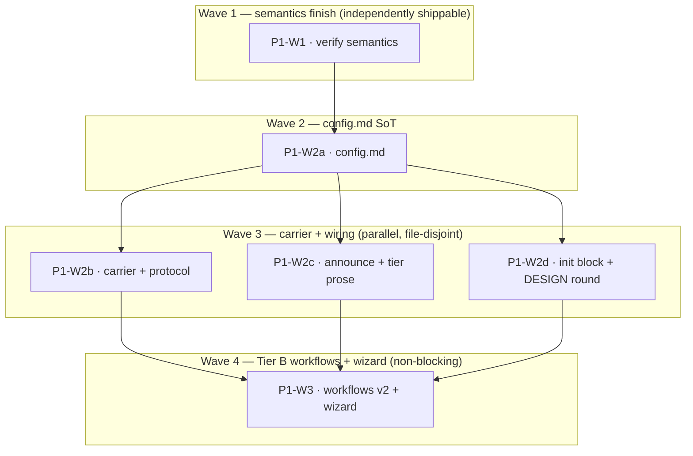

# Plan: Implement adr_0003 — configuration and customization surface

## Status

- State:   review
- Tier:    high
- Updated: 2026-07-22
- Next:    /hex-review .agents/plans/plan_adr_0003_config_surface.md

## Overview

Implement [adr_0003](../adrs/adr_0003_configuration_customization_surface.md)
(**Accepted** 2026-07-20): Option D — a frozen six-key `yaml` config block
inside `hex.md › Preferences`, single-sourced as a new
`hex-core/references/config.md`, plus forkable tier files (`workflows`) and
an interactive `/hex-init` wizard. This is **PLAN 1 of the 0003 → 0005 →
0004 reconcile sequence** (see the reconcile brief); it executes first
because it is release-blocking and establishes the Preferences/config
structure the later plans layer prose bullets onto (they never become
config keys — reconcile brief § 1, C-223 freeze reaches neither).

The ADR's [Normative specification](../adrs/adr_0003_configuration_customization_surface.md#normative-specification)
is the source of the exact `config.md` text (key vocabulary, ten merge
rules, glob semantics, phase-identifier derivation, workflow node schema,
copy-pasteable example). This plan **sequences and verifies** that text
across six work packages; it does not re-design it, and it does not restate
the C-2xx contracts (single-source discipline — `hex/DESIGN.md`).

## Objective

After execution: the six v1 config keys (`models`, `adversary`, `limits`,
`perspectives`, `research-axes`, `tiers`) are defined exactly once in
`config.md`, conditionally loaded, and honoured by all four orchestrators
via their announce blocks; the two enforcement gaps that exist today
(`min(8, max-workers)` and the `loop-rounds` ceiling) are closed and their
missing half — phase-ceiling **displacement** of preference-added spawns —
is specified in `config.md § Merge rules` (Wave 2), with `protocol.md`
pointing at it; `/hex-init` writes the block; and the constitution's four
amended decisions are recorded in a dated `DESIGN.md` round. Tier B
(`workflows` v2 + the wizard) lands last and is not release-blocking.

## Scope

### In Scope

- **New** `hex/hex-core/references/config.md` — sole definition site for
  C-203/C-204/C-205/C-206/C-217/C-218/C-219/C-220/C-222 and the C-216
  displacement procedure (Wave 2), later extended with § Workflows for
  C-208/C-209/C-221/C-223 (Wave 4).
- `protocol.md` — § Worker coordination gains a **one-line pointer** to
  `config.md § Merge rules` (rule 6) for the phase-ceiling displacement
  procedure — the procedure itself lives in `config.md`, not here (C-216,
  Wave 2; reconcile brief § 2 boundary correction); § Spawn-selection
  precedence, § Tier grammar, § The meta-plan approval gate gain
  C-204-precedence / C-206 / C-207 / C-211-scope wiring.
- `memory.md`, `hex-core/SKILL.md`, `workers.md`, `models.md` — carrier
  (C-202), conditional-load row (C-203), persona→panel pointer (C-205),
  `models.overrides` note (C-204).
- Four orchestrator `SKILL.md` announce steps + `overlays.md` +
  `hex-review/classify.md` + four `tier-*.md` — announce-block source tags,
  `perspectives`/`tiers` overlay defaults, the fail-closed refusal line
  (C-205/C-207/C-218), and `…or when a perspectives.always rule matches`
  in the fires-when prose.
- `hex-init/SKILL.md` (Step 4½ write, then the wizard), `audit.md`, the
  dogfood `.agents/memory/hex.md`, `hex/README.md`, and a dated
  `hex/DESIGN.md` round (C-202/C-208–C-215/C-221/C-223).

### Out of Scope

- **`adr_0005` / `adr_0004` interactions** — those are PLANS 2 and 3. The
  reconcile brief proved every collision with this plan is additive under
  strict order; nothing here touches `archive.md`, the `hex-review` write
  contract, or federation. C-217's frozen repo-less field set is already
  0004-safe by construction (ADR C-217; brief § 1).
- **The `hex-review` never-writes contract** — C-209 check-6's FORBIDDEN
  cell *defers* to `adr_0005`, which owns that amendment. A diff editing
  `hex-review/SKILL.md:3` / its § Constraints write contract in this plan
  is a defect (reconcile brief § 3, § 4).
- **`grim install` sync of `.claude/skills/`** — Michael's post-merge step,
  as in plan_finding_severity.
- **Classifier thresholds** (`tiers` does not reach them — ADR Open
  Question 1, recommended *no, not in v1*).

## Research

None run this plan (`research=skip`): the design came from the
`swarm-customization-and-config.md` primary artifact (spawn baseline
tables, cannot-express list, Form A/B, GSD/Spec-Kitty/OpenSpec teardowns),
`openspec-framework-analysis.md`, and `hierarchical-execution-performance.md`,
then a two-reviewer ADR pass and this reconcile sweep — all cited in
adr_0003 § Industry Context & Research. Prior art (OpenSpec v1.6.0, GSD,
Spec Kitty, GitLab Duo `fileFilters`) is in the ADR, not re-gathered here.

## Technical Approach

### Architecture Changes

None structural — the client is the runtime; no parser reads any file. The
change adds **one conditional-load reference file** (`config.md`) plus
prose/table edits to existing single-source contracts. Single-source
discipline is the whole architecture: `config.md` is the only definition
site for the key vocabulary and merge rules; every other file *points* at
it (`#`-anchor links), never restates it. `protocol.md § Worker
coordination` keeps the concurrency-cap semantics; `config.md § Merge
rules` owns the displacement *procedure* — the two are linked, not
duplicated, exactly the `DESIGN.md:36` invariant.

```
hex.md › Preferences  ──(conditional-load trigger: a fenced yaml block exists)──▶  config.md  (sole SoT)
        │                                                                              ▲
        └─ prose bullets (unfrozen carrier, C-202) below the block                     │ points, never copies
protocol.md §Worker-coord (cap batches) ──▶ config.md §Merge rules (rule 6 displaces) ─┘
four SKILL.md announce steps ── read config, print resolved set + source + refusal/warn lines
```

### Key Decisions

All made in adr_0003 (Accepted); binding here:

| Decision | Rationale (ADR) |
|---|---|
| Option D — frozen core block + forked tier files | Weighted 400/500, ties Option A but A is infeasible against the settled 5-requirement set (ADR § Weighted scoring). |
| `config.md` is **conditional-load** | Zero always-loaded cost for an unconfigured project — read only when `hex.md › Preferences` has a fenced block (ADR C-203, Quantified Impact). |
| Concurrency cap ≠ phase ceiling | Two limits the design previously conflated: the cap **batches**, the ceiling **displaces** preference-added spawns only, baseline never (C-216, merge rule 6). |
| Fail-closed security suppression via attestation | The forgetful branch must be the safe one (C-218, merge rule 5); self-reported, not a control (NFR § Security). |
| `workflows` is v2, ships Wave 4, freezes later | A key cannot be advertised frozen while unbuilt (C-223); v1 readers warn-and-ignore it (merge rule 8). |

## Constitution Deviations

`hex/DESIGN.md` is the constitution and this decision knowingly amends it.
The authoritative adjudication is
[adr_0003 § Constitution deviations](../adrs/adr_0003_configuration_customization_surface.md#constitution-deviations)
(five rows) — restating it here would violate single-source. Summary of
what lands where:

- **Four amended resolved decisions** — `DESIGN.md:63-65` (no-TOML →
  fenced yaml *inside* the markdown file), `:335-338` (security-path globs
  → the `perspectives` table), `:218-219` (tier methodology-unchanged →
  `tiers`/`workflows` rewrite layer 1), and `hex-init/SKILL.md:76-77`
  (single-gate → hex-init wizard exemption, C-211). All four are recorded
  in the dated `DESIGN.md` round, a **hard checkbox deliverable of P1-W2d**
  (reconcile brief § 4). A plan that lets this round slip is an automatic
  Request Changes.
- **`memory.md:82-84`** ("small — pointers not prose dumps") is **honoured,
  not deviated**: workflow DAGs live in their own file behind a one-line
  pointer, exactly as the rule prescribes; the block itself is bounded by
  the frozen vocabulary. No round entry needed for it.

Reconcile note: 0004's later "constraints unchanged" claim is true *only
because* this plan (and 0005 after it) leaves `hex-review`'s never-commits
half intact — the write contract is 0005's to amend. This plan's DESIGN
round appends; it amends no rule a later ADR also amends (brief § 4,
verified append-only).

## Component Contracts

The coverage join keys are **adr_0003's own contracts C-201…C-223 and
scenarios S-201…S-218**
([§ Component contracts](../adrs/adr_0003_configuration_customization_surface.md#component-contracts)).
Restating them here would violate single-source; the WP Scope cells below
cite them directly, and `config.md` *is* the landed copy of the ADR's
[Normative specification](../adrs/adr_0003_configuration_customization_surface.md#normative-specification).
Summary of the split:

- **C-201, C-216-batching** — the enforcement semantics already shipped in
  `protocol.md § Worker coordination` (verified present: `min(8,
  max-workers)` recursive + sequential batching that "never silently drops
  a perspective the tier baseline calls for"). Cited **done**; **P1-W1 is
  verify-only** (the missing displacement half is C-216-displacement, a
  Wave-2 deliverable of `config.md` P1-W2a — brief § 2 boundary correction;
  `protocol.md` gets only a pointer, added by P1-W2b once `config.md`
  exists).
- **C-203, C-204, C-205, C-206, C-217, C-218, C-219, C-220, C-222 +
  C-216-displacement** — the v1 vocabulary, the ten merge rules (incl. the
  rule-6 reduction procedure), glob/target-file-set, `tiers` resolution
  order, phase-identifier derivation, and dotted-key aliasing. Sole
  definition site `config.md`. Delivered by **P1-W2a**.
- **C-202, C-204-precedence, C-205-pointer, C-206-sentence, C-207,
  C-211-scope** — carrier + protocol/reference wiring that *points at*
  `config.md`. Delivered by **P1-W2b** (hex-core references) and **P1-W2c**
  (dispatcher announce + tier prose).
- **C-202-Step-4½, the DESIGN round, README qualification** — delivered by
  **P1-W2d** (release-blocking).
- **C-208, C-209, C-210, C-211-wizard, C-212, C-213, C-214, C-215, C-221,
  C-223** — Tier B: workflow file format/validation, dispatch interception,
  the wizard, the fork lifecycle, `Count` grammar, and the v2 vocabulary
  bump. Non-release-blocking. Delivered by **P1-W3**.

## User-Experience Scenarios

Adopted from adr_0003 S-201…S-218 (its
[Component contracts § UX scenarios](../adrs/adr_0003_configuration_customization_surface.md#component-contracts));
each is a concrete run whose announced outcome is the acceptance case.
Error/edge cases are **built into the scenario set** and are load-bearing:
S-204/S-215 (fail-closed security suppression, refused with `Error:`/`Fix:`),
S-206 (typo → one warning line, run proceeds), S-207 (workflow cycle →
fall back to shipped tier file, run completes), S-213/S-214 (cap-batching
and the merge-rule-6 displacement procedure), S-217 (stale phase reference
under a fork → ignored per entry, never relocated), S-218 (dotted-key
collision → later wins, both spellings named). S-201 (unconfigured =
byte-identical to today) is the no-regression anchor. A missing/misspelled
key is never dropped silently and never aborts a run — the announce block
is the enforcement surface (C-207).

## Parallelization

| WP | Scope | Expected Files | Size | Wave | Depends on | Review | Status |
|----|-------|----------------|------|------|------------|--------|--------|
| P1-W1 | Semantics finish **(verify-only)**: confirm C-201 (`min(8, max-workers)` recursive) and C-216-batching are present in § Worker coordination, and the `loop-rounds` ceiling in § The Review-Fix Loop (add it only if absent). **No displacement content** — that is C-216-displacement, delivered in `config.md` by P1-W2a; `protocol.md`'s pointer to it is added by P1-W2b | `hex/hex-core/references/protocol.md` (§ Worker coordination, § The Review-Fix Loop — verify; edit only if the loop-rounds ceiling is missing) | S | 1 | — | panel | merged |
| P1-W2 | *(parent rollup — computed, never launched)* | *(children below)* | L | 2* | P1-W1 | panel | merged |
| P1-W2a | config.md SoT: C-203, C-204 (ten merge rules), C-205, C-206, C-217, C-218, C-219, C-220, C-222, **C-216-displacement (merge rule 6 procedure)** — everything except § Workflows | **new** `hex/hex-core/references/config.md` | L | 2 | P1-W1 | panel | merged |
| P1-W2b | Carrier + protocol/reference wiring: C-202 (memory.md carrier), C-204-precedence + C-206-sentence + C-207-disclosure + **C-211 protocol scope sentence** (protocol.md § meta-plan gate), **C-216 pointer from § Worker coordination → `config.md § Merge rules` (rule 6)**, C-203 conditional-load row, C-205 workers.md pointer, C-204 models.overrides note | `memory.md`, `hex-core/SKILL.md`, `protocol.md` (§ Worker coordination — pointer only, § Spawn-selection precedence, § Tier grammar, § The meta-plan approval gate), `workers.md`, `models.md` | M | 3 | P1-W2a | panel | merged |
| P1-W2c | Dispatcher announce + tier prose: C-205 + C-207 (four SKILL.md announce steps + worker-assignment pointer), C-218 (fail-closed refusal line in announce), fires-when `…or when a perspectives.always rule matches` + displacement pointer | four `SKILL.md` (`### N. Announce…`, `## Worker assignment`), four `overlays.md` (§ Precedence), `hex-review/classify.md` (§ Structural marker signals), `hex-review/tier-{medium,high}.md`, `hex-execute/tier-{medium,high}.md` | M | 3 | P1-W2a | light | merged |
| P1-W2d | Init writes block + constitution: C-202 (hex-init Step 4½ machinery), **DESIGN.md round recording the four amendments (hard deliverable, incl. C-211's single-gate exemption)**, README qualification. **Dogfood block deferred to Michael's `/hex-init`** — C-202 says the yaml block is "written only by `/hex-init` with consent"; hex-execute writing it into user-owned `hex.md › Preferences` (and freezing the keys) would violate that contract. | `hex-init/SKILL.md` (Step 4½), `hex/README.md` (§ Tier grammar), `hex/DESIGN.md` (new dated round) | M | 3 | P1-W2a | panel | merged |
| P1-W3 | Tier B workflows v2 + wizard (non-release-blocking): C-208, C-209, C-210, C-211-wizard, C-212, C-213, C-214, C-215, C-221, C-223 | `config.md` (§ Workflows + `workflows` key + v1/v2 note), four `SKILL.md` (`### N. Dispatch…`), `hex-init/SKILL.md` (wizard/args/re-entrancy), **new** `hex-init/references/audit.md` items, `hex/hex.toml` + `hex/publish.toml` (verify-only) | L | 4 | P1-W2 | panel | merged |

<!-- P1-W2 is a parent rollup: Wave 2* is min of its children's waves; Status is computed (merged iff all children merged and the join check passes). Only leaf rows (P1-W2a…d) get a branch + worktree. -->



- **Critical path:** P1-W1 → P1-W2a → P1-W2{b|c|d} (whichever of the three
  parallel Wave-3 WPs finishes last) → P1-W3 — **four serialized merges**
  bound wall-clock time. The Wave-3 trio is the only parallel span.
- **Shippable after wave: 1** — P1-W1 (the Option-A semantics finish) is
  **independently shippable** (reconcile brief § 2): it closes the two
  enforcement gaps that exist today and cannot break a consumer. Ship it
  even if everything below is deferred.
- **Shippable after wave: 3** — with P1-W2a…d merged, **vocabulary v1 is
  complete**. This is the **release gate**: the six v1 key names freeze at
  the first `grim release`, so P1-W2\* MUST land before it (ADR
  one-way-door flag; brief § 2). P1-W3 (Wave 4) adds v2 `workflows` + the
  wizard and is **not release-blocking** — floated to the very end so its
  dispatch-interception edits stay off the release critical path (brief § 5
  optional refinement); nothing in PLANs 2/3 depends on it.
- **Merge order** (a valid serialized topological order): **P1-W1 → P1-W2a
  → P1-W2b → P1-W2c → P1-W2d → P1-W3**, with `grim build <changed skill
  dir>` after each merge onto the feature branch (exit 65 = validation
  failure; `config.md`'s owning dir is `hex-core`).
- **Parallelization justification:** P1-W2b/c/d are mutually file-disjoint
  (hex-core references vs the four orchestrator SKILL/overlay/tier files vs
  hex-init/dogfood/README/DESIGN) and all depend only on P1-W2a, so all
  three run in Wave 3. They are **not** folded into one WP: P1-W2a and
  everything reading it must be separate `grim build` units, and P1-W2d
  carries the panel-level DESIGN round while P1-W2c is light prose — merging
  them would raise the light work to panel for no structural reason. P1-W1
  stays a separate (near-empty) WP because its file — protocol.md
  § Worker coordination — is a **different section of the same file** P1-W2b
  edits, forcing the two apart in merge order regardless (same-file
  co-edit, disjoint sections; see Risks).
- **Review budgets:** `panel` on every protocol.md / DESIGN.md edit and on
  the new `config.md` SoT file (P1-W1, P1-W2a, P1-W2b, P1-W2d, P1-W3);
  `light` on P1-W2c (additive prose bullets and announce-tag adds across
  disjoint SKILL/overlay/tier files, each a few lines, the exact text
  pre-written in the ADR). No `self` budget — nothing here is a one-line
  link edit. The branch-level `/hex-review` before landing is the panel
  backstop (this plan's own next step).

## Implementation Steps

> **Contract-first, markdown-runtime shape:** there is no code and no test
> suite — the "executable phases" are markdown edits plus grep/`grim build`
> verification sweeps (as in plan_finding_severity). The **executable
> specification** is the S-2xx acceptance set plus the single-source
> sweeps below, written to fail on the stub/empty state. **Every WP's first
> Implement step re-anchors on a `## `/`### ` heading, never a line
> number** — the ADR's cited line numbers are already stale (adr_0006
> shifted protocol.md; brief opening).

### Phase 1: Stubs (per WP)

Public surface = heading skeletons so anchors resolve before content lands.

- [ ] **P1-W2a:** create `config.md` with its `## `/`### ` section
      skeleton only — § Carrier and placement, § Key vocabulary, § Dotted
      keys, § Perspectives, § tiers, § Phase identifiers, § Merge rules,
      § Complete example (bodies empty). The `#`-anchors other WPs link to
      (`#merge-rules`, `#perspectives`, `#phase-identifiers`, `#key-vocabulary`)
      become real. § Workflows is **not** stubbed here — P1-W3 adds it.
- [ ] **P1-W1 / P1-W2b / P1-W2c / P1-W2d:** no stub — every anchor target
      exists after P1-W2a (or already ships); edits are single-pass
      (stub+implement collapse, small-WP shape per protocol).
- [ ] **P1-W3:** append the § Workflows heading skeleton to `config.md`;
      no other stub.

Gate: `grim build ./hex/hex-core` parses the `config.md` skeleton (exit 0).

### Phase 2: Architecture Review

- [ ] **P1-W2a and P1-W3 only** (the SoT file, panel): spec-focus review
      of the `config.md` section layout against adr_0003 § Normative
      specification — every key in the vocabulary table has a home, the ten
      merge rules are present and ordered, no phase-index file is
      introduced (C-220), literal model names appear only under `models.*`.
- [ ] Skipped for P1-W1/W2b/W2c/W2d (≤5 files each, two-way-door prose):
      the per-WP Review-Fix loop's spec reviewer checks placement against
      the ADR instead.

Gate: review passes before Implement on P1-W2a / P1-W3.

### Phase 3: Specification Tests (the verification sweep, written first)

Runnable checks that fail on the stub/empty state (use `/usr/bin/grep` —
the rtk-shadowed `grep` false-negatives on multi-token regexes; the
*absence* of a hit is evidence):

- [ ] **Anchor sweep:** every `config.md` `#`-anchor referenced from
      `protocol.md`, `memory.md`, `workers.md`, `models.md`,
      `hex-core/SKILL.md`, the four `overlays.md`, `classify.md`, the tier
      files, and the four dispatch steps resolves to a real heading.
- [ ] **Single-source sweep:** the key vocabulary table, the ten merge
      rules (as a numbered ladder), the glob grammar, and the
      phase-identifier definition appear in **exactly one** file
      (`config.md`); every consumer only links. `/usr/bin/grep -rn
      'min(8' hex/` shows the *value* only in `protocol.md § Worker
      coordination` and the *displacement procedure* only in `config.md
      § Merge rules`.
- [ ] **No-phase-index sweep** (C-220): no `phases.md` or equivalent
      enumeration file ships; the tier files' own `## Phase N:` headings are
      the only index.
- [ ] **No-regression sweep** (S-201): a tree with no `hex.md` block
      produces an announce block byte-identical to today (the config lines
      print only when the block exists).
- [ ] **Contract-defer check:** `git diff` touches neither
      `hex-review/SKILL.md:3` nor its § Constraints write contract (0005
      owns that); `config.md` C-209 check-6 states the FORBIDDEN cell
      *defers* to `adr_0005`.
- [ ] `grim build` exits 0 on every changed skill dir and on `hex-core`.

### Phase 4: Implementation

Each WP's **first step is the re-anchor**. Fill from the ADR verbatim where
the ADR gives exact text (the `config.md` body is the ADR's Normative
specification; the copy-pasteable example is the ADR's fenced block).

- [ ] **P1-W1 (verify-only)** — re-anchor `## Worker coordination` in
      `protocol.md` by heading. Verify C-201 (`min(8, max-workers)`
      recursive) and C-216-batching (sequential batches, baseline never
      dropped) are already present (they are — verified at plan time). **Add
      no displacement content** — the ceiling formula and the rule-6
      displacement procedure are C-216-displacement, delivered in `config.md`
      by P1-W2a (brief § 2 boundary correction: nothing to displace until
      the `counts`/`perspectives.always` config exists), and `protocol.md`'s
      pointer to it is added by P1-W2b. Confirm § The Review-Fix Loop already
      carries the `loop-rounds` ceiling (C-201); add it **only if absent**.
      If both semantics are present and the ceiling exists, P1-W1 lands no
      edit — it is a verification gate.
- [ ] **P1-W2a** — re-anchor each `config.md` section by heading; fill with
      the ADR's Normative-specification text: key vocabulary table (six v1
      keys, `workflows` **excluded** until P1-W3), the `perspectives.always`
      rule object, glob semantics + per-skill target file set (C-217), the
      `tiers` resolution order (C-219), phase-identifier derivation (C-220),
      the ten merge rules including the rule-6 displacement procedure
      (C-216) and the fail-closed rule 5 (C-218) and dotted-key aliasing
      (C-222), and the complete example.
- [ ] **P1-W2b** — re-anchor `memory.md § The three sections` /
      § Preferences / § Example file (C-202 carrier, block is first content
      under `## Preferences`, written only by `/hex-init`, read never
      written by orchestrators); `hex-core/SKILL.md § References` (add the
      `config.md` row **marked conditional-load** — "read only when
      `hex.md › Preferences` contains a fenced yaml block"); `protocol.md
      § Spawn-selection precedence` (`tiers`/`workflows` rewrite layer 1,
      not a fourth input — C-204), `§ Tier grammar` (one qualifying
      sentence for C-206), `§ The meta-plan approval gate` (C-207 disclosure
      requirement **and** the C-211 single-gate scope sentence — the rule
      governs the four orchestrators, `/hex-init` is exempt); `§ Worker
      coordination` (**add the one-line C-216 pointer** to `config.md § Merge
      rules` rule 6 for the displacement procedure — now that `config.md`
      exists; this is a different section of the same file P1-W1 verified,
      disjoint edit); `workers.md
      § Project-local personas` (the invocation-end pointer — naming a
      persona in `perspectives.always` is how it enters a launch list,
      C-205); `models.md § Rules` (note `models.overrides` is the layer-2
      form of the documented resolution order).
- [ ] **P1-W2c** — re-anchor each `### N. Announce the resolved config`
      (hex-plan/hex-execute/hex-review number it 6, hex-architect 5 —
      anchor on the heading text, not the number). Add the new source tags,
      the `[project-redefined: …]` disclosure line, the drop/batch lines,
      and the fail-closed refusal `Error:`/`Fix:` (C-205/C-207/C-218). Add
      the one-line `config.md` count-override pointer to each `## Worker
      assignment`. Add `tiers.*.overlays` as a per-project default below
      user flags to each `overlays.md § Precedence`. Repoint
      `classify.md § Structural marker signals`' `hex.md › Preferences`
      path-hint row at the `perspectives` rules. In each fires-when block
      (`hex-review/tier-{medium,high}.md § Phase 3 Stage 2`,
      `hex-execute/tier-{medium,high}.md § Phase 6 Review-Fix Loop`) add
      "…or when a `perspectives.always` rule matches"; high-tier files gain
      the merge-rule-6 displacement pointer.
- [ ] **P1-W2d** — re-anchor `hex-init/SKILL.md` between `### 4.
      Instantiate the model matrix` and `### 5. Bootstrap …` and insert
      **Step 4½** writing the block with consent (C-202; the batched-consent
      shape today, upgraded to the wizard in P1-W3). Add the block to the
      dogfood `.agents/memory/hex.md § Preferences`. Qualify
      `README.md § Tier grammar`'s "one shared grammar" (the vocabulary is
      shared; per-tier content is project-overridable and always announced).
      **Append the dated `DESIGN.md` round** (hard deliverable) recording
      the four amendments (`:63-65`, `:335-338`, `:218-219`,
      `hex-init/SKILL.md:76-77`) and what each supersedes; note
      `memory.md:82-84` is honoured not deviated.
- [ ] **P1-W3** — append `config.md § Workflows` (node schema, `Count`
      grammar, edge semantics, the seven validation checks — check 6's
      required-phase invariant **reads the shipped tier file's own `##
      Phase N:` headings at validation time**, C-220/C-221, not a static
      list — the fork lifecycle) and the `workflows` key + v1/v2 note
      (C-223). Re-anchor each `### N. Dispatch to the tier file` (hex-plan/
      execute/review 7, architect 6): read `workflows.<skill>.<tier>`
      first, shipped `tier-<tier>.md` otherwise, announce which (C-210).
      Upgrade `hex-init/SKILL.md` into the wizard (C-212), add the
      non-interactive twin (C-213). **C-213 anchor note:** the ADR names
      C-213's home as `hex-init/SKILL.md § arguments`, but no `## Arguments`
      heading exists today (verified — the text is prose beginning "The
      arguments may name a specific concern to focus the run on…" just before
      the `$ARGUMENTS` placeholder, under `## Structure`). This is the one
      contract whose ADR-cited home is not yet a heading: **add a `##
      Arguments` heading** at that paragraph and place the `--yes` /
      `-d key=value` documentation under it (do not silently anchor on
      unheaded prose). Then the `workflows` positional concern + re-entrancy
      (C-214/C-215). Add `audit.md` items (block parseable,
      forks resolve, stamps match). **Verify** `hex.toml`/`publish.toml`
      need no `config.md` row (confirmed at plan time: they enumerate skill
      paths, not reference files) — a no-op unless that changed.

Gate: all Phase-3 sweeps green on the final state; `grim build` exits 0 on
every changed dir.

### Phase 5: Review & Documentation

- [ ] **Step 5.1:** Per-WP review at its budget (panel for
      protocol/DESIGN/config; light for P1-W2c) — edits match the ADR text,
      no unrequested drift, every link resolves, `config.md` remains the
      sole definition site.
- [ ] **Step 5.2:** Announce-block self-check dry-run: walk S-202/S-203/
      S-213/S-214/S-204/S-215 by hand and confirm the resolved announce
      lines match the ADR scenario text (the pre-print re-verification of
      merge rules 4–7 is the check on the check).
- [ ] **Step 5.3:** Run the full Phase-3 sweep on the merged feature
      branch; the change *is* the documentation.

## Dependencies

### Code Dependencies

None — pure markdown; `grim` (installed) is the only tool.

### Service Dependencies

None.

## Rollback Plan

1. Pre-merge: delete the feature branch.
2. Post-merge: `git revert` the feature-branch merge. Wave 1 (P1-W1) is
   unconditional and safe to keep. Wave 2 rolls back by deleting
   `config.md` and any block — every consumer degrades to prose bullets.
   Wave 4 rolls back by deleting the `workflows` key — every fork degrades
   to the shipped tier file, which is already the failure path.
3. No data, no migrations, no installed-state coupling: `.claude/skills/`
   copies change only when Michael runs `grim install`, outside this plan.

## Risks

| Risk | Mitigation |
|------|------------|
| Line drift between plan and execution | Every WP's first Implement step re-anchors on a heading; all anchor headings verified present (or `config.md` verified absent) at plan time. |
| `protocol.md` same-file co-edit across waves | P1-W1 (verifies § Worker coordination, usually no edit) and P1-W2b (edits § Spawn-selection precedence / § Tier grammar / § meta-plan gate **and adds the § Worker coordination pointer**) touch one file — forced sequential by merge order (W1 → W2a → W2b), which the wave graph already guarantees. The § Worker coordination pointer lands in P1-W2b (not P1-W1) because it can only exist once `config.md § Merge rules` does. Not parallelizable; noted, not a defect. |
| Contract restated instead of linked (drift seed) | The single-source sweep in Phase 3 fails if the merge rules / vocabulary appear outside `config.md`. |
| Scope creep into 0005/0004 surface | The contract-defer check (Phase 3) fails on any edit to the `hex-review` write contract; C-217's repo-less field set is already 0004-safe. |
| Announce block is self-reported, not a control | Accepted residual (ADR NFR § Security, Consequences); the pre-print merge-rule-4–7 self-check is the only mechanical guard and is normative (C-207), not a gap this plan closes. |
| DESIGN round slips | It is a hard checkbox deliverable of P1-W2d at panel review; an unrecorded amendment is an automatic Request Changes. |

## Open Questions

- [NEEDS CLARIFICATION: Does the first `grim release` land **between** Wave
  3 (P1-W2\*) and Wave 4 (P1-W3)?] Recommended: **no — the whole program
  (through P1-W3) lands before any release.** Then `workflows` is built
  before the freeze, the v1→v2 vocabulary split (C-223) is **moot and
  harmless**, and P1-W3 ships the key as normal rather than emitting a
  provisional v2 marker; the first release simply freezes the full
  vocabulary. If a release *is* cut after Wave 3 and before Wave 4,
  C-223's provisional-key handling (a v1 reader warns-once-and-ignores
  `workflows` per merge rule 8) is exactly the safety net for that window —
  so the plan needs no change either way, and the split earns its keep only
  in the release-between case.

<!-- adr_0003's own three Open Questions (tiers→thresholds; workflow file
naming; hash-vs-version stamp) are the ADR's, already recommended-resolved
there, and are not re-opened by this plan. -->

## Checklist

### Before Starting

- [ ] adr_0003 Status is Accepted (verified 2026-07-20 — it is).
- [ ] `config.md` confirmed absent (verified — `hex-core/references/` holds
      only memory/models/protocol/workers).
- [ ] Feature branch resolved (`hex/adr-0003-config-surface` from trunk, or
      an existing non-trunk branch).

### Before PR

- [ ] All Phase-3 sweeps green on the merged feature branch.
- [ ] `config.md` is the sole definition site (single-source sweep).
- [ ] `grim build` exits 0 on every changed skill dir.
- [ ] P1-W2d's `DESIGN.md` round records the four amendments.

### Before Merge

- [ ] Branch-level `/hex-review` (panel backstop) Approves.
- [ ] `task publish -- --dry-run` full sweep passes.
- [ ] No merge conflicts.

### After `grim install` (live-skill self-test — Michael's step)

Deferred past merge (the installed copies sync outside this plan):

- [ ] One configured `/hex-review` run: `perspectives.always` fires with a
      matched-glob announce line (S-202); a `never: [reviewer:security]`
      without attestation is refused (S-215).
- [ ] One unconfigured run: announce block byte-identical to today (S-201).

## Notes

- **Sequence position:** this is PLAN 1; PLAN 2 (adr_0005 fold-back) and
  PLAN 3 (adr_0004 federation) execute after it against a tree this plan
  has changed. The reconcile brief confirmed the 0003 → 0005 → 0004 order
  and that every downstream collision is additive under it.
- **C-211 is split across WPs by design:** its DESIGN amendment lands in
  P1-W2d's round, its protocol.md § meta-plan gate scope sentence in
  P1-W2b, and the wizard that exercises the exemption in P1-W3. All three
  are cited so the reviewer sees the full contract is covered, not orphaned.

---

## Progress Log

| Date | Update |
|------|--------|
| 2026-07-21 | Plan authored from adr_0003 (Accepted) + reconcile brief PLAN 1; all anchor headings verified against the shipped tree; `config.md` verified absent. State: plan-approved. |
