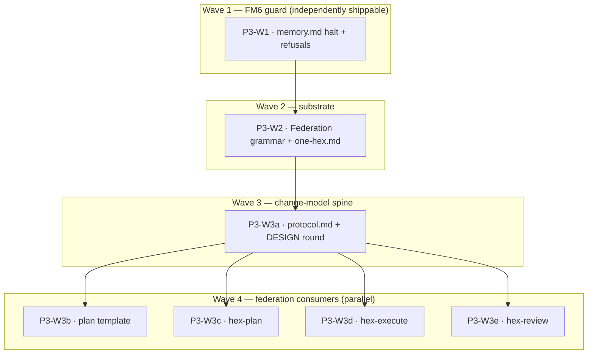

# Plan: Implement adr_0004 — cross-repo federation

## Status

- State:   plan-approved
- Tier:    high
- Updated: 2026-07-21
- Next:    /hex-execute .agents/plans/plan_adr_0004_cross_repo_federation.md

---

## Overview

Implement [adr_0004](../adrs/adr_0004_cross_repo_federation.md)
(**Accepted** 2026-07-20): Option D+E — the **lead repo owns a change that
spans multiple git repos**, with Option C (pointer-only) as substrate. One
plan artifact in the lead, one Status block, one ID space; satellites get
optional `Repo`-column WP rows executed in multi-root `git -C` worktrees; the
FM6 memory split-brain becomes a **halt**. Twenty-four contracts
(**C-301…C-324**) across the whole hex bundle. adr_0004 § Normative
specification carries the exact mechanism — this plan sequences and verifies
it, it does not re-design.

This is the **third and last** plan in the `0003 → 0005 → 0004` reconcile
sequence. It executes **after** plan 1 (adr_0003, config surface) and plan 2
(adr_0005, archive fold-back) land. Two of its anchors are cross-ADR
load-bearing (see [Dependencies](#dependencies)) — do not execute this plan
against the pre-plan-1/2 tree.

## Objective

After execution: a hex project that declares `Federation:` pointers in the
lead's `hex.md › Pointers` can plan, execute and review a change that spans
its satellite repos as **one** artifact — one Status block, one `C-`/`S-` ID
space, one convergence check — with cross-repo WPs run in parallel `git -C`
worktrees, merged in one global topological order, each verified by its
**owning** repo's documented command. A satellite-cwd run that would silently
resolve the wrong memory **halts** (FM6, the highest-severity item, closed
structurally by C-323). Every rule is **vacuous** when the pointers and the
`Repo` column are absent: a single-repo project runs byte-identically.

## Scope

### In Scope

- `hex/hex-core/references/memory.md` — the FM6 halt (`Error:`/`Fix:`) as the
  **sole definition site** (§ Location and resolution); the `Federation:`
  pointer grammar and one-`hex.md`-the-lead's rule (§ The three sections,
  § Example file, § Destination of knowledge). C-301, C-308, C-313, C-318,
  C-323.
- `hex/hex-core/references/protocol.md` — the change-model contracts across
  eight existing sections (§ Worktree work-package mechanics, § The meta-plan
  approval gate, § Convergence contract, § Verification, § Parallel-by-default
  decomposition, § Worker coordination, § Constitution gate, § Upkeep step).
  C-302…C-307, C-310, C-311, C-315…C-322, C-324.
- `hex/DESIGN.md` — one new dated round recording the **four** amendments +
  the new class of write (constitution; hard deliverable of P3-W3a).
- The four orchestrator `SKILL.md` files + `hex-architect/SKILL.md` — the
  one-line resolve-memory halt link (C-308); the C-323 target-resolution
  refusal (hex-execute, hex-review); federation behaviour in
  hex-plan / hex-execute / hex-review dispatch, tier files and templates.
- `hex/hex-init/assets/templates/plan.md` — the `Repo` column, the `Repos:`
  ledger and the `landing` State (C-302, C-311, C-317, C-324).
- `hex/hex-init/references/audit.md` — the back-pointer lifecycle and
  Federation-path audit items (C-301, C-313).

### Out of Scope

- `hex/hex-core/references/config.md` (adr_0003 / plan 1) and
  `hex/hex-core/references/archive.md` (adr_0005 / plan 2) — **adr_0004 touches
  neither** (verified absent in the current tree; both are earlier plans'
  single-owner files). A diff touching either is a defect.
- Any `Federation:` bullet in **arcana's own** `hex.md` — arcana is
  single-repo; the dogfood instance is `ocx`'s, written when the first
  federated plan runs there (adr_0004 § Migration, last table row).
- No sync, clone, fetch, pull, push, daemon, scanner, manifest, second
  distribution channel, per-repo plan copy, cross-repo ID namespacing, fourth
  join level, or per-repo `/hex-execute` (adr_0004 § Explicitly not built).
- FM7 (atomic cross-repo landing) and the FM2/FM8 residues — **deliberately
  not solved**; named and bounded, not built (adr_0004 § Consequences).
- The `.claude/skills/` install sync (`grim install`) — Michael's post-merge
  step.

## Research

None run this plan (`research=skip`): the design is a single Accepted ADR
built on ~20 surveyed mechanisms
([`spec-federation-multi-repo.md`](../research/spec-federation-multi-repo.md))
plus its own two-reviewer pass, all 2026-07-20. Prior art that constrains the
answer (OpenSpec Stores double-root refusal, Gerrit Topics, repo-of-repos) is
cited in adr_0004 § Industry Context.

## Technical Approach

### Architecture Changes

No structural change to the bundle: federation rides constructs hex already
owns — `hex.md › Pointers` bullets, one plan-table column, git branches, a
git trailer, and the WP Status block. **Single-source discipline**
(`DESIGN.md:36`, binding): each layer *links* to the contract the layer below
defines and never restates it. Three definition sites, each linked from
everywhere it is used:

- **memory.md § Location and resolution** — sole home of the FM6
  `Error:`/`Fix:` halt text (C-308). The four `SKILL.md` resolve-memory steps
  add **one link-line each**, never a copy.
- **memory.md § Pointers / § The three sections** — sole home of the
  `Federation:` pointer grammar (C-301) and the one-`hex.md`-the-lead's rule
  (C-318).
- **protocol.md § Worktree work-package mechanics** — sole home of the
  pre-flight *invariant* (C-303) and the worktree/merge/trailer contracts;
  the step-by-step *procedure* lives in `hex-execute/SKILL.md` and
  cross-references it.

### Key Decisions

All made in adr_0004 (Accepted); binding here, not re-opened:

- **Lead owns the change; one artifact, one Status block, one ID space**
  (Option D+E over A/A′/B/C/F). FM1/FM3/FM4/FM5 answered with existing
  constructs; FM6 becomes a halt; FM7/FM8 named, not solved.
- **The FM6 guard is structural (C-323), not the back-pointer.** A run is
  federated *only if its own resolved `hex.md` carries `Federation:` bullets*;
  a `Repo`-column plan reached by a run without them **halts**. C-308's bullet
  is the earlier, better-worded refusal and C-313's GC marker — a convenience,
  not the guarantee.
- **Repo identity probe is `--git-common-dir`, not `--show-toplevel`**
  (`ocx-evelynn` is a worktree of `ocx`, not a repo); satellites branch from
  their **own trunk**, discovered never assumed; the Federation block is
  **bullets under `## Pointers`**, not a new `## Federation` section — the
  three ADR corrections to the research.
- **The disjointness key is `(Repo, path)`** (C-316); **N frozen bases, all
  resolved at execution start** and written as full SHAs in the plan's
  `Repos:` ledger (C-317, C-324); a **`landing`** State holds the plan open
  across the broken-integration window so satellite locks outlive it (C-324).
- **No model names anywhere** (capability classes preserved); **hex never
  pushes**, in every repo.

## Constitution Deviations

The plan lands the deviations **adr_0004 already adjudicated** — restating
them here would violate single-source. See
[adr_0004 § Constitution deviations](../adrs/adr_0004_cross_repo_federation.md#constitution-deviations):
four amended `DESIGN.md` decisions (one-feature-branch-per-plan generalized to
one-per-repo-sharing-a-slug; the satellite branch-origin suspension; the
plan-visualization column set gains `Repo`; the file-set intersection check
keyed on `(Repo, path)`), one **new class of write** (into a repo the session
did not start in), and one gate-timing deviation (C-303's self-undoing write
probe precedes the single approval gate but consents to nothing and is
disclosed *in* the gate echo). **P3-W3a carries the `DESIGN.md` round that
records all four amendments + the new-write class as a hard, checkbox-level
deliverable** — a plan that lets the constitution amendment slip is an
automatic Request Changes. The plan introduces nothing beyond the ADR's
mechanism.

## Component Contracts

The coverage join keys are **adr_0004's own contracts C-301…C-324 and
scenarios S-301…S-327**; restating their text here would violate single-source
(`DESIGN.md:36`). See
[adr_0004 § Component contracts](../adrs/adr_0004_cross_repo_federation.md#component-contracts).
The WP Scope cells below cite the IDs directly. Summary of the split by wave:

- **C-308, C-313, C-323** — the FM6 guard: back-pointer grammar + canonical
  halt (memory.md, sole site), lifecycle, and the lead-originated fail-closed
  refusal. Delivered by **P3-W1** (independently shippable).
- **C-301, C-318** — the substrate: `Federation:` pointer grammar and the
  one-`hex.md`-the-lead's cross-repo memory-ownership rule. Delivered by
  **P3-W2**.
- **C-302…C-307, C-310, C-311, C-315…C-322, C-324** — the change-model
  contracts stated in protocol.md, plus the `DESIGN.md` round. Delivered by
  **P3-W3a** (the spine).
- Their **procedures / templates / dispatch surfaces** — plan template
  (**P3-W3b**: C-302, C-311, C-317, C-324), hex-plan (**P3-W3c**: C-314,
  C-316, C-318), hex-execute (**P3-W3d**: C-303, C-305…C-308, C-312, C-313,
  C-317, C-318, C-321, C-324), hex-review (**P3-W3e**: C-309, C-320, C-324).

Every C-301…C-324 appears in at least one WP Scope cell (coverage table under
[Parallelization](#parallelization)); no contract is unplaced.

## User-Experience Scenarios

Adopted verbatim from adr_0004 **S-301…S-327**; see
[adr_0004 § Component contracts (UX scenarios)](../adrs/adr_0004_cross_repo_federation.md#component-contracts).
Grouped by covering WP (the join key, not restated):

| Group | Scenarios | Covering WP |
|---|---|---|
| Guard / vacuous single-repo | S-301, S-306, S-307, S-316, S-322 | P3-W1 (+ S-301 cross-cutting) |
| Planning-side decomposition | S-302, S-309, S-317, S-320, S-321, S-326 | P3-W3c |
| Execution: pre-flight, worktrees, merge, landing, lifecycle | S-303, S-304, S-305, S-308, S-311, S-312, S-314, S-315, S-319, S-323, S-324, S-325, S-327 | P3-W3d |
| Review: union diff, pre-flight | S-310, S-313, S-318 | P3-W3e |

Error cases are first-class here (halts, not degrades): S-303 (no `--add-dir`
→ halt before any worktree), S-304 (`--git-common-dir` collision → refuse),
S-305 (enclosing-repo walk-up → refuse), S-318/S-325 (partially
readable/writable cluster → halt before any write), S-326 (no trunk → halt and
ask). The **general error posture** is adr_0004's driver: *halt, never
degrade* — a skill cannot grant itself directories mid-session, so it stops
with a pasteable relaunch line.

## Parallelization

| WP | Scope | Expected Files | Size | Wave | Depends on | Review | Status |
|----|-------|----------------|------|------|------------|--------|--------|
| P3-W1 | FM6 guard: back-pointer grammar + **canonical `Error:`/`Fix:` halt** (sole site), lifecycle, lead-originated fail-closed refusal + target-resolution refusals (C-308, C-313, C-323); the four resolve-memory link-lines; audit item | `hex/hex-core/references/memory.md` (§ Location and resolution), `hex/hex-plan/SKILL.md` (§ Dispatch 1), `hex/hex-execute/SKILL.md` (§ Dispatch 1, § Dispatch 2), `hex/hex-review/SKILL.md` (§ Dispatch 1, § Dispatch 2), `hex/hex-architect/SKILL.md` (§ Dispatch 1), `hex/hex-init/references/audit.md` | S | 1 | — | panel | pending |
| P3-W2 | Substrate: `Federation:` pointer grammar (sole site) + one-`hex.md`-the-lead's cross-repo memory ownership (C-301, C-318); Federation-path audit item | `hex/hex-core/references/memory.md` (§ The three sections, § Example file, § Destination of knowledge), `hex/hex-init/references/audit.md` | S | 2 | P3-W1 | panel | pending |
| P3-W3a | **Spine** — the change-model contracts in protocol.md (C-302, C-303, C-304, C-305, C-306, C-307, C-310, C-311, C-315, C-316, C-317, C-318, C-319, C-321, C-322, C-324) **+ the `DESIGN.md` round** (4 amendments + new-write class) | `hex/hex-core/references/protocol.md` (§ Worktree work-package mechanics, § The meta-plan approval gate, § Convergence contract, § Verification, § Parallel-by-default decomposition, § Worker coordination, § Constitution gate, § Upkeep step), `hex/DESIGN.md` (§ Worktrees, § Two-layer knowledge model) | L | 3 | P3-W2 | panel | pending |
| P3-W3b | Plan template: `Repo` column + per-repo integration-WP table shape + `Repos:` ledger + `landing` State (C-302, C-311, C-317, C-324) | `hex/hex-init/assets/templates/plan.md` (§ Parallelization, § Status) | S | 4 | P3-W3a | light | pending |
| P3-W3c | hex-plan federation: Discover reads `Federation:` bullets, Decompose offers per-repo WPs + integration row + `(Repo, path)` waves, explicit-read satellite rules (C-314, C-316, C-318) | `hex/hex-plan/SKILL.md` (§ The plan artifact), `hex/hex-plan/tier-{low,medium,high}.md` (§ Phase 1 Discover, § Phase 5 Decompose) | M | 4 | P3-W3a | light | pending |
| P3-W3d | hex-execute federation: C-303 pre-flight procedure (6 clauses, write probe, trunk discovery, barrier, echo), `Repos:` ledger, satellite worktrees from frozen SHA, back-pointer write, `git -C` merge + per-owning-repo verify + trailer, landing enumeration, slug removal on `done`, workspace-scope gates (C-303, C-305, C-306, C-307, C-308, C-312, C-313, C-317, C-318, C-321, C-324) | `hex/hex-execute/SKILL.md` (§ Dispatch 1/2, § The plan artifact, § Work packages, § Handoff), `hex/hex-execute/tier-{low,medium,high}.md` (§ Phase 7/8 Merge and commit, § Upkeep and handoff, § Phase 1 Discover), `hex/hex-execute/tier-high.md` (Phase 2 + Phase 5 gates) | L | 4 | P3-W3a | panel | pending |
| P3-W3e | hex-review federation: union-diff scope, C-320 read pre-flight, Approve→`landing` (C-309, C-320, C-324) — **built on the post-plan-2 write contract** | `hex/hex-review/SKILL.md` (§ Dispatch 2 target/baseline, § The review report, § Constraints) | M | 4 | P3-W3a | panel | pending |

- **Critical path:** P3-W1 → P3-W2 → P3-W3a → **P3-W3d** (hex-execute is the
  heaviest wave-4 WP: the C-303 pre-flight, the new class of write, the
  back-pointer and ledger — 11 contracts, `panel`). Bounds wall-clock time.
- **Shippable after wave: 1.** P3-W1 alone converts today's **silent** FM6
  split-brain into a halt (structurally via C-323, with a better message
  wherever C-308's bullet exists) for a handful of sentences and no new
  capability — adr_0004 § Migration Wave 1 ("ships even if everything below is
  rejected"). The full federation change model ships after **wave 4**.
- **Merge order:** serialized topological — P3-W1, P3-W2, P3-W3a, then
  P3-W3b / P3-W3c / P3-W3d / P3-W3e (built in parallel, merged one at a time
  onto the feature branch in any topological order among them), with
  `grim build <bundle-dir>` after each merge on every touched bundle
  (hex-core, hex-plan, hex-execute, hex-review, hex-init, hex-architect).
- **Parallelization justification (fewer parallel WPs than file-disjointness
  allows).** Waves 1→2→3 are one WP each and P3-W2/P3-W3a and P3-W3a/its
  consumers are **file-disjoint** (memory.md vs protocol.md+DESIGN vs
  template/hex-plan/hex-execute/hex-review) — yet serialized by a
  **single-source link dependency**, not a file collision: each layer *links*
  the contract the previous layer defines (protocol.md's C-318/C-316/C-310
  clauses link the `Federation:`/one-`hex.md` grammar P3-W2 establishes;
  P3-W3b/c/d/e link the protocol.md contracts P3-W3a states). Landing a
  consumer before its definition exists dangles the link — the same discipline
  as the finding-severity plan ("consumers' links dangle until the section
  exists"). Within wave 4 all four consumer WPs run in parallel (maximum
  file-disjoint parallelism; plan.md, hex-plan/\*, hex-execute/\*,
  hex-review/\* share no file). P3-W1↔P3-W2 additionally *do* collide on
  memory.md and audit.md, so that edge is forced regardless.

## Implementation Steps

> **Contract-first, markdown-adapted** (per the finding-severity precedent):
> markdown has no compiler or test suite — the AI client is the runtime. Phase
> 1 inserts heading skeletons/anchor slots; Phase 3's "tests" are the
> **Validation sweep** (grep + `grim build`), written **before** Implement so
> it fails on the stub state; Phase 4 fills with adr_0004's normative text;
> Phase 5 reviews per the WP's budget.

### Phase 1: Stubs (per WP) — and the re-anchor discipline

**Every WP's first Implement action is a re-anchor** — this plan executes
against a tree plans 1 and 2 have already modified, so cited line numbers are
stale by construction. For each file below, **locate § `<Heading>` by its
`## `/`### ` heading, never a line number**, then edit in place.

- [ ] **P3-W1:** in `memory.md`, add the `Federation lead:` back-pointer +
      `Error:`/`Fix:` halt subsection skeleton under § Location and resolution
      (the sole definition site → its `#location-and-resolution` anchor becomes
      the link target). Add the empty one-line halt-link slot to each of the
      four `### 1. Parse arguments and resolve memory` steps (hex-plan,
      hex-execute, hex-review, hex-architect) and the C-323 refusal slot to
      hex-execute/hex-review `### 2. Resolve the target[ and baseline]`.
- [ ] **P3-W2:** in `memory.md`, add the `Federation:` bullet slot to the
      Pointers row (§ The three sections) and the example hex.md (§ Example
      file), and the one-`hex.md` clause slot to § Destination of knowledge.
- [ ] **P3-W3a:** in `protocol.md`, add the `Repo`/pre-flight/branch/worktree/
      merge/trailer clause slots under § Worktree work-package mechanics and
      the one-clause slots in the seven other sections. **Re-anchor
      § Worker coordination on plan 1's shipped `min(8, max-workers)`
      sentence** (adr_0003 C-201) and build C-318's `min(8, lead's
      max-workers)` cross-repo clause onto it. Append a **new dated round**
      skeleton to `DESIGN.md` (§ Worktrees / § Two-layer knowledge model).
- [ ] **P3-W3b:** in `plan.md`, add the `Repo` column to the § Parallelization
      table + one comment line, and the `Repos:` sub-block + `landing` step
      slot to § Status. **C-316 note:** the ADR's Home column for C-316 (the
      `(Repo, path)` disjointness key) also names plan.md's § Parallelization
      comment, but the Migration Wave 3 table for plan.md does not — treat the
      Migration table as authoritative for file-level scope here (C-316's
      substance is the plan-time set-intersection in `protocol.md`, P3-W3a;
      the plan.md comment need only mention that disjointness is keyed on
      `(Repo, path)`, one clause on the same comment line).
- [ ] **P3-W3c:** in the three `hex-plan/tier-*.md` § Phase 1 Discover and
      § Phase 5 Decompose, and `hex-plan/SKILL.md` § The plan artifact, add the
      federation-clause slots.
- [ ] **P3-W3d:** in `hex-execute/SKILL.md` § Dispatch and § Work packages add
      the pre-flight-procedure / ledger / worktree / back-pointer slots; in the
      tier files § Merge and commit / § Upkeep and handoff / § Phase 1 Discover
      the `git -C` / trailer / slug-removal slots; locate the two tier-high
      gates by the phrase **"across the whole workspace"** (Phase 2 Stub, Phase
      5 Implement) for the C-321 scoping.
- [ ] **P3-W3e:** in `hex-review/SKILL.md`, locate § The review report and
      § Constraints **by heading**. **Re-anchor on the post-plan-2 state**:
      adr_0005 has already added the Fold-Back write and re-scoped the
      Review-only contract — build C-309's "union across every participating
      repo" and C-324's Approve→`landing` onto *that* text, **never** restate
      the ADR's stale `:278-282` cite.

Gate: `grim build` parses every touched bundle against the stubs (structure
only; no dangling links introduced yet).

### Phase 2: Architecture Review

Review the stubs against adr_0004 § Normative specification (`reviewer`, focus
`spec`, `post-stub`): every new anchor slot sits under the heading the ADR's
"Home / changed file" column names; the single-source sites (memory.md halt,
memory.md grammar, protocol.md invariant) have exactly one home; the `DESIGN.md`
round skeleton names all four amendments.

Gate: review passes before Implement. **Mandatory for P3-W3a and P3-W3d**
(both touch >3 files and carry the constitution / new-class-of-write surface);
optional for the ≤3-file WPs.

### Phase 3: Specification Tests — the Validation sweep

Written **before** Implement, must fail on the stub state (`/usr/bin/grep` —
the rtk proxy false-negatives multi-token regexes; always use the absolute
path):

- [ ] **Anchor sweep:** every new cross-file link resolves — the four
      `SKILL.md` halt-links and the C-323 refusals point at
      `memory.md#location-and-resolution`; the tier-file and template clauses
      that cite protocol.md resolve to a real section.
- [ ] **Single-source sweep (the load-bearing check):** the `Error:`/`Fix:`
      halt block appears as *text* in **exactly one file** (`memory.md`); the
      four resolve-memory steps only **link** it (grep the `Error: this repo is
      a federation satellite` line → 1 hit, in memory.md). Same for the
      `Federation:` pointer grammar (defined once in memory.md § three
      sections; protocol.md and skills reference it). Four copies of the halt is
      exactly the copy-drift `DESIGN.md:36` forbids.
- [ ] **Vacuous sweep:** every new rule is guarded — grep that each new clause
      is conditioned on "carries a `Repo` column" / "if the resolved `hex.md`
      carries a `Federation:` bullet". A plan with no `Repo` column and a repo
      with no `Federation:` bullet must be byte-identical (S-301).
- [ ] **DESIGN.md round present:** a new dated round in `DESIGN.md` records all
      **four** amendments (one-branch-per-plan generalization, satellite
      branch-origin suspension, `Repo` column, `(Repo, path)` key) **and** the
      new-write class (grep the round header + the four amendment lines).
- [ ] **Out-of-scope contract check:** `git diff --stat` is clean on
      `hex-core/references/config.md` and `hex-core/references/archive.md`
      (adr_0004 owns neither); no new `Federation:` bullet lands in arcana's own
      `.agents/memory/hex.md`.
- [ ] `grim build ./hex/hex-core`, `./hex/hex-plan`, `./hex/hex-execute`,
      `./hex/hex-review`, `./hex/hex-init`, `./hex/hex-architect` each exit 0.

Gate: the sweep parses and **fails** against the stubs (links dangle, halt text
absent).

### Phase 4: Implementation (per WP)

Fill each slot with adr_0004's normative text; no new requirement is invented —
if the ADR is silent, update the plan's design record, do not improvise.

- [ ] **P3-W1:** memory.md § Location and resolution — the back-pointer grammar
      (incl. the plan-slug list), the canonical `Error:`/`Fix:` block, the
      `/hex-init` exemption (C-308), the removal lifecycle (C-313), and C-323
      stated alongside; the four resolve-memory **one-line links**; the
      hex-execute/hex-review C-323 target-resolution refusals; the audit item
      (C-313, at § Existing `hex.md › Pointers` … still resolve?).
- [ ] **P3-W2:** memory.md Pointers row + example (C-301 grammar, pointer-not-
      literal verification clause), § Destination of knowledge (C-318 one-
      `hex.md`, `Preferences`/`Pointers`/`Memory` all the lead's, no cross-repo
      merge/precedence rule); the Federation-path audit item.
- [ ] **P3-W3a:** the sixteen protocol.md contracts across the eight sections
      (per adr_0004 § Migration Wave 3), and — **hard, checkbox-level
      deliverable** — the `DESIGN.md` round recording the four amendments + the
      new-write class + the one Two-layer-model clause (Layer 2 stays one file
      per repo; a federated run reads the lead's and reaches satellites via
      Layer 1). **Do not mark P3-W3a merged without the `DESIGN.md` round.**
- [ ] **P3-W3b:** plan.md `Repo` column (2nd position, default `.`, sub-WP
      inheritance), the integration-WP per-repo table shape, the `Repos:`
      sub-block and the `review → landing → done` step in the § Status comment.
- [ ] **P3-W3c:** hex-plan Discover reads `Federation:` bullets, Decompose
      offers per-repo WPs + the mandatory integration row + `(Repo, path)`
      wave-cutting; SKILL § The plan artifact — federated plan lives in the
      lead, active-plan pointer in the lead only; tier-medium/high explicit-read
      of satellite rules.
- [ ] **P3-W3d:** the C-303 pre-flight (six clauses, self-undoing write probe,
      trunk discovery order, `(vi)` worktree-ignore, barrier semantics, per-key
      echo, halt/relaunch); the `Repos:` ledger written pre-gate and read on
      resume; satellite worktree from the frozen SHA + lazy uncommitted
      back-pointer into the satellite's main checkout; `git -C <repo> merge` +
      per-owning-repo explicit-`Read` verification + `Hex-Plan:` trailer; the
      `landing` enumeration and per-row landing confirmation
      (`merge-base --is-ancestor`), slug removal only on `done`; the two
      tier-high gates scoped to the running repo's workspace (C-321).
- [ ] **P3-W3e:** union-diff scope (`git -C <repo> diff <base>...hex/<slug>`
      over the lead + every distinct `Repo`, `<base>` from the `Repos:`
      ledger); the C-320 read pre-flight (clauses (i)/(ii) + read, **no**
      writability check) halting before a silently narrower union; the Approve
      verdict sets `landing` (not `done`) on a `Repo`-column plan; the
      stay-in-scope bullet gains "…across every participating repo" — all built
      on plan 2's already-amended contract.

Gate: the Phase-3 sweep is green on the final state; every C-301…C-324 has its
normative text placed; `grim build` exits 0 on all six bundles.

### Phase 5: Review & Documentation

- [ ] **Step 5.1:** per-WP review at the tabled budget (`panel` for P3-W1,
      P3-W2, P3-W3a, P3-W3d, P3-W3e; `light` for P3-W3b, P3-W3c) — spec focus:
      text matches the ADR, single-source holds, no unrequested drift, links
      resolve, every rule vacuous single-repo.
- [ ] **Step 5.2:** the branch-level `/hex-review high` before landing is the
      panel backstop for the whole federation surface (cross-cutting,
      one-way-door); confirm the `DESIGN.md` round is present and the four
      amendments are individually recorded.
- [ ] **Step 5.3:** no separate doc pass — the change **is** documentation.

## Dependencies

**Cross-ADR ordering (load-bearing — this plan is third of three):**

- **Plans 1 (adr_0003) and 2 (adr_0005) must be landed first.** This plan
  executes against their post-merge tree, not the current one.
- **adr_0003 C-201 before C-318.** C-318's `min(8, lead's max-workers)` builds
  directly on plan 1's shipped `min(8, max-workers)` sentence in protocol.md
  § Worker coordination — P3-W3a's edit **lands on that sentence** (re-anchor,
  Phase 1).
- **adr_0005 before adr_0004 is load-bearing at hex-review** (reconcile brief
  §3/§4/§5). adr_0004's "hex-review Constraints unchanged" claim is true **only
  because** plan 2 landed first and added *only* the Fold-Back write while
  leaving never-commits intact. Plan 2 amends the write contract
  (§ The review report / § Constraints, currently `:291-293` / `:299-301` /
  stay-in-scope `:311-313`); **P3-W3e anchors on that post-plan-2 heading
  state**, never the ADR's quoted `:278-282`. Executing P3-W3e against the
  pre-plan-2 tree would either duplicate or contradict the Fold-Back write.

### Code Dependencies

None — pure markdown; `grim` (installed) is the only tool. `git -C` behaviour
is a runtime property exercised by federated projects, not a build dependency
of this plan.

### Service Dependencies

None.

## Rollback Plan

Per adr_0004 § Migration (Rollback), aligned to the waves:

1. Pre-merge: delete the feature branch.
2. Post-merge, guard only (P3-W1/W2): delete the bullets/halt text — a
   single-repo project was never touched.
3. Post-merge, full model: `git revert` the feature-branch merge, or delete the
   `Repo` column and the protocol.md sections. Any plan carrying a `Repo`
   column then degrades to a lead-local plan whose satellite rows are executed
   by hand — which is Option F, the documented default. **The failure path is
   the baseline.** No data, no migrations; installed `.claude/skills/` copies
   change only on `grim install` (Michael's step).

## Risks

| Risk | Mitigation |
|------|------------|
| **Line drift** between plan and execution (plans 1+2 already shifted every cite) | Every WP re-anchors on headings, never line numbers (Phase 1); verified the current tree's headings at plan time. |
| **Halt text copied into the four skills** instead of linked (`DESIGN.md:36` drift) | Single-source sweep (Phase 3): the `Error:`/`Fix:` block must grep to exactly one file. |
| **P3-W3e built on the wrong (pre-plan-2) contract** | Explicit re-anchor + dependency note; the branch is the post-plan-2 tree. |
| **A new rule fires unconditionally** (breaks single-repo byte-identity) | Vacuous sweep (Phase 3); S-301/S-307/S-316/S-319 exercise it. |
| **`DESIGN.md` round slips** in P3-W3a | Hard checkbox deliverable + Phase-3 "round present" check + Step-5.2 confirmation; P3-W3a is not `merged` without it. |
| **Scope creep into config.md / archive.md** (adr_0003/0005 files) | Out-of-scope contract check: `git diff --stat` clean on both. |
| **The new class of write** (into a foreign repo) reviewed shallowly | P3-W3d is `panel`; the branch-level `/hex-review high` is the backstop; the ADR's four structural bounds (explicit paths, halting pre-flight barrier, never-push, two-item footprint) are the acceptance criteria. |

## Open Questions

- [NEEDS CLARIFICATION: Ship P3-W1 (the FM6 guard) standalone ahead of the rest
  of this plan, or bundled with waves 2–4?] Recommended: **bundled** —
  reconcile brief §6 Q2 flags it as a risk-appetite call, not a correctness
  one; P3-W1 is independently shippable and converts today's silent FM6
  split-brain into a halt, but no federated `Repo` column can exist until wave 3
  makes one possible, so the guard has nothing to guard against until then.
  Ship standalone **only if** a satellite-cwd wrong-memory run is a live risk
  before federation lands (Michael's call); default bundled keeps the whole
  change one reviewable unit.

## Checklist

### Before Starting

- [ ] adr_0004 Status is Accepted (verified 2026-07-20 — it is).
- [ ] Plans 1 (adr_0003) and 2 (adr_0005) are landed; this plan's branch is cut
      from the post-plan-1/2 tree.
- [ ] Feature branch resolved (existing non-trunk, or `hex/<plan-slug>` from
      trunk).

### Before PR

- [ ] Phase-3 Validation sweep green on the merged feature branch.
- [ ] `DESIGN.md` round present with all four amendments + the new-write class.
- [ ] Single-source sweep: the halt block and the `Federation:` grammar each
      live in exactly one file.

### Before Merge

- [ ] Per-WP reviews approved at the tabled budgets; branch-level
      `/hex-review high` Approve.
- [ ] `grim build` exits 0 on all six touched bundles.
- [ ] No diff on config.md / archive.md / arcana's own hex.md; no merge
      conflicts.

## Notes

- Wave 1 is worth shipping alone (adr_0004 § Migration); the plan keeps it a
  first, self-contained wave so that option stays open at the gate (see Open
  Questions).
- The `Repos:` ledger and `landing` State live **inside** the plan Status block
  (`DESIGN.md:242` preserved — no external state file); the 20-line Status-block
  rule costs one line per participating repo, a signal past ~10 members, not a
  constraint to engineer around (C-324, Option A′ revisit trigger).
- FM7/FM2/FM8 residues are named and priced in adr_0004 § Consequences and are
  **out of scope by decision**, recorded so the omission is not read as an
  oversight.

---

## Progress Log

| Date | Update |
|------|--------|
| 2026-07-21 | Plan authored from adr_0004 (Accepted) + reconcile brief §2 PLAN 3; anchors verified against the current shipped tree; State plan-approved, Tier high. |
