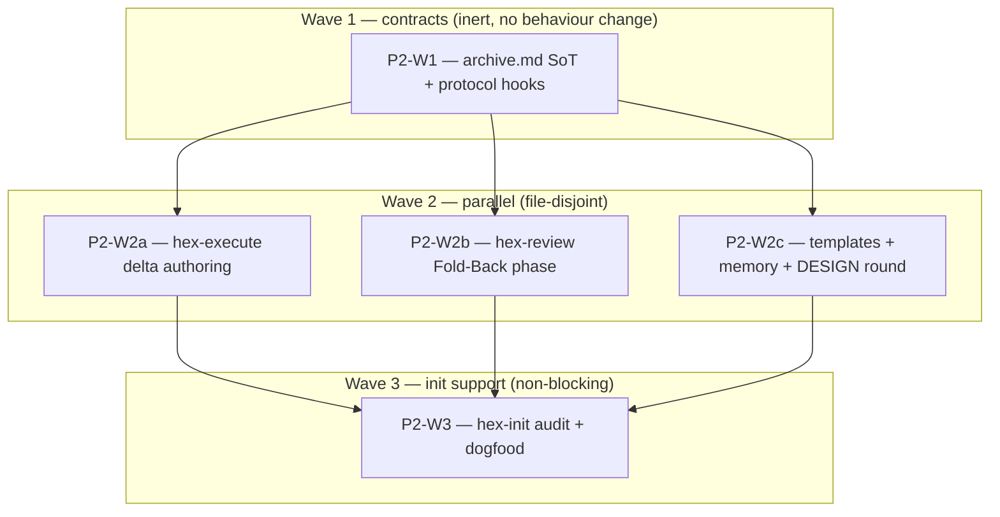

# Plan: Implement adr_0005 — terminal archive and spec fold-back

## Status

- State:   review
- Tier:    high
- Updated: 2026-07-22
- Next:    /hex-review .agents/plans/plan_adr_0005_archive_fold_back.md (rolled into the program-wide final convergence loop)

---

## Overview

**Status:** Approved
**Author:** hex-plan (opus)
**Date:** 2026-07-21
**Issue/Ticket:** N/A
**Related PRD:** N/A
**Related ADR:** [adr_0005](../adrs/adr_0005_archive_fold_back.md) (**Accepted** 2026-07-20)
**Related Spec:** N/A

Implement [adr_0005](../adrs/adr_0005_archive_fold_back.md): a terminal
**Fold-Back** phase in `/hex-review` that folds a converged, approved plan's
`## Spec Deltas` into the project's documented spec home, plus the plan
archive (the first place in the bundle that clears the `hex.md › Memory`
active-plan pointer). The design is fully settled in the ADR — its
Component-contracts table (C-401…C-419), its safety envelope, and its
Migration/rollout waves are the source. This plan sequences and verifies
that text against the **current** shipped tree; it does not re-design.

This is **PLAN 2 of the 0003 → 0005 → 0004 sequence** (reconcile brief).
It executes **after plan 1 (adr_0003, config surface) lands**. Every file
it touches is amended additively on top of plan 1's state; the reconcile
brief proved (§3) that no plan-1 text is reworked here, *only* under strict
order with each WP reading current state and anchoring on headings.

## Objective

After execution: `done` stops being a dead end. On an Approve+Converged
review of a plan carrying a `## Spec Deltas` block, hex-review resolves the
spec home, runs a printed mechanical census, and folds the deltas into the
one resolved spec file — or **defers/halts visibly** on any of eleven
conditions, writing nothing. `hex-execute` authors the deltas at merge time
per work package. hex-review's never-writes contract is amended **exactly
once, here** (0005 is its sole amender; 0003 and 0004 defer to it), and the
DESIGN.md constitution records the three amendments in a dated round.

## Scope

### In Scope

- **New** `hex/hex-core/references/archive.md` — sole definition site for
  the delta grammar, ID-marker convention, destination resolution, the
  safety envelope with its four required command invocations, halt
  semantics, idempotence, the fold receipt, and revert (C-403–C-409,
  C-413–C-418).
- `hex/hex-core/references/protocol.md` — § Convergence contract (C-412
  composition), § Traceability IDs (delta-grammar pointer), § Upkeep step
  (C-410 active-plan-pointer clear).
- `hex/hex-core/SKILL.md` — one conditional-load `archive.md` references row.
- `hex/hex-execute/SKILL.md` — new merge-time delta-authoring step (C-419).
- `hex/hex-review/SKILL.md` — the Fold-Back phase, the re-scoped write
  contract (C-401), the mandatory Fold-Back report block (C-411), the
  revert handoff line; and the three `hex-review/tier-{low,medium,high}.md`
  files stating the phase is tier-invariant (C-402).
- `hex/hex-init/assets/templates/plan.md` — `## Spec Deltas` section +
  `Related Spec:` Overview field (C-403, C-404, C-415, C-417, C-419).
- `hex/hex-init/assets/templates/spec.md:8` — one line re-scoped.
- `hex/hex-core/references/memory.md` — Preferences `Spec ID marker:`,
  Pointers spec-home pointer, Memory artifact-index entry (C-410, C-413).
- `hex/DESIGN.md` — one dated round recording the **three** amendments.
- `hex/hex-init/references/audit.md`, `hex/hex-init/SKILL.md` — the
  conditional spec-home / ID-marker / seed audit item (C-407, C-413),
  **non-blocking**.
- Dogfood: `.agents/memory/hex.md`, `CLAUDE.md` — document this
  repo's own spec home.

### Out of Scope

- **adr_0004 (federation)** — PLAN 3, executes after this. adr_0005
  **pre-wired** the `landing` terminal-review-state branch (C-402
  precondition 4, C-410) and the lead-scoped fold (C-415 clause 5) so 0004
  slots into an already-amended write contract without a rework pass
  (brief §3, §5). This plan implements those pre-wired clauses; it does
  **not** implement 0004's `Repo` column or `landing` state — those arrive
  in plan 3 and make the pre-wired clauses live.
- **The `.claude/skills/` install sync** (`grim install`) — Michael's
  post-merge step.
- **Retro-folding legacy `done` plans** — forbidden by contract (S-410):
  the phase triggers on the presence of a `## Spec Deltas` block, never on
  the `done` value.

## Research

None run this plan (`research=skip`). The design came from adr_0005's own
research (`openspec-framework-analysis.md`, `spec-federation-multi-repo.md`,
`plan-schema-evolution.md`), a three-round adversarial + cross-model
(codex) pass, and the reconcile brief's cross-ADR interaction analysis. All
prior art is cited in adr_0005 § Industry Context and § Considered Options
(A vs B/C/D/E/F, scored).

## Technical Approach

### Architecture Changes

Single-source discipline (`hex/DESIGN.md`, binding): the fold-back mechanics
are defined **once** in the new `archive.md`; every other file links to it
and never restates a rule. `archive.md` is a **conditional-load** reference
(read only when a plan carries a `## Spec Deltas` block — the same carve-out
`adr_0003` C-203 gave `config.md`). The one behaviour-bearing surface —
hex-review's write contract — is amended in a single WP (P2-W2b), and the
constitution round that authorises it lands as a hard deliverable in P2-W2c.

Load-bearing sequencing, from the reconcile brief:

- **0005 is the sole amender of hex-review's never-writes contract.** 0003
  (C-221 check-6 FORBIDDEN cell) and 0004 ("considered and not deviated")
  both explicitly defer to it. A second amender would make 0004's
  "constraints unchanged" claim false. This plan therefore owns the
  amendment and its DESIGN round outright.
- **Anchor on headings, never line numbers.** adr_0005's own cited lines
  are already stale — the brief confirmed adr_0006 shifted `protocol.md`
  (§ Upkeep step is at the `## Upkeep step` heading, not the ADR's
  `:520-532`), and hex-review's write contract is at the `## Constraints`
  bullet + the `**Review-only contract.**` paragraph, not the ADR's
  `:278-282`. Every WP's first implement step re-anchors by heading.

### Key Decisions

All made in adr_0005 (Accepted); binding here, not re-opened:

| Decision | Where adjudicated |
|----------|-------------------|
| Option A — fold in hex-review's Approve path, not a 5th skill (C) or hex-execute (B) or propose-only (F) | adr_0005 § Weighted scoring (A=436, beats C by 35, F by 26) |
| hex ships the grammar + phase, **never the destination** (Option D rejected at the gate) | adr_0005 § Context, Decision Drivers |
| `hex-execute` authors deltas at merge time per WP, with a `Base:` enumeration | adr_0005 C-419 (Open Question 1 resolved) |
| One destination per fold; multi-file is a non-goal; single whole-file write | adr_0005 C-415 (atomicity is not portable without a runtime) |
| A re-run is a retry, never a revision (fold receipt classifies) | adr_0005 C-417 |
| Terminal review state keys the fold — `done`, or `landing` for a federated plan | adr_0005 C-402 pre-cond 4, C-410 (pre-wires 0004) |

## Constitution Deviations

The three DESIGN.md amendments are **adr_0005's own**, adjudicated in
[adr_0005 § Constitution deviations](../adrs/adr_0005_archive_fold_back.md#constitution-deviations)
— restating them here would violate single-source. This plan does not
introduce any deviation beyond them; its job is to **land** them as P2-W2c's
DESIGN.md round (a hard, checkbox-level deliverable). The three:

1. `hex-review/SKILL.md` never-writes contract grows the fold write (the
   never-commits half is **not** amended and is load-bearing — C-401/C-409).
2. `spec.md:8` "no hex orchestrator produces one" → "amended by
   hex-review's fold-back phase, never created by it".
3. `DESIGN.md:32-39,:145-156` project-knowledge-is-the-project's →
   fold-back writes into project context post-gate, consent moving to where
   `/hex-init` records the spec home.

**Reviewer note (deferred finding D-5, from adr_0005's adversarial pass):**
the "Why needed" cells of amendments 2 and 3 were flagged as **circular**
("without a write path there is no fold-back" restates the premise). This is
a known, non-blocking finding. The review of *this plan* should **lean on
the "Simpler alternative rejected because" cells**, which the ADR's own
triage judged **sound on their own** (amend-not-produce is the minimum
change that admits a write path; the Handoff carve-out and pre-gate consent
were both evaluated and rejected on mechanical grounds). Do not treat the
circular "Why needed" cell as an unjustified violation — the justification
lives in the rejected-alternative column.

## Component Contracts

The coverage join keys are **adr_0005's own contracts C-401…C-419 and
scenarios S-401…S-418** — restating them would violate single-source; see
[adr_0005 § Component contracts](../adrs/adr_0005_archive_fold_back.md#component-contracts).
The WP Scope cells below cite them directly. Summary of the split:

- **C-403–C-409, C-412–C-418** — grammar, resolution, safety envelope,
  idempotence, receipt, revert, and the protocol composition/pointer/clear.
  Defined by **P2-W1** (`archive.md` is the sole definition site; protocol
  gets the C-412/C-410/C-406 pointers).
- **C-419** — the delta producer. Delivered by **P2-W2a** (`hex-execute`).
- **C-401, C-402, C-410-impl, C-411** — the phase, the re-scoped write
  contract, the report block, the archive/pointer-clear enactment.
  Delivered by **P2-W2b** (`hex-review`), which is where C-414/C-416/C-418
  surface as **printed** evidence in the mandatory Fold-Back block.
- **C-403, C-413, C-415, C-417, C-419** — their **carriers**: the plan
  template section, the spec-line re-scope, the memory examples, and the
  DESIGN round. Delivered by **P2-W2c** (templates + memory + DESIGN).
- **C-407, C-413** — init support (conditional audit item). Delivered by
  **P2-W3** (`hex-init`), non-blocking.

Every C-4xx appears in at least one WP Scope cell below; several appear in
two (a definition WP and a carrier/consumer WP), which is the single-source
pattern, not duplication.

## User-Experience Scenarios

Adopted from adr_0005 (S-401…S-418) — see
[adr_0005 § Component contracts › UX scenarios](../adrs/adr_0005_archive_fold_back.md#component-contracts).
They are the acceptance cases, exercised by the Validation sweep (Phase 3)
and the first real `/hex-review` fold after merge. Anchors:

- **S-401** happy path, **S-404/S-418** re-run vs edited-plan classification,
  **S-403/S-415** the two corruption halts (dropped ID / shrunk body),
  **S-405** dirty destination, **S-406/S-416/S-417** ambiguous/escaped/two
  targets, **S-407** not-converged (phase does not run), **S-408** S-###
  with no home, **S-402/S-413** no spec home / new component (defer, not
  halt), **S-410** legacy plan, **S-411** recovery via `/hex-init` seed,
  **S-412/S-414** marker convention (RST halt / recorded override).
- **Error cases are the point of this ADR:** every failure path is a
  visible halt or defer that writes nothing and keeps the terminal state —
  a malformed entry, a missing `Base:` line, an uncomputable target, an
  out-of-home path, or a shrunk body all stop with a printed reason and fix.

## Parallelization

| WP | Scope | Expected Files | Size | Wave | Depends on | Review | Status |
|----|-------|----------------|------|------|------------|--------|--------|
| P2-W1 | **archive.md SoT + protocol hooks.** Covers C-403,404,405,406,407,408,409,412,413,414,415,416,417,418 and C-410 (the protocol § Upkeep clear *rule*). New sole-definition `archive.md`; conditional-load references row; protocol § Convergence (C-412), § Traceability pointer, § Upkeep (C-410). | `hex/hex-core/references/archive.md` (new), `hex/hex-core/SKILL.md`, `hex/hex-core/references/protocol.md` | L | 1 | — | panel | merged |
| P2-W2a | **hex-execute delta authoring.** Covers C-419. New merge-time step beside the Living design record: append `## Spec Deltas` per WP, one block / one `Target:`, each `MODIFIED` carrying its `Base:` enumeration read from the live destination. | `hex/hex-execute/SKILL.md` | S | 2 | P2-W1 | light | merged |
| P2-W2b | **hex-review Fold-Back phase.** Covers C-401,402,411 and C-409/C-410-impl; surfaces C-414,416,418 as printed evidence. New tier-invariant Fold-Back phase; re-scoped write contract (sole amender); mandatory Fold-Back report block; revert handoff line; tier-file tier-invariance statement; Upkeep active-plan-pointer clear. | `hex/hex-review/SKILL.md`, `hex/hex-review/tier-low.md`, `hex/hex-review/tier-medium.md`, `hex/hex-review/tier-high.md` | L | 2 | P2-W1 | panel | merged |
| P2-W2c | **Templates + memory + DESIGN round.** Covers C-403,413,415,417,419 (carriers) and C-404/C-410 (memory). `## Spec Deltas` + `Related Spec:` in plan template; spec.md:8 re-scope; memory Preferences/Pointers/Memory examples; **DESIGN.md dated round (3 amendments) — hard deliverable**. | `hex/hex-init/assets/templates/plan.md`, `hex/hex-init/assets/templates/spec.md`, `hex/hex-core/references/memory.md`, `hex/DESIGN.md` | M | 2 | P2-W1 | panel | merged |
| P2-W3 | **init support (non-blocking).** Covers C-407,413. Conditional "spec home documented?" + ID-marker + seed audit item; the conditional question; dogfood this repo's spec home. | `hex/hex-init/references/audit.md`, `hex/hex-init/SKILL.md`, `.agents/memory/hex.md`, `CLAUDE.md` | S | 3 | P2-W2a, P2-W2b, P2-W2c | light | merged |

**Critical path:** P2-W1 → P2-W2b → P2-W3 (bounds wall-clock time — P2-W2b
is the heaviest wave-2 WP, the hex-review Fold-Back phase on the bundle's
hottest path; wave 3 waits on all of wave 2).

**Shippable after wave:** **2** — after P2-W2a+P2-W2b+P2-W2c the fold-back
feature is live end-to-end: `hex-execute` authors deltas, `hex-review` folds
them, the constitution records the amendment. **Wave 1 alone ships safely as
inert contracts** (`archive.md` is conditional-load and unread until the
phase exists; the protocol § Upkeep *rule* has no actor until hex-review's
Upkeep enacts it — matching adr_0005's own "Wave 1 — no behaviour change").
**Wave 3 is non-blocking** init polish; the feature works without it (an
undocumented spec home defers per C-407).

**Merge order:** a valid topological order, serialized — P2-W1, then
P2-W2a / P2-W2b / P2-W2c in any order (file-disjoint), then P2-W3 — with
`grim build <changed skill-dir>` after each merge onto the feature branch.

**Parallelization justification:**
- **P2-W1 folds three file-disjoint targets into one WP** (`archive.md`,
  `hex-core/SKILL.md`, `protocol.md`) because the protocol edits are 1–3
  line **pointers into `archive.md`** that dangle until `archive.md` exists
  (they must land after it, as sequential steps), and the `hex-core/SKILL.md`
  row is a one-line references entry — both far below the worktree overhead
  floor. Same shape as plan_finding_severity's WP1.
- **P2-W2b folds its three tier files into the SKILL.md WP** because the
  tier-file edit is a one-line "Fold-Back runs identically at every tier —
  see SKILL.md" statement each (the phase is tier-invariant, C-402), below
  the overhead floor and consuming SKILL.md's phase definition.
- **P2-W2a, P2-W2b, P2-W2c are file-disjoint and run fully in parallel**
  (hex-execute vs hex-review vs templates/memory/DESIGN) — the maximum
  parallelism the file boundaries allow. The brief's "P2-W2a and P2-W2b are
  file-disjoint → parallel" holds, and P2-W2c joins them.
- **P2-W3 depends on all of P2-W2\*** per the brief; its binding
  substantive dependency is P2-W1 (`archive.md` defines C-407/C-413) and
  P2-W2c (the memory Preferences ID-marker example the audit item mirrors),
  but it is placed in wave 3 behind the whole of wave 2 as the brief's
  non-blocking tail.

## Implementation Steps

> **Contract-first, no code:** arcana is markdown-only — the AI client is
> the runtime, there is no parser or test suite. "Stubs" are the heading
> skeletons the anchors resolve against; "specification tests" are the
> `/usr/bin/grep` + `grim build` **Validation sweep**, written to fail on
> the pre-edit state; "implementation" is applying adr_0005's normative
> text. Every WP's **first** implement step re-anchors by heading, because
> this plan runs against a post-plan-1 tree that does not yet exist.

### Phase 1: Stubs (heading skeletons + anchor targets)

- [ ] **P2-W1:** create `hex/hex-core/references/archive.md` with its
      section skeleton only (`# archive`, `## Delta grammar`,
      `## Destination resolution`, `## Safety envelope`, `## Halt
      semantics`, `## Idempotence and the fold receipt`, `## Revert`,
      `## Plan archive`) so consumer anchors (`archive.md#delta-grammar`,
      `#safety-envelope`, `#destination-resolution`, …) become real; add the
      empty conditional-load references row to `hex-core/SKILL.md`.
- [ ] **P2-W2b:** no new stub — the Fold-Back narrative attaches to the
      existing `## The review report` / `## Constraints` / `## Handoff`
      headings and the two report skeletons; single-pass edit.
- [ ] **P2-W2a, P2-W2c, P2-W3:** no stub (single-pass additive edits;
      small-WP shape).

Gate: `grim build ./hex/hex-core` parses the new skeleton (exit 0).

### Phase 2: Architecture Review (post-stub, spec focus)

- [ ] Review P2-W1's `archive.md` skeleton against adr_0005 § Normative
      specification: section set matches the safety envelope's ordered
      steps, the four required command invocations each have a home, and
      nothing in a consumer file duplicates a rule the skeleton owns.
      *(Mandatory for P2-W1 and P2-W2b — both `panel`, both hot; optional
      for P2-W2a/P2-W3.)*

Gate: review passes before Implement.

### Phase 3: Specification Tests (the Validation sweep — write BEFORE Implement)

Markdown has no test suite; the executable spec is a `/usr/bin/grep` +
`grim build` sweep, authored to fail on the pre-edit state. **Use
`/usr/bin/grep`** — the rtk-shadowed `grep` false-negatives on multi-token
regexes, and here the *absence* of a hit is the evidence.

- [ ] **Existence + single-source:** `hex/hex-core/references/archive.md`
      exists; the four safety-envelope commands appear **in `archive.md`
      only** — `grep -nE '\^#\{1,6\}'`, `git status --porcelain`, `awk`
      body-count, `git ls-files --error-unmatch` — and consumer files
      (`hex-review/SKILL.md`, `hex-execute/SKILL.md`) **link** to
      `archive.md`, never restate the envelope.
- [ ] **Anchor sweep:** every `references/archive.md#…` link across the
      bundle resolves to a real heading in `archive.md` (mirrors
      plan_finding_severity's `#finding-severity` sweep).
- [ ] **protocol hooks:** `## Convergence contract` gains the C-412
      composition sentence (convergence first, fold-back on `Converged`
      only, mirror directions, shared join key); `## Traceability IDs` gains
      the delta-grammar pointer; `## Upkeep step` gains the active-plan
      pointer clear (C-410) — three targeted diffs, each anchored by
      heading, none rewriting existing prose.
- [ ] **write-contract re-scope (C-401):** in `hex-review/SKILL.md` the
      `## Constraints` "Never edits the code or diff under review, and never
      commits" bullet and the `**Review-only contract.**` paragraph now
      enumerate the fold write **and** the fold receipt as writes, and the
      **never-commits clause is byte-unchanged** (verify: `git diff` shows
      the writes-list grew, the commit prohibition did not).
- [ ] **report block (C-411, C-414, C-416, C-418):** both report skeletons
      (`## Code Review:` and `## Review Complete:`) carry a Fold-Back
      section listing target+resolution, ID-marker convention+source, pasted
      `live`/`incoming` census, per-ID disposition, per-ID line-count pair,
      containment verdict + `git ls-files` transcript, cleanliness at step 4
      and step 6, `targets: 1`, the fold receipt, and the revert command.
- [ ] **tier invariance:** each `hex-review/tier-{low,medium,high}.md`
      states the phase runs identically at every tier (one line, near
      `## Upkeep and handoff` / Phase 6); no tier duplicates the rules.
- [ ] **producer (C-419):** `hex-execute/SKILL.md` merge-time step appends
      `## Spec Deltas` with one `Target:` and a `Base:` line per `MODIFIED`;
      sits beside `**Living design record.**` under § Work packages.
- [ ] **carriers:** `plan.md` template has a `## Spec Deltas` section
      **and** a `**Related Spec:**` Overview field (both currently absent —
      the sweep fails pre-edit); `spec.md:8` line re-scoped; `memory.md`
      Preferences has `Spec ID marker:`, Pointers spec-home carries the
      `ID marker: see Preferences` pointer, Memory records the cleared
      active-plan pointer + fold target.
- [ ] **DESIGN round:** `hex/DESIGN.md` gains one new dated `## …round…`
      section with **three** amendment entries; the `## Constraints`/
      `never-commits` half is affirmed unchanged.
- [ ] **`grim build`** on `./hex/hex-core`, `./hex/hex-review`,
      `./hex/hex-execute`, `./hex/hex-init` all exit 0; `task publish --
      --dry-run` clean.

Gate: the full sweep is red on the pre-edit tree and every item has a
matching Implement step below.

### Phase 4: Implementation (apply adr_0005's normative text)

- [ ] **P2-W1 — re-anchor first:** locate `## Convergence contract`,
      `## Traceability IDs`, and `## Upkeep step` in `protocol.md` **by
      heading** (the ADR's `:520-532` Upkeep cite is stale). Then: fill
      `archive.md` with adr_0005 § Normative specification verbatim (delta
      grammar C-403; ID-marker convention + default regex C-413; destination
      resolution incl. zero-candidate defer C-404 and containment C-418; the
      seven-step safety envelope with its four command invocations C-414;
      single-destination + one whole-file write C-415; stale-base C-405 +
      no-shrink C-416 guards; halt semantics C-406; idempotence C-408; fold
      receipt C-417; revert C-409; no-spec-home C-407; plan-archive C-410).
      Append the C-412 sentence to § Convergence, the delta-grammar pointer
      to § Traceability IDs, the active-plan-pointer clear to § Upkeep.
      Complete the conditional-load `archive.md` row in `hex-core/SKILL.md`.
- [ ] **P2-W2a — re-anchor first:** locate `**Living design record.**` and
      `## Work packages` in `hex-execute/SKILL.md` by heading. Add the
      merge-time delta-authoring step (C-419): on WP merge, append its delta
      entries to the plan's single `## Spec Deltas` block (one `Target:`,
      C-415), each `MODIFIED` carrying a `Base:` enumeration read from the
      **live destination** (under a federated plan, from the **lead** repo,
      C-415 clause 5); same append-only discipline as the Living design
      record; link the mechanics to `archive.md#delta-grammar`, never
      restate them.
- [ ] **P2-W2b — re-anchor first:** locate `## The review report` (the
      convergence-check paragraph and the `done`-state mutation),
      `## Constraints` (the "never edits the code or diff under review"
      bullet + `**Upkeep**` bullet), and `## Handoff` **by heading** (the
      ADR's `:278-282`/`:303-306` cites are stale). Then: (1) insert the
      Fold-Back phase narrative between the convergence-check paragraph and
      the Upkeep bullet — gated on the four preconditions incl. terminal
      review state `done`-or-`landing` (C-402), delegating all mechanics to
      `archive.md`; (2) re-scope the write contract in **both** the
      `## Constraints` bullet and the `**Review-only contract.**` paragraph
      to name the fold write + fold receipt, leaving never-commits intact
      (C-401) — **this is the sole amendment of the never-writes contract;
      0003/0004 defer to it**; (3) add the mandatory Fold-Back block to both
      report skeletons (C-411) and the not-performed reasons; (4) add the
      `git checkout -- <file>` revert line to § Handoff (C-409); (5) enact
      the active-plan-pointer clear + artifact-index write in the Upkeep
      bullet at the terminal review state (C-410-impl); (6) add the
      one-line tier-invariance statement to each tier file (C-402).
- [ ] **P2-W2c — re-anchor first:** locate the `## Overview` field block
      (`**Related PRD:**` / `**Related ADR:**`) in `plan.md`, the header
      comment "A human-authored pre-plan artifact" in `spec.md`, and
      `## Preferences` / `## Pointers` / `## Memory` in `memory.md`, all by
      heading/text. Then: add the optional `## Spec Deltas` template section
      (one block, one `Target:`, C-415; `MODIFIED` with `Base:`, C-419; the
      `Folded:` receipt, C-417) with its "absence is normal" comment; add
      `**Related Spec:** [Link to spec or N/A]` beside `Related ADR`;
      re-scope `spec.md:8` to "human-authored; amended by hex-review's
      fold-back phase, never created by it"; add the memory examples
      (Preferences `Spec ID marker:` regex + body-extent line, user-owned;
      Pointers spec-home `ID marker: see Preferences` pointer; Memory
      cleared-pointer + fold-target). **Append the DESIGN.md dated round** —
      locate the last existing `## …round…` section, append a new
      `## Archive & fold-back round (2026-07-21, round N)` (N = next integer
      after the highest round present at execution time) recording the
      **three** amendments from adr_0005 § Constitution deviations, each
      with its rejected-alternative justification (per the D-5 note above).
- [ ] **P2-W3 — re-anchor first:** locate `### Spec / plan / ADR
      conventions documented?` in `audit.md` and the `### 1. Audit project
      context` and `### 2. Fill gaps, with consent` headings in
      `hex-init/SKILL.md` by their literal heading text (not "Step 1/Step 2"
      — no such heading exists). Add the conditional spec-home
      sub-check (proposal order: practiced location → `.agents/specs/`
      last resort, with consent), the ID-marker question (recorded in
      Preferences, C-413), and the empty-home seed offer (copy-only-if-absent
      from `spec.md`, C-407); add the conditional "spec home documented?"
      question, asked only on the C-407 triggers. Dogfood: document this
      repo's spec home in `.agents/memory/hex.md › Pointers` and
      `CLAUDE.md` (location per Open Question below).

Gate: the full Phase-3 sweep is green; `grim build` on all four skill-dirs
exits 0; `task publish -- --dry-run` clean.

### Phase 5: Review & Documentation

- [ ] **P2-W1 / P2-W2b / P2-W2c — `panel`:** full tier-high reviewer set.
      Spec focus verifies `archive.md` matches the ADR verbatim and is the
      *only* definition site; the never-commits clause is unchanged; the
      DESIGN round justifies via the rejected-alternative cells (D-5).
- [ ] **P2-W2a / P2-W3 — `light`:** one spec reviewer — additive step /
      audit item matches the ADR, links resolve, no restated mechanics.
- [ ] Re-run the full Phase-3 sweep on the final merged branch.
- [ ] No separate doc pass — the change *is* documentation.

## Dependencies

### Code Dependencies

None — pure markdown. `grim` (installed) validates/packs; `git`/`grep`/`awk`
are the safety envelope's runtime and are assumed present (adr_0001 C-003).

### Service Dependencies

None.

**Plan dependency:** PLAN 1 (adr_0003) must be **landed** first — this plan
amends the post-plan-1 state of `protocol.md`, `memory.md`, `hex-init/`, and
`plan.md`. The brief (§3) proved every collision is additive under strict
0003 → 0005 order.

## Rollback Plan

Per adr_0005 § Migration › Rollback. `git revert` of the feature-branch
merge, or per-wave:

1. **Wave 3** rolls back by deleting the audit item — no effect on folds.
2. **Wave 2** rolls back by deleting the phase; plans keep their
   `## Spec Deltas` blocks as inert documentation, and every already-folded
   spec is already in git history. **Accepted residual (D-3/D-12):** a
   plan holding `Target: unresolved` loses its promised future fold — it
   remains an inert human-readable record, no retro-fold.
3. **Wave 1** rolls back by deleting `archive.md` and reverting the three
   protocol pointers. Nothing in any wave is load-bearing for an existing
   run — the phase is conditional and additive.

No data, no migrations. `.claude/skills/` copies change only on `grim
install` (Michael's step, outside this plan).

## Risks

| Risk | Mitigation |
|------|------------|
| **Line drift** between adr_0005's cites and the post-plan-1 tree (already proven: adr_0006 shifted protocol.md; the ADR's `:278-282`/`:520-532` are stale) | Every WP's first Implement step re-anchors on `## `/`### ` headings; the plan never cites a line number as an anchor. |
| **A rule restated instead of linked** (breaks single-source, DESIGN.md binding) | Phase-3 single-source sweep: the four envelope commands appear in `archive.md` only; consumers link `archive.md#…`. |
| **The never-commits half accidentally weakened** while re-scoping C-401 | Phase-3 check: `git diff` on `hex-review/SKILL.md` shows the writes-list grew and the commit prohibition is byte-unchanged. |
| **DESIGN round slips** (an unlanded constitution amendment = automatic Request Changes) | The DESIGN round is a hard checkbox deliverable of P2-W2c, with a dedicated Phase-3 sweep item. |
| **0004 pre-wiring mis-implemented** (`landing` branch, lead-scoped fold) | Implemented verbatim from C-402/C-410/C-415 clause 5; inert until plan 3 supplies the `Repo` column — a self-consistent no-op until then (brief §3). |
| **D-5 circular-justification challenge** at review | The plan's Constitution Deviations section pre-empts it: review leans on the sound rejected-alternative cells. |

## Open Questions

<!-- hard cap 3; one live marker. -->

- [NEEDS CLARIFICATION: where does this repo document its own spec home for
  the P2-W3 dogfood?] Recommended: **`.agents/specs/`** — the shipped
  last-resort default, consistent with S-411, recorded in `hex.md ›
  Pointers` and `CLAUDE.md` with the built-in default ID marker (so nothing
  is written to Preferences). Reason: this repo's specs would naturally sit
  beside its plans/ADRs/research under `.agents/`; P2-W3 is
  non-blocking, so a plain approval accepts this and the dogfood lands in
  wave 3.

## Notes

- **C-223 (adr_0003's v1/v2 config freeze) does not bite this plan** (brief
  §1): C-413's ID-marker regex is **Preferences prose**, user-owned and
  `/hex-init`-written, never a config key — no v2 vocabulary, no escape
  hatch needed. The regex stays a prose line.
- **ADRs-as-fold-targets is out of scope** (adr_0005 Open Question 3,
  recommended specs-only in v1) — do not extend the grammar to ADRs.
- **Cross-branch fold collision** (D-13 / Open Question 2) is an accepted
  residual: a divergent fold is ordinary uncommitted markdown → a normal
  git merge conflict on a spec file, visible not silent. No mechanism here.

## Checklist

### Before Starting

- [ ] adr_0005 Status is **Accepted** (verified — it is, 2026-07-20).
- [ ] **PLAN 1 (adr_0003) has landed** — this plan amends its output.
- [ ] Feature branch resolved (existing non-trunk branch, or
      `hex/adr-0005-fold-back` from the trunk).

### Before PR

- [ ] Full Phase-3 sweep green on the merged feature branch.
- [ ] `grim build` exits 0 on hex-core, hex-review, hex-execute, hex-init.
- [ ] DESIGN.md round present with three amendments; never-commits unchanged.
- [ ] Handoff notes the `grim install` sync of `.claude/skills/` (Michael).

### Before Merge

- [ ] Panel review approved on P2-W1 / P2-W2b / P2-W2c; light on W2a / W3.
- [ ] `task publish -- --dry-run` clean.
- [ ] No merge conflicts with plan 1's landed state.

### After first live fold (post-`grim install`, Michael's step)

The Phase-3 sweep proves the fold-back guard *text* exists; it cannot prove
the guards *fire* — the fold only runs against a real converged plan on a
live installed skill. Deferred past merge, mirroring plan_finding_severity's
close-the-loop discipline:

- [ ] Happy path (S-401): a converged plan with a documented spec home folds
      its deltas into the resolved spec file; the Fold-Back block reports the
      write; the plan's `## Spec Deltas` receipt is appended.
- [ ] One halt case (S-403 or S-407): a stale-base MODIFIED body that drops a
      live sub-ID (S-403) — or a plan with no documented spec home (S-407) —
      **halts and escalates**, writes nothing, keeps `State: done`, and the
      Fold-Back block states the not-performed reason.

---

## Progress Log

| Date | Update |
|------|--------|
| 2026-07-21 | Plan authored (hex-plan, opus). 5 WPs, 3 waves; critical path P2-W1 → P2-W2b → P2-W3. Anchors verified against the current shipped tree. |
| 2026-07-22 | Execute start. Base decision: **stacked on `hex/adr-0003-config-surface`** (unreviewed) per user — feature branch `hex/adr-0005-fold-back` off tip `3b7cfca`, not off main. Precondition "plan 1 landed" waived; risk noted — if 0003's later review edits shared files (protocol.md, hex-init/SKILL.md, memory.md), 0005 re-anchors. State → executing. |
| 2026-07-22 | Executed (autonomous program). 5 WPs / 3 waves via workflow (19 agents, 0 errors); all reviewers approve; 2 actionable fixed in-loop (W2b frontmatter re-scope, W3 dangling pointer); residual-fix subagent applied 11 Warn/Suggest fixes (single-source seam trims, precondition-list reconcile, D-5 attribution, ADR-body regex). `grim build` green on hex-core/execute/review/init. Committed on `hex/spec-superiority-program` as 5 WP commits `939e1bb`→`c9d5fd6`. State → review (rolled into program-wide final convergence). |
