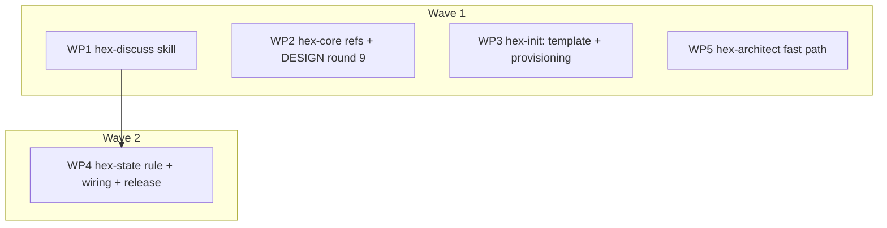

# Plan: Implement adr_0008 — pre-plan discussion mode

<!--
Implementation plan. Owner: /hex-plan. Handoff to: /hex-execute, /hex-review.
Design record and single source of truth for every contract:
.agents/adrs/adr_0008_pre_plan_discussion_mode.md (Accepted 2026-08-28,
all three open-question recommendations standing). This plan cites the
ADR's C-7xx/S-7xx IDs unchanged (protocol.md § Traceability IDs); where a
number or rule is repeated inline it is always ID-tagged — the ADR text
stays authoritative.
-->

## Status
- State:   done  <!-- planning → plan-approved → executing → review → done -->
- Tier:    high
- Updated: 2026-08-29
- Next:    (none — landed on main 2026-08-29)

## Overview

Ship adr_0008: the `hex-discuss` skill, the `.agents/discussions/`
discussion-artifact class (template + hex-init provisioning), the
bundle-generic `hex-state` rule (first `[rules]` member), the
`/hex-architect` dossier fast path, and the ratified constitution
amendments (DESIGN.md round 9, two protocol.md deviations, one models.md
scoping clause). Everything is additive: a session that never invokes
`/hex-discuss` sees no behavior change.

- **Contracts:** ADR §Component contracts, C-701…C-731 (31) — the plan's
  coverage join keys, carried unchanged.
- **Scenarios:** ADR §UX scenarios, S-701…S-716 (16) — the acceptance
  cases; ADR §Validation is the checklist of record.
- **Reversibility:** one-way (high) — decided and Accepted in the ADR;
  this plan executes it. Rollback = ADR §Migration › Rollback, plus
  README.md (see the plan-discovered addition below).
- **Wave compression, declared:** the ADR stages three release waves;
  this plan executes in **two** execution waves, pulling ADR wave 3
  (fast path + provisioning) into wave 1. Faithful because every ADR
  per-wave verify is preserved per WP and C-719 keeps the rule
  non-load-bearing — nothing in wave 1 depends on it.
- **Plan-discovered addition, declared:** `hex/README.md` appears in no
  ADR enumeration, but `publish.toml` sets `readme = "README.md"`, so a
  stale Members table would ship as the bundle description. WP4 updates
  it; ADR §Migration › Rollback is correspondingly one site short
  (README), noted here rather than silently extended.
- **Plan-discovered addition 2 (post-stub panel, 2026-08-28):**
  `hex/hex-architect/overlays.md` joins WP5's file set. C-726's
  adversary-default-on for dossier input cannot be effected in
  `tier-medium.md` prose — the adversary axis resolves at dispatch
  overlay-resolution (step 3) and is announced (step 5) before any tier
  file loads. The resolving edits are the overlays.md medium-row trigger
  ("dossier input" as a third auto-on condition) plus a dispatch-side
  clause in `SKILL.md`; the tier-medium line is updated to stay a
  truthful restatement. `classify.md` remains untouched (a dossier with
  an explicit tier never reaches the classifier). Structural ruling from
  the same panel: C-723/C-724 mechanics are single-sourced in
  `tier-medium.md` Phases 1–2; `tier-high.md` references them and states
  only its delta (the existing `tier-high.md` Phase-4 "everything the
  medium tier requires, plus:" precedent), and every insertion site's
  phase **Gate** line is reconciled (C-724's zero-researcher case,
  C-723's claim-diff replacing the explorer's full map).

## Component contracts

Single source: [adr_0008 § Component contracts](../adrs/adr_0008_pre_plan_discussion_mode.md#component-contracts).
The table maps every contract to its owning WP(s) — the coverage join
reviewers check. Split contracts name both halves. No contract text is
restated.

| Contract | Owner WP | Deliverable |
|---|---|---|
| C-701…C-712 (skill identity, intake, cadence, chips, grill, research gears, writes, stop rule, restate-gate, drains, quiet form) | WP1 | `hex/hex-discuss/SKILL.md` |
| C-713 (home/resolution/no-clobber — skill side), C-715 (lazy materialization + stub exception — skill side), C-716 (**skill side**: the artifact-authoring prohibition), C-717 (drain-readiness bar — gate-check side), C-719 (hardening contract — skill side), C-721 (§ Reach) | WP1 | same file |
| C-716 (protocol.md § Traceability IDs sentence), C-729 (memory.md fifth bullet + satellite scope sentence), deviation 1 (gate-scoping sentence — C-710's scoping half), deviation 2 (Upkeep scoping + binding-sections block), models.md rule-1 scoping clause, DESIGN.md round 9 (ADR-verbatim — carries C-712's announce-scoping half) | WP2 | `hex/hex-core/references/{protocol,memory,models}.md`; `hex/DESIGN.md` |
| C-714 (header contract incl. `Ratified:`/`Confidence:`), C-715/C-717 (template sides), C-727 (conditional audit item + Pointers row), C-728 (fifth template + Step-3 enumeration) | WP3 | `hex/hex-init/assets/templates/discussion.md` (new), `hex/hex-init/SKILL.md`, `hex/hex-init/references/audit.md` |
| C-718 (rule content), C-719 (**rule side**: the rule text keeps itself non-load-bearing), C-720 (packaging), C-730 (declined-hook `### Notes` line), C-731 (bundle wiring, v0.2.0, changelog, README) | WP4 | `hex/hex-state.md` (new); `hex/{hex.toml,publish.toml,CHANGELOG.md,README.md}` |
| C-722…C-726 (fast path: input contract + tier floor, claim diff, per-axis skip, Design-never-skips, weighted-up review) | WP5 | `hex/hex-architect/SKILL.md`, `tier-medium.md`, `tier-high.md` |

Adjudicated no-op halves (stated, not silently dropped): **C-713's
`memory.md § Location and resolution` Home is a citation, not an edit** —
that section's artifact-home list is exemplary and the C-727 Pointers row
carries discoverability. **C-726's second half is a citation, not an
edit, at tier high only** — `tier-high.md` already defaults the adversary
on; `tier-medium.md` needs the edit (WP5 covers it). **The C-722 tier
floor lives entirely in the dispatcher** — `hex-architect/classify.md`
stays untouched by design: the classifier never sees the dossier; the
SKILL.md dispatch intercepts and promotes, so no classify.md
cross-reference is added (resolves the panel's deferred question).

## User-experience scenarios

Single source: [adr_0008 § Component contracts › UX scenarios](../adrs/adr_0008_pre_plan_discussion_mode.md#component-contracts)
(S-701…S-716). Owner mapping: S-701–S-706, S-710–S-716 → WP1;
S-707–S-709 → WP5. Error cases are in-scenario (refusals S-707, halts
S-708, degraded S-710).

## Executable phases (per WP)

Markdown-artifact work; the cycle maps as:

- **Stub** — create the file(s) with full heading skeleton and frontmatter
  (new files) or locate the insertion anchors (amendments). **Anchoring
  rule (repo lesson, twice recorded): anchor on headings + quoted text +
  contract IDs, never on line numbers.** The line numbers below are
  verification hints from this run's Discover (2026-08-28) and WILL
  drift — WP2's own sequential edits shift protocol.md and memory.md
  under it. An executor re-locates each site by its quoted sentence.
- **Specify** — extract the owning contracts' MUST-statements from the ADR
  into a per-WP acceptance checklist inside the WP worktree (the "failing
  test": each unchecked item names its C-/S- ID).
- **Implement** — write the content until every checklist item is
  satisfied; amendments use the ADR's drafted text verbatim where the ADR
  provides it (round 9), authored fresh where it specifies shape only
  (deviation sentences, memory/models clauses).
- **Review** — per the WP's Review budget; verify = `grim build` for every
  changed member (`grim build ./hex/<member>`; rule: `grim build
  ./hex/hex-state.md`; bundle: `grim build ./hex/hex.toml`), full sweep
  `task publish -- --dry-run` at the final merge. grim build does NOT
  validate markdown links or anchors — reviewers resolve every added
  `](path#anchor)` by hand (known repo lesson).

### Anchors (heading + quote authoritative; line hints from 2026-08-28)

- protocol.md § The meta-plan approval gate — the sentence "This
  single-gate rule scopes to the four orchestrators … does not extend to
  any skill that spawns workers." (≈:54-58). § Upkeep step — opening
  "Every orchestrator's **final phase** …" (≈:795). § Traceability IDs —
  after the ID-origin bullet "assigned when the artifact is written …
  never renumbered" (≈:428-431). § Worker coordination: cited, never
  edited.
- memory.md § Destination of knowledge — after the fourth bullet
  ("Run state and learned facts → hex.md › Memory", ≈:247). § Location
  and resolution › Federation satellites — the "Scope, and the one
  exemption." lead-in (≈:74-78; the `/hex-init` exemption sentence starts
  ≈:79).
- models.md § Rules item 1 — clause appends at its end, before rule 2
  (≈:47-57/:59).
- DESIGN.md — round 9 appends at EOF (574 lines; last round: Federation,
  round 8). § Shared shape referenced, never edited.
- hex-architect: SKILL.md § Argument syntax `decision` bullet (≈:39-43,
  C-722 after it — the inserted text carries C-722's FULL clause set:
  state refusal + branched Fix lines, tier floor, canonical-path/symlink
  containment inside repo root + discussions home, pointer
  verify-on-consumption *before* any refusal, the `Ratified:`
  corroboration, and the C-714-header presence that gates engagement);
  § Required content bullet list end (≈:272, C-725 sentence after). tier-medium.md Phase 1 (≈:16) / Phase 2 (≈:29) /
  Phase 5 incl. cross-model paragraph (≈:90-117). tier-high.md Phase 1
  (≈:22) / Phase 2 (≈:34) / Review (≈:89-109; adversary already
  default-on there — citation, not edit).
- hex-init: SKILL.md Step-1 conditional-bullet precedent (spec-home,
  ≈:94-98); Step 3 template enumeration (≈:173-185 — add
  `discussion.md`). audit.md — the `#### Spec home documented
  (conditional)` sub-check (≈:42-62) is the shape model; the new item is
  a top-level `### Discussions home documented (conditional)` after the
  conventions/spec-home block.
- Packaging (per C-720/C-731): hex.toml (13 lines) gains the `[skills]` entry +
  `[rules] "hex-state" = "./hex-state:latest"`; publish.toml (41 lines)
  gains `version = "0.2.0"`, `[skills."hex-discuss"] path = "hex-discuss"`,
  `[rules."hex-state"] path = "hex-state.md"` — quoted keys, exact paths
  (a wrong path publishes to the wrong OCI repo; publish is not
  reversible). CHANGELOG `## [0.2.0]` (### Added + ### Notes for C-730).
  README: Members table gains a `hex-discuss` row; the rule is listed in
  a one-line "Rules:" note below the table (the table is headed
  `| Skill |`); the Tier-grammar sentence is reworded to name the four
  orchestrators and then "`hex-init` and `hex-discuss` have no tiers" —
  **never** as an exception inside "every orchestrator", which would
  assert hex-discuss is one (C-701).
- Style precedents: discussion.md template follows research.md's terse
  70-line shape (H1 + HTML-comment header: class, location convention,
  Owner /hex-discuss, Handoff = the four C-711 drains); hex-discuss
  frontmatter follows hex-plan's shape + `claude.user-invocable: "true"`,
  **no** `disable-model-invocation` (C-701); cross-skill template read
  precedent: hex-execute/SKILL.md § The plan artifact
  (`../hex-init/assets/templates/plan.md`).

## Parallelization

| id | scope (C-/S- IDs) | expected files | size | wave | depends-on | review | status |
|---|---|---|---|---|---|---|---|
| WP1 | C-701…C-713, C-715…C-717, C-719, C-721; S-701–S-706, S-710–S-716 | hex/hex-discuss/SKILL.md (new) | L | 1 | — (merge after WP3: doc link, see merge plan) | panel | merged |
| WP2 | C-716 (protocol side), C-729; deviations 1+2; models.md clause; DESIGN.md round 9 | hex/hex-core/references/{protocol,memory,models}.md; hex/DESIGN.md | S | 1 | — | panel | merged |
| WP3 | C-714; C-715/C-717 template sides; C-727; C-728 | hex/hex-init/assets/templates/discussion.md (new); hex/hex-init/SKILL.md; hex/hex-init/references/audit.md | S | 1 | — | light | merged |
| WP5 | C-722…C-726; S-707–S-709 | hex/hex-architect/{SKILL.md,overlays.md,tier-medium.md,tier-high.md} | M | 1 | — | panel | merged |
| WP4 | C-718, C-719 (rule side), C-720, C-730, C-731 | hex/hex-state.md (new); hex/{hex.toml,publish.toml,CHANGELOG.md,README.md} | S | 2 | WP1 | light | merged |
| WP6 | C-723(a) — convergence gap (review 2026-08-29): shipped marker route vs ADR "gate question" wording; reconcile per the review's deferred item B | hex/hex-architect/tier-medium.md; ADR changelog row (owner ratifies) | S | 3 | WP5 | light | merged |
| WP7 | fix pass (review 2026-08-29): findings 1,3,7,14,15,17,22,23,24 + cost-honesty and path-bound Suggests | hex/hex-architect/** | S | 3 | — | light | merged |
| WP8 | fix pass: findings 6,8,9,10a,11,12,13,18,21,25 + C-708 third-write sentence, satellite note, compressed restate, Confidence drain-write, Reach stamp, degraded timing, C-718 timing clause | hex/hex-discuss/SKILL.md; hex/hex-state.md; hex/hex-core/references/{memory,protocol}.md | M | 3 | — | light | merged |
| WP9 | fix pass: findings 2,4,16 | hex/hex-init/SKILL.md; hex/hex-init/references/audit.md; hex/hex-init/assets/templates/discussion.md | S | 3 | — | light | merged |
| WP10 | fix pass: findings 5,19,20 + DESIGN round-9 erratum, CHANGELOG Notes reword, superpowers-interop sentence, grimoire.toml members, CLAUDE.md Commands line | hex/{CHANGELOG.md,README.md,hex.toml,DESIGN.md}; CLAUDE.md; grimoire.toml | S | 3 | — | light | merged |
| WP11 | ADR amendments (owner-authorized at gate 2026-08-29): changelog rows, § Validation additions, § Migration rollback sites, S-711 wave-math wording | .agents/adrs/adr_0008_pre_plan_discussion_mode.md (untracked — working tree only, no commit) | S | 3 | — | light | merged |
| WP12 | owner decisions 2026-08-29 (4 accepted recommendations): C-718 in-rule clearing clause; C-711/C-714 `handed-off → context`; C-723(a) marker ratified (absorbs WP6); C-722 reopen-Fix reword | hex/hex-state.md; hex/hex-discuss/SKILL.md; hex/hex-architect/SKILL.md; hex/hex-init/assets/templates/discussion.md; ADR (untracked) | S | 4 | — | light | merged |
| WP13 | convergence gaps (re-review 2026-08-29): C-701 partial (body 400/400, measurement basis undefined — split § Reach to references/), C-707 partial (truncation-and-announce clause missing), C-708+C-714 partial (`Confidence:` drain-write unconditional vs optional contract) — absorbed by WP15 | hex/hex-discuss/SKILL.md; ADR (untracked — changelog rows, owner ratifies) | S | 5 | — | light | merged |
| WP14 | convergence gap (re-review 2026-08-29): C-722 partial — explicit-`low` refusal `Error:` literal; owner ruled 2026-08-29: amend ADR to shipped (WP12 precedent) — absorbed by WP18 | ADR changelog row | S | 5 | — | light | merged |
| WP15 | fix pass round 2 (all severities, owner gate 2026-08-29): resume re-arms `State: active` (codex High); entry-write disclosure line; `## Argument syntax`; degraded sweep re-cap; C-707 truncation clause; § Reach → references/reach.md + C-701 measurement basis; `Confidence:` qualifier; C-418 containment link; literal drain block; chips phrasing; link-copy leaks; aggregate spend chip; description sentence-3 trim; resume staleness note; state-vocab single-home clause (discuss side) | hex/hex-discuss/SKILL.md; hex/hex-discuss/references/reach.md (new) | M | 5 | — | light | merged |
| WP16 | fix pass round 2: Note+Fix pairing; `handed-off →` extraction rule; data-never-instructions over named files + delimited feed; interpolation bound generalized to echo sites; tier-high inherit-list addition; C-724 axis-attribution predicate; restate-gate Fix as command; Fix form/spacing/stale-example; claim-diff executor named; tier-high Phase-1 honesty; state-vocab single-home clause (architect side) | hex/hex-architect/{SKILL.md,tier-medium.md,tier-high.md} | M | 5 | — | light | merged |
| WP17 | fix pass round 2: session-bound freeze predicate (owner decision 2026-08-29) + "any artifact" + cheap negative + C-713 resolution wording; README+CHANGELOG freeze-effect clause; DESIGN:393 annotation repoint; members-row order; CHANGELOG architect bullet split | hex/hex-state.md; hex/{README.md,CHANGELOG.md,DESIGN.md} | S | 5 | — | light | merged |
| WP18 | ADR batch (owner-authorized at gate 2026-08-29): § Validation overhaul (16 items incl. S-710/C-719 recovery-text correction to shipped); changelog rows — session-bound predicate, C-722 literal-to-shipped, C-723 hardening, seed conventions, `Confidence:` drain-write, C-701 basis + references split, C-707 truncation, C-724 predicate, trust-rule generalizations, resume re-arm, restate-gate Fix reword, grimoire.toml ratification | .agents/adrs/adr_0008_pre_plan_discussion_mode.md (untracked — working tree only, no commit) | M | 6 | WP15, WP16, WP17 | light | merged |
| WP19 | round-3 findings (owner gate 2026-08-29): C-724 producer pointer + title-primary predicate reword; echo list += `<canonical>`/`<topic>`; hex-discuss:44 antecedent; CHANGELOG:13 trust wording; ADR lockstep rows (ADR now tracked) | hex/hex-discuss/SKILL.md; hex/hex-architect/{SKILL.md,tier-medium.md}; hex/CHANGELOG.md; .agents/adrs/adr_0008_pre_plan_discussion_mode.md | S | 7 | — | light | merged |



- **Critical path:** WP1 → WP4.
- **Usable in-repo after wave 1** (the mode works with Option-B
  durability); **installable after wave 2** (the bundle TOMLs gain the
  new members only in WP4).
- **Merge plan (serialized topological order):** WP2 → WP3 → WP5 → WP1 →
  WP4. WP3 before WP1 is a merge-order constraint, not a build
  dependency: WP1 and WP3 both reference
  `hex-init/assets/templates/discussion.md` by link, and the manual
  anchor sweep at WP1's merge needs the target on disk. One
  `grim build ./hex/hex-init` at the WP3 merge covers its member.
- **Parallelization justification:** file-disjointness would permit ~11
  WPs (WP2's four files and WP4's five are mutually disjoint); they are
  bundled per member/root because sentence-level edits sit far below the
  worktree + per-WP `grim build` overhead floor. WP4 stays isolated
  (not folded into WP1) because it depends on WP1's directory existing
  for the `hex.toml` reference and carries the release bump. The former
  WP6 (hex-init provisioning) is folded into WP3 — same member, jointly
  sub-overhead, and the fold deletes a worktree and a duplicate member
  build.

## Review budgets

WP1, WP2 and WP5 run `panel` — WP1 is a new member with the mode's whole
behavior surface; WP2 has the bundle's highest blast radius (constitution
+ the three references every orchestrator loads; only its DESIGN.md text
is ADR-verbatim, the rest is authored fresh); WP5 rewrites a trust
boundary. WP3 runs `light` (shape-fixed template + audit item mirroring
an existing sub-check). WP4 runs `light` with three mandatory checks:
the built rule's catalog keys surface in `grim describe` (the Asymmetry
trap); the rule body is ≤10 lines and carries no reach table (C-718);
the TOML keys are quoted and the paths exact per C-720/C-731 (the
publish surface — wrong path = wrong OCI repo, irreversible).

## Constitution deviations

None introduced by this plan. The four ADR-ratified amendment sites
(DESIGN.md round 9 — which carries both DESIGN.md amendments —
protocol.md deviations 1–2, the models.md rule-1 clause) are WP2
deliverables — mapped in the Component-contracts table
above; their justifications live in the ADR's own § Constitution
deviations and are not restated here.

## Open questions

None. The ADR's three markers were resolved at acceptance (plain
approval — recommendations stand: sweep cap 12; discussions home =
documented convention else `.agents/discussions/`; rule ships v0.2.0
with the skill).

## Verification

Per changed member after its wave (CLAUDE.md › Verification), each an
explicit command, all exit 0:

```
grim build ./hex/hex-discuss
grim build ./hex/hex-core
grim build ./hex/hex-init
grim build ./hex/hex-architect
grim build ./hex/hex-state.md
grim build ./hex/hex.toml
```
Full sweep at the end: `task publish -- --dry-run` green. Manual anchor
sweep over every added markdown link. Release-surface checks (C-730,
C-731): grep `hex/CHANGELOG.md` for the `## [0.2.0]` section and the
declined-hook `### Notes` line; assert `version = "0.2.0"` in
`hex/publish.toml`.

**Correction (re-review round 2, 2026-08-29):** the former "stated
deferral" here was false on this branch — WP10 updated `grimoire.toml`
(`[skills]` + `[rules] hex-state`), and the owner ratified that edit at
the round-2 gate. Verification: the `grimoire.toml` entries match
`hex/hex.toml`'s member set. Additional release-surface greps: the
README Members row for `hex-discuss`, the four-orchestrator
Tier-grammar sentence, and DESIGN.md's
`## Discussion-mode round (2026-08-28, round 9)` heading.

**Sync before dogfood (mandatory):** the repo's installed
`.claude/skills/` copies are drifted and `hex-discuss` will not exist
there at all — dev-sync every changed member (`grim install <path>` per
grim-usage § consume) before any dogfood run, or the dogfood silently
exercises pre-change copies (recorded failure W3, twice recurred).

Then the ADR § Validation checklist of record, including the dogfood run
(mode entry → research aside → chips → restate-gate refusing a soft yes →
drain to plan) and the fast-path fixture run against
`.agents/discussions/hex-discuss-skill.md` (claim diff, per-axis skips
announced, Phase 4 runs, adversary on, the `.agents/specs/` path
surfacing as a C-723(a) gate question). Plus three boundary cases the
checklist of record does not spell out (codex adversary findings):
a dossier path that is a **symlink resolving outside the repo root** is
refused (C-722 containment); a deliberately **stale discussions-home
pointer** is re-pointed before any refusal is issued (C-722
verify-on-consumption); and a `/hex-init` run where the user **opts in
with no discussion artifact present** still provisions the Pointers row
and template (C-727's middle case; the template copy itself is per
C-728 and unconditional — existing-artifact and never-discussed are
already covered). Two further cases from re-review round 2 (2026-08-29),
covering the claim diff's second containment site: a dossier **naming**
a path whose canonical target escapes the repo root takes the
author-error branch under its own marker text — never read, never a
halt; and an over-long or newline-bearing named path is interpolated
quoted, truncated at 120 chars, and never breaks its marker across
lines.
