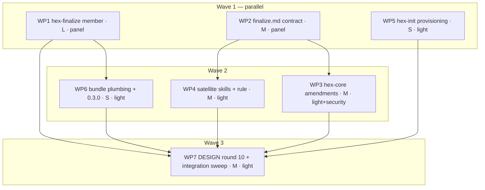

# Plan: Implement adr_0009 — the finalize phase (`/hex-finalize`)

<!--
Implementation plan. Owner: /hex-plan. Handoff to: /hex-execute, /hex-review.
Design record and single source of truth for every contract:
.agents/adrs/adr_0009_finalize_phase.md (Accepted by Michael, 2026-08-29,
zero open-question markers) with .agents/adrs/adr_0009_system_design.md as
its buildable companion. This plan cites the ADR's C-8xx/S-8xx IDs
unchanged (protocol.md § Traceability IDs); where a number, anchor or
verbatim row is repeated inline it is always ID-tagged — the ADR and the
system design stay authoritative.
-->

## Status

- State:   done  <!-- planning → plan-approved → executing → review → done; round 1: Request Changes → FX1–FX3; round 2: Needs Work → FX4 (92742dd, both Warns closed); round 3 2026-08-30: Approve — Converged, Fold-Back not performed (no Spec Deltas block) -->
- Tier:    high
- Updated: 2026-08-30
- Next:    —

---

## Overview

Ship `adr_0009`: the `/hex-finalize` command, `hex-core/references/finalize.md`
as the bundle's first remote-rights definition site, the scoped never-push
amendment at four bundle-wide sites, the promoted `protocol.md` § Untrusted-text
echoes, the `hex-state` finalize mode line with C-718's amended cap, the
`hex-init` commit-and-landing audit item, and the 0.3.0 release surface.
Everything is additive: a session that never invokes `/hex-finalize` sees no
behavior change, but does carry an amended rule body, one more member
description, four amended sentences and one promoted protocol section.

- **Reversibility:** one-way, **high** — confirmed. Decided and Accepted in
  the ADR (`Status: Accepted (Michael, 2026-08-29 — at the implementation
  plan's meta-plan gate)`); this plan executes it, it does not re-open it.
  Rollback = [ADR § Migration › Rollback](../adrs/adr_0009_finalize_phase.md#migration--rollout-plan),
  which already enumerates the full edit set.
- **Required artifacts, all present:**
  this plan; the accepted ADR
  [`adr_0009_finalize_phase.md`](../adrs/adr_0009_finalize_phase.md);
  the system design
  [`adr_0009_system_design.md`](../adrs/adr_0009_system_design.md);
  the ratified dossier
  [`.agents/discussions/finalize-phase.md`](../discussions/finalize-phase.md);
  and **12 research artifacts** (all `Expires: 2027-02-28`) —
  `adr0009-remote-rights.md`, `adr0009-failure-modes.md`,
  `adr0009-hex-compat.md`, and the nine `discuss-finalize-*` files
  (`series-shape-rules`, `rewrite-timing`, `detection-recipe`,
  `teams-policy-surfaces`, `teams-adaptive-tools`, `teams-agent-field`,
  `teams-oss-landscape`, `branch-automation`, `changelog-frameworks`),
  all under `.agents/research/`.
- **Contracts:** ADR § Component contracts, C-801…C-828 (28) — the plan's
  coverage join keys, carried unchanged.
- **Scenarios:** ADR § Component contracts › UX scenarios, S-801…S-813 (13);
  ADR § Validation is the checklist of record.
- **Declared adjustments — seven.** Everything below departs from the
  directive or from the system design's own text; each carries its ground
  here rather than being smoothed over in a WP.
  1. **WP6 moves from wave 1 to wave 2**, `depends-on WP1`. Ground:
     `hex.toml`, `publish.toml` and `grimoire.toml` all name
     `./hex-finalize`, so `grim build hex/hex.toml` **fails inside a
     worktree where WP1 has not landed** — a build dependency, not merely a
     merge-order one. `adr_0008`'s own WP4 precedent ("WP4 stays isolated …
     because it depends on WP1's directory existing for the `hex.toml`
     reference"). Wave count, critical path and merge order unchanged.
  2. **C-804's halt texts land in `finalize.md`, as a tenth section.** The
     ADR's Home cell reads "`hex-finalize/SKILL.md` § Pre-flight; **halt
     texts in `finalize.md`**", while the system design's § 9 outline lists
     nine sections and no halts section. Resolved **toward the ADR**:
     `finalize.md` gains `## Pre-flight halts` carrying the six
     `Error:`/`Fix:` blocks; SKILL.md § Pre-flight states the order and
     links there. Precedent: `memory.md`'s C-308 halt — one definition
     site, four linking consumers. Halt (5)'s `Fix:` variant is the
     exception: C-824 puts it in `memory.md`, so `finalize.md` links it.
  3. **C-803's definition half lands in `finalize.md` § Scope — no eleventh
     heading.** C-803's Home cell names `finalize.md`, but the § 9 outline
     has no phase-order section and C-819's own enumeration omits C-803.
     Rather than mint a section the outline does not have, § Scope carries
     the six-phase order and the sentence that phases 1–4 are local and
     reversible while phase 6 is not — **the gate is the seam**. Ground:
     § Scope already owns "the one-sentence invariant and what kind of
     control it is", and the phase order is what makes the invariant
     legible. Same reconciliation shape as item 2.
  4. **DESIGN round 10 gains one added passage — three sentences — that the
     ADR's fenced draft does not carry.** `DESIGN.md:661` (round 9) states "**`hex never pushes`, `hex
     never commits` outside execution** — unchanged". C-807/C-808 make
     `/hex-finalize` commit outside execution, so that clause is falsified
     and no ADR deviation row covers the *commits* half. Round 10 therefore
     states it explicitly (§ Constitution Deviations row 5, and WP7
     Step 7.3). The round-10 text is otherwise used **verbatim**.
  5. **WP4 depends on WP2 only, not WP3.** Recorded under
     § Parallelization › Depends-on semantics: an anchor target alone is a
     merge-order constraint, not a launch edge; adding the WP3 edge would
     compute WP4 into wave 3 and WP7 into wave 4.
  6. **`DESIGN.md:174` moves from the system design's wave 1 (§ 11 row 2)
     to plan wave 3**, as a WP7 edit. Ground in § Technical Approach ›
     Key Decisions: file-disjointness — WP7 owns `hex/DESIGN.md` for
     round 10, so the fourth qualifier site rides with it, and WP7's
     conformance grep covers all four sites rather than three.
  7. **`hex-init` and the project `CLAUDE.md` move from the system design's
     wave 3 (§ 11 rows 14, 15, 20) to plan wave 1**, as WP5. Ground in
     § Parallelization › justification: WP5 adds **no link into**
     `hex-finalize/` or `finalize.md`, so nothing has to exist on disk for
     it to build — the system design's wave-3 placement was a
     documentation-ordering convenience, not a dependency.

## Objective

Produce, from a review-approved feature branch, a rebased and recomposed
commit series that satisfies the project's own commit requirements, is
verified, and — after exactly one approval gate at the local/remote boundary
— is force-pushed with a pinned lease onto a ready-to-merge pull request.
The merge stays the human's.

## Scope

### In Scope

- The `hex-finalize` member (SKILL.md + at most one `references/` file).
- `hex-core/references/finalize.md` — the new sole definition site.
- The four bundle-wide qualifier sites, the third gate-exemption entry, the
  promoted echo section, the `archive.md` post-archive-append sentence, and
  the `memory.md` satellite-halt scope amendment.
- The `hex-state` mode line, `hex-review`'s handoff line, `hex-architect`'s
  echo-rule retarget.
- The `hex-init` audit item + two Pointers rows + the Preferences-prose offer.
- The 0.3.0 release surface and DESIGN.md round 10.

### Out of Scope

- Federated finalize (C-824 — explicitly deferred, single-repo v1).
- Changelog *generation* (ADR § Industry Context, sixth key insight).
- Any `config.md` key (C-825 — `config.md` stays byte-identical).
- Any worker role, `models.md` row or spawn (C-828).
- Any template edit — the shipped `plan.md` template's Status comment already
  names "whoever commits and finalizes the work".
- Any `hex-execute/SKILL.md` edit — C-820's site table keeps `:495`, `:570`
  and `:615` verbatim.

## Research

**Research artifacts:** the 12 files enumerated in § Overview. This plan does
not restate their findings; the ADR § Industry Context & Research is the
synthesis of record and every design consequence is already carried by a
C-ID. No further research pass is needed to execute.

## Technical Approach

### Architecture Changes

`hex-finalize/SKILL.md` carries the **flow** — six phases, the gate's
rendering, the handoff block — and links `hex-core/references/finalize.md`
for every **rule**. This reproduces `archive.md`'s relationship to
`hex-review` (system design § 9). Nothing is restated across the two files.

### Fixed anchor names (authoritative for this plan)

`grim build` does **not** validate markdown links or anchors. Every anchor
below is **fixed here** so wave-1 and wave-2 work packages can link
concurrently without ordering on each other; WP7 sweeps them. A builder
authors these heading texts **exactly**, and links them by exactly these
paths.

| Heading authored | File | Anchor | Linked from |
|---|---|---|---|
| `# Finalize — the remote-rights boundary` | `hex/hex-core/references/finalize.md` (new, WP2) | — | — |
| `## Scope` | same | `#scope` | the four qualifier sites — three in WP3, `DESIGN.md:174` in WP7. **Round 10's prose names `finalize.md` in a code span, not a link** (the ADR's fenced draft is used verbatim), so it is not a linker |
| `## The act set` | same | `#the-act-set` | `hex-finalize/SKILL.md` (WP1) |
| `## Consent model` | same | `#consent-model` | `protocol.md` § meta-plan gate (WP3), `hex-finalize/SKILL.md` (WP1) |
| `## Force-push mechanics` | same | `#force-push-mechanics` | `hex-finalize/SKILL.md` (WP1) |
| `## Backup-ref lifecycle` | same | `#backup-ref-lifecycle` | `hex-finalize/SKILL.md` (WP1) |
| `## Remote verification` | same | `#remote-verification` | `hex-finalize/SKILL.md` (WP1) |
| `## Re-entry` | same | `#re-entry` | `hex-finalize/SKILL.md` (WP1) |
| `## Degrade ladder` | same | `#degrade-ladder` | `hex-finalize/SKILL.md` (WP1); `hex/README.md`'s remote-write sentence (WP6, Step 6.3) |
| `## Trust classes` | same | `#trust-classes` | `hex-finalize/SKILL.md` (WP1) |
| `## Pre-flight halts` | same | `#pre-flight-halts` | `hex-finalize/SKILL.md` (WP1) |
| `## Untrusted-text echoes` | `hex/hex-core/references/protocol.md` (new §, WP3) | `#untrusted-text-echoes` | `hex-architect/SKILL.md` (WP4), `finalize.md` (WP2) |
| `### Commit and landing requirements documented?` | `hex/hex-init/references/audit.md` (new item, WP5) | `#commit-and-landing-requirements-documented` | `hex-init/SKILL.md` Step 1 (WP5) |
| `## Argument syntax` · `## Pre-flight` · `## Discover conventions` · `## Local verification` · `## Recompose` · `## Gate` · `## Remote` · `## Handoff` | `hex/hex-finalize/SKILL.md` (new, WP1) | — | internal only |

Relative link forms, fixed:

- from `hex/hex-finalize/SKILL.md` → `../hex-core/references/finalize.md#<anchor>`,
  `../hex-core/references/protocol.md#untrusted-text-echoes`,
  `../hex-core/references/protocol.md#verification`,
  `../hex-core/references/protocol.md#handoff-contract`
- from `hex/hex-core/references/{protocol,archive,memory}.md` → `finalize.md#scope`
- from `hex/hex-core/references/finalize.md` → `protocol.md#untrusted-text-echoes`,
  `protocol.md#verification`, `memory.md#federation-satellites`
- from `hex/hex-architect/SKILL.md` → `../hex-core/references/protocol.md#untrusted-text-echoes`
- from `hex/hex-core/SKILL.md` § References → `references/finalize.md`
- from `hex/DESIGN.md` → `hex-core/references/finalize.md#scope`
- from `hex/README.md` → `hex-finalize/` and
  `hex-core/references/finalize.md#degrade-ladder` (**not** a `../` form —
  `README.md` sits at `hex/`, one level above `hex-core/`)

### Key Decisions

| Decision | Rationale |
|---|---|
| Anchors fixed in the plan, not discovered at merge | `grim build` validates neither links nor anchors; fixing them lets WP1/WP2/WP3/WP4 link concurrently instead of serializing on each other |
| Anchor on **headings + quoted text + contract IDs, never on line numbers** | Repo lesson, twice recorded. Every line number in this plan is a 2026-08-29 verification hint and **will drift** — WP3's own sequential edits shift `protocol.md` under itself |
| The `hex-state` mode line carries **no markdown link** | The shipped rule body has none; a rule is published standalone, so a relative link may not resolve for a consumer, and the top-level `annotation_count` must stay 8 |
| The exemption sentence is **one edit**, in WP3 | ADR edit-sequence row #6 and ADR § `protocol.md` deviation target the same sentence (`protocol.md` ≈:52-64) |
| `DESIGN.md:174` (the fourth qualifier site) sits in **WP7**, not WP3 | File-disjointness: WP7 owns `hex/DESIGN.md` for round 10. WP7's conformance grep therefore covers all four sites, not three |

## Constitution Deviations

`hex/DESIGN.md` is the constitution. Every deviation below is **ADR-ratified**;
this plan introduces none of its own. Justifications live in
[ADR § Constitution deviations](../adrs/adr_0009_finalize_phase.md#constitution-deviations)
and are not restated — the rows name the site, the ground, and the owning WP.

| Violation (constitution site) | Why needed | Simpler alternative rejected because | Owner WP |
|---|---|---|---|
| `protocol.md` § The meta-plan approval gate — the closed two-name exemption list gains a **third named member** | `/hex-finalize` keeps exactly **one** gate (count conforms) but its **position** is the local/remote boundary, not "before any work starts" | A conforming entry gate would announce a commit plan that does not yet exist — the consent theater `adr_0005` rejected for the fold. Re-writing the exemption as a **criterion** converts an auditable carve-out into a judgement call, the failure the sentence's own closing clause prevents | WP3 |
| `DESIGN.md` § Worktrees — "hex never pushes" scoped to everything except `/hex-finalize`'s force-push of the one branch it was invoked on | The two steps the absolute rule hands back are the two that **cannot be performed correctly outside the run**: a lease pinned to the SHA *this run* fetched, and checks dispatched against the SHAs the rewrite just minted | Option D (keep the rule absolute, print the commands) scores within three points and **is** the design's own bottom rung — but it re-opens both failures the ordering exists to close | WP7 (round 10 + `DESIGN.md:174`); WP3 (the other three sites); WP2 (the definition) |
| `adr_0008` C-718 — rule-body cap raised from "≤10 lines" to **≤14 physical lines, measured H1 onward** | The shipped `hex-state.md` body is **exactly 10 physical lines**; a second mode line written like its sibling is ~2–3 more | Redefining the measure as "non-blank" to manufacture headroom would be exactly the silent reinterpretation C-718 exists to prevent | WP7 (recorded in DESIGN round 10); WP4 (the line that needs it) |
| `DESIGN.md:661` (round 9) — "**`hex never pushes`, `hex never commits` outside execution** — unchanged" | C-807's recomposition **commits outside execution**: `reset --soft` then one commit per logical change, each carrying `--signoff` and a fresh signature (C-808) | Leaving the round-9 clause unqualified would make the constitution assert something the shipped skill contradicts. Having `/hex-execute` commit the series instead would put the rewrite behind a different skill's gate and re-open C's two-command surface | WP7 (round-10 sentence, declared adjustment 4) |
| `memory.md` § Location and resolution › Federation satellites — `/hex-finalize` brought **inside** the C-308 halt's scope, the first non-orchestrator to be | The paragraph's non-orchestrator clause is written for skills whose satellite-local effect is advisory prose; finalize's effect is **destroyed history** on a branch that may be a row in a lead's `Repos:` ledger | Letting finalize sit outside by the paragraph's own terms would re-open `adr_0004`'s FM6 exactly as that ADR describes it | WP3 |

## Component Contracts

Single source:
[adr_0009 § Component contracts](../adrs/adr_0009_finalize_phase.md#component-contracts).
The table maps every contract to its owning WP — the coverage join reviewers
check. Split contracts name both halves. No contract text is restated; each
row carries a one-line testable restatement only.

| Contract | Owner WP | One-line restatement (testable) | Deliverable |
|---|---|---|---|
| **C-801** identity, entry, exit, packaging, both budgets | WP1 | Frontmatter sets `claude.user-invocable: "true"` **and** `claude.disable-model-invocation: "true"`; body ≤400 lines H1-onward; `description` ≤2 rendered lines, entry triggers only; no `classify.md` / `overlays.md` / `tier-*.md` | `hex/hex-finalize/SKILL.md` (new) |
| **C-802** argument syntax + workspace invariant | WP1 | `## Argument syntax` documents `/hex-finalize [<target-branch>]`, no tier arg, no `--local`; target resolved argument → PR base → discovered trunk, echoed with source | same |
| **C-803** six phases, one fixed order | WP2 (definition, in **§ Scope** — declared adjustment 3) · WP1 (flow renders it) | `finalize.md` § Scope states the order Pre-flight → Conventions → Local verify → Recompose → Gate → Remote, why verify precedes the rewrite, and that phases 1–4 are local and reversible while phase 6 is not — the gate is the seam; SKILL.md's section order matches | `finalize.md#scope`; `hex-finalize/SKILL.md` |
| **C-804** pre-flight: 3 resolutions, **6** halts | WP1 (§ Pre-flight order) · WP2 (§ Pre-flight halts texts) | Six halts enumerated, each with an `Error:`/`Fix:` pair; halt 3 has a fold-aware **and** a recompose-aware variant, the latter taking precedence on *armed ref + unclean tree*; the CLI probe is a rung, the failed fetch is halt (6) | `hex-finalize/SKILL.md`; `finalize.md#pre-flight-halts` |
| **C-805** the single gate, at the local/remote boundary, on every rung | WP1 (rendering) · WP2 (§ Consent model) · WP3 (`protocol.md` scoping) | Gate renders every mandatory field of system design § 10; asks on the local-only rung; a `no` performs zero remote acts, renames the ref inert and prints the restore command | `hex-finalize/SKILL.md § Gate`; `finalize.md#consent-model`; `protocol.md` § meta-plan gate |
| **C-806** handoff block | WP1 | Literal `## Finalize Complete: <branch>` on **every** outcome; pushed SHA present or explicitly absent (never blank); remote-check result on **two** independent lines; `Next:` names the human's merge and emits no hex command | `hex-finalize/SKILL.md § Handoff` |
| **C-807** series shape + the recomposition mechanism | WP1 | Three universals shipped; two axes resolve in three named steps; mechanism is `rebase --onto` → `reset --soft` → staged re-commit → message-matches-diff halt; absorb pre-pass recorded as declined | `hex-finalize/SKILL.md § Recompose` |
| **C-808** commit requirements satisfied **during** the rewrite | WP1 | `--signoff` and re-signing applied per new commit; sign-off identity is `user.name <user.email>`; `Co-authored-by:` preserved; **author-set equality** is a halting mechanical check; recomposition stated **not** SHA-stable | same |
| **C-809** backup ref — armed/inert, one rename, no deletes | WP2 | `backup/<branch>-pre-finalize` created before the first history-modifying op, `/`-structure preserved, refuses to overwrite an armed ref; every terminal path renames to `backup/<branch>-<pre-rewrite-short-sha>`; repeat decline from the same tip is a silent no-op, otherwise refuse; never deletes | `finalize.md#backup-ref-lifecycle` |
| **C-810** verification inherited, never invented | WP1 (**citation, not an edit** — see below) | SKILL.md links `protocol.md#verification`; the re-run rule is stated once: local suite re-runs **iff** the fetched target tip differs from the base the pre-rewrite run used | `hex-finalize/SKILL.md` |
| **C-811** the remote act set + the four-rung ladder | WP2 | Four act kinds (one pre-gate read, three post-gate) and the explicit never-list, fixed in shipped text; each rung names **where it is selected** | `finalize.md#the-act-set`, `#degrade-ladder` |
| **C-812** force-push mechanics, literal | WP2 | The literal command with an explicit single-ref refspec and pinned lease (`--force-if-includes` dropped — documented no-op beside a pinned lease; integration proven by pre-flight's `merge-base --is-ancestor` assertion, halt (6)(ii)) [erratum, WP2 panel, 2026-08-29]; no bare `--force`, no unpinned lease, no `--all`/`--mirror`/`--tags`; every push rejection a hard stop with one reachable cause | `finalize.md#force-push-mechanics` |
| **C-813** remote verification: discovery, trust class, ceilings, forge table | WP2 | Workflow set is authoritative-class (documented ∩ dispatchable), never scanned; dispatch executes branch-defined code and drift is disclosed; no untrusted inputs; forge-conditional units (GitHub per file, GitLab one pipeline per SHA); re-dispatch guard on **any** run state; rerun ceiling exactly one, per SHA; system design § 8's `gh`/`glab` table ships here | `finalize.md#remote-verification` |
| **C-814** PR surface, quality ledger, the flip | WP1 | Marker-fenced `<!-- hex:finalize:start --> … <!-- hex:finalize:end -->` block, only that block replaced; auto-merge/merge-queue armed → **do not flip**, report ready-but-held; flip-triggered checks watched; never un-flips | `hex-finalize/SKILL.md § Remote` |
| **C-815** discovery surfaces, three trust classes, enumerated narrowing scope | WP1 (§ Discover conventions — the two resolvers) · WP2 (§ Trust classes — the class definitions) | Resolver A (target, merge strategy, workflow list, verification level) is authoritative-only; resolver B's four conventions may be narrowed; empty/unreadable enforcement is `unknown`, never `unenforced`; detect silently, disclose always, ask only on ambiguity | `hex-finalize/SKILL.md`; `finalize.md#trust-classes` |
| **C-816** narrow-never-widen + the echo rule's real home | WP3 (promoted §) · WP4 (hex-architect retarget) · WP2 (`finalize.md` links it) | `protocol.md` § Untrusted-text echoes states the quote/120-char/never-break-line rule **once**; `hex-architect/SKILL.md:90-92` becomes a one-line link; `:93-96` stays | `protocol.md`; `hex-architect/SKILL.md`; `finalize.md` |
| **C-817** credential posture — disclosed, never assumed | WP1 (gate lines) · WP5 (audit item) | Gate names acting identity, **credential source** (env override vs ambient login) and reported scopes beside the rights needed; never refuses on a broad credential; surfaces the workflow-scope gap when the series touches the workflow directory | `hex-finalize/SKILL.md § Gate`; `audit.md` |
| **C-818** idempotent re-entry, no journal file | WP2 | System design § 4.1's chain verbatim in substance: `published_rewrite` keys on the **armed** ref and `ls-remote` equality and is evaluated **before** any decision to recompose; every pre-push resume lands on the gate; the session-local flag fails toward the gate; no state file on any path | `finalize.md#re-entry` |
| **C-819** one new hex-core reference file | WP2 | `hex/hex-core/references/finalize.md` exists and is the only home for C-803, C-805's consent model, C-809, C-811, C-812, C-813, C-818, the ladder, the halt texts and the scoping sentence; `hex-core/SKILL.md` § References carries its row | `finalize.md` (new); `hex/hex-core/SKILL.md` |
| **C-820** the four qualifier sites | WP3 (`protocol.md:544`, `protocol.md:850`, `archive.md:474`) · WP7 (`DESIGN.md:174`) · WP2 (owns the definition) | Exactly four sites carry the one-clause qualifier + a link to `finalize.md#scope`; `:850` takes the **fetch** variant; every other row of C-820's site table stays **byte-identical** | `protocol.md`; `archive.md`; `DESIGN.md`; `finalize.md` |
| **C-821** `hex-state.md` mode line + the amended cap | WP4 (the line) · WP7 (cap recorded in DESIGN round 10) | Predicate is the **armed** ref name alone; the **release clause** is present; body ≤14 physical lines H1-onward; `annotation_count` stays 8 | `hex/hex-state.md`; `hex/DESIGN.md` |
| **C-822** post-terminal actor, no new lifecycle state | WP3 | One sentence in `archive.md` § Plan archive: a terminal plan's Status block may be appended to; not a second archive event, no second pointer clear, no second index row | `archive.md` § Plan archive |
| **C-823** `/hex-review` emits `Next: /hex-finalize` | WP4 | The handoff skeleton's `### Next step` gains a **third** case keyed on **target type**: branch or PR target + clean `Approve` → `/hex-finalize`; plan-artifact or working-tree target → `(none — approved)`. No forge read is added to hex-review | `hex-review/SKILL.md § Handoff` |
| **C-824** federation — single-repo v1, finalize joins the satellite halt | WP3 | The scope paragraph places `/hex-finalize` **inside** the halt with its ground, and adds finalize's own `Fix:` variant saying the satellite branch is finalized **by hand** — never "re-run from the lead"; `hex-discuss`'s outside-status and `/hex-init`'s exemption unchanged; the two residual limits stated | `memory.md` § Federation satellites |
| **C-825** zero config **key** | WP6 (README's third exemption name) · WP7 (asserts `config.md` byte-identical) | `config.md` is not touched; README's tier-grammar exemption sentence names three skills | `hex/README.md`; verification |
| **C-826** `hex-init` gains one audit item and two Pointers rows, **no forge reads** | WP5 | New top-level item in the four-part shape, slotted **immediately after** the Verification item; offers the `hex.md › Preferences` series-shape prose **only when discovery finds the axes undocumented**, with consent; recommends target-branch protection; `audit.md:171` stays true verbatim | `hex-init/references/audit.md`; `hex-init/SKILL.md` |
| **C-827** bundle wiring and release, seven touch points + `grimoire.toml` | WP6 (a,b,c,d + `grimoire.toml`) · WP7 (e) · WP2/WP3 (f) · WP5 (g) | Every touch point landed; none optional | `hex/{hex.toml,publish.toml,CHANGELOG.md,README.md,DESIGN.md}`; `grimoire.toml`; `CLAUDE.md`; `audit.md` |
| **C-828** no worker spawns, no new role | WP6 (the `### Notes` line) · WP7 (asserts) | `CHANGELOG.md` `### Notes` records the declined spawn **and its revisit trigger**; `workers.md`, `models.md`, `config.md` gain nothing | `hex/CHANGELOG.md`; verification |

**Adjudicated no-op halves** (stated, not silently dropped):

- **C-810's `protocol.md` § Verification Home is a citation, not an edit.**
  The ADR's own Home cell says "linked, not restated". `protocol.md` is
  edited by WP3 for three other reasons; § Verification is not one of them.
- **C-825 produces no `config.md` diff at all.** Its only positive
  deliverable is README's third exemption name (WP6); its other half is a
  verification assertion (WP7).
- **`hex-execute/SKILL.md` and its three tier files are never opened.**
  C-820's table keeps `:495`, `:570`, `:615` and the tier restatements
  verbatim. Any diff there is a defect.
- **`workers.md`, `models.md`, `config.md` and every template take zero
  edits** (C-825, C-828).

## User-Experience Scenarios

Single source:
[adr_0009 § Component contracts › UX scenarios](../adrs/adr_0009_finalize_phase.md#component-contracts)
(S-801…S-813). Error cases are in-scenario (halts S-802/S-811, hard stops
S-803/S-809, refusals S-805, degraded S-806, decline S-807).

| Scenario | One-line restatement | Owner WP(s) |
|---|---|---|
| **S-801** | 32 scaffolding commits → 1 feature + 2 rider commits, sign-offs and signing identity shown at the gate, approved, pushed, one workflow green, PR flips ready | WP1 (flow) · WP2 (mechanics) |
| **S-802** | An uncommitted fold halts at pre-flight check 3; the message names the dirty paths **as the fold** and prints the `git add`/`git commit` pair; nothing is committed or stashed | WP1 · WP2 |
| **S-803** | A colleague pushes mid-run; the pinned lease rejects; hard stop reporting both SHAs, naming the backup ref, no re-fetch and no retry | WP2 |
| **S-804** | Classic branch protection returns an empty array → enforcement recorded and rendered as `unknown`, never "nothing enforced" | WP1 (resolver) · WP2 (trust classes) |
| **S-805** | A hostile `CONTRIBUTING.md` cannot reach the target or force a merge; its stricter message regex **is** applied; every echo is quoted and truncated | WP1 · WP2 · WP3 (echo §) |
| **S-806** | No forge CLI → local-only rung; the gate **still asks**; the handoff names push/dispatch/flip as manual and marks the pushed-SHA field explicitly absent | WP1 · WP2 (ladder) |
| **S-807** | `no` at the gate → zero remote acts, rewrite stands, ref renamed **inert** (releasing the `hex-state` lock), restore command printed | WP1 · WP2 |
| **S-808** | Killed after the push, before the dispatch → re-invoked, passes the gate again, skips the push, dispatches | WP2 (re-entry) |
| **S-809** | Flaky workflow → exactly one rerun of failed jobs; same failure stops the run, PR stays draft; re-invocation neither re-dispatches nor resets the budget | WP2 |
| **S-810** | Two-author branch → gate names the second author, `Co-authored-by:` preserved, sign-off carries the invoking human's `user.name <user.email>` | WP1 |
| **S-811** | `Federation lead:` bullet present → halt with finalize's own `Fix:` naming **hand**-finalization, never "re-run from the lead" | WP3 (`memory.md` variant) · WP1/WP2 (halt 5) |
| **S-812** | Human-authored PR body → only the `<!-- hex:finalize:… -->` block is replaced, every other line byte-identical across two runs | WP1 |
| **S-813** | Auto-merge armed → disclosed at the gate, finalize **does not flip**, handoff reports ready-but-held and names the setting | WP1 |

## Parallelization

| WP | Scope (C-/S- IDs) | Expected Files | Size | Wave | Depends on | Review | Status |
|----|-------|----------------|------|------|------------|--------|--------|
| WP1 | C-801, C-802, C-806, C-807, C-808, C-810, C-814; C-803/C-804/C-805/C-815/C-817 (skill halves); S-801, S-802, S-804, S-805, S-806, S-807, S-808, S-810, S-812, S-813 | `hex/hex-finalize/SKILL.md` (new); at most one `hex/hex-finalize/references/*.md` | L | 1 | — | panel | merged |
| WP2 | C-819, C-809, C-811, C-812, C-813, C-818; C-803/C-804/C-805/C-815 (definition halves); S-803, S-806, S-808, S-809 | `hex/hex-core/references/finalize.md` (new); `hex/hex-core/SKILL.md` (§ References row) | M | 1 | — | panel | merged |
| WP3 | C-816 (promoted §), C-820 (3 of 4 sites), C-822, C-824 (7 targets / 6 edits); C-805 (`protocol.md` scoping — the third exemption entry); S-805, S-811 | `hex/hex-core/references/{protocol,archive,memory}.md` | M | 2 | WP2 | light + security seat | merged |
| WP4 | C-816 (hex-architect retarget), C-821 (the rule line), C-823 | `hex/hex-architect/SKILL.md`; `hex/hex-review/SKILL.md`; `hex/hex-state.md` | M | 2 | WP2 | light | merged |
| WP5 | C-826, C-827(g); C-817 (audit half) | `hex/hex-init/references/audit.md`; `hex/hex-init/SKILL.md`; `CLAUDE.md` (repo root) | S | 1 | — | light | merged |
| WP6 | C-827(a,b,c,d) + `grimoire.toml`; C-825 (README name); C-828 (`### Notes`) | `hex/hex.toml`; `hex/publish.toml`; `grimoire.toml`; `hex/README.md`; `hex/CHANGELOG.md` | S | 2 | WP1 | light | merged |
| WP7 | C-827(e) = DESIGN round 10; C-820 (`DESIGN.md:174`, the fourth site); C-821 (cap recorded); C-825/C-828 assertions; the whole integration sweep | `hex/DESIGN.md`; no other file edited — verification only | M | 3 | WP1, WP3, WP4, WP5, WP6 | light | merged |
| FX1 | Review fix pass (2026-08-29 /hex-review): H1 quoting→§ Scope, H3 arming-refusal loud exit, H4 gate-flag key, W1 halt-1 Fix prose, W2 dispatch-guard scope, W5 Preferences enum, W7 site-label reword, S3 transport-echo rule | `hex/hex-core/references/finalize.md` | S | 4 | WP7 | self | merged |
| FX2 | Review fix pass: H2 trailer provenance, H6 C-807/C-808 definition tags, W3 resume Never-line clauses, W4 drop "pre-gate" carve-out | `hex/hex-finalize/SKILL.md`; `hex/hex-finalize/references/rendering.md` | S | 4 | WP7 | self | merged |
| FX3 | Review fix pass: Block quickstart order, W8 bundle keywords, H5 series-shape restatement → link | `hex/README.md`; `hex/hex.toml`; `hex/hex-init/SKILL.md` | S | 4 | WP7 | self | merged |
| FX4 | Round-2 fix pass: retire "never-push qualifier" label in the index row; tenth owned rule (placeholder substitution) in both sole-definition-site enumerations | `hex/hex-core/SKILL.md`; `hex/hex-core/references/finalize.md` | S | 5 | FX1 | self | merged |

**Depends-on semantics, stated** — because `/hex-execute` launches on
dependency-ready and waves are derived reporting, an edge here is a real
launch constraint and is spent only where it buys something:

- **The two `WP2 →` edges enforce the system design's own ordering rule
  structurally** rather than trusting prose: never a merged state where a
  shipped file claims an exception, or a rule line names a contract, that
  points at a `finalize.md` which does not exist. WP3 writes the four
  qualifier clauses; WP4's `hex-state` mode line is a pointer to C-809's
  definition.
- **WP6 → WP1 is a genuine build dependency.** `grim build hex/hex.toml`
  cannot resolve `./hex-finalize` in a worktree where WP1 has not landed.
- **WP7 depends on every WP that edits a file**, because its whole substance
  is a sweep of the merged state.
- **Anchor targets alone are a merge-order constraint, not an edge.** Every
  anchor name is fixed in § Technical Approach, so no builder waits on
  another WP to learn a link — WP4's link to `protocol.md`
  § Untrusted-text echoes (written by WP3) is carried by the merge order
  below, exactly as `adr_0008`'s WP1/WP3 doc-link constraint was.



**Critical path — two chains, and the longer one is not the topological
one.** Topologically the longest chain is **WP2 → WP3 → WP7** (three waves).
But **WP1 → WP6 → WP7** is the **likely wall-clock path**: WP1 is the only
`L` work package and one of the two `panel` reviews, and it gates WP6, so it
bounds the schedule even though its chain is no longer in hops. Watch WP1;
WP2 → WP3 → WP7 is what bounds *correctness* ordering.

**Shippable after wave: 3 — the 0.3.0 bundle.** The bundle releases
atomically: `publish.toml`'s version bump (WP6, wave 2) is only truthful once
DESIGN round 10 and the integration sweep land in wave 3. Nothing is
publishable earlier and nothing partial is worth publishing.

**Merge order:** a valid topological order, serialized `--no-ff` —
**WP2 → WP1 → WP5 → WP6 → WP3 → WP4 → WP7** — with the project's documented
verification after each merge onto the feature branch. Worktrees at
`.agents/worktrees/wp<N>`, branches `hex/adr-0009-finalize--wp<N>` off the
integration branch `hex/adr-0009-finalize`. WP2 merges first so the anchor
sweep at WP3's and WP4's merges finds `finalize.md` on disk; **WP3 merges
before WP4** so that sweep also finds `protocol.md` § Untrusted-text echoes
(a merge-order constraint, not a build dependency); WP1 merges before WP6 so
`grim build hex/hex.toml` resolves the new member.

**Parallelization justification** (per-row, only where it is not obvious):

- **WP3 bundles three `hex-core` reference files** although they are mutually
  file-disjoint: sentence-level edits sit far below the worktree +
  per-member `grim build` overhead floor, and all three build as one member.
- **WP4 bundles three files across three members** for the same reason — each
  is a single splice, and the three share one review concern (consent- and
  handoff-adjacent text).
- **WP6 stays isolated though small:** the version-bump file set must be
  reviewable alone. A wrong `publish.toml` path publishes to the wrong OCI
  repo and publishing is not reversible; folding it into WP1 would bury that
  diff inside a 400-line member review.
- **WP7 stays isolated though its only edit is one file:** it is the
  integration WP. Its value is the cross-cutting sweep (four-site
  conformance, byte-identity of the 13 unqualified sites, the single-echo
  grep, `annotation_count`, `task publish -- --dry-run`), which by
  construction can only run after every other WP has merged.
- **WP5 is wave 1 with no dependency** although its audit item mentions
  `/hex-finalize`: it adds **no link into** `hex-finalize/` or `finalize.md`,
  so nothing on disk has to exist for it to build.
- **WP5 stays isolated though small:** no sibling shares both its wave and
  its member. Folding it into any other WP would add `hex-init` to that WP's
  `grim build` set for three splices, and folding it into WP7 would put
  authored prose inside the integration WP.

## Review budgets

WP1 and WP2 run **panel** — WP1 is a new member carrying the whole behavior
surface of a command that force-pushes and makes a legal attestation; WP2 is
the sole definition site for the act set, the force-push form, the backup-ref
lifecycle and the re-entry chain, and every qualifier site links it. Both are
security-relevant by construction.

WP3 runs **light plus a security seat**, both deep-reasoning — the text is
short but it edits the **consent boundary** twice over: the gate-exemption
sentence that decides where hex may ask for approval, and the satellite
halt's scope. A spec seat alone would check the grammar and miss the
boundary. Mandatory checks: the position-deviation grammar, the count word
and its closing ordinal, the two C-824 checks in Step 3.4, and the
hunk-level byte-identity of the unqualified sites.

WP4 runs **light** (consent-adjacent text, three single splices) and WP5
runs **light** (an audit item mirroring an existing item's shape).

WP6 runs **light**, not self — a fast-balanced seat suffices (one file of
verbatim rows), but `publish.toml` is an **irreversible OCI surface** and a
wrong path publishes to the wrong repository, which no later commit undoes.
Three mandatory checks: TOML keys quoted and paths exact;
`version = "0.3.0"` present at `publish.toml:7` and nowhere else;
`grim build hex/hex.toml` exits 0.

WP7 runs **light** — its substance is the sweep, not authored prose.

## Implementation Steps

> **Contract-first TDD, mapped to markdown-artifact work.** Every WP runs
> **Stub → Specify → Implement → Review**. "Stub" is the heading skeleton and
> frontmatter (new files) or the located splice anchors (amendments);
> "Specify" is the per-WP acceptance checklist written into the worktree, one
> unchecked item per owned C-/S- ID (this is the failing test); "Implement"
> writes content until every item is checked; "Review" runs the WP's budget
> plus its `grim build`.
>
> **The Specify step's `.acceptance.md` is worktree-local scaffolding and is
> deleted before that WP's final commit — every WP, not only WP1.** A
> surviving `.acceptance.md` in a merged file set is a **hard stop** at the
> merge-time file-set re-validation.
>
> **Anchoring rule (repo lesson, twice recorded): anchor on headings + quoted
> text + contract IDs, never on line numbers.** Every `:NNN` below is a
> 2026-08-29 verification hint and **will drift**.
>
> **Every diff-based check is pinned to a recorded base**, so it cannot pass
> vacuously once the work is committed. At worktree creation each WP records
> `BASE=$(rtk proxy git rev-parse hex/adr-0009-finalize)` — the integration
> branch tip it branched from — and **every** byte-identity, file-set and
> exactly-N-files check runs `rtk proxy git diff $BASE...HEAD -- <paths>`,
> which sees committed state, not just the working tree. WP7 runs on the
> integration branch itself and records
> `BASE=$(rtk proxy git merge-base main HEAD)` — the **local** trunk, because
> `main` is unpushed here and `origin/main` sits commits behind it, which
> would fold pre-branch work into every WP7 diff [erratum, WP7 sweep,
> 2026-08-29: was `merge-base origin/main HEAD`; the run used `71aa5c2`, the
> local-main merge base]. A bare
> `git diff` with no base is never a check in this plan.
>
> **Every mechanical `git` check below runs through `rtk proxy`** — plain
> `git diff` / `git log` output is mangled by the RTK hook (repo-recorded
> gotcha; the same lesson is why landed-ness is verified with `rev-parse` /
> `merge-base`). Write `rtk proxy git diff …`, never bare `git diff …`, in
> every acceptance and sweep command. `grim` and `task` are unaffected.
>
> **Gotchas that apply to more than one WP:**
> - A **YAML colon-space** inside an unquoted frontmatter value is rejected by
>   `grim` (exit 65). Quote any `description`/`summary` containing `: `.
> - `grim build` does **not** validate markdown links or anchors. Every added
>   `](path#anchor)` is resolved by hand (WP-local at Review, repo-wide at WP7).
> - `task publish -- --dry-run` is the one-shot full sweep (`Taskfile.yml:11-17`).

### WP1 — `hex/hex-finalize/**` (new member)

- [ ] **Step 1.1 (Stub):** create `hex/hex-finalize/SKILL.md` with frontmatter
      and the H2 skeleton.
  - Files: `hex/hex-finalize/SKILL.md`
  - Frontmatter shape, copied from `hex/hex-discuss/SKILL.md:1-10`:
    `name`, `description`, `license: Apache-2.0`, then `metadata:` with
    `summary`, `keywords`, `repository: https://github.com/michael-herwig/arcana`,
    `claude.user-invocable: "true"` **and** `claude.disable-model-invocation: "true"`
    (C-801 — invocation *is* the consent grant, so it must originate with a
    human and must never be reached by description match).
  - H2 skeleton, in this order: `## Argument syntax`, `## Pre-flight`,
    `## Discover conventions`, `## Local verification`, `## Recompose`,
    `## Gate`, `## Remote`, `## Handoff`.
  - Body head follows `hex-discuss/SKILL.md:13-30`: H1 → intro → the
    "It is a hex skill, not a fifth orchestrator" paragraph (C-801) →
    a `Shared contracts:` links line naming
    `../hex-core/references/{protocol,workers,models,memory}.md` **plus
    `finalize.md`** → sections → `$ARGUMENTS` as the last line of the file.
    **No "Client portability" line:** `hex-discuss`'s is C-721 rule-landing
    documentation, not a member convention, and no C-8xx asks for one.
  - **Acceptance:** `grim build hex/hex-finalize` exits 0 and prints
    `status built`; frontmatter carries both `claude.` keys verbatim.

- [ ] **Step 1.2 (Specify):** write `.acceptance.md` in the WP1 worktree with
      one unchecked line per owned ID — C-801, C-802, C-803 (flow half),
      C-804 (order half), C-805 (rendering half), C-806, C-807, C-808, C-810,
      C-814, C-815 (resolver half), C-817 (gate half), and S-801, S-802,
      S-804…S-808, S-810, S-812, S-813 — each naming the section that will
      satisfy it. Delete the file before the WP's final commit.
  - **Acceptance:** every owned ID appears exactly once; no ID is renumbered.

- [ ] **Step 1.3 (Implement):** author the eight sections.
  - `## Argument syntax` (C-802): `/hex-finalize [<target-branch>]`; target
    precedence **argument → open PR's base field → discovered trunk**, echoed
    at the gate with its source; state explicitly that there is **no tier
    argument and no `--local` flag**, with C-811's ladder named as the reason.
  - `## Pre-flight` (C-804): three resolution steps (a) forge-CLI probe —
    presence, authenticated identity, credential source, reported scopes;
    **absence selects the local-only rung, it never halts**; (b) resolve
    branch and target; (c) fetch **both** the branch's upstream and the
    target ref, once, recording the branch's fetched SHA as the lease pin —
    the target is **fetched, never read from the local ref**. Then the six
    halts **in order**, each linking
    `../hex-core/references/finalize.md#pre-flight-halts` for its literal
    `Error:`/`Fix:` text: (1) on the target branch; (2) not the primary
    checkout; (3) working tree not clean — **fold-aware** variant, and the
    **recompose-aware** variant that takes precedence on *armed ref + any
    unclean tree*; (4) no commits the target lacks; (5) federation satellite;
    (6) the fetch in (c) failed.
  - `## Discover conventions` (C-815): the two resolvers of system design
    § 4.2 — **A** (target branch, merge strategy, release workflow list,
    verification level) authoritative-only; **B** (the two series-shape axes,
    message format, sign-off/signing) narrowable. `EMPTY_RESULT` or a read
    error → `UNKNOWN`, rendered `unknown`. Interaction rule: detect silently,
    **disclose always**, ask only on genuinely ambiguous signal. Link
    `finalize.md#trust-classes` for the class definitions rather than
    restating them, and `../hex-core/references/protocol.md#untrusted-text-echoes`
    for the echo rule.
  - `## Local verification` (C-810): link
    `../hex-core/references/protocol.md#verification`; state the ordering
    once — verify before the rewrite; the rebase must be clean; the suite
    **re-runs exactly once, after the rebase and before the gate, iff the
    fetched target tip differs from the base the pre-rewrite run used**.
  - `## Recompose` (C-807, C-808): the three universals; the three-step axis
    resolution (documented convention → `hex.md › Preferences` prose hint →
    shipped **minimal bisectable series**) with **the resolving step named at
    the gate**; the four-step mechanism (`rebase --onto <fetched-target-tip>
    <merge-base> <branch>` → `reset --soft <fetched-target-tip>` → staged
    per-logical-change re-commit with C-808 applied per commit →
    **message-matches-diff** halt); the declined absorb pre-pass recorded with
    its ground; `--signoff` and re-signing with the human's configured method;
    the **author-set equality** halt (`%an <%ae>` over the backup ref's series
    = union of recomposed authors and their `Co-authored-by:` trailers); the
    statement that recomposition is **not SHA-stable**.
  - `## Gate` (C-805, C-817): render **every** field of system design § 10 —
    branch/target with sources; both resolver blocks with source, trust class
    and, on the two series-shape rows, the **numbered resolution step**;
    `unknown` as `unknown`; the **full** commit list with per-commit sign-off,
    re-sign and `Co-authored-by:` state; the signing identity as
    `user.name <user.email>`; verification result **and whether it re-ran**;
    rebase result and base movement; workflow drift; auto-merge/merge-queue
    state; the **three** post-gate acts with the pinned lease SHA and the full
    push command; a `Never:` line; acting identity **with credential source**
    and scopes; the backup ref with its SHA; and the publication-gate closing
    prompt. State that the gate asks on **every rung including local-only**,
    and that `no` performs zero remote acts, leaves the rewritten branch,
    renames the ref inert and prints the restore command.
  - `## Remote` (C-814): PR create-when-absent; the marker-fenced ledger block
    `<!-- hex:finalize:start --> … <!-- hex:finalize:end -->` with **only that
    block replaced**; the two flip guards (auto-merge/merge-queue → do not
    flip, report ready-but-held; post-flip watch of triggered checks); never
    un-flips. Link `finalize.md#remote-verification` for dispatch, ceilings
    and the forge table.
  - `## Handoff` (C-806): the literal `## Finalize Complete: <branch>` block,
    binding `../hex-core/references/protocol.md#handoff-contract`; required on
    **every** outcome; pushed SHA present or **explicitly absent, never
    blank**; the remote-check result on **two independent lines** (what this
    run dispatched / what is running now); PR URL and draft-ready state; the
    backup ref under its **inert** name; `Next:` naming the human's merge and
    emitting no hex command.
  - **Budgets (C-801):** body ≤400 lines measured H1-onward, frontmatter
    excluded; `description` ≤2 rendered lines carrying entry triggers only.
    One pre-authorized `references/` split is available — a **single** file,
    linked exactly once, at the end. **Its content boundary is fixed here:
    the split file carries FLOW ONLY** — worked rendering examples, a
    degrade-ladder walkthrough, a sample handoff block. **Every rule stays
    in SKILL.md or is a link to `finalize.md`, and the split file defines
    no term `finalize.md` owns** (act set, lease form, backup-ref names,
    re-entry predicates, trust classes). A rule that migrates there is a
    second definition site and a C-819 violation.
  - **Acceptance:**
    `awk '/^# /{f=1} f{n++} END{print n}' hex/hex-finalize/SKILL.md` ≤ 400
    — H1 inclusive, which is the measure C-801's "H1 onward" names;
    `grep -c 'force-with-lease' hex/hex-finalize/SKILL.md` is 0 or the literal
    form only (the definition lives in WP2 — SKILL.md links it);
    `grep -n '\$ARGUMENTS' hex/hex-finalize/SKILL.md` is the file's last line;
    `grim build hex/hex-finalize` exits 0.

- [ ] **Step 1.4 (Review):** panel. Mandatory checks: no literal model name
      and no harness-specific tool name anywhere in the file
      (`grep -nEi 'opus|sonnet|haiku|gpt-|claude-' hex/hex-finalize/` returns
      nothing); every `](../hex-core/references/...#...)` anchor matches
      § Technical Approach's fixed table; the gate section carries all
      fourteen mandatory field groups; the handoff renders both check facts on
      separate lines.

### WP2 — `hex/hex-core/references/finalize.md` (new file)

- [ ] **Step 2.1 (Stub):** create the file with the H1 and the ten H2
      headings **exactly** as fixed in § Technical Approach.
  - Files: `hex/hex-core/references/finalize.md`
  - **Acceptance:** `grep -c '^## ' hex/hex-core/references/finalize.md`
    prints 10 and line 1 is the fixed H1 (a raw `^#` census also counts
    pseudocode comment lines inside the § Re-entry fence — corrected at
    execution, WP2 round 1); `grim build hex/hex-core` exits 0.

- [ ] **Step 2.2 (Specify):** worktree acceptance checklist, one unchecked
      line per owned ID (C-803 definition half, C-804 halt texts, C-805
      consent model, C-809, C-811, C-812, C-813, C-815 class definitions,
      C-818, C-819; S-803, S-806, S-808, S-809).

- [ ] **Step 2.3 (Implement):** author the ten sections from system design § 9,
      §§ 4.1, 4.2, 7.1, 7.2 and 8. Substance per section:
  - `## Scope` — the one-sentence invariant **and what kind of control it
    is**: the act set is prompt text in a shipped markdown file; it
    constrains a cooperative agent and is a design contract, **not a runtime
    boundary**. Name the two controls that do bind: target-branch protection
    ("restrict force pushes" + required PR) and the harness's own command
    allowlist. This section is the link target of all four qualifier sites.
    **It also carries C-803** (declared adjustment 3): the six-phase order
    Pre-flight → Conventions → Local verify → Recompose → Gate → Remote,
    why verification runs **before** the rewrite (cheap, and the rewrite
    invalidates it as *testing evidence* per the kernel's framing), the
    rebase-onto-fetched-target as the structural second check, and the
    sentence that phases 1–4 are local and reversible while phase 6 is not
    — **the gate is the seam**. No eleventh heading: the § 9 outline has no
    phase-order section and C-819's enumeration omits C-803.
  - `## The act set` — four kinds, **one pre-gate read plus three post-gate
    acts**, all scoped by branch identity, plus the explicit never-list
    (never pushes the target or any other branch; never merges; never reads,
    writes or bypasses branch protection or rulesets; never creates or edits
    tags, releases or workflow files; never touches another PR; never
    provisions, mints or stores a credential; never writes a changelog file).
    State that the enumeration is fixed in shipped text and that no discovered
    convention, config value or file content adds to it.
  - `## Consent model` — invocation grants the **action class**; the gate
    narrows it to a **disclosed instance**; the gate exists on every rung; a
    `no` leaves the rewrite standing and **releases the lock**.
  - `## Force-push mechanics` — the literal command
    `git push --force-with-lease=<branch>:<pinned-sha> <remote> <local-sha>:refs/heads/<branch>`
    (`--force-if-includes` dropped: git-push(1) documents it as a no-op
    beside a `<refname>:<expect>` lease — erratum, WP2 panel, 2026-08-29;
    integration is instead proven at pre-flight (c) by
    `git merge-base --is-ancestor <pinned-sha> <branch>`, failing into
    halt (6)(ii));
    forbidden forms (bare `--force`, unpinned lease, `--all`, `--mirror`,
    `--tags`); every push rejection a hard stop with its one reachable
    cause — remote SHA ≠ pinned SHA (someone pushed; reconcile by hand);
    the cannot-prove-integration case (fresh clone, hard reset, expired
    reflog) halts at pre-flight, and its fix is to establish integration
    locally, **never** to force.
  - `## Backup-ref lifecycle` — C-809 in full, including the `/`-preserving
    name, refuse-to-overwrite-armed, the rename on **every** terminal path,
    the same-SHA repeat-decline no-op, `git range-diff` as the ref's second
    job, the never-deletes rule, and **the one command that releases the lock**
    (this is what `hex-state.md`'s mode line points a reader at).
  - `## Remote verification` — C-813 in full plus **system design § 8's
    per-act `gh`/`glab` table verbatim in substance**, with the note that the
    strings are verified against the installed CLI's `--help` at build time
    and that a renamed flag is a doc fix, not a design change. Include the
    forge-conditional dispatch units, the drift disclosure, the
    no-untrusted-inputs rule, the any-state re-dispatch guard, the
    one-rerun-per-SHA ceiling read from the run's own rerun count, and the
    harness-tool-execution-limit bound on the watch.
  - `## Re-entry` — system design § 4.1's chain in substance, with all its
    stated properties: `published_rewrite` keys on the **armed** ref and
    `ls-remote` equality and is evaluated **before** any decision to
    recompose; every pre-push resume lands on the gate; `remote` comes from
    `ls-remote`, never the tracking ref; the session-local flag **fails toward
    the gate**; **no journal file, no state file on any path**; a lease
    rejection is never a re-entry event.
  - `## Degrade ladder` — the four rungs **with their selection points**
    (full; no-remote-gate at the **dispatch step**; partial-rights at the
    refused act; local-only at **pre-flight (a)**), and the sentence that the
    ladder degrades the forge half and never the base — a failed fetch is a
    halt, not a rung.
  - `## Trust classes` — the three classes, the two resolvers, the enumerated
    narrowing scope, `unknown`-never-`unenforced`, and a **link** to
    `protocol.md#untrusted-text-echoes` for the echo rule (never a restatement
    — WP3 owns the only copy).
  - `## Pre-flight halts` — the six literal `Error:`/`Fix:` blocks in
    C-804's order, following the shape of `memory.md:61-67`. Halt 3 carries
    **both** variants with the recompose-aware one first and its precedence
    stated. Halt 5 **links** `memory.md#federation-satellites` for finalize's
    own `Fix:` variant instead of restating it (C-824 owns that text).
  - **`hex/hex-core/SKILL.md` § References gains one row** (C-819 — the
    file is otherwise undiscoverable from its own member). Mirror the
    `config.md` / `archive.md` rows' shape, **including the
    Conditional-load sentence**, since `finalize.md` is read only by
    `/hex-finalize` and by a reader following a qualifier link. The row,
    appended after the `archive.md` row:

    ```markdown
    | [`references/finalize.md`](references/finalize.md) | The remote-rights boundary — the act set and its branch scoping, the consent model, the literal force-push form, the backup-ref armed/inert lifecycle, remote verification and its ceilings, re-entry, the degrade ladder, the trust classes, and the pre-flight halt texts. Sole definition site; every bundle-wide never-push qualifier links here. **Conditional-load** — read only when finalizing a branch or resolving a never-push qualifier. |
    ```
  - **Acceptance:** `grim build hex/hex-core` exits 0; a grep for
    `--force-with-lease` finds the pinned single-ref form (and
    `--force-if-includes` appears only in the explanatory no-op prose,
    never in a command), with **no** bare `--force`, `--all`,
    `--mirror` or `--tags`; the 120-character echo rule is **not** stated here
    (only linked); `hex-core/SKILL.md` § References lists **seven** rows.

- [ ] **Step 2.4 (Review):** panel. Mandatory checks: no literal model name;
      the re-entry section's predicate reads **armed**, never "any backup
      ref"; the halt count reads **six** everywhere it is stated; every
      section owns its subject outright rather than deferring to a file this
      WP does not write. **The WP1↔WP2 no-restatement check does not run
      here** — WP2 merges first, so `hex-finalize/SKILL.md` does not exist in
      this worktree. It runs in WP7's sweep, the only point at which both
      files coexist.

### WP3 — `hex/hex-core/references/{protocol,archive,memory}.md`

- [ ] **Step 3.1 (Stub):** locate the **seven** splice targets by quoted text.
  - `protocol.md` § The meta-plan approval gate — the sentence beginning
    "**This single-gate rule scopes to the four orchestrators**" and running
    to "…never by analogy." (≈:52-64).
  - `protocol.md` § Worktree work-package mechanics — "landing it on the
    trunk is the human's step (their PR or merge flow) — hex never pushes."
    (≈:544).
  - `protocol.md` § Upkeep, federation paragraph — the sentence **wrapped
    across two physical lines**: line ≈:850 ends "hex never fetches" and line
    ≈:851 begins "and never infers landing from anything weaker)".
  - `protocol.md` § Finding severity — its last paragraph, "Nothing to report
    → no findings lines…" (≈:490-492), immediately before
    `## Worktree work-package mechanics` (≈:494).
  - `archive.md` § Revert — "hex-review never commits and hex never pushes
    (see" (≈:474); `archive.md` § Plan archive — the archive-marker sentence
    ending "…is the archive marker." (≈:490).
  - `memory.md` § Location and resolution › Federation satellites — the
    "**Scope, and the one exemption.**" paragraph (≈:74-92), whose
    non-orchestrator clause names `hex-discuss` and whose
    "**`/hex-init` is exempt**" sentence follows (≈:88-92).
  - **Acceptance:** each anchor located by its quoted sentence, not by line
    number; the two-line wrap at `:850-851` confirmed with **two** greps
    (`grep -n 'hex never fetches'` and `grep -n 'never infers landing'`).

- [ ] **Step 3.2 (Specify):** worktree checklist for C-805 (scoping half),
      C-816 (promoted §), C-820 (three sites), C-822, C-824; S-805, S-811.

- [ ] **Step 3.3 (Implement):** the **seven targets, in six numbered edits**,
      in this order. Targets: (1) the exemption sentence, (2) `protocol.md:544`,
      (3) `protocol.md:850`, (4) the promoted echo §, (5) `archive.md:474`,
      (6) `archive.md` § Plan archive's C-822 sentence, (7) the `memory.md`
      amendment. **Edit 5 carries targets 5 and 6 as one item** — same file,
      one splice pass, one review read; every other edit is one target.
  1. **The exemption sentence — ONE edit** (C-805; the ADR's edit-sequence
     row #6 and its § `protocol.md` deviation target the *same* sentence, so
     this is a single edit, not two). Three mechanical requirements:
     - the count word changes: "**two** skills are exempt" → "**three**
       skills are exempt";
     - the closing clause changes: "a **third** member is added by amending
       this sentence" → "a **fourth** member is added by amending this
       sentence, never by analogy" (the ADR's Rollback explicitly restores
       "the count in the sentence's own text");
     - **CRITICAL GRAMMAR — the new clause is a *position* deviation, never
       the siblings' structural pattern.** `/hex-init` and `hex-discuss` are
       written as "X, which Y" (has no gate the normal way). `/hex-finalize`
       **has** exactly one gate; only its position differs. The clause must
       therefore read in the shape *"and `/hex-finalize`, **whose** single
       approval gate is **positioned at the local/remote boundary** on every
       degrade rung, **because** the concrete commit plan it must disclose
       does not exist until the rewrite is computed, and everything before
       that gate is local apart from one read-only fetch and a credential
       probe, mutates nothing on any remote, spawns nothing, and is undone
       from the backup ref — so there is no swarm to strand and nothing on
       any remote has changed."* [corrected at execution — WP3 review High:
       the original "nothing has left the machine" was false against the
       pre-gate probe + fetch; ADR erratum applied] Add a link to
     `finalize.md#consent-model`.
  2. **`protocol.md:544` qualifier** (C-820): append the shared one-clause
     qualifier — *"…except `/hex-finalize`'s force-push of the one feature
     branch it was invoked on, consented by that invocation and approved at
     its gate — see [`finalize.md`](finalize.md#scope)."*
  3. **`protocol.md:850` fetch qualifier** (C-820): the **fetch variant** —
     *"…except `/hex-finalize`'s single pre-flight fetch of the branch it
     finalizes and its target, which pins the force-push lease and never
     informs a landing claim."* + the same link. The edit spans the physical
     line wrap; re-read both lines after editing.
  4. **`protocol.md` § Untrusted-text echoes** (C-816) — a **new short H2
     inserted between § Finding severity's last paragraph and § Worktree
     work-package mechanics.** Its body is the generic rule currently at
     `hex-architect/SKILL.md:90-92`, generalized off `dossier`: every echo of
     text from a narrowing- or untrusted-class surface is interpolated quoted,
     truncated with `…` past 120 characters, and never allowed to break its
     own line — in a message or an authored file alike. Follow § Finding
     severity's own framing: state that **this is the only copy in the
     bundle** and that consumers link, never restate.
  5. **`archive.md`** (C-820, C-822): the `:474` qualifier at § Revert's
     opening premise; and **one sentence** in § Plan archive, slotted
     immediately after the archive-marker sentence, saying that a terminal
     plan's Status block may be **appended to** by `/hex-finalize` and that a
     post-archive append is **not a second archive event** — no second
     pointer clear, no second index row, and the "not moved and not renamed"
     clause unchanged.
  6. **`memory.md` § Federation satellites** (C-824): amend the
     "Scope, and the one exemption." paragraph so `/hex-finalize` sits
     **inside** the halt's scope with its ground (it resolves no plan, but it
     rewrites and force-pushes a branch that may be a row in a lead's
     `Repos:` ledger); keep `hex-discuss`'s outside-status and `/hex-init`'s
     exemption **unchanged**; and add finalize's **own `Fix:` variant**,
     shaped like the `Error:`/`Fix:` block at `:61-67`, saying the satellite's
     feature branch is finalized **by hand** until federated finalize exists
     and naming the recomposition and push as the human's — explicitly **not**
     "re-run from the lead". State the two residual limits (a virgin
     satellite carries no `Federation lead:` bullet, so the halt is a
     heuristic; C-323's structural invariant reads a plan that is already
     terminal by the time finalize runs).
  - **Acceptance:** `grim build hex/hex-core` exits 0; the exemption sentence
    names three skills and its closing clause says "fourth";
    `grep -rn 'truncated with' hex/` finds the rule stated **once**, in
    `protocol.md`; `rtk proxy git diff --stat $BASE...HEAD` touches exactly
    three files.

- [ ] **Step 3.4 (Review):** light **plus a security seat**, both
      deep-reasoning — this WP edits the consent boundary twice (the
      gate-exemption sentence and the satellite halt's scope). Mandatory
      checks:
  - the position-deviation grammar (no "which has no gate" shape);
  - the count word (`three` skills) and the closing-clause ordinal
    (`fourth` member);
  - **hunk-level byte-identity** of `archive.md:356`, `protocol.md:540` and
    `protocol.md:637` —
    `rtk proxy git diff -U0 $BASE...HEAD -- hex/hex-core/references/`
    shows **no hunk** whose range covers those lines. This is the
    authoritative check for these three files; WP7's repo-wide `--stat`
    sweep cannot make the claim, because WP3 legitimately edits all three
    files;
  - **C-824, two checks** (S-811): `hex-discuss`'s **outside-the-halt**
    status is unchanged — it is still named as the non-orchestrator that
    sits outside rather than being swept inside — and finalize's `Fix:`
    variant names **hand-finalization**, never "re-run from the lead";
  - the four added `](finalize.md#...)` anchors match the fixed table —
    3× `#scope` (the WP3 qualifier trio) + 1× `#consent-model` (the
    exemption clause); the count was corrected at execution (Step 3.4
    originally undercounted by omitting `#consent-model`).

### WP4 — `hex-architect` · `hex-review` · `hex-state`

- [ ] **Step 4.1 (Stub):** locate three splice anchors by quoted text.
  - `hex-architect/SKILL.md` ≈:90-92 — the paragraph beginning "**Every echo
    of dossier-controlled text is quoted and length-bounded**" up to "never
    allowed to break its own line." **≈:93-96 is architect-local application
    ("That governs **every placeholder in this file and the tier files**…")
    and STAYS.**
  - `hex-review/SKILL.md` § Handoff — the `### Next step` block inside the
    fenced skeleton (≈:502-504), currently two cases. The target taxonomy
    exists at ≈:44-54 but is **not** threaded into the handoff today; the
    third case's condition is authored prose.
  - `hex/hex-state.md` — body is H1 `:8` → EOF `:17`, **exactly 10 physical
    lines**. The discussion mode line is `:13-15`.

- [ ] **Step 4.2 (Specify):** worktree checklist for C-816 (retarget half),
      C-821, C-823.

- [ ] **Step 4.3 (Implement):** three edits.
  1. **`hex-architect/SKILL.md`:** replace `:90-92` with a **one-line link**
     to `../hex-core/references/protocol.md#untrusted-text-echoes`, phrased so
     `:93-96`'s "That governs…" sentence still has a grammatical antecedent.
     Do **not** touch `:93-96`, and do **not** touch `:458`
     ("Never commit and never push — this skill designs only.").
  2. **`hex-review/SKILL.md` § Handoff:** the `### Next step` block gains a
     **third** case keyed on **target type**, above or below the existing two
     as reads best inside the fence:
     `/hex-finalize` `<!-- clean Approve, branch or PR target -->` while
     `(none — approved)` keeps its comment narrowed to
     `<!-- clean verdict, plan-artifact or working-tree target -->`. No forge
     read is added anywhere in hex-review; `:421`, `:433` and the frontmatter
     "never edits… and never commits" stay **verbatim**.
  3. **`hex/hex-state.md`:** append one mode line after the discussion mode
     paragraph, mirroring its sibling's shape (C-821):
     *an **armed** `backup/<branch>-pre-finalize` ref for the checked-out
     branch means a `/hex-finalize` is in flight or was interrupted → do not
     commit onto, rewrite, or merge that branch; re-read
     `hex-core/references/finalize.md` and re-enter `/hex-finalize`, or
     release it by renaming the ref (`finalize.md` gives the one command).
     Absence of the armed ref means nothing to check.*
     The **release clause is mandatory**. Write it as **two physical lines**
     (long lines, like the existing `:13-15`), taking the body to **13
     physical lines** — inside the amended ≤14 cap with one line spare.
     **Carry no markdown link:** the shipped body has none, a rule is
     published standalone so a relative link may not resolve for a consumer,
     and the top-level `annotation_count` must stay 8.
  - **Acceptance:**
    `grim build hex/hex-architect`, `grim build hex/hex-review` and
    `grim build hex/hex-state.md` each exit 0;
    `grim build hex/hex-state.md --format json` reports a top-level
    `annotation_count` of **8**;
    `awk '/^# /{f=1} f{n++} END{print n}' hex/hex-state.md` prints ≤ 14 —
    H1 inclusive, the same measure C-821's amended cap names (the shipped
    body is 10 by this count today, and the two added lines make 13).

- [ ] **Step 4.4 (Review):** light. Mandatory checks: `hex-architect`'s
      **architect-local application sentence is intact and still has an
      antecedent** — the sentence beginning "That governs **every
      placeholder in this file and the tier files**…" through the
      `<date>` placeholder list, checked as **quoted text, not as a line
      range** (the replaced paragraph and the retained sentence share a
      boundary line, so a `:93-96` byte-identity claim is unsatisfiable by
      construction); the `annotation_count` is 8; the rule line's predicate
      is the **armed** name alone and the release clause is present;
      `hex-review`'s three never-commits sites are byte-identical.

### WP5 — `hex-init` provisioning + the project `CLAUDE.md`

- [ ] **Step 5.1 (Stub):** locate four anchors.
  - `audit.md` § Audit items — the `### Verification documented?` item
    (heading ≈:11) and its last bullet ("**De facto discovery:** …adoption via
    pointer — document what exists, don't invent a new one.", ends ≈:26),
    immediately before `### Spec / plan / ADR conventions documented?`
    (≈:28). **The new item slots here**, between them.
  - `audit.md` § Discovery note block — the `Commands:` line (≈:289).
  - `hex-init/SKILL.md` Step 1 bullet list — the bullet "Is verification
    (build/test/lint) documented, or only discoverable by guessing?"
    (≈:93-94); and Step 2's `**Discussions home (conditional).**` block
    (≈:174-183) as the shape model for a Pointers-row proposal.
  - `CLAUDE.md` (repo root) — the `Commands:` line at ≈:47, **inside** the
    skill-managed `<!-- hex:start -->` block (≈:45-48).

- [ ] **Step 5.2 (Specify):** worktree checklist for C-826, C-827(g), C-817
      (audit half).

- [ ] **Step 5.3 (Implement):**
  1. **New audit item** `### Commit and landing requirements documented?`,
     slotted immediately after the Verification item (ground: landing
     requirements are verification-adjacent, and the checklist reads top-down
     from "how is work checked" to "where do artifacts live"). Follow the
     existing four-part shape exactly — **Look for / Where / Documented looks
     like / De facto discovery**:
     - *Look for:* whether the project requires DCO sign-off, signed commits,
       or a commit-message convention; which suites count as release-grade;
       and **which workflows are the release gate**.
     - *Where:* **project context and checked-in files only.**
     - *Documented looks like:* a named requirement with its enforcement point
       — "commits must carry `Signed-off-by`, enforced by the `dco` check" —
       not "we use conventional commits, probably".
     - *De facto discovery:* commitlint-family configs, `CONTRIBUTING.md`, and
       the last ~20 non-merge commits' own dialect; a found requirement is
       proposed for **adoption via pointer**, never invented.
     Plus three clauses the item must carry: it **performs no network read**
     (so `audit.md:171`'s "nothing here reaches the network" stays true
     verbatim); it **recommends target-branch protection** with "restrict
     force pushes" and a required pull request, as the server-side control
     that binds regardless of any agent's prompt (C-817, C-826); and it offers
     to record the team's series-shape preference as `hex.md › Preferences`
     **prose** — **only when discovery finds the two axes undocumented** —
     with consent, naming the shipped minimal-bisectable-series default as
     what happens otherwise.
  2. **Two `hex.md › Pointers` rows**, styled like the existing Pointers
     bullets (the Discussions row at `hex-init/SKILL.md` ≈:180 is the model):
     the **forge and its CLI**, and the **target/trunk branch** where it is
     not the obvious default.
  3. **`hex-init/SKILL.md` Step 1:** one bullet after the verification bullet,
     linking
     `[references/audit.md](references/audit.md#commit-and-landing-requirements-documented)`.
     **Step 2:** the two Pointers rows and the consent-gated Preferences-prose
     offer, following the Discussions-home block's shape.
  4. **`audit.md:289` and `CLAUDE.md:47`** — both `Commands:` lines gain
     `/hex-finalize` as the **seventh** command, appended after
     `/hex-architect`.
  - **Acceptance:** `grim build hex/hex-init` exits 0; both `Commands:` lines
    list seven commands and are otherwise identical to each other;
    `grep -n 'nothing here reaches the network' hex/hex-init/references/audit.md`
    still matches at the federation item, unchanged; the new item's anchor
    resolves from `hex-init/SKILL.md`.

- [ ] **Step 5.4 (Review):** light. Mandatory checks: the item adds no forge
      or network read; the Preferences offer is gated on "discovery found
      nothing" and is consent-bearing; the item's position is directly after
      Verification.

### WP6 — bundle plumbing and the 0.3.0 release surface

- [ ] **Step 6.1 (Stub):** confirm the five files and their insertion points;
      confirm `hex/hex-finalize/` exists in this worktree (it does — WP1 has
      merged, which is why this WP is wave 2).

- [ ] **Step 6.2 (Specify):** worktree checklist for C-827(a,b,c,d),
      `grimoire.toml`, C-825 (README name), C-828 (`### Notes`).

- [ ] **Step 6.3 (Implement):** five files, verbatim rows where given.
  - `hex/hex.toml` `[skills]`, appended after the `"hex-discuss"` line:
    `"hex-finalize" = "./hex-finalize:latest"`
  - `hex/publish.toml`, appended after the `[skills."hex-discuss"]` block:
    `[skills."hex-finalize"]` / `path = "hex-finalize"`
  - `hex/publish.toml:7` — `version = "0.2.0"` → `version = "0.3.0"`.
    **This is the only version home in the repo**; a minor bump (one new
    member, one new capability, no breaking change, no `deprecated`, no
    `replaced-by`).
  - `grimoire.toml` `[skills]`, in the block's alphabetical order (after
    `hex-execute`, before `hex-init`):
    `hex-finalize = "./hex/hex-finalize"`
  - `hex/README.md` — five edits: a **Members table row** after the
    `hex-architect` row (≈:42), linking `hex-finalize/`; a **Quickstart** line
    in the fenced block (≈:17-19) naming `/hex-finalize` as the optional last
    step; a sentence in the **intro flow** paragraph after
    "…`/hex-architect` handles decisions that are hard to reverse." (≈:29-30);
    the **tier-grammar exemption sentence** at ≈:52 —
    "`hex-init` and `hex-discuss` are not orchestrators and have no tiers." →
    a **three-name** form including `hex-finalize` (C-825); and **one new
    sentence of authored prose** (C-827d) stating plainly that
    `/hex-finalize` is the one hex command that writes to a remote — it
    force-pushes the single feature branch it was invoked on, after one
    approval gate, and never merges. **That sentence carries the plan's one
    README link into `finalize.md`** — the degrade ladder, so a reader who
    has no forge CLI finds the local-only rung from the README:
    `[degrades to a local-only run](hex-core/references/finalize.md#degrade-ladder)`.
    The path has **no `../`**: `README.md` sits at `hex/`, one level above
    `hex-core/`.
  - `hex/CHANGELOG.md` — a new `## [0.3.0] - 2026-08-29` section **above**
    `## [0.2.0]`, shaped exactly like `[0.2.0]`: `### Added` bullets (the
    `hex-finalize` command; the scoped remote-rights amendment and its
    `finalize.md` home; the `hex-init` commit-and-landing-requirements audit
    item; `/hex-review`'s finalize handoff) and a `### Notes` line recording
    **C-828's declined spawn with its revisit trigger** (field evidence that
    recomposition quality tracks the session model → one spawn of an existing
    role plus one `models.md` row, not a design round).
  - **Acceptance:** `grim build hex/hex.toml` exits 0;
    `grep -n 'version' hex/publish.toml` shows `0.3.0` at line 7 and nowhere
    else; every TOML key is **quoted** in `hex.toml`/`publish.toml` and the
    paths are exact (a wrong path publishes to the wrong OCI repo, and
    publishing is not reversible); `grimoire.toml`'s `[skills]` member set
    matches `hex/hex.toml`'s; README's tier-grammar sentence names three
    skills; README's remote-write sentence resolves to
    `hex/hex-core/references/finalize.md` § Degrade ladder on disk.

- [ ] **Step 6.4 (Review):** light, with the three mandatory checks from
      § Review budgets.

### WP7 — DESIGN round 10 and the integration sweep

- [ ] **Step 7.1 (Stub):** confirm every other WP has merged onto
      `hex/adr-0009-finalize`; locate `hex/DESIGN.md`'s round-9 header
      (≈:579) and EOF (≈:668) — **round 10 appends at EOF**; locate `:174`
      ("feature branch → trunk is the human's PR. hex never pushes.").

- [ ] **Step 7.2 (Specify):** worktree checklist for C-827(e), C-820's fourth
      site, C-821's cap record, C-825/C-828 assertions, the sweeps, and the
      Step 7.4 validation mapping.

- [ ] **Step 7.3 (Implement):** two edits, then the sweep.
  1. **`hex/DESIGN.md` round 10** — use the ADR's fenced draft
     ([ADR § DESIGN.md amendment round — 2026-08-29, round 10](../adrs/adr_0009_finalize_phase.md#constitution-deviations),
     the fenced ```markdown block) **verbatim, plus one added passage of
     three sentences** (declared adjustment 4). It carries both amendments
     and the C-718 cap amendment; the added passage closes the *commits*
     half that the fenced draft leaves falsified. Append it to the round's
     "Considered and not deviated" paragraph, in the shape:
     *"**`hex never commits` outside execution** — amended with the push.
     Round 9 stated both clauses unchanged; `/hex-finalize`'s recomposition
     (C-807, C-808) commits outside `/hex-execute`, on the one branch it was
     invoked on, after the gate, anchored by the same backup ref. Rejected
     alternative: having `/hex-execute` commit the recomposed series would
     put the rewrite behind a different skill's gate and re-open the
     two-command surface `adr_0009` Option C rejected."*
     Appended at EOF; earlier rounds are **never rewritten**
     (`DESIGN.md:482, :560, :577, :661` stay verbatim — round 10 supersedes
     them, the `adr_0008` precedent; `:661` is the sentence the added
     passage supersedes, and superseding is not rewriting). **C-827(e) and
     C-828 are unaffected:** C-827(e) asks for round 10, which this is, and
     the passage adds no worker role, no `models.md` row and no spawn.
  2. **`DESIGN.md:174` qualifier** (C-820's fourth site) — the same shared
     one-clause qualifier as `protocol.md:544`, with the link written from
     `hex/` as `hex-core/references/finalize.md#scope`. **This is the fourth
     and last linker of `finalize.md#scope`**; round 10's own prose names the
     file in a code span, not a link.
  3. **Integration sweep**, all of it in this WP. Every `git` invocation goes
     through `rtk proxy` (§ Implementation Steps preamble).
     - `grim build` per changed member, each exit 0:
       `hex/hex-finalize`, `hex/hex-core`, `hex/hex-architect`,
       `hex/hex-review`, `hex/hex-init`, `hex/hex-state.md`, `hex/hex.toml`.
     - `grim build hex/hex-state.md --format json` → top-level
       `annotation_count` is **8**.
     - `task publish -- --dry-run` green.
     - **Anchor grep sweep**, per file so each hit keeps its file
       association, and over **added lines only** (a `+`-filtered unified
       diff, so a link *deleted* by WP4's retarget is not chased):

       ```sh
       for f in $(rtk proxy git diff --name-only $BASE...HEAD); do
         rtk proxy git diff -U0 $BASE...HEAD -- "$f" \
           | grep '^+' | grep -oE '\]\([^)]+#[^)]+\)' \
           | sed "s|^|$f  |"
       done
       ```
       Resolve every target heading on disk. `grim` validates none of these.
     - **Site-table conformance** (C-820, the ADR's Validation item of
       record). Two halves, both as commands, not prose.

       *Positive — the shared clause at every qualified site.* The clause
       fragment is the one shared string every qualifier carries; `:850`'s
       fetch variant carries its own. **The matcher must be
       whitespace-insensitive** [erratum, WP7 sweep, 2026-08-29: `git grep`
       is line-based and the clause wraps across markdown reflow, so the
       original `git grep -c` form finds nothing; and `DESIGN.md` expects
       **2** occurrences — round 10's fenced ADR draft carries the clause
       once beside the `:174` qualifier — not 1]:

       ```sh
       for f in hex/DESIGN.md hex/hex-core/references/protocol.md \
                hex/hex-core/references/archive.md; do
         printf '%s ' "$f"; tr -s '[:space:]' ' ' < "$f" \
           | grep -o "force-push of the one feature branch" | wc -l
       done   # → DESIGN.md 2, protocol.md 1, archive.md 1
       tr -s '[:space:]' ' ' < hex/hex-core/references/protocol.md \
         | grep -o "single pre-flight fetch of the branch" | wc -l   # → 1 (:850)
       rtk proxy git grep -c "](finalize.md#scope)\|](hex-core/references/finalize.md#scope)" -- \
         hex/DESIGN.md hex/hex-core/references/        # → 4 total
       ```
       Each qualifier hit must sit at its recorded anchor sentence
       (`DESIGN.md:174`, `protocol.md:544`, `protocol.md:850`,
       `archive.md:474`), not merely somewhere in the file; `DESIGN.md`'s
       second occurrence sits inside round 10's fenced draft and is not a
       qualifier site. **The linker grep is the primary oracle** [WP7 light
       review, 2026-08-29]: round-10 prose restates the clause verbatim, so
       no content grep distinguishes a qualified site from narration — the
       `](…finalize.md#scope)` link does (the prose uses a code span, never
       a link).

       *Negative — **0 hits** across every unqualified row.* Two grains,
       because a `--stat` claim cannot cover a file the plan legitimately
       edits:
       - *file grain* — `rtk proxy git diff --stat $BASE...HEAD` shows **no**
         `hex-execute/**` file (SKILL.md `:495`, **`:570`**, `:615` and the
         three `tier-*.md`), **no** `workers.md`, `workers/builder.md`,
         `models.md` or `config.md`, and **no** `hex-plan/SKILL.md`. Those
         rows are proven untouched by the file's absence from the diff.
       - *hunk grain* — for the five files this plan **does** edit, assert
         per file that the row's recorded line is absent from every hunk:

         ```sh
         for f in hex/hex-core/references/archive.md \
                  hex/hex-core/references/protocol.md \
                  hex/hex-architect/SKILL.md hex/hex-review/SKILL.md \
                  hex/hex-init/references/audit.md; do
           rtk proxy git diff -U0 $BASE...HEAD -- "$f" | grep '^@@'
         done
         ```
         No printed hunk range may cover `archive.md:356`,
         `protocol.md:540`, `protocol.md:637`,
         `hex-architect/SKILL.md:458`, `hex-review/SKILL.md`'s three sites,
         or `audit.md:171`. These are the **same** checks WP3 Step 3.4,
         WP4 Step 4.4 and WP5 Step 5.3 already ran per WP; re-run them here
         against the merged state rather than restating their result.
     - **Single-echo grep:** the 120-character echo rule appears **once**, in
       `protocol.md`.
     - **WP1↔WP2 no-restatement check** (C-819 single-source; deferred here
       from WP2 Step 2.4, which runs before `hex-finalize/SKILL.md` exists).
       Mechanism: grep both files for the keyword set each rule is stated in
       — `force-with-lease`, `force-if-includes`, `armed`, `inert`,
       `backup/`, `-pre-finalize`, `rename`, `release`, `range-diff`,
       `act set`, `published_rewrite`, `ls-remote`, `workflow_dispatch`,
       `workflow drift`, `rerun`, `draft→ready`, `autoMergeRequest`,
       `narrowing`, `authoritative`. **The set is a floor, not a ceiling:**
       the reviewer extends it on sight of any term a C-8xx owns. Confirm
       every hit in
       `hex-finalize/SKILL.md` is either a link to `finalize.md` or flow
       prose that names the rule without restating it. A rule sentence
       present in both files is a C-819 violation and a hard stop.
     - **No literal model or harness-specific tool name** in any file added by
       this plan — by grep, not assumption.
     - **`config.md` byte-identical** (C-825) and **no worker role or
       `models.md` row added** (C-828).
     - **No `deprecated` / `replaced-by` flag anywhere in the sources**
       (CLAUDE.md § Publishing: these are authored in the artifact source,
       and a re-release without them **clears** the flag — so a stray one
       added by this plan would ship, and an intended one dropped would be
       silently cleared by the 0.3.0 re-release). Grep every `SKILL.md`
       frontmatter, `hex.toml` and `publish.toml`: the expected count is
       **zero**, unchanged from `main`.
  - **Acceptance:** every command above exits 0 / matches as stated; the
    conformance grep prints exactly four qualified sites; the anchor sweep
    resolves every added link; the no-restatement grep finds no rule stated
    in both files.

- [ ] **Step 7.4 (Validation mapping):** every item in
      [ADR § Validation](../adrs/adr_0009_finalize_phase.md#validation) (40
      checkboxes) gets exactly one disposition. Without this step a builder
      can pass every `grim build` in this plan while shipping a gate missing
      half its fields — the plan's commands check *shape*, the ADR's items
      check *behavior*.
  - Walk § Validation top to bottom. For each item, record either:
    **(a) mechanically checked** — name the WP and the acceptance command
    that covers it (e.g. the force-push-command-form item → WP2 Step 2.3's
    `--force-with-lease` grep; the `hex-state` cap item → WP4 Step 4.3's
    `awk` count; the `config.md`-byte-identical item → WP7 Step 7.3's file
    grain); or **(b) deferred to the dogfood run** — behavioral items no
    static check can reach (gate completeness, halt-variant selection across
    the build window, lease-rejection diagnostics, re-entry routing, the
    forge-conditional dispatch units, the two flip guards). This is the
    `adr_0008` precedent, where the bulk of § Validation awaited dogfood.
  - **Deferred items become a docket** — one line each, `ADR-V<n> — <item> —
    <what the dogfood run must observe>` — appended to this plan's
    § Deferred › Dogfood docket **and** carried in WP7's handoff, so the
    dogfood run has a checklist rather than a re-read of the ADR.
  - **Acceptance:** the mapping covers **all 40 items with zero unmapped**;
    every (a) row cites a command that exists in this plan; every (b) row
    has a docket line in § Deferred; the two counts sum to 40.

- [ ] **Step 7.5 (Review):** light. Then run
      [ADR § Validation](../adrs/adr_0009_finalize_phase.md#validation) as the
      checklist of record — the (a) rows are already green from Step 7.4, the
      (b) docket drives the **dogfood run** of `/hex-finalize` on this plan's
      own implementation branch.

## Rollback Plan

Not restated: the ADR's
[§ Migration › Rollback](../adrs/adr_0009_finalize_phase.md#migration--rollout-plan)
already enumerates the full edit set site by site, including the two traps —
the four qualifier sites **restore the prior sentence** rather than merely
dropping the clause, and deleting `protocol.md` § Untrusted-text echoes
requires **restoring `hex-architect/SKILL.md`'s inline statement** in the same
change or hex-architect's own rule is stranded. This plan adds no rollback
site beyond that list.

## Deferred

Raised at the plan's round-1 panel, examined, and deliberately **not**
acted on. Recorded so a later reviewer does not re-raise them as gaps.

- **WP3's aggregate blast radius versus WP1's `panel` budget.** WP3 touches
  the constitution's gate sentence and two references every orchestrator
  loads, which in aggregate is arguably a wider surface than WP1's single
  new member — yet WP1 gets `panel` and WP3 gets `light + security seat`.
  Left as is: the budgets are set **per edit**, and WP3's edits are six
  sentence-level splices against ADR-fixed text, while WP1 authors ~400
  lines of new behavior. Revisit only if WP3's review surfaces a finding
  the per-edit framing would have missed.
- **`hex-execute`'s three tier files restate `protocol.md:544`.** That
  duplication is **pre-existing** and C-820 explicitly declines to fix it
  here ("A **pre-existing** restatement of `protocol.md:544`; recorded, not
  fixed here — their meaning did not change"). This plan touches no
  `hex-execute` file, and WP7's file-grain sweep asserts it.

### Dogfood docket

Written by **WP7 Step 7.4** — one line per ADR § Validation item that no
static check in this plan can reach, in the form
`ADR-V<n> — <item> — <what the dogfood run must observe>`. Empty until WP7
runs; a WP7 that leaves it empty has failed Step 7.4's zero-unmapped
acceptance, because the ADR's behavioral items cannot all be mechanical.

**Step 7.4 mapping, run 2026-08-29 at `fdc9190`.** All 40 § Validation items
dispositioned, zero unmapped: **7 mechanically checked (a)**, **33
dogfood-deferred (b)**. Item numbering is § Validation top-to-bottom,
`ADR-V01`…`ADR-V40`.

**(a) Mechanically checked — 7.** Each cites a command that exists in this plan.

- `ADR-V01` — `grim build` ×7 + `task publish -- --dry-run` — WP7 Step 7.3's
  `grim build` set (all seven exit 0) and `task publish -- --dry-run`.
- `ADR-V02` — never-push sweep matches C-820's site table — WP7 Step 7.3's
  site-table conformance: the positive clause/linker greps (four qualified
  sites, four `finalize.md#scope` linkers), the `rtk proxy git diff --stat
  $BASE...HEAD` file grain, and the per-file `-U0` hunk grain.
- `ADR-V03` — the echo rule has exactly one home — WP3 Step 3.4's
  `grep -rn 'truncated with' hex/` plus WP7 Step 7.3's single-echo grep.
- `ADR-V04` — `hex-state.md` fits the amended cap — WP4 Step 4.3's
  `awk '/^# /{f=1} f{n++} END{print n}' hex/hex-state.md` (≤14) and
  `grim build hex/hex-state.md --format json` → `annotation_count` 8; the cap
  is recorded in DESIGN round 10 by WP7 Step 7.3's first edit.
- `ADR-V05` — no literal model or harness tool name — WP1 Step 1.4's
  `grep -nEi 'opus|sonnet|haiku|gpt-|claude-' hex/hex-finalize/` plus WP7
  Step 7.3's no-literal-names grep over every file added by this plan.
- `ADR-V12` — the force-push command form — WP2 Step 2.4's `--force-with-lease`
  pinned single-ref grep. **Erratum note:** the item's own text still requires
  the grep to find `--force-if-includes`, which errata E1 **dropped**;
  `finalize.md` names the flag only to state it is deliberately not issued, so
  a literal reading of this item is stale. The rest of the item (pinned lease,
  explicit single-ref refspec, no bare `--force`, no `--all/--mirror/--tags`)
  holds as written. [Resolved post-run: the V12 erratum is applied in the
  ADR's § Validation and changelog, WP7 sweep row, 2026-08-29.]
- `ADR-V37` — `config.md` byte-identical + README's three-skill exemption —
  WP7 Step 7.3's file grain (`config.md` absent from the diff) and WP6
  Step 6.3's acceptance line, "README's tier-grammar sentence names three
  skills" [erratum, review fix pass, 2026-08-30: was cited to WP3 Step 3.4,
  which greps `protocol.md`'s exemption sentence and never touches README —
  the claim was true, the citation wrong].

**(b) Deferred to the dogfood run — 33.**

- `ADR-V06` — gate completeness and position — the run renders all fourteen
  gate fields with values, and no remote act precedes the gate on any rung.
- `ADR-V07` — gate on the local-only rung — with the forge CLI removed the run
  still asks, and the state machine renders that rung's own terminal path.
- `ADR-V08` — a `no` at the gate — zero remote acts, the rewritten branch left
  standing, the backup ref renamed inert, the restore command printed, and a
  following `/hex-state`-governed turn on that branch **not** halted.
- `ADR-V09` — pre-flight shape — three resolutions and six halts fire in order,
  each printing its own `Error:`/`Fix:` pair; an agent worktree is refused; the
  fold variant commits nothing; a failed fetch never falls back to the local
  target ref; the CLI probe selects a rung rather than halting.
- `ADR-V10` — halt 3 variant selection across the build window — with no armed
  ref a fold-dirty tree prints the `git add`/`git commit` pair; with an armed
  ref, an unclean tree prints reset-and-re-run at **all three** sample points
  (before commit 1, after commit *k* of *N*, after the last). The fold pair
  never fires while a ref is armed.
- `ADR-V11` — forge half degrades, base does not — CLI removed → local-only
  rung **and** a rebase onto a freshly fetched target; fetch failing → halt.
- `ADR-V13` — lease rejection — a hard stop with the two diagnostics
  distinguishable (pushed-during-run reports both SHAs; fresh-clone/reset
  reports integration unprovable and does not advise forcing); neither retries.
- `ADR-V14` — backup-ref lifecycle — armed → inert on success, decline and
  post-rewrite halt; creation refuses to overwrite an armed ref; `/` structure
  preserved and two branches differing after a `/` produce distinct refs;
  declining twice from the same pre-rewrite tip is a no-op rename.
- `ADR-V15` — every pre-push resume lands on the gate — killed after
  recomposition, killed after the gate before the push, and declined-then-
  re-invoked all re-run forward to the gate; recomposition run twice preserves
  branch diff and base (not byte-identical SHAs).
- `ADR-V16` — a published rewrite is resumed, not rebuilt — a pushed-but-
  undispatched run re-invoked in a fresh session takes `published_rewrite`,
  performs no second recomposition/force-push/dispatch, shows a reduced act
  set, and the branch tip after the resume equals the tip before it.
- `ADR-V17` — the predicate keys on *armed* — a terminated prior finalize
  (inert ref) plus new human commits **rebuilds**, in both the commits-local
  (tips differ) and commits-already-pushed (tips equal) variants.
- `ADR-V18` — recomposition is SHA-unstable — recomposing the same partition
  twice with signing enabled yields different commit ids.
- `ADR-V19` — author-set equality — `%an <%ae>` over the backup series equals
  the union of recomposed authors and `Co-authored-by:` trailers; a fixture
  dropping one trailer halts, and the check is command output, not prose.
- `ADR-V20` — post-push re-entry — tips equal → push skipped; a run in **any**
  state including completed-red → no second dispatch; PR ready → no second
  flip; **no state file created on any path**.
- `ADR-V21` — workflow set is authoritative-class — a branch adding an
  undocumented dispatchable workflow does not get it dispatched; a branch
  modifying a documented workflow has that drift named at the gate with paths.
- `ADR-V22` — no input from narrowing/untrusted text — a fixture whose
  `CONTRIBUTING.md` and PR body both attempt to supply a workflow input
  supplies none.
- `ADR-V23` — series shape resolves in three steps — documented convention
  wins (step 1); `hex.md › Preferences` hint wins where undocumented (step 2);
  neither → minimal bisectable series (step 3); the gate line names the step.
- `ADR-V24` — `/hex-init` offers the hint only on a gap — an already-documented
  project is not asked; a project with neither is offered the record once, with
  consent, naming the shipped default as the alternative.
- `ADR-V25` — rerun ceiling is exactly one — a second consecutive failure stops
  the run, the PR stays draft, and the count is read from the run's own rerun
  count so re-invoking buys no second attempt.
- `ADR-V26` — dispatch matches the forge's unit — GitHub: one dispatch per
  documented workflow file; GitLab: one pipeline trigger per SHA with the
  documented set verified against job statuses and a missing entry reported
  *not present*, never passed. No N-trigger attempt on GitLab.
- `ADR-V27` — the handoff renders both check facts — an empty documented set
  that flipped the PR and triggered `on: pull_request` CI prints **two** lines
  (*no remote gate exists*; *checks running, unwatched*), never collapsed.
- `ADR-V28` — spend ceilings survive re-invocation — re-invoking after a
  completed-red run neither re-dispatches nor resets the rerun budget.
- `ADR-V29` — the flip is guarded twice — auto-merge armed or a merge queue
  present → disclosed at the gate and **no flip**, reported ready-but-held;
  after a flip, flip-triggered checks are watched, with the handoff
  distinguishing green, red and unwatched.
- `ADR-V30` — "no dispatchable workflow" is not a pass — the rung is selected
  at the dispatch step, not pre-flight, and the handoff says *no remote gate
  exists*.
- `ADR-V31` — narrow-never-widen — a hostile `CONTRIBUTING.md` cannot reach the
  target branch, merge strategy, workflow list or verification level; its
  stricter message rule **is** applied; every echo is quoted and truncated past
  120 characters without breaking its line.
- `ADR-V32` — DCO identity rules hold on a multi-author branch (S-810) — on a
  fixture branch with commits from two author idents, the gate's commit list
  renders per-commit sign-off state; after recompose, every commit carries
  `Signed-off-by:` with the resolved signing identity (`user.name
  <user.email>`, never the forge login), the original second author survives
  as `Co-authored-by:`, and the author-set equality halt does NOT fire
  [tightened, review fix pass, 2026-08-30 — was a bare cross-reference].
- `ADR-V33` — workflow-scope gap surfaced early — a series touching the
  workflow directory produces a gate line naming the extra credential right,
  and the rejection (system design FM15) is reported with that cause rather
  than as a generic push failure.
- `ADR-V34` — finalize touches no lifecycle state — the plan's `State:`
  unchanged, the pointer stays cleared, the artifact index gains no second row,
  and the Status block carries exactly one appended line.
- `ADR-V35` — `/hex-review`'s handoff line under exactly its condition — emitted
  on a clean Approve of a branch or PR target only, with **no forge read**.
- `ADR-V36` — the satellite halt fires with finalize's own `Fix:` — the message
  names hand-finalization and does not say "re-run from the lead";
  `/hex-discuss` in the same repo still does not halt.
- `ADR-V38` — `hex-init` makes no network call — the new audit item is
  exercised offline, `audit.md`'s "nothing here reaches the network" stays true
  verbatim, and the item surfaces the target-branch-protection recommendation.
- `ADR-V39` — the dogfood run itself — `/hex-finalize` on this plan's own
  implementation branch: recomposed changelog-worthy commits, sign-off and
  signature state intact, a clean linear rebase onto the freshly-fetched
  target, the documented workflow dispatched against the final SHA, and the
  draft→ready flip observed.
- `ADR-V40` — S-801…S-813 pass as acceptance cases — a roll-up with a
  concrete falsifier: the dogfood run writes a 13-row map, one line per
  S-8xx naming the docket entry (or direct observation) that exercised its
  mechanism, quoting the ADR's scenario line. The roll-up passes only when
  all 13 rows cite a passing observation; an unmappable scenario fails V40
  by itself [tightened, review fix pass, 2026-08-30 — was a bare
  cross-reference with no observable outcome; the produced map is the
  evidence].

## Open Questions

**None. Zero markers.** The ADR closed all three of its own (post-rebase
re-verification folded into C-803/C-810; series-shape default and rerun
ceiling resolved by the owner, 2026-08-29) and was Accepted with zero markers
remaining. Discovery and the round-1 panel surfaced **seven** reconciliations
rather than ambiguities; all seven are decided in § Overview › Declared
adjustments with stated ground (WP6's wave, C-804's halt-text home, C-803's
home in § Scope, round 10's added commits sentence, WP4's depends-on edge,
and the two wave moves against the system design's § 11 — `DESIGN.md:174`
into wave 3, `hex-init`/`CLAUDE.md` into wave 1).
None is a question for the gate. Two further items were examined and
deliberately not acted on — see § Deferred.

## Verification

Every `git` invocation anywhere in this plan runs through `rtk proxy` — the
rule and its ground are stated once, in § Implementation Steps' preamble.

Per changed member after its wave (CLAUDE.md › Verification), each an
explicit command, all exit 0:

```
grim build hex/hex-finalize        # WP1
grim build hex/hex-core            # WP2, WP3
grim build hex/hex-architect       # WP4
grim build hex/hex-review          # WP4
grim build hex/hex-state.md        # WP4
grim build hex/hex-init            # WP5
grim build hex/hex.toml            # WP6
```

Plus, at WP4 and again at WP7:
`grim build hex/hex-state.md --format json` → top-level `annotation_count`
is **8** (the mode-line edit must not change it).

Full sweep at the final merge: `task publish -- --dry-run` green
(`Taskfile.yml:11-17`). Manual anchor sweep over **every** markdown link
added on this branch — `grim build` validates neither links nor anchors.
Release-surface greps: `hex/CHANGELOG.md` carries `## [0.3.0]` with `### Added`
and the C-828 `### Notes` line; `hex/publish.toml:7` reads
`version = "0.3.0"`; `grimoire.toml`'s member set matches `hex/hex.toml`'s;
README's tier-grammar exemption names three skills. Site-table conformance
grep per WP7 Step 7.3.

**Sync before dogfood (mandatory):** the repo's installed `.claude/skills/`
copies drift, and `hex-finalize` will not exist there at all — dev-sync every
changed member (`grim install <path>` per grim-usage § consume) before any
dogfood run, or the dogfood silently exercises pre-change copies (recorded
failure W3, twice recurred).

Then the ADR § Validation checklist of record — 40 items, dispositioned
by WP7 Step 7.4 into mechanically-checked and dogfood-deferred, including the
dogfood run of `/hex-finalize` on this plan's own implementation branch
(recomposed changelog-worthy commits, sign-off and signature state intact, a
clean linear rebase onto the freshly-fetched target, the documented workflow
dispatched against the final SHA, and the draft→ready flip observed) — and
S-801…S-813 as acceptance cases.
