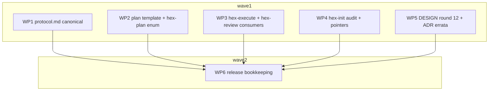

# Plan: adr_0010 execution performance — scoped verification, checkpoints, delta review, failure cascade

## Status

<!-- Status block - mandatory, must stay within the first 20 lines of the file. -->

- State:   done  <!-- planning → plan-approved → executing → review → done -->
- Tier:    high
- Updated: 2026-08-31
- Next:    —
- Finalized: 2026-08-31 — recomposed 30→2 signed commits, pushed `bd5ca85`, [PR #1](https://github.com/michael-herwig/arcana/pull/1) ready; no remote gate exists (publish is tag-driven)

---

## Overview

Implements **adr_0010** (`.agents/adrs/adr_0010_execution_performance.md`,
**Accepted** 2026-08-30, C-901–C-919 / S-901–S-910). The ADR is the design
record and the single source of every contract's text — WPs copy contract
wording **from the ADR**, never paraphrase, with **one declared authored-text
carve-out**: WP5's constitutional sentences (delta 1 below), pinned literally
in WP5's steps so Implement still copies, never composes. All edits are
markdown contract text in the `hex/` bundle plus one constitution round and
one release-bookkeeping pass; every edit lands in an existing file.

**Contract source:** coverage join keys are the ADR's own `C-9xx`/`S-9xx`
IDs — this plan assigns no new IDs.

**Execution caveat:** this run executes under the currently-installed
`.claude/skills/hex-*` copies (already drifted pre-plan), so it runs
pre-adr_0010 policy throughout and cannot dogfood any contract it lands —
the dogfood docket below is Michael's post-merge run.

**Discovery deltas vs the ADR (all three folded into WP scopes and recorded
by WP5's ADR erratum rows):**

1. `hex/DESIGN.md:195-200` (*Plan visualization* lock) — the ADR claims
   three prior **in-place** amendments (`ADR:744`, `:760`, `:837-839`);
   ground truth is two in place (`status`, review budget) plus `Repo` as a
   **standalone round-8 addendum bullet** (`DESIGN.md:524-535`) never folded
   into the base enumeration. WP5 amends the lock folding **`Repo` and
   `Verify`** in, corrects all three ADR sites, and ships round-12 text that
   makes the corrected claim (literal sentences in WP5).
2. `hex/hex-plan/SKILL.md:271-272` — a second independent column enumeration
   omitting `Repo`, absent from C-916's site table. WP2 adds `repo` and
   `verify` there; WP5's erratum row records the site-table addition.
3. C-917's home says "`hex-init/SKILL.md` Step 1/2"; the Pointers rows are
   written in **Step 5** (Bootstrap) — WP4 wires Steps 1/2/**5** and the
   erratum row records the widened home.
4. *(post-stub panel, 2026-08-30)* C-916's site table misses two
   `hex-review/SKILL.md` sites the contracts themselves create: the
   Status-block write-set enumeration gains the `Reviewed:` member
   (additive — incomplete, not false) and the `done` write at ~:282-285
   becomes conditional under C-913(f) (becomes false → qualifier + link,
   WP3 executes). WP5's erratum rows record both site-table additions,
   plus two ADR-claim corrections: `ADR:643` (the "inside the first 20
   lines" justification is false against the shipped template — `State:`
   sits at :24 pre-ADR) and `ADR:653` (C-912 names two homes for the
   schedule log; resolved to replace-`## Progress Log`-in-place).

## Contracts and scenarios (coverage index)

All contract text lives in the ADR — this index maps IDs to WPs; the WP
tables' `Scope` cells are the canonical join. C-919's sub-clauses split:
(a)(b)(d) → WP6, (c) → WP5, (e) → WP1/WP2/WP4.

| IDs | Substance | WP(s) |
|---|---|---|
| C-901 | merge gate: scoped check, 3 policy triggers + 2 override paths | WP1 (canonical), WP3 (qualifiers) |
| C-902, C-903, C-904, C-906 | scoped-check floor + convention; checkpoints; bisection | WP1 |
| C-905 | budget-column family, `Verify`, `Verify-default:`, Review retro-claim | WP1 (assignment), WP2 (template), WP5 (lock) |
| C-907, C-908, C-909, C-911 | anchor, validation, delta rounds, stop | WP1 (rules), WP2 (template line) |
| C-910 | hex-review baseline step, empty-delta carve-out | WP3 |
| C-912 | schedule log grammar (sole source) / template section / write site | WP1 / WP2 / WP3 |
| C-913 | failure cascade + `done` precondition (incl. archive.md qualifier) | WP1 |
| C-914, C-918 | stated non-changes — **exempt** (negative checks, final sweep; per the ADR § Validation negative-check items) | — |
| C-915 | presence-check compat | WP1 (restated rule), WP2 (absent-defaults) |
| C-916 | sole definition sites + site-table discipline | WP1, WP3, WP5 + final sweep |
| C-917 | hex-init audit item + two Pointers rows | WP4 |
| C-919 | release (a)(b)(d) / round 12 (c) / core+template wiring (e) | WP6 / WP5 / WP1+WP2+WP4 |
| S-901, S-903, S-908, S-910 | checkpoint/bisect/cascade/coordinator walks | WP1 |
| S-902 | sensitive-path high-risk walk | WP1 + WP4 |
| S-904, S-905 | selective-command runs | WP1 + WP4 |
| S-906, S-907 | stop fires; invalidated anchor falls back | WP1 + WP3 |
| S-909 | pre-adr_0010 plan executes unchanged | WP2 |

## Parallelization

| WP | Scope | Expected Files | Size | Wave | Depends on | Review | Verify | Status |
|---|---|---|---|---|---|---|---|---|
| WP1 | C-901–C-909, C-911, C-912(grammar), C-913, C-915(restated), C-916(canonical), C-919(e-core); S-901–S-908, S-910 | hex/hex-core/references/protocol.md, hex/hex-core/references/archive.md | L | 1 | — | panel | full | merged |
| WP2 | C-905/C-907/C-912(template), C-915(defaults), C-919(e-template); S-909; delta 2 | hex/hex-init/assets/templates/plan.md, hex/hex-plan/SKILL.md | M | 1 | — | light | scoped | merged |
| WP3 | C-901(qualifiers), C-910, C-912(write site), C-916(sites); S-906/S-907(review side) | hex/hex-execute/SKILL.md, hex/hex-execute/tier-medium.md, hex/hex-execute/tier-high.md, hex/hex-review/SKILL.md | M | 1 | — | light | scoped | merged |
| WP4 | C-917, C-919(e-memory); S-902/S-904/S-905(convention side); delta 3 | hex/hex-init/references/audit.md, hex/hex-init/SKILL.md, hex/hex-core/references/memory.md | M | 1 | — | light | scoped | merged |
| WP5 | round 12, C-905(lock), C-916(DESIGN rows), C-919(c); deltas 1+2+3 errata | hex/DESIGN.md, .agents/adrs/adr_0010_execution_performance.md | M | 1 | — | panel | scoped | merged |
| WP6 | C-919(a)(b)(d) | hex/publish.toml, hex/CHANGELOG.md, hex/README.md | S | 2 | WP1, WP2, WP3, WP4, WP5 | self | scoped | merged |
| WP7 | C-907(rationale parity), C-916(write-set parity) + all 13 review-round-1 actionable findings + changelog stranded-set clause (docket: § Review round 1 fix docket) | hex/hex-core/references/protocol.md, hex/hex-review/SKILL.md, hex/hex-execute/SKILL.md, hex/hex-execute/tier-medium.md, hex/hex-execute/tier-high.md, hex/hex-init/assets/templates/plan.md, hex/CHANGELOG.md, .agents/adrs/adr_0010_execution_performance.md | S | 3 | WP1, WP3, WP5 | light | scoped | merged |

*(The `Verify` column above is aspirational vocabulary from the ADR this plan
implements — the executing bundle predates it and runs full verification per
merge regardless; it is carried so the plan dogfoods its own table shape.)*

- **Critical path:** WP1 → WP6 (WP1 largest; the sole-source home every
  other WP links to).
- **Shippable after wave: 1** — the full contract surface; WP6 is release
  bookkeeping only.
- **Merge order** (topological, serialized): WP1, WP2, WP3, WP4, WP5, WP6 —
  WP1 first so every link target exists on the branch when its linkers
  merge; the project's documented verification (full `grim build` per
  changed skill) runs after each merge — this plan predates its own ADR's
  policy.
- File-disjointness: WPs 1–5 own disjoint **files**; shared *directories*
  are `hex-core/references/` (WP1: protocol.md+archive.md; WP4: memory.md)
  and `hex-init/` (WP2: the template; WP4: SKILL.md+audit.md) — per-file
  disjointness holds everywhere. Five parallel WPs is the widest cut the
  file sets permit.
- **Sub-overhead justifications:** the former hex-review WP is folded into
  WP3 (both consumer-side qualifier/step edits, mutually file-disjoint —
  the fold protocol.md's threshold prescribes). WP6 stays isolated despite
  its size because it must run after every other merge (wave-2 dependency
  is structural, not a parallelism choice).
- **Review budgets:** WP1 `panel` — canonical correctness-critical text, L.
  WP2/WP3/WP4 `light` — bounded edits copying settled ADR text; no
  security- or hot-path files. WP3 spans two skill dirs post-fold, but
  every edit is a one-clause docs qualifier/link/step — the shipped
  heuristic's docs-only baseline is `self`, so `light` already sits above
  it; the cross-area routing to `panel` targets rule-carrying work this WP
  is checklist-forbidden from doing. WP5 `panel` — it amends the **binding
  constitution in place** and edits an Accepted ADR; the only WP carrying
  authored (pinned) rather than copied sentences. WP6 `self` — version/
  changelog bookkeeping; per protocol.md's `self` rule the branch-level
  `/hex-review` pass is **mandatory before landing** and the execution
  handoff must record it.

## Implementation Steps

Every WP follows Stub → Specify → Implement → Review. Stub = place
headings/anchors/empty subsections; Specify = a tester writes an
**executable checklist file** — shell-runnable grep/anchor assertions plus
enumerated text-walk steps a reviewer confirms; a **worktree-local Specify
artifact, never committed** (a committed checklist would fail merge-time
file-set re-validation — no WP's Expected Files lists one) — that FAILS
against the stub (this is the established test shape for contract-text WPs in this
repo: adr_0008/0009 plan precedent; C-902's *runtime* semantics are
validated by text-walks here and by the dogfood docket at run time, never
by executing hex in this plan); Implement = copy in the ADR text (WP5: the
pinned sentences); Review = per budget. The two deliberately manual gates
(anchor sweep, text-walks) are named reviewer gates, not silent
assumptions. "Verify" per WP = `grim build
<changed skill dir(s)>` exit 0 (WP1: hex-core; WP2: hex-init, hex-plan;
WP3: hex-execute, hex-review; WP4: hex-init, hex-core; WP5: none — checklist
is the gate; WP6: none beyond the final sweep).

### WP1 — protocol.md canonical text (+ archive.md qualifier)

The sole-source home. Four sections, all under **existing** headers; ADR
§ Component contracts is the text source.

- [ ] **§ Verification** gains subsections *Scoped check* (C-902: two-part
  floor, trailing-path convention, both degrades logged `full(degrade)`;
  C-906: opaque template, `{base}`/`{files}`, zero-placeholder validity,
  pre-flight + post-failure fallbacks, authoritative-class-only trust rule)
  and *Checkpoints* (C-903: dual trigger `M = 3`/level-clear/high-risk,
  counter reset, `(Repo, path)` hub predicate, clause-(1)-vacuous note,
  degenerate case).
- [ ] **§ Worktree work-package mechanics**: replace the `:542` sentence
  with C-901's merge-gate text (note: the replacement reads "after each
  **WP** merge onto the feature branch" — neither validation grep phrase
  survives in protocol.md, by design); amend the `:552-559` playbook with
  C-904 (window bisection, `⌈log₂ M⌉` bound, no-window cases → ordinary
  RCA, "failure did not bisect", no guessed `failed`) and C-913(b)
  (non-halting cascade); add C-915's no-marker restatement beside
  `:580`/`:608`.
- [ ] **§ The Review-Fix Loop**: C-907 (anchor, two scopes, `Reviewed:`
  grammar, one-writer rule), C-908 (two ancestry tests, fail-safe fallback,
  missing-object rule, finalize/backup-ref notes), C-909 (delta scope,
  per-scope converged full pass, three miss classes, shrink-in-addition
  rule), C-911 (Block/High floor, no-new-Block/High clause, tier-low
  degrade, expectation-not-law ground).
- [ ] **§ Parallel-by-default decomposition**: C-905 (budget-column family,
  direction rule, `Verify` grammar, `Verify-default:`, Review retro-claim
  **unchanged in every byte**), C-912 (schedule-log grammar — six-trigger
  vocabulary, mandatory post-merge SHA, optional `<elapsed>`), C-913(c-f)
  (derived strandedness, eager one-pass report, `done` precondition).
- [ ] **archive.md**: the one-clause C-913(f) qualifier (a run with
  stranded WPs never reaches `done`).
- [ ] Checklist (Specify) asserts, minimum: protocol.md contains **zero**
  unqualified `after every merge` / `after each merge` occurrences and the
  C-901 sentence reads "after each WP merge"; `scoped check` has exactly
  one defining occurrence (plus links/qualifiers); a **wrap-guard** pass —
  `grep -Pzo '(?i)after\s+every\s+merge' <file> | tr -cd '\0' | wc -c`
  (and the same for `after\s+each\s+merge` and `scoped\s+check`; `\s+`
  matches a hard-wrap newline, no `.*` bridging; `-Pzoc` alone cannot
  count — `-z` makes the whole file one record) — over each changed file,
  its count reconciled against the single-line grep's for that file; every intra-file anchor the new
  text links resolves; **C-906 walk** (template substitution of `{base}`
  and `{files}`, zero-placeholder run, both fallbacks present with their
  triggers); **C-909 walk** (converged pass resolves to the WP branch's own
  base in WP scope, the feature branch in branch scope); **C-911/S-906
  walk** (stop fires on the flat Block/High pair, not on Warn/Suggest
  churn); S-901/S-903/S-908/S-910 walks; the Review-column text byte-equals
  the shipped original; no literal model name; the hex-core amendments
  match C-919(e)'s enumeration for this WP's files.

### WP2 — plan template + plan-authoring enumerations

- [ ] `plan.md` Status block: `- Reviewed:` and optional
  `- Verify-default:` lines **after `Next:`, before `Repos:`**, with the
  ADR's comment text.
- [ ] `plan.md:157` table header: `Verify` immediately after `Review`;
  grammar comment (`scoped | full`, raise-only, missing = `scoped` or the
  plan's `Verify-default:`).
- [ ] `plan.md:202-204` merge-order sentence: names the scoped check +
  links § Verification.
- [ ] `plan.md:400-404`: `## Progress Log` replaced by `## Schedule log`,
  C-912's one-line grammar as the comment, created-on-first-write note.
- [ ] `hex-plan/SKILL.md:271-272`: enumeration gains `repo` and `verify`
  (delta 2).
- [ ] Checklist: S-909 walk (absent column/line/section ⇒ stated
  defaults); the template renders identically for a plan without the new
  fields; the two new Status lines add **exactly two lines and displace no
  mandatory field** (the template's comment block already places `State:`
  at :24 — pre-existing, out of scope); the `:272` enumeration lists
  `repo` and `verify`; the schedule-log grammar comment **byte-matches the
  ADR's C-912 grammar line** (WP2's worktree branches from the frozen base,
  where protocol.md's copy does not exist yet — the protocol.md cross-check
  happens at the final sweep); the template amendments match C-919(e)'s
  enumeration for plan.md (Verify column, Reviewed: line, Schedule log
  replacing Progress Log).

### WP3 — hex-execute + hex-review consumer edits

hex-execute side:

- [ ] `SKILL.md:444`: one-clause qualifier + link (§ Verification).
- [ ] `SKILL.md:522`: the recompute step gains the schedule-log write as a
  **link to C-912's grammar in protocol.md** — one clause naming the write
  and where its grammar lives, restating nothing (the dispatcher carries no
  rule).
- [ ] `tier-medium.md:114`, `tier-high.md:141`: one-clause qualifiers +
  links. Nothing else in the tier files changes; `SKILL.md:253`'s worked
  example is **not touched** (its sentence stays true — C-916 forbids
  touching true sentences).

hex-review side:

- [ ] `SKILL.md` Dispatch step 2: insert C-910's anchor step after
  `--base`, before the PR base (conditions: traced plan carries a valid
  C-908 anchor AND the invocation continues that plan's loop; `--base`
  always wins).
- [ ] The `:106` clean-exit carve-out: empty `anchor..HEAD` proceeds to the
  converged pass; clean exit only for an empty baseline-to-HEAD with no
  pass outstanding.
- [ ] The `Reviewed:` write (one-writer rule, branch scope only) joins the
  existing Status-block write set.
- [ ] Checklist: **no rule restated in any of the four files** —
  link-or-qualifier only; the two grep phrases' hits in these files match
  the re-derived allowed list; **C-910 negative** (C-910's own text — no
  scenario covers it): every invocation that is not a continuing loop
  round resolves the baseline exactly as today; S-906/S-907 walk (review
  side).

### WP4 — hex-init audit item + Pointers rows + memory.md

- [ ] `audit.md`: new top-level item **"Selective test command
  documented?"** in the four-part shape (Look for / Where — checked-in
  files only / Documented looks like — a runnable template with its
  placeholders / De-facto discovery — nx.json, turbo.json, `.testmondata`,
  affected-shaped CI jobs; adoption via pointer, never invention; **no
  self-degrade flag**), plus a matching best-practice block.
- [ ] `SKILL.md` Steps 1/2/**5**: one line each wiring the item and the
  **two** Pointers rows (selective-test-command home; sensitive-path-
  convention home — C-903 clause (1)'s source), consent mechanics
  unchanged (delta 3).
- [ ] `memory.md:188`: the Pointers enumeration gains both homes.
- [ ] Checklist: **S-902 walk** (a documented sensitive-path row makes the
  high-risk trigger evaluable; absent row ⇒ clause (1) vacuous, never an
  error); S-904/S-905 convention shapes representable in the recorded row;
  the new item stays network-free (consistent with audit.md's existing
  per-item claims — note the `:204` "nothing here reaches the network"
  sentence is Federation-item-scoped, so assert the property, don't cite
  that line); four-part shape matches the verification item's; memory.md's
  Pointers change matches C-919(e)'s enumeration.

### WP5 — DESIGN.md round 12 + lock amendment + ADR errata

Authored-text carve-out: the following sentences are pinned here; Implement
copies them literally.

- [ ] Append **round 12** after `DESIGN.md:829` from the ADR's proposed
  text, with **two corrections** (delta 1): the preamble sentence
  (`ADR:760`) becomes: *"The third is a live lock and is amended in place —
  its enumeration has been amended twice in place before (`status`, round
  5; the review budget, the 2026-07-20 perf pass) and once by round 8's
  standalone addendum bullet (`Repo`, C-302), which this round folds into
  the base text."* Amendment 3's precedent sentence (`ADR:837-839`)
  becomes: *"It has been amended by explicit act three times already —
  twice in place (`status`, round 5; the review budget, the 2026-07-20 perf
  pass) and once as round 8's standalone addendum bullet (`Repo` in second
  position, `adr_0004` C-302, whose deviation row is the shape this one
  follows); this round folds that addendum's outcome into the base
  enumeration, which had never absorbed it, alongside `Verify`."*
- [ ] `DESIGN.md:195-200` lock replaced by: *"**Plan visualization (locked
  2026-07-19):** WP table is the canonical artifact (id, scope, expected
  files, size, wave, depends-on — plus status since round 5, the review
  budget since the perf pass (C-905), `Repo` in second position since
  round 8 (C-302), and `Verify` immediately after `Review` since round 12
  (C-905));
  one mermaid `graph TD` with a subgraph per wave as a visual index (gantt
  and gitGraph rejected — brittle syntax, silent render failures); plan
  stays fully actionable from the table alone."* Round 8's bullet
  (`:524-535`) stays byte-unchanged as the historical amending act.
- [ ] `### Worktrees` region: append one erratum pointer line between the
  end of the lock bullet (~:200) and `### Staleness`, following round 11's
  `**Erratum pointer (2026-08-30):** …` shape. **Pinned (authored
  carve-out, same as the sentences above; re-pinned after the WP5 panel —
  the first pin mis-classified the Review-budget addendum as superseded
  where round 12 retro-claims it byte-unchanged; v3 narrows its range to
  `:187-189` and adds the round's location):** *"**Erratum pointer
  (2026-08-30):** round 12 (§ Execution-performance round, below) amends
  this section by pointer, bytes intact: it supersedes round 4's
  "verification after every merge" (`:172`) — the per-merge default is
  now the scoped check, with full verification at the checkpoints round
  12 names — and retro-claims the 2026-07-20 Review-budget addendum
  (`:187-189`) under C-905, semantics unchanged, joined by a `Verify`
  sibling."* (Verify both line refs resolve before writing; adjust the
  refs, never the substance.) No other § Worktrees bytes change beyond
  the `:195-200` lock replacement above and this appended line — the
  bytes-stand guarantee is scoped to `:172` (superseded by pointer only)
  and `:187-189` (retained, retro-claimed).
- [ ] Copy mechanics: the ADR's round-12 text (`ADR:751-885`) is wrapped
  in a `> ` blockquote as "proposed text" — **strip the blockquote prefix
  on copy**; no DESIGN.md round is blockquoted. The `:195-200` lock
  replacement preserves the original entry's list shape (leading bullet
  marker and indentation as shipped).
- [ ] **ADR edits** (same corrections at their source, so the Accepted ADR
  stops asserting the false count): `ADR:744` (Constitution-deviations
  cell), `ADR:760`/`:837-839`, **and `ADR:694`** (C-916's site-table row
  carries the same false `Repo`-amendment equivalence — fourth site)
  corrected with the pinned sentences' substance; **`ADR:643`** corrected
  (drop the false "inside the first 20 lines" justification — the shipped
  template's `State:` sits at :24 pre-ADR; the placement rationale is
  after-`Next:`-before-`Repos:`, not a line budget); **`ADR:653`**
  reconciled (one home: replaces `## Progress Log` in place); **C-916's
  site table gains the two hex-review rows from delta 4** (write-set
  enumeration — additive; `done` precondition — becomes false);
  **C-901's schedule-log-vocabulary claim corrected** (tester-verified
  false: the final gate is not a merge and produces no log entry — the
  merge-triggered set appears in the `<trigger>` vocabulary, not "all";
  WP1 copies the adjusted sentence, the erratum row records the exact
  before/after from WP1's return);
  **ADR § Validation's two allowed-hit lists re-derived** (the
  round-12 quotes add two DESIGN.md hits; protocol.md contributes zero
  hits to either grep — C-901's sentence says "after each WP merge");
  **changelog erratum rows** (authority marker: *plan_adr_0010 discovery,
  2026-08-30; Status: Accepted, unchanged*) covering deltas 1+2+3+4, the
  two ADR-claim corrections, and the validation-list re-derivation.
  *(Post-panel authorization, 2026-08-30:)* the edit set additionally
  covers **C-904 clause (3) and S-903** (halt → non-halting cascade, at
  source), **C-909's cell** (the two promoted clauses: a full-scope
  converging round satisfies the pass; a `self` WP has no WP-level gate),
  and **corrections to the copied round-12 text itself** — the glossary
  worked-example/"four glossary sites" claims (three of four, `:225`
  excepted), the C-916 headline recount (six → eight), the stranded
  precondition's terminal-state widening, section-anchored citations
  replacing stale `protocol.md:<line>` cites, the round-4 → 2026-07-20
  attribution in amendment 2's heading, "this ADR" → "this round", and a
  wrap-idiom reflow — every copied-text correction landing **in both
  copies in lockstep** so the copy-fidelity diff stays empty.
- [ ] Checklist: **the ADR's § Validation lists now state, explicitly**:
  both greps expect **zero protocol.md hits** (C-901's sentence reads
  "after each WP merge"); the `after every merge` allowed set = the three
  qualified hex-execute lines, the SKILL.md dispatch-step line ("merge
  back onto the feature branch serialized"), `DESIGN.md:172`,
  round-12's quotations — the round's own quotes AND the § Worktrees
  erratum-pointer's quoted phrase (`DESIGN.md:204`) — and
  `hex/CHANGELOG.md`'s qualified escape-hatch line (WP7); the `after each merge` allowed set = the
  amended template merge note (if the phrase survives) plus round 12's
  own prose sentence ("tree provably good after each merge") — phrase
  anchors, not line pins (WP7); assert the rewritten ADR lines say
  this, not "verbatim";
  **no shipped round-12 sentence claims three prior
  in-place amendments** (grep DESIGN.md for the corrected wording); the
  "Considered and not deviated" paragraph lands verbatim; the two
  § Worktrees positions supersede by pointer with bytes intact; the lock
  enumeration lists all **ten** columns (id, scope, expected files, size,
  wave, depends-on, status, review budget, Repo, Verify); ADR changelog
  rows carry the authority marker; **every** round-12 occurrence of
  "after every merge" (wrap-tolerant, multi-line matched — the count
  differs between single-line and multi-line grep) sits inside quotation
  context, and the one "after each merge" prose sentence is the allowed
  one ("tree provably good after each merge" — phrase anchor, WP7);
  `grep -c '<!-- stub' hex/DESIGN.md` returns 0 (stale
  marker gate); no round-12 line in DESIGN.md carries a `> ` blockquote
  prefix; `ADR:694` no longer claims the enumeration was amended for
  `Repo`; the pinned § Worktrees erratum-pointer sentence lands verbatim
  (line refs adjusted only if they resolve elsewhere).

### WP6 — release bookkeeping (after all merges)

- [ ] `hex/publish.toml`: version → `0.4.0`.
- [ ] `hex/CHANGELOG.md`: `## [0.4.0]` — `### Added` (Verify column,
  Reviewed: anchor, schedule log, selective-test convention, stranded-WP
  report) / `### Changed` (per-merge gate default, non-halting cascade),
  **plus a Notes callout that states the per-plan escape hatch verbatim:
  `- Verify-default: full` restores pre-adr_0010 merge gates** (the ADR
  names this callout as one of the two mitigations — it must appear, not
  just the Changed classification).
- [ ] `hex/README.md`: one execution-flow line (scoped per-merge
  verification with periodic full backstops).
- [ ] Checklist: default change under Changed; the escape hatch present in
  the callout; no member added; version strings consistent.

## Verification

- Per WP: the builds listed in Implementation Steps' preamble, exit 0.
- **Final sweep** (after WP6, before handoff), replacing the ADR's
  "verbatim" instruction with re-derived expectations (the ADR's own lists
  are corrected by WP5):
  - `task publish -- --dry-run` exit 0.
  - `grep -rn "after every merge" hex/` — every hit is one of: a qualified
    tier/SKILL line (`tier-medium.md`, `tier-high.md`, hex-execute/
    SKILL.md's "verification after every merge" work-package sentence),
    the dispatch line (hex-execute/SKILL.md's "Recompute the ready-set"
    step), `DESIGN.md:172` historical text, `hex/CHANGELOG.md`'s
    qualified escape-hatch clause (WP7), or a
    quotation round 12 introduces — the round-12 section's quotes AND the
    § Worktrees erratum pointer's quoted phrase (wrap-tolerant counts are
    authoritative; a single-line count is a floor, not the truth);
    **protocol.md contributes zero hits**. Same policy
    for `"after each merge"` (expected: at most the amended template
    merge note if its wording retains the phrase, plus **round 12's own
    prose sentence** — "tree provably good after each merge" — phrase
    anchors, not line pins (WP7); the round-12 sentence WP5 is required
    to write and is allowed). Any other unqualified
    occurrence in shipped contract text fails.
  - **Wrap-guard**: per changed file,
    `grep -Pzo '(?i)<word1>\s+<word2>\s+<word3>' <file> | tr -cd '\0' |
    wc -c` for each target phrase (`after every merge`, `after each
    merge`, `scoped check`) — `\s+` absorbs a hard-wrap newline, no `.*`
    bridging; the null-count form is required because `-z` collapses the
    file to one record and `-c` cannot count matches — and the multi-line
    count must reconcile with the single-line grep's allowed list for that
    file (a higher multi-line count means a wrapped occurrence the
    single-line pass missed: locate and classify it).
  - **Accepted by design**: a wave-1 WP's own branch may carry a link
    whose protocol.md target lands only at merge time (frozen-base
    worktrees; per-WP `grim build` validates no anchors) — the serialized
    merge order plus the anchor sweep below is the gate, not the per-WP
    build.
  - **Anchor sweep (manual, mandatory)**: resolve every `](path#anchor)`
    this plan added or moved — `grim build` does NOT validate links or
    anchors (`hex.md › Memory`, proven repeatedly). Timing, stated once:
    it runs **after all wave-1 merges and before WP6's merge** completes
    the branch (WP6 touches no links, so the sweep's input is final).
  - **Consistency assertions**: the schedule-log grammar line byte-matches
    between protocol.md (canonical) and plan.md's comment; the
    **four** column enumerations (template header, DESIGN lock, the
    hex-plan second-enumeration sentence, and hex-execute/SKILL.md's
    free-text mini-table — nine columns incl. `Verify`, WP7) list
    the same set.
  - archive.md qualifier guard (WP7): wrap-tolerant grep for "terminal
    review state" in `hex/hex-core/references/archive.md` ≥ 1 — the
    C-913 `done`-precondition qualifier survives.
  - Negative checks: `git diff hex/hex-core/references/config.md` empty
    (C-918); no new state file, role, or recursion level in any diff
    (C-914); no literal model name in changed shipped files; C-9xx/S-9xx
    range contiguity.
- **Deferred docket (Michael's dogfood run, not this plan):** the ADR's
  five dogfood checks (ready-set timing, full-run count equation, delta
  review scopes, cascade behavior, externally-measured wall-clock with
  `S/F` + level count), the forced anchor-fail-safe test (`/hex-finalize`
  then `/hex-review`), and ADR marker 1 (slow-run phase attribution —
  check installed copies in the affected repos first).
- **Post-merge chore (not a WP):** refresh the dogfooded
  `.claude/skills/hex-*` copies in a separate chore commit (they are
  already drifted from the hex-discuss rework; the refresh covers both).

## Open questions

None. The ADR's three markers were accepted with their recommendations at
the gate (2026-08-30); marker 1 rides the dogfood docket, markers 2 and 3
are declined-for-v1 decisions already in the contract text.

## Review round 1 fix docket (2026-08-30, WP7 — gate-approved, all severities)

Authorized edits, decisions resolved here (living design record; ADR-side
corrections carry erratum rows with the standard authority marker):

1. **[High, C-907]** `protocol.md` placement rationale (§ The last-reviewed
   anchor region, ~:286-289): drop the retracted line-budget clause (erratum
   ADR-side already correct); keep only the ordering ground — immediately
   after `Next:`, before the unbounded `Repos:` ledger. No 20-line claim
   (the template's invariant is file-scoped, not block-scoped).
2. **[High, codex]** ADR dogfood check 2 ("Full-run count", § Validation):
   re-derive tag-partitioned — the four counts are read from the log's own
   `<trigger>` tags (disjoint by the one-entry-first-token rule); the four
   structural counts become upper-bound cross-checks with one coincidence
   clause. Erratum row, codex attribution.
3. **[Warn, C-916]** `hex-review/SKILL.md` Review-only contract + Constraints
   bullet: both write-set enumerations gain the `Reviewed:` anchor mention
   (parity with the rule already at the diff-scope constraint).
4. **[Warn]** ADR `after every merge` allowed set: append `hex/CHANGELOG.md`'s
   qualified hit. Erratum row (may share row 2's table row block).
5. **[Warn]** Line-pins this diff itself shifted → phrase anchors, both
   sides (ADR § Validation + this plan's § Verification; plan side edited
   in this docket's companion edits). **Amendment (same day):** the three
   stale pins inside C-916's site-table contract cells
   (`hex-review/SKILL.md:268`, `hex-execute/SKILL.md:522`, `plan.md:203`)
   are in scope too — contract-cell edit, one erratum row authorized.
6. **[Warn]** `tier-medium.md`/`tier-high.md` merge-clause rewrite,
   byte-identical pair: "a **scoped check** runs after every merge — the
   project's full documented verification only on the triggers … names",
   subject = scoped check, no full-every-merge assertion. Qualified
   allowed-set membership unchanged.
7. **[Warn]** Template coordinator-parent row: `Verify` cell → `—`; sub-WP
   note extended to coordinator-owned parents (trigger (i) supersedes the
   cell).
8. **[Suggest]** ADR "one defining occurrence" item → mechanical pin:
   `grep -c 'A scoped check is' protocol.md` = 1.
9. **[Suggest]** Final-sweep grep added for the archive.md C-913
   terminal-state qualifier (phrase-pinned; plan § Verification side here,
   ADR § Validation side by the builder).
10. **[Suggest]** Trigger token `layer-clear` → `level-clear` (vocabulary
    parity with § Checkpoints' "dependency level"): `protocol.md` grammar
    line + ADR C-901/C-912 cells, S-901, §-analysis prose. The erratum row
    quoting the *old* C-901 sentence keeps its historical bytes. New
    erratum row records the rename. DESIGN round 12 carries no token —
    no lockstep.
11. **[Suggest]** Consumer trigger-links retarget `#verification` →
    `#worktree-work-package-mechanics` (the enumeration's actual home;
    keeps the "names" verb true): three byte-identical tier qualifiers +
    template § merge note. If the ADR C-916 site rows quote the anchor,
    erratum row.
12. **[Suggest]** `hex-review/SKILL.md` three new links → precise subsection
    anchors (`#anchor-validation`, `#delta-round-scope`,
    `#the-last-reviewed-anchor`).
13. **[Warn]** `hex-execute/SKILL.md` free-text mini-table enumeration →
    nine columns incl. `Verify` (matches the non-federated template
    header; free-text default `scoped`); the column-enumeration
    consistency assertion (here and ADR-side) now names four sites.
14. **[Docs nit]** CHANGELOG: one clause — `/hex-review` withholds the
    terminal Approve state while the run ends with a non-empty stranded
    set.

**Round-2 addendum (2026-08-30, gate = the owner's round-2 invocation; 5
one-liners, inline per the adr_0009 FX4 precedent):** erratum-row `degrade`
`=`→`≤`; the C-901-vocabulary row narrowed to the merge-gate text (the C-912
grammar line does list the tokens); the allowed-set row's `plan.md:203` pin →
the `**Merge order:**` phrase; the C-916 site-table intro states its pins are
pre-`adr_0010` (base `6d8bba0`) locations; the WP5-checklist allowed set names
the § Worktrees erratum-pointer phrase (parity with the final-sweep list).
Deferred additions: check-2 opportunity-ceiling counting rule (write from
dogfood evidence); `hex.md` historical `layer-clear` descriptor.

Out of scope, deferred to the owner docket: 12/19-contract static-check gap
(dogfood run as release gate), C-902 example latitude, C-912 disambiguation
ownership (partially mitigated by item 2's tag-partition), glossary/T5/
column-order/memory-Example items carried from execution.
