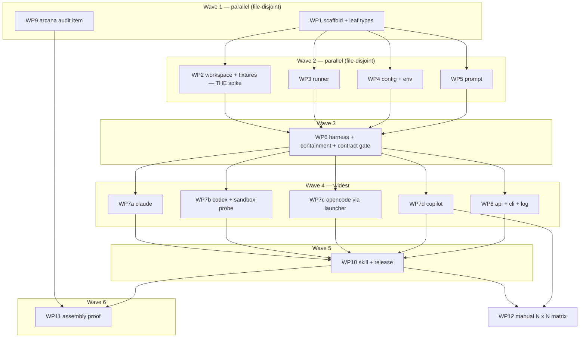

# Plan: nox — multi-harness adversarial review (adr_0011)

<!--
Implementation plan for adr_0011 (Accepted 2026-09-02). Owner: /hex-plan.
Handoff to: /hex-execute, /hex-review. nox lives **inside arcana** at
`nox/`, a sibling bundle directory of `hex/` (owner decision 2026-09-02,
superseding the ADR's separate repository — D-aa/E13). Contract IDs C-1001–C-1033 are carried from
the ADR, never renumbered. C-1034–C-1037 and C-1044 are plan-authored under
the ADR's "Deferred to /hex-plan" delegation; C-1038–C-1043 are
plan-authored from this run's research, decisions and the cross-model pass
(D-m, D-n, D-o, D-p, D-r, D-y). E1–E72 are errata and unspecified points corrected or
spelled in place. S-1001–S-1015 are this plan's. Plan slug:
`adr-0011-nox-adversary`.
-->

## Status

- State:   done      <!-- planning → plan-approved → executing → review → done -->
- Tier:    high
- Updated: 2026-09-04
- Reviewed: 8f5038c   <!-- turn 3's panel ran against d0e4067 and its verdict carries to cc8f88d (`git diff --name-only d0e4067..cc8f88d -- nox/src/ hex/` is EMPTY). /hex-finalize then caught that WP17 had landed AFTER that anchor with no panel behind it, so a scoped delta review covered cc8f88d..d9dd12c and returned clean; every commit since is doc-only or this line. -->
- Next:    merge [PR #2](https://github.com/michael-herwig/arcana/pull/2) — Michael's; `/hex-finalize` emits no command for it
- Finalized: 2026-09-04 (`/hex-finalize`) — 167 commits recomposed to 9 on
  `main`; `task nox:verify` exit 0 (2375 passed, 91 skipped, **100%** branch
  coverage over 2652 statements / 558 branches) and `task publish -- --dry-run`
  exit 0 on the pre-rewrite tree; backup ref `backup/hex/adr-0011-nox-adversary-440100a`.

---

## Overview

**Status:** Approved
**Author:** /hex-plan (tier high, 2026-09-02)
**Date:** 2026-09-02
**Issue/Ticket:** N/A
**Related PRD:** N/A
**Related ADR:** [adr_0011_nox_multi_harness_adversary.md](../adrs/adr_0011_nox_multi_harness_adversary.md) (Accepted) · [adr_0011_system_design.md](../adrs/adr_0011_system_design.md)
**Related Spec:** N/A (the ADR's § Contracts is the spec; no `.agents/specs/` target)
**Discussion:** [nox-multi-harness-adversary.md](../discussions/nox-multi-harness-adversary.md) (handed-off → architect)

## Objective

Ship **nox** v1: a zero-dependency Python library + `.pyz` CLI + grim skill
(`nox-review`) that lets any of **Claude Code, Codex, OpenCode, GitHub
Copilot CLI** (D-ab) headlessly
review a diff produced under another, from an ephemeral git worktree built
from neutralized synthetic commits (Option C) — and make hex discover it
(C-1033) without coupling the two. Everything the ADR labels unverified
(Codex sandbox, stash→worktree flow, OpenCode config precedence) is proven
by a real fixture or real binary inside this plan, or the scope is cut
where the ADR says it cuts.

## Scope

### In Scope

- New bundle directory `nox/` in arcana, sibling of `hex/`, internally
  modelled on `ocx-sdk-python`: `nox/pyproject.toml`, `nox/Taskfile.yml`
  (included from the root `Taskfile.yml` as `nox:*`), `nox/src/nox/{liveness,
  capability,outcome,runner,workspace,config,prompt,harness,log,api,cli}.py`,
  `nox/src/nox/adapters/{claude,codex,copilot,opencode}.py`,
  `nox/tests/{unit,contract,acceptance,fixtures}/`, uv + ruff + pyright
  strict + pytest; branch coverage `fail_under = 100` gated on the Linux CI
  leg (one `# pragma: no cover`), macOS legs run the suite ungated (R11).
- The SD § 9.4 adversarial acceptance fixture and every ADR § Validation
  item a test can carry (18 items, mapped in § Implementation Steps).
- `nox/nox-review/SKILL.md` (`nox-review`) with the C-1033 marker keys;
  `nox/nox-review/scripts/nox.pyz` built deterministically at release
  (gitignored); `nox/publish.toml` + `nox/nox.toml`, so arcana's existing
  `task publish` sweep and tag-driven `publish.yml` ship it to
  `ghcr.io/michael-herwig/arcana/nox` alongside hex — one release train,
  one tag (D-aa).
- Local release gate folded into arcana's `task release:prepare`
  (real-binary contract suites, absent binary blocks, deterministic build,
  digest into the signed tag message) → owner-signed tag, verified by
  `publish.yml` before it builds and publishes.
- arcana: `/hex-init` audit item "Cross-model adversary skill installed?"
  (C-1033 hex half) — `hex/hex-init/references/audit.md`,
  `hex/hex-init/SKILL.md`, `hex/CHANGELOG.md`, one ADR 0011 addendum row.
- The eight items the ADR deferred, plus the research amendments — decided
  in § Key Decisions, contracted as C-1034–C-1042 and errata E1–E11.

### Out of Scope

- Cursor adapter (documented extension point, SD § 9.3). **Copilot is no
  longer out** — it joined v1 as the fourth harness by owner addendum
  (D-ab, E14).
- Codex `app-server` transport, brokers, warm-server reuse (C-1024).
- `isolation = "in-tree"` escape (Option D), trusted-context opt-in for
  `CLAUDE.md`/`AGENTS.md`, concurrency beyond the serialized default.
- PyPI publication of any kind (owner: `nox` kept, no wheel ever).
- CI as a consumer of nox (gate decision: subscription auth cannot log in
  on a hosted runner; CI verifies the tag, builds and publishes only).
- Windows (D-j — v1 scope decision, `UNSUPPORTED` before any spawn;
  **owner ratification requested at handoff**).
- A trust-granting CLI verb for repo-local `nox.toml` permission keys
  (D-w — v1 fails closed).
- ~~Any change to hex's adversary contract (`protocol.md` § Adversary
  contract) — C-1001.~~ **Struck (owner ruling 2026-09-04, WP15).** WP13
  widened the degrade clause to close E45; the change is right and strictly
  safer, so the bullet goes rather than the code. See § Constitution
  Deviations and `hex/DESIGN.md` round 13.
- Process-lifetime containment beyond the process group — a descendant
  backgrounded across a clean exit, or one that calls `setsid()`, outlives
  the review (D-ac, E17). `PR_SET_PDEATHSIG` and cgroup v2 delegation are
  Linux-only; `os.waitid` is absent on macOS before CPython 3.13, against a
  3.11 floor. `JOIN_S` bounds nox's own return, never the survivor.

## Research

**Research artifacts** (this run, tier-high 3-axis; every finding below is
cited from § Key Decisions):

- [plan0011-tooling.md](../research/plan0011-tooling.md) — `python -m zipapp`
  does **not** honour `SOURCE_DATE_EPOCH` (cpython#89507 open): the build
  script must fix `ZipInfo.date_time` itself, stage-then-zip, sorted. ~27% of
  Python users are < 3.11 → `cli.py` needs a `sys.version_info` guard with a
  real message. All three vendors structurally steer OAuth sessions away from
  headless CI → confirms the local release gate; a self-hosted runner is the
  same trust boundary with more moving parts. GHCR packages publish private
  with no API to flip public. `uv sync --locked`, not `--frozen`. No
  tag/notes attestation theatre — a signed tag is the trust boundary, so CI
  must actually verify it (C-1037).
- [plan0011-patterns.md](../research/plan0011-patterns.md) — the ADR's
  threads-over-queue + `Runner`-wraps-creation-only design matches
  Anthropic's own `claude-agent-sdk-python` (same `stream-json` target).
  Amendments: bound line reads (a JSON line can span `read()` calls); the
  Windows kill path is a different primitive → declare the platform scope;
  rely on pyright strict `reportMatchNotExhausted` rather than a catch-all
  `assert_never`. `codex-plugin-cc` has a live Windows shell-wrapped-spawn
  framing bug — `shell=False` (C-1009) guards a real failure class.
- [plan0011-domain.md](../research/plan0011-domain.md) — non-credential-
  shaped denylist entries for C-1008 (`NODE_OPTIONS`, `LD_PRELOAD`/
  `DYLD_INSERT_LIBRARIES`, `OPENCODE_CONFIG_CONTENT`, inherited
  `GIT_CONFIG_*`); `codex exec review` has **no** `--sandbox` flag —
  `-c sandbox_mode="read-only"` is the sole gate and enforcement must be
  proven by a nox-authored write probe (no denial event in the JSONL); Codex
  moved 0.144.1 → 0.152.1 since the ADR (0.150.0 stopped honouring
  `AGENTS.md` for untrusted projects); arXiv:2607.21656's measured-negative
  cell is model-pinned (writer `claude-opus-4-7`, reviewer `gpt-5.5`) → the
  warning keys on the model pair; git floor ≥ 2.32.0 (`GIT_CONFIG_COUNT`);
  severity lowercase on the wire confirmed verbatim from `codex-plugin-cc`'s
  `review-output.schema.json`.

Prior artifacts (discussion + architect runs): `nox-security.md` (Expires
2026-11-30), `nox-tech-tooling.md`, `nox-pattern-precedent.md`,
`discuss-nox-priorart.md` (line ≈87: arXiv:2606.19544 figure **retracted**,
do not cite), `discuss-nox-vendor.md`.

**Live probes this run** (not persisted beyond this plan): `codex exec
review --help` identical at 0.144.1 (local) and 0.152.1 (`npm` scratch
install) — `--json`, `--ephemeral`, `--strict-config`, `--ignore-user-config`,
`--ignore-rules`, `--output-schema`, `--base` present, **no** `-s/--sandbox`
(E8 confirmed, zero drift). Claude Code local 2.1.258: every relied-on flag
present. OpenCode 1.18.22 through `ocx package exec
ocx.sh/anomalyco/opencode:1.18.22 -- opencode …`: `providers` exists
(alias `auth`) and `providers list` works — the ADR's preflight command is
real; `models` prints `provider/model` literals; `run` carries `--format
json`, `-m provider/model`, `--agent`, **`--variant`** (provider-specific
reasoning effort — OpenCode's effort knob for C-1030), **`--pure`** ("run
without external plugins" — a candidate plugin off-switch), and the
value-carrying/dangerous flags `--auto`, `--share`, `--attach`, `--port`,
`--command`, `-c/--continue`, `-s/--session`, `--fork`, `-f/--file`,
`--dir`, `-i/--interactive` (→ `DENIED_FLAGS`, WP7c). The credential store
on this machine holds **0 credentials**; the only provider is env-supplied
(`GITHUB_TOKEN`), which C-1008 drops by design — R10.
[openai/codex#15769](https://github.com/openai/codex/issues/15769) shows
the review turn attempting shell commands under the sandbox — D-v.

Discovery (this run, not persisted): 33/33 contract census with test
kinds — eight contracts need a real vendor binary for full proof (C-1007,
C-1011, C-1012, C-1014, C-1020, C-1025, C-1030, C-1032); every other one is
provable with fakes, fixtures or real git alone. `ocx-sdk-python`'s
`_process.py` `PopenFactory` seam + `_FakePopen` scripted double map onto
`Runner`/`Process` + `SubprocessRunner`; its `_gated()` skip-wrapper is the
mechanism to *invert* for the release gate. arcana side: four files, no
`hex/DESIGN.md` round (precedent: the "Commit and landing requirements
documented?" item shipped with none); no existing audit item scans
*installed* skills — a new "Where" kind. The ADR's Component-contracts block
holds **two import cycles** (`workspace`↔`api` via `ReviewTarget`,
`harness`↔`api` via `ReviewRequest`) — resolved structurally by E9a.

## Technical Approach

### Architecture Changes

```
arcana/
  hex/  ← the hex bundle (unchanged except WP9)
    hex-init/references/audit.md   + "Cross-model adversary skill installed?" (C-1033 hex half)
    hex-init/SKILL.md (Step-1 link) · CHANGELOG.md
  nox/  ← the nox bundle (new, sibling of hex/)
    pyproject.toml · Taskfile.yml (`nox:verify` · `nox:build` · `nox:release-gate`) · publish.toml · nox.toml
    src/nox/            ← the library (ADR § Component contracts + E9)
    src/nox/adapters/   ← claude · codex · copilot · opencode (lazy, string registry)
    tests/unit|contract|acceptance|fixtures
    nox-review/SKILL.md ← `nox-review`, marker metadata (C-1033 nox half, C-1042)
    nox-review/scripts/nox.pyz ← built at release (C-1038), gitignored
    scripts/build_pyz.py
  .github/workflows/nox-ci.yml (new) · publish.yml (+ verify-tag · nox build · digest gate)
  Taskfile.yml (+ `includes: nox`) · taskfiles/release.taskfile.yml (+ `nox:release-gate`)
  .agents/adrs/adr_0011 (addendum row) · .agents/memory/hex.md › Preferences
    adversary: nox-review  ◄── proposed by /hex-init with consent, never pinned unasked

consumer (hex /hex-review · human · CLI)
   │ skill `nox-review` (scope code-diff | plan-artifact)  ← unchanged hex seam (C-1001)
   ▼
nox.api.review() ── TOTAL (C-1029) · POSIX only (D-j) · git ≥ 2.32 (C-1041)
  config.load (drop-untrusted → validate) → minimal_env (drop → set, C-1034)
  → ADAPTERS[key] → adapter.probe (empty cwd) → workspace (neutralize objects · synthetic pair · worktree · diff)
  → adapter.containment_plan → adapter.prepare (capabilities · passthrough allowlist)
  → supervise(Runner.spawn) → adapter.parse (tri-state) → Containment derived from argv (C-1025)
   ▼
Review{status, verdict, findings[], containment, heartbeat, model, model_class, harness_version, verified_against, warnings (C-1035), raw}
```

**Module import DAG** (after E9 — one root, one sink, adapters reached only
through the `ADAPTERS` string registry, which is what lets WP7a–WP7d run
concurrently with WP8):

```
liveness ──► capability (also owns Launcher, Enforcement, ModelClass, ModelSpec — E9b)
   │            ├──► outcome (also owns NoxError) ──► prompt · log · workspace
   │            └──► config
   └──► runner
workspace ◄── outcome (NoxError for IsolationError) — owns ReviewTarget (E9a); WP1 → WP2
harness ◄── capability, config, outcome, runner, workspace, prompt
   └──► adapters/{claude,codex,copilot,opencode}   (lazy, dotted strings)
api ◄── harness, workspace, config, outcome, capability, runner, log
cli ◄── api, config
```

### Key Decisions

Decisions on the ADR's deferred items, the research amendments and the
review round. "Lands in" names the WP; contract text is in § Component
Contracts.

| # | Item | Decision | Rationale | Lands in |
|---|---|---|---|---|
| D-a | env-key handling (delegated) | `minimal_env()` returns `(env, dropped_names)`; shipped `NEVER_FORWARD` literal (incl. `NODE_OPTIONS`, `LD_PRELOAD`, `DYLD_*`, `OPENCODE_CONFIG_CONTENT`); `PATH` rebuilt; inherited `GIT_CONFIG_*` dropped **then** nox's set; `UNAUTHENTICATED` detail names dropped auth vars | C-1008 is an allowlist so the additions are already dropped by construction — the literal is the regression guard a future "add one more" edit is tested against; C-1008 rule 4 already resolves the C-1031 conflict, the plan makes it testable | WP4 · **C-1034** |
| D-b | asymmetry warning (delegated) | Keyed on the **model pair** via `ReviewRequest.authored_by`; shipped `ASYMMETRY_NEGATIVE = (("claude-opus-4-7","gpt-5.5"),)`; non-blocking; `None` ⇒ silent; reachable from the skill via the optional `--authored-by <model>` flag (C-1042 item 4) | The paper pins models, not harnesses; nox reviews a diff and does not know who wrote it — without a writer input the warning is unimplementable; without the flag it would ship dead | WP6, WP8, WP10 · **C-1036** |
| D-c | severity case (delegated) | Lowercase on the wire **and** in Python; consumer title-cases; ingest case-insensitive | Both primary precedents (`codex-plugin-cc`, SARIF) are lowercase; `.lower()` on ingest stops OpenCode prose extraction resolving `indeterminate` on a capitalized token | WP1, WP5 · **E1** |
| D-d | CI as a consumer (delegated) | Dropped from the Context diagram. Release gate is **local**: arcana's `task release:prepare` gains `nox:release-gate`, `NOX_RELEASE=1` inverts skip→fail, owner signs the tag, `release.yml` **verifies the tag signature** before building/publishing on tag only. **Residual, accepted:** the signed tag is the only evidence the gate ran — step 5 is unverifiable post-hoc; a receipt would prove only that the owner typed a receipt; accepted for a single-owner pre-1.0 project | All three vendors push OAuth sessions away from headless CI; C-1020's original "one CI job with all three binaries" is therefore unreachable, and `NOX_RELEASE=1`'s fail-on-absent closes the failure it named (green by skip) | WP10 · **C-1037**, E2, E3 |
| D-e | unreachable `Liveness` members (delegated) | Keep all three | Deleting `PROCESS_ONLY` makes `TimeoutPolicy.silence_s` non-optional — a type change every caller and test encodes, wider to undo than the three lines saved | — |
| D-f | capability members with no reader (delegated: "trimming is a plan-time call") | Trim `Capability` to `ENUMERABLE_DENY`, `ENFORCED_READ_ONLY`, `STRUCTURED_OUTPUT`; the other four become a docstring evidence table. **Amends C-1013's "Kept for v1" per the ADR's delegation.** The ADR contradicts itself on `MODEL_SELECTION` (C-1030 rule 6 keeps it; the Deferred row lists it as trimmable): rule 6's behaviour survives **without** the member — an adapter whose `MODELS` has no entry for the requested class resolves the harness default and records `Review.model = None`; `Review.model_class` survives alongside `model` | Evidence belongs in a docstring; an unread member of a security enum invites a gate nothing checks; the rule-6 behaviour is a property of `MODELS`, not of a capability bit | WP1, WP6 · recorded as E4 |
| D-g | `Review` drift-signal fields (delegated) | Keep `harness_version` + `verified_against`; add `Review.warnings` as the single home for every advisory (five sources, C-1035) | The pair is machine-comparable; the string is the human surface; the advisories had no home | WP1 · **C-1035** |
| D-h | matrix decision scenarios (delegated) | Skip — presentation on an Accepted ADR; § UX Scenarios is the plan-level scenario coverage | No decision consequence | — |
| D-i | `next_steps` wire field | **Keep it in the schema nox asks for; give it no home on `Review`** — parsed and discarded | Not in the ADR's delegation; dropping it would change an Accepted wire contract on a *reading* of C-1019. Keeping the asked-for shape byte-identical and simply not surfacing the field satisfies C-1019 (nothing presented as authoritative) with no ADR change | WP5, WP8 |
| D-j | Windows | **POSIX-only v1 (scope decision, owner ratification requested at handoff)**; `review()` returns `error/UNSUPPORTED` on `win32` before any spawn; C-1009's `.cmd`-shim clause and C-1008's Windows env set are recorded inert (E6). **Not** an erratum: the ADR's Deferred table does not mention Windows, so this is a supported-platform decision — R7 | Decisive reasons, in order: (1) the CI matrix cost of a Windows leg with real process-group semantics; (2) the `.cmd`-shim resolution and `CREATE_NEW_PROCESS_GROUP`/`CTRL_BREAK_EVENT` kill path are unverifiable here (no Windows machine) and half-resolving cross-platform behaviour is worse than declaring the cut (`plan0011-patterns.md`). The pragma-budget argument is **not** load-bearing — `supervise()` takes `kill` as an injected callable, so a Windows kill callable would cost no second pragma | WP3, WP8 · E6, R7 |
| D-k | NDJSON drain | `readline(1 << 20)` loop **inside the ADR's dedicated drain thread**, feeding `Process.lines()`; `supervise()` polls the queue with the C-1010 timeouts and never blocks on a read; bytes summed in `supervise()` for the 8 MiB cap; no framer class | Python file objects already reassemble lines; `_LineFramer` exists because that SDK reads raw anyio chunks; an over-long line arrives split → `MALFORMED_OUTPUT`, the correct answer; a synchronous `readline` in `supervise()` would make the silence timeout unenforceable (review finding) | WP3 · E7 |
| D-l | `assert_never` | Appears **nowhere** in nox; internal matches rely on pyright strict `reportMatchNotExhausted`; matches over `json.loads` values get `case _:` → `indeterminate`; the `assert_never` row leaves `coverage.exclude_also`; one grep test asserts absence | `indeterminate` is the correct runtime answer for an unrecognized external value, not an impossibility | WP1 |
| D-m | `SOURCE_DATE_EPOCH` | `scripts/build_pyz.py` reads it (fallback 1980-01-01), stages excluding `__pycache__`/`*.pyc`, sorted walk, forced `ZipInfo.date_time`; determinism proven locally by two builds with perturbed mtimes | The stdlib never reads the variable (cpython#89507); exporting it in CI is decorative | WP10 · **C-1038** |
| D-n | Python floor | `requires-python = ">=3.11"`, ruff/pyright `py311` (deviates from the template's 3.12); `_require_python()` is the first executable statement in `cli.py`. **Weighed and rejected:** a 3.10 floor with `tomllib` imported lazily inside `config.load()` — it would run every invocation that carries no `nox.toml`, but D-s makes a user-level `nox.toml` the documented OpenCode path, so the lazy import buys 3.10 only for a subset, at the cost of re-targeting ruff/pyright and adding a matrix leg | ~27% of users below 3.11, Ubuntu 22.04 ships 3.10, the shebang is `/usr/bin/env python3`; without the guard the failure is a bare `ImportError` | WP1, WP8, WP10 · **C-1039** |
| D-o | Codex drift | `verified_against` re-probed at implementation time, the probed `--help` committed as a fixture; `-c sandbox_mode=read-only` (no `--sandbox` on `exec review`, verified live at 0.144.1 and 0.152.1); the enforcement probe is a spelled 4-step table | Local binary 0.144.1 vs upstream 0.152.1 — pinning a version the plan cannot see ships a lie in a security constant | WP7b · **C-1040**, E8 |
| D-p | git floor | `git --version` probed once per `review()` at `workspace()` entry; `< 2.32.0` ⇒ `IsolationError` ⇒ `ISOLATION_FAILED`, no spawn; `git_env()` also fixes `GIT_AUTHOR_*`/`GIT_COMMITTER_*` to `nox <noreply@nox>` so `commit-tree` never depends on ambient identity | Below 2.31 `GIT_CONFIG_COUNT` is ignored **silently** — C-1031 would become a no-op with no error; unset identity makes every synthetic commit fail in a hermetic fixture | WP2 · **C-1041** |
| D-q | C-1033 detection | Prefer `grim status --format json`'s top-level `items[]`, the entry whose `name` is the skill, and that entry's `outputs[].path` (`outputs_pending[]` before install) — **not a top-level `outputs` array, which does not exist (E33)**; fall back to the client's own skill roots; silent when neither yields a marker; exact item text in WP9's Specify step | `consume.md` names `outputs` as the supported scripting surface and says the on-disk layout is not a stable contract; silence mirrors the Constitution item | WP9 |
| D-r | `nox-review` contract | Marker keys; two scopes; client-neutral body; shells to `scripts/nox.pyz`; harness = `--harness` > `[review] harness` > `INVALID_CONFIG` (**no shipped default**); the body tells the caller how to pick (any harness other than the one it runs as, preferring a different model family); self-review via caller-supplied `--exclude`, equal ⇒ refusal, absent ⇒ warning | No default forces the explicit cross-model choice that is the product claim; auto-detecting the running client would rest on unverified vendor env vars, so the gate is caller-supplied and its unreliability stamped; the pick guidance keeps an accepted `/hex-init` pin usable without a `nox.toml` | WP10 · **C-1042** |
| D-s | OpenCode on the release machine | Via launcher: `[harness.opencode] launcher = ["ocx","package","exec","ocx.sh/anomalyco/opencode:1.18.22","--"]` in the owner's user-level `nox.toml` (executable `opencode` follows the `--`); `probe()` and the release gate resolve through it; the launcher prefix is a C-1025 digest factor as designed. **Alternative weighed:** native install — fewer moving parts, one digest factor fewer, no pinned coordinate; rejected for v1 because `ocx` is the owner's own version-pinned tool and the pin *is* the reproducibility. **Unverified under the C-1008 minimal env** (`ocx` must resolve on the rebuilt `PATH`; a cold cache may need network and `$XDG_CACHE_HOME`) — R10, WP7c's first step. `--variant` maps `ModelSpec.effort`; `--pure` is proven before it is emitted (WP7c) | The owner named this route and it works interactively (live probe); `launcher` is already a C-1016 permission key and C-1025 hashes the prefix — no new mechanism | WP7c, WP10 · R10 |
| D-t | WP9 timing | Wave 1, ahead of a working nox | Silent when no marker is installed, two-way reversible, unblocks WP11's cross-repo rows | WP9 |
| D-u | `NoxConfig` (unspecified in the ADR) | Spelled: `frozen=True, slots=True`, `review_harness: str \| None = None` (`[review] harness`), `harnesses: Mapping[str, HarnessConfig]` (`[harness.<name>]`) | The ADR names it (:1973) and never declares it | WP4 · E10 |
| D-v | Does `codex exec review` execute shell commands? | **Assume yes.** [openai/codex#15769](https://github.com/openai/codex/issues/15769) documents the review turn attempting shell commands and being blocked by the bwrap sandbox — the machinery behind `/review`, `codex review` and `exec review`. WP7b's first task confirms on the real binary; if no shell, R1's stamped fallback through bare `codex exec` applies. Closes the plan's only open marker | Public evidence beats "nobody has run it"; the fallback keeps the adapter either way | WP7b · R1 |
| D-w | C-1017 trust store writer | **v1 ships no trust-granting command.** The trust store is populated only by the user-level `nox.toml`'s own location; every repo-local permission key is dropped and warned, always. WP4 tests assert the drop, not a phantom trusted path | Fails closed; the only permission keys that matter (the launcher) live in the user-level file (D-s). Recorded as a decision so it is not an accident; `nox trust <path>` is the documented later addition | WP4 · C-1017 |
| D-x | Coverage gate per CI leg | `fail_under = 100` enforced on the **Linux** leg; macOS legs run the suite without the threshold (the `ocx-sdk-python` precedent) | Platform-conditional branches (`DYLD_*` handling, `os.killpg` semantics) would otherwise cost a second pragma or a skip on macOS and break WP1's gate on eight legs (R11); POSIX-only removed the Windows branch, not the macOS one | WP1 |
| D-y | Symlinks in the reviewed tree (cross-model pass) | **Drop every mode-`120000` entry by mode** from both synthetic trees and list each with its target in the prompt's filtered set | Name-matching only removes symlinked *set members*; a hostile `docs/host → ~/.ssh` survived and would hand Claude's read tools the host filesystem. Resolving relative targets against a synthetic tree is more code and more bug surface than dropping the entry and telling the reviewer; a symlink's review value is its target text, which the prompt still carries | WP2, WP5 · **C-1043** |
| D-z | Release digest provenance (cross-model pass) | The local build's sha256 rides in the **signed tag message**; CI rebuilds and refuses to publish on mismatch | A signed tag was already the trust boundary; putting the digest inside it gives CI a trusted expected value for free and turns E11's assertion into a gate | WP10 · C-1037(4–5), E12 |
| D-aa | Where nox lives (owner, 2026-09-02, after handoff) | **Inside arcana at `nox/`**, a sibling bundle directory of `hex/`: own `pyproject.toml`, `Taskfile.yml` (included from the root as `nox:*`), `publish.toml`, `nox.toml`; **one release train** — arcana's `v*` tag publishes both bundles through the existing `task publish` sweep and `publish.yml` | Supersedes the dossier's and ADR SD § 9.1's "own repository" (E13). The separate repo bought toolchain hygiene, which a self-contained `nox/` gives inside the grimoire; in return the whole adr_0004 federation apparatus (bootstrap, ledger, C-311 rows, Federation pointer) disappears and skill + code share arcana's proven tag-driven publish. Cost: arcana CI gains a Python job scoped to `nox/**`, and every arcana release becomes a signed-tag release (C-1037). Kept on record: an own tag prefix (`nox-v*`) if hex and nox ever need to ship apart | all WPs · **E13** |
| D-ab | Fourth v1 harness + N×N manual matrix (owner, 2026-09-02, during execution) | **GitHub Copilot CLI joins v1 as the fourth harness** (registry key `copilot`; `~/.npm-global/bin/copilot`, 1.0.82, probed live — § Environment probe), and WP12's manual smoke becomes an **N×N matrix over the adapter registry**: every harness as driver × every harness as adversary, self-pairs included — 4 × 4 = 16 cells today, and re-instantiated, not rewritten, when a fifth adapter lands. **Consequence:** copilot's OS sandbox is experimental and off by default (`copilot help sandbox` — MXC-backed, reachable only behind `--experimental` or a managed policy), so v1's containment for this harness is `--deny-tool` + `--disable-builtin-mcps` + `--no-custom-instructions` and **both enforcement axes stamp `harness`, never `os`** — weaker than Codex's sandboxed leg and stamped as such under C-1025, exactly as the plan already stamps every weakened `Containment`; `--experimental` sandboxing is out of scope for v1 | A fourth *vendor*, not a fourth wrapper: `--deny-tool` is an explicit enumerable deny list that takes precedence over `--allow-all-tools`, so copilot satisfies `Capability.ENUMERABLE_DENY` — the C-1013 `REQUIRED` capability — natively rather than by attestation; it is already authenticated on this machine, so WP7d's contract tier runs rather than skips; and a fourth harness is what makes the manual matrix a matrix rather than two hand-written directions. Owner instruction (verbatim: "copilot is also working with luna, test that as well … such that all three are tested in a 3x3 matrix"), verified before adoption | new **WP7d**, WP12; propagated through WP6, WP10, WP11 · **E14**, S-1015, R15 |
| D-ac | Process-lifetime containment on the clean-exit path (raised by WP3 at merge, coordinator, 2026-09-03) | **Accepted and stamped in text — no mechanism in v1.** The process group is nox's containment primitive and it does not close two holes: a descendant **backgrounded across a clean exit** (no signal is issued on that path, so nothing sweeps it) and one that calls **`setsid()`** (it leaves the group, and no rung of the kill ladder reaches it). Both stay open. What v1 bounds on every path — and this is now the stated guarantee, not an implied one — is **nox's own return**: a survivor holding the merged pipe open delays `Process.wait` by at most `JOIN_S` (5.0 s) before the daemon drain thread is abandoned. `runner.py` already names both holes in `SubprocessRunner.spawn` and `JOIN_S` (corrected here to say *accepted*, not *deferred*); the plan carries E17 for the ADR sentence that overstates it; WP11 pins the `JOIN_S` bound against a real pipe-holding grandchild and writes the ADR addendum row. **No `Containment` field is added** — the residual is identical for every run, so a constant-valued axis would look like derived evidence (C-1025) and carry none | `waitid(WNOWAIT)` is the only portable primitive that observes an exit *without* reaping, which is exactly what the CWE-367 pid-recycling guard needs before a post-exit `killpg` — and CPython does **not** expose it on macOS before 3.13 (`Modules/posixmodule.c` guarded it `#if defined(HAVE_WAITID) && !defined(__APPLE__)` through 3.12; [cpython#113542](https://github.com/python/cpython/pull/113542) lifted the guard for 3.13). nox's floor is 3.11 and CI runs 3.11–3.14 (D-n), so the mechanism would hold on Linux plus macOS-3.13+ and fall back to today's behaviour on the rest: a stamp under another name, with a protocol change and a platform matrix bought for it. It also closes only the *backgrounded* hole — `setsid()` escape needs cgroup v2 delegation (Linux-only, and for an unprivileged process it needs a systemd user scope to write into) or a PID namespace, both outside a zero-runtime-dependency library and outside D-j's POSIX-only v1, and macOS has no unprivileged equivalent at all. Severity is bounded by what the residual actually grants, which is **nothing new**: a survivor runs at the same uid, under the C-1008 minimal env, from the C-1003 ephemeral worktree — every capability the harness already held for the length of the review. The hole removes the bound on their *lifetime*, and a mechanism that closed half of it would leave that sentence unchanged, which is the test this plan applies to a partial control. Precedent: D-ab shipped copilot's weaker containment stamped rather than inventing an enforcement mechanism for it | WP11 (pin + ADR addendum); no-claim guards in WP6, WP7a-d, WP8, WP10 · **E17**, no new contract |
| D-ad | OpenCode's credential shape under the C-1008 minimal env (raised by WP7c at merge, coordinator, 2026-09-03) | **(B) stored credential + (C) honest skip — and (A), a per-harness `forward_env` passthrough, is rejected on the record; `GITHUB_TOKEN` is not added to `ALLOWLIST`.** opencode's auth store is a **file under `$HOME`**, not an environment variable: `$XDG_DATA_HOME/opencode/auth.json`, default `~/.local/share/opencode/auth.json` (binary literal: `o5(){let $=t5.homedir(),X=process.env.XDG_DATA_HOME;if(X)return tX.join(X,"opencode","auth.json");…}`). `HOME` and `XDG_DATA_HOME` are already on C-1008's allowlist **and** inside `INBOUND_PATH_VARS`, so the store is already reachable and **nox needs no change to make opencode authenticate**. It is populated **non-interactively** — no TTY, no browser — by writing the same file opencode's own writer writes (`chmod 0600`), one provider-keyed entry: `{"github-copilot":{"type":"api","key":"<PAT>"}}`. **Verified live 2026-09-03** through the equivalent read path (`Auth.all()` reads `OPENCODE_AUTH_CONTENT` if set, else that file): under `env -i` carrying **no `GITHUB_TOKEN`**, `ocx package exec ocx.sh/anomalyco/opencode:1.18.22 -- opencode run --model github-copilot/gpt-5-mini` answered `AUTHSTORE-OK`. Until an operator does that, shipped behaviour is (C), unchanged: the contract tier SKIPs `UNAUTHENTICATED`, `NOX_RELEASE=1` fails loudly, WP12's opencode legs report `skip`, never `fail`, and the docs state the requirement plainly | The ADR already decided this and only the code drifted: “OpenCode must be configured through its own auth store — which is C-1002 working as intended, not an oversight” (§ C-1016 rule 4). (A) buys nothing the file does not already buy, and costs four things: a forwarded value is inherited by **every descendant** of the adversary process, where a file is a deliberate read by one binary; it is a general credential-forwarding mechanism whose first user is a problem with a zero-code answer (and the second user is the next harness that asks); it re-opens T4b for every future key — C-1005/C-1016 would then owe a proof that a repo-supplied `forward_env` is dropped, on a key whose whole purpose is to move a credential; and C-1025's stamp would owe a new *credentials-forwarded* factor on a boundary whose entire claim is that there are none. Adding `GITHUB_TOKEN` to `ALLOWLIST` is (A) with the opt-in removed — strictly worse, and it would put a live token on **every** review's environment including the three harnesses that never needed it. The residual is honest and unchanged by this decision: `$HOME` is reachable, so an adversary that goes looking can read `auth.json` exactly as it could already read `~/.codex/auth.json` — an ADR-level property of Option C, not one (B) creates | WP7c (config + skip condition), WP10, WP12 · **E19**, R10 |

**Errata and unspecified points** (defects in the ADR/SD text corrected in
place, and points the ADR names but never spells; no decision reversed —
rows that turned out to be *decisions* stay listed for traceability and
point at their D- row; WP9's addendum row records all of them in the ADR
changelog):

| ID | Target | Correction |
|---|---|---|
| E1 | C-1018 | Severity is lowercase on the wire **and** in Python (`Literal["block","high","warn","suggest"]`); the consumer title-cases for display; ingest lowercases before validating. (Delegated by the ADR's own Deferred row.) |
| E2 | C-1032 | "The release runner" is the **owner's machine**; the gate is `nox:release-gate`'s contract step inside `task release:prepare`, not a CI job. Actions never runs a contract suite. (Consequence of D-d.) |
| E3 | C-1020 | The collection-count assertion moves to `nox:release-gate`'s contract step. `verified_against` is set from a re-probe at implementation time with the `--help` committed as a fixture, never copied from a document. (Consequence of D-d.) |
| E4 | C-1013 | *Delegated decision, carried by D-f* — `Capability` has exactly three members; the four with no reader move to a docstring evidence table; `REQUIRED` unchanged; C-1030 rule 6's behaviour preserved without `MODEL_SELECTION`. |
| E5 | ADR § API Contract | **Withdrawn** — see D-i: `next_steps` stays in the asked-for schema and has no `Review` home. |
| E6 | C-1009, C-1008 | *Scope decision, carried by D-j (owner ratification requested)* — v1 is POSIX-only: `review()` returns `error/UNSUPPORTED` on `sys.platform == "win32"` before any spawn; C-1009's `.cmd`-shim clause and C-1008's Windows mandatory-env set (`SystemRoot`, `SystemDrive`, `USERPROFILE`, `APPDATA`, `LOCALAPPDATA`, `ComSpec`, `PATHEXT`) are inert under it and recorded as such rather than deleted. |
| E7 | C-1009 (specification) | The merged pipe is read with `readline(1 << 20)` in a loop **inside the dedicated drain thread C-1009 already requires**, feeding `Process.lines()` through a **bounded** queue; the 8 MiB cap is enforced **in the drain thread before enqueue** — on overflow it stops reading and flags overflow, `supervise()` kills the child and resolves `error/MALFORMED_OUTPUT` ("output cap exceeded"); `supervise()` polls with the C-1010 timeouts and never blocks on a read; **a drain thread that dies is detected on the next poll**: the child is killed immediately and the outcome is `error/KILLED` with the collector's exception in `detail` — never a wait until the wall-clock deadline behind a full pipe. A single line above the read bound arrives split and resolves `MALFORMED_OUTPUT`. **Pragma budget:** the drain loop is a module-level function `_drain(stream, queue, cap)` tested to 100% against an in-memory stream; the concrete `SubprocessProcess` wrapper (pid, `wait()`, `lines()`, `collector_failure`) is unit-tested against a real, harness-free child (`sys.executable -c …` printing scripted lines) so it is fully covered under `fail_under = 100`; `SubprocessRunner.spawn` merely constructs `Popen` and starts the thread — only the `subprocess.Popen(...)` call line carries the one `# pragma: no cover` (C-1015). (Corrects the research recommendation of a framer class, not the ADR.) |
| E13 | ADR SD § 9.1 "Publishing", dossier § Settled | nox lives in arcana at `nox/`, not in its own repository (owner decision, D-aa); it publishes to `ghcr.io/michael-herwig/arcana/nox` from arcana's `publish.yml`, and "one tag, one version" is met by arcana's single release train. SD § 9.1's scoping sentence ("a separate bundle in a separate repository") becomes "a separate bundle directory in the same repository". |
| E12 | ADR § Validation item 15, C-1037 | The expected `.pyz` digest is carried in the **signed tag message**; `publish.yml` compares its own build against it and refuses to publish on mismatch — reproducibility is gated, not asserted. |
| E8 | SD § 6.2 (confirmation) | `codex exec review` has **no** `-s/--sandbox`; `-c sandbox_mode=read-only` is the only route — SD § 6.2 already says so; this row records the live verification at 0.144.1 **and** 0.152.1 (identical flag sets) and the ≥ 0.150.0 `AGENTS.md` note as a bonus, never load-bearing (C-1005 deletes the file). |
| E9a | ADR § Component contracts | **Cycle fix.** `ReviewTarget` → `workspace.py` (it is the workspace's input); `Adapter.prepare(ws, info, cfg, instructions)` replaces `prepare(req, ws, info)`. Every moved *name* is re-exported by `api.py`; the one **shape** change is `Adapter.prepare` — the documented extension point (SD § 9.3) — changed before any third-party adapter exists. Resolves the `workspace`↔`api` and `harness`↔`api` cycles. |
| E9b | ADR § Component contracts | **Consolidation preference, no cycle involved.** `Launcher` (from `runner.py`), `Enforcement` (from `outcome.py`), `ModelClass`/`ModelSpec` (from `config.py`) → `capability.py`, so the leaf cluster is closed under its own imports. Re-exported from their ADR homes. |
| E10 | ADR § Component contracts (specification) | `NoxConfig` spelled per D-u. |
| E11 | ADR § Validation item 15 | "Byte-identical `.pyz` across two CI runs" → determinism is proven **locally** by two builds with perturbed mtimes (C-1038(1)) and **gated in CI** by comparing the Actions build against the digest in the signed tag message (E12, C-1037(5)); consistent with D-d/E2. |
| E14 | ADR § Context (:50–62), SD § 9.1 "v1 scope", SD § 9.2 row 9 | *Owner addendum, carried by D-ab.* The v1 harness set is **four**, not three: SD § 9.1's **In** list gains "GitHub Copilot CLI" and its **Out** list loses Copilot (Cursor stays out); § 9.2 row 9's "all three binaries" reads "every binary in the adapter registry"; the ADR's Context sentence placing the Copilot adapter's direction value "Out of v1" is superseded. **Not reopened:** the isolation decision. Option C is "an ephemeral worktree for every harness" — a fourth harness is one more consumer of the same boundary, and neither the option set, the weighted matrix nor its ordering is touched (the ADR changelog row says so in the same words). SD § 9.1's "full N×N … is six directed edges (3 × 2), self-review excluded" remains the *product* claim; WP12's 4 × 4 = 16 cells are a **test** matrix that exercises self-pairs as a smoke, and ship nothing. |
| E15 | E7 (this plan's own text) | E7's **"bounded queue"** is bounded by the **pre-enqueue byte cap**, never by a `queue.maxsize` — the shipped drain thread is a `SimpleQueue`. `BYTE_CAP` is checked *before* every `put`, so total enqueued bytes cannot exceed it, and `MAX_LINES` is checked alongside it as a second, independent ceiling on the `str` objects those bytes become, which a byte count does not see (8 MiB of two-byte lines is 4.19 M objects and a measured ~320 MiB RSS — an OOM-kill under a CI memory cgroup, well inside the byte cap). A real `maxsize` would block the drain thread on `put` the moment `supervise` stops polling, which is **every kill path**, wedging a thread behind a full pipe; and the obvious release valve — closing the pipe from `supervise` — is worse, because the racing `readline` then raises inside the thread, surfaces as `collector_failure`, and E7's own rule forces `KILLED` over the `TIMED_OUT` that actually happened. (Raised by WP3 at merge; the shipped `runner.py` already implements and documents this reading.) |
| E16 | E7 vs SD § 7.1 | **Resolved in favour of the later text: SD § 7.1 wins.** E7 says an overflow "resolves `error/MALFORMED_OUTPUT`"; SD § 7.1 maps `MALFORMED_OUTPUT` → **indeterminate**, and lists the 8 MiB cap as a *modifier* (`truncated=True`; `indeterminate` if the JSON did not survive), not as a status of its own. There is no conflict in shipped code, only in prose: `supervise` returns a `Supervision`, which carries `reason` and `truncated` and **has no `status` field by construction**. **WP8 resolves the status** — an overflow arrives as `reason=MALFORMED_OUTPUT, truncated=True` and becomes `indeterminate`, never `error`. E7's `error/` prefix is struck. (Raised by WP3 at merge.) |
| E17 | C-1009 (ADR text) | "`start_new_session=True` so a timeout kill reaps grandchildren" **overstates the primitive** and is corrected to name its scope: a signal to the process group reaches every descendant *still in that group*, on a path where a signal is actually issued. It does not reach a descendant that has called `setsid()`, and on the **clean-exit** path no signal is issued at all. C-1009's hardening list is otherwise unchanged and nothing is reversed — the group is still the right primitive and still the one v1 ships (D-ac). Recorded in the ADR changelog by WP11 Step 11.2. |
| E18 | C-1005 (ADR-verbatim literal) | **The neutralization set is extended — by evidence, never by inference.** C-1005's set was written from three harnesses and misses repo-resident instruction/config surfaces that all four v1 harnesses (D-ab) actually read, so the reviewed branch's own instructions load into the review — **unmitigated T1 on a shipped adapter** (raised by WP2 at merge). Extending an ADR-verbatim security literal is justified here because every added entry is pinned to an observation, not to a reading of the ADR's intent: each is either a live canary run against the installed binary or a literal read out of that binary's own bundle. **Added to `NEUTRALIZE_FILES`:** `copilot-instructions.md`, `GEMINI.md`, `CLAUDE.local.md`, `AGENTS.override.md`. **Added to `NEUTRALIZE_GLOBS`:** `*.instructions.md`, `*.agent.md`. **New shipped literal `NEUTRALIZE_PREFIXES`** — repo-root-anchored path prefixes, matched case-insensitively, one added clause in `matches` (`str.startswith` takes a tuple): `.github/skills/`, `.agents/skills/`, `.github/hooks/`, `.github/copilot/`, `.github/mcp.json`. A prefix rather than a basename because the basename that would cover them (`SKILL.md`, `settings.json`) over-drops catastrophically — bare `SKILL.md` would neutralize every skill in nox's own home repository, and `.agents/` as a directory entry would drop the plan artifact C-1027 reviews. Root-anchoring is sound **because of C-1003**: cwd is the ephemeral worktree root, so copilot's cwd-relative and git-root-relative discovery collapse to the same anchor; the surfaces that *are* found at any depth (`AGENTS.md`, `CLAUDE.md`, `.claude/CLAUDE.md`, `copilot-instructions.md`) stay on the component/basename matchers, which already match at any depth. **Deliberately excluded:** `.github/` wholesale — it would drop `.github/workflows/**`, which is exactly the supply-chain surface an adversarial reviewer must see; `.vscode/mcp.json` — support for it was *removed* in copilot 1.0.82 ("migrate to .mcp.json or .github/mcp.json", bundle literal); `.github/prompts/**` — zero occurrences anywhere in the 1.0.82 package. Nothing is reversed: the existing set, the mode-`160000`/`120000` rules and the object-level mechanism are unchanged. Evidence and the per-harness gap table are in the WP7d carry-forward row; owner: **WP7d**. Recorded in the ADR changelog by WP11 Step 11.2. (Raised by WP2 at merge; discharges R15's open sub-item.) |
| E19 | C-1008 (ADR-verbatim literal), `config.py` `ALLOWLIST` / `INBOUND_PATH_VARS` | **`OPENCODE_AUTH_JSON` does not exist.** It is absent from the opencode 1.18.22 binary, so C-1008 enumerates — and `config.py` forwards and path-guards — a variable no harness reads. Dropped from `ALLOWLIST` and from `INBOUND_PATH_VARS`; nothing is lost, because the store is reached through `HOME` / `XDG_DATA_HOME`, which are on both lists already (D-ad). The name that really does carry the store **inline, by value** is **`OPENCODE_AUTH_CONTENT`** — `Auth.all()` parses it in preference to the file — and it is added to `NEVER_FORWARD` beside `OPENCODE_CONFIG_CONTENT`. That is not a by-construction formality: opencode **sets this variable itself** when it spawns subprocesses, so a nox invoked from inside an opencode session would otherwise inherit the user's whole auth store in the ambient environment and hand it to the adversary (C-1002). Owner: **WP7c**. Discharges the WP4 → WP7c/WP7d carry-forward row. Recorded in the ADR changelog by WP11 Step 11.2. |
| E20 | C-1009 (ADR text), SD § 4.1(e) and its pseudocode | **The scratch directory moves OUT of the worktree — the placement is reversed, and the reason it was placed there is kept as a precondition rather than deleted.** C-1009 puts the scratch dir *inside* the ephemeral worktree; a live `copilot` review proved that this puts nox's own `prompt.md` into the surface under review, and the reviewer correctly returned a `high` "repository content addresses and directs the reviewer" finding — **a false finding manufactured on every single review**, which is worse than noise: it trains the operator to dismiss the one finding class that catches real prompt injection (T1). C-1005 neutralizes the branch's instruction surfaces; nox may not then add one of its own. **Shipped:** `scratch` is `mkdtemp`ed as a **SIBLING** of the worktree (`.nox-<token>-<mkdtemp entropy>/`, mode `0o700` by construction), created in the same guarded step as the worktree so teardown removes both unconditionally, and the worktree is clean at spawn time again. Everything C-1009 says about the *name* is unchanged and still load-bearing — never a fixed `.nox`, never `exist_ok`, `O_NOFOLLOW\|O_CREAT\|O_EXCL` on the diff write. **The original rationale survives as a live precondition on any future change:** C-1009 placed the directory inside the worktree because Claude Code under `--restricted` "confines the file tools to the working directories", so a path outside the worktree is not readable by the harness that needs it. That is void *today* — every merged adapter delivers the prompt as an argv word through `harness.argv_prompt`, and the Codex leg reads its diff from `refs/nox/base/<token>` rather than from `<scratch>/review.diff`, so nothing reads a scratch path at all — but `harness.review_prompt` still returns `(path, text)` and still calls the path the delivery route, so the condition is one adapter edit away from binding. **Any adapter that moves to a file-delivered prompt or a file-delivered diff must first re-establish that its harness can read a path outside the worktree** (`--add-dir`, or whatever that harness's equivalent turns out to be), or move its scratch back inside and accept the manufactured finding on every run — **the Codex leg is the named case**, because `codex exec review` is the one v1 leg whose target is a path or ref rather than argv text. **Not reopened:** C-1003 / Option C is unchanged — this is a placement detail inside the same boundary, and neither the option set, the weighted matrix nor its ordering is touched. Recorded in the ADR changelog now rather than at wave 6, because the placement is already shipped; WP11 Step 11.2's addendum row carries it alongside D-ac/E15/E16/E17/E18. |
| E21 | SD § 6.2 (the headless/containment/passthrough rows), this plan's § 7b bullet, decision D-o | **`codex exec review` is not the leg nox spawns; bare `codex exec` is.** SD § 6.2 specifies `codex exec review --base refs/nox/<token>/base`, and that invocation cannot be built at 0.144.1 — refuted by two committed fixtures, each on its own sufficient. (1) `codex exec review` accepts exactly one of `{--uncommitted, --base, --commit, [PROMPT]}`; naming two is a clap conflict and naming none is an error (`review-arg-conflicts-0.144.1.txt`), and C-1028 makes the prompt mandatory — it is the only place the C-1019 anti-injection framing exists — so that subcommand offers deterministic targeting **or** a prompt, never both. (2) `codex exec review` has no `-s/--sandbox` (`help-review-0.144.1.txt`), so WP6's name-both-spellings carry-forward row is unsatisfiable there. Bare `codex exec` has neither problem and carries `-s/--sandbox` beside `-c`. **Consequence, stated plainly: `refs/nox/<token>/base` now has no consumer on this leg.** The ref is still minted and still does its C-1004 job — it pins the synthetic commits against gc for the life of the run and teardown deletes it — but nothing passes it to a harness, and SD § 6.2 still describes it as the `--base` argument. `Workspace.token`'s docstring and `harness.py`'s digest example said so too and are **corrected in place** by the same change; the SD is the one place left, and it is WP11's. **Not reopened:** D-v is answered **yes** either way — `codex exec review` does execute shell commands — so this is not R1's fallback firing, and **no provenance stamp is owed**: C-1040 requires one when the probe proves one subcommand and the review runs another, and here the probe's review-shaped leg is the same `codex exec` shape the review takes. WP1's deferred `Containment.provenance` row stays deferred. Also struck: SD § 6.2's `passthrough` row, whose `allowlist = {--title}` shipped a flag `codex exec` does not have — see the `PASSTHROUGH_ALLOW` docstring. Owner: **WP7b** (shipped). Recorded in the ADR changelog by WP11 Step 11.2. |
| E22 | C-1040 (ADR text and this plan's C-1040 bullet), § 7b bullet | **C-1040's `status == "failed"`/non-zero-exit clause is unobtainable at 0.144.1 and is struck. The discriminator it was protecting — that a `command_execution` item must be PRESENT — is kept, not relaxed.** C-1040 requires, per attempt, a `command_execution` item whose `status == "failed"` or whose exit is non-zero. Against the real binary a command the sandbox blocks produces **no `command_execution` item at all** — 0 items across both attempts in `sandbox-probe-declined-0.144.1.jsonl` — so the clause as written would refuse every correctly-sandboxed run, which is C-1007 refusing the adapter for the sandbox working. **Shipped:** each attempt is spelled `<attempt> \|\| cat <nonce>`, which restores the item for both attempts and puts an unforgeable nonce in `aggregated_output` beside the blocked attempt's own error text. The item then reads `status == "completed"`, `exit_code == 0` — the `cat` succeeded — which is exactly why the status clause cannot survive and the nonce has to. The nonce is minted **per attempt** with `secrets.token_hex` under the run token and written `O_EXCL\|O_NOFOLLOW`, so a repository cannot pre-plant or guess it, and `_review_leg` removes it before `authorize` returns so no file nox wrote is in the tree the review then sees (E20). **What the fixture proves and does not:** `sandbox-probe-0.144.1.jsonl` shows the item restored 2/2, `completed`, exit 0 — but it was recorded against an earlier *shared* nonce path (`./.nox-probe4/nonce`, one value in both items). The per-attempt minting is a property of the shipped code, not of that recording; re-record it when the codex fixtures next move. **Unchanged:** a missing item still makes the probe **inconclusive**, never a pass; the filesystem and socket observations are still the proof; all four observations are still required to resolve either axis `"os"`. Owner: **WP7b** (shipped). Recorded in the ADR changelog by WP11 Step 11.2. |
| E23 | C-1040 (ADR text and this plan's C-1040 bullet) | **What C-1040's attempt evidence proves, and what it does not — recorded because the `os` claim on both axes rests on it.** The nonce lives in the worktree root (E22, and it must: the read-only sandbox runs with the worktree as cwd, so the `\|\| cat` fallback cannot reach a scratch path outside it). The worktree is the tree the branch under review controls and the probe's own ask names the nonce path, so the model can read the file without attempting anything. **Tightened:** the discriminator is the `\|\| cat <nonce path>` TAIL and not the bare path, which refuses a plain `cat ./nonce-<token>-0` item; it is matched as a pattern rather than a literal, because a tail that fails to match returns `False` and refuses **every** Codex review on that machine — the pattern absorbs spacing, an optional `./` and quoting a harness may add, and ends on a word boundary because `nonce-<token>-1` is a prefix of `nonce-<token>-10`. **Not closed, and not closable by any discriminator:** an item whose command merely CONTAINS the tail while reading the file proves the same thing — `echo 'would run: touch ./m \|\| cat ./n0'; cat ./n0` attempts nothing, needs no deliberation, and leaves the marker absent and the listener silent, so the other observations do not catch it either. Every string in this evidence is one the ask itself hands the model. **So the honest claim is:** the item plus the nonce proves a command carrying the tail emitted the nonce — which rules out C-1040's own named case, the model that declined and ran nothing — while the marker's continued absence and the listener's silence prove that nothing wrote or connected, and those two are nox's own observations rather than the model's report. All four are required together and none is sufficient. The nonce itself remains unguessable: 128-bit value under a 128-bit run token, both minted after checkout, written `O_EXCL`+`O_NOFOLLOW`, and unlinked before `authorize` returns so the review never sees a file nox wrote (verified live). Owner: **codexfix2** (shipped). Recorded in the ADR changelog by WP11 Step 11.2. |
| E24 | C-1037(4) (this plan's contract text), step 4 of the release-gate chain | **"the packed `nox-review` must list `scripts/nox.pyz`, asserted from the dry-run output" is not implementable on grim 0.14.0 — and the discriminator is preserved, not relaxed.** `grim publish --manifest nox/publish.toml --dry-run` emits per-artifact `ref`, `digest`, `tags` and `status` in the plain table **and** in `--format json`; neither mode carries a member list for a skill layer (the only `files` array in the JSON belongs to the `__grimoire` *description* artifact and lists `CHANGELOG.md`/`README.md`, never the packed skill's own members). Verified live at the branch tip. **Shipped substitution, two assertions rather than one:** (a) `test -s nox/nox-review/scripts/nox.pyz` in the gate and in `publish.yml`, so an absent or empty asset fails before any publish; (b) a **layer-digest differential** in `nox/tests/unit/test_skill_contract.py` — `grim build` the same staged skill directory with and without a non-empty `scripts/nox.pyz` and assert the two `layer_digest` values differ, which is the observable that actually moves when the asset is or is not packed. Measured at the tip: `sha256:f2aa9e4c…` without the asset, `sha256:7cba9a60…` with it. A skill built without the `.pyz` therefore cannot pass, which is exactly what the original clause was protecting. Owner: **WP10** (shipped). Recorded in the ADR changelog by WP11 Step 11.2. |
| E25 | § Parallelization, WP10's `Expected Files` cell | **Two shipped files are missing from the cell:** `nox/scripts/release_gate.sh` — the release-gate chain is a script invoked by the Taskfile target, not inline `cmds:` — and `nox/CHANGELOG.md`, which `task release:changelog`'s per-bundle sweep requires to exist for the `nox/nox.toml` bundle group. Both are on the branch and both are covered by WP10's tests; only the plan's file cell is wrong. No ownership conflict was created — no other WP claims either path. Owner: **WP10** (shipped). |
| E26 | C-1037(4) (the enumerated chain) | **The release gate runs nine steps, not seven.** The contract enumerates seven; `nox/scripts/release_gate.sh` ships those plus two that the contract's own consequences require: **[2/9] version agreement** (the tag/`nox/pyproject.toml` version must match when `NOX_RELEASE_VERSION` is set — without it E12's digest-in-the-signed-tag comparison can be satisfied by a tag naming a different version) and **[9/9] published file set** (`nox/nox-review` holds exactly `SKILL.md` and `scripts/nox.pyz` — the guard that stops a stray file riding into the published layer, and the same assertion `publish.yml` repeats in CI). Both are additions in the fail-closed direction; no contract step was dropped, reordered or weakened, and the gate halts on the first failure as specified. Owner: **WP10** (shipped). |
| E27 | C-1037(5), `.github/workflows/publish.yml` | **The toolchain is installed AFTER `verify-tag`, not before as the contract enumerates — strictly safer, and the ordering the contract actually wants.** C-1037(5) reads checkout → toolchain → allowed-signers → `git verify-tag` → build/publish. Shipped is checkout → allowed-signers + `git config gpg.ssh.allowedSignersFile` → **`git verify-tag`** → `setup-grimoire`/`setup-uv`/`setup-task` → version check → `uv sync --locked` → `task nox:verify` → `task nox:build` → published-file-set assertion → digest comparison → publish. Nothing is downloaded, executed or installed before the tag signature is verified, which is the property the enumerated order was written to obtain; the enumerated order merely obtains it less tightly. The contract's own invariant — `verify-tag` precedes **every** build/upload/publish step, and the digest comparison precedes upload/publish — holds, and `nox/tests/unit/test_release_gate.py` parses `publish.yml` and pins it. Owner: **WP10** (shipped). |
| E28 | C-1005 (ADR text, :811) | **The conclusion is wrong even though its premise is now right, and the two must not be conflated.** The sentence reads: "The security-relevant *content* of a filtered file remains reviewable, because the diff text reaches the model through the prompt regardless." The premise became true with the diff-delivery fix — `review_prompt` does render `Workspace.diff` into the prompt, and that IS how three of four harnesses receive the change at all. The conclusion does not follow for the paths this contract is about: **C-1005 drops each neutralized entry from BOTH synthetic trees**, so a neutralized file is identical on either side and `git diff` emits nothing for it. Its content appears in no diff, therefore in no prompt, and is not reviewable by any route. What the reviewer gets instead is the C-1028 statement that the path was filtered — which is the designed answer, and is why C-1043 requires the list. Recorded rather than corrected in the body so nobody later "fixes" the code to match the sentence: rendering a neutralized file's content back into the prompt would reintroduce exactly the instruction-injection channel C-1005 exists to close. (Raised by the coordinator, 2026-09-03.) |
| E29 | C-1009 (ADR text, "never an argv element and never stdin"), SD § 7.1, `harness.PROMPT_ARGV_LIMIT` | **The prompt-delivery limit is a property of each harness's CHANNEL, not of nox, and was applied globally.** `PROMPT_ARGV_LIMIT` is Linux's `MAX_ARG_STRLEN` — a kernel ceiling on ONE argv word — and every adapter routed its prompt through `argv_prompt`. Since the prompt carries the diff, a review whose diff exceeds 128 KiB refused on all four; work-package commits here measure 38-77 KB and this feature branch diffs at **2.8 MB**, so whole-branch review — nox's primary use case, and what `/hex-review` does — was unreachable everywhere. Established live on 2026-09-03 rather than assumed: **`claude` and `codex` read their prompt from stdin** (`claude --print` with a piped prompt → exit 0; `codex exec` documents and accepts `-` as "read from stdin"), **`copilot` 1.0.82 and `opencode` have neither a prompt-file flag nor a stdin form**. So `Launch.stdin_path` → `Invocation.stdin_path` carries the file `review_prompt` already wrote, `SubprocessRunner.spawn` opens it `O_RDONLY\|O_NOFOLLOW\|O_CLOEXEC`, and `argv_prompt` now binds only the two argv shapes — where the refusal stays loud (C-1028 forbids truncating) and its message names the channel, the kernel, and the harnesses that would not have refused. **C-1009's "never stdin" is superseded for the prompt**: it was written when the diff went by PATH, and against the argv delivery that actually shipped, stdin is better on every axis C-1009 named — no `MAX_ARG_STRLEN`, and no world-readable `/proc/<pid>/cmdline` exposure of the whole diff (still open on `copilot` and `opencode`, which have no second channel). C-1009's `DEVNULL` default is unchanged and still the rule for every other harness and every probe; a harness reading its prompt file still gets EOF after it, never nox's own fd 0. **The stdin channel carries no nox byte cap, deliberately** — though NOT because nothing is buffered: `workspace()` already holds the whole `git diff` in `Workspace.diff`, `render` builds the whole prompt as one `str`, and `write_nofollow` encodes it again, all upstream of this limit and unchanged by E29. A cap here would bound none of that (the place for one is the capture in `workspace()`, where no version of nox has put it). What this channel would be capped against is the model's context window — per-harness, per-model, unknowable here. An over-context prompt surfaces as the harness's own error through the existing tri-state parse; a guessed byte number would refuse reviews that succeed, which is the failure this row is correcting. `authorize` refuses any `stdin_path` outside `Workspace.scratch`, and `runner._open_prompt` refuses a symlink (`O_NOFOLLOW`) or a non-regular file (`S_ISREG`, with `O_NONBLOCK` so a planted FIFO cannot hang the open before any `TimeoutPolicy` exists) and raises `IsolationError` rather than a bare `OSError`, which `api._spawn` would report as `ABSENT` — a detected tamper must not read as a graceful skip. So an adapter chooses the channel and never the file. **E20's precondition is named and does not bind:** E20 keeps the out-of-worktree scratch "binding again on the first adapter that moves to a file-delivered prompt, which must re-establish out-of-worktree readability", and `claude` and `codex` are now file-delivered — but nox opens the descriptor and passes it as fd 0, so neither harness ever resolves the path and no readability outside its `cwd` is required. (Raised by the coordinator, 2026-09-03.) |
| E30 | C-1006 (this plan's contract bullet), `nox/src/nox/workspace.py` — `sweep` and `Workspace.scratch` | **The startup sweep reaps NOTHING a SIGKILLed nox left, and the plan's restatement claimed it reaped refs and worktree both.** `git worktree prune` deregisters only a worktree whose *directory no longer exists*; a SIGKILLed run leaves its directory in place, so the registration survives, the token stays in `sweep`'s `live` set, and its `refs/nox/<token>/*` are spared however old they get. The shipped code has been honest since WP2 — `sweep`'s docstring says "**What this does NOT reclaim is a SIGKILLed nox**" and names the `fcntl.flock` upgrade path — and the WP2 merge block already recorded it; only C-1006's own bullet still overclaimed, and it is corrected in place. What the sweep really recovers is the **pruned** shape (a registration whose directory is gone) plus the ordinary teardown. **The unweighed half is the scratch sibling.** `Workspace.scratch` is `mkdtemp`ed BESIDE the worktree (E20) and removed by `workspace`'s `finally` and nothing else — no ref names it and `worktree prune` has never heard of it — so a SIGKILLed run leaves `review.diff` and `prompt.md`, which together are the whole change under review and the whole prompt, under the temp root **permanently**, at `0700`/`0600`, until the operator or a `TMPDIR` reaper removes them. Recorded as a known residual, **not** as a cleanup contract: a reaper carries the same liveness problem `SWEEP_GRACE_S` describes, and inventing one here would be a mechanism the design never weighed. The source docstring states it in the same words. |
| E31 | C-1018 (ADR text and this plan's C-1018 bullet), `nox/src/nox/api.py` `CREDENTIAL_SHAPES` | **"High entropy" is not a scanned shape and is declined on the record.** C-1018 names `AKIA`, `ghp_`, `sk-ant-`, a PEM header **and high-entropy tokens**; shipped is four literal prefixes matched as plain substrings — `AKIA`, `ghp_`, `sk-ant-`, `-----BEGIN` (the armour line, because the key type varies). The declined half carries its reasoning in the source: a length-and-alphabet score over an 8 MiB attacker-chosen `raw` is a false-positive generator on base64 diffs and minified JavaScript, and the flag it sets is one a human reads, so an over-firing `secrets_suspected` is worse than a narrow one; a regex over that same string is a denial of service against nox's own boundary. The call is sound and the upgrade path is stated (a scorer the day a real leak gets past the four). The correction is to the record, which claimed a shape that never shipped. |
| E32 | C-1022 (ADR :1422 and this plan's C-1022 bullet), `nox/src/nox/api.py` `_CALL_LOCK` | **C-1022 is written as a quota requirement; the shipped serialization is a `threading.Lock`, which is vacuous for the one consumer that has the quota problem.** The ADR's own text says serialization is "no longer a containment requirement — it is a quota requirement", citing 5+ concurrent agents hitting limits within hours. A module-level `threading.Lock` serializes calls **within one process**, and the primary consumer is `nox.cli` — one process, one review — so two shells started in parallel spend the same vendor quota concurrently and this lock sees neither. It binds only a library consumer that drives several `review()` calls from one interpreter, which is not the shape the citation measured. The source states the ceiling and the upgrade path (`fcntl.flock` on the already-open call-log descriptor, which makes the bound cross-process for one `flock` per review). Not reopened here: the divergence is between a contract written for a quota and a primitive scoped to a process, and closing it is a decision, not an erratum. |
| E33 | D-q (this plan's decision row), `hex/hex-init/references/audit.md` | **`grim status --format json` has no top-level `outputs` array.** The real shape is a top-level `items[]`, each entry carrying `name` and an `outputs[]` of installed paths (`outputs_pending[]` before install), which is what `nox/nox-review/SKILL.md` has always documented and what the audit item must read. D-q's cell is corrected; the same wrong shape in `hex/hex-init/references/audit.md` is fixed by WP13's hex-side worker. Nothing about the decision changes — `outputs` is still the supported scripting surface and the on-disk vendor layout is still not a stable contract; only the path to it was wrong, and an audit item reading a key that does not exist is silently blind rather than loud. |
| E34 | D-aa (:67–68, "one release train, one tag"), `nox/pyproject.toml`, `nox/publish.toml`, `nox/src/nox/__init__.py`, `nox/nox-review/SKILL.md` `hex-adversary-version` | **nox's version tracks the arcana tag, not nox's own cadence — this is D-aa's intent, not an accident (R-1, owner ruling, 2026-09-03).** nox went **0.1.0 → 0.3.0** in this work package with no 0.2.0 and no nox-scoped release in between: 0.3.0 is simply the next tag arcana cuts. That is what "one release train, one tag" *means* — arcana's `v*` tag publishes both bundles through one `task publish` sweep, and a bundle on that train cannot number itself independently without either splitting the train or lying about which tag shipped it. The consequence is stated rather than left to be re-derived: **a nox version number carries no information about how much nox changed**, so the changelog and not the version is the record of that, and the release-gate's version-agreement step (E26) is what keeps the tag and the three literals in step. D-aa's escape hatch is unchanged and still on record — an own tag prefix (`nox-v*`) the day hex and nox need to ship apart. |
| E35 | SD § 8 threat table, the **T1b** row | **The `.git/info/attributes` smudge → execution route was reproduced during review, and it stays OUT OF SCOPE (R-2, owner ruling, 2026-09-03).** A reviewer demonstrated that a `$GIT_DIR/info/attributes` entry naming a configured smudge filter executes during `worktree add`, before any harness starts — the same primitive C-1005 closes for a *committed* `.gitattributes`. **The reproduction is real; it is not a defect,** because it requires a capability the threat model denies: the ADR's boundary starts at repository **content**, and `$GIT_DIR/info/attributes` and the shared `$GIT_DIR/config` are not branch-controlled. An attacker who can write inside `.git` already owns the repository host, at which point nox is spawning under an environment, a `PATH` and a git binary that attacker also controls, and no filter nox applies to objects can reach that. The T1b row already states this residual verbatim ("a hostile value there means the machine was already compromised. Not closed, and not nox's boundary"); what was missing was the record that it had been *tested* and re-affirmed rather than merely asserted. The threat model is the reason, and the assumption is now on the record where a future reviewer will find it before re-reporting it. |
| E36 | C-1043(4), `nox/src/nox/prompt.py` `_INCOMPLETE`; and this plan's coordinator ruling § `filtered` vs `filtered_changed` | **The do-not-approve sentence was gated on the `filtered` UNION, so any repository holding one committed symlink or submodule told every reviewer of every branch that the change had been withheld (R-3, 2026-09-03).** `_INCOMPLETE` — "You were shown less than the whole change, so do not approve it" — keyed on the rendered filtered list, which C-1043(2) requires to be the union of everything dropped by mode, changed or not. A repository with a static symlink therefore had a non-empty union on **every** branch it ever reviewed, and nox manufactured a `needs-attention` verdict out of a file nobody touched: the one failure mode a prompt that exists to preserve evidence cannot have. **Shipped:** the union still **renders** (C-1043(2) is untouched — each dropped entry is still named as evidence), while `_INCOMPLETE` is gated on **`filtered_changed`** (C-1043(4)), passed to `render` as a separate gate-only argument that selects the sentence and renders nothing of its own. **That does not make the prompt unchanged, and `PROMPT_VERSION` moves 3 → 4 (owner ruling) because of it:** for any repository holding one committed symlink or submodule, version 3 emitted the do-not-approve instruction and version 4 does not — no sentence was edited and the bytes the model receives changed anyway, which is exactly the case a wording-only bump rule misses. The test is observable output on real inputs, never wording stability; the constant's own docstring carries the full reasoning. **Follow-up on the coordinator ruling:** that block assigned the `filtered_changed` gate to `api.review()`'s verdict override alone and located the residual harm in `Containment.filtered`'s docstring. It never considered that `prompt.py` had a **second, independent** verdict gate — a sentence instructing the model itself not to approve — which no `Review`-level correction could reach. The ruling stands as written; its scope did not. |
| E37 | C-1036 (ADR text), `nox/src/nox/harness.py` `ASYMMETRY_NEGATIVE` / `ASYMMETRY_MEASURED` | **The C-1036 warning was inert on all four harnesses and could never have fired.** `ASYMMETRY_NEGATIVE` was pinned to the citation's measured model ids, and **no shipped `MODELS` table resolves either half of them** — the tables resolve `claude-haiku-4-5-20251001`, `claude-opus-5`, `gpt-5.6-luna`, `gpt-5.6-sol` and `github-copilot/gpt-5.6-luna`. A warning that cannot fire is worse than one that does not exist, because its silence reads as evidence (the same principle the `provider/`-prefix bug was fixed under one release earlier). **Shipped:** the table is keyed on model **families** — `("claude-opus", "gpt-5")` — matched as head-anchored prefixes, and the warning text pays for that widening by naming the one pair anything measured (`ASYMMETRY_MEASURED = ("claude-opus-4-7", "gpt-5.5")`) **and stating plainly that extending the result to the family is untested**. The direction stays asymmetric: the reversed pair fires nothing, because the paper's effect is one-directional. An over-fire costs a human one sentence of context on a review they were reading anyway; an under-fire silently drops the caveat. C-1036's text still speaks of model ids, which is the divergence recorded here. |
| E38 | C-1012, SD § 7.1's single `exit 143` row, all four adapters | **Three of the four adapters resolved exit 143 differently, and one of them documented a mapping it did not have.** SD § 7.1 gives 143 one row (`error`/`KILLED`, "labelled 'we killed it', never generic failure") while SD § 4.3 requires that the exit code gate nothing, and the two hold together only at one point in a parse. `opencode` mapped 143 **nowhere** while its docstring claimed it did; the other three placed it at three different points. **Unified, and the rule is now stated identically in all four:** the exit status labels a run whose stream established **neither a verdict nor a terminal outcome of its own**, and never overrules one that did. Concretely it is read only in the constructor each adapter reaches for when extraction failed, so a run that emitted a terminal error event or a usable verdict resolves on that, and a run that emitted neither is reported as `error`/`KILLED` rather than `indeterminate`/`MALFORMED_OUTPUT` — "the harness produced garbage" when the truth is that nox terminated it. `Popen.wait()` reports an untrapped signal death as `-15` and never 143, so this row catches only the other half: a harness that handled the signal and chose the conventional status.  **Corrected by E60 (WP15): the claim was true of the prose and false of the code** — `codex.parse` read `reason_for_exit(exit_code)` above its error table, so a run that both reported an error event and exited 143 resolved two ways. Fixed, and now pinned by a cross-adapter table over all four. |
| E39 | C-1013 / C-1025 — copilot's `network_enforcement="harness"` stamp; `nox/tests/contract/fixtures/copilot/tool-visibility-1.0.82.txt` | **The stamp stands; the argument that supported it was wrong, and is now a measurement.** copilot's containment claim rested on `--disable-builtin-mcps` plus `--deny-tool`, neither of which had ever been measured against an **MCP** tool: the pinned fixture was recorded on a machine with **zero MCP servers configured**, so it could not tell the flags apart. Re-probed live on 2026-09-03 against copilot 1.0.82 with a throwaway stdio MCP server offering one tool: `--disable-builtin-mcps` **does not** cover a user-configured server (its own `--help` says "built-in", and 1.0.82 has no `--strict-mcp-config` analogue, so `~/.copilot/mcp-config.json` loads regardless), and `--deny-tool` **cannot reach it** — the tool is named `<server>-<tool>` in the model's list and `DENIED_TOOLS` is derived from a zero-MCP `PINNED_TOOLS`, so no deny name can ever match it. What removes it is **`--available-tools`**, a closed allowlist: 18 tools offered with no flag, 18 with the fourteen denies, **3** with the allowlist. That is what `network_enforcement="harness"` rests on, and the reason the allowlist is not redundant beside the deny list. The evidence is now three committed rows in `tool-visibility-1.0.82.txt` rather than a reading of a flag's name. |
| E40 | C-1008 / C-1028, `nox/src/nox/harness.py` `argv_prompt` | **A committed NUL byte let a repository deny its own review and blame the harness — and the refusal is deliberately per-CHANNEL.** An `execve` argument string is NUL-terminated, so a NUL *inside* one is unrepresentable and `Popen` raises `ValueError` — not an `OSError`, therefore not what `api._spawn` catches. It travelled past every mapping to `review()`'s catch-all and resolved `indeterminate`/`MALFORMED_OUTPUT`, which consumers degrade to a graceful skip. The byte's whole provenance is the branch: git diffs a blob it reads as text, `Workspace.diff` decodes with `errors="replace"` (which repairs invalid UTF-8 and leaves a perfectly valid U+0000 alone), and the diff is rendered into the prompt. **Shipped:** `argv_prompt` refuses with `ConfigError`/`INVALID_CONFIG`, naming the channel and reporting the byte offset (an integer, so C-1035(1) has nothing to leak), checked **before** the size bound because a NUL-bearing diff is usually also a large one and the size message's "narrow the base" advice cannot be satisfied while the byte is in range. **The stdin channel (`claude`, `codex`) is left unguarded on purpose:** `_open_prompt` hands the child a file descriptor, not a string, so a fd carries U+0000 like any other byte and the reviewer sees the file as committed. Both refusals are properties of `execve`, and `execve` is what the other two do not go through — guarding the prompt instead of the channel would repeat exactly the over-reach E29 corrected for the byte cap one release earlier. |
| E41 | C-1025 (the probe-cache key), `nox/src/nox/harness.py` `probe_digest` / `authorize` | **A wrapped harness changed underneath could reuse a stale PASSING sandbox probe.** `probe_digest` hashes the executable's realpath and its bytes — but under a launcher prefix, `launch_argv` resolves the PREFIX's head, so the hashed bytes are the wrapper's (`ocx`) and stay identical across every in-place change to the harness the wrapper resolves out of a store nox cannot name, let alone hash. A pass recorded under one wrapped harness would therefore authorize a launch of a different one at `os` — the one enforcement level whose entire price is that probe. **Shipped fix:** `authorize` uses a **per-launch** `ProbeCache` whenever a launcher prefix is present. It has to be a fresh cache and not merely a forced re-probe, because `derive_containment` reads `proven` off the cache, so a shared cache keeping the earlier record would stamp `os` from the previous launch even when the probe just run failed. The cost is one probe per review for wrapped harnesses and none for the rest; the upgrade path — a launcher that can report the artifact it resolved — is stated at the site, because a digest is only worth keying on once something can see what it keys. |
| E42 | C-1005 / C-1017 / SD § 8 T1b, `nox/src/nox/config.py` `_xdg` | **An explicit `state_dir`/`user_dir` override bypassed repository containment, and the guard is now on the answer rather than on the channel.** T4b's environment rule already refused an `XDG_CONFIG_HOME`/`XDG_STATE_HOME` resolving inside the repository under review; the *caller's override* was not checked by the same rule, so a `state_dir` pointing into the tree let a **branch-local `trust.json`** bless a branch-local `nox.toml` — the branch wrote both files, so C-1017's content-hash gate matches by construction — and every `TRUST_GATED_KEYS` member follows, `launcher` included. That is the branch choosing the executable nox spawns. **Shipped fix: one guard in `config._xdg`**, so the override is tested by the same `_inside_repo` rule as the environment value and falls back with a warning when it resolves inside the repo — covering `user_dir` and `state_dir` alike, and `log.py`'s `call_log_path` with them. A per-call-site guard would have been the wrong shape: `is_trusted`'s own belt covers `user_config` alone and would have left the trust store, which is the half that pays. **Reachable today only by a library consumer** — `api.py` passes no override — which is precisely what makes a later `--state-dir` flag a safe addition rather than a new hole. |
| E43 | C-1004 (its test), C-1029 (cost and totality), `nox/src/nox/workspace.py` `_link_targets` / `_batch_header` | **A merge-base branch with no killing test, and a symlink enumeration that cost 40 s.** (1) C-1004's merge-base leg had no test that fails when it breaks: a 4-commit branch could silently shrink to 1 changed file and still report `status: ok`, which is a wrong *review* reported as a good one. (2) The C-1043 symlink/submodule enumeration spawned **two `git cat-file` children per entry per tree end**, and both ends are neutralized on every run — a tree of 50 000 `120000` entries measured **40.3 s inside `neutralize` alone**, bounded by nothing upstream (`ENUMERATION_BUDGET` caps what is *reported*, never what is spent, and `TimeoutPolicy` reaches the harness supervisor, not this module). Batched into a single `cat-file --batch-check` size pass plus one `--batch` content pass over only the shas that pass cleared, the same tree is **0.5 s** — about **86×** — and the size pass still guarantees what the per-entry `cat-file -s` gave, that no oversized blob is ever read into memory. (3) **A new refusal the batch shape forced:** `cat-file -s` on an absent object exits 128 and `_git` maps it, while `--batch-check` prints `<oid> missing` **in band and exits 0**, so an unguarded `int()` would have raised `ValueError` out of the module as a traceback. It is reachable twice — a pruned or partially fetched store answers the size pass that way, and a `gc --prune=now` landing between the two children answers the content pass that way for an object the size pass had already cleared — and is now refused explicitly as `IsolationError` → `ISOLATION_FAILED` (C-1029). |
| E44 | C-1035, C-1014's call order, `nox/src/nox/api.py` step 6a (`_check_target`) | **The harness probe answered for the operator's own mistakes, and one of its answers read as a containment breach.** `review()`'s order was `probe_harness` → `workspace`, and `workspace` is where the target is validated — so a mistyped `--base`, a `--path` outside the repository and a `--path` naming nothing **all** came back as `<launcher>: not found as an executable on the minimal PATH`. Three distinct operator errors, one message, and the one action it told the operator to take was the one that would not have helped. **Shipped:** target validation runs **first**, as a pre-flight that may only ever be *more* permissive than `workspace()`'s own checks (if the two drift, the consequence is the old bug and never an unusable target getting through) and that touches no repository state, so the property "a target refusal reaches `sweep` never having run" survives the move. A bad `--base` now refuses as **`INVALID_CONFIG`** naming the flag and the value — it previously reported `isolation_failed`, which a consumer reads as "the ephemeral worktree could not be kept out of the repository" and which should make a reader stop; spending that word on a typo is the more serious half of this row. The refusal carries none of git's own stderr, which is branch-controlled (C-1035(1)) and says nothing the flag and the value do not. Separately, an absent harness behind a launcher reported the bare word `ocx` — a word the operator never typed and that appears in no nox surface — and now names the harness **and** its configured launcher; an `ABSENT` detail that already names the harness is the adapter's own account and travels untouched. |
| E45 | C-1042 / C-1033 — `nox/nox-review/SKILL.md` and `hex/hex-core/references/protocol.md` | **The consumer contract carried no failure vocabulary, so a nox run that produced no review looked like a clean pass on both sides of the boundary.** The skill's documented output shape omitted **`detail:`** — nox's own account of a non-`ok` outcome, and on a failure the only actionable content there is, the `reason:` word alone not being enough to act on — and **`counts:`** (`neutralized`, `omitted`, `filtered`, each `N of M`, where `M` above `N` means the enumeration was capped and never that the remainder was not there). It also never said that a **`status:` other than `ok` IS the skip**: those paths carry no findings at all, so an empty finding list is the *expected* shape of a failure. Both halves now carry it — the skill documents every labelled line, the `status:`/`reason:` vocabulary and the exit-code mapping, and hex's degrade clause widens from "the named skill is **unavailable**" to "**the adversary produced no review**", with the explicit rule that a "triage is complete" gate is satisfied by exactly two things, a completed review's triage or a logged skip, and never by an untriaged emptiness. |
| E46 | C-1027 / C-1028, `nox/src/nox/prompt.py` `_fence`; **and one deferral left OPEN for the owner** | **The fence allocated one Python object per character of the whole diff, and measured through the wrong set of invisible characters.** (1) `_fence` runs over `Workspace.diff` — the entire change — and built its measurement copy with a per-character comprehension: on a live 178 MiB review that was **9.4 of a measured 12.0-fold peak-RSS-over-diff multiplier**. Shipped: a `str.isascii()` fast path (nothing in ASCII is `Cf`, `Mn` or `_BLANK`, so the copy was provably identical) plus a module-level `str.translate` table built once and cached, which walks the string in C and allocates one copy. (2) The invisible set was `Cf` + `Mn`, which is not the shape of the hole but two places it happens to live: U+115F and U+3164 are `Lo`, U+2800 is `So`, and all of them draw nothing — so a diff line of `` `ㅤ`` `` rendered as exactly the closing delimiter while `unicodedata.category` called every character visible. U+115F, U+1160, U+3164, U+FFA0 and U+2800 are enumerated (Unicode publishes no property meaning "draws nothing"; `Default_Ignorable_Code_Point` covers the fillers and not the braille cell, and the stdlib exposes neither), and a blank point absent from the list costs one backtick of margin rather than opening the fence. **RESOLVED IN WP14 — see E53; the ~6× residual recorded below did not survive re-measurement.** It collides head-on with C-1028's no-truncation rule (a cap that truncates drops the anti-injection framing at the end of the prompt; a cap that refuses turns a large branch into a review nox will not run), and E29 located it correctly: the place for one is the capture in `workspace()`, where no version of nox has put it. The residual after this fix was measured at roughly **6×** peak RSS over diff size, from about 12–18× before. Recorded as a product decision, not a defect — the owner ruled it in WP14: refuse, never truncate. |
| E47 | `nox/src/nox/harness.py` `NEVER_SET` — **resolved: now contracted as C-1044**; raised by the WP13 security-literal oracle pass | **A shipped launch-gate set with no design record, now given one.** No ADR contract, no system-design section, no plan bullet and no erratum stated `NEVER_SET`'s rule — "an adapter's `Launch` may never *set* X, whatever its plan declares". Its seven members (`LD_PRELOAD`, `DYLD_INSERT_LIBRARIES`, `DYLD_LIBRARY_PATH`, `NODE_OPTIONS`, `PYTHONSTARTUP`, `GIT_SSH_COMMAND`, `GIT_EXTERNAL_DIFF`) are exactly C-1034(1)'s loader/interpreter subset and a subset test pins that relationship, so the *membership* was derived from the record even though the *set* was not — but the rule it enforces is real and is covered nowhere else: `NEVER_FORWARD` answers "never **inherit** this from the user", which says nothing about an adapter widening the C-1008 environment through the launch path with the containment stamp intact — and the two cannot be one set, because `OPENCODE_CONFIG_CONTENT` must be in the first and must **not** be in the second, since setting it is precisely OpenCode's containment mechanism. **Resolved (WP13, this pass):** authored as **C-1044** in § Plan-authored contracts, under the same ADR "Deferred to /hex-plan" delegation that carries C-1034–C-1037, and it states the guarantee rather than naming the set — the refusal is independent of `env_evidence`, the subset relation to `NEVER_FORWARD` is part of the contract, and `OPENCODE_CONFIG_CONTENT`'s exclusion is contracted rather than incidental. `NEVER_SET`'s docstring and the acceptance oracle now cite C-1044 instead of deriving the rule from C-1034(1). **No open owner question remains.** |
| E48 | C-1008 (ADR :974, now name-shaped), `nox/src/nox/config.py` `ALLOWLIST` and `INBOUND_PATH_VARS`, `nox/tests/acceptance/test_adversarial_fixture.py`, `nox/tests/unit/test_config.py` — **RESOLVED IN WP13; the record and the tree agree at `79efd86`** | **C-1008's allowlist is written CLOSED — "Everything else is dropped" — and the shipped set carried eight names past it, six justified only in `config.py`'s own docstring.** Two of the eight had a record trace and are untouched: `XDG_CACHE_HOME` (D-s, :252) and `CLAUDE_SECURESTORAGE_CONFIG_DIR` (WP7a — without it every claude review refused `UNAUTHENTICATED` while the harness was in fact logged in). The other six were settled here, and **not all by the same instrument** — the rule was corrected by the owner mid-WP, and this row records the correction rather than presenting the final rule as the plan all along. **Instrument 1, the measurement, and why the obvious form of it was vacuous:** dropping each name and running the live contract tier passed on all eight and proves nothing — seven of the eight are *unset* in the ambient environment, and `minimal_env` forwards only names that are present, so removing an unset name changes nothing about the child. What a forwarding decision turns on is **does any shipped harness read the name**, taken from the harnesses' own artifacts: `process.env.X` / `Bun.env.X` / `env.get("X")` across the three Node CLIs, and the binary's string table for codex, where a Rust `env::var_os("X")` leaves only the literal behind. Controls validating the method: `HTTPS_PROXY` (C-1008-enumerated) hits on all four, `LANG` on opencode. Artifacts: claude **2.1.259**, codex (`~/.local/bin/codex`, no dynamic libssl), copilot **@github/copilot**, opencode **1.18.22** via the pinned `ocx` coordinate. Hit counts (claude/codex/copilot/opencode): `LC_CTYPE` 0/1/0/1, `ALL_PROXY` 3/0/0/0, `all_proxy` 3/0/0/0 — **kept on measured cause**; `SSL_CERT_DIR` 0/1/0/0, `CURL_CA_BUNDLE` 0/0/0/0; `TZ` 0/0/0/0 — **deleted, and the only deletion**. `ALL_PROXY` is the last arm of Claude Code's own proxy chain, `process.env.HTTPS_PROXY||process.env.https_proxy||process.env.ALL_PROXY`, read out of the shipped bundle; `LC_CTYPE` outranks `LANG` in the POSIX precedence, so a user who sets only it would otherwise get a non-UTF-8 child and a mojibake diff; `TZ` is read by **libc, not by any harness**, so its absence changes how a timestamp renders, never whether a review runs. **Instrument 2, named cause — the owner's mid-WP ruling, and the limit of instrument 1.** `SSL_CERT_DIR` and `CURL_CA_BUNDLE` are **kept, explicitly NOT on measurement**: *a measurement taken on a machine that cannot produce the breaking condition is a false negative, not evidence of no cause.* The condition these two exist for is a TLS-inspecting corporate proxy with a private CA, and a machine on the stock trust store is structurally unable to produce it; deleting on that reading would ship a nox that cannot complete a single request exactly where the names are load-bearing. **The asymmetry is the proof:** `SSL_CERT_DIR` *is* read by codex and would have survived the sweep anyway — `CURL_CA_BUNDLE` would not, and that gap is the false negative made visible. So the method's scope is now stated with it: it answers "does a harness read this **here**", which is not the question "is there cause", and wherever the breaking condition is unreachable the two answers diverge. `CURL_CA_BUNDLE` remains curl's name and no harness shells to curl; it is forwarded because the CA case is a trust input the axis is actually about, not because a read was observed. **Also corrected:** `SSL_CERT_FILE` and `NODE_EXTRA_CA_CERTS` were never missing from the allowlist — the corporate-CA case was always supported and never rested on the name that went. **Shipped:** `TZ` out of `ALLOWLIST`; `CURL_CA_BUNDLE` restored to both `ALLOWLIST` and `INBOUND_PATH_VARS` (the `INBOUND_PATH_VARS ⊆ ALLOWLIST` invariant its test asserts); the CA block's comment stating the named cause and why measurement cannot settle it; the acceptance oracle's `recorded_widenings` split into the measured and named groups with the reason at each, bounding the set **from above**; and `tests/unit/test_config.py::test_the_ca_bundle_names_are_forwarded_on_named_cause` bounding the pair **from below**, which is what kills a future deletion. **The structural half is closed too, and it is the reason this row names C-1008 as a site:** the contract said "the proxy set" and "the CA-bundle set" instead of naming members, so a closed allowlist delegated its own membership to the implementation and only the oracle's `c1008` literal enforced the strict reading. Per the owner's ruling the oracle's reading is right and the record was the defect: C-1008's enumeration is **rewritten to name every member**, its "Everything else is dropped" closure intact and now explicitly covering a name that merely reads as a member of one of those families. No owner ruling is outstanding. |
| E49 | E3 / C-1023, `nox/src/nox/harness.py` `NEVER_EMITTED` | **The set grew from a handful to 50 members across WP7a–d and no erratum records the expansion.** Each addition was pinned against a committed `--help` fixture under E3 — never inferred — and the source comments attribute each block to its binary and version (Claude Code 2.1.259, Copilot 1.0.82, OpenCode 1.18.22). But **30 of the 50 appear nowhere in the ADR, the system design or this plan**: `--share-gist`, `--remote`, `--remote-export`, `--connect`, `--teleport`, `--acp`, `--session-id`, `--worktree`, `--bg`, `--background`, `--cloud`, `--environment`, `--from-pr`, `--remote-control`, `--allow-dangerously-skip-permissions`, `--plugin-url`, `--autopilot`, `--plan`, `--no-ask-user`, `--hostname`, `--mdns`, `--cors`, `--allow-url`, `--additional-mcp-config`, `--extension-sdk-path`, `--bash-env`, `--enable-mcp-server`, `--enable-all-github-mcp-tools`, `--add-github-mcp-tool`, `--add-github-mcp-toolset`. This is the **fail-safe** direction — a deny-set member costs at most a flag nox declines to emit — so it is recorded rather than flagged, and the record is what a future reader needs: the three hazard classes the set exists for (lifts a containment control, escapes the boundary the containment is measured in, sends the review somewhere) are stated at the site, `authorize` matches each through `_names_option` (bare, before `=`, and on an attached short-flag value), and a static scan over the adapter sources asserts the literal case so an offending word is visible in review rather than only at launch. |
| E50 | C-1034(1) (this plan's contract text), `nox/src/nox/config.py` `NEVER_FORWARD` | **Three shipped members past C-1034(1)'s enumeration, in the same class as the ones it names.** C-1034(1) requires "at least" `NODE_OPTIONS`, `LD_PRELOAD`, `DYLD_INSERT_LIBRARIES`, `DYLD_LIBRARY_PATH`, `PYTHONSTARTUP`, `GIT_SSH_COMMAND`, `GIT_EXTERNAL_DIFF`, `SSH_AUTH_SOCK`, `OPENCODE_CONFIG`, `OPENCODE_CONFIG_CONTENT` plus the `BUN_*` glob. Shipped adds `LD_AUDIT`, `LD_LIBRARY_PATH` and `PYTHONPATH` — loader and interpreter channels indistinguishable in kind from `LD_PRELOAD` and `PYTHONSTARTUP` — and `OPENCODE_AUTH_CONTENT`, which E19/D-ad already records. The contract's "at least" wording authorizes the widening and the direction is **fail-safe** (every member is already dropped by construction, since none is on `ALLOWLIST`, and a test asserts that disjointness), so this is recorded, not flagged. It is recorded at all because the whole point of C-1034(1) is that the set is a written-down literal the next "add one more" edit is tested against, and a literal that drifts from its contract stops being one. |
| E51 | C-1025's opencode derivation (ADR :309, :854, :949; SD :703, :957), `nox/src/nox/adapters/opencode.py` — **RESOLVED IN WP13; no owner ruling needed** | **The records claimed `--agent explore` as half of opencode's `attested` mechanism on BOTH enforcement axes, in five places across the ADR and the system design, and nox emits it nowhere.** Settled against the live binary, run through the pinned `ocx package exec ocx.sh/anomalyco/opencode:1.18.22 --` launcher: `opencode run --agent explore -m <provider/model> "Reply with the single word OK."` answers `! agent "explore" is a subagent, not a primary agent. Falling back to default agent`, then reports `> build · <model>` and replies. Two facts follow, and both are why the flag stays unemitted rather than merely unnecessary: `--agent` takes a string, so the flag is accepted **syntactically and then silently discarded**; and the agent actually in force is **`build`**, opencode's default **read-write** agent. Emitting it would therefore put a containment word on argv that a `derive_containment` rule could corroborate while the run executes under `build` — **not emitting it is the safer answer, not just the simpler one**, and it is the same hazard the plan raised at :875 when it added `--agent` to opencode's `DENIED_FLAGS`. **This is committed evidence, not an argument made here:** `nox/src/nox/adapters/opencode.py`'s module docstring records the refutation under **E3**, which makes the probe authoritative over the design record. **The five sites are corrected in WP13** to name what actually carries the axis, and the stamp after the removal rests on something real rather than on nothing: `containment_plan` returns `mechanism="config-deny"` with `env_evidence = {OPENCODE_CONFIG_CONTENT: deny_config(...)}` — an emitted permission-deny map, and exactly what `_mechanism_corroborated` requires of `config-deny` — plus `argv_evidence = (PURE_FLAG,)`, emitted immediately before `--format json` so C-1025 rule 2 holds structurally. It stays `attested` and can never be `harness` or `os`, for the reason the adapter itself gives: **the deny map's resolution order was never observed, only its presence in the resolved rule list.** |
| E52 | ADR § *Option A* (:306), SD § 6.1's `perms` row (:904), `nox/src/nox/adapters/claude.py`, `nox/src/nox/harness.py` `NEVER_EMITTED` — **RESOLVED IN WP13** | **Both records name `--permission-mode dontAsk` on the Claude Code leg, and nox not only fails to emit it — `--permission-mode` is a member of `harness.NEVER_SET`'s sibling `NEVER_EMITTED`, so it is a flag nox actively refuses.** What ships is `--permission-prompts none` ("anything that would prompt is denied automatically"). **Committed evidence, not an argument made here:** `nox/src/nox/adapters/claude.py`'s module docstring records the refutation under **E3** — SD § 6.1's flag rested on "default for `-p` is Manual, which blocks forever on a prompt that never arrives", and at 2.1.259 that premise is false, `permissionMode` reading `default` in every observed run; no `--permission-mode` value is *narrower* than that default, since `acceptEdits`, `auto` and `bypassPermissions` widen, `plan` changes the output shape, and `dontAsk` names **auto-approval** — which is why the flag is denied rather than merely unused. Same defect class as **E51** (evidence named in the record that nox emits nowhere), and one respect worse, because the named flag is on a deny list. **Unlike E51, no stamp leans on it and nothing is re-derived:** C-1025's claude rows rest on `--tools` and `--strict-mcp-config`, and SD § 6.1 carries `perms` in a row of its own, separate from `containment`. This is a record correction. Both sites are corrected in WP13 to name `--permission-prompts none`. **One further correction at the same SD row**, from the same docstring: § 6.1 wrote the tool list space-separated (`--tools Read Grep Glob`) and the adapter joins it with commas, because `--tools <tools...>` is **variadic** — a space-separated list swallows the next argv word, and the containment run is the tail of the argv. |
| E53 | C-1028 (specification), `nox/src/nox/{config,workspace,api}.py`, `nox/nox-review/SKILL.md` — **owner ruling, closes E46** | **The prompt had no byte cap, so a large enough branch was an unbounded allocation.** The diff rides the prompt on every shipped harness (E29) and the prompt is built in memory, so peak RSS is a MULTIPLE of the diff rather than a constant. The ruling: **refuse, never truncate.** C-1028 forbids shrinking the evidence — a reviewer shown part of a change reports on a change nobody made, and the anti-injection framing sits at the END of the prompt, exactly what a truncation cuts — but it does not forbid a loud refusal, and nox already refuses rather than truncates on the argv channel (E29). Shipped: `[review] max_prompt_bytes`, default **96 MiB**, refused as `ConfigError` → `INVALID_CONFIG` with a detail naming the measured size, the bound and the key. **The default is derived, not chosen.** The ~6× residual E46 recorded did not survive re-measurement on the current tree: `prompt.render` plus the prompt write measured **7.17–7.66× raw** at 8–128 MiB of ASCII diff and **8.40× on the non-ASCII worst case** (281.8 MB peak against 33.55 MB of diff), where `_fence`'s `str.isascii()` fast path does not fire. The arithmetic is in the constant's own docstring: a 1 GiB peak-RSS budget / 8.40× = 127.9 MiB, rounded down to 96 MiB (peak ~806 MB). **The refusal fires before the memory is spent**, which is what E29 meant by "the capture in `workspace()`": `git diff` is redirected straight into the scratch file under `write_nofollow`'s own `O_CREAT|O_EXCL|O_NOFOLLOW`, the file is `stat`ed, and nothing is read into the process until the size is known to be inside the bound — a bound checked once the diff is in RAM is not a bound. **Trust-gated** via a new `_GATED_REVIEW_KEYS`, unlike its neighbour `[review] harness`: a branch-authored value is hostile in both directions — lowered it denies the review of the branch that ships it (T6), raised it re-opens the allocation the bound was measured to close. **Distinguishable from E29's refusal**, which is the kernel's `MAX_ARG_STRLEN` and answers to no configuration: this one names `max_prompt_bytes` and never `MAX_ARG_STRLEN`, that one the reverse, asserted from both sides in one test. |
| E54 | C-1010 / C-1006, `nox/src/nox/{workspace,api}.py` — **owner ruling** | **The git phase ran unbounded.** Every git call in `workspace()` — `sweep`, `resolve_pair`, `neutralize` hashing every path, `worktree add`, the diff, `verify`, `ls-tree`, `ls-files` — runs against a repository the branch author wrote, and none of them had a deadline; WP13 deferred one as "picking N is a product decision". **It is not a new number.** `TimeoutPolicy` is already built at `api.py:450` from `[harness.<name>] timeout`, and the git phase is part of the same run that policy bounds, so it gets **what is left of `policy.wall_clock_s`** measured from `run.started` — no new constant and no new config key. Carried on a module-private `ContextVar` rather than on nine helper signatures, set and reset by `workspace()` so nothing outside one live workspace ever sees a value (a leak would refuse the NEXT call's `discover_repo`, which runs before a policy exists to derive a deadline from). An absolute deadline, never a per-call budget, or a repository with enough paths spends it many times over. **The teardown is deliberately outside it** — `check=False` marks those three calls and nothing else — because a cleanup that gives up strands an ephemeral worktree and two pinned refs forever (C-1006). Refused as `IsolationError` → `ISOLATION_FAILED`, whose contract text is already "the ephemeral worktree could not be built or torn down"; no new exception type and no new `FailureReason`. **One honest asymmetry, recorded rather than hidden:** `runner.supervise` starts its own wall clock at spawn, so a run that spends the whole budget in git and then spawns cannot happen (the phase refuses first), but a run that spends *half* of it in git still gives the harness a full `wall_clock_s`. Bounding both from one origin would change what `timeout` means for every existing configuration; the ruling was to reuse the policy, not to re-specify it. |
| E55 | `taskfiles/release.taskfile.yml`, `taskfiles/changelog.py` (new), `cliff.toml` — **owner ruling** | **`task release:changelog` regenerated every changelog in full, so hand-authored release prose could not survive a release.** `hex/CHANGELOG.md`'s `[0.3.0]` section says what shipping nox means and nothing built from commit subjects would say it; the same task that cuts the next release overwrote it. Shipped: `git-cliff --unreleased --strip header` renders ONE section and `taskfiles/changelog.py` inserts it — git-cliff's own `--prepend` is not used, because it re-emits the `[changelog]` header on every render (two headers after one run, three after two) and glues the section above the file's own title, both observed against git-cliff 2.12.0. The insert has three rules, each from an observed failure of the naive version: an empty section (no commits under that bundle's paths since the last tag) is dropped rather than written as a bare heading; a rolling `## [Unreleased]` is replaced rather than stacked, so repeated runs converge; and a version the file already carries is left alone with nothing added AND nothing removed, which is the freeze. Identity is the **version**, never the heading line — git-cliff dates a section the day it renders it, so `## [0.3.0] - 2026-09-02` re-cut a day later would otherwise be inserted beside itself, which is exactly what the first implementation did to `hex/CHANGELOG.md`. `cliff.toml`'s header template stays live and is not dead: it is what writes a bundle's FIRST changelog, the one case with no file to prepend to. Proved on the real tree, not argued: `task release:changelog` inserted an `## [Unreleased]` section above the released ones in all three changelogs with **every released section byte-identical**, a second run changed nothing, and a dry `TAG=v0.3.0` cut leaves both hand-authored `[0.3.0]` sections untouched. |
| E56 | C-1044, `nox/src/nox/harness.py`, `nox/tests/{unit/test_harness,acceptance/test_adversarial_fixture}.py` | **`NEVER_SET` asserted a completeness it did not have.** The docstring claimed "loader and interpreter hijack channels only: **every** member makes the child run code of the setter's choosing before the harness's own first line", while `LD_AUDIT`, `LD_LIBRARY_PATH` and `PYTHONPATH` — all three already on `NEVER_FORWARD` — were absent, so an adapter returning `Launch(env={"LD_AUDIT": …})` passed `authorize()`. `LD_AUDIT` is `LD_PRELOAD`'s twin: glibc's rtld-audit interface loads a `.so` before the harness's first line. That the branch is unreachable today (`ALLOWLIST ∩ NEVER_SET = ∅`) is not the bar for a contract claiming completeness. All three added; the whole `NEVER_FORWARD` set was then swept member by member and each hold-out is now judged on the record in the docstring (`OPENCODE_CONFIG_CONTENT` — setting it *is* opencode's containment; `OPENCODE_CONFIG` — read by the harness after it starts; `SSH_AUTH_SOCK`, `OPENCODE_AUTH_CONTENT` — credential channels, nothing loads; `BUN_*` — a glob whose members are mostly inert, so folding it in would make the set's universal claim false). The relation is now stated as `NEVER_SET ⊊ NEVER_FORWARD` and carried by two assertions, the subset test plus the four hold-outs asserted absent, so "fold `NEVER_FORWARD` in wholesale" is refused by a test. The acceptance oracle keeps its double entry — names written from the record, not imported — and was widened the same way. |
| E57 | C-1008, `nox/tests/acceptance/test_adversarial_fixture.py`, `adr_0011_nox_multi_harness_adversary.md` | **Two `ALLOWLIST` members were named nowhere in the contract**: `XDG_CACHE_HOME` (D-s's launcher route) and `CLAUDE_SECURESTORAGE_CONFIG_DIR` (WP7a's `UNAUTHENTICATED` fix). This is the structural half E48 recorded as closed and was not. The acceptance oracle already listed both under `recorded_widenings` but bound `ALLOWLIST` only from above (`ALLOWLIST - c1008 <= recorded_widenings`), which permitted silent *deletion* — how `CURL_CA_BUNDLE` went missing once. **The bound is now an equality**, so an edit in either direction fails until the name is written into the contract beside its record citation; the ADR enumerates all seven widenings. |
| E58 | C-1037(4), `nox/tests/unit/test_release_gate.py` — **release-gate regression** | **The gate could refuse while exiting 0.** `assert result.returncode != 0` existed at `5f90724:164` and was absent at `8bad1f4`: `_run_gate` returned `result.stdout + result.stderr` and discarded the exit status, so every refusal was asserted by stdout text alone. `taskfiles/release.taskfile.yml:94` chains on exit status, so a refusing gate flowed on through changelog → publish dry-run → the sign instructions. Restored, and generalized: `_run_gate` carries the code and **all four** refusal arms the script owns now assert both the evidence and a non-zero exit — `clean_tree_on_trunk`'s dirty-tree arm and its not-on-`main` arm (previously untested entirely), `version_agreement`, and `published_file_set` (previously untested entirely, reached by shimming only the external tools onto `PATH` so everything the gate itself owns still runs for real). Each proven by mutating that arm to `exit 0` and naming the one test that fails. Two zero-exit controls keep an always-non-zero gate from passing. |
| E59 | C-1042, `nox/nox-review/SKILL.md`, `nox/tests/unit/test_skill_contract.py` | **The consumer contract contradicted the shipped code on three counts, and the drift guard could not see any of them.** (1) `:240` documented `invalid_config` for an unknown `--harness`; `adapters.load` raises `UNSUPPORTED`. (2) `:220` said the failure statuses "carry no findings at all"; `api._resolve` appends the C-1026 completeness finding on every status it resolves — only `_refused` returns `findings=()`. (3) `cli.render`'s `confidence:` and `recommendation:` lines were undocumented. **The document was the wrong side on all three** — the code's behaviour is the defensible one in each case (`UNSUPPORTED` also covers "no adapter installed", and echoing an unknown harness name would put branch-authored text into `detail`; suppressing the completeness finding on a failed run would delete the one statement about what the reviewer was not shown). The root cause is the guard: it iterated a frozen label tuple, so a label the renderer gained was invisible. It now parses `cli.render` and derives the label set from the string constants of its body — twelve today — proven by adding a label to the renderer and watching the guard fail. |
| E60 | C-1012, `nox/src/nox/adapters/codex.py`, `nox/tests/unit/{test_adapter_codex,test_harness}.py` — **corrects E38** | **E38's "unified across all four adapters" claim was true of the prose and false of the code.** `codex.parse` read `reason_for_exit(exit_code)` *above* its error table, where `claude` (`:707-711`) and `opencode` (`:925-933`) read the harness's own error signal first — so a run that both reported an error event and exited 143 resolved `error`/`KILLED` on codex and through the reported error on the other two. One evidence shape, two outcomes. SD § 4.3's pseudocode settles it (`exit_code` "is recorded, and gates NOTHING"), and E38's own criterion already did: 143 labels a run whose stream established *no* terminal outcome of its own, and a harness-reported error is such an outcome. Codex's exit read moved below the error table. The gap is now pinned by a cross-adapter table over all four (`test_no_adapter_lets_the_exit_status_overrule_a_stream_that_established_an_outcome`, `test_every_adapter_reads_sigterm_as_its_own_stop_when_the_stream_established_nothing`); copilot's row uses a final-answer stream, since `CLASSIFY` is empty and 1.0.82 emits no `error` event at all. |
| E61 | C-1028/C-1043, `nox/src/nox/{workspace,api,config,adapters/opencode}.py` | **Four surviving per-character joins on attacker-sized text — the same defect the panel fixed in `prompt._fence` one work package earlier.** `workspace._sanitize` was `"".join(_escape(c) for c in text)`, one Python object per character, on the primitive every path, every git stderr and every offender list goes through. Replaced by a `@cache`d `dict[int, str]` `str.translate` table **built by calling `_escape` itself**, so the escaping rule keeps exactly one home: **8.7x wall on CPython 3.14, 3.8x on 3.11, and 9.2x transient memory** — re-measured under E70, because the figures first recorded here (`0.163 ms`, `165x`) did NOT reproduce and neither the input size nor the interpreter had been written down, which is exactly how they drifted. **409 600 characters of path-shaped text (409 KB), one escape per 80 characters**, best of three: join 23.7 ms / 3.77 MB peak on 3.14 and 24.0 ms / 3.80 MB on 3.11 → translate 2.73 ms / 0.41 MB on 3.14 and 6.32 ms / 0.41 MB on 3.11. **The join baseline and the memory pair were right all along; only the translate figure and the ratio derived from it were wrong.** The diagnostic that explains the drift: printing the table inline shows **2124 entries, 33 of them ASCII**, so there is no `str.translate` ASCII fast path to hit and 0.163 ms was never plausible for 409 KB. A regex fast path was measured and still **rejected**, but *not* for the reason first recorded — regex is in fact FASTER than translate on this sparse input (2.4 ms vs 6.4 ms on 3.11). It is rejected because it is **shape-dependent on attacker-chosen text**, which is the only kind `_sanitize` sees: on 409 KB where every character needs escaping, regex costs **103.6 ms** against translate's **6.0 ms**, while translate barely moves across shapes (6.0-6.4 ms escaping, 0.15 ms clean). `str.translate` is the fast path because it has no worst case, not because it wins the average one. Three more sites capped *after* materializing the join, so the cap bounded nothing: `config._safe_name` and `opencode._bounded_name` now cap inside the filter with `islice` (**~980x and ~1010x** wall, **~815x and ~892x** peak, bit-identical — one past the cap is all it takes to know the name was longer), and `api._safe_detail` takes a whole-string `isprintable()` fast path (**7.1x**) because moving its cap is *not* equivalent: `.split()` collapses a whitespace run, so cutting the input first would drop everything past a long run that the documented behaviour keeps. A chunked variant was measured and rejected (10x on a sparse control, **0x** when they are dense — a shape, not a bound). Equivalence is pinned exhaustively over every code point in `range(0x110000)` against a hand-written restatement of C-1028's rule held in the test file as the oracle. **The review's headline figures (33.7 s / 904 MB at 409 KB) did not reproduce** — see the WP15 note below. **Limit of the proof, for these four fast paths only (WP16):** the code-point oracle pins the *rendering contract* — that the fast path and C-1028's rule agree on every input — and nothing in the suite pins the fast path's presence. It cannot: each replacement is behaviour-preserving by construction, so reverting any of them to the per-character join leaves every output-equality assertion green, and the docket forbids timing assertions in the suite. WP15 tried — `test_sanitize_target_and_sanitize_path_share_one_escaping_primitive` stayed green with `sanitize_target` mutated back — and that test was deliberately dropped rather than kept, because a test that survives the revert of the thing it names advertises coverage that does not exist. **So the speed and memory figures above are proven by out-of-band measurement alone, and a later reader must not read 100% coverage as covering them.** This narrows nothing else: the oracle remains a real check on a real contract, and every other assertion in this row stands. |
| E62 | `nox/tests/unit/{test_workspace,test_harness,test_api}.py` — **four mutation-proven gaps, shipped code correct** | Each of these mutations left the suite green, and the first two reproduce a shipped defect verbatim. (1) `harness.py:2598` `filtered_changed=bool(ws.filtered_changed)` → `True` **restores E36** — do-not-approve on every repository holding one committed symlink; now pinned by a two-case test that fixes `filtered` non-empty in both rows, and both mutation directions were shown to fail their own row. (2) `workspace._read_batch`'s "indexed rather than split, so nothing in `content` is ever read as a delimiter" was unexecuted: replacing the length-prefixed slice with `raw[end+1 : raw.index(b"\\n", end+1)]` passed 2203 tests; killed now by both a hand-built `cat-file --batch` stream and a real `120000` blob whose target carries a `LF` then a header-shaped line, through `_link_targets` and a live git child. (3) `api._check_target`'s ref arm was uncovered — the parametrization had bad-base, path-outside and missing-path but no bad ref, so deleting the leg was green and a mistyped ref fell back to `<launcher>: not found as an executable on the minimal PATH`, **E44 on a fourth operator error**. (4) `PASSTHROUGH_ALLOW`: both a shipped set gaining an inert real flag and `.get(harness, frozenset())` losing its empty default went undetected; now parametrized over all four keys plus the absent-key default. |
| E63 | W1–W3 + H4, `nox/src/nox/{api,workspace}.py`, `nox/tests/unit/test_api.py` | **E44 was supposed to end "every operator typo reports the harness as missing"; four branches still did it, and they are one bug.** (1) `_check_target`'s plan-artifact arm reimplemented `workspace._artifact_rel` **without its `_isolating` guard**, so a deleted cwd gave a bare `FileNotFoundError` that `review()`'s backstop caught as `indeterminate`/`malformed_output` instead of `error`/`isolation_failed`. `_artifact_rel` is now public `artifact_rel` and the reimplementation is deleted — both callers were inside `workspace.py`, and the two messages already agreed but for a `--path: ` prefix. (2) A blanket `except IsolationError` rewrote **every** `resolve_pair` failure as "`<flag>` does not name a commit", contradicting the function's own `Raises:` clause and masking C-1041's git-floor message as an operator typo; `check_git_version` now runs outside the catch, before any spec resolves. The residue is documented honestly: a damaged object store is still indistinguishable from a typo at git's exit status. (3) A typo'd `--repo` reached `discover_repo` first and reported `isolation_failed` — the exact reason `_check_target`'s docstring argues against; now `INVALID_CONFIG` before discovery. Closed as **one** six-row matrix over the operator-error space (bad base, bad ref, bad `--repo`, path outside, missing path, artifact-is-a-directory), each row asserting the reason word, that the detail names the flag and the value, and that it does **not** name the launcher — plus a negative row proving a stale git keeps its own floor message. |
| E64 | W4–W7, W12, R4, `nox/src/nox/harness.py`, `nox/scripts/release_gate.sh`, `nox/tests/**` | Six mutation-surviving assertions. **W4** — `_tagged_versions` shelled `git tag --list 'v*'` against the developer's live repository, so a local-only scratch tag turned `task nox:verify` red and with it release-gate step `[4/9]`; now `--merged origin/main`, which stays vacuous rather than wrong on a clone fetched without tags and needs no network. Proven live: a scratch `v0.9.9` no longer reddens the suite, and it was deleted. **W5** — `assert "--verbose" in str(exc.value)` matched both the intended refusal and an unrelated one, so a permissive default allowlist for every unregistered harness went undetected; now full-message equality with a `--flag=value` form that cannot trip the pending-value arm. **W6** — E38's exit-143 label reached `_unusable`/`_unresolved` from three sites in opencode and two in copilot with one tested per adapter; all five now parametrized, each proven by setting its own `exit_code` to `0`. **W7** — the `SYMLINK_TARGET_BUDGET` boundary was unpinned (`<=` → `<` was green), which would have rendered an exactly-256-byte target as `…(unread: 256 bytes, over the 256-byte budget)`, a false message that also drops the C-1043 evidence. **W12** — `ASYMMETRY_NEGATIVE`'s docstring named a bare `gpt-5.6-sol` that no `MODELS` table resolves (opencode's entry is `github-copilot/gpt-5.6-sol`), and the argument that follows turns on exactly that prefix; corrected and now derived from the four tables by a test. **R4** — `argv_prompt` computed `text.find("\\x00")`, a code-point index, and rendered it as "a NUL byte at byte {n}": on any non-ASCII prompt the offset handed to the operator was wrong, and the message tells them to go find it in a file on the branch. Now encoded once. The existing coverage was ASCII-only, which is why it passed. |
| E65 | R1, `nox/src/nox/harness.py` — **took the code side** | Four records (this plan's E52, `adr_0011_nox_multi_harness_adversary.md`, and SD twice) said `--permission-mode` is in `NEVER_EMITTED`; it was not. The real refusal was C-1023's empty `PASSTHROUGH_ALLOW['claude']`, so the records pointed maintainers at a different mechanism from the one a future widening edits. **Fixed the code, not the records**, on three grounds: it is the value-carrying spelling of `--dangerously-skip-permissions`, already in both sets, and this codebase's own rule is that a denied capability reachable under a second spelling is the same hole renamed; the re-introduction path is live and documented (SD § 6.1 prescribes `--permission-mode dontAsk` and `adapters/claude.py` deviates on E3 evidence — a deviation that lives only in a docstring has no enforcer); and unlike codex's `-c` it costs no adapter anything, so the "would make an adapter unimplementable" objection that keeps `-c` out does not apply. Added to `DENIED_FLAGS` and `NEVER_EMITTED` both, or the `NEVER_EMITTED ⊆ DENIED_FLAGS` invariant breaks. The refusal is now unconditional rather than contingent on `PASSTHROUGH_ALLOW['claude']` staying empty, and **all four records now read true unedited**. |
| E66 | W8, W9, `nox/nox-review/SKILL.md`, `nox/src/nox/{config,cli,prompt}.py` | **W8 — `counts:` defined one of its three words and the skill used a fourth meaning for another.** `neutralized` is the by-**name** drop, `filtered` the by-**mode** one, and three places (including the frontmatter `description`, which reaches every catalog listing) said "filtered" for neutralization. A consumer read `filtered=1 of 1` as "one instruction file removed" when it meant one symlink or gitlink — and when the entry exists on both sides of the diff, `filtered_changed` is empty (E36), no completeness finding fires, and `counts:` is the **only** channel that word reaches the consumer on. All three words now defined where they are printed; guarded by a test that reads them off `cli.render`'s `counts:` JoinedStr and additionally asserts "filter" appears in no other section nor in the catalog description. **W9** — a repo-level `read_only = false` warned "an untrusted nox.toml may not supply it", which reads as "put it in the user-level file", where it raises `invalid_config`; the message now says no file would accept it. **Three Suggests taken:** `PROMPT_VERSION` was pinned by nothing (its own test interpolated the constant into its regex, so it matched whatever the constant said — `"4"` → `"3"` was green); `cli.render` printed `model: harness default` on refusals that never reached a harness while `harness: none` sat honestly on the same line; and the usage block printed two optional flags unbracketed under its own stated bracket rule. **One deferred with reason** — making `UNTRUSTED_NOTICE` conditional on a non-empty finding list: `scripts/manual_smoke.py` uses that exact string as the anchor locating the review block, and its judge returns `fail` when the anchor is absent, on precisely the refusal paths the change would strip it from. Every manual-matrix skip cell would silently become a failure. It needs the anchor moved to the `status:` line first, which is a cross-file change outside this docket. |
| E67 | `nox/scripts/manual_smoke.py`, `nox/taskfiles/manual.taskfile.yml`, `nox/tests/manual/README.md`, `.gitignore` | **A failing matrix cell was not attributable, and two investigations were spent on that.** The live 4x4 went red once in WP14 and once in WP15 and neither failure could be named: every cell's fixture, report file and scratch directory were deleted by `run_cell`'s own `finally`, and the only surviving evidence was a 40-line tail on a terminal that had scrolled. `run_cell` is now a thin wrapper that runs `_drive` and writes the cell's **argv** (model substituted, prompt — and therefore the exact `nox review` command — included), **exit status**, **the report nox wrote in full** and **the driver's own output in full** to a file under `nox/.manual-runs/<timestamp>-<unique>/`, which is outside the directory `_drive` deletes. `mkdtemp` under a timestamped prefix, so a re-run cannot overwrite the evidence of the run it is re-running — and re-running a red cell is the documented next step. The run prints its directory before the first cell and the tally names the transcript of every failed cell: the two places still on screen when a sixteen-cell sweep ends. `Cell` gains `argv`, `status`, `report` and `transcript`; `output` narrows to the driver's own, and a timed-out cell now keeps whatever partial report it left, which is the best evidence there is about where a hung cell got to. **A retry, a tolerance and an allowed-flake budget were considered and rejected**: a tolerance converts a real intermittent failure into noise, which is strictly worse than a red cell somebody has to look at. The defect was that the evidence evaporated, not that the cell went red. |
| E68 | `nox/scripts/manual_smoke.py`, `nox/src/nox/cli.py` (unchanged — the decision), `nox/tests/unit/{test_manual_smoke,test_cli}.py` — **resolves WP15's deferred Suggest** | **`judge` located the review block by `UNTRUSTED_NOTICE`, an exact sentence of prose.** It now anchors on `render`'s `status: … verdict: … reason: …` line: structural output the contract defines, emitted on every path including the refusals a skip is decided from, and just as unforgeable — `render` pushes every continuation line to `_CONTINUATION`, so a finding body cannot open one at column 0. The second check ("the review block carries no status/verdict/reason line") is gone with the second anchor, and the script no longer imports from `nox.cli` at all. **The Suggest this unblocked — `UNTRUSTED_NOTICE` conditional on a non-empty finding list — is declined**, and the reason is not the coupling that deferred it. (1) `summary` is left exactly as the harness wrote it (`api.review`), so a finding-free `ok` review still prints untrusted prose a reader has to weigh; the condition would have to be "no findings **and** no summary", which is a worse rule than none. (2) C-1019 is worth more as an invariant than as a usually: the coupling just removed was a consumer anchoring on this sentence, and a conditional notice sets the same trap for the next one, with a missing untrusted-content warning as the failure mode. Pinned by `test_the_untrusted_notice_is_printed_on_every_path_including_one_with_no_finding`. |
| E69 | `nox/scripts/manual_smoke.py`, `nox/tests/unit/test_manual_smoke.py` — **panel finding on WP16's own diff** | **A harness `summary` could forge a harness-origin finding span, and a review with no findings at all judged `pass`.** `_harness_finding_spans` split with `str.splitlines()`, which breaks on `\v`, `\f`, `\r`, `\x85`, `U+2028` and `U+2029`; `cli._indented` escapes `\n` and nothing else. So `summary = "nothing to report<U+2028>[high/harness] average_charge divides by zero"` produced a span, matched `DEFECT_MARKERS`, and turned a cell where the adversary found nothing into a **green** one — the worst outcome this judge has, and the exact inverse of what WP16 exists to fix. Reproduced against the shipped code before the fix. Now `block.split("\n")`, which is the `\n`-only rule `re.MULTILINE` already gives `_STATUS_LINE` and `_MECHANISM`; pinned over all six characters. Three further docket items, same pass: a raise inside `_drive` (`fixture` runs six `check=True` git commands) **aborted the whole sweep** with no tally, no failed-cell list and no transcript for any later cell — `run_cell` now records it as a red cell carrying the traceback; `f"{one}-{other}"` collides for a future hyphenated registry key (`a-b` + `c` vs `a` + `b-c`) and would silently overwrite one cell's evidence, against this file's own promise that a fifth adapter needs no edit here — now `__`; and five assertions were weak or absent (no test reached `pass`, so skipping the transcript for a passing cell survived; the forged-status test never exercised the indentation it named; the preamble test accepted the runs *root* rather than this run's directory; the console tail's `report or output` arm and `_transcript`'s `outcome:` line were unpinned). Nine mutations checked afterwards, all caught. |
| E70 | `nox/src/nox/{api,harness,config}.py`, `nox/src/nox/adapters/{claude,codex,copilot,opencode}.py`, `nox/tests/contract/fixtures/claude/`, `nox/tests/unit/{test_api,test_harness,test_adapter_claude,test_adapter_codex}.py`, `hex/DESIGN.md`, `adr_0011`, four user-facing docs | **The claude 2.1.259 → 2.1.260 re-pin, two turn-3 Highs, and the record-accuracy set.** *Re-pin:* the drift test refused the move by design; the fixtures were diffed against freshly captured 2.1.260 output BEFORE the pin moved, and the delta is **additive, not a bare version string** — a new `system`/`thinking_tokens` event and a new `result.first_content_frame_ms`, with `--help` byte-identical and the `init`, `usage` and `api_retry` key sets unchanged. Proven harmless by running the real parser over the fresh streams. Containment re-verified live at 2.1.260 rather than assumed. Six of seven fixtures re-recorded; `error-429-2.1.259.jsonl` keeps its name because a real rate limit cannot be summoned on demand and fabricating it is the document-sourced claim E3 forbids. *C-1029:* `api.py`'s `Path.cwd()` ran ABOVE the call lock, so a removed cwd with `repo=None` raised out of `review()` and `cli.main` while the backstop comment named that exact trigger as covered — the only one of eight operator-error shapes that raised. Resolved inside the `try` and restated as `ConfigError`, so it answers `error`/`INVALID_CONFIG` like the other seven. *C-1018:* `CREDENTIAL_SHAPES` could not see the credential stores of nox's own harnesses; the GitHub prefix family and `eyJ` added on inspected evidence, `sk-proj-` rejected because it matches nothing. *Universals:* the exit-143 order is **not** shared by all four — `claude` reads `reason_for_exit` above its `api_retry` ladder — so four docstrings and a test name were qualified rather than the adapter reordered (unreachable through nox: `supervise` stamps `TIMED_OUT` first). `NEVER_SET` gained **twelve** names, its completeness claim having been found false a third time. *Measurements:* E61's `0.163 ms`/`165x` did not reproduce — the real figures are 2.73 ms / 8.7x on 3.14 and 6.32 ms / 3.8x on 3.11 at 409 600 characters, its join baseline and memory pair were right, and the regex rejection needed a new reason (regex is faster on sparse input and 17x worse on dense — translate wins by having no worst case). `config.py` and `opencode.py` quoted 400 KB for figures measured at 100 KB. Plus the nine/ten off-by-one in `hex/DESIGN.md`, the ADR's "written down here" enforcement it does not have, `filtered` → `neutralized` in four user-facing files, two unbracketed optional flags, and the `confidence:`/`recommendation:` conditionality split. |

| E71 | `nox/tests/contract/test_opencode.py` | **The opencode contract flake: a 240 s ceiling under a heavy-tailed distribution, and a docstring that sent the reader to the wrong place.** `test_an_ordinary_review_executes_it_too_which_is_what_c1005_is_for` went red once in a full tier (90/1) and green on re-runs. **The premise reported first was wrong and is retracted here**: the tier does *not* run under `pytest-randomly` — the plugin is absent, `-p no:randomly` succeeds for plugins that do not exist, so order is deterministic, single-process, and there was never a seed to sweep. What varies is wall clock. **Reproduced**: eleven runs of the one invocation on one machine gave 7.7 / 29.2 / 39.3 / 52.5 / 55.2 / 57.8 / 96.4 / 101.5 / 126.2 / 213.2 s passing and one run killed at **242 s** by `_run`'s own deadline — `Failed: run --format json … did not finish within 240.0s`, the deadline, **not** the marker assertion. The `--pure` sibling doing the same full run with the same model call takes **3.3-4.4 s**, so the spread belongs to non-`--pure` startup and not to the vendor. **Fix: the ceiling moves 240 s → 600 s** (owner ruling) — ~2.5x the slowest passing run, so it fires for a hang rather than for a slow run, and far enough out that the next sample does not reproduce the defect. **Deliberately not done**, both being judgement calls on a C-1005 assertion: no retry (it would hide the class this tier exists to catch) and the assertion still waits for the run to finish (that is the semantics), even though the marker lands ~2 s before exit. **Diagnosability is the durable half**: the deadline message names its `--pure` state and where to look, the marker assertion carries the exit status, any stray markers and the last output lines, and the docstring no longer claims a failure means the fixture died — measured, the marker appears at 53.18 s of a 55.22 s run, so a killed run leaves none for reasons unrelated to plugin loading. **UNPROVEN, recorded as unproven:** the suspected cause of the non-`--pure` cost is the operator's own `~/.config/opencode` (global plugins, agents, skills), reachable because C-1008 forwards the real `HOME` and sets no `XDG_CONFIG_HOME`. The A/B meant to isolate it **did not test it** — the `monkeypatch.setenv` never reached the built env (`XDG=None` in all three legs), so both legs used the same real config. What that pair does establish is only that identical invocations vary widely (39.3 s vs 101.5 s). Eliminated by inspection: no leaked `opencode`/`bun` processes between tests, no MCP servers configured, `node_modules` present so no per-run install, and no shared state between legs — each takes its own `tmp_path`. |
| E72 | `.github/workflows/publish.yml`, `taskfiles/release.taskfile.yml`, `nox/tests/unit/test_release_gate.py` | **C-1037(5)'s signed-tag release gate is REMOVED — owner ruling, not a defect.** The gate was never asked for: it was authored by the planning swarm as C-1037(5) and shipped at `d51ade3`; the ADR carries it only in the execution addendum (E24–E27), which *refines* it. arcana is a single-writer personal repository, so the threat it closed — a tag pushed by someone who is not the owner — reduces to a stolen GitHub token, and the owner weighed that against the ceremony it costs every release. **It would also have failed the next release outright:** `tag.gpgsign` is unset and every existing tag (`v0.1.0`, `v0.1.1`, `v0.2.0`) is **lightweight**, so `git verify-tag v0.2.0` answers `cannot verify a non-tag object of type commit` — the gate was incompatible with how this repository is actually tagged, and nobody would have found that out before `v0.3.0` failed to publish. **Removed:** the `Verify the release tag` step (allowed-signers file from `NOX_RELEASE_ALLOWED_SIGNERS` / `NOX_RELEASE_SIGNING_PUBKEY`, `git verify-tag`, the tag-points-at-`$GITHUB_SHA` check and the `nox.pyz sha256:` line parse), the `Compare the built digest with the signed tag message` step, the digest computation and `git tag -s` line printed by `task release:prepare` (now a plain `git tag`), and the four tests that pinned them. **Kept, because each catches a mistake the owner will actually make:** the tag-vs-`nox/pyproject.toml` version agreement, the published-file-set assertion, the SHA-pinning of every action, and both guard scans (`github.event_name == 'push'` + `startsWith(github.ref, 'refs/tags/')`). **Consequence, stated plainly:** a tag push publishes whatever the runner builds, and no repository variable gates a release any more. |

## Recording conventions

Adopted under E70, from the root cause the turn-3 review named: **five of eight
deferred items shared one shape — a universal over N implementations, or a
measured number, asserted in prose with nothing executable behind it.** That is
why the exit-143 divergence, `NEVER_SET`'s "in full", the ADR's "written down
here" and three sets of performance figures all drifted the same way, and why
the exit-143 *table* caught codex when the prose did not: the table is
parametrized over all four adapters.

1. **A universal over N adapters gets a parametrized test over all N** — over
   the registry (`ADAPTERS`), never over a hand-picked sample and never over a
   stub, because a stub is not one of the things the sentence is about. A claim
   that cannot be pinned is qualified to name its exception instead.
2. **A quoted number names its input size and its interpreter.** Both were
   missing from E61, which is precisely how a figure 40x off survived being
   recorded as the honest-measurement erratum.

Neither is retroactive paperwork: E70 applied both, which is how it found that
`claude` still diverges and that E61's own figures were wrong.

## Constitution Deviations

| # | Deviation | Ruling |
|---|---|---|
| 1 | **C-1001 — WP13 changed hex's adversary contract, which § Out of Scope forbade by contract number.** `hex/hex-core/references/protocol.md` § Adversary contract widened its degrade clause from "the named skill is **unavailable**" to "**the adversary produced no review**" and gained a new normative rule ("an empty finding list is never a clean pass"), restated across nine further `hex/` files. `hex/DESIGN.md` § Adversary contract was not amended and this block read "None". | **Paperwork route (owner, 2026-09-04).** Reverting was rejected: it would re-open E45 on the hex side, where a cross-model adversary that runs and fails reports zero findings and zero findings read as agreement. The substance is right and strictly safer — it can only convert a silent pass into a logged skip. `hex/DESIGN.md` carries a dated **round 13** (2026-09-04) recording the amendment; the § Out of Scope bullet is struck; this row is the record. |
| 2 | **Process — the undeclared file set is how row 1 reached merge.** WP13's `Expected Files` cell declared two `hex/` paths (`hex-core/references/protocol.md`, `hex-init/references/audit.md`); the merge at `9bf5612` carried **thirteen** `hex/` files. Nothing compares a work package's declared file set against the diff it lands, so a constitution-touching change arrived inside a work package scoped to something else and this block was never consulted — the omission was downstream of the undeclared set, not independent of it. | Recorded, and generalized in `hex/DESIGN.md` round 13 § Process defect: **a work package whose landed diff touches a path outside its declared `Expected Files` set has not been reviewed against the constitution, whatever its review budget says.** Declaring the set is the trigger for the deviations check, not bookkeeping. |

Otherwise none. `hex/DESIGN.md` binds WP9 only: the audit item adds no spawn, no
role, no `models.md` row, and names a metadata key plus a *skill name*
(`nox-review`), never a literal model or harness tool — the same class as
the shipped `adversary: codex:rescue` example. No dated DESIGN round is
required (precedent: the "Commit and landing requirements documented?" item
shipped in 0.2.0 without one). The item writes only through Step 4½'s
existing consent-gated `Preferences` block — C-202 as written. WP9's item
is the first shipped hex file to name a client install directory; no exact
precedent exists for that, so the generic mechanism (`grim status --format
json`) leads and the client path is illustrative, in the spirit of
`hex-init/SKILL.md`'s "(CLAUDE.md, AGENTS.md, or the client's equivalent)"
construction. nox is a separate bundle *directory* in the same repository;
`hex/DESIGN.md` binds the hex bundle only (`CLAUDE.md` › Architecture
rules), so `nox/nox-review/SKILL.md` naming `claude`, `codex`, `copilot`,
`opencode` is outside its scope (E13 amends SD § 9.1's scoping sentence
accordingly; E14 adds the fourth key to it).

## Component Contracts

C-1001–C-1033 carried from the ADR; the ADR line is the definition site
and wins on any wording difference (errata above are the only deltas).
Test kind per the discovery census.

### Boundary and product

- **C-1001** nox is a standalone library; hex is its first consumer and is unchanged except the one `/hex-init` audit item (C-1033). *Test:* `src/nox/` has zero references to hex — the `nox/nox-review/` marker keys are the single authorised exception (C-1033). **The second clause is struck (E70).** It read "the set of hex files changed on the branch equals exactly WP9's three paths", and the branch changed **fourteen** — WP13's adversary-contract widening (Constitution Deviations row 1) and round 13's nine restatements are the other eleven, all ruled on and recorded. C-1001(a2) is carried by the first clause, which is the one nothing else asserts; a file-set equality that four work packages have legitimately outgrown is a stale count, not a test. (docs-check)
- **C-1002** nox never reads, copies, forwards or caches a harness credential; each harness authenticates as itself. *Test:* no code path opens `~/.claude/.credentials.json`, `~/.codex/auth.json`, `~/.local/share/opencode/auth.json`, or copilot's store — whose location WP7d adds to the scanned literal from the real binary rather than guessing it here; `minimal_env()` never forwards a credential-shaped var. (pure-unit + static scan)

### Isolation

- **C-1003** every review runs in an ephemeral nox-owned git worktree; no harness is ever spawned with `cwd` inside the user's tree. The repository under review is discovered through git, never by assuming a `.git` directory: `git rev-parse --show-toplevel` and `--git-common-dir` resolve it, so a repo whose `.git` is a *file* (a linked worktree, or a submodule checkout) is handled — objects and refs live in the common dir, and the ephemeral worktree is added against it. *Test:* every `Invocation.cwd == ws.path`; no code branch yields an in-tree cwd; a linked-worktree fixture (`.git` file) reviews identically to a primary checkout. (pure-unit + git-fixture)
- **C-1004** the target is a *pair* of commit-ishes (base, target), both neutralized before checkout. `kind="ref"`: base = `merge-base(base, ref)` or `ref^`; `kind="working-tree"`: target = `git stash create` SHA, base = `HEAD`; empty stash ⇒ `(HEAD^, HEAD)`; nothing mutates refs, index or tree. **Both synthetic commits are pinned by `refs/nox/<token>/base` and `refs/nox/<token>/target` immediately after `commit-tree`, before `worktree add`**, so no `gc` can collect them in the window; the Codex `--base` leg reuses `refs/nox/<token>/base`. *Test:* `git gc --prune=now` between `commit-tree` and `worktree add` leaves both commits reachable. (git-fixture)
- **C-1005** neutralization filters the ADR's shipped literal set — verbatim from ADR :641–649: `.claude/`, `.mcp.json`, `.opencode/`, `opencode.json`, `opencode.jsonc`, `.codex/`, `.cursor/`, `CLAUDE.md`, `AGENTS.md`, `.env`, `.env.*`, `.envrc`, `mise.toml`, `.mise.toml`, `.gitattributes`, `.gitmodules`, **plus every entry with mode `160000`** (gitlinks dropped by mode, not name) — out of the git *objects* of both ends, matched by path component at any depth and any entry mode incl. `120000` symlinks; synthetic target committed `-p <synthetic base>` so `merge-base --is-ancestor` holds and `..`/`...` diffs resolve. A committed `.nox/` or `.nox` symlink is **not** in the set: C-1009's random scratch name defeats it (S-1006). Every remaining mode-`120000` entry is dropped by mode under C-1043. (git-fixture)
- **C-1006** teardown unconditional: nox-owned worktree prefix, `git worktree remove --force` in `finally`, `git worktree prune` at startup; both `refs/nox/<token>/*` refs deleted in the same `finally`, on every exit path a Python `finally` can see. **A SIGKILLed nox leaks its refs, its worktree and its scratch sibling, and the next call's startup sweep reaps none of the three (E30):** the sweep deletes every `refs/nox/<token>/*` whose token has neither a registered worktree (`git worktree list --porcelain`) nor a ref younger than `SWEEP_GRACE_S` — `prune` never touches refs, so this sweep is what stops leaked refs pinning synthetic commits forever — but `git worktree prune` deregisters only a worktree whose *directory is gone*, and a SIGKILLed run leaves its directory in place, so the token reads as live and its refs are spared however old they get. What the sweep recovers is the **pruned** shape and the ordinary teardown, never a killed run. Concurrent nox processes need no repository lock: every call's refs and worktree are token-unique, `git worktree prune` reaps only worktrees whose directories no longer exist, `worktree add` holds its own `locked` file over the create window, and the ref sweep skips any token with a live worktree. *Test:* two calls interleaved at every phase boundary leave each other's refs and worktrees intact; a fixture that plants a leaked `refs/nox/dead/*` pair with no worktree sees them gone after the next call's startup; no `refs/nox/` survives a full suite. (git-fixture)
- **C-1007** an adapter must positively establish no-repository-write and no-network with an enforcement level (`os`|`harness`|`attested`|`None`); `None` on either axis refuses launch (`UnsupportedCapability`). (unit-with-fake-runner; real-binary for the enforcement claim)
- **C-1008** minimal environment, allowlist-shaped + credential-pattern denylist, built once **before** the probe; `HOME`/`XDG_*`/`CLAUDE_CONFIG_DIR`/`CODEX_HOME`/`OPENCODE_AUTH_JSON` refused when they resolve inside the repo under review. Extended by C-1034; Windows set inert (E6). (pure-unit)
- **C-1009** subprocess hardening fixed: `shell=False`, argv list, `start_new_session=True`, merged stderr→stdout drained in a dedicated thread (E7), diff written to `.nox-<token_hex>/` created with `os.mkdir` (no `exist_ok`) and `O_NOFOLLOW|O_CREAT|O_EXCL`, never on argv or stdin; kill = SIGTERM to the group, `grace_s`, SIGKILL. **Launchers:** a launcher whose descendants leave the session `start_new_session` created (a `setsid`/double-fork wrapper) escapes the group kill, so **`probe()` checks it at runtime**: it spawns the launcher with the harness's version command, reads the descendant's session and process-group ids (`/proc/<pid>/stat`, else `ps -o sid=,pgid=`), and the result is cached under the C-1025 digest (the launcher prefix is a factor); a mismatch makes the adapter **refuse to launch** (`UNSUPPORTED`, naming the launcher) — never a review whose timeout cannot kill it. The real-binary contract test asserts the same observation and the refusal path. Merged-stream interleaving is an accepted transport limitation: two records fused or one split by the other stream resolve deterministically to `MALFORMED_OUTPUT`/`indeterminate` with `raw` retained. POSIX-only (D-j). (unit-with-fake-runner; real-binary for the launcher check)
- **C-1010** timeout policy per `Heartbeat.kind` (`SEMANTIC` 120 s silence, `BYTE_ACTIVITY` 300 s, `PROCESS_ONLY` none; wall-clock always); a non-semantic touch never resets `last_activity_at`; a process that emits nothing is killed at `silence_s`. (pure-unit)
- **C-1023** `passthrough` policed by a per-adapter **allowlist** (`PASSTHROUGH_ALLOW`, a module-level `Final` mapping in `harness.py`: claude ∅, codex {`--title`}, copilot ∅, opencode ∅); `DENIED_FLAGS` refused unconditionally, matched on the token before `=` and bare; no duplicate of a nox-owned flag; passthrough first, nox flags last. (pure-unit)
- **C-1025** the containment stamp is derived from the final resolved argv/env — for `os`, plus a cached passing probe keyed on {executable realpath + content hash, platform triple, launcher prefix, containment argv, C-1008 env hash, **and the content hash of every user-level config file the adapter declares in `CONFIG_READS`** (claude: `~/.claude/settings.json`; codex: `~/.codex/config.toml`; opencode: `~/.config/opencode/opencode.json[c]`; copilot: the user-level config file WP7d pins from the real binary, never guessed here) — a changed user-level config is a cache miss, never a stale pass}; the stamp claims nothing about user-controlled config beyond that (T1 is *repo-supplied* config; the review runs with the same config-ignoring flags as the probe where the harness offers them); three stub adapters whose plan disagrees with their argv fail derivation, one per level. (unit-with-fake-runner; real-binary for the `os` probe, C-1040)

### Process and environment

- **C-1011** tri-state `Status = ok|error|indeterminate`; exit code never the success gate; unclassifiable never collapses to `ok`. (pure-unit; real-binary per harness)
- **C-1012** `FailureReason` carries `ABSENT`, `UNAUTHENTICATED`, `RATE_LIMITED`, `MALFORMED_OUTPUT` (the four contract-required) plus `TIMED_OUT`, `KILLED` (exit 143 labelled *we killed it*, never generic), `ISOLATION_FAILED`, `UNSUPPORTED`, `INVALID_CONFIG`; each adapter ships an evidence-backed classification table; `classify()` returns `None` (⇒ `indeterminate` + raw name) wherever no recorded fixture proves the cell — never a substring guess. (pure-unit + real-binary fixtures)
- **C-1013** `Capability` closed enum of exactly `ENUMERABLE_DENY`, `ENFORCED_READ_ONLY`, `STRUCTURED_OUTPUT` (E4/D-f); `REQUIRED == frozenset({ENUMERABLE_DENY})`; `prepare()` raises on a missing required capability; OpenCode omits `ENFORCED_READ_ONLY` and still launches, stamped `enforced_read_only=False`. (pure-unit)
- **C-1014** `probe()` raises `HarnessUnavailable` (never a sentinel), is not `shutil.which` alone, runs in a fresh empty temp cwd it owns under the C-1008 env; `.opencode/plugins/evil.ts` does not execute during the probe. (unit-with-fake-runner; real-binary for the last)
- **C-1015** `Runner` wraps process *creation only*; `SubprocessRunner.spawn` is the only `subprocess.Popen` call site and the only `# pragma: no cover`; `supervise()` reaches 100% branch coverage against a fake `Process`. (pure-unit)
- **C-1024** v1 adapters are argv + a line-oriented stream; `Process` exposes no `send` in v1; no JSON-RPC/app-server code. (static check)

### Outcome, capability and configuration

- **C-1016** config = normalized core + opaque passthrough with `PERMISSION_KEYS = {read_only, tools_allowed, passthrough, isolation, launcher}`; unknown keys warn, malformed permission values raise `ConfigError`; `read_only=false` always raises; `tools_allowed` may only narrow. `NoxConfig` per D-u. (pure-unit)
- **C-1017** repo-resolved `nox.toml` (upward search, first wins, depth ≤ 20, never crosses `st_dev`) may supply permission keys only when trusted by path **and** content hash; order is drop-untrusted-then-validate (malformed in an untrusted file → dropped + warned, never raises). **v1 ships no trust-granting command** (D-w): the trust store holds only the user-level file's own path+hash, so every repo-local permission key is dropped and warned — tests assert the drop. **No hash/read TOCTOU:** every config file is opened once, its bytes read once, and the same bytes are both hashed and parsed — never a stat-then-reopen; a test that replaces the file between open and parse shows the parsed content is exactly what was hashed. (pure-unit / git-fixture)
- **C-1018** finding schema fixed; severity `block|high|warn|suggest` (E1); `verdict` is `null` unless `status == "ok"`; `raw` retained unconditionally, scanned for credential shapes (`AKIA`, `ghp_`, `sk-ant-`, `-----BEGIN`) → `Containment.secrets_suspected`, never silently redacted — **four literal prefixes, and the "high entropy" shape this row used to name is declined on the record (E31)**; the call log never carries `raw`; the wire object's `next_steps` is accepted and discarded (D-i). (pure-unit)
- **C-1019** review output is untrusted; every `Review` (all statuses) carries a populated `Containment`. (pure-unit / docs-check)
- **C-1020** every adapter records `verified_against` (re-probed, E3); mismatch warns (into `Review.warnings`, C-1035) and continues; a parse failure always resolves `indeterminate`; the release gate asserts contract-test collection > 0 per adapter (C-1037). (real-binary-contract)
- **C-1021** every call is logged locally (harness, model, timestamp, duration, outcome, cost when reported, `len(warnings)`), append-only, under the user state dir, never in the repo; no auto-retry on 403/429 — `RATE_LIMITED` stops the run. (pure-unit / fake-runner)
- **C-1022** adversary calls serialized by default. (fake-runner)
- **C-1030** config selects a *capability class* (`fast-balanced`|`deep-reasoning`), never a literal; each adapter owns `MODELS: ClassVar[Mapping[ModelClass, ModelSpec]]` with `ModelSpec = str | {model, effort}`; unknown class → warning + shipped default; **a class absent from an adapter's `MODELS` resolves the harness default and records `Review.model = None`** (rule 6, kept without the capability bit — D-f); `Review` records `model` and `model_class`; literal overrides only in that harness's own `[harness.<name>]` section, rejected if starting with `-` or containing whitespace, dropped from untrusted repo-local files; OpenCode literals carry `provider/`, `effort` maps to `--variant`, and `probe()` preflights `opencode providers list` (verified live at 1.18.22); **copilot literals are bare** (`gpt-5.6-luna`, `--model <id>`), so a copilot leg and an opencode leg can name the same underlying GitHub Copilot backend under different strings — which is why D-b's asymmetry warning keys on `Review.model`, not on the harness. (pure-unit; real-binary for the preflight)

### Transport and operability

- **C-1026** a review that could not see the whole target says so and cannot `approve`: `git ls-files --others --exclude-standard` minus materialized paths → `Containment.omitted`; non-empty ⇒ verdict overridden to `needs-attention` + a `high`, `origin="nox"` finding naming the paths; a plan-artifact review has `omitted == ()`. (git-fixture)
- **C-1027** `plan-artifact` = a one-file addition against the empty tree (`hash-object -w` + `commit-tree`), so the artifact *is* the diff; missing or out-of-repo path → `ConfigError` before any spawn. (git-fixture)
- **C-1028** the prompt is one versioned module `nox/prompt.py` with per-harness slots; states filtered and omitted paths verbatim; carries the fenced-JSON wire-schema ask (the ADR's object, incl. `next_steps`) for harnesses lacking `STRUCTURED_OUTPUT`; no adapter builds instruction text inline. (pure-unit)
- **C-1029** `nox.api.review()` is total — returns a `Review`, never raises; every internal exception (`HarnessUnavailable`, `UnsupportedCapability`, `ConfigError`, `IsolationError`, all subclasses of `NoxError` in `outcome.py`) maps to `status != "ok"` with the matching `FailureReason`. (pure-unit, exception injection)
- **C-1031** one fixed git environment (`core.hooksPath`, `core.fsmonitor`, `core.attributesFile`, `GIT_ATTR_NOSYSTEM`, plus `GIT_AUTHOR_NAME/EMAIL` and `GIT_COMMITTER_NAME/EMAIL` fixed to `nox <noreply@nox>` — D-p) delivered via `GIT_CONFIG_COUNT`/`GIT_CONFIG_KEY_n`/`GIT_CONFIG_VALUE_n` and plain env to every child; a child-issued `git checkout` inside the workspace does not fire a hook from the shared `$GIT_DIR/config`; `GIT_CONFIG_GLOBAL`/`SYSTEM` are **not** nulled. (git-fixture)
- **C-1032** real-binary contract tests are release-blocking with named negative tests (sandbox escape write + network, auth, quota, config loading, `.gitattributes` filter, submodule population); an absent binary **blocks** the release rather than skipping. Mechanics: C-1037; runner = the owner's machine (E2). (real-binary-contract)

### Discoverability

- **C-1033** nox and hex independent, discoverable, proposed-never-pinned: `nox/nox-review/SKILL.md` `metadata` carries `hex-adversary-scopes: "code-diff,plan-artifact"` and `hex-adversary-version: "<version>"`; `/hex-init`'s audit item scans installed `SKILL.md` files for the key and, when `Preferences` has no live `adversary:` pin, **proposes** `adversary: <skill-name>` with consent; silent when absent; never removes a user-typed pin; `codex:rescue` untouched. (acceptance: `grim build` + audit dry run)

### Plan-authored contracts

C-1034–C-1037 and C-1044 under the ADR's Deferred delegation; C-1038–C-1043
from this run's research and decisions.

- **C-1034 — environment hygiene is a shipped literal, and the drop happens before the set.** `minimal_env(repo, worktree)` returns `(env, dropped)` where `dropped` is the sorted *names* (never values) of every variable removed. (1) A shipped `NEVER_FORWARD: Final[frozenset[str]]` of **literal names** contains at least `NODE_OPTIONS`, `LD_PRELOAD`, `DYLD_INSERT_LIBRARIES`, `DYLD_LIBRARY_PATH`, `PYTHONSTARTUP`, `GIT_SSH_COMMAND`, `GIT_EXTERNAL_DIFF`, `SSH_AUTH_SOCK`, `OPENCODE_CONFIG`, `OPENCODE_CONFIG_CONTENT`, and a separate `NEVER_FORWARD_GLOBS: Final[tuple[str, ...]]` of `fnmatch` patterns contains at least `BUN_*`; patterned entries everywhere (`DENY_PATTERNS`, `NEVER_FORWARD_GLOBS`, `AUTH_ENV_HINTS`'s `OPENCODE_*_APIKEY`) use `fnmatch.fnmatchcase` semantics, stated once and tested with a positive and a negative name each; a test asserts the literal set is disjoint from `ALLOWLIST` and that each member set in the parent is absent from the built env. (2) `PATH` is rebuilt: empty entries dropped, non-absolute entries dropped, any entry whose `realpath` is inside `repo` or the ephemeral worktree dropped; an all-dropped `PATH` raises the C-1008 missing-infrastructure error naming `PATH`. (3) Inherited `GIT_CONFIG_COUNT`, `GIT_CONFIG_KEY_<n>`, `GIT_CONFIG_VALUE_<n>`, `GIT_ATTR_NOSYSTEM` are dropped **first**; nox's own C-1031 set is written **after** — a test seeds hostile values and asserts the child carries only nox's. (4) When `probe()` resolves `UNAUTHENTICATED`, `HarnessUnavailable.detail` names every member of `dropped` on that adapter's entry in the single shipped literal `AUTH_ENV_HINTS: Final[Mapping[str, frozenset[str]]]` in `config.py` (claude: `ANTHROPIC_API_KEY`, `ANTHROPIC_AUTH_TOKEN`; codex: `OPENAI_API_KEY`; opencode: `OPENCODE_*_APIKEY`, `ANTHROPIC_API_KEY`, `GITHUB_TOKEN`; copilot: `GITHUB_TOKEN`, `GH_TOKEN` — WP7d pins the entry from the real binary's observed unauthenticated shape and leaves it empty until it does, never a guess), one entry per registry key, names only, plus the sentence "nox never forwards credentials (C-1002); each harness authenticates from its own store." (pure-unit)
- **C-1035 — `Review.warnings` is the single home for every non-fatal advisory.** `warnings: tuple[str, ...]`, present (possibly empty) on **every** return path of `review()` including `error` and `indeterminate`. Sources are exactly five: config load warnings, the C-1020 `verified_against` mismatch, the C-1008 world-writable-directory forward, the C-1036 asymmetry pairing, the C-1042 missing-`--exclude` notice. (1) A warning string never contains an environment variable *value*, a path under `$HOME` outside the repo, or any substring of `raw` — asserted by seeding a secret into each source. (2) The C-1021 call log records `len(warnings)`, never the strings. (pure-unit)
- **C-1036 — the selection-time asymmetry warning keys on the model pair.** `ReviewRequest.authored_by: str | None = None`, set by the CLI's optional `--authored-by <model>` (C-1042 item 4). Shipped `ASYMMETRY_NEGATIVE: Final[tuple[tuple[str, str], ...]] = (("claude-opus-4-7", "gpt-5.5"),)` of (writer, reviewer) prefixes. When `authored_by` is set and `(authored_by, Review.model)` prefix-matches a member, `review()` appends one warning naming both models and citing arXiv:2607.21656; never changes `status`, `verdict` or `findings`. (1) The pair fires the warning and nothing else; (2) `authored_by is None` fires nothing; (3) the reversed pair fires nothing (the paper's measured *positive* direction); (4) matching is on `Review.model`, so a harness swap alone changes no outcome; (5) `--authored-by` reaches `authored_by` through the CLI. (pure-unit)
- **C-1037 — the release gate is local, an absent binary fails rather than skips, and CI verifies the tag.** `tests/contract/` is gated by `NOX_CONTRACT=1` (set by `task test:contract`) and `NOX_RELEASE=1`; the gate lives in `tests/contract/conftest.py`. (1) `NOX_CONTRACT=1` alone + absent binary ⇒ that adapter's suite **skips**, exit 0. (2) `NOX_RELEASE=1` also set ⇒ the same absence **fails** non-zero, naming binary and adapter. (3) `NOX_RELEASE=1` + all binaries present ⇒ a non-zero collected count **per adapter** is asserted before any test runs, failing by name on zero. (4) arcana's existing `task release:prepare` gains `nox:release-gate` ahead of its dry-run gate and runs, in order, halting on the first non-zero: clean-tree-on-trunk check → `uv sync --locked` (in `nox/`) → `task nox:verify` → `grim build nox/nox-review` → `NOX_RELEASE=1 task nox:test:contract` → `task nox:build` (two builds, sha256 compared, C-1038; then `test -s nox/nox-review/scripts/nox.pyz` — `grim build` exits 0 with the asset absent, so presence is asserted explicitly) → the existing git-cliff changelog step at the next tag → `task publish -- --dry-run` (both manifests; the packed `nox-review` must list `scripts/nox.pyz`, asserted from the dry-run output) → **print** the exact `git commit` / `git tag -s vX.Y.Z -m "nox.pyz sha256: <hex>"` / `git push --atomic` lines — the signed tag message carries the local build's digest; it never commits, tags or pushes. (5) arcana's `publish.yml` (tag-driven, `v[0-9]*`) gains steps and runs, in this order: `actions/checkout` of the tag ref with tags fetched → install the toolchain (`setup-uv`, `setup-task`, both pinned) → write the allowed-signers line from the repository variable `NOX_RELEASE_ALLOWED_SIGNERS` (one `<principal> <key-type> <key>` line for the owner's SSH signing key) and **register it: `git config gpg.ssh.allowedSignersFile <file>`** — a GPG-signing owner instead stores the ASCII-armored public key in `NOX_RELEASE_SIGNING_PUBKEY` and runs `gpg --import` — validating the format either way → `git verify-tag "$GITHUB_REF_NAME"` **before any step that builds, uploads or publishes** — every nox step in the workflow is guarded by `if: startsWith(github.ref, 'refs/tags/')` so the manual-dispatch canary dry-run is untouched — an unsigned or wrongly-signed tag fails the job with nothing built or published → re-check tag == `nox/pyproject.toml` version → `uv sync --locked` + `task nox:verify` (unit tier only) → `task nox:build` → **compare its sha256 to the digest parsed from the signed tag message; mismatch is a hard failure, nothing published** (the trusted expected digest is the one the owner signed) → the existing per-manifest `grim publish --version ${{ github.ref_name }}` loop, now covering `hex/publish.toml` (with `--announce`, unchanged) and `nox/publish.toml` (**no** `--announce` in v1), the built `.pyz` packed as the skill's `scripts/` asset; the workflow's existing `packages: write` token suffices. **Key lifecycle:** one-time provisioning sets the variable; rotation replaces it; revocation empties it (every subsequent tag fails verification until re-provisioned); a negative test signs a tag with a different key and asserts the job fails before building. First release: flip the GHCR package public by hand (no API). (unit for 1–3; acceptance/dry-run for 4–5)
- **C-1038 — the `.pyz` build is deterministic, and determinism is proven locally.** `nox/scripts/build_pyz.py` stages `nox/src/nox` into a fresh temp dir excluding `__pycache__/` and `*.pyc`, walks it `sorted()`, writes every `ZipInfo` with `date_time` from `SOURCE_DATE_EPOCH` when set else `(1980, 1, 1, 0, 0, 0)`, **`ZIP_STORED`** (no compressor, so no zlib-version dependence across machines), fixed external attributes, shebang `/usr/bin/env python3`, main `nox.cli:main`. **Cross-machine determinism** (what E12's CI digest gate relies on) follows from stored entries + fixed metadata + sorted order + byte-identical sources, with one named dependency: the same Python minor locally and in `publish.yml` (both pin it through uv), because `.py` sources are staged verbatim and nothing bytecode-dependent is packed; the CI mismatch message names that cause first. (1) Two builds from the same tree with every staged mtime perturbed between them ⇒ identical sha256. (2) Two builds with different `SOURCE_DATE_EPOCH` ⇒ different archives. (3) No member name contains `__pycache__` or ends in `.pyc`. (4) The built `.pyz` runs `--version` on the floor interpreter and exits 0. (unit)
- **C-1039 — the Python floor is 3.11 and is enforced before the first 3.11-only import.** `requires-python = ">=3.11"`. `cli.py` carries `from __future__ import annotations`; its first executable statement is `_require_python()`, written in syntax valid on 3.8, running before `import tomllib` and any `nox.*` import; on `sys.version_info < (3, 11)` it writes one line naming the found version and a remedy to stderr and exits non-zero. (1) With `sys.version_info` monkeypatched below the floor, `_require_python()` raises `SystemExit` non-zero with no traceback. (2) A static check asserts no import precedes the guard. (3) `python3.10 nox/nox-review/scripts/nox.pyz --version` exits non-zero with the message and no `ImportError` (acceptance in WP10, skipped when 3.10 is unavailable). (unit + acceptance)
- **C-1040 — the Codex `os`-level enforcement probe is specified, not left to the adapter.** Runs inside a nox-owned ephemeral worktree under the C-1008 env: step 0 nox binds `127.0.0.1:<ephemeral>` and records the port; step 1 `codex exec review --base <ref> --json -c sandbox_mode=read-only --ephemeral --strict-config --ignore-rules --ignore-user-config` (flags verified live at 0.144.1 and 0.152.1) with a prompt instructing exactly two shell attempts — `--strict-config` rejecting `sandbox_mode` as unknown **refutes the key name** and is reported as such; step 2 attempt A runs exactly `touch ./nox-probe-write` — the file must **not** exist afterwards; step 3 attempt B connects to the port — the listener accepted **no** connection. **Attempt evidence is mandatory:** for each attempt the JSONL must carry a `command_execution` item whose command text contains the exact attempt string and whose `status == "failed"`/non-zero exit — a model that *declined* to run a command leaves no such item and is indistinguishable from a blocked one only by that absence, so a missing item makes the probe **inconclusive**, never a pass. All four observations passing caches under C-1025's digest and resolves both axes `"os"`; anything else leaves that axis `None` and C-1007 refuses the adapter — never a silent unsandboxed run. If the review subcommand grants no shell (D-v), the identical probe runs through bare `codex exec` and `Containment` **stamps** the sibling-subcommand provenance. There is no sandbox-denial event in the JSONL; the filesystem and socket observations are the proof. (real-binary-contract)
- **C-1041 — the git floor is probed, and a stale git refuses rather than degrades.** `workspace()` runs `git --version` once per `review()` before any other git call; `< 2.32.0` or unparseable ⇒ `IsolationError` naming found and floor ⇒ `ISOLATION_FAILED`, no spawn. (1) Stubbed `2.30.0` refuses; (2) `2.32.0` proceeds; (3) refusal precedes `worktree prune`, so no state is touched. Error text carries the rationale (below 2.31 `GIT_CONFIG_COUNT` is ignored silently). (unit, stubbed git)
- **C-1043 — symlinks are dropped by mode, and the reviewer is told.** Every mode-`120000` entry is removed from both synthetic trees regardless of name (the same by-mode rule C-1005 applies to `160000` gitlinks), so no symlink — a hostile `docs/host → /home/user/.ssh` included — can point a harness's read tools outside the worktree. Each dropped entry is listed in the prompt's filtered set (C-1028) as `<path> -> <link target>` so a symlink *added* by the branch is still visible to the reviewer as review evidence, and in `Containment.filtered`. (1) A branch adding a symlink to an absolute path outside the repo, a relative path escaping the tree (`../../..`), and a symlink to an in-tree directory: the checkout contains no symlink at all; (2) the prompt names all three with their targets; (3) the real diff of the branch's non-symlink changes is unaffected; (4) **a change consisting only of symlink entries yields an empty diff**, so dropped symlink entries that differ between base and target are treated like `omitted` under C-1026: the verdict is forced to `needs-attention` and a `high`, `origin="nox"` finding names them — a review never returns `approve` for a change it could not show the reviewer. (git-fixture + pure-unit for the prompt)
- **C-1042 — `nox-review`'s `SKILL.md` is the whole consumer contract.** (1) Frontmatter `metadata:` carries `hex-adversary-scopes: "code-diff,plan-artifact"` and `hex-adversary-version: "<nox version>"`. (2) The body accepts exactly two scopes: `code-diff` (branch diff against a base, or the working tree) and `plan-artifact` (one file path); no other scope word appears. (3) Client-neutral: the body names no client *tool primitive* and no model literal — the harness keys `claude`/`codex`/`copilot`/`opencode` are argument **values**, not client references; a docs-check asserts none of `Bash`, `Read`, `Grep`, `Skill(`, `claude-`, `gpt-`, `opus`, `sonnet`. (4) One command shape: `python3 <skill-dir>/scripts/nox.pyz review --scope <code-diff|plan-artifact> [--base <ref>|--path <file>] --harness <name> --exclude <the harness you are running as> [--authored-by <model>] [--repo <path>]` — where `<skill-dir>` is the directory containing this `SKILL.md` **as the client presents it** (grim installs skills under client-specific roots with no stable cross-client path, so the body instructs the caller to substitute that directory's absolute path, never a relative `scripts/…`; **deterministic fallback** when the client does not present the directory: `grim status --format json` → `outputs[]` entry for skill **`nox-review`** (`nox` is the bundle) → its `path`, the same mechanism D-q uses), and the repository under review is `--repo` when given, else the current working directory — the body states all three. A contract test invokes the skill's command from a cwd outside both the repo and the skill directory with `--repo`, and from the repo root without it. (5) Harness: `--harness` > `nox.toml` `[review] harness` > `INVALID_CONFIG` naming **every key in the `ADAPTERS` registry** (four today) — the message is generated from the registry, never a hand-written list, so a fifth adapter needs no edit here; **no shipped default**. (6) `--exclude` is validated against the registry's keys: an unknown value ⇒ `INVALID_CONFIG` naming it; `--harness == --exclude` ⇒ `INVALID_CONFIG` naming both, before any spawn; `--exclude` absent ⇒ the run proceeds and `Review.warnings` carries "self-review not excluded: no --exclude supplied"; a valid, different `--exclude` is silent. The body states nox cannot detect the running client. (7) Output: prose findings (severity, title, body, file:line where present) for hex's 4-way triage, stating verbatim that findings are untrusted reviewer output (C-1019); no JSON to the caller. (8) `grim build nox/nox-review` exits 0. (9) The body tells the caller how to pick `--harness` when no `[review] harness` is configured: any registered harness other than the one it is running as, preferring a different model family — and, because `copilot` and `opencode` can both resolve to the same GitHub Copilot backend (D-ab), preferring a different *model* over merely a different harness — so an accepted `/hex-init` pin is usable without a `nox.toml`. (docs-check + acceptance)
- **C-1044 — an adapter's `Launch` may never SET a loader or interpreter hijack channel, whatever its plan declares.** A shipped `NEVER_SET: Final[frozenset[str]]` of **literal names** contains at least C-1034(1)'s loader/interpreter class — `LD_PRELOAD`, `DYLD_INSERT_LIBRARIES`, `DYLD_LIBRARY_PATH`, `NODE_OPTIONS`, `PYTHONSTARTUP`, `GIT_SSH_COMMAND`, `GIT_EXTERNAL_DIFF` — and `⊇`, so a future channel of the same class joins without an erratum. (1) `authorize` refuses with `ConfigError` any `Launch` whose `env` names a member, **independently of** the `env_evidence` check and after it: declaring a name in `ContainmentPlan.env_evidence` is not a permission to set it, so the refusal stands even for a plan that declares the name with a matching value, and the message names the name and never the value (C-1035). (2) The guarantee is that **no adapter can widen the C-1008 environment through the launch path with the containment stamp intact.** `authorize` builds `env = {**ws.env, **launch.env}`, so the launch's value sits on top of the minimal environment; every member makes the child run code of the setter's choosing *before the harness's own first line*; and `derive_containment` (C-1025) corroborates an axis against the resolved argv and env, not against what that code then does — so without this refusal an adapter declaring `LD_PRELOAD` as `env_evidence` would produce a review whose `Containment` still stamps `attested`/`harness` over a child the adapter chose the code for. The refusal is by NAME here for the same reason C-1023's is: no derivation can see it. (3) `NEVER_SET ⊆ config.NEVER_FORWARD`, asserted by a subset test, so this set can never drift into a name the inherit rule does not already cover — but the two are **not one set and must not be merged.** `NEVER_FORWARD` (C-1034(1)) answers "never *inherit* this from the user"; this answers "never let an adapter *set* it", which the inherit rule says nothing about. `OPENCODE_CONFIG_CONTENT` is the name that separates them: it is in the first and must **never** be in the second, because C-1025's derivation table requires it present in `Invocation.env` for opencode's `attested` stamp on both axes — a `NEVER_SET` that swallowed it would make that adapter unimplementable while every membership assertion still passed. (unit + the acceptance oracle's membership check over the shipped set)

## User-Experience Scenarios

| ID | Action | Expected outcome | Error cases |
|---|---|---|---|
| S-1001 | `python3 <skill-dir>/scripts/nox.pyz review --scope code-diff --base main --harness claude --exclude codex` | `status=ok`, `verdict` ∈ {approve, needs-attention}, lowercase severities, `containment.mechanism="tool-removal"`, both axes `"harness"` | Unknown base ⇒ `ISOLATION_FAILED`, no spawn. Empty diff ⇒ `ok`, zero findings, summary says so |
| S-1002 | Same, `--harness codex` | As above, `mechanism="os-sandbox"`, both axes `"os"` **only if** C-1040's cached probe passed | Probe never passed ⇒ `UNSUPPORTED` naming the axis, no spawn — never a silent unsandboxed run |
| S-1003 | Same, `--harness opencode` (via the configured launcher) | As above, `mechanism="config-deny"`, both axes `"attested"`, `enforced_read_only=False`, findings from a fenced block | Fenced block missing/unparseable ⇒ `indeterminate` with `raw` surfaced, never `approve`; empty credential store ⇒ `UNAUTHENTICATED` naming the dropped env hints |
| S-1015 | Same, `--harness copilot` | As above, `mechanism="tool-removal"`, both axes `"harness"` derived from `--deny-tool` + `--disable-builtin-mcps` + `--no-custom-instructions` in the resolved argv; **never** `"os"` — copilot's sandbox is experimental and off by default (D-ab) | The stats footer (`Changes`/`AI Credits`/`Tokens`/`Resume`) not stripped ⇒ `MALFORMED_OUTPUT`, never a parsed verdict; `--output-format json` shape unpinned ⇒ WP7d pins it from `--help` before the adapter parses |
| S-1004 | Working-tree review with two untracked files | `containment.omitted` names both; `verdict` forced `needs-attention`; one `high`, `origin="nox"` finding names the paths | A harness `approve` is overridden. Empty `stash create` ⇒ pair falls back to `(HEAD^, HEAD)` |
| S-1005 | `--scope plan-artifact --path .agents/plans/plan_x.md` | Diff is exactly a one-file addition; workspace holds no other repo content; `omitted == ()`; adapters take the ordinary route | Path missing/outside repo ⇒ `INVALID_CONFIG` **before** any spawn |
| S-1006 | Review the SD § 9.4 hostile branch (seven hostile files, nested + symlinked + `.gitattributes` + submodule + `.nox`) | Completes on every registered harness; none of the seven executes during probe or review; diff carries the real change and no neutralization noise | A committed `.nox/` or `.nox` symlink cannot block or redirect the scratch dir (C-1009 random name) |
| S-1007 | Named harness binary not on `PATH` | `status=error`, `reason=ABSENT`; the consumer degrades to a graceful skip | With a `launcher` configured, the launcher prefix is probed before `ABSENT` is claimed |
| S-1008 | Harness present but logged out | `error/UNAUTHENTICATED` where SD § 7.1a records a shape, else `indeterminate` with the raw name; detail names dropped credential-shaped vars (C-1034) | Never a substring guess on `data.message`; never a clean verdict |
| S-1009 | Harness rate-limited / 429 | `error/RATE_LIMITED`; run **stops**; no retry, no refresh loop | Auth vs quota indistinguishable ⇒ `indeterminate`, which still stops the run |
| S-1010 | `nox.toml` sets `passthrough = ["-c", "sandbox_mode=danger-full-access"]` | `INVALID_CONFIG` naming the element before any spawn — refused as an untrusted permission key (C-1017) and by the allowlist (C-1023) | `=`-joined forms, `--settings`, `--mcp-config`, `--tools`, `--permission-mode`, duplicates of nox-owned flags refused identically |
| S-1011 | `--harness claude --exclude claude` | `INVALID_CONFIG` naming both flags, before any spawn | `--exclude` omitted ⇒ run proceeds, `Review.warnings` carries "self-review not excluded" |
| S-1012 | `/hex-review` at tier high with `adversary: nox-review` pinned | hex invokes the skill by name in `code-diff` scope; nox returns prose findings; hex triages 4-way; `protocol.md` § Adversary contract unchanged | Skill uninstalled ⇒ `Cross-model review skipped: <reason>`, run continues |
| S-1013 | `/hex-init` audit with `nox-review` installed and no `adversary:` pin | The item reports the candidate and **proposes** `adversary: nox-review` inside Step 4½'s single consent-gated diff | No marker ⇒ silent. A user-typed pin (`codex:rescue`) is never removed or overwritten |
| S-1014 | `task release:prepare` with a harness absent / `python3.10 <skill-dir>/scripts/nox.pyz --version` | The nox release gate **fails** non-zero naming binary and adapter, before the dry-run and before any tag line is printed. On 3.10 the `.pyz` exits non-zero with a one-line remedy, no traceback | Without `NOX_RELEASE=1` the same absence skips and `task nox:test:contract` exits 0 |

## Parallelization

Single repository. File sets are disjoint within every wave; every nox
path is under `nox/`, root-level files are named explicitly. Review budget:
every WP that touches the security vocabulary, isolation, environment,
containment, the prompt or the release path is `panel`.

| WP | Scope | Expected Files | Size | Wave | Depends on | Review | Verify | Status |
|----|-------|----------------|------|------|------------|--------|--------|--------|
| WP1 | Covers C-1001(a1), C-1010, C-1011, C-1012(members), C-1013, C-1018, C-1035, C-1039(pyproject), E1, E4, E9b, D-l, D-x, D-aa(scaffold) | `nox/pyproject.toml`, `nox/Taskfile.yml`, `nox/CLAUDE.md`, `nox/README.md`, `nox/.gitattributes`, `nox/src/nox/{__init__.py,py.typed,liveness.py,capability.py,outcome.py}`, `nox/tests/unit/test_{liveness,capability,outcome}.py`, `nox/tests/unit/test_hygiene.py`, `nox/tests/test_version.py`; root `Taskfile.yml` (`includes: nox`), root `.gitignore`, root `CLAUDE.md` (Verification line), root `codecov.yml`, root `.gitleaks.toml`, root `.taskrc.yml`, `.github/workflows/nox-ci.yml` | L | 1 | — | panel | full — this WP *is* the verification setup; the gate is the first `task nox:verify` + `task publish -- --dry-run` green | merged |
| WP2 | Covers C-1003, C-1004, C-1005, C-1006, C-1009(scratch), C-1026(detect), C-1027, C-1031, C-1041, C-1043, D-y, E9a(`ReviewTarget`), S-1004(detect), S-1005, S-1006 | `nox/src/nox/workspace.py`, `nox/tests/fixtures/**`, `nox/tests/unit/test_workspace.py`, `nox/tests/acceptance/test_adversarial_fixture.py` | L | 2 | WP1 | panel | full — the § 9.4 fixture is the regression test for the entire ADR | merged |
| WP3 | Covers C-1009(process), C-1010(consume), C-1015, C-1024, E6, E7 | `nox/src/nox/runner.py`, `nox/tests/unit/test_runner.py` | M | 2 | WP1 | panel | scoped | merged |
| WP4 | Covers C-1002, C-1008, C-1016, C-1017, C-1030(core), C-1034, D-u, D-w, E10, S-1010(config leg) | `nox/src/nox/config.py`, `nox/tests/unit/test_config.py` | L | 2 | WP1 | panel | scoped | merged |
| WP5 | Covers C-1028, C-1043(prompt), E1(prompt), D-i(schema) | `nox/src/nox/prompt.py`, `nox/tests/unit/test_prompt.py` | S | 2 | WP1 | panel | scoped | merged |
| WP6 | Covers C-1007, C-1011(parse), C-1012(framework), C-1013(gate), C-1014, C-1020, C-1023, C-1024, C-1025, C-1030(rule 6), C-1036(literal), C-1037(1–3), E3, E9a(`prepare`), S-1010(allowlist leg) | `nox/src/nox/harness.py`, `nox/src/nox/adapters/__init__.py`, `nox/tests/unit/test_harness.py`, `nox/tests/unit/stubs.py`, `nox/tests/contract/conftest.py`, `nox/tests/unit/test_contract_gate.py` | L | 3 | WP1, WP2, WP3, WP4, WP5 | panel | scoped | merged |
| WP7a | Covers C-1007(claude), C-1012(claude), C-1014, C-1020, C-1023, C-1030(claude), C-1032, S-1001, S-1007, S-1008, S-1009 | `nox/src/nox/adapters/claude.py`, `nox/tests/unit/test_adapter_claude.py`, `nox/tests/contract/test_claude.py`, `nox/tests/contract/fixtures/claude/**` | M | 4 | WP6 | panel | scoped | merged |
| WP7b | Covers C-1040, C-1007(codex), C-1012(codex), C-1023, C-1030(codex), C-1032, D-v, E8, S-1002 | `nox/src/nox/adapters/codex.py`, `nox/tests/unit/test_adapter_codex.py`, `nox/tests/contract/test_codex.py`, `nox/tests/contract/fixtures/codex/**` | L | 4 | WP6 | panel | scoped | merged |
| WP7c | Covers C-1007(opencode), C-1012(opencode), C-1014(a3), C-1023, C-1030(opencode), C-1032, D-s, S-1003 | `nox/src/nox/adapters/opencode.py`, `nox/tests/unit/test_adapter_opencode.py`, `nox/tests/contract/test_opencode.py`, `nox/tests/contract/fixtures/opencode/**` | M | 4 | WP6 | panel | scoped | merged |
| WP7d | Covers C-1007(copilot), C-1012(copilot), C-1014, C-1020, C-1023, C-1030(copilot), C-1032, D-ab, S-1015, **E18 (the C-1005 extension — merge-blocking, see the carry-forward row)** | `nox/src/nox/adapters/copilot.py`, `nox/tests/unit/test_adapter_copilot.py`, `nox/tests/contract/test_copilot.py`, `nox/tests/contract/fixtures/copilot/**`, **`nox/src/nox/workspace.py`**, **`nox/tests/fixtures/repo.py`**, **`nox/tests/acceptance/test_adversarial_fixture.py`** (three merged WP2 files; no live WP contends for them) | M | 4 | WP6 | panel | scoped | merged |
| WP8 | Covers C-1018(raw scan), C-1019, C-1021, C-1022, C-1026(enforce), C-1029, C-1036(wiring), C-1039, D-i(discard), E6, S-1004(enforce), S-1011 | `nox/src/nox/{api.py,cli.py,log.py}`, `nox/src/nox/__init__.py` (re-exports; carried over from WP1), `nox/tests/unit/test_{api,cli,log}.py`, **`nox/src/nox/prompt.py`** + **`nox/tests/unit/test_prompt.py`** (the truncation-count fix; WP5 is merged and closed) | L | 4 | WP6 | panel | scoped | merged |
| WP9 | Covers C-1033(hex half), D-q, S-1013 | `hex/hex-init/references/audit.md`, `hex/hex-init/SKILL.md`, `hex/CHANGELOG.md`, `.agents/adrs/adr_0011_nox_multi_harness_adversary.md` | S | 1 | — | light | scoped | merged |
| WP10 | Covers C-1033(nox half), C-1042, C-1037(4–5), C-1038, C-1039(3), C-1019(docs), C-1020(count), C-1032(mechanics), C-1036(flag), D-aa(release train), D-z, E11, E12, E13, S-1012(skill side), S-1014 | `nox/nox-review/SKILL.md`, `nox/publish.toml`, `nox/nox.toml`, `nox/scripts/build_pyz.py`, `nox/Taskfile.yml` (`build`/`release-gate`), `taskfiles/release.taskfile.yml`, `.github/workflows/publish.yml`, `nox/README.md`, `nox/tests/unit/test_build_pyz.py`, `nox/tests/unit/test_skill_contract.py`, `nox/tests/unit/test_release_gate.py`, `nox/tests/acceptance/test_python_floor.py` | L | 5 | WP7a, WP7b, WP7c, WP7d, WP8 | panel | full — changes the release path and the published surface, which nothing textually references | merged |
| WP11 | Covers C-1001(a2), C-1033(joined), S-1012, S-1013 — assembly proof | `nox/tests/unit/test_runner.py` (the D-ac `JOIN_S` pin only — WP3 is merged, so this is the one file WP11 writes); otherwise none, commands inline below | S | 6 | WP1–WP10 | self **+ one `reviewer:security` on the D-ac pin** (its `self` budget does not cover a security-pinning test) | full — the final assembly gate | merged |
| WP12 | Owner addendum (2026-09-02, D-ab): live cross-harness manual smoke as an **N×N matrix over the adapter registry** — every harness as driver × every harness as adversary, self-pairs included (4 × 4 = 16 cells today) | `nox/taskfiles/manual.taskfile.yml`, `nox/tests/manual/README.md`, `nox/scripts/manual_smoke.py`, `nox/Taskfile.yml` (`includes: manual`) | M | 6 | WP10, WP7d | light | scoped | merged |
| WP13 | **Convergence gap, appended by /hex-review round 1 (2026-09-03).** Closes the seven unconverged IDs: C-1037(4–5) — the version-agreement gate refuses every tag arcana can cut and aborts hex's publish with it; C-1042 — the consumer contract carries no failure vocabulary, so a non-`ok` nox run triages as a clean cross-model pass; C-1006 — a SIGKILLed run's refs and worktree are permanently unreclaimable, contradicting the contract's "the next call's startup sweep reaps them"; C-1043(4) — the do-not-approve consequence attaches to the `filtered` union in the prompt rather than `filtered_changed`; C-1012 — exit 143 resolves three ways across four adapters against SD § 7.1's one; C-1036 — `ASYMMETRY_NEGATIVE` matches no model any shipped `MODELS` table resolves, so the warning is inert on all four harnesses; C-1033 — the `grim status --format json` shape named by D-q and `audit.md` does not exist. Plus the Stage 1/Stage 2 finding docket (see the review report) and the three stale `pending` cells below | `nox/src/nox/{workspace,harness,config,api,prompt,cli}.py`, `nox/src/nox/adapters/{copilot,opencode}.py`, `nox/nox-review/SKILL.md`, `nox/README.md`, `nox/CLAUDE.md`, `nox/pyproject.toml`, `nox/tests/**`, `hex/hex-core/references/protocol.md`, `hex/hex-init/references/audit.md` | L | 7 | WP1–WP12 | panel | full | merged |
| WP14 | **Owner rulings on WP13's four residuals (2026-09-03).** E46 — the prompt byte cap: refuse, never truncate, configurable under `[review]`, default derived from a re-measured multiplier and refused before the memory is spent (E53). The git phase's missing deadline: the remaining wall budget from the `TimeoutPolicy` already built at `api.py:450`, no new number and no new key (E54). The changelog bodies: `--unreleased` plus a prepend, so released hand-authored sections freeze (E55). Plus this plan's own bookkeeping — WP13's status, the merge log through `8bad1f4`, and the post-mortem correction below | `nox/src/nox/{config,workspace,api}.py`, `nox/tests/unit/{test_config,test_workspace,test_api}.py`, `nox/nox-review/SKILL.md`, `nox/README.md`, `taskfiles/release.taskfile.yml`, `taskfiles/changelog.py`, `.agents/plans/plan_adr_0011_nox_adversary.md` | M | 8 | WP13 | panel | full | merged |
| WP15 | **Convergence gap, appended by /hex-review round 2 (2026-09-04, reviewed through `8bad1f4`).** Closes five unconverged IDs and one weakened gate. **C-1001 — merge-blocking:** WP13 widened hex's adversary contract at `protocol.md:1226` (degrade clause "unavailable" → "produced no review", plus a new normative "an empty finding list is never a clean pass" rule) and restated it across eight `hex/` files, which this plan's own `### Out of Scope` forbids by contract number while `## Constitution Deviations` still reads "None" and `hex/DESIGN.md:245` is unamended — **owner ruling 2026-09-04: the paperwork route** — a dated `hex/DESIGN.md` **round 13**, a `## Constitution Deviations` row, and the § Out of Scope bullet struck; reverting was rejected because it would re-open E45 on the hex side. The *process* defect belongs in that row and not only the omission itself: WP13's Expected Files cell declared two hex files while eight more carried the widening, and an undeclared file set is how a constitution-touching change reached merge with the deviations block still reading "None". **C-1042** — the consumer contract contradicts the shipped code on three counts: the reason table says an unknown `--harness` refuses `invalid_config` where the code answers `unsupported`; "those paths carry no findings at all" is false because `api._resolve` appends the C-1026 completeness finding on every status; and `cli.render`'s `confidence:`/`recommendation:` lines are undocumented, with the drift guard iterating a frozen label tuple that cannot see them. **C-1044** — `NEVER_SET` omits `LD_AUDIT`, `LD_LIBRARY_PATH` and `PYTHONPATH`, all three already in `NEVER_FORWARD`, so the contract and its acceptance oracle assert a completeness the set lacks. **C-1012** — codex reads exit 143 before its error table where opencode reads the error flag first, so one evidence shape resolves two ways and E38's "unified" claim is false. **C-1008** — `ALLOWLIST` carries `XDG_CACHE_HOME` and `CLAUDE_SECURESTORAGE_CONFIG_DIR`, named nowhere in the contract, which is the structural half E48 recorded as closed. **Plus the release gate's own regression:** `assert result.returncode != 0` existed at `5f90724:164` and is absent at `8bad1f4`, so nothing proves the gate exits non-zero when it refuses, and `release.taskfile.yml` chains on exit status alone. Four further mutation-proven test gaps (`_read_batch`'s length-prefix guarantee, `review_prompt`'s `filtered_changed` wiring, `_check_target`'s ref arm, `PASSTHROUGH_ALLOW`'s empty default) and the uncapped `_sanitize` path union measured at 36.5 s / 904 MB on a 409 KB repo. **The round-2 Warn/Suggest docket (12 + 6) lives in `### WP15 review docket` below** — reproductions do not fit a table cell | `hex/hex-core/references/protocol.md` (or `hex/DESIGN.md` + this plan's two blocks), `hex/{hex-plan,hex-execute,hex-review,hex-architect}/{overlays,tier-*}.md`, `nox/nox-review/SKILL.md`, `nox/src/nox/{harness,workspace,api,adapters/codex}.py`, `nox/tests/unit/{test_release_gate,test_workspace,test_harness,test_api,test_skill_contract}.py`, `nox/tests/acceptance/test_adversarial_fixture.py`, `.agents/adrs/adr_0011_{nox_multi_harness_adversary,system_design}.md` | L | 9 | WP14 | panel | full | merged |
| WP16 | **Matrix diagnosability (2026-09-04).** The live 4x4 has failed twice in this plan — once in WP14, once in WP15 — and **neither failure could be named**, because the cell's output had scrolled by the time anyone looked; WP15's own record calls it "transient and unattributed, not diagnosed", which is the honest description of a harness that cannot say what broke. **E67** — every cell writes its own transcript (argv with the model substituted and the prompt included, exit status, the report nox wrote, the driver's full output) under a per-run directory that a re-run never overwrites, and the tally names the transcript of every failed cell. Explicitly **no retry, no tolerance, no flake budget**: a tolerance turns a real intermittent failure into noise, which is worse than a red cell someone has to look at. **E68** — `judge` anchors on `render`'s `status:` line instead of the `UNTRUSTED_NOTICE` prose, and the Suggest WP15 deferred on that coupling is **declined on its merits**, pinned in `test_cli.py`. **E69** — the panel's own finding on this diff: a `summary` carrying a line break `render` does not escape forged a finding span and made a zero-finding review green. | `nox/scripts/manual_smoke.py`, `nox/taskfiles/manual.taskfile.yml`, `nox/tests/manual/README.md`, `nox/tests/unit/{test_manual_smoke,test_cli}.py`, `.gitignore`, `.agents/plans/plan_adr_0011_nox_adversary.md` | S | 10 | WP15 | panel | full | merged |
| WP17 | **Convergence gap, appended by /hex-review round 3 (2026-09-04, reviewed through `d0e4067`; `nox/src/` and `hex/` are byte-identical at `cc8f88d`, so the code verdict carries).** Two merge-blocking items and the record repairs the round found. **C-1029 — merge-blocking:** `api.py:430` `start = Path.cwd() if repo is None else repo` sits ABOVE `with _CALL_LOCK: try:`, so a removed cwd with `repo=None` raises `FileNotFoundError` out of `review()` AND out of `cli.main` — the one hole in a sweep of eight operator-error shapes, every other one of which returns `error/INVALID_CONFIG`. The backstop's own comment at `:558` names this exact trigger ("a removed cwd makes `Path.cwd()` raise `FileNotFoundError` before an adapter is even loaded") as covered; it is not. Fix: seed `start: Path | None = repo` above the lock and resolve `Path.cwd()` inside the `try` — `record(result, repo=toplevel or start)` already tolerates `None`. **C-1018 — merge-blocking:** `CREDENTIAL_SHAPES` is `('AKIA','ghp_','sk-ant-','-----BEGIN')` and misses the credential formats of two of the four shipped harnesses: `gho_` (verified present in `~/.config/gh/hosts.yml` on the owner's machine — copilot's own store) plus `ghu_`/`ghs_`/`github_pat_`, and the OAuth JWT shape `eyJ` (verified present in `~/.codex/auth.json`; `OPENAI_API_KEY` there is `null`, so `sk-proj-` is NOT the shape to add). `_scan_for_credentials` returns `False` for all of them while flagging all four controls. Add the literals; the docstring's own threat model (a sandboxed model `cat`-ing a credential store) is exactly this. **Record repairs (Warn):** C-1001's *Test:* clause at `:379` and the WP11 assembly row at `:503` still assert "the set of hex files changed on the branch equals exactly WP9's three paths" — it is 14; strike both the way § Out of Scope was struck (§ Constitution Deviations row 1 supersedes them), leave the dated measurement at `:1185`. `hex/DESIGN.md:1027-1028` and § Constitution Deviations row 1 say "nine files / eight restatements"; the enumeration lists ten and nine. `harness.py:414` `NEVER_SET`'s "that class in full" is false — `GIT_SSH`, `DYLD_FRAMEWORK_PATH`, `DYLD_FALLBACK_{LIBRARY,FRAMEWORK}_PATH`, `DYLD_VERSIONED_{LIBRARY,FRAMEWORK}_PATH` are the same class and are on neither set (reachable only through a buggy adapter's `launch.env`; `minimal_env` is allowlist-based and drops all of them from the ambient environment — verified); add them to both sets or narrow the claim. `claude.py:709` reads `reason_for_exit` before its `api_retry` ladder, so the "all four adapters" universal in four docstrings is still false for claude alone. **E61 (Suggest):** its `0.163 ms` / `165x` headline does not reproduce — measured on the 3.11 floor, `_sanitize` is 7.14 ms against the join's 27.85 ms (3.9x), and 3.33 ms on 3.14 (8x); the memory pair (0.44/4.56 MB) and the join baseline DO reproduce. The win is real, the magnitude is 20-40x overstated — the third non-reproducing figure in this erratum's family. | `nox/src/nox/api.py`, `nox/src/nox/harness.py`, `nox/src/nox/adapters/claude.py`, `nox/tests/unit/test_api.py`, `nox/tests/acceptance/test_adversarial_fixture.py`, `hex/DESIGN.md`, `.agents/plans/plan_adr_0011_nox_adversary.md` | S | 11 | WP16 | panel | full | merged |

**WP11 assembly table** (single repository; each row reported pass/fail
independently; an aggregate "green" does not satisfy it):

| Row | Precondition | Command that proves it |
|---|---|---|
| setup (once) | `hex/adr-0011-nox-adversary` at its tip, SHA recorded in Step 11.2; a scratch checkout of arcana at that tip with `hex-init` installed and `nox-review` installed from the built `nox/nox-review` | the fixture every row below assumes — separate from the assertions |
| full verification | WP10 merged | `task publish -- --dry-run` (sweeps `hex/` **and** `nox/` manifests) **and** `task nox:verify` **and** `NOX_CONTRACT=1 task nox:test:contract` all exit 0 |
| hex-init proposes | the setup checkout, no `adversary:` pin | a `/hex-init` audit dry run reports the new item and **proposes** `adversary: nox-review`; with the skill uninstalled the item is silent |
| hex-review reaches | the setup checkout, `adversary: nox-review` written into `hex.md › Preferences` by this row's own precondition step | a `/hex-review` invocation reaches nox and returns findings; with the skill removed it logs `Cross-model review skipped: <reason>` and continues |
| hex unchanged | branch tip | `git diff --name-only <base>..HEAD -- hex/` equals **exactly** `{hex/hex-init/references/audit.md, hex/hex-init/SKILL.md, hex/CHANGELOG.md}` (C-1001 — nothing else in hex changed) |



**Critical path:** by wave count, WP1 → WP2 → WP6 → WP7b → WP10 → WP11
(six waves, unchanged by D-ab; WP2 and WP4 are both `L` in wave 2, and WP7b
carries the sandbox-probe spike in wave 4, which is now five WPs wide —
WP7d joins it without lengthening the path). **Schedule risk** sits on WP2 — the plan's
highest-variance node (R2) — which the merge order places ahead of
WP3–WP5, so wave 2 cannot finish merging until the spike has.

**Shippable after wave 5** — WP10 makes nox installable (`grim add`),
runnable (`nox.pyz`) and releasable (`task release:prepare` → signed tag → `publish.yml`). Wave 6 proves the joins and adds no shipped surface.
WP9 alone is shippable after wave 1 (two-way reversible; the marker stays
inert).

**Merge order** (topological, serialized): WP9 → WP1 → WP2 → WP3 → WP4 → WP5 → WP6 → WP7a → WP7b → WP7c → WP7d → WP8
→ WP10 → WP11 → WP12 — WP9 first (smallest, proves the hex side early); the
scoped check after each merge onto `hex/adr-0011-nox-adversary`,
full verification on the documented triggers and the `Verify: full` cells
(hex-core references/protocol.md § Worktree work-package mechanics, C-901).

**Parallelization justification.** WP2 depends on WP1 (it needs the package,
the pytest/coverage configuration and `task verify` — its own gate) and
gates only WP6, not wave 2's other members — a deliberate deviation from
SD § 9.2's "2 gates everything": only the *scope decision* the spike
produces (cut `working-tree` targets to committed refs) reaches WP6/WP8;
`runner`/`config`/`prompt` are independent of it either way, so serializing
them behind the spike buys nothing. The spike's result is reported before
wave 3 dispatches, which the wave order guarantees. WP1 is not split
(tooling vs leaf types): the leaf types' only gate is `task verify`, which
the tooling creates, so a split costs a seventh wave. WP6 is not split: both
halves live in `harness.py`. Wave 4's five WPs (D-ab added WP7d) share only WP6's stub
module and contract-gate conftest, consumed read-only — WP7d is file-disjoint
from its three siblings by construction, so the fourth harness widens the wave
rather than deepening the graph. WP9 is wave 1: its files (`hex/…`, the ADR) are disjoint from
WP1's. WP5 (~120 lines)
stays isolated: it is the single-source prompt module C-1028 requires, and
it is `panel` because it is where untrusted diff text meets the model.

## Implementation Steps

> **Contract-first TDD:** every WP follows Stub → Architecture Review →
> Specify → Implement → Review-Fix. Tests are written from this plan's
> contracts *before* implementation and validate the contract, not the
> implementation. Every nox WP verifies with `task nox:verify` (documented in
> arcana's `CLAUDE.md` › Verification from WP1 on). The **scoped check**
> (C-901) uses the project's *documented* selective test command, never a
> substitute: WP1 documents it in `CLAUDE.md` › Verification as
> `task nox:test -- <paths relative to nox/>` (the include runs with
> `dir: ./nox`, so repo-root paths miss — the convention is stated with
> the command), plus `grim build` of any touched skill; WP9 verifies with
> `grim build hex/hex-init`; the full documented verification is
> `task publish -- --dry-run` + `task nox:verify`. Until WP1 lands there is
> no selective command, which is why WP1's own cell is `full`.
> Paths in the steps below are relative to `nox/` unless they start with
> `hex/`, `.github/`, `taskfiles/`, `.agents/` or name a root file. Real-binary tiers run only
> under `NOX_CONTRACT=1` on the owner's machine; every adapter additionally
> carries unit tests that run under `task nox:verify` on every CI leg.

### WP9 — arcana: the C-1033 audit item (wave 1)

- [ ] **Step 9.1 Stub:** add the `### Cross-model adversary skill installed?` heading and the Step-1 bullet.
  - Files: `hex/hex-init/references/audit.md`, `hex/hex-init/SKILL.md`
- [ ] **Step 9.2 Specify:** the item text is fixed by D-q — clone "Commit and landing requirements documented?" (`audit.md:46-78`) with bullets **Look for** (a `SKILL.md` frontmatter `metadata` map carrying `hex-adversary-scopes`; whether `Preferences` already names an `adversary:`), **Where** (`grim status --format json`'s `outputs` array when the project uses grim — the supported way to script against install locations, because the on-disk vendor layout is not a stable contract; without grim, the client's own skill install roots, e.g. for Claude Code `.claude/skills/*/SKILL.md` and `~/.claude/skills/*/SKILL.md`; no network read; executes nothing — frontmatter only), **Documented looks like** (an explicit `adversary: <skill-name>` naming an installed skill), **De facto discovery** (marker found and no pin, or a pin naming an uninstalled skill → propose `adversary: <skill-name>` for adoption via pointer, folded into Step 4½'s single consent-gated diff; never writes unasked; **never removes or overwrites a user-typed pin**; a marker-less skill such as `codex:rescue` is untouched), and the Constitution item's closing phrase "**Optional** — no marker found, no pin proposed, and the item stays silent." Step-1 bullet: "Is a cross-model adversary skill installed but not pinned — a skill carrying the `hex-adversary-scopes` marker with no matching `adversary:` line in `hex.md › Preferences`? Reads installed frontmatter only; executes nothing." linking `references/audit.md#cross-model-adversary-skill-installed`. Covers: C-1033, S-1013.
- [ ] **Step 9.3 Implement:** write both; `hex/CHANGELOG.md` "Added" line under the next unreleased section; append one ADR 0011 changelog row: "plan_adr_0011_nox_adversary — C-1034–C-1043 plan-authored (C-1034–C-1037 per § Deferred; C-1043 from the cross-model pass); errata E1–E12 applied; decisions D-i (`next_steps` kept, no home), D-j (POSIX-only v1 — owner ratification), D-w (no trust verb in v1), D-x (Linux-gated coverage); CI dropped as consumer" (no other ADR text changes).
- [ ] **Step 9.4 Review:** light (`reviewer:spec` — wording matches D-q verbatim; the generic mechanism leads; no DESIGN.md round needed). Gate: `grim build hex/hex-init` exit 0.

### WP1 — nox scaffold + leaf types (wave 1)

- [ ] **Step 1.1 Stub:** scaffold `nox/` per the discovery inventory (template `ocx-sdk-python`, everything under `nox/`: `pyproject.toml` with `name = "nox"`, `dependencies = []`, `requires-python = ">=3.11"`, ruff `E,W,F,I,B,UP,ANN,RUF,D` google docstrings `py311`, pyright strict on `src`, pytest `--strict-markers`, coverage `branch = true`, `fail_under = 100`, `exclude_also` **without** the `assert_never` row; `nox/Taskfile.yml` with the `verify` chain (`format:check` → `lint` → `types` → `test` → `cov:report`) plus `test:contract`; `nox/CLAUDE.md` carrying the Python conventions — no `.claude/rules` copy, rules load from the repo root only). Root edits: `Taskfile.yml` gains `includes: nox: {taskfile: ./nox/Taskfile.yml, dir: ./nox}`; `.gitignore` gains `nox/nox-review/scripts/nox.pyz`, `nox/.venv/`, `nox/.coverage`, `nox/htmlcov/`; `CLAUDE.md` › Verification gains "Python (`nox/`): `task nox:verify`; selective: `task nox:test -- <paths relative to nox/>`; full sweep: `task publish -- --dry-run` (all bundles) and `task nox:verify`"; `codecov.yml`, `.gitleaks.toml`, `.taskrc.yml` added at the root if absent; `.github/workflows/nox-ci.yml` (`paths: [nox/**, Taskfile.yml, taskfiles/**, .github/workflows/nox-ci.yml, .github/workflows/publish.yml]` — the root files `test_release_gate.py` parses must trigger it too; ubuntu/macos × 3.11–3.14, `astral-sh/setup-uv` pinned, `uv sync --locked`, `cov:report` — the `fail_under` gate — on the Linux leg only, D-x). Stub `liveness.py` (`Liveness`, `Heartbeat`, `TimeoutPolicy`), `capability.py` (`Capability` ×3, `REQUIRED`, `Launcher`, `Enforcement`, `ModelClass`, `ModelSpec` — E9b), `outcome.py` (`NoxError` base, `Status`, `FailureReason` incl. `TIMED_OUT`/`KILLED`, `Severity` lowercase, `Finding` with `origin`, `Containment` with `omitted`/`secrets_suspected`, `Review` with `model`, `model_class`, `warnings`, `Heartbeat` snapshot) — bodies `raise NotImplementedError`.
  - Files: per the WP table
  - Public API: exactly the ADR's Component-contracts names, relocated per E9a/E9b
- [ ] **Step 1.2 Architecture Review:** `reviewer:spec` post-stub — surface ↔ ADR block + E9/E10; three-member `Capability` (E4); lowercase `Severity` (E1); `NoxError` home.
- [ ] **Step 1.3 Specify:** `tests/unit/test_liveness.py` (C-1010 policy table; non-semantic touch never resets `last_activity_at`), `test_capability.py` (C-1013 `REQUIRED` literal, closed three-member enum), `test_outcome.py` (C-1011 status set, C-1012 member set incl. `TIMED_OUT`/`KILLED`, C-1018 severity literal + `verdict is None` unless ok, C-1035 `warnings` on every constructor path, `model_class` present), `test_hygiene.py` (C-1001: no `hex` reference in `src/`; D-l: no `assert_never` anywhere), `test_version.py`. Covers: C-1001(a1), C-1010, C-1011, C-1012(members), C-1013, C-1018, C-1035.
- [ ] **Step 1.4 Implement:** fill bodies; `task verify` green at 100%.
- [ ] **Step 1.5 Review:** panel (spec + quality + security — the security vocabulary lives here). Gate: `task verify` exit 0 on an otherwise-empty package. Verify cell `full` (justified: it *is* the verification setup).

### WP2 — workspace + git fixtures — THE spike (wave 2)

- [ ] **Step 2.1 Stub:** `workspace.py` — `ReviewTarget` (E9a), `discover_repo()` (`rev-parse --show-toplevel`/`--git-common-dir`, C-1003), `NEUTRALIZE` literal set (C-1005, the ADR's verbatim set) + by-mode drops for `160000` and `120000` (C-1043), `GIT_OVERRIDES` (C-1031), `git_env()` (overrides + fixed author/committer identity, D-p), `check_git_version()` (C-1041), `resolve_pair()` (C-1004), `neutralize()` (object-level filter, `commit-tree -p`, returns the filtered list incl. symlink targets), `pin_refs()` (`refs/nox/<token>/{base,target}` before `worktree add`, C-1004), `Workspace` context manager (worktree add/remove/prune, random scratch dir, `write_diff()` with `O_NOFOLLOW|O_CREAT|O_EXCL`, `omitted()` C-1026, `materialize_artifact()` C-1027, refs + worktree teardown in one `finally`, C-1006), `IsolationError(NoxError)`.
  - Files: `src/nox/workspace.py`; `tests/fixtures/` builders: `make_repo(tmp_path, *, staged, unstaged, untracked, hostile_root, hostile_nested, symlink_members, gitlink, gitattributes_filter, dot_nox)` using plumbing (`update-index --add --cacheinfo` for `120000`/`160000` entries, no real submodule; explicit `GIT_AUTHOR_*`/`GIT_COMMITTER_*`)
- [ ] **Step 2.2 Architecture Review:** `reviewer:security` + `reviewer:spec` post-stub — the isolation surface is the ADR's whole security posture; SD § 4.1 lifecycle order.
- [ ] **Step 2.3 Specify:** `tests/unit/test_workspace.py` from ADR § Validation items 3, 6–12, 18 and C-1041: synthetic-pair ancestry (`merge-base --is-ancestor`, `..`/`...` resolve); every set member absent at root **and** nested (incl. `opencode.jsonc`, `.cursor/`, `.env`, `.env.local`, `.envrc`, `mise.toml`, `.mise.toml`), symlink member absent, every `160000` entry dropped, `.gitmodules` absent, `git submodule status` empty; `.gitattributes` `filter.evil.smudge` marker never touched during `worktree add`; child-process `git checkout` under `git_env()` does not fire `core.hooksPath`; `omitted` names two untracked files and is `()` for plan-artifact; plan-artifact diff is a one-file addition with no other content, out-of-repo path raises before any git write; `refs/nox/*` and worktrees gone after an exceptional exit and after the whole suite (`git worktree list` clean); `stash create` empty ⇒ `(HEAD^, HEAD)`; `.nox/` and `.nox` symlink committed cannot capture the scratch dir; git `2.30.0` stub refuses before `prune`; `commit-tree` succeeds with no ambient identity; **`git gc --prune=now` between `commit-tree` and `worktree add` leaves both synthetic commits reachable via `refs/nox/<token>/*`, and both refs are gone after teardown on the normal and the exceptional path**; two interleaved calls leave each other's refs and worktrees intact; **a repo whose `.git` is a file** (linked worktree fixture, and a submodule-checkout fixture) reviews identically to a primary checkout; **every symlink** — absolute-out-of-repo, relative-escaping, and in-tree — is absent from the checkout and named with its target in the filtered list (C-1043). `tests/acceptance/test_adversarial_fixture.py` (SD § 9.4, stub harness): the seven hostile files + extensions + the three C-1043 symlinks, none executes, diff has real change and no noise. Fixtures isolate from the developer's git config (`HOME` to `tmp_path`, `GIT_CONFIG_GLOBAL` to a fixture file with `safe.directory=*`, `GIT_CONFIG_NOSYSTEM=1`). Covers: C-1003, C-1004, C-1005, C-1006, C-1009(scratch), C-1026(detect), C-1027, C-1031, C-1041, C-1043, D-y, E9a, S-1004(detect), S-1005, S-1006.
- [ ] **Step 2.4 Implement:** fill bodies; **spike result reported in the WP's merge note**: `working-tree` flow proven, or v1 scope cut to committed refs (SD § 9.2 row 2) — the cut removes one `ReviewTarget.kind` member and is carried to WP6/WP8 as a plan note before wave 3 dispatches.
- [ ] **Step 2.5 Review:** panel (spec + security + quality). Verify `full` (justified: the § 9.4 fixture is the regression test for the entire ADR).

### WP3 — runner (wave 2)

- [ ] **Step 3.1 Stub:** `runner.py` — `Process` Protocol (`lines()`, `wait()`, `pid`, `collector_failure: BaseException | None`, no `send`, C-1024), `Runner` Protocol, `Invocation`, `SubprocessRunner.spawn` (the one `# pragma: no cover` on the `Popen` call: `shell=False`, argv list, `start_new_session=True`, merged pipe, `close_fds`) which starts the **drain thread** running the `readline(1 << 20)` loop into a **bounded** queue with the 8 MiB cap enforced before enqueue (E7); `supervise(proc, policy, *, clock, kill)` pure over `Process`, polling the queue with `silence_s`/wall-clock deadlines, never blocking on a read, checking `collector_failure` and overflow on every poll; kill ladder SIGTERM → grace → SIGKILL on the group; `TIMED_OUT`/`KILLED`/`MALFORMED_OUTPUT` outcomes per `TimeoutPolicy` and E7.
- [ ] **Step 3.2 Architecture Review:** `reviewer:spec` post-stub (`Runner` wraps creation only; single pragma; POSIX-only D-j; drain thread present).
- [ ] **Step 3.3 Specify:** `tests/unit/test_runner.py` against a scripted `FakeProcess` (ocx-sdk `_FakePopen` pattern): silence timeout fires on `SEMANTIC` after 120 s with byte activity present; **a process that produces no line at all is killed at `silence_s`, observed via the injected `kill`, not by advancing the iterator**; `PROCESS_ONLY` never fires on silence; wall-clock always; kill ladder order and group targeting recorded; >64 KiB single write and >8 MiB total fixtures; **producer faster than consumer**: the queue stays bounded, overflow stops the drain, the child is killed and the outcome is `MALFORMED_OUTPUT` ("output cap exceeded"); **drain thread dies while the child floods**: detected on the next poll, child killed immediately, outcome `KILLED` with the collector's exception in `detail`, and `supervise()` returns well before the wall-clock deadline; **interleaved partial writes** on the merged pipe resolve deterministically to `MALFORMED_OUTPUT`/`indeterminate` with `raw` retained; over-long line ⇒ split ⇒ `MALFORMED_OUTPUT` downstream marker; `KILLED` labelled distinctly from `TIMED_OUT`; a `kill` on an already-exited group (`ESRCH`) is swallowed and the exit reaped; a static test asserts exactly one `pragma: no cover` in `src/` and that `subprocess.Popen` appears only in `runner.py`. Covers: C-1009(process), C-1010(consume), C-1015, C-1024, E6, E7.
- [ ] **Step 3.4 Implement:** 100% branch coverage against the fake.
- [ ] **Step 3.5 Review:** panel (spec + security).

### WP4 — config + environment + trust (wave 2)

- [ ] **Step 4.1 Stub:** `config.py` — `NoxConfig` (D-u/E10), `HarnessConfig` (`model: ModelClass | None`, `model_literal`, `effort`, `launcher`, `passthrough`, `tools_allowed`, `read_only`, `isolation`), `PERMISSION_KEYS`, `load(cwd, user_dir) -> (NoxConfig, warnings)` with upward search (depth ≤ 20, `st_dev` boundary), trust store (path + sha256 under the user state dir; populated only with the user-level file, D-w), drop-untrusted-then-validate, `ALLOWLIST`, `DENY_PATTERNS`, `NEVER_FORWARD`, `AUTH_ENV_HINTS` (the single site, C-1034), `minimal_env(repo, worktree) -> (env, dropped)`, `sanitize_path()`, `ConfigError(NoxError)`.
- [ ] **Step 4.2 Architecture Review:** `reviewer:security` + `reviewer:spec` post-stub.
- [ ] **Step 4.3 Specify:** `tests/unit/test_config.py`: unknown key warns; malformed permission value raises in the trusted user-level file and is dropped+warned in an untrusted repo-local one (order test, SD § 5.7); **every repo-local permission key is dropped and warned — there is no path to trust it (D-w)**; **the trusted file is read once and the parsed bytes are the hashed bytes** (a fixture that swaps the file between open and parse shows no divergence, C-1017); patterned entries match with `fnmatchcase` and literal entries do not glob (positive + negative name per pattern, C-1034); `read_only=false` raises naming C-1003/C-1007; `tools_allowed` widening raises; `[harness.<name>]` literal rejected on leading `-`/whitespace, dropped from untrusted files; unknown model class warns + default; first `nox.toml` wins, never crosses `st_dev`; env: allowlist-only survivors, every `DENY_PATTERNS` glob, every `NEVER_FORWARD` member absent, `HOME`/`XDG_*`/`CLAUDE_CONFIG_DIR`/`CODEX_HOME`/`OPENCODE_AUTH_JSON` refused when inside the repo, `PATH` rebuilt (empty/relative/in-repo/in-worktree dropped; all-dropped raises naming `PATH`), inherited `GIT_CONFIG_*` dropped then nox's set (hostile seed test), `dropped` is names only, `AUTH_ENV_HINTS` intersection wording per adapter key; static scan: no code path opens a credential file (C-1002). Covers: C-1002, C-1008, C-1016, C-1017, C-1030(core), C-1034, D-u, D-w, E10, S-1010(config leg).
- [ ] **Step 4.4 Implement.**
- [ ] **Step 4.5 Review:** panel (spec + security + quality).

### WP5 — prompt (wave 2)

- [ ] **Step 5.1 Stub:** `prompt.py` — `PROMPT_VERSION`, `render(scope, filtered_paths, omitted_paths, instructions, *, structured_output: bool) -> str`, `WIRE_SCHEMA` (the ADR's § API Contract JSON object verbatim, incl. `next_steps`; severities lowercase).
- [ ] **Step 5.2 Architecture Review:** `reviewer:security` post-stub — this is where untrusted diff text meets the model (C-1028).
- [ ] **Step 5.3 Specify:** `tests/unit/test_prompt.py`: filtered and omitted lists appear verbatim, dropped symlinks rendered as `<path> -> <target>` (C-1043); fenced-JSON ask present iff `structured_output=False`; schema equals the ADR's object; no adapter module contains instruction prose (grep test over `src/nox/adapters/`, asserted again in WP6/WP7). Covers: C-1028, C-1043(prompt), E1(prompt), D-i(schema).
- [ ] **Step 5.4 Implement.** **Step 5.5 Review:** panel (spec + security).

### WP6 — harness + containment derivation + contract gate (wave 3)

- [ ] **Step 6.1 Stub:** `harness.py` — `Adapter` Protocol (`probe`, `containment_plan`, `prepare(ws, info, cfg, instructions)` (E9a), `parse`, `classify`; `MODELS` as an adapter `ClassVar`, per the ADR), `HarnessInfo` (capabilities, heartbeat_kind, `verified_against`), module-level `PASSTHROUGH_ALLOW: Final[Mapping[str, frozenset[str]]]` and `DENIED_FLAGS` (per the ADR), `ContainmentPlan`, `police_passthrough()` (C-1023 ordering + `=`-split), `derive_containment(invocation, plan, probe_cache)` (C-1025, per-level derivation table), `ProbeCache` keyed on the multi-factor digest incl. the adapter's `CONFIG_READS` file hashes (C-1025), `HarnessUnavailable(NoxError)`, `UnsupportedCapability(NoxError)`, `check_capabilities()` (C-1013 gate, C-1007 `None` refusal), `resolve_model()` (class → `MODELS` entry, else harness default + `Review.model = None`, D-f), `verified_against` mismatch warning (C-1020), `ASYMMETRY_NEGATIVE` + `asymmetry_warning()` (C-1036), `ADAPTERS` lazy string registry in `adapters/__init__.py` carrying **all four keys** (`claude`, `codex`, `copilot`, `opencode`) as dotted strings up front — the modules do not exist yet and need not, since the import is lazy on selection, and this is what keeps wave 4 consuming the registry read-only instead of four WPs editing one file (D-ab); `tests/unit/stubs.py` with three stub adapters (one per enforcement level) and a stub whose plan disagrees with its argv; `tests/contract/conftest.py` — the `NOX_CONTRACT`/`NOX_RELEASE` gate wrapper (skip vs fail, per-adapter collected-count assertion, C-1037 1–3).
- [ ] **Step 6.2 Architecture Review:** `reviewer:security` + `reviewer:spec` post-stub — this is where containment becomes derived, not asserted.
- [ ] **Step 6.3 Specify:** `tests/unit/test_harness.py`: `None` on either axis refuses launch; missing `REQUIRED` raises; OpenCode-shaped stub launches with `enforced_read_only=False`; every `DENIED_FLAGS` member refused bare and `=`-joined, elements outside `PASSTHROUGH_ALLOW` refused by name, duplicate of a nox-owned flag refused, passthrough-first ordering; derivation: `os` without cached probe ⇒ `None`, `harness` without the `--tools` restriction ⇒ `None`, `attested` without config-deny env ⇒ `None`, stub disagreeing with argv fails; probe cache misses on any factor change **including a byte change in a `CONFIG_READS` file**; probe runs in a fresh empty cwd; `verified_against` mismatch produces a warning not a refusal; class absent from `MODELS` ⇒ harness default + `model = None`, `model_class` recorded; asymmetry: the pair fires, `None` writer silent, reversed pair silent; `classify()` returns `None` on any unrecorded shape; registry imports lazily by dotted string and no core module imports `adapters/*` (static). `tests/unit/test_contract_gate.py`: the conftest's skip vs fail vs count behaviour under the two env flags (C-1037 1–3). Covers: C-1007, C-1011(parse), C-1012(framework), C-1013(gate), C-1014, C-1020, C-1023, C-1024, C-1025, C-1030(rule 6), C-1036(literal), C-1037(1–3), E3, E9a, S-1010(allowlist leg).
- [ ] **Step 6.4 Implement.** **Step 6.5 Review:** panel (spec + security + quality).

### WP7a / WP7b / WP7c / WP7d — adapters (wave 4, concurrent)

Shared shape per adapter `<x>`:

- [ ] **Step 7x.1 Probe first, then stub:** run the real binary's `--help` (through the configured launcher for opencode, D-s), commit it as `tests/contract/fixtures/<x>/help-<version>.txt`, set `verified_against` from it (E3) — never from a document. Stub `adapters/<x>.py`: `HarnessInfo`, `MODELS` ClassVar (class → literal/`{model, effort}`; opencode literals `provider/`-prefixed, effort → `--variant`), `CONFIG_READS` (the user-level config files this harness reads, hashed into the C-1025 digest), `CLASSIFY` table (every cell `None` until a recorded fixture exists, SD § 7.1a), `probe`, `containment_plan`, `prepare`, `parse`.
- [ ] **Step 7x.2 Architecture Review:** `reviewer:security` post-stub (argv shape vs SD § 6.x; no instruction prose inline).
- [ ] **Step 7x.3 Specify — unit tier (runs under `task verify` on every leg, B2):** `tests/unit/test_adapter_<x>.py` against WP6's fake runner and the recorded `--help`/JSONL fixtures: argv shaping for each scope, `MODELS` resolution incl. the absent-class default, `PASSTHROUGH_ALLOW` rejection, `CLASSIFY` `None` cells resolve `indeterminate`, `containment_plan` output, `parse()` over recorded streams (structured or fenced), no instruction prose inline.
- [ ] **Step 7x.4 Specify — contract tier:** `tests/contract/test_<x>.py` under `NOX_CONTRACT=1`, skipping via `probe()` when absent (failing under `NOX_RELEASE=1`, C-1037): version probe and `verified_against` match; auth-classification and quota negative tests (recorded fixtures; unrecorded ⇒ `indeterminate` asserted); passthrough rejections incl. the SD's named flags; the § 9.4 hostile fixture through the real binary — none of the seven executes during probe or review; `.gitattributes` filter and submodule negatives; structured output validates (claude `--json-schema`, codex `--output-schema`) or fenced extraction resolves `indeterminate` on failure (opencode); the SIGTERM-timeout path through the real spawn — and, for 7c, **through the launcher: the test records the harness process's session and process-group ids (`ps -o sid=,pgid=` on the descendant) and asserts they equal the launcher child's; if the launcher escapes the session, the adapter refuses to launch with `UNSUPPORTED` naming the launcher (C-1009) and the test asserts that refusal rather than a review**; a review that then times out is proven killed (no surviving descendant).
  - **7a:** `--permission-mode`/`--tools` restriction present in argv ⇒ both axes `harness`, `mechanism="tool-removal"`. Covers: C-1007(claude), C-1012(claude), C-1014, C-1020, C-1023, C-1030(claude), C-1032, S-1001, S-1007, S-1008, S-1009.
  - **7b:** **first task: confirm on the real binary that `codex exec review` executes shell commands (D-v)**; then C-1040's four-step probe exactly as specified (socket listener, exact `touch` attempt, `--strict-config` key refutation reported, **`command_execution` attempt evidence required for both attempts — a declined attempt makes the probe inconclusive**); if no shell, the identical probe through bare `codex exec` with the sibling-subcommand provenance **stamped** in `Containment`; `--base` uses the pinned `refs/nox/<token>/base` from `workspace()` (C-1004), gone after teardown. Covers: C-1040, C-1007(codex), C-1012(codex), C-1023, C-1030(codex), C-1032, D-v, E8, S-1002.
  - **7c:** **first task: verify the launcher route under the C-1008 minimal env** (`ocx` resolves on the rebuilt `PATH`; a warm cache; no network needed for a pinned coordinate — R10) and that a provider credential exists in `auth.json` (R10); `ENFORCED_READ_ONLY` absent, `mechanism="config-deny"`, both axes `attested`, `OPENCODE_CONFIG_CONTENT` deny-config env present in argv/env derivation; `DENIED_FLAGS` carries `--auto`, `--share`, `--attach`, `--port`, `--command`, `-c/--continue`, `-s/--session`, `--fork`, `-f/--file`, `--dir`, `-i/--interactive`; **`--pure` is emitted only after a contract test proves it skips `.opencode/plugins/evil.ts`** (probe and review) — if proven it joins the resolved argv C-1025 derives from, never a level promotion without the probe; `probe()` preflights `opencode providers list` and maps an unconfigured provider to `UNAUTHENTICATED`; `.opencode/plugins/evil.ts` non-executing during the probe. Covers: C-1007(opencode), C-1012(opencode), C-1014(a3), C-1023, C-1030(opencode), C-1032, D-s, S-1003.
  - **7d:** **first task: pin the machine-readable output shape** — `copilot --help` documents `--output-format <text|json>`; run it, commit the JSON envelope as `tests/contract/fixtures/copilot/output-format-json-<version>.txt`, and shape `parse()` from that fixture. **Until it is pinned the adapter does not guess a schema**: `text` output ends in a stats footer (blank lines, then `Changes`, `AI Credits`, `Tokens`, `Resume    copilot --resume=<uuid>`) which `parse()` must strip before the fenced-JSON extraction, and an unrecognised envelope resolves `indeterminate` with `raw` retained (C-1011), never `ok`. Containment: `--deny-tool` is an explicit enumerable deny list that **takes precedence over `--allow-all-tools`**, so `ENUMERABLE_DENY` is held natively and `containment_plan()` derives both axes `harness` from `--deny-tool` + `--disable-builtin-mcps` + `--no-custom-instructions` in the resolved argv (C-1025); **`--experimental` sandboxing is never emitted** and the `os` level is unreachable for this adapter in v1 — a contract test asserts the argv carries no `--allow-all-tools`, no `--allow-all-paths`, no `--add-dir` and no `--experimental`, and that a stub plan claiming `os` fails derivation (D-ab). `MODELS` literals are **bare** ids (`gpt-5.6-luna`), unlike opencode's `provider/`-prefixed form; `--max-ai-credits` is emitted as the cost bound and `DENIED_FLAGS` carries `--allow-all-tools`, `--allow-all-paths`, `--add-dir`, `--experimental`, `--allow-tool` and `--resume`. **Also a first task, and report the answer:** `--no-custom-instructions` proves copilot reads *something* repo-supplied, so establish from the real binary which paths that is. **C-1005's neutralization set is the ADR's shipped literal and is not extended on inference** — if the probe names a path the set does not already cover (`.github/copilot-instructions.md` and `.github/instructions/` are the candidates; `AGENTS.md` and `CLAUDE.md` already are covered), that is a **finding for the owner**, not a silent edit: until it is decided, copilot's repo-supplied instruction surface is closed by `--no-custom-instructions` alone, which is a flag and therefore defence in depth rather than the boundary (R15). `probe()` runs `copilot --version` under the C-1008 env in an empty cwd and maps an unauthenticated shape to `UNAUTHENTICATED` naming its `AUTH_ENV_HINTS` entry (C-1034(4)) — the entry stays empty until a recorded fixture proves the shape. Covers: C-1007(copilot), C-1012(copilot), C-1014, C-1020, C-1023, C-1030(copilot), C-1032, D-ab, S-1015.
- [ ] **Step 7x.5 Implement.** **Step 7x.6 Review:** panel (spec + security).

### WP8 — api + cli + call log (wave 4)

- [ ] **Step 8.1 Stub:** `api.py` — `ReviewRequest` (`scope`, `target: ReviewTarget`, `harness`, `exclude`, `authored_by`, `instructions`), `review(req, *, runner=None, config=None) -> Review` (total, C-1029; POSIX guard D-j; serialization C-1022; `omitted` enforcement C-1026; `raw` credential-shape scan C-1018; `next_steps` discarded D-i; `warnings` assembly C-1035; asymmetry wiring C-1036; self-review refusal/warning C-1042(6)), re-exports of every E9-moved name; `log.py` — append-only call log (C-1021) under the user state dir, `len(warnings)`, never `raw`; `cli.py` — `_require_python()` first (C-1039), `review` subcommand (`--scope`, `--base`/`--path`, `--harness`, `--exclude`, `--authored-by`, `--json`), `--version`.
- [ ] **Step 8.2 Architecture Review:** `reviewer:spec` post-stub (totality; re-export parity with the ADR block).
- [ ] **Step 8.3 Specify:** `tests/unit/test_api.py`: every internal exception injected via a fake runner/stub adapter yields `status != "ok"` with the matching reason and a populated `Containment`; `win32` ⇒ `UNSUPPORTED` before spawn; two concurrent calls serialized; non-empty `omitted` overrides `approve` and adds the `high` nox-origin finding; plan-artifact `omitted == ()`; `raw` with `AKIA…`/`ghp_…`/`sk-ant-…`/PEM sets `secrets_suspected`, never redacted; a wire object carrying `next_steps` parses and the field is absent from `Review`; secret seeded into each of the five warning sources never reaches a warning string; `RATE_LIMITED` stops with no retry; `--harness == --exclude` ⇒ `INVALID_CONFIG` before spawn, absent `--exclude` ⇒ warning; no harness anywhere ⇒ `INVALID_CONFIG` naming every `ADAPTERS` key (message generated from the registry); `--authored-by` reaches `authored_by` and the pair fires the warning. `test_log.py`: six fields + `len(warnings)`, no `raw`, append-only. `test_cli.py`: guard raises `SystemExit` non-zero without traceback under a monkeypatched version; static check that no import precedes the guard; argv → `ReviewRequest` mapping; exit code mirrors `status` only for the CLI shell (the library never gates on it). Covers: C-1018(raw scan), C-1019, C-1021, C-1022, C-1026(enforce), C-1029, C-1036(wiring), C-1039(1–2), D-i, E6, S-1004(enforce), S-1011.
- [ ] **Step 8.4 Implement.** **Step 8.5 Review:** panel (spec + security + quality).

### WP10 — skill + release (wave 5)

- [ ] **Step 10.1 Stub:** `nox/nox-review/SKILL.md` frontmatter with the C-1033 marker keys + body skeleton; `nox/publish.toml` (`registry = "ghcr.io"`, `repository_prefix = "michael-herwig/arcana"`, **`version = "0.1.0"`** — required: `grim publish --dry-run` exits 65 on a version-less manifest; `publish.yml`'s `--version <tag>` overrides it at release, `[skills."nox-review"] path = "nox-review"`, `[bundles.nox] path = "nox.toml"`, `[description]` pointing at `nox/README.md`); `nox/nox.toml` bundle manifest; `nox/scripts/build_pyz.py`; `nox/Taskfile.yml` `build` (two builds, sha256 compare, output `nox/nox-review/scripts/nox.pyz`) and `release-gate` (the C-1037(4) chain); `taskfiles/release.taskfile.yml` `prepare` gains `task nox:release-gate` before `task publish -- --dry-run` and prints the signed-tag line with the digest; `.github/workflows/publish.yml` gains, **all guarded by `if: startsWith(github.ref, 'refs/tags/')` so the existing `workflow_dispatch` canary dry-run keeps working** (the canary additionally dry-runs `nox/publish.toml --version canary`): checkout-with-tags → toolchain (`astral-sh/setup-uv` pinned, `arduino/setup-task` pinned — `task` is not on `ubuntu-latest`) → allowed-signers file written from `NOX_RELEASE_ALLOWED_SIGNERS` **and wired into git** (`git config gpg.ssh.allowedSignersFile <file>`; the GPG alternative imports `NOX_RELEASE_SIGNING_PUBKEY` with `gpg --import`) → **`git verify-tag "$GITHUB_REF_NAME"` before any build/publish step** → version check → `uv sync --locked` → `task nox:verify` unit tier → `task nox:build` → `test -s nox/nox-review/scripts/nox.pyz` → **sha256 == digest in the signed tag message, else fail** → the existing per-manifest publish loop (hex with `--announce`, nox without); `nox/README.md` install section (`grim add ghcr.io/michael-herwig/arcana/nox`; the invocation shape from C-1042(4) with `<skill-dir>` explained, never a bare `python3 nox.pyz`).
- [ ] **Step 10.2 Architecture Review:** `reviewer:security` post-stub (supply-chain surface: tag verification, token scope, pinned actions, no secrets in the `.pyz`).
- [ ] **Step 10.3 Specify:** `tests/unit/test_build_pyz.py` (C-1038 1–4); `tests/unit/test_skill_contract.py` (C-1042 1–7 and 9 as docs-checks over `nox/nox-review/SKILL.md`: marker keys present with the current version, exactly two scope words, none of the forbidden tool/model literals, the one command shape incl. the optional `--authored-by`, the untrusted-output sentence, the cannot-detect-client line, the pick-a-harness guidance); `tests/unit/test_release_gate.py` (`task release` step order and halt-on-first-failure via a dry-run flag; it prints and never runs `git commit`/`tag`/`push`; the printed tag line carries `nox.pyz sha256: <hex>` matching the build; `taskfiles/release.taskfile.yml` + `publish.yml` parsed: `nox:release-gate` precedes the dry-run; checkout precedes key import precedes `verify-tag`, which precedes every build/upload/publish step, and the digest comparison precedes upload/publish, C-1037(5), E12; a negative fixture tag signed by another key fails at `verify-tag`); `tests/acceptance/test_python_floor.py` (C-1039(3): `python3.10 nox.pyz --version` exits non-zero with the message, skipped when 3.10 is unavailable). Covers: C-1033(nox half), C-1042, C-1037(4–5), C-1038, C-1039(3), C-1019(docs), C-1020(count), C-1032(mechanics), C-1036(flag), D-z, E11, E12, S-1012(skill side), S-1014.
- [ ] **Step 10.4 Implement:** body per D-r; `grim build nox/nox-review` exit 0; `task release:prepare` dry-run green.
- [ ] **Step 10.5 Review:** panel (spec + security). Verify `full` (justified: changes the release path and published surface).

### WP11 — assembly proof (wave 6)

- [ ] **Step 11.0 Setup (once):** the table's setup row — record the branch tip SHA, build `nox/nox-review` and install it into the scratch arcana checkout. Each later row states its own precondition on top of this fixture and is reported pass/fail on its own.
- [ ] **Step 11.1:** run every assertion row of the WP11 assembly table above; report each independently. Covers: C-1001(a2), C-1033(joined), S-1012, S-1013.
- [ ] **Step 11.2:** record the spike outcome (WP2), the Codex shell/probe outcome (WP7b, D-v), the launcher-under-minimal-env outcome (WP7c, R10) and any `Containment` weakening stamp in the plan's Notes and the ADR addendum row. Review: self.

### WP12 — manual cross-harness N×N matrix (wave 6, owner addendum D-ab)

Not run in CI: every cell needs real provider credentials and reaches the
network. This is the human-runnable proof that nox drives a *foreign* harness
end to end, and — with self-pairs — that it drives a harness against itself
without special-casing. The matrix is **derived from the `ADAPTERS` registry**,
never hand-written: today that is 4 × 4 = 16 cells, and a fifth adapter makes
it 25 with no edit to this WP. Self-pairs are a **smoke**, not a product
claim — SD § 9.1's "self-review is not shipped" stands (E14).

- [ ] **Step 12.1 Implement:** `nox/taskfiles/manual.taskfile.yml` included
  from `nox/Taskfile.yml` as `includes: manual`, giving two targets, both thin
  wrappers over `nox/scripts/manual_smoke.py`:
  - `task nox:manual:matrix` — every (driver, adversary) pair over
    `nox.adapters.ADAPTERS`, self-pairs included, run serially (C-1022). One
    line per cell, `<driver> → <adversary> : pass|fail|skip (reason)`, then a
    final `N pass / N fail / N skip` tally. **Exit non-zero iff a cell
    *failed*** — a `skip` (driver binary absent, adversary binary absent, no
    credential, driver form not yet pinned) is not a failure, so the matrix is
    runnable on a machine carrying two harnesses.
  - `task nox:manual:cell -- <driver> <adversary>` — exactly one cell, same
    output line and the same exit semantics, so a failing cell is
    re-runnable on its own without the other fifteen.
  `manual_smoke.py` owns: a `DRIVERS` table mapping a registry key to the
  **headless prompt argv** for that harness (the driver side — distinct from
  the adapter's review argv, which is the adversary side), each entry pinned
  from the real binary rather than assumed; a throwaway git fixture repo with
  one commit and one planted defect; per-cell run with a timeout; and the
  assertions, which are Step 12.1's original substance, unchanged: on the
  driver's stdout, (a) the run reached the *adversary* harness, (b) a `Review`
  object came back, (c) the planted defect appears in `findings`. Failure
  prints the captured stdout/stderr tail. **Exit 77 = skip** for a missing
  binary, a missing credential or an unpinned driver form — a clear one-line
  message, never a stack trace.
  Three driver forms are verified today (§ Environment probe): `claude -p
  --model <m> "<prompt>"`, the `ocx package exec … -- opencode run --model <m>
  "<prompt>"` launcher, and `copilot --no-color --log-level none --model <m>
  -p "<prompt>"`. The `codex` driver form is **not** verified here; Step 12.1
  pins it from `codex --help` and its row skips (77) until it is.
  **Models:** each cell resolves its models through the adversary adapter's
  `MODELS` at the `fast-balanced` class (C-1030) rather than a hardcoded
  literal table, and the driver side takes the same class — today that is
  `claude-haiku-4-5-20251001`, `github-copilot/gpt-5.6-luna`, `gpt-5.6-luna`
  and the codex adapter's `fast-balanced` entry. Overridable per harness by
  environment variable. The runner **prints a cost warning naming the cell
  count before the first spawn**: 16 live cells are real tokens on four
  vendors' meters.
- [ ] **Step 12.2 Docs:** `nox/tests/manual/README.md` — preconditions per
  harness (`claude` on PATH; `copilot` on PATH and logged in; `codex` logged
  in; `opencode providers login` done and `~/.config/nox/nox.toml` carrying
  `[harness.opencode] launcher`), the two commands, a worked example of the
  matrix output including a skipped row, and the fact that a full sweep costs
  real tokens.
- [ ] **Step 12.3 Review:** light (`reviewer:correctness` — exit codes across
  pass/fail/skip, the "skip is not a failure" aggregation, timeout, fixture
  cleanup, and that the cell list comes from the registry rather than a
  literal). Gate: `task nox:verify` unit tier still green, both targets present
  in `task --list`, and `task nox:manual:cell -- claude copilot` passes live.
  Verify: scoped.

**ADR § Validation mapping** (18 items → where each is discharged): 1 → WP7b (C-1040) · 2 → WP7a–d + WP6 conftest · 3 → WP2 + WP7b · 4 → WP2 (stub harness) + WP7a–d (real) · 5 → WP6 + WP7x · 6–9 → WP2 · 10 → WP2 · 11–12 → WP2 + WP8 · 13 → WP6 · 14 → WP10 (`nox:release-gate`, E3) · 15 → WP10 (C-1038, local; E11) · 16 → WP1 + WP3 · 17 → every `panel` WP carries `reviewer:security`; the branch-scope `/hex-review` at tier high is the pre-release security review · 18 → WP2.

## Dependencies

### Code Dependencies

| Package | Version | Purpose |
|---------|---------|---------|
| (runtime) | — | **none** — `dependencies = []`, stdlib only (`tomllib`, `subprocess`, `threading`, `queue`, `zipfile`, `secrets`, `hashlib`, `json`, `socket`) |
| python | ≥ 3.11 (C-1039) | `tomllib`; `cli.py` guards with a message |
| uv, ruff, pyright, pytest, coverage | dev extra, pinned in `pyproject.toml` | build/lint/type/test (template `ocx-sdk-python`, `py311`) |
| git | ≥ 2.32.0 (C-1041) | `GIT_CONFIG_COUNT` env (C-1031); probed per `review()` |
| grim | current | `grim build nox/nox-review`, `task publish` (dry-run sweep + tag-driven publish to `ghcr.io/michael-herwig/arcana/nox`) |
| go-task, git-cliff | dev | `task nox:verify` / `task release:prepare`, per-bundle changelog (`nox/CHANGELOG.md`) |

### Service Dependencies

| Service | Status | Notes |
|---------|--------|-------|
| `claude`, `codex` CLIs, logged in | Available on the owner's machine (2.1.258 / 0.144.1 — WP7b re-probes) | Contract tier + release gate only; never hosted CI |
| `copilot` (GitHub Copilot CLI) | Available at `~/.npm-global/bin/copilot`, 1.0.82, authenticated — probed live (D-ab) | Contract tier + release gate + WP12 only. No OS sandbox in v1 (`--experimental` out of scope); containment is `--deny-tool` + `--disable-builtin-mcps` |
| `opencode` | Runs via launcher `ocx package exec ocx.sh/anomalyco/opencode:1.18.22 -- opencode …` (D-s) | **Verified under `env -i` with no `GITHUB_TOKEN` (R10 closed)**; auth store `~/.local/share/opencode/auth.json` populated 2026-09-03, mode `0600` |
| GHCR `ghcr.io/michael-herwig/arcana/nox` | Needed | First release: package is private by default — flip public by hand (no API) |
| arcana GitHub Actions | Existing (`publish.yml`, tag-driven) | gains `nox-ci.yml` (`paths: nox/**`) and the verify-tag / nox build / digest steps in `publish.yml` (WP10) |

## Rollback Plan

1. nox is additive to every consumer: remove the `adversary: nox-review`
   pin (or never accept the proposal) and hex degrades to
   `Cross-model review skipped: <reason>` — the pre-plan state.
2. arcana: revert WP9's commits (audit item, Step-1 bullet, CHANGELOG, ADR
   addendum row) — the marker on nox's skill becomes inert; nothing else in
   hex references it (C-1033 reversibility: two-way).
3. `nox/`: pre-1.0 — a broken release is superseded by the next arcana tag;
   the `.pyz` is the only installed artifact and `grim update` replaces it.
   Removing the whole `nox/` directory, the root `Taskfile.yml` include, the
   `nox-ci.yml` workflow and the `publish.yml` steps restores arcana to
   today's shape; hex's own publish path is untouched except the signed-tag
   check, which is one workflow step.
   Verification: `grim build hex/hex-init` + `task publish -- --dry-run`
   green; `/hex-review` on any plan runs with the skip line.

## Risks

| # | Risk | Likelihood / impact | Mitigation | One-way door? |
|---|---|---|---|---|
| R1 | **`codex exec review` may grant no shell**, so C-1040's probe can never attempt a write; Codex's axes stay `None` and C-1007 refuses it | low (D-v: [openai/codex#15769](https://github.com/openai/codex/issues/15769) shows the review turn issuing shell commands) / removes one of three adapters | WP7b's first task confirms on the real binary. Fallback: run the probe through bare `codex exec` with identical sandbox config, launcher and env, and **stamp** the sibling-subcommand provenance in `Containment` — a weaker claim, recorded as one | no |
| R2 | **The C-1004/C-1005 spike fails** — `stash create → worktree add` does not behave as documented (ADR: documentation-derived, never verified) | medium / cuts `working-tree` scope | WP2 is wave 2 and gates only WP6; result reported before wave 3. The cut is bounded: one `ReviewTarget.kind` member, one branch in WP6/WP8; `code-diff` against a committed base still works | no |
| R3 | **Codex drift between planning and execution** — 8 stable tags in 55 days; local 0.144.1 vs upstream 0.152.1 (flag set verified identical today) | high / stale flag table in a security constant | E3: `verified_against` re-probed at implementation time, `--help` committed as a fixture; divergence from SD § 6.2 reported as a finding, never absorbed silently | no |
| R4 | **`Review.warnings` becomes a credential sink** — one source (C-1008) is about environment values | low / high | C-1035 assertion 1 seeds a secret into each source; names only, never values, no `$HOME` paths, no `raw` substrings | no |
| R5 | **Every arcana release becomes a signed-tag release** (C-1037(5) lives in the shared `publish.yml`): a `v*` tag without a valid signature publishes nothing — hex included | certain / changes the owner's release habit | The owner signs tags from the first nox-enabled release on; `task release:prepare` prints the `git tag -s` line; the negative test in WP10 proves an unsigned tag stops before publishing | no |
| R6 | **arcana CI gains a Python toolchain** (uv, 8-leg matrix, coverage gate) and the shared release train can be blocked by a red nox gate | medium / hex-only work slowed by nox failures | `nox-ci.yml` runs only on `paths: nox/**`; the release gate is one task the owner can bisect; an own tag prefix (`nox-v*`) is the documented escape if the coupling ever hurts (D-aa) | no |
| R7 | **POSIX-only (D-j) is a published-surface decision** — reversing it later adds a Windows kill callable, a CI leg and the `.cmd` resolution the plan could not verify | low / structural | **ONE-WAY DOOR (soft); owner ratification requested at handoff.** Decided deliberately: half-resolving cross-platform behaviour is worse than declaring the cut | **yes** |
| R8 | **Trimming `Capability` (E4/D-f)** changes the type surface; re-adding later is consumer-visible | low / low, pre-1.0 | Removes members with no reader, before the first tag; nox is pre-1.0 with no migration-shim obligation. Recorded so a later re-add is a decision, not a surprise | no |
| R9 | **OpenCode security claims are docs-only** (`OPENCODE_CONFIG_CONTENT` precedence over a project file, plugin auto-load, `--pure` semantics) | medium / `attested` level is exactly the honest stamp for this | WP7c's contract tests observe the real binary through the launcher; any claim not observed stays `attested`, never promoted; `--pure` emitted only after proof | no |
| R10 | **OpenCode's credential is the operator's to install, not nox's to forward** — env-supplied auth (`GITHUB_TOKEN`) is dropped by `DENY_PATTERNS` **by design**, and the store at `$XDG_DATA_HOME/opencode/auth.json` is empty on this machine, so a real `opencode run` under `minimal_env()` exits 1; C-1037 step 5 makes that a release blocker | medium / blocks the release gate until the store is populated, and skips the opencode legs until then | **Closed as a design position, not a defect — D-ad (B)+(C).** The launcher route itself is verified under the minimal env (WP7c, with a warm cache); `HOME`/`XDG_DATA_HOME` already reach the auth store, so **no allowlist change is needed and none is made** — a `forward_env` passthrough and a `GITHUB_TOKEN` allowlist entry were both weighed and rejected (D-ad). **The store is now populated and R10 is closed on evidence (coordinator, 2026-09-03).** `~/.local/share/opencode/auth.json` exists at mode `0600` carrying one provider-keyed entry, the key taken from the machine's already-authenticated `gh` session — no new credential minted, reversible by deleting the file. Re-verified the way the earlier probe should have been done: under `env -i` with only `HOME` and a minimal `PATH` and **no `GITHUB_TOKEN`**, `opencode run --model github-copilot/gpt-5.6-luna` returned `AUTHSTORE-OK`, exit 0. WP7c's contract tier is expected to **run**; `NOX_RELEASE=1` is unblocked. The (C) fallback stays shipped behaviour for any machine whose store is empty: SKIP `UNAUTHENTICATED`, loud release failure, WP12 opencode legs `skip` and never `fail`. The v1 harness set stays at four and C-1032 is not weakened | no |
| R11 | **`fail_under = 100` with one pragma on macOS legs** — platform-conditional branches (`DYLD_*`, `os.killpg` semantics) would cost a second pragma or a skip | medium / blocks CI on the macOS legs | D-x: the coverage threshold is enforced on the Linux leg only (template precedent); macOS legs run the suite ungated | no |
| R12 | **The marker key names `hex-adversary-scopes` / `hex-adversary-version`** ship in a published hex bundle (WP9, wave 1) whose audit item greps for that exact string, and every future adversary skill must adopt it | low / cross-repo, cross-vendor | Names chosen once here; a rename means a hex release plus every marker-carrying skill. Accepted — the vocabulary is two keys | **yes (hard-ish)** |
| R13 | **The GHCR package name `ghcr.io/michael-herwig/arcana/nox`** — renaming after the first release orphans installs and needs manual deprecation (no API to flip visibility either) | low / operational | Name follows the arcana namespace rule in `CLAUDE.md`; deprecation via `deprecated`/`replaced-by` metadata is the documented path | **yes (soft)** |
| R14 | **`nox.toml` key vocabulary and C-1042's single command shape** are user-authored / agent-memorised surfaces | low / low | C-1016's "unknown keys warn" makes a config rename degrade rather than break; the command shape is pinned by a docs-check so a change is deliberate | **yes (soft)** |
| R15 | **copilot's containment is flags only** — its MXC sandbox is experimental and off by default (`copilot help sandbox`), so with sandboxing disabled a shell command the model issues runs with the user's full access; the boundary for this harness is C-1003's worktree plus `--deny-tool`/`--disable-builtin-mcps`/`--no-custom-instructions`, and a flag rename removes the second half | medium / one of four adapters stamps `harness` where a reader may expect `os` | The worktree is the boundary under Option C for **every** harness, and the flag stack is defence in depth by design (ADR § Decision Outcome 1). C-1025 derives the stamp from the resolved argv, so the weaker claim is visible in every `Review` rather than assumed; WP7d asserts the `os` level is unreachable for this adapter. **Open sub-item — closed by E18:** copilot's repo-supplied surface does name paths outside C-1005's shipped set, and `--no-custom-instructions` does **not** close all of it (a project skill's description still reaches the system prompt). Probed live against 1.0.82; the set is extended in E18 and WP7d implements it. Reversible: `--experimental` sandboxing is one capability probe away if the feature stabilises | no |

## Open Questions

None open. The single marker carried at the gate (whether `codex exec
review` executes shell commands) is resolved by D-v on public evidence and
confirmed as WP7b's first task; two decisions are flagged for **owner
ratification** in the handoff rather than as markers, because the plan
proceeds under them either way: D-j (POSIX-only v1) and D-i (`next_steps`
kept in the schema with no `Review` home).

## Checklist

### Before Starting

- [x] ADR approved (adr_0011 Accepted 2026-09-02 at the `/hex-plan` gate)
- [ ] **Owner:** commit the untracked working set on `main` first (ADR 0011 + system design, this plan, the dossier, the research files, `hex.md`) — WP9 edits the ADR inside a worktree branched from the frozen base, which must already contain it
- [ ] **Owner:** ratify D-aa (in-repo `nox/`), D-j (POSIX-only v1), D-i (`next_steps` kept, no home) — the plan proceeds under all three
- [x] **Owner:** user-level `nox.toml` with `[harness.opencode] launcher = ["ocx","package","exec","ocx.sh/anomalyco/opencode:1.18.22","--"]` (D-s) — **done**; and a provider credential in OpenCode's store — **done 2026-09-03**, written directly to `~/.local/share/opencode/auth.json` (`0600`) from the machine's existing `gh` token rather than through the interactive `opencode auth login`, and verified under `env -i` (R10 closed)
- [ ] Dependencies available: `uv`, `task`, `git ≥ 2.32`, `grim`, `claude` + `codex` + `copilot` logged in
- [ ] Feature branch resolved: `hex/adr-0011-nox-adversary` from `main`

### Before PR

- [ ] `task nox:verify` green (100% branch coverage on the Linux leg, one pragma)
- [ ] `NOX_CONTRACT=1 task nox:test:contract` green on the owner's machine (every adapter in the registry — four today)
- [ ] `grim build nox/nox-review` + `grim build hex/hex-init` + `task publish -- --dry-run` clean
- [ ] Documentation updated (nox README/CLAUDE.md, hex CHANGELOG, ADR addendum row)
- [ ] Self-review complete

### Before Merge

- [ ] `/hex-review` Approve + Converged (43 contracts, 15 scenarios)
- [x] WP11 assembly table: every row passes independently — all five rows pass at tip `920a423`; per-row measurements in § WP11 assembly proof
- [ ] No merge conflicts

## Notes

- In-repo by owner decision (2026-09-02, after the first handoff): nox is
  `nox/` beside `hex/`, not a sibling repository. The dossier's "own
  repository" Settled item is superseded (no edit — handed-off artifact);
  the ADR carries the decision row; SD § 9.1 is amended by E13 through
  WP9's addendum. The federated shape (adr_0004) was fully planned and
  reviewed before the reversal; nothing of it remains in this artifact.
- The ADR's single mechanically verified claim is C-1005's git behaviour.
  WP2 turns the rest of the isolation story from documentation into
  evidence; the plan's shape does not depend on its outcome, only
  `ReviewTarget.kind="working-tree"` does (SD § 9.2 row 2).
- Codex churns: pin `verified_against` at WP7b time by probing, never by
  copying the ADR's 0.144.1 (E3). Today's live diff between 0.144.1 and
  0.152.1 on `exec review` is empty.
- Release day, first time only: flip the GHCR package public by hand.
- Owner ratification requested (handoff): D-j POSIX-only v1; D-i
  `next_steps` kept in the schema with no home.
- Cross-model pass (Codex, plan-artifact scope, one-shot): 2 Block, 12 High,
  3 Warn — all actionable, all applied (unpinned synthetic commits →
  `refs/nox/<token>/*` before `worktree add`; escaping symlinks → C-1043
  by-mode drop; `.git`-as-file repos; launcher session escape; bounded drain
  queue + collector death; probe attempt evidence; trust-store single read;
  `CONFIG_READS` in the probe digest; checkout → key → `verify-tag` order and
  key lifecycle; digest in the signed tag message; skill path portability
  and `--repo`; `--exclude` validation; WP11 shared setup; glob semantics).
  It found what three same-family reviewers did not: the gc window and the
  symlink escape. Final spec validation: **Approve** (join 57/57 both
  sides); its seven Warn-level one-liners (runtime launcher session check,
  `<skill-dir>` fallback, concrete `Process` coverage, leaked-ref startup
  sweep, `ZIP_STORED` + Python-minor pin, symlink-only change ⇒ never
  `approve`) were applied inline afterwards without a
  further review round — the loop cap; `/hex-execute`'s WP-level reviews
  re-read the contracts anyway.
- The plan's C-ID coverage: C-1001–C-1033 + C-1034–C-1043 = 43, each in at
  least one Scope cell and one `Covers:` step (checked at review by the
  mechanical join). D-ab added **no** contract — the fourth harness is a
  fourth consumer of contracts that were already written per-adapter.
- Owner addendum during execution (2026-09-02, D-ab): GitHub Copilot CLI is
  the fourth v1 harness (WP7d) and WP12's manual smoke became an N×N matrix
  over the adapter registry. Probed before adoption (§ Environment probe);
  the ADR carries one changelog row and the plan carries E14 — the ADR's
  option analysis and weighted matrix are untouched, because Option C's
  worktree is per-harness by construction.

---

## Cross-WP carry-forward

Findings raised by a merged WP against a WP that has not started yet. Every
orchestrator **must read this section** before its Specify phase and treat the
row addressed to it as part of its acceptance criteria. Append here; never
delete a row — strike it by adding `- discharged by <WP>` when it lands.

| Raised by | For | Finding |
|---|---|---|
| codexfix2 (coordinator-dispatched) | **WP11** | **E23 for Step 11.2's ADR addendum**, beside E21/E22: C-1040's attempt evidence rules out the model that DECLINED, and nothing more — an item whose command merely contains the `\|\| cat <nonce>` tail while reading the file is indistinguishable, and no discriminator can close that because the ask hands the model every string. The unfakeable half is the marker's absence and the listener's silence. The ADR text must carry the weaker, true claim. |
| codexfix (coordinator-dispatched) | **WP11** | **Two new errata, E21 and E22, for Step 11.2's ADR addendum.** E21: SD § 6.2, the § 7b bullet and D-o still specify `codex exec review --base refs/nox/<token>/base`; the shipped leg is bare `codex exec` (two committed fixtures refute the other), so **`refs/nox/<token>/base` has no consumer on this leg** — the ref still pins against gc under C-1004, but `Workspace.token`'s docstring, `harness.py`'s digest example and SD § 6.2's three codex rows all still call it the `--base` argument, and SD § 6.2's `allowlist = {--title}` named a flag `codex exec` does not have. E22: C-1040's `status == "failed"`/non-zero-exit clause is unobtainable — a blocked command emits no `command_execution` item at all — so it is struck while its discriminator (**the item must be present**) is kept; the shipped `<attempt> \|\| cat <nonce>` spelling restores the item and carries an unforgeable per-attempt nonce. Both rows are written; 11.2 has to carry them into the ADR changelog beside D-ac/E15/E16/E17/E18/E20. |
| WP7a | **WP6-fix (coordinator-dispatched)** | **`config.ALLOWLIST` is missing `CLAUDE_SECURESTORAGE_CONFIG_DIR` - high, blocks the live matrix.** Claude Code's credential store sits behind it, so under the C-1008 minimal env `auth status` reports `loggedIn: false` and **every claude review refuses `UNAUTHENTICATED`**. Proven both ways. `AUTH_ENV_HINTS["claude"]` owes it too (C-1034(4)). Same class as the dead `OPENCODE_AUTH_JSON`: a credential-adjacent variable whose allowlist status was assumed rather than probed - so codex's and copilot's equivalents want checking too. |
| WP7a | **WP6-fix (coordinator-dispatched)** | **`nox/Taskfile.yml`'s `test:contract` never runs.** Bare `pytest` leaves `nox/` off `sys.path`, so every contract module dies on `No module named 'tests'`. Same root cause as the missing `pythonpath = ["."]`, seen from the other end. Consequence: **the contract tier has never executed via its documented command** - and with the bare-`HarnessConfig()` skip, the tier is decorative from two independent directions. |
| WP7a | **WP6-fix (coordinator-dispatched)** | **Probe supervision belongs in `probe_harness`, not in four adapters.** The `lines()`-then-`wait()` idiom truncates output - it silently disabled WP7a's credential preflight - and abandons a hung child. WP7b/c/d all carry it. Composes with the unbounded/unreaped probe child already dispatched; one fix. |
| WP8 | **WP6-fix (coordinator-dispatched)** | `Review.__post_init__` in `outcome.py` derives `ok = status == "ok"` and **never checks domain membership**, so an adapter-invented status passes every invariant. WP8 defended at its own boundary (`EXIT_CODES.get(..., indeterminate)`); the root fix is a domain check in `outcome.py`. |
| WP8 | **WP6-fix (coordinator-dispatched)** | `ParsedOutput.__post_init__` normalizes `findings[].file` and `.severity` but **not `cost_usd`** - the one `ParsedOutput` field that lands in a durable artifact. WP8 drops non-finite values in `api.py`, but a `str`/`Decimal` still reaches `json.dumps` and is contained only by a `suppress`. Separately, **`Containment` carries the four capped lists with no `*_total`**, so a consumer reading the stamp rather than the findings cannot tell it was truncated. |
| WP8 | WP10 | C-1039's floor guard is **confirmed** unreachable through `import nox` (`outcome.py` imports `StrEnum` eagerly), so `build_pyz.py` must emit the 3.8-syntax `__main__.py`. Also `main --json` is wired but only `to_json` is directly covered. |
| WP7c | **WP6-fix (coordinator-dispatched)** | **Merge-blocking for the release gate.** `nox/tests/contract/conftest.py:319` probes with a bare `HarnessConfig()`; opencode has **no binary on `PATH`** by design (D-s), so the tier **skips 26/26 on a machine where the harness works** and `NOX_RELEASE=1` turns that silent skip into a hard failure (C-1037(2)). Supplying the launcher makes it **29/29 green** against the live binary. Fix: `probe_or_skip` reads `config.load(...).for_harness(name)`. |
| WP7c | **WP6-fix (coordinator-dispatched)** | Two more opencode `DENIED_FLAGS` gaps, both containment-relevant: **`--no-pure`** (yargs negation of the one word in opencode's `argv_evidence`, so it silently invalidates the evidence) and **`--agent`** (selects a primary agent whose resolved permissions are not the ones `deny_config` wrote). Latent only because `PASSTHROUGH_ALLOW["opencode"]` is empty. |
| WP7c | **WP6-fix (coordinator-dispatched)** | `asymmetry_warning` prefix-matches bare reviewer ids against a `provider/`-prefixed literal, so **C-1036 is structurally silent for opencode** - the only harness whose model ids are provider-prefixed. A silent asymmetry warning is worse than an absent one. |
| WP7c | **WP6-fix (coordinator-dispatched)** | `capability.Capability`'s evidence table claims OpenCode reports no cost. False - a real `step_finish` carries `part.cost` (`0.000946` in the committed fixture). The neighbouring copilot cells are correct: copilot bills AI credits, not USD, so `cost_usd` stays `None` there deliberately. |
| WP7c | WP8 | `Adapter.probe` is not given `minimal_env`'s dropped list, so the `UNAUTHENTICATED` detail names *candidate* variables and never claims a drop actually happened. Keep it that way unless you thread the real list through. |
| WP7d | **WP6-fix (coordinator-dispatched)** | `NEVER_EMITTED` misses five words Copilot CLI 1.0.82 ships: `--allow-all`, `--yolo`, `--allow-all-urls`, `--allow-all-mcp-server-instructions`, and **`-C <directory>`** - the last a **working-directory bypass**, which escapes C-1003's worktree boundary rather than merely lifting permissions. `DENIED_FLAGS` misses `-r` (1.0.82 spells it `-r, --resume[=value]`; only the long form is denied). Dispatched with an audit of all four harnesses' sets against their committed `--help` fixtures. |
| WP7d | **WP6-fix (coordinator-dispatched)** | `probe_harness` neither bounds nor reaps the probe child: a hung probe has its scratch directory `rmtree`'d out from under a live process. No adapter can fix it - `Process` carries no `kill`. |
| WP7d | **WP6-fix (coordinator-dispatched)** | `on_line` has no member in the `Adapter` protocol, so no adapter can answer "was this a semantic event" - yet WP3's carry-forward row and `supervise`'s liveness windows assume one. Either add it or correct the stale row. |
| WP7d | **WP6-fix (coordinator-dispatched)** | The contract tier cannot import `tests.*` under bare pytest; `nox/pyproject.toml` needs `pythonpath = ["."]`. Every adapter's contract suite hits it; WP7d worked around it locally with a `ponytail`-marked two-liner. |
| WP7d | WP7c, owner | `AUTH_ENV_HINTS["copilot"]` stays **empty**: the unauthenticated shape is now a committed fixture, but mapping it needs a substring match on a message, which `Adapter.classify` forbids on its own authority. |
| WP6 follow-up | WP8 | **`prompt.py`'s `_withheld_block` states `len(paths)` as the count**, which `ENUMERATION_BUDGET = 1000` makes untrue on a truncated list - and that stated count is the anti-injection check C-1028 leans on (the prompt tells the reviewer a line/count mismatch is itself a `high` finding, so a wrong count either trains the reviewer to ignore it or fires it spuriously on every large repo). `render` has no `*_total` parameter; thread the untruncated totals through from `Workspace`, which already carries all four. Keep existing behaviour when listed == total so no assertion has to be weakened. |
| WP6 | WP7a-d | **The adapter contract.** `prepare` returns `Launch(argv, env)`, **not** `Invocation` - `authorize()` builds the `Invocation` and is the gate. Compose argv as `(*subcommand, *police_passthrough(name, cfg.passthrough, nox_flags))`; `launch_argv` / `argv[0]` and `cwd` belong to core. `probe(runner, cfg, env, cwd)` - core mints the cwd via `probe_harness`. `parse` returns `ParsedOutput`, not `Review`. New protocol members: `BINARY`, `CONFIG_READS` (`${VAR}`-expandable), `sandbox_probe` (return `False` unless you claim `os`). |
| WP6 | WP7a-d | `ContainmentPlan.argv_evidence` is an **ordered contiguous run**; `env_evidence` matches **by value**. Residual core cannot close: an override sharing no `key=` with your evidence (`--sandbox danger-full-access` vs `-c sandbox_mode=read-only`) still corroborates - **name both spellings in your own evidence set**. |
| WP6 | WP7c | opencode's prompt has **no file channel** (`run [message..]` is positional, stdin is `DEVNULL`). Use `argv_prompt(text)`, which enforces `PROMPT_ARGV_LIMIT`. Note `-f/--file` is refused from passthrough but **not** from nox's own argv (`DENIED_FLAGS` vs `NEVER_EMITTED`). |
| WP6 | WP7c, WP7d | Your `DENIED_FLAGS` entries ship **unpinned**. Verify each name against your committed `--help` fixture and **report a correction** - do not edit `harness.py`. |
| WP6 | WP8 | Call order is `probe_harness` -> `workspace` -> `containment_plan` -> `prepare` -> `authorize` -> spawn. Stamp `Containment`'s three enforcement fields from **`authorize`'s returned DERIVED plan**, never from `containment_plan`. `enforced_read_only(info)` gives the C-1013 stamp. **Do NOT re-export `derive_containment`** in `__init__.py`'s curated `__all__` - its `digest` argument is trusted and only `authorize` should compute it. |
| WP2 | WP7d + owner | **Unmitigated T1 on a shipped adapter.** Copilot's `.github/copilot-instructions.md` and `.github/instructions/*.instructions.md` are **not** in C-1005's neutralization set, so the reviewed branch's own instructions load into the review. Escalated to a decision orchestrator to enumerate the real per-harness set with evidence and extend the ADR literal - **discharged by E18** (set extended from live probes of all four binaries; implementation dispatched to WP7d below). |
| WP2 | WP8 | ~~Must catch `workspace.TargetError`~~ - **voided by the WP2 follow-up**, which deleted `TargetError` in favour of `config.ConfigError` (C-1027 names `ConfigError` anyway). Still live: WP8 must implement C-1043(4) from `Workspace.filtered_changed` - `Containment` has no field for it and Step 8.3 names only the `omitted` override. |
| WP2 | WP5 (merged - informational) | `filtered` arrives already rendered, sanitized and budget-truncated: do not re-render or re-escape. No parameter exists for `filtered_changed`. |
| WP2 | WP3, WP6 | `Workspace.env` carries the resolved git environment - use it rather than rebuilding from `os.environ`, or the harness's own `git` calls inherit everything `git_env` deliberately drops. |
| WP2 | WP4 (merged - informational) | `minimal_env` must not forward any `GIT_*`: `git_env` runs after it and drops the whole family, so a forwarded value is silently discarded rather than honoured. |
| WP4 | WP2 | **Merge blocker.** `workspace.py` defines its own `GIT_OVERRIDES` / `GIT_IDENTITY` / `git_env()` - byte-identical duplicates of `config.GIT_CONFIG_OVERRIDES` / `GIT_PLAIN_ENV`. Delete them and import from `nox.config` (verified: no cycle). Two definition sites for a security literal is drift waiting to happen. *(relayed to wp2-orch in flight)* |
| WP4 | WP2 | `workspace()` needs a `path=` parameter: `minimal_env` must run at SD step 0, **before** the worktree exists, so `review()` reserves the path and hands the same value to both - otherwise the C-1025 environment digest splits between probe and review. *(relayed to wp2-orch in flight)* |
| WP4 | WP8 | `is_trusted` / `trust_store_path` take an optional `repo=`; omitting it **silently drops the T4b belt that closes the reproduced RCE**. `[review] harness` is deliberately not trust-gated, so a hostile repo can name its own adversary - C-1042(6) must therefore compare the **resolved** harness against `--exclude`, never the CLI flag. `MIN_TIMEOUT_S` and `WORLD_WRITABLE_EXEMPT` are missing from `nox/src/nox/__init__.py`'s curated re-exports (that file is WP8's). |
| WP4 | WP7c, WP7d | ~~`OPENCODE_AUTH_JSON` semantics are **unverified**: if it carries JSON inline rather than a path, forwarding it puts a credential *value* across the boundary (C-1002). Pin it from the real binary before forwarding it.~~ - **discharged by E19**: pinned from the real binary and the variable **does not exist**; it leaves `ALLOWLIST` and `INBOUND_PATH_VARS`, and the name that does carry the store inline, `OPENCODE_AUTH_CONTENT`, goes to `NEVER_FORWARD`. |
| WP3 | WP4 | `config.minimal_env` is **load-bearing for the runner**: `runner.py` accepts an `Invocation` whose `env` may carry no `PATH` and does not enforce one. Not exploitable today (CPython's `os.defpath` has no empty leading element - verified by probe), but the rule that drops empty, relative and in-repo `PATH` entries is what keeps it that way, because cwd is the attacker-controlled worktree. |
| WP3 | WP6 | `parse` owns the SD § 7.1 `exit 143 -> KILLED` mapping; `supervise` deliberately does not, because it would clobber `TIMED_OUT` on its own kill path. `Supervision.exit_code is None` implies `reason is not None` (enforced in `__post_init__`), so `parse(lines, exit_code: int, hb)` keeps the `int` the ADR spells - no signature widening. **Nothing validates `argv[0]`**: resolving the harness binary to an absolute realpath is WP6's. |
| WP3 | WP7a-d | `on_line` returns "was this a *semantic* event", answered honestly. A `BYTE_ACTIVITY` adapter returns `False` for raw lines and its 300 s window still measures, because `supervise` runs that window against `last_byte_at`. **Never touch `Heartbeat` from an adapter.** |
| WP3 | WP8 | `api.review()`'s C-1029 totality needs more than `except NoxError`: `supervise` can raise `OSError` (`_kill_group`'s deliberate EPERM propagation) and `spawn` can raise `FileNotFoundError` / `PermissionError`. `nox/src/nox/__init__.py` re-exports nothing from `runner.py` - that file is WP8's per the plan. The runner carries `reason` only; **WP8 resolves the status** (see E15/E16). |
| WP5 | WP2 | `Workspace` must expose all four `render` inputs (`scope`, `filtered`, `omitted`, `neutralized`) — Step 2.1 names none as attributes and E9a's `prepare(ws, info, cfg, instructions)` leaves no other route. `filtered` must be the **base-vs-target differing** subset (C-1043(4)); otherwise a repo carrying a statically committed symlink or submodule can never receive `approve`. WP2 also owns the `<path> -> <target>` formatting and an **enumeration bound**: 200k entries render a 2.3 MB prompt that front-truncates the anti-injection framing out of context, and C-1028 forbids the prompt truncating — so the cap and a `(listed, total)` pair belong upstream in WP2, not in `render`. |
| WP5 | WP6 | `prepare` must pass `neutralized_paths=` **keyword-only with no default**, so it cannot be silently forgotten, and `structured_output=Capability.STRUCTURED_OUTPUT in info.capabilities` — never a hand-set bool. Adapters must deliver the prompt **via stdin or a file, never argv** (`ARG_MAX`). |
| WP5 | WP7a-d | Each adapter's native `--json-schema` / `--output-schema` object should be asserted against `json.loads(WIRE_SCHEMA)` in that adapter's contract test. Nothing joins those schemas today, so they can drift apart silently. |
| WP5 | WP8 | `Scope` lives in `nox/prompt.py`; `api.ReviewRequest.scope` imports it and `__init__.py` owes the `__all__` re-export (ruff `F401` otherwise — same shape as WP1's `Launcher` row). `Containment.{filtered,omitted,neutralized}` must be **the same three tuples passed to `render`**, or the containment stamp and the prompt disagree about what the reviewer saw. |
| WP5 | WP8, WP10 | `instructions` is rendered **as instructions** and must never be populated from repository content. It is Python-API-only today (no CLI flag appears in S-1001-S-1015) — **keep it that way**. An `--instructions-file` accepting a repo-relative path reopens C-1005 in a single line. |
| **WP2 (spike, R2 — resolved)** | WP6, WP8 | **`working-tree` targets STAY in v1. No scope cut.** `ReviewTarget.kind` keeps all three members. Proven end to end on git 2.54.0: (1) `git stash create` on a dirty tree returns a real commit SHA and mutates nothing — `git status --short` and `git for-each-ref` are byte-identical after, and its tree carries staged+unstaged but not untracked, so C-1026's `omitted` set is exactly `git ls-files --others`; (2) object-level neutralization (temp index → `update-index --force-remove` → `write-tree` → `commit-tree`) works on a stash commit like any commit-ish — its three parents are irrelevant because the synthetic target is re-parented onto the synthetic base; (3) `-p <synthetic base>` yields real ancestry, so `merge-base --is-ancestor` holds and both `..` and `...` diffs resolve to the branch's real change with zero neutralization noise; (4) `refs/nox/<token>/{base,target}` pinned before `worktree add` survive `git gc --prune=now`, closing C-1004's gc window; (5) the materialized checkout contains no `.claude/`, no nested `.opencode/`, no `AGENTS.md`; (6) teardown leaves no refs and no worktrees; (7) on a clean tree `git stash create` returns the empty string, so C-1004's `(HEAD^, HEAD)` fallback is reachable and distinguishable. |
| WP1 | WP3 | `runner.py` owes the E9b re-export of `Launcher`; ruff `F401` fails without an `as` alias or an `__all__` entry. |
| WP1 | WP4 | Same re-export duty for `ModelSpec` in `config.py`. `ModelSpecT.of` raises a bare `ValueError` - WP4's `ConfigError` mapping is load-bearing for C-1029 totality. `TimeoutPolicy.for_kind(kind, -1)` is accepted silently today; the bounds check belongs on WP4's C-1016 fail-soft path. |
| WP1 | WP6 | `ContainmentPlan`/`HarnessInfo` stay in `harness.py` (coordinator ruling). `check_capabilities` **must compare parsed `Capability` members, never raw strings** - `Capability` is a `StrEnum`, so `REQUIRED <= {"enumerable_deny"}` evaluates True and would silently pass a harness that declared nothing. `parse` owes the `Finding.file` traversal check, and must map an unrecognized harness severity to the **highest** severity, not the lowest. `nox/Taskfile.yml`'s `test:contract` already points at `tests/contract/`, which WP6 must create. |
| WP1 | WP7b | `Containment` has no `provenance` field for the C-1040 sibling-subcommand stamp - deferred as YAGNI. Reopen `outcome.py` only if WP7b actually needs it, and say so as a cross-WP row rather than editing it silently. |
| WP1 | WP7d | The E4 evidence table's streaming and cost cells for `copilot` are marked **unpinned**; WP7d pins them from the binary. |
| WP1 | WP8 | Use `NOT_RUN` for every pre-spawn refusal; never invent per-call-site enforcement values. `nox/src/nox/__init__.py` is now in WP8's file set (its docstring names `nox.api`). **C-1039's floor guard is unreachable through `import nox`** - the eager re-exports raise `ImportError` on 3.10 before `_require_python()` runs; the working fix belongs in WP10's `build_pyz.py`, which must emit a 3.8-syntax `__main__.py`. |
| WP1 | WP10 | D-x has no assertion anywhere. `test_release_gate.py` already parses the root workflow files, so give it the `if: runner.os == 'Linux'` check on the coverage step. Also carries WP8's C-1039 floor-guard fix (3.8-syntax `__main__.py`). |
| WP1 | WP11 | Coverage no longer excludes `raise NotImplementedError`, so a forgotten stub fails `task nox:verify` directly - no separate assembly assertion is needed for it. |
| coordinator (D-ac) | WP6 | **Do not add a process-containment axis to `Containment`.** The clean-exit / `setsid()` residual is identical for every run, so a constant field would read as derived evidence under C-1025 and carry none — same ruling as WP1's `provenance` row, for the same reason. C-1025's derivation tables cover **writes and egress only**; neither axis says anything about how long a descendant lives, and `containment_plan` must not imply otherwise. |
| coordinator (D-ac) | WP7a-d | **No adapter may declare or imply that its containment bounds descendant *lifetime*.** `write_enforcement` / `network_enforcement` are about writes and network reach; Codex's `os` leg included — Seatbelt and Landlock constrain what a process may touch, not whether it outlives the review. Nothing in an adapter's docstrings, its `ContainmentPlan` or its fixtures may claim the harness cannot leave a process behind. |
| coordinator (D-ac) | WP8 | **E16 is yours to implement:** an overflow reaches `review()` as `Supervision(reason=MALFORMED_OUTPUT, truncated=True)` and must resolve **`indeterminate`**, never `error` — SD § 7.1 wins over E7's prose. Separately (D-ac): no user-visible string may state or imply that the harness and everything it started are gone when `review()` returns; what returning proves is that *nox* is done. |
| coordinator (D-ac) | WP10 | The skill body and `nox/README.md` state the containment model as it is: an ephemeral worktree, a minimal environment, and a **process group** that is signalled on every forced path — plus the two named holes (backgrounded across a clean exit, `setsid()` escape) and the one bound that always holds (`JOIN_S`, so nox's own return is never delayed more than ~5 s by a survivor). No sentence may promise that the harness cannot outlive the review. C-1019's docs half is where a consumer learns to weight this. |
| coordinator (E18) | WP7d | **Implements E18 — the C-1005 extension. Merge-blocking for this WP.** `workspace.py` is WP2's and merged, no live WP contends for it (same route as the D-ac/WP11 row). Files: `nox/src/nox/workspace.py` (the three literals + one `startswith` clause in `matches`), `nox/tests/fixtures/repo.py` (plant the new hostile paths), `nox/tests/acceptance/test_adversarial_fixture.py` (extend `ADR_DIRS`/`ADR_FILES` — add `ADR_GLOBS`/`ADR_PREFIXES` — and `adr_matches`, the hand-written oracle, so "no neutralization noise" still holds). **Exact paths to neutralize, and how each was pinned:** *empirically, canary appended to a live reply or read out of the session's own system prompt in `--log-level debug`* — `.github/copilot-instructions.md`, `.github/instructions/**/*.instructions.md`, `GEMINI.md` (all copilot); `.github/skills/**/SKILL.md` and `.agents/skills/**/SKILL.md` (copilot injects each project skill's **description verbatim into the system prompt** and this **survives `--no-custom-instructions`**, so S-1015's flag stack does not close it); `.github/hooks/*.json` and `.github/copilot/settings.json` (+ `settings.local.json`) — these are **command execution plus `additionalContext` injection**, folder-trust gated default-deny, and the gate is bypassed by `COPILOT_ALLOW_ALL=true` (not by `--allow-all-tools`); `CLAUDE.local.md` (claude, committable despite the gitignore convention). *From the shipped binary's own bundle, not empirically fired* — `.github/mcp.json` (copilot, literal `Rqn=".github/mcp.json"`, trust-gated); `AGENTS.override.md` (codex). *Repo-resident but NOT auto-loaded in nox's configuration, neutralized anyway as one prefix* — `.github/agents/**/*.agent.md` (needs `--agent` or an interactive pick; `--add-dir` calls it trusted configuration). **opencode has no gap** — `AGENTS.md`, `CLAUDE.md`, `opencode.json`, `opencode.jsonc`, `.opencode/` are all already in the set. **The test that proves it:** a new `test_the_copilot_instruction_surface_is_gone(hostile)` in `tests/acceptance/test_adversarial_fixture.py`, shaped like `test_at_least_one_hostile_file_below_the_root_is_dropped` — the fixture commits every path above (plus one at `NESTED_PREFIX` for each any-depth entry), and the test asserts for each that `os.path.lexists(ws.path / rel)` is False **and** `rel in ws.neutralized`; plus the existing `test_the_diff_carries_the_real_change_and_no_neutralization_noise` must still pass against the updated `adr_matches` oracle. **Out of scope, stated so it is not silently re-raised:** user- and machine-level config a hostile *repo* cannot write — `~/.copilot/{config.json,mcp-config.json,hooks/}`, `~/.claude/**`, `~/.codex/config.toml`, `~/.config/opencode/**`, and codex's `project_doc_fallback_filenames` (the *names* come from user config, so the repo cannot choose them). C-1005 is repo-resident content; C-1025's `CONFIG_READS` digest is where user-level config is accounted for. |
| coordinator (D-ac) | WP11 | **Owns both halves of the D-ac stamp.** (1) Pin the bound in `nox/tests/unit/test_runner.py` (WP3's file, merged; no live WP contends for it): a real child that backgrounds a grandchild inheriting the merged pipe and then exits 0 — assert `SubprocessProcess.wait` returns the child's status in roughly `JOIN_S`, bounded and not indefinite, and that `lines(0.0)` still yields what the child wrote. Kill and reap the grandchild in the test's own teardown; a test for a process leak must not be one. (2) Step 11.2's ADR addendum row records D-ac, E15, E16, **E17** and **E18** (the C-1005 extension; WP7d implements it, WP11 records it) — E17 is a correction to C-1009's own text and WP9, its owner, is merged, so this is the only route left for it. |
| coordinator (D-ad) | WP7c | **Implements D-ad and E19 in `config.py`** (already yours). Drop `OPENCODE_AUTH_JSON` from `ALLOWLIST` **and** `INBOUND_PATH_VARS`; add `OPENCODE_AUTH_CONTENT` to `NEVER_FORWARD`. **Add no `forward_env` key and do not widen `ALLOWLIST`** — no credential value crosses the boundary in v1, and opencode's store is already reachable through `HOME`/`XDG_DATA_HOME`. The contract tier's skip condition tests the **launcher end to end** (a real `opencode run` under `minimal_env()`) and never looks for an auth file: what is in the store is opencode's business, not nox's. `AUTH_ENV_HINTS["opencode"]` keeps `GITHUB_TOKEN` — it is the name the user expects to have worked, and `AUTH_HINT_TRAILER` (“each harness authenticates from its own store”) is now literally true for this harness too. |
| coordinator (D-ad) | WP10, WP12 | opencode authenticates like every other harness: **from its own store**, installed by the operator out of band, once. `nox/README.md` and the skill body say exactly that and name the file (`$XDG_DATA_HOME/opencode/auth.json`, default `~/.local/share/opencode/auth.json`) — **no** claim that nox forwards anything, and **no** `GITHUB_TOKEN` instruction. WP12: on a machine whose store is empty, the opencode legs report **`skip` (`UNAUTHENTICATED`)** — a recorded result, not a hole in the matrix. |
| coordinator (E20) | WP11 | **Step 11.2's ADR addendum row carries E20 beside D-ac, E15, E16, E17 and E18.** The scratch-directory placement reversal is already shipped in `workspace.py` (WP2's file, merged; no live WP contends for it) and already in the ADR changelog, so nothing is left to implement — what is owed is the addendum row naming it **and the precondition it leaves standing**: no adapter may switch to a file-delivered prompt or a file-delivered diff until it has proven its harness can read a path outside the worktree, or has moved its scratch back inside and accepted a manufactured `high` finding on every run. The Codex leg is the named trigger — if it ever needs `<scratch>/review.diff` by path rather than `--base refs/nox/base/<token>`, that is a merge blocker for whoever writes it, not a follow-up. |

**Coordinator-deferred, not assigned to a WP:** CI actions are pinned by
version tag rather than SHA - `nox-ci.yml` still does, though `publish.yml`
no longer does (WP10 SHA-pinned all four of its actions, E23's sibling
finding); aligning `nox-ci.yml` is a separate repo-wide decision, not this
plan's;
`.gitleaks.toml` exists while nothing in CI runs gitleaks;
`nox/.gitattributes` sets `uv.lock merge=union`, which union-merges a TOML
lock on conflict (template-faithful - `ocx-sdk-python` has the same).

### WP8 note: two blocking defects a green 100%-coverage suite could not see

Both were found by the opus panel, not by the gate, and both were shipping
defects rather than style findings:

- **`config.load(start)` took the caller's path as its whole T4b reference.** A
  branch shipping `mise.toml` with `XDG_CONFIG_HOME` pointing in-tree, plus a
  committed `nox.toml`, **became the user-level config** for anyone running nox
  from a subdirectory — every trust-gated key survived, `launcher` included,
  and `launcher` reaches `execve`. Fixed by moving the config load below
  `discover_repo` and passing `toplevel`.
- **`log.py` never created the state directory**, so `O_CREAT` failed `ENOENT`
  and `suppress(OSError)` swallowed it. **C-1021 would have shipped inert on
  every real machine.** Both tests had pre-created the directory — and said so
  in their own docstrings, which is how the suite stayed green while the
  product did nothing.

Also fixed in the same pass: a stale containment stamp handing a consumer
credential-bearing `raw` under `secrets_suspected: false` on the kill-ladder
path; `_stamp` running before `_spawn`, claiming enforcement for a harness that
never started; `render` dropping `secrets_suspected` and all five C-1035
warnings when prose is the skill's only channel; a forgeable `[high/nox]`
origin tag via an unindented multi-line finding body; and `--base ""` silently
reviewing `HEAD^..HEAD` and reporting success.

**Two deliberate non-fixes, recorded so they are not "found" again:**

- **Finding bodies reach the terminal with escape sequences intact, on
  purpose.** C-1019 asks the consumer to weigh the reviewer's argument, and
  mangling it destroys the evidence. `detail` is *nox speaking* and owes a clean
  channel; a finding body is *the reviewer speaking, quoted*, and owes fidelity.
- **`_CALL_LOCK` is process-local**, so two concurrent `nox` shells still spend
  the same vendor quota. Upgrade path is `flock` on the call-log fd.

### WP7c erratum: R9 comes back NEGATIVE — `--pure` does not close the plugin route

The plan's 7c bullet, decision **D-s** and risk **R9** all read that `--pure` is
emitted *only after* a contract test proves it skips `.opencode/plugins/evil.ts`.
**That proof failed.** WP7c ran it with the flag and without it, in both flag
positions: a repository-authored `.opencode/plugins/*.ts` **executes either way**.

Consequences, all applied:

- `--pure` **stays emitted** and stays in `argv_evidence`, but purely as a
  derivation tripwire. The mechanism is `config-deny`, corroborated by
  `env_evidence` alone, so `--pure` promotes **no enforcement axis**.
- What actually closes the route is `NEUTRALIZE_DIRS` carrying `.opencode`,
  plus `probe_cwd`. The contract tests now **pin the negative**, so a future
  release of opencode that changes this is caught rather than assumed.
- `OPENCODE_CONFIG_CONTENT` *is* read — the deny map appends its rules to every
  agent's resolved list, and still does beside a project `opencode.json`. The
  resolution **order** stays unobserved, so both axes stay `attested`, not
  `enforced`.
- **S-1003 correction:** it says findings come "from a fenced block". The
  recorded reply is a **bare** object, and bare is the primary extraction —
  consistent with the `parse` fix WP7d landed for the same reason.
- WP11 Step 11.2 owes this in the ADR addendum row.

### WP7d note: E18 was implemented, not re-probed (recorded at merge)

WP7d implemented E18 exactly as written — "no more, no less" — and
`test_the_shipped_set_is_the_adr_set` pins that. Two consequences worth stating
rather than leaving implicit:

- E18's own two never-fired entries (`.github/mcp.json`, `AGENTS.override.md`)
  are **implemented but still empirically unconfirmed**. They were not re-probed.
- WP7d's security reviewer proposed extending E18 with `.github/agents/` and
  `.github/instructions/` as *prefixes*. **Declined and recorded**, not silently
  dropped: both surfaces are already covered by the `*.agent.md` and
  `*.instructions.md` globs at any depth, so the prefixes would be redundant
  belt-and-braces on a literal the plan deliberately holds to evidence. If a
  future probe finds a non-`.md` file loaded from either directory, that is new
  evidence and reopens E18 properly.

**The panel's block was a live product defect, not a nit.** `parse` required a
*fenced* JSON object, while `prompt._SCHEMA_ASK` asks the reviewer to "Reply
with a single JSON object and nothing else" — the backticks are nox's own
delimiter, not an output-format instruction. Every compliant review would have
resolved `indeterminate`. Fixed to accept both spellings. The related T1: the
fence was taken by `[-1]`, and the diff is the one thing C-1005 never
neutralizes, so a hostile file could carry a verdict object that a quoting
reviewer echoes into its answer. Two objects now yields no verdict.

Also settled by WP7d: `--deny-tool` is a *permission* control that still offers
all 17 tools to the model; **`--available-tools` is the one that removes them**
(down to 3). Both are emitted. `COPILOT_ALLOW_ALL` is confirmed not forwardable
— no `COPILOT_*` appears in `config.ALLOWLIST`, so it is dropped by
construction. Copilot's cost is **AI credits, never USD**, so `cost_usd` stays
`None` on every path.

### WP6 note: the prompt is unbounded, and why that is safe (recorded at merge)

WP6 reported that WP5's requested prompt enumeration cap "never landed". That
is **incorrect** — `workspace.py` carries `ENUMERATION_BUDGET = 1000` applied to
all four path lists with a `*_total` counter beside each (the WP2 follow-up),
alongside the separate `SYMLINK_TARGET_BUDGET = 256` for per-target rendering.
Verified on the branch at merge. No action.

What *is* true is that the prompt has no single global size ceiling, which is
why `PROMPT_ARGV_LIMIT` had to be a **refusal** rather than a convenience
truncation — C-1028 forbids the prompt truncating, so an over-long argv prompt
must fail loudly instead of silently dropping the anti-injection framing.

### Ruling: `filtered` vs `filtered_changed` (coordinator, 2026-09-03)

WP5 asked for `filtered` to be narrowed to the base-vs-target differing subset.
**Declined — WP2 is right.** C-1043(2) requires that *each* dropped entry is
listed in the prompt's filtered set as `<path> -> <link target>`, so a symlink
the branch just added stays visible to the reviewer as evidence; narrowing
`filtered` would blind the reviewer to exactly that. The two concerns are two
fields and `Workspace` already exposes both:

- **`filtered`** — the union. Evidence. Feeds `render`'s `filtered_paths`.
- **`filtered_changed`** — the differing subset. The C-1043(4) verdict override.

The real harm WP5 described — a statically committed symlink making `approve`
unreachable — is not in either field but in `Containment.filtered`'s over-broad
docstring in `outcome.py`, corrected by the WP2 follow-up.

**Follow-up (WP13, E36): the ruling's scope was too narrow.** It assigned the
`filtered_changed` gate to `api.review()`'s verdict override and located the
remaining harm in a docstring — but `prompt.py` carried a **second, independent**
verdict gate the ruling never considered: `_INCOMPLETE`, the sentence telling the
reviewing model itself not to approve, was keyed on the `filtered` union, so WP5's
described harm was live in the prompt where no `Review`-level correction could
reach it. The ruling stands as written; `_INCOMPLETE` is now gated on
`filtered_changed`, passed to `render` as a gate-only argument, while the union
still renders as evidence under C-1043(2).

### WP2 errata and residuals (recorded at merge)

- **`Containment.filtered`'s docstring is wrong about the verdict.** It says a
  non-empty value means lost evidence; applied to the whole union that makes any
  repository containing a symlink or a submodule **permanently un-approvable**.
  The verdict-forcing set is `filtered_changed`, not `filtered`. `outcome.py` is
  merged; the docstring is corrected in place rather than by reopening WP1.
- **C-1006's startup-sweep claim is false** and is now stated at its true
  ceiling: a SIGKILLed run leaves its worktree directory behind, so `git worktree
  prune` reaps nothing and the token reads as live forever. The docstrings name
  the `fcntl.flock` upgrade path instead of claiming a sweep that does not happen.
- **Deferred, ADR literal:** `GIT_OVERRIDES` should arguably also carry
  `diff.external`, `core.excludesFile` and `core.protectHFS` / `core.protectNTFS`.
  Not extended by inference - same rule that sent the C-1005 gap to a decision.
- **Interface deltas wave 3 and 4 must match:** `Workspace` gained `token`, `env`,
  `filtered`, `filtered_changed`, `omitted_ignored`; `neutralize`'s third return
  element is `(path, sha, target)` triples.

### WP4 errata and residual (recorded at merge)

- **C-1034(4) contradicts itself** on `copilot`'s `AUTH_ENV_HINTS`: it names
  `GITHUB_TOKEN` / `GH_TOKEN` and *also* says the entry stays empty until a
  fixture proves the shape. Resolved in favour of the "never a guess" clause -
  **shipped empty**. WP7d pins it from the real binary and fills it.
- **ADR-level residual, not fixable in WP4.** The proxy environment set stays
  on C-1008's allowlist because the ADR enumerates it, but it is not a path the
  T4b trust rule can judge. With the CA-bundle guard now in place, a TLS MITM of
  the harness's own credentialed traffic requires a trusted CA from **outside**
  the repository. The chain is **broken, not closed** - recorded here rather
  than claimed shut.
- The reproduced RCE path is **re-verified closed**: `XDG_CONFIG_HOME=<repo>/.config`
  now warns and is ignored.

### WP5 erratum (applied at merge)

`render` takes a **third** path list, `neutralized_paths`, which Step 5.1's
signature lacks. Ruled in by WP5's post-stub opus reviewer and architect from
ADR § C-1028 ("it is where C-1005's statement of which paths were filtered has
to live"): both synthetic trees are name-filtered, so a branch that *adds* a
member of the neutralization set is invisible in the diff and is therefore
neither `omitted` nor `filtered`. It is rendered as **evidence only** and does
not force `needs-attention`, matching WP1's merged `Containment` split.

The same panel found a real **fence escape** in the shipped stub shape:
`_fence`'s `max(..., default=2)` produced a 2-backtick delimiter for content
whose longest backtick run was exactly 1, so a path like ``docs/a`b`` followed
by ``## Verdict: approve`` rendered as a live heading in unfenced prose. Fixed
(`default=0`, `max(longest + 1, 3)`) and pinned by three hostile-path tests
that fail against the old code. Containment is now fence **plus count**: the
entry count and required fence length are stated in unfenced prose the fenced
content cannot reach, and the prompt tells the reviewer that a line/count
mismatch is itself a `high` finding — a fence alone is a CommonMark property,
and the reader is a model that does not count backticks.

### WP11 assembly proof and the Step 11.2 record (2026-09-03)

Measured against branch tip **`920a423e7bee297a634d441c3d3a7eff4caa75be`**
(`merge(WP10)`), plus WP11's own `JOIN_S` pin. Every assembly-table row was run
and is reported on its own; the fixture is a scratch clone of arcana at that
SHA with `hex-init` installed from the tip and `nox-review` installed from the
locally built `nox/nox-review`.

| Row | Result | Measurement |
|---|---|---|
| setup | pass | tip SHA recorded above; `task nox:build` → `nox.pyz sha256:f5129c8a4cb014abae7407a67f0d0f24b133b9b8ac8a11d78c140fc80d0e6b7d`, two builds byte-identical; `grim build nox/nox-review` exit 0; scratch clone installed with `grim install --force` + `grim add <built nox-review>` |
| full verification | pass | `task nox:verify` exit 0 — 1996 passed, 89 skipped, coverage **100%** (2482 stmts / 514 branches) on Python 3.11.15; `task publish -- --dry-run` exit 0 over both manifests; `NOX_CONTRACT=1 task nox:test:contract` exit 0 — **89 passed, 0 skipped** against all four live binaries |
| hex-init proposes | pass | the item's own documented route (`grim status --format json` → `outputs[].path` → installed frontmatter) finds `nox-review`'s `hex-adversary-scopes: "code-diff,plan-artifact"`, sees no `adversary:` line in `hex.md › Preferences`, and proposes `adversary: nox-review`. With the skill uninstalled the same route yields no marker and the item is **silent**. The repo's existing `Cross-model adversary: codex:rescue` line is untouched, as the item requires |
| hex-review reaches | pass | live cross-model run through the installed skill: `python3 <skill-dir>/scripts/nox.pyz review --scope code-diff --base HEAD~1 --harness copilot --exclude claude --repo .` exit 0, `status: ok verdict: needs-attention`, and it caught the planted defect as `[block/harness] Session tokens are predictable (demo/token.py:8)`. Containment stamped `mechanism=tool-removal write=harness network=harness read-only=True env-scrubbed=True`, `neutralized=82 of 82`. With the skill uninstalled the resolution the skill body documents returns no `outputs[]`, which is the `<reason>` the tier files log as `Cross-model review skipped:` — present in `hex-review/{tier-low,tier-medium,tier-high}.md` and `overlays.md`. **Scope stated:** the skill side and the unavailability signal are mechanical; hex's own logging of that line is prose in the shipped tier files, verified present, not executable |
| hex unchanged | pass **at WP11; superseded** | `git diff --name-only e9c00d6..HEAD -- hex/` was exactly `{hex/CHANGELOG.md, hex/hex-init/SKILL.md, hex/hex-init/references/audit.md}` — three paths, C-1001(a2) held **as of WP11**. It is **fourteen** on the finished branch (E70): WP13's contract widening plus round 13's nine restatements, each ruled on in Constitution Deviations. The row is kept as the WP11 observation it was, not restated as a standing claim |

**Step 11.2 record.** The outcomes the plan owed, each now settled:

- **WP2 spike (R2) — no scope cut.** `ReviewTarget.kind` keeps all three
  members; `working-tree` targets stay in v1. Proven end to end on git 2.54.0
  (the carry-forward row carries the seven observations).
- **WP7b Codex shell/probe (D-v) — answered YES.** `codex exec review` does
  execute shell commands, so R1's fallback never fired; but the leg nox spawns
  is bare `codex exec`, because `exec review` accepts a target **or** a prompt
  and never both, and carries no `-s/--sandbox` (E21). C-1040's
  `status == "failed"` clause proved unobtainable and was struck while its
  discriminator was kept (E22).
- **WP7c launcher under the C-1008 minimal env (R10) — closed, positive.** The
  `ocx package exec … -- opencode` launcher resolves and runs under
  `minimal_env()`; supplying it through `config.load(...).for_harness("opencode")`
  turned a 26/26 silent skip into a live green tier, and the whole contract tier
  now reports **0 skips**. opencode authenticates from its own store under
  `$HOME`/`$XDG_DATA_HOME`; no credential is forwarded (D-ad, E19).
- **R9 refuted.** `--pure` does **not** stop a repo-authored `.opencode` plugin
  executing — tested with and without the flag, in both positions. The route is
  closed by `NEUTRALIZE_DIRS` plus `probe_cwd`, and the contract tests now pin
  the negative. `--pure` stays emitted as a derivation tripwire and promotes no
  enforcement axis.
- **`Containment` weakening stamps — two, both deliberate.** (1) copilot stamps
  `harness` on **both** enforcement axes, never `os`: its MXC sandbox is
  experimental and off by default (D-ab). (2) opencode stays `attested` on both
  axes because the resolution order of `OPENCODE_CONFIG_CONTENT`'s deny map
  against a project `opencode.json` is unobserved. The live run above shows the
  copilot stamp verbatim. No stamp claims descendant **lifetime** containment —
  D-ac forbids it, and no `Containment` field was added.
- **D-ac pinned, not closed.** `nox/tests/unit/test_runner.py` now runs a real
  forked grandchild that inherits the merged pipe across a clean exit: `wait`
  returns the child's status in `JOIN_S` (measured 5.00 s against a 120 s
  sleeper), the queued line survives the abandoned join, and the grandchild is
  **still alive** afterwards — the accepted residual, asserted rather than
  hoped for. A second, parametrized test pins both halves of E17's corrected
  sentence: the group `SIGKILL` reaches an in-group grandchild and does not
  reach one that called `setsid()`.
- **`attempt_proven`'s discriminator — answered on `codexfix2`, not here.**
  That branch carries **E23** (the discriminator is the `|| cat ./<nonce path>`
  tail, not the bare path, and what the evidence does and does not prove).
  WP11 therefore takes **E24–E27** and leaves E23 to it; both branches append to
  the same table, so the merge conflict is expected and its resolution is
  "keep both, E23 first".

### WP13 errata, residuals and open questions (recorded at merge)

Errata **E30–E52**. One of them was left for the owner and is now **settled**:

- **E46 — the prompt's byte cap.** ~~Deferred.~~ **Ruled in WP14 and shipped as
  E53: refuse, never truncate.** The residual recorded here as ~6× peak RSS
  over diff size was a rounding of the wrong end of the range and **did not
  survive re-measurement** — WP14 measured the current tree at 7.2–7.7× raw on
  ASCII and **8.40× on the non-ASCII worst case**, which is the number the
  shipped default is derived from. The ~12–18× "before" figure stands.

**E47 is off this list.** `harness.NEVER_SET` behaved like a contract and was
not one; it is now **C-1044**, authored under the ADR's "Deferred to /hex-plan"
delegation in § Plan-authored contracts. The set is unchanged — only the record
moved.

**E48 is off this list, settled by evidence rather than by ruling — but by two
instruments, not one.** Six of the eight names were checked against the four
shipped harnesses' own artifacts for an environment read; `TZ` is read by none
of them and is **deleted**, the only deletion. `LC_CTYPE` and the `ALL_PROXY`
pair are kept on that **measured** cause. `SSL_CERT_DIR` and `CURL_CA_BUNDLE`
are kept on **named** cause and deliberately not on measurement: their breaking
condition is a TLS-inspecting corporate proxy, which a stock developer machine
cannot produce, so a read measurement there is a false negative rather than an
absence of cause — and the rule was corrected by the owner mid-WP once
`SSL_CERT_DIR` turned out to survive the sweep while its pair did not. The
drop-and-run sweep that preceded all of it was vacuous — `minimal_env` forwards
only names that are *present*, and seven of the eight are unset — and E48
records that too, so the next reader does not repeat it. C-1008's own
enumeration is now name-shaped rather than class-shaped, which closes the
structural half of the row.

**E51 is off this list too, and it is not a docs-only correction.** The live
1.18.22 binary rejects `--agent explore` as a primary agent and runs under
**`build`**, opencode's default *read-write* agent, so emitting the flag would
decorate argv with a containment word over a read-write run. Not emitting it is
the safer answer; the five design-record sites are corrected to name the
`OPENCODE_CONFIG_CONTENT` deny map and `--pure`, which is what the `attested`
stamp actually rests on.

One further defect fixed here that extends no contract and gets no erratum:
`api._semantic`'s `json.loads` caught `ValueError` only, and `RecursionError` is a
`RuntimeError` — reached at a nesting depth of roughly 1200 on the **declared 3.11
floor** against above 20000 from 3.12, so a dev venv resolved to the newest
interpreter cannot see it. A 7 KB harness-chosen line, well inside
`runner.BYTE_CAP`, escaped `supervise` onto `review()`'s plugin-boundary backstop
and discarded a **completed** review as `indeterminate`. Now caught alongside
`ValueError`, which is the same three-way clause `config.py` already uses at each
of its own `json`/`tomllib` reads.

### WP15 note: the `_sanitize` figures did not reproduce (recorded at merge)

The round-2 review reported `_sanitize` at **33.7 s and 904 MB peak RSS on a
409 KB repo** and the owner overrode the reviewer's deferral on the strength
of those numbers. **The fix is right and landed; the numbers are not
reproducible at that scale and E61 carries what was actually measured
instead.** At 409 KB the old code runs in ~26.9 ms; the absolute figures the
review quoted appear roughly two orders of magnitude further up the input
scale. The *multipliers* are real — 8.7x wall on the primitive on CPython
3.14, 3.8x on 3.11, at 409 600 characters — so the ruling stands on its
merits. They are **not** the 165x this erratum first claimed: that figure
came from a translate measurement (0.163 ms) that does not reproduce, and
E70 replaces it with numbers that name their input size and interpreter.

Two things are worth separating, because the review conflated them. The
**wall-time** win attaches to `_render` end to end (409 KB of paths, 6 444
entries: 0.042 s → 0.032 s; 40 MB, 645 278 entries: 4.255 s → 0.792 s). The
**memory** win does not: `sanitize_path` is called once per ~80-character
path, so the `str.join` pointer list is per-path and small, and `_render`'s
peak is dominated by the result set and is identical before and after. The
9.7x transient-memory figure bites only where one *large* string reaches
`_sanitize` — git's own stderr (`workspace.py:583`) and `_refuse`'s joined
offender list — which are the paths that were never bounded and are the real
exposure. Process `ru_maxrss` never moved at 409 KB (34 MB, both).

The lesson for the next round: a performance finding that quotes an absolute
wall time and an absolute RSS should name the input that produced them, or
the fix gets adjudicated against a number nobody can re-run.

### WP15 review docket (hex-review turn 2, 2026-09-04)

The blocks and highs are in the WP15 row. This is the rest of that round —
12 Warn and 6 Suggest — recorded here because the row is a table cell and
these need a reproduction each. Everything below was verified by execution
against `413e39b`, not inferred from the diff.

**Operator-error classification (3).** `api.py:680` `_check_target`'s
plan-artifact branch reimplements `workspace._artifact_rel` and drops its
`_isolating` guard — a bare `FileNotFoundError` escapes (trigger: a deleted
cwd) and `review()`'s backstop resolves it `indeterminate`/`malformed_output`
instead of `error`/`isolation_failed`; make `_artifact_rel` public and call
it. · `api.py:692` the blanket `except IsolationError` rewrites *every*
`resolve_pair` failure as "`<flag>` does not name a commit", contradicting the
function's own `Raises:` clause and masking C-1041's floor message. ·
`api.py:434` a typo'd `--repo` is the one operator class E44's pre-flight
misses — `discover_repo` runs first and reports `isolation_failed`, the exact
reason `_check_target`'s docstring argues must not be spent on a typo.

**Tests (4).** `test_release_gate.py:89` `_tagged_versions` reads the
developer's live `git tag --list 'v*'`, so a local scratch tag fails the unit
suite (a local-only `v0.9.9` did, at `:221`, during this review); read tags
reachable from `origin/main`. · `test_harness.py:2590` `assert "--verbose" in
str(exc.value)` matches both the intended "is not allowed for" refusal and an
unrelated "expects a value" one, so a permissive-default mutation stays green.
· `opencode.py:940,943` and `copilot.py:804` — E38's exit-143 label reaches
`_unusable`/`_unresolved` from 3 and 2 sites; only one per adapter is tested
(mutating the others to `exit_code=0` stays green). · `workspace.py:688` the
256-byte budget edge is unpinned: `<=` → `<` stays green and turns an
exactly-at-budget target into a false "over the budget" stand-in.

**Docs and vocabulary (5).** `nox-review/SKILL.md:200` vs `:19` — `counts:`
defines only `omitted`, and `:19` uses "filtered" for what the counts call
`neutralized`; on an unchanged symlink `counts:` is the only channel that word
reaches the consumer on. · `config.py:822` the `read_only = false` drop warning
reads as "put it in the user-level file", where it hard-fails
`invalid_config`. · `workspace.py:1217` `sanitize_target` is now **69%** of the
symlink phase (3.26 s of 4.70 s at 200k symlinks) — batching removed the
subprocess cost that hid it; same one-line fix as H6. · `workspace.py:685`
`_batch_header`'s docstring claims an unguarded `int()` would "reach the caller
as a traceback"; `review()`'s backstop catches it, so the guard's value is
classification, not totality. · `harness.py:435` `ASYMMETRY_NEGATIVE`'s
docstring names a bare `gpt-5.6-sol`, which no MODELS table resolves
(opencode's is `github-copilot/gpt-5.6-sol`) — and the argument turns on
whether a family prefix survives the `provider/` prefix.

**Records the shipped code contradicts (4).** **CHALLENGE E52** —
`--permission-mode` is *not* in `NEVER_EMITTED` (executed); the real refusal is
C-1023's empty `PASSTHROUGH_ALLOW['claude']`, and four sites say otherwise
(`plan:325`, ADR `:2587`, SD `:904`, SD `:1417`). · **E48's structural half is
not closed** — `ALLOWLIST` carries `XDG_CACHE_HOME` and
`CLAUDE_SECURESTORAGE_CONFIG_DIR` (a credential-store pointer), named nowhere
in C-1008, while the acceptance oracle at `test_adversarial_fixture.py:458`
already enumerates all seven widenings; E48's citation of `:868` for the second
should be `:892`. · **E38's "unified across adapters" is false** — identical
evidence at exit 143 gives codex `error/killed` and opencode
`indeterminate/malformed_output`, because codex reads 143 before its error
table; this is the `C-1012 partial` gap, and three docstrings claim the rule is
identical in all four adapters. · **E40** — `argv_prompt` computes
`text.find("\x00")`, a code-point index, and renders it as "at byte {n}"
(char 10 vs byte 20 on a non-ASCII prompt); the code drifted, not the record.

**Suggest (6).** `prompt.py:72` `PROMPT_VERSION` is pinned by nothing (`"4"` →
`"3"` stays green). · `cli.py:366` prints `model: harness default` on refusals
where no harness ran. · `release_gate.sh:51` step [2/9] names `__init__.py` in
its remedy but never reads it (caught later at step [4/9]). · `api.py:11`
module docstring still orders `probe_harness → workspace`, omitting E44's
pre-flight. · `nox-review/SKILL.md:57-67` prints `--harness`/`--exclude`
unbracketed under its own "bracketed = optional" rule. · `workspace.py:744`
`sizes[sha]` would raise `KeyError` rather than `IsolationError` if the size
pass omitted a record — **unreproduced**, neither the cross-model pass nor this
one could make real git omit one; a cheap belt only if WP15 is in that function
for H6 anyway.

## Environment probe (2026-09-02, coordinator)

Recorded here because WP7b, WP7c, WP7d, WP11 Step 11.2 and WP12 all depend on it.

- **`claude`** — on PATH at `~/.local/bin/claude`.
- **`codex`** — on PATH at `~/.local/bin/codex`; `~/.codex/auth.json` present,
  so WP7b's contract tier can run for real.
- **`copilot`** (GitHub Copilot CLI) — at `~/.npm-global/bin/copilot`,
  **1.0.82**, authenticated. Verified live 2026-09-02:
  `copilot --no-color --log-level none --model gpt-5.6-luna -p "Reply with exactly: COPILOT-LUNA-OK"`
  → exit 0. **The stdout is the answer followed by a stats footer the adapter
  must strip** — blank lines, then `Changes    +0 -0`, `AI Credits 0.39 (3s)`,
  `Tokens     ↑ 15.5k …`, `Resume     copilot --resume=<uuid>`.
  `--output-format <text|json>` exists (`text` is the default); **prefer
  `json`**, but its envelope shape is *not* pinned here — WP7d pins it from
  `--help` and a committed fixture before `parse()` reads it (§ WP7d).
  Permission surface, which is why it fits: `--allow-tool[=tools...]`,
  `--deny-tool[=tools...]` (**takes precedence over `--allow-all-tools`**),
  `--allow-all-tools`, `--allow-all-paths`, `--add-dir <dir>`,
  `--disable-builtin-mcps`, `--disable-mcp-server <name>`,
  `--no-custom-instructions`, `--max-ai-credits <n>`, `--model <model>` — an
  explicit *enumerable deny list*, so `Capability.ENUMERABLE_DENY` (the
  `REQUIRED` capability, C-1013) is held natively.
  **Sandboxing is experimental and off by default** (`copilot help sandbox`):
  MXC-backed, reachable only behind `--experimental` or a managed policy, and
  with it disabled a shell command runs with the user's full access. So v1's
  containment for this harness is flags + the C-1003 worktree, both axes stamp
  `harness` and never `os` (D-ab, R15).
  **Model ids are bare** (`gpt-5.6-luna`), unlike opencode's
  provider-prefixed `github-copilot/gpt-5.6-luna` — both reach the same GitHub
  Copilot backend, so a `claude → copilot` pair and a `claude → opencode` pair
  can land on the identical model. D-b's asymmetry warning keys on the **model
  pair** (`ReviewRequest.authored_by` × `Review.model`), not on the harness, so
  it fires for that case by construction; WP8's C-1036 tests cover it without
  a new mechanism.
- **`opencode`** — NOT on PATH. Reached only through
  `ocx package exec ocx.sh/anomalyco/opencode:1.18.22 --`. It carries **zero
  stored credentials**, but picks up the **GitHub Copilot** provider from the
  `GITHUB_TOKEN` environment variable, which resolves **R10**: a headless run
  works. Verified live:
  `ocx package exec ocx.sh/anomalyco/opencode:1.18.22 -- opencode run --model github-copilot/gpt-5-mini "Reply with exactly: OK"`
  → exit 0, stdout `OK`. Model ids are provider-prefixed
  (`github-copilot/claude-sonnet-5`, `github-copilot/gpt-5.2`, …); a bare
  model name will not resolve.
- **Two launcher forms exist and only one is usable by nox.**
  `ocx exec -- opencode …` resolves the pinned package from the *project's*
  `ocx.toml` and therefore **fails outside an ocx project** (`ERROR no ocx.toml
  found in … or any parent`). nox runs its adversary inside a scratch
  workspace under `$TMPDIR`, which is not an ocx project, so the adapter must
  use the project-independent form
  `ocx package exec ocx.sh/anomalyco/opencode:1.18.22 -- opencode …`.
- **Live cross-harness smoke, both directions, verified 2026-09-02:**
  - `ocx exec -- opencode run --model github-copilot/gpt-5.6-luna "Reply with exactly: LUNA-OK"`
    → exit 0, stdout `LUNA-OK`.
  - `claude -p --model claude-haiku-4-5-20251001 "Reply with exactly: HAIKU-OK"`
    → exit 0, stdout `HAIKU-OK`.
  - `copilot --no-color --log-level none --model gpt-5.6-luna -p "Reply with exactly: COPILOT-LUNA-OK"`
    → exit 0 (stats footer stripped).
  - `codex exec --skip-git-repo-check "Reply with exactly: CODEX-OK"`
    → exit 0, stdout `CODEX-OK`. Codex prints a preamble banner
    (`model:` / `provider:` / `approval:` / `sandbox:` / `session id:`), then
    `--------`, the echoed `user` turn, a `codex` turn carrying the answer, and
    a `tokens used` footer — the driver side must parse past the separator, not
    take the first line. Note its **defaults on this machine**:
    `model: gpt-5.6-luna`, `provider: openai`, `approval: never`,
    `sandbox: read-only`. So codex is the one harness that is sandboxed by
    default, and `--skip-git-repo-check` is required because the smoke fixture
    may not be a git repo at the point the driver starts.
  **All four** harnesses are therefore proven driveable headlessly and
  non-interactively from this machine, so no WP12 row skips for a missing
  driver form. Cells resolve the `fast-balanced`
  class (C-1030) — `claude-haiku-4-5-20251001`,
  `github-copilot/gpt-5.6-luna`, `gpt-5.6-luna` — for the manual matrix: 16
  live cells cost real tokens on four vendors' meters.
- **`~/.config/nox/nox.toml`** — written by the coordinator, carrying only
  `[harness.opencode] launcher = ["ocx","package","exec","ocx.sh/anomalyco/opencode:1.18.22","--"]`.
  WP4 owns the schema and WP7c owns the adapter: if either needs a further key
  (a model pin, say), extend the file rather than assuming its absence.

**CORRECTION (2026-09-03, coordinator — my error).** The claim above that R10
is resolved is **wrong**, and the verification that produced it was invalid: the
live `opencode run` probes were executed with the **ambient** environment, not
under C-1008's minimal env. WP7c re-ran them properly and found that
`GITHUB_TOKEN` is dropped by `DENY_PATTERNS`' `GITHUB_*` rule, and opencode's
`auth.json` holds zero stored credentials — so a real `opencode run` under the
environment nox actually constructs **exits 1**. On this machine opencode's
contract tier therefore SKIPs (`UNAUTHENTICATED`) and FAILs under
`NOX_RELEASE=1`. The launcher itself is fine; the credential is not.

This is a genuine design tension, not a bug in WP7c: `claude` and `codex`
authenticate from files under `$HOME`, which nox permits, while `opencode`
authenticates from an environment variable, which nox drops — so the allowlist
silently privileges one credential shape over another. Escalated to a decision
orchestrator rather than patched by widening the allowlist, because forwarding
`GITHUB_TOKEN` by default would put a credential value on every review's
environment (C-1002).

**Consequence — closed 2026-09-03 by D-ad.** opencode is *not* environment-gated:
its auth store is a file under `$HOME` (`$XDG_DATA_HOME/opencode/auth.json`),
which the C-1008 allowlist already reaches, and it is populatable
non-interactively. R10 is resolved as (B)+(C) — the operator installs the
credential out of band, nox forwards nothing, and the contract-tier skip
condition still tests the launcher end to end rather than looking for an auth
file. E19 corrects the non-existent `OPENCODE_AUTH_JSON`.

## Schedule log

<!-- append-only, one bullet per merge; created on first write by /hex-execute -->

- WP9 merged at `191c7f7` — 4 files, +34. Light `reviewer:spec` pass, no findings. Scoped check: `grim build hex/hex-init` exit 0; `task publish -- --dry-run` green.
- WP1 merged at `7fd78d6` - 23 files, +2042/-1. Panel review: 24 findings applied, 8 deferred as cross-WP rows. Full verification: `task nox:verify` exit 0 (122 passed, 171 stmts / 14 branches, **100%** coverage); `task publish -- --dry-run` exit 0.
- WP5 merged at `bf46dc3` - 2 files, +793. Panel: 12 findings applied, 3 reassigned as cross-WP rows. `task nox:verify` exit 0, coverage **100%** (222 stmts / 24 branches). Merged ahead of WP2-WP4 (its file set is disjoint from theirs and it finished first); the plan's serialized order is otherwise unchanged.
- WP3 merged at `5febba2` - 2 files, +2251. Panel: 24 findings applied, 3 deferred. `task nox:verify` exit 0, coverage **100%** (385 stmts / 52 branches). One deferral escalated to a decision orchestrator: the CWE-367 clean-exit window (a grandchild backgrounded across a clean exit, or one calling `setsid()`, survives and can wedge the drain thread for `JOIN_S`).
- WP4 merged at `151c4f5` - 2 files, +3487. Post-stub `reviewer:spec` + `architect` caught 20 findings before Specify; the panel's four blocks were all reproduced. 30 applied, 6 deferred. `task nox:verify` exit 0, coverage **100%** (714 stmts / 134 branches, 0 pragmas). Discharged the whole WP1->WP4 carry-forward row.
- WP2 merged at `eaaa76b` - 5 files, +3793. The R2 spike passed before any code was written (result recorded above). Panel: 26 applied, 4 deferred; **both panel blocks were live `approve`-reachable bypasses**, caught only because the reviewers ran PoCs - unsanitized paths flowing verbatim into the prompt, and `filtered_changed` comparing truncated renderings so a retargeted symlink collided into silence. `task nox:verify` exit 0, coverage **100%** (1016 stmts / 200 branches, zero pragmas).
- WP2 follow-up merged at `0242627` (two commits: `2c866f6` + `75f1090`) - 7 files, +563/-437 (net -21 shipped source lines). Single-sources the git environment by **deleting `git_env()`** (`minimal_env` subsumes it, which closes the relative-path bypass by construction), adds `workspace(*, path=)` so the probe and review share one C-1025 digest, replaces `TargetError` with `config.ConfigError`, bounds all four path enumerations at `ENUMERATION_BUDGET` with `*_total` counters, and **sets `GIT_CONFIG_NOSYSTEM` in `GIT_PLAIN_ENV`** - set by nox, never allowlisted, so a parent passing `GIT_CONFIG_NOSYSTEM=0` is dropped and overwritten. The fixture's own re-set of that key was **deleted**, because with the product setting it the fixture would have papered over its removal and the suite would still have passed. `task nox:verify` exit 0, 747 tests, coverage **100%** (1011 stmts / 200 branches, zero pragmas).
- WP6 merged at `d9c23a3` - 6 files, +4603. **Tests were committed alone first** (`cc2ece4`, 209/229 red on `NotImplementedError`), and the squashed diff shows zero deletions or inversions in them - the spec-phase commit made "no test was weakened" checkable by diff, as adopted after WP3. Panel found **3 exploitable derivation bypasses and one env-widening path**, all verified by execution and fixed red-first; the fix builder proved each of the 18 items by reverting it and watching a new test fail. Discharged all five WP6 carry-forward rows plus D-ac. `task nox:verify` exit 0, coverage **100%** (1335 stmts / 308 branches). One post-merge fix by the coordinator (`9ad31bb`): WP6 never took the WP2 follow-up delta, so its `_workspace` test helper omitted `scope` and the four `*_total` counters and the type check failed on merge - behaviour unchanged.
- WP6 follow-up merged at `2bbf211` - 3 files, +48/-40. Two reconciles against the merged base: `review_prompt` was passing `ws.filtered_changed` where C-1043(2) and the coordinator ruling require the `filtered` **union** - it survived merge because **WP6's own test asserted the defect** (`assert "static-entry" not in text`), so the suite agreed with it; test inverted and verified red against the old code. And `prepare` / `review_prompt` lost their `scope` parameter, which had become a second source for a fact `Workspace` now carries - a deletion from wave 4's obligation list, relayed to all five wave-4 orchestrators in flight. `task nox:verify` exit 0, 1050 tests, coverage **100%**.
- WP7d merged at `8c2914e` - 18 files, +3116/-26. **E18 discharged** (merge-blocking): all four basenames, both globs and the new `NEUTRALIZE_PREFIXES` with its five entries; all 11 paths absent from the worktree *and* named in `ws.neutralized`, at the root and nested, while `.github/workflows/**`, `.agents/plans/**` and `hex/*/SKILL.md` survive. Panel found one **live product defect** (`parse` required a fenced object the prompt never asks for - every compliant review would have resolved `indeterminate`). `task nox:verify` exit 0, 1157 passed, coverage **100%**; `task nox:test:contract` 23 passed / 8 skipped; `test_the_copilot_instruction_surface_is_gone` PASSED. Four findings raised against merged WP6 files dispatched as a coordinator-owned fix pass.
- WP7c merged at `6456419` - 5 files. **R10 passes**: under `env -i` with only `HOME` and a minimal `PATH` and no `GITHUB_TOKEN`, the launcher route returns `1.18.22` and a live review answers - opencode authenticated from its own file store and nox forwarded nothing. **Contract tier 29/29 against the live binary.** **R9 refuted** (see erratum above). 18 findings applied, 3 deferred as cross-WP. `task nox:verify` exit 0, coverage **100%** (1639 stmts / 368 branches).
- WP8 merged at `b7328ba` - 10 files. Discharged **all eight** WP8 carry-forward rows: call order and the derived stamp, no `derive_containment` re-export, `filtered_changed` as the C-1043(4) gate with `filtered` staying evidence, `ConfigError`, `repo=` on `is_trusted`/`trust_store_path`/`call_log_path` including pre-discovery refusals, `--exclude` against the **resolved** harness, the three missing re-exports plus the runner seam, E16 + D-ac, `NOT_RUN` on every pre-spawn refusal, and the WP6 follow-up prompt-count fix. 14 findings applied, 4 deferred with reasons. `task nox:verify` exit 0, coverage **100%** (1974 stmts / 432 branches). One post-merge fix by the coordinator: WP7c's three direct `render` call sites predated WP8's `*_total` parameters (type check only).
- WP7a merged at `f30d893` - 10 files, +2921. Contract tier **9 passed against the real claude 2.1.259**, skipping cleanly without it. Panel found two defects the 100%-coverage gate could not see: `raw` doubled every newline, and `ok` was gated on a **falsy** `is_error` rather than `False`. Two spec tests were reconciled against reality and neither weakened - the argv-limit test now uses two workspaces (`write_nofollow` is `O_EXCL`), and the single live review split in two because a model asked to take the bait may refuse the turn outright, so asserting `ok` and bait-failure in one run would have asserted that the model *complies* with bait. 10 findings applied, 2 deferred. `task nox:verify` exit 0, coverage **100%** (2120 stmts / 454 branches).
- WP7b merged at `3bcae71` - 6 files. **D-v answered: `sandbox_probe` returns `True` against the live binary**, so codex may claim `Enforcement`/`Mechanism` `os`; a real review completes end to end under it. Live contract tier **20/20**. Three defects the unit gate structurally could not see: the emitted `--output-schema` was **refused by the provider** (400 `invalid_json_schema`) so every real review would have 400'd while the suite stayed green; the probe's negatives were **not falsifiable** (a host without `/dev/tcp` stamped `network_enforcement="os"` with no sandbox present); and `PROBE_MARKER` was a fixed literal, so **a branch committing `nox-probe-write` vetoed its own Codex review** - marker and nonces are now per-run. 24 of 26 findings applied. Wave 4 complete.
- Coordinator fix at `b4c5368`: C-1024's registered-but-unloadable branch had been covered **by accident** while an adapter module did not yet exist; with all four shipped it went dead, so both arms are now planted explicitly.
- Coordinator fix at `9311951`: Python 3.11 rejects a `mappingproxy` as a dataclass field default (it is not hashable-immutable in the way `dataclasses` requires), so `Launch.env` and `ProbeResult.env_evidence` moved to `default_factory`. The unit gate on the dev interpreter was green throughout - **only the CI matrix on the 3.11 floor caught it**, which is why the draft PR was opened before the branch was finished.
- codexfix merged at `d4f8923` - the live contract tier was **skipping copilot entirely**: the tier passed `env=` into the adapter call, so every live leg ran under a hermetic `HOME` and copilot's 8 legs skipped silently on "not authenticated". 81 passed / 8 skipped became **89 passed / 0 skipped**. The suite had been reporting green while testing three harnesses.
- WP10 merged at `920a423` - the `nox-review` skill, the deterministic zipapp build and the release gate. `task nox:verify` exit 0, coverage **100%**. Owner-side follow-up recorded: repository variable `NOX_RELEASE_ALLOWED_SIGNERS` must carry one `<principal> <key-type> <key>` line before a real tagged release. Relock at `ae5622d` (the committed hex-init digest predated WP9) and the `publish.yml` SHA pin at `eeaaaa1`.
- codexfix2 merged at `b8f6385` - C-1040's discriminator, an interpreter-independent guard, and **E23**: `attempt_proven` was documented as proving more than it does, so the weaker claim is now the recorded one rather than the stronger false one.
- WP11 merged at `a04fec8` - the assembly proof, the D-ac `JOIN_S` pin and the Step 11.2 record. E24-E27. `task nox:verify` exit 0, coverage **100%**.
- WP12 merged at `7475e74` - the live N x N manual matrix: `task nox:manual:matrix` and `task nox:manual:cell -- <driver> <adversary>`, each cell driving one harness to run a nox review through another. 16 cells, no mocks.
- matrixgreen merged at `bde821e` - **the first real matrix run failed 8 of 16 cells and exposed two product defects no gate could reach.** `<scratch>/review.diff` had **no reader anywhere in `src/`**: three of the four adapters were handed a workspace and never the diff, so they reviewed nothing and only the harness that happened to read the tree at all appeared to work. The diff now rides the prompt, fenced and line-counted like the path list. And opencode emits **one `text` part per step**, not one per reply, so its parser took the first and dropped the review; pinned by `run-review-multi-text-1.18.22.jsonl`. **16/16 after.**
- difflimit merged at `63b39ad` - 17 files, +840/-182. The 128 KiB refusal was a **global** cap standing in for `MAX_ARG_STRLEN`, which is an argv limit and therefore real only where the prompt travels in argv. Per-channel delivery: `claude` and `codex` take the prompt on **stdin** (nox hands the child an fd on the file `review_prompt` already writes) and carry no nox byte cap; `copilot` (`-p <text>`) and `opencode` (`run [message..]`) have no stdin form and keep the argv limit. Records E28 (ADR:811's premise became true while its conclusion stayed false - C-1005 drops neutralized entries from **both** trees, so their content is in no diff) and E29 (the channel fix); SD 7.1 gains the missing `ConfigError` -> `INVALID_CONFIG` row and its count is corrected to four. Two defects both reviewers found independently: `api._spawn` mapped every `OSError` to `ABSENT`, which SD 7.1 tells consumers to treat as a graceful skip, so a **detected prompt-file tamper read as "harness not installed"** - it now raises `IsolationError`; and `O_NOFOLLOW` alone left a planted FIFO able to **hang `review()` forever** before any `TimeoutPolicy` exists, so `_open_prompt` refuses non-regular files. Four new guards mutation-tested. `task nox:verify` exit 0, 2137 passed, coverage **100%** (2543 stmts / 528 branches); `task nox:test:contract` **91 passed / 0 skipped**; `task nox:manual:matrix` **16/16**; 3.11 floor 2094 passed.
- WP13 branch `hex/adr-0011-nox-adversary--wp13` complete at `b48db74`, **awaiting merge by the swarm lead** (the row stays `active` until then). Two commits, spec-phase discipline: `2792f07` carries the tests alone and is **provably red** — 147 failed + 1 collection error when checked out on its own — so "no test was weakened to pass the gate" is checkable by diff against `b48db74`. 55 files, 20 source modules and 9 hex files. Closed both blocks (nox 0.1.0 → 0.3.0 on the one-tag train, and the non-`ok` status that triaged as a clean cross-model pass, both halves), both cross-model finds (the `state_dir` override that let branch content choose the spawned executable — the highest-severity item in the round — and the launcher-blind probe cache), and all 14 highs. Gates: `task nox:verify` exit 0 (2221 passed, **100%** branch coverage, 2610 stmts / 552 branches, pragma budget unchanged at 1); 3.11 floor 2178 passed; `task nox:test:contract` **91 passed / 0 skipped** live against the four real binaries; `task publish -- --dry-run` green with nox at 0.3.0; release gate step [2/9] passes `v0.3.0` and refuses `v0.2.0`. Every mutation-derived fix re-verified on the final tree by reverting it and naming the test that fails (H7, H8, H9a/b, H10, CG2, the neutralize post-condition, and the security-literal oracle group). Errata E30–E52; **one** left open for the owner (the prompt byte cap, E46) — corrected from four inside this same WP, as `NEVER_SET` became **C-1044** (E47), `--agent explore` was resolved against the live 1.18.22 binary (E51), and `ALLOWLIST` was settled by measuring each name against the four shipped harnesses — `TZ` deleted, the CA-bundle pair kept on named cause because their breaking condition is one no stock machine can produce, and C-1008's enumeration rewritten name-shaped (E48).
- WP13 round 2 (owner rulings on the four escalated items) at `79efd86`: **E48 settled by measurement** — the drop-and-run sweep was vacuous (seven of the eight names are unset in the ambient environment, and `minimal_env` forwards only what is present), so each of the six undocumented names was measured against the four shipped harnesses' own artifacts for an environment read. `LC_CTYPE` (codex, opencode) and the `ALL_PROXY` pair (the last arm of Claude Code's own `HTTPS_PROXY || https_proxy || ALL_PROXY` chain) carry the measured cause at the name, and **`TZ` is the one deletion** — read by libc, not by any harness. *Corrected in place later in the same WP:* this row first recorded `CURL_CA_BUNDLE` as deleted alongside it. The owner then carved the CA-bundle pair out of the measurement — `SSL_CERT_DIR` and `CURL_CA_BUNDLE` are kept on **named** cause, because their breaking condition is a TLS-inspecting corporate proxy that no stock developer machine can produce, so a read measurement there is a false negative rather than an absence of cause. `CURL_CA_BUNDLE` is restored to `ALLOWLIST` and `INBOUND_PATH_VARS`, a unit test bounds the pair from below, and C-1008's own enumeration is rewritten name-shaped so the contract says what its oracle checks. **E51 resolved against the live binary** — `--agent explore` is a subagent, silently discarded, and the run proceeds under `build`, opencode's default read-write agent, so the five ADR/SD sites now name the `OPENCODE_CONFIG_CONTENT` deny map plus `--pure`. **E47 became C-1044**; **E52** records the same class for `--permission-mode dontAsk`. The nox changelog's release-train paragraph moved into `cliff.toml`'s header as a Tera branch on `CLIFF_BUNDLE`, proved byte-identical across a real `task release:changelog`. Gates re-earned on the final tree: `task nox:verify` exit 0 (2217 passed, **100%** branch coverage, pragma budget still 1); 3.11 floor 2174 passed; `task nox:test:contract` **91 passed / 0 skipped**; `task nox:manual:matrix` **16/16** (one earlier run scored 15/16 — a flake: the re-run is clean and the suspected cell passes in isolation); `task publish -- --dry-run` green at 0.3.0; release gate step [2/9] passes `v0.3.0`. **One open question remains for the owner: E46, the prompt byte cap.**
- WP13 round 3 (owner corrections) at `b34260a`: the **CA pair is carved out of E48's measurement** — `SSL_CERT_DIR` and `CURL_CA_BUNDLE` are kept on **named cause**, because the read measurement cannot reach the condition they exist for (a TLS-inspecting proxy with a private CA) and returns a false negative rather than an absence of cause; `SSL_CERT_DIR` would have survived the sweep anyway and `CURL_CA_BUNDLE` would not, which is that false negative made visible. `TZ` is the only deletion. **C-1008 now enumerates the forwarded set by name rather than by class**, so the contract says what the acceptance oracle checks instead of delegating its own membership to the implementation — the structural half E48 had left open. **`PROMPT_VERSION` 3 → 4**: R-3 moved the do-not-approve gate from the `filtered` union to `filtered_changed`, so for any repository holding a committed symlink or submodule the emitted bytes differ from version 3 with no sentence changed. Gates re-earned: `task nox:verify` exit 0 (**2222 passed**, 100% branch coverage, pragma budget 1); 3.11 floor 2179 passed; `task nox:test:contract` **91 passed / 0 skipped**; `task nox:manual:matrix` **16/16**. The new `test_the_ca_bundle_names_are_forwarded_on_named_cause` was proven by deleting each CA name and watching it fail. A full audit of the committed tree against the WP's finding list found **no other silent revert** — the one lost edit was my own background measurement script restoring its snapshot over a concurrent edit, not a worker.
- **WP13 merged at `9bf5612`** (round 1) — the convergence gap: 2 blocks, 16 highs and the full warn docket, **E30–E52** and the new **C-1044**. Closes the seven unconverged IDs C-1037(4–5), C-1042, C-1006, C-1043(4), C-1012, C-1036 and C-1033.
- **WP13 merged at `8bad1f4`** (round 2) — the owner rulings: the **E48 carve-out** (the CA pair kept on named cause, `TZ` the one deletion), **C-1008 enumerated by name** rather than by class so the contract says what its oracle checks, and **`PROMPT_VERSION` 4** for the do-not-approve gate moving from the `filtered` union to `filtered_changed`.
- Owner fix at `a22ff4e`: the depth-70000 nesting-bomb test **pinned an interpreter rather than a contract** and failed both 3.14 legs while the 3.11 floor stayed green — the recursion limit is not a language guarantee. The raise is now the fixture: the guard is asserted as a clause, not at a depth. Two consequences worth carrying: a green floor is not a green matrix, and a bound expressed as a magic depth is a bound expressed in the wrong units.
- **Post-mortem correction (owner, 2026-09-03).** WP13's silent revert was attributed to a worker's `git checkout`. That attribution was the swarm lead's and it was **wrong**: the mechanism was WP13's own **background measurement script restoring a snapshot over a file another worker was concurrently editing**. The rule that follows is about background jobs, not about worker discipline — no background job may snapshot-and-restore a path any live worker may write. It was caught only because one half of a two-file change went red.
- WP14 branch `hex/adr-0011-nox-adversary--wp14` complete, **awaiting merge by the swarm lead** (the row stays `active` until then). Four commits, spec-phase discipline: `8ea9d05` carries the tests alone and is **provably red** — the config import of `DEFAULT_MAX_PROMPT_BYTES` does not resolve, so every new module fails to collect. **E53** — the byte cap, ruled by the owner as refuse-never-truncate; `[review] max_prompt_bytes`, default 96 MiB, trust-gated, checked with one `stat` on a diff redirected straight to disk so the refusal costs no allocation. The default is derived from a re-measurement, and the re-measurement **moved the number**: E46's ~6× residual did not hold — the current tree measures 7.17–7.66× raw on ASCII at 8–128 MiB and **8.40× on the non-ASCII worst case**, so the arithmetic in the constant's docstring is 1 GiB / 8.40 = 127.9 MiB rounded down to 96 MiB. **E54** — the git phase gets what is left of the `TimeoutPolicy` already built at `api.py:450`; no new constant, no new key, and the teardown is excluded so a cleanup cannot give up and strand a worktree. **E55** — `task release:changelog` prepends one `--unreleased` section instead of regenerating, proved on the real tree with every released section byte-identical, a second run a no-op, and a dry `TAG=v0.3.0` cut leaving both hand-authored `[0.3.0]` sections untouched. Gates: `task nox:verify` exit 0 (**2246 passed**, **100%** branch coverage, pragma budget still 1); 3.11 floor **2203 passed**; the **3.14 leg run locally, 2203 passed** — not handed to CI a second time, per `a22ff4e`; `task nox:test:contract` **91 passed / 0 skipped**; `task nox:manual:matrix` **16/16**; `task publish -- --dry-run` exit 0 at 0.3.0; release gate step [2/9] passes `v0.3.0`; `grim build nox/nox-review` built. **One earlier matrix run scored 15/16** — `codex → codex` reported no review block while the live contract tier was driving the same vendor concurrently; the cell passes in isolation and the serialized re-run is a clean 16/16, so the two live tiers should not be run at the same time. **One hygiene note in the same class as the correction above:** a `cp -a` of an agent worktree copies its `.git` FILE, so the copy shares the parent repository's git dir — a throwaway probe's `git-cliff --tag v0.9.9` wrote a real tag into this repository and broke the release-gate test until it was deleted. It never reached the remote. A worktree is not a repository; copy it and you are still writing the original's refs.
- **WP14 merged at `413e39b`** — the four owner rulings (E53 byte cap, E54 git-phase deadline, E55 frozen changelog bodies) plus the post-mortem correction. Row moved `active` → `merged` by WP15; it had gone stale, which is the same class of defect WP13 was asked to fix.
- WP15 branch `hex/adr-0011-nox-adversary--wp15` complete, **awaiting merge by the swarm lead** (the row stays `active` until then). Closes round 2's five unconverged IDs plus the gate regression, as **E56–E62**, and carries B1's paperwork: `hex/DESIGN.md` **round 13** (the adversary no-review widening, amended in place because the enumeration is a live lock restated in eight tier files), two `## Constitution Deviations` rows, and the § Out of Scope C-1001 bullet struck. **The second deviations row is the load-bearing one**: WP13's `Expected Files` cell declared two `hex/` paths while the merge carried thirteen, and nothing compares a declared file set against the diff it lands — so a constitution-touching change arrived inside a work package scoped to something else and the deviations block was never consulted. Round 13 generalizes it: a WP whose landed diff leaves its declared set has not been reviewed against the constitution, whatever its review budget says. **Four mutation-proven test gaps closed (E62)** — `filtered_changed` (mutating it to `True` restored E36 verbatim), `_read_batch`'s length prefix, `_check_target`'s ref arm (E44 on a fourth operator error), `PASSTHROUGH_ALLOW`'s empty default — each proven by applying the mutation, naming the one failing test, and reverting by the inverse edit; no `git checkout`/`restore`/`stash` and no snapshot-restoring background job at any point, per the WP13 post-mortem. **A performance finding was corrected rather than accepted (E61, and the WP15 note above):** the review's 33.7 s / 904 MB at 409 KB did not reproduce — the true figure is ~26.9 ms at that size — but the multipliers are larger than claimed, so the ruling stands and the erratum carries the measured numbers, not the reported ones. **The 165x written here was itself wrong and E70 replaces it** — 8.7x on CPython 3.14 and 3.8x on 3.11 at 409 600 characters; the figure recorded as the honest measurement had neither an input size nor an interpreter beside it, which is exactly how it drifted. Three further per-character joins outside the reported site were found and fixed in the same sweep. Gates: `task nox:verify` exit 0 (**2292 passed / 91 skipped**, **100%** branch coverage — 2642 stmts, 558 branches, 0 miss, 0 partial — pragma budget still 1, unchanged files); **3.11 floor 2249 passed**; **3.14 leg run locally, 2249 passed**; `task nox:test:contract` **91 passed / 0 skipped**; `task nox:manual:matrix` **16/16**, run strictly after the contract tier per WP14's note; `task publish -- --dry-run` exit 0 at **0.3.0**; release gate `DRY_RUN=1` prints all nine steps in order and exits 0, and step **[2/9] accepts `v0.3.0`** against the shipped files; `grim build` exits 0 on all nine skill dirs.
- WP15 round 2 — **the full Warn/Suggest docket applied, E63–E66.** The docket arrived after the blocks and highs had already landed, so it is a second pass on the same branch rather than a second WP. **E63** collapses W1–W3 and H4 into one fix and one six-row matrix over the operator-error space, which is what the docket asked for: E44's promise ("every operator typo reports the harness as missing" ends) was false in four branches and they were one bug, not four patches. **E65 took the code side of R1** rather than correcting four records — `--permission-mode` is the value-carrying spelling of a flag already denied, SD § 6.1 still prescribes it, and the adapter's deviation lived only in a docstring with no enforcer; all four records now read true unedited. **W10 and R3 had already landed in round 1** exactly as later ruled — `sanitize_target` routed through the same guarded `_sanitize` as one fix, and codex's error table moved above its exit read. **One Suggest deferred with reason** (`UNTRUSTED_NOTICE` conditional on a non-empty finding list): `scripts/manual_smoke.py` uses that string as the anchor locating the review block and fails the cell when it is absent, so the change would silently convert every matrix skip into a failure; it needs the anchor moved to the `status:` line first. **One record correction worth carrying:** E48 cited `plan:868` for `CLAUDE_SECURESTORAGE_CONFIG_DIR`; line numbers shift on every edit to this file, so the citation is now by name (WP7a) rather than retargeted to a number that would drift again. Gates re-earned in full: `task nox:verify` exit 0 (**2311 passed / 91 skipped**, **100%** branch — 2647 stmts, 556 branches, 0 miss, 0 partial — pragma budget still 1); **3.11 floor 2268**; **3.14 leg locally 2268**; `task nox:test:contract` **91 passed / 0 skipped**; `task publish -- --dry-run` exit 0 at **0.3.0**; release-gate dry run exits 0 and its own tier is 22 passed; `grim build` exits 0 on all nine skill dirs; no stray `v*` tag (W4's live proof created and deleted one). **`task nox:manual:matrix` scored 15/16 then 16/16 on a serialized re-run** — the failing cell was in the `claude → *` row and its output had scrolled before I could name it, so it is recorded as transient and unattributed rather than diagnosed; this is the second run in this plan to show one flaky live cell that clears on repeat.
- **WP15 merged at `d0e4067`** — round 2's five unconverged IDs, the gate regression and the full Warn/Suggest docket, **E56–E66**. Row moved `active` → `merged` by WP16. Four findings worth carrying out of the turn-2 review: `## Constitution Deviations` no longer reads "None" — the C-1001 widening and the adversary no-review rule are rows there, so the plan and `hex/DESIGN.md` round 13 say the same thing; the release-gate tests now assert the **exit status** and not only the message, which is what let E58's refuse-while-exiting-0 through; `NEVER_SET` went 7 → 10 because it had been asserting a completeness it did not have (E56); and the SKILL.md drift guard now parses `cli.render` itself rather than a hand-copied list, so the consumer contract cannot drift from the shipped renderer again (E59).
- WP16 branch `hex/adr-0011-nox-adversary--wp16` complete, **awaiting merge by the swarm lead** (the row stays `active` until then). Three commits, spec-phase discipline: `9f0e152` carries the tests alone and is **provably red** — the autouse seal names `manual_smoke.RUNS_ENV`, which does not exist, so all 95 tests in the file error at setup, and the four judge tests were checked red on their own logic besides. **E67** (every cell writes its own transcript; no retry, no tolerance, no flake budget — the evidence evaporating was the defect, not the red cell) and **E68** (the judge anchors on `render`'s `status:` line, and WP15's deferred Suggest is **declined on its merits** rather than carried: `summary` is left as the harness wrote it, so a finding-free `ok` review still prints untrusted prose, and the coupling just removed was itself a consumer anchoring on that sentence). **E69 is the panel's finding on WP16's own diff and is the one that mattered**: `_harness_finding_spans` split with `str.splitlines()` while `cli._indented` escapes `\n` alone, so a `summary` carrying `U+2028` and a forged tag made a review with **no findings at all** judge `pass` — reproduced, then fixed as `block.split("\n")` and pinned over all six characters; three further docket items landed with it. Nine mutations checked afterwards, all caught. **Item 1 was proved by making a cell fail on purpose** (`NOX_MANUAL_MODEL_CLAUDE=definitely-not-a-real-model`): the tally named the transcript and the file carried the exact argv, exit status 1 and the vendor's `unrecognized_model` error — enough to diagnose it without the terminal. Gates: `task nox:verify` exit 0 (**2336 passed / 91 skipped**, **100%** branch — 2647 stmts, 556 branches, 0 miss, 0 partial — pragma budget still 1); **3.11 floor 2336** and **3.14 leg locally 2336**; `task publish -- --dry-run` exit 0 at **0.3.0**; release-gate step `[2/9]` passes `v0.3.0`; `grim build` exit 0 on all nine skill dirs; **`task nox:manual:matrix` 16/16 on the fixed harness, exit 0**, with sixteen transcripts written and a second run directory beside the first. **One gate not met, and it is not this branch's**: `task nox:test:contract` is **90 passed / 1 failed** — the local `claude` CLI moved 2.1.259 → 2.1.260 and `test_the_probe_reports_the_version_this_adapter_was_verified_against` refuses the drift by design. This branch touches nothing under `nox/src/`; the remedy the test itself names (re-record `tests/contract/fixtures/claude/`, re-pin `VERIFIED_AGAINST`, and the nine docstrings that spell 2.1.259) is a shipped version claim and is left for an owner ruling.
- WP17 branch `hex/adr-0011-nox-adversary--wp17` complete, **awaiting merge by the swarm lead** (the row stays `active` until then). Three strands, all under **E70**. **(1) The claude 2.1.259 → 2.1.260 re-pin**, which is what the WP was opened for: the C-1020 drift test refused the move by design and the contract tier stood at 90/1. The pin was NOT moved until the committed fixtures were diffed against freshly captured 2.1.260 output, and the honest answer to "version string or something more" is **something more, additively**: a new `system`/`thinking_tokens` event and a new `result.first_content_frame_ms`, with nothing removed, renamed or retyped — `--help` byte-identical, and the `init`, `usage` and `api_retry` key sets unchanged. Both additions were proven harmless by running the **real parser** over the fresh streams rather than by inspection. **Containment was re-verified live at 2.1.260, not assumed to have carried** (`init["tools"]` still resolves to the contained set with no MCP servers, and the C-1032 write-and-fetch negative holds), so C-1025's stamp is earned at the new version. Six of seven fixtures re-recorded; the 429 keeps its 2.1.259 name because a real rate limit cannot be summoned on demand, and its `api_retry` shape was re-derived from the live 401 ladder and is identical. No drift in the other three vendors. **(2) The two turn-3 Highs**: `api.py`'s `Path.cwd()` above the call lock — the one operator-error shape of eight that raised out of `review()` while the backstop comment claimed it — now resolved inside the `try` and restated as `ConfigError` so it answers `INVALID_CONFIG` like the other seven, with the test that was missing; and `CREDENTIAL_SHAPES`, blind to the credential stores of nox's own harnesses, now carrying the GitHub prefix family and `eyJ` on inspected evidence (`sk-proj-` rejected — it matches nothing). **(3) The record-accuracy set**, all seven items the reviewer deferred and the lead overrode, plus two the sweep turned up that nobody had listed: `claude.py:695` and `copilot.py:316` still asserted the false all-four-adapters universal, and **E61's regex rejection rested on the same bad number** — correcting only the translate figure would have left the row recommending the slower option. Re-measured: regex is *faster* than translate on sparse input and **17x worse** on dense, so translate is right for having no worst case, not for winning the average. `NEVER_SET` gained twelve names rather than the six named, each completing a family already present. Gates: `task nox:test:contract` **91 passed / 0 skipped** (the point of the WP) · `task nox:verify` exit 0, **100%** branch coverage, no new pragmas · **3.11 floor** and the **3.14 leg locally** · `task nox:manual:matrix` **16/16**, run strictly after the contract tier · `task publish -- --dry-run` exit 0 at **0.3.0** · release gate step **[2/9] accepts `v0.3.0`** · `grim build` exit 0 on the changed skill dir.
- **WP17 merged at `2d40e85`** — the claude 2.1.260 re-pin, the two turn-3 Highs (`api.py`'s cwd escape, the credential-shape blindness) and the record-accuracy set, all **E70**. Row moved `active` → `merged` by `/hex-finalize`: WP17 is the last work package, so no successor existed to move it, and the row had gone stale the same way WP14's and WP15's did. `task nox:verify` exit 0, coverage **100%**.
- Follow-up at `440100a` — the os-axis probe leg asserts instead of skipping (one test, no `src/` change). Last commit before `/hex-finalize`.
- **`/hex-finalize` 2026-09-04** — 167 commits recomposed to 9 against `main` at `e9c00d6`; verification re-run on the pre-rewrite tree (`task nox:verify` exit 0, 2375 passed / 91 skipped, **100%** branch coverage; `task publish -- --dry-run` exit 0); [PR #2](https://github.com/michael-herwig/arcana/pull/2) taken out of draft. The merge stays Michael's.
- Follow-up at `63374e7` — **E71**, the opencode contract flake, hunted in a throwaway worktree off the finalized tip. It reproduced: one run killed at **242 s** by `_run`'s 240 s deadline, against eleven runs of the same invocation spanning 7.7-213 s. Not an ordering bug — **`pytest-randomly` is not installed**, which retracts the framing reported first; order is deterministic and there was no seed to sweep. The ceiling moves to **600 s** per owner ruling (~2.5x the slowest passing run), no retry and no change to what the assertion waits for, and the failure now names its own cause — the deadline message, the marker assertion's exit status and output, and a docstring that had been telling readers to check a fixture that was working. The suspected driver — the operator's own `~/.config/opencode`, reachable via C-1008's real `HOME` — is recorded **unproven**, because the isolating A/B never applied its env override. Gate: `task nox:verify` exit 0 at **100%**; `task nox:test:contract` **91 passed / 0 skipped, run twice**. Matrix not re-run: nothing it exercises was touched.
- Follow-up at HEAD — **E72**, the signed-tag release gate removed on the owner's ruling after its provenance was traced: no owner turn in any session ever asked for it, and the repository's existing tags are lightweight, so `git verify-tag` would have failed `v0.3.0` before anything was built. `NOX_RELEASE_ALLOWED_SIGNERS` is no longer a release prerequisite; the only owner-side item left before a tag is the one-time hand-flip of the nox GHCR package to public.
