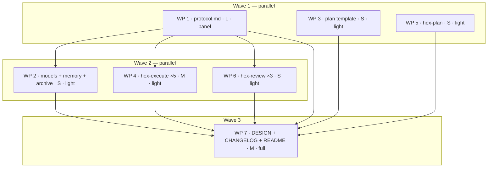

# Plan: adr_0012 — the per-WP effective tier

## Status

- State:   done
- Tier:    high
- Updated: 2026-09-06
- Next:    (none — approved)
- Reviewed: 6b96deb6d88d06caee3cbaa641c2dd57d30d58e9
- Approved: owner autonomous-goal directive 2026-09-05
- Verify-default: scoped
- Finalized: 2026-09-06 by /hex-finalize — branch recomposed to 5 commits on main; verification green (task publish -- --dry-run, task nox:verify)

---

## Overview

Implements [`adr_0012`](../adrs/adr_0012_per_wp_effective_tier.md)
(**Status: Proposed** — planned against as written; the owner flips
acceptance). Twenty-five contract changes to the shipped `hex/` bundle, all
prose in markdown, all serving one mechanism: **the plan's `Tier:` becomes a
ceiling and every work package derives its own effective tier** from cells
that already exist (`Size`, `Expected Files`, `Verify`) plus one
`hex.md › Pointers` row, by a pure function that is never authored and never
resolves above the ceiling.

The effective tier drives four axes — which phases run, which `models.md` cell
each WP-scoped spawn reads, the `review=` breadth, and the `loop-rounds` cap —
and at effective tier `low` the Stub, Specify and Implement phases collapse
into one `builder` spawn whose ordering is checked by the orchestrator against
the branch's commit graph, not reported by the builder.

**Zero new plan-table columns, zero new `config.md` keys, zero new state
files.** One optional Status line, `- Effective-tier: derived`, is the
generation marker; its absence is pre-`adr_0012` semantics forever.

This plan lands **on top of** [`plan_wave0_quick_wins`](plan_wave0_quick_wins.md)
(C-920–C-937), whose text is already on this branch: C-924's widened `Verify`
reach, C-928's two-direction budget guard, C-930's histogram grammar and
`DESIGN.md` round 14 are all shipped and are read as given.

## Objective

Make per-WP pipeline depth scalable for the first time since `DESIGN.md`
round 4 — 9 serial worker round trips down to 6 on this ADR alone, 3–4 once
wave 0 and `adr_0013` land — without lowering the run's terminal
verification and without letting a work package **lower** its own review
class. Raising it stays authorable and is the design's one escape hatch
(C-944).

## Scope

### In Scope

1. `protocol.md`'s new sole-source subsection: the function, the four flags,
   the size vocabulary, the degrade and attestation rules, the marker
   semantics, the histogram grammar.
2. The collapsed phase list at effective tier `low`, with the
   committed-stub check.
3. The `Review` column's direction flip and wave-0 C-928's downward-half
   suppression in derived-generation plans.
4. The generation marker and its refusals; presence-check compatibility.
5. The two backstops: merge-time effective-tier re-derivation, and the
   mandatory ceiling-tier branch-level `/hex-review` as a precondition on the
   terminal review state.
6. Announce, attribution and observability: the fifth source `derived`, the
   per-WP line, the histogram, one new config-disclosure trigger and one new
   risk-flag-degrade trigger class.
7. The record: `hex/DESIGN.md` round 15, `hex/CHANGELOG.md`, `hex/README.md`.

### Out of Scope

- **`.agents/adrs/**`** — the ADR is the design record and is not edited by
  its own implementing plan. `adr_0010`'s errata are recorded in the ADR
  already; no supersession row is appended to `adr_0010` here (D12).
- **`.agents/memory/hex.md`** — the sensitive-path Pointers row and the
  convention file it would locate are `/hex-init`-owned and land with owner
  consent, exactly as `plan_wave0_quick_wins` scoped that file out. Until
  they exist this ADR buys arcana nothing (C-1124, open question 1).
- **`hex/hex-core/references/config.md`** — a stated non-change (C-1115(b)).
  It is in no WP's file set; the check is the negative one at the final gate.
- **`hex/publish.toml`** — not bumped here (D2).
- **`nox/`** — no Python changes, no `task nox:verify` in any WP gate.
- `adr_0013`'s sections: `protocol.md` § Worker coordination liveness and
  resources, `workers/coordinator.md` sub-orchestration, and Schedule-log
  telemetry grammar. This plan references the seam by decision id
  (`C-1219`/`C-1220` coordinator kind, `C-1206`/`C-1207` liveness ladder,
  `C-1221` serialization tail) and writes none of it.

## Research

Reused, not re-commissioned (D9). All four artifacts are dated 2026-09-05 and
unexpired:

- `.agents/research/rca-review-fix-loop-wall-clock.md` — the evidence.
- `.agents/research/adr0012-precedent.md` — ceiling+derived design precedent.
- `.agents/research/adr0012-risk-scoring.md` — change-risk scoring, size
  heuristics.
- `.agents/research/adr0012-risk-flags.md` — flag taxonomy, degrade rules,
  migration markers.

Discover produced two artifact-length findings; both are folded into Key
Decisions (D1, D3) rather than persisted separately, because each is a
correction to the ADR's edit list rather than landscape research.

## Technical Approach

### Architecture Changes

`hex/hex-core/references/protocol.md` is the hub: the whole derivation is
defined there once, in a new `### The effective tier` subsection under
`## Parallel-by-default decomposition`, plus amendments in four other
sections of the same file. Every other file in this plan takes **a link or a
one-clause qualifier** — except `hex-execute`'s three tier files, which gain
a rule and are this plan's fourth constitution deviation.

```
protocol.md  §§ Parallel-by-default decomposition (new ### The effective tier)
             §  The Review-Fix Loop
             §  The meta-plan approval gate
             §  Worktree work-package mechanics
             §  Verification › Checkpoints
                    │  (sole source — everything below links or qualifies)
   ┌────────────────┼──────────────┬─────────────┬──────────────┐
models.md      hex-init         hex-execute   hex-plan      hex-review
memory.md      plan template    overlays.md   SKILL.md      classify.md
archive.md                      tier-*.md                   overlays.md
                                SKILL.md                    SKILL.md
                    │
              DESIGN.md round 15 · CHANGELOG.md · README.md
```

### Key Decisions

**D1 — `hex-review/archive.md` does not exist; the file is
`hex/hex-core/references/archive.md`.** The ADR's § Migration edit-site
class 6 lists `archive.md` beside `hex-review/SKILL.md` and `overlays.md`,
which reads as a `hex-review` file. Discover confirmed there is no
`hex/hex-review/archive.md`; the shipped `archive.md` is a `hex-core`
reference and it is where the terminal-review-state text lives. C-1117's
matching qualifier therefore lands in **WP 2**, not in the `hex-review` WP.
Recorded as an erratum against the ADR's edit list, not against any contract.

**D2 — `hex/publish.toml` is not bumped by this plan.** The ADR's class 9
says "minor bump". The shipped file carries `version = "0.2.0"` while
`CHANGELOG.md`'s newest section is `## [0.3.0] - 2026-09-02` and the newest
tag is `v0.2.0` — a pre-existing skew this plan did not create. Wave 0 added
its entries under `## [Unreleased]` and bumped nothing, and the release train
is tag-driven. Bumping a version inside a feature plan would compound the
skew and make the release non-reproducible. `publish.toml` stays out of every
WP's file set; the skew is a deferred item for the owner (Notes).

**D3 — no contract ID marks an edit site inside `hex-core/references/**`, so
every edit site there is anchored by heading plus a verbatim sentence.**
Discover checked, and the honest picture is narrower than "IDs are absent from
the bundle". `protocol.md` carries exactly one ID, `C-904`, and it is a prose
cross-reference rather than a site marker. IDs are common elsewhere:
`DESIGN.md` carries seventeen `C-9xx` (C-901, C-903, C-904, C-905, C-914,
C-917, C-918, C-920–C-929), the **plan template's own comments** carry eight
(C-901, C-905, C-907, C-912, C-915, C-924, C-925, C-928), and
`hex-execute/SKILL.md` and `hex-plan/SKILL.md` each cite C-905. Genuinely
absent everywhere under `hex/` are `C-913`, `C-916` and `C-930`. Two
consequences: a WP editing a
`hex-core` reference **cannot** find its site by grepping an ID and must
anchor on heading plus verbatim sentence, never on a line number; and a WP
editing the **plan template** cites contract IDs the way its neighbouring
comments already do (C-953, C-954), because matching the local convention
beats a blanket rule.

**D4 — `## Parallel-by-default decomposition` has no `###` subsections
today.** `### The effective tier` is the first, and it lands **after that
section's final bullet — the one requiring under-parallelization to be
justified rather than silent — immediately before `## Traceability IDs`.**
Not after the merge-time re-validation sentence: eight bullets follow that
one, including C-928's two-direction guard and C-930's histogram, and a
`###` inserted there would nest both inside the new subsection while C-944
requires the suppression to be written at the guard's own definition site in
the enclosing section. **Anchors for the three restating WPs — WP 2, WP 4 and
WP 6 — pinned here so all three write the same link**: a site qualifying
C-938–C-942, C-945, C-946 or C-949
links `protocol.md#the-effective-tier`; a site qualifying C-943, C-944, C-947
or C-948 links `protocol.md#the-review-fix-loop`.

**D5 — `hex-execute/overlays.md` has no "Both axes are ceilings" heading.**
The sentence C-1112 falsifies — *"Both the `review` and `loop-rounds` axes are
**ceilings**: a WP's `Review` budget in the plan table lowers them per WP —
`self` and `light` also force a 1-round loop for that WP regardless of this
axis"* — is an unheaded paragraph closing `## loop-rounds axis`. C-955 anchors
on that paragraph. Two per-axis qualifiers would not reach it, which is the
ADR's own point; this decision records where it actually sits.

**D6 — `DESIGN.md` round 14 has landed, so round 15 stands.** Wave 0's C-936
wrote `## Execution-performance quick-wins round (2026-09-05, round 14)` and
it is present on this branch. The ADR's renumbering escape (fall back to 14
if wave 0 lands later) is **not** exercised.

**D7 — the wave is drawn at *restatement*, not at *link*.** Wave 1 is every
WP that does not restate WP 1's new wording: WP 1 itself, the plan template
(WP 3) and `hex-plan` (WP 5), both of which anchor only on headings that
already exist on the branch. WP 2, WP 4 and WP 6 each write a qualifier that
links `protocol.md#the-effective-tier` or `#the-review-fix-loop` **and
restates one of WP 1's clauses**, so a drift between WP 1's wording and a
dependent's restatement would ship as a contradiction. `grim build` was
verified **not** to validate cross-skill anchors, so the dependency is
editorial rather than mechanical — which is exactly why it is drawn as
narrowly as the restatements allow, in a plan whose own thesis is that serial
trips are the cost. Phase 1's inventory gate is the second layer: a dependent
whose quoted sentence does not appear verbatim stops rather than proceeds.

**D8 — `hex-execute` is one WP, not three.** `overlays.md`, the three tier
files and `SKILL.md` are five files in one skill directory totalling ~85
expected lines. Splitting them would put three sub-overhead WPs and three
`grim build hex/hex-execute` gates where one suffices; the shipped precedent
is `plan_wave0_quick_wins` WP 5, the same five files at the same budget.

**D9 — research is not re-commissioned.** Tier `high`'s Phase 2 mandates
three persisted research artifacts. `adr_0012` commissioned exactly three,
all unexpired, one per axis (technology/precedent, patterns/risk-scoring,
domain/risk-flags), plus the RCA. Re-running them would re-derive the ADR's
own citations at three worker round trips' cost, against a design whose
options are already scored. Recorded as a tier-high deviation in the announce
block, not as a constitution deviation — `DESIGN.md` locks no research count.

**D10 — the collapse's check is the commit graph, never a transcript.** The
builder commits stubs + specification tests as its **first** commit on the WP
branch; the orchestrator runs the project's test command **at that commit**
and requires it to fail. This is the whole defence of constitution deviation 2
and the reason the first draft's self-reported red→green transcript was
rejected. A WP whose only evidence is builder prose is a C-943 violation. The
`git log --reverse` check is **shipped contract text this plan writes**
(C-943), not a check this plan's own execution runs — no WP in this plan
reduces, because the mechanism does not exist until it merges.

**D11 — migration is a contract, not a behaviour.** No plan-table column is
added, so the migration statement attaches to the marker line and to the
table header: **a plan without `- Effective-tier: derived` runs pre-`adr_0012`
semantics byte-for-byte, forever — never a prompt, never an error, never a
rewrite** (C-945), and **the plan template's Parallelization table header row
is byte-unchanged** (C-954), which is the single mechanical proof that
`DESIGN.md`'s *Plan visualization* lock needed no amendment.

**D12 — `adr_0010` gains no supersession row from this plan.** Wave 0's
precedent (C-936) appended supersession-by-pointer rows to `adr_0010`'s
changelog. `adr_0012` instead carries a full erratum table against `adr_0010`
inside itself (rows 1–9) and states that no supersession header is owed,
"because in every legacy plan the superseded text stays true forever". Adding
a second record would be the drift the sole-definition rule exists to prevent.
**This diverges from wave 0's own precedent one day earlier and the divergence
is recorded rather than smoothed**: a reader of `adr_0010` C-905 and C-916 who
does not also read `adr_0012` gets stale semantics with no forward pointer,
which is the failure a supersession pointer exists to prevent. The ground
"`.agents/adrs/**` is out of scope" is this plan's own scoping and is
therefore not an argument; the argument is the sole-definition one above, and
whether it outweighs the stale-reader cost is a deferred owner call
(Notes 5).

**D13 — `Review: panel` appears once, on the only `L` work package.** Wave 0's
C-928 downward guard is live on this branch and declares `panel` on a size
S-or-M single-area WP with no security-sensitive or hot-path file a plan
defect. arcana documents no such convention, so **no** file in this plan's
sets qualifies, and every S/M WP is therefore capped at `light`. WP 1 is `L`,
so its `panel` is legal. **Two WPs carry more weight than `light` would
suggest and both are named here rather than discovered later.** WP 4 gains a
rule in three tier files — this plan's fourth constitution deviation. WP 6
edits `hex-review/classify.md`, the shipped structural-marker table that
C-940 elevates into hex's own project-independent `sec` triggers; its edit is
a cross-reference clause and the marker rows themselves are untouched, but
the file is load-bearing for the security half of the design, and the reason
`panel` is unavailable there is the very absence — no documented
sensitive-path convention — that S-920 designs the mechanism to fail closed
on. Both are covered by the plan-level panel review and by the mandatory
branch-level `/hex-review` before this branch lands, and both carry a Risks
row.

**D14 — the Decompose-gate histogram needs no `hex-plan` edit.** The ADR's
edit-site class 5 says `hex-plan/SKILL.md` "prints the histogram at the
Decompose gate". It does not: that file contains no histogram reference at
all, and the print instruction lives in `hex-plan/tier-low.md`,
`tier-medium.md` and `tier-high.md`, each of which **links** the grammar
rather than restating it. Since C-949(b) replaces the bucket key at the
grammar's one home in `protocol.md`, the swap rides the existing links and
**no `hex-plan` tier file is edited**. WP 5's only job is the marker write.
The fourth edit-list drift, recorded beside D1 and D5.

## Constitution Deviations

`hex/DESIGN.md` is binding. This plan implements `adr_0012`'s round 15 —
**four amendments plus one new binding rule that amends no existing
position**, and two positions explicitly **not** amended — the *Plan
visualization* lock, and the `Verify` cell's *"and nothing beyond those two"*. Round 15's full proposed
text is quoted in the ADR and is written verbatim by WP 7 (C-961).

| Violation | Why needed | Simpler alternative rejected because |
|---|---|---|
| **§ Worktrees, the 2026-07-20 perf-pass addendum** — *"a per-WP Review budget (`self \| light \| panel`, **lower-only vs the tier baseline, missing = panel**) — review breadth now scales with WP size, not plan tier alone."* C-944 flips the direction to raise-only against a derived baseline and makes `self`/`light` inert; C-938 makes the plan tier a ceiling rather than the baseline. | The addendum's own stated intent — *review breadth scales with WP size, not plan tier alone* — is what this round completes. A lower-only column cannot catch a budget authored **too high**, which is the traced defect, and cannot scale phases or model class at all; 43 of the 61 addressable minutes sit in exactly those two. Superseded **by pointer**: the addendum's bytes stay as written and the `### Worktrees` erratum pointer gains one clause (round 11's convention, and round 12 already superseded the same addendum this way). | Keeping the column authored and binding the four axes to it (`adr_0012` O2) ties on wall clock and loses on **what gates the reduction** — one authored cell versus three signals the author does not choose; an authored cell driving phases, model class, breadth and rounds is a per-WP `Tier` column with a misleading header. A per-WP authored `Tier` column (O3) reintroduces the traced root cause and costs a fifth *Plan visualization* amendment. |
| **`protocol.md` § The Review-Fix Loop — the canonical four-phase list** (Stub → Specify → Implement → Review-Fix), restated as a hard invariant in `hex-execute/tier-low.md`: *"Keep the contract-first TDD skeleton (Stub → Specify → Implement → Review-Fix) unchanged; only scale the worker count, review breadth, and loop rounds down."* C-943 collapses the first three into one spawn at effective tier `low`. | That sentence **is** the RCA's root cause 1 — pipeline depth constant at every tier by explicit design, 45 of 186 traced minutes in three trips that produced no finding. The phases' properties are preserved, not deleted: the surface is still written before the tests and the tests before the implementation, and *"they MUST fail against the stubs"* becomes **verified against the branch's commit graph by a party that did not write it** (D10) rather than assured by construction. | Collapsing only Stub into Specify saves one trip of three and keeps the two costliest hand-offs. Cutting review instead is O2, rejected above. Collapsing against a **self-reported transcript** was the ADR's first draft and was rejected on review: produced by the worker whose claim it checks, re-run by nothing, satisfied by writing the implementation first and stashing it — which left the deviation with no defence at all. |
| **`protocol.md` § Worktree work-package mechanics — *"Presence checks, not a version field"***: *"no schema-version marker, the presence of the field is the signal … Every reader branches on presence, never on a compared version number."* C-945's `- Effective-tier:` line has a **value space** (`derived`) and a **hard refusal** on anything else, including a present-but-empty value. | Every field that rule covers carries **one** meaning, so presence is a complete signal. This marker's presence must eventually distinguish *generations* of the derivation, and a bare presence check has nowhere to put the second one. Presence-plus-refusal is a version marker under another name and this plan does not pretend otherwise. What is genuinely preserved is the rule's purpose: **absence is never a version comparison** — it is legacy, permanently, with no migration and no prompt. | A bare `- Effective-tier:` with no value is unreadable and leaves the next generation no carrier but a second Status line. A `Plan-Schema:` field versions the whole artifact for one behaviour and is forbidden by C-945 itself. Silently accepting an unrecognized value as `derived` violates the closed-enumeration rule — an unrecognized input escalates, it never defaults to a known flag. |
| **The thin-dispatcher / sole-definition rule** — round 12's *"Thin dispatchers + per-tier phase files — no tier file gains a rule; two take a one-clause qualifier and the rest are untouched"*, round 13's repair (*"for `protocol.md` to own the sentence and the tier files to link it"*), and `adr_0010` **C-916**, which restates the same rule and takes **erratum row 9** in the ADR. *(The often-quoted "a site either links or takes a one-clause qualifier" is `adr_0010`'s **paraphrase** of round 10, not `DESIGN.md`'s own words — round 10 says "the four bundle-wide restatement sites gain a one-clause qualifier pointing there". C-961 must not carry the paraphrase into `DESIGN.md` as a self-quotation.)* **All three `hex-execute` tier files gain a rule, not a qualifier** (C-956): `tier-low.md`'s skeleton sentence is rewritten, and `tier-medium.md` / `tier-high.md` condition their phase sections on the **WP's** effective tier, so a tier file's phase list stops being a property of the file. | The phase list is exactly what this round exists to scale, and it is the one thing a per-tier phase file is *for*. A dispatcher that cannot be conditioned cannot express "this WP runs three phases and that one runs four", so the rule cannot land anywhere else without duplicating the function into every tier file — the ten-file diff round 13 named. The intent is upheld while the letter breaks: the function is defined **once** in `protocol.md` and the tier files carry only the conditioning. | Leaving the tier files untouched ships a sentence this round makes false — C-962's validation greps for exactly that sentence and requires zero hits outside `DESIGN.md`'s own quotation. Collapsing at *every* tier would keep each list unconditional but is not this design: the collapse is scoped to effective `low` precisely so `medium` and `high` stay byte-unchanged. A fifth tier file is a new artifact for a derivable value, and tier files are indexed by *plan* tier, which is the coupling this round removes. |

**Considered and explicitly not deviated: the *Plan visualization* lock is NOT
amended.** Its enumeration of the WP table's canonical column set stands
unchanged — every input is a cell or pointer that already exists. That
enumeration has been amended by explicit act four times (`status`, the review
budget, `Repo`, `Verify`) and a fifth was avoidable, so it is avoided. The one
new artifact field is a Status-block line, for which `adr_0010`'s `Reviewed:`
line is the standing precedent. C-954 is the mechanical proof.

**Considered and explicitly not deviated: `protocol.md`'s *"and nothing beyond
those two"* on the `Verify` cell.** Wave 0's round 14 spent a whole amendment
widening that cell's reach from one gate to two, and the shipped sentence now
reads that the cell *"sets one verification budget for one merge boundary —
the WP's merge gate … and the Review-Fix Loop's exit gate that immediately
precedes it, and nothing beyond those two"*. C-940 makes `door` **read** that
cell. **The sentence bounds what the cell *sets*, and `door` sets nothing**:
it adds no gate, changes no verification budget, and runs no command — it
blocks a tier reduction. So the sentence stays true and is not amended; C-944
adds `door` as a **third reader**, never a third gate. **The cost is real and
is stated rather than hidden**: `Verify: full` becomes the plan table's most
expensive cell, and an author who wants only the one-way-door signal now pays
for two verification gates to get it. That is the ADR's own § Judgment calls 2
and it is priced there, not repaired here. The alternative — a fifth flag with
its own cell, its own *Plan visualization* lock amendment and its own way of
being mis-authored — is what this design exists to avoid. **A reviewer of the
shipped diff who reads "third consumer" as "third gate" is reading the wrong
half of the sentence; if that reading prevails it becomes round 15 item 6, and
C-961 carries this paragraph so the question is settled in the record rather
than at each reading.**

**One new binding rule that amends no existing position** (round 15 item 3):
C-947's mandatory ceiling-tier branch-level `/hex-review` as a precondition on
the plan's terminal review state. It adds a second precondition to a write
`/hex-review` already solely owns, not a second writer.

## Component Contracts

Every contract is prose in a shipped markdown file. A "test" is a
**contract-reading check** — a grep or read assertion against the shipped file
that fails if the sentence is absent or says something else — plus
`grim build <skill-dir>` as the mechanical gate.

### WP 1 — `protocol.md`, the sole source

| ID | Contract | Edit site |
|---|---|---|
| **C-938** | **The `### The effective tier` subsection exists and owns the function.** A new `###`-level subsection, the first this section has ever carried, placed **after the section's final bullet — the one requiring under-parallelization to be justified rather than silent — and immediately before `## Traceability IDs`**, so that C-928's guard and C-930's histogram stay in the enclosing section where C-944 amends them rather than being nested inside this subsection (D4). It states the ordered vocabulary `low < medium < high`, the five inputs and their sources, the resolution branches, the two floors and their order, and the escape hatch. It carries the pinned canonical sentence **verbatim, exactly once in the bundle**: `The effective tier is never above the ceiling and is never authored.` The ceiling `T` is the plan's Status-block `Tier:` value, explicitly independent of `/hex-execute`'s optional run-tier argument. The flag enumeration is **closed and versioned**: exactly four, named `sec`, `hot`, `hub`, `door`; a fifth arrives by amending this text in a later ADR, never by analogy at an edge case. The whole function is **recomputed at each WP's own spawn time**, never once per run, so a Discover-time listing is a snapshot and says so. Implements C-1101, C-1121. | `protocol.md` § Parallel-by-default decomposition › **new** `### The effective tier` |
| **C-939** | **The `Size` vocabulary is defined, from numbers already shipped.** `S` — ~≤50 expected lines **and** ≤3 expected files; `M` — ~≤500 expected lines **and** ≤15 expected files; `L` — anything else. **Both halves must hold.** An absent, empty, unrecognized or ambiguous cell reads `L`. Zero new numbers: ≤3 files is § Tier grammar's own `low` row, ~≤50 lines is this section's shipped overhead floor and `self` heuristic, ≤15 files / ≤500 lines are `hex-review/classify.md`'s shipped `medium` row. The text **states the divergence** rather than claiming one table: `classify.md`'s `low` row is `≤3 files, ≤100 lines` against `S`'s `~≤50`, the two thresholds have different jobs (an actual diff for a review versus an estimate for a reduction), and the reduction side is deliberately the more conservative. Implements C-1102. | same subsection |
| **C-940** | **The four flags and their sources.** `sec` is a **union**: (a) any path in the WP's `Expected Files` matching **hex's own shipped, project-independent triggers** — `hex-review/classify.md`'s structural-marker table: auth/crypto/signing paths, dependency manifests and lockfiles, CI-workflow files, new package manifests — **or** (b) the project's documented security-sensitive convention located through the `hex.md › Pointers` row. **The project may widen hex's sensitivity and may never subtract from it**: no attestation, no empty set and no narrow convention clears (a). `hot` — the same row's hot-path convention, project-only, because hex ships no project-independent hot-path trigger. `hub` — any `(Repo, path)` pair in this WP's `Expected Files` also appearing in **another** WP's `Expected Files`, in any wave; the same predicate as § Verification › Checkpoints' high-risk clause 2 on a different left operand, and with no `Repo` column every pair is `(., p)`. `door` — the WP's `Verify` cell resolving to `full` through the existing cell → `Verify-default:` → `scoped` chain. **No flag adds a command.** Implements C-1103. | same subsection |
| **C-941** | **Sub-WPs and coordinator-owned parents.** A sub-WP's effective tier is its parent's, **unless the sub-WP's own `Review` cell raises it**. A coordinator-owned parent derives from its own cells, and because the template writes `—` in its `Verify` cell, `door` reads `false` there — harmless, because that row's merge already pays the project's full documented verification under merge trigger (i). **The floor is stated behaviourally, never by naming a coordinator taxonomy hex has not shipped**: *a coordinator that splits its WP into dotted sub-WPs floors that WP at `min(T, medium)`* — never a flat `medium`, which at `T = low` would break the ceiling invariant — *and a coordinator that owns only a WP's phase pipeline and adds no sub-WPs does not raise the floor*, or the collapse could never fire. The reason for the floor is written with it: `models.md` Rule 5 gives `coordinator` no `low` cell, so a `low` derivation would leave a fan-out with no defined spawn, and the shipped granularity gate has **no size floor**, so an `S` or `M` coordinator parent is authorable. The seam sentence is written once, here: *`adr_0012` decides which phases a work package runs and at what model class and review breadth; `adr_0013` decides how the workers running them are supervised, resourced and sub-orchestrated*, with `adr_0013`'s `C-1219`/`C-1220` named **only** as the forward reference for the coordinator-kind question, never as vocabulary the shipped text defines. No new inheritance mechanism, no fifth status. Implements C-1104, C-1109's floor half. | same subsection |
| **C-942** | **The degrade rule — a flag whose source is absent, unreadable, or malformed reads `true`, never `false`**, never inferred from a sibling, never borrowed from another WP. The read rule is stated, not left to the reader: **(1)** the `hex.md › Pointers` combined entry is read as **two independent halves**, each resolved on its own — a row naming only one convention leaves the other absent, and `sec` and `hot` never share a resolution; **(2)** each half's value is a **repo-relative location** — the text between its convention label and the first field separator (`·`, `&nbsp;`, or end of line), trimmed — and **never the convention itself: not an inline glob set, and not the literal `none`**; **(3)** anything else ⇒ `true`, including a half present but empty, a value that is not a repo-relative path, and a value hex does not recognise; **(4)** the target file is matched against a closed enumeration — the literal `none`, or one or more globs — with missing ⇒ `true`, empty ⇒ `true`, resolving outside the repository root ⇒ `true` and never followed, and **any** invalid glob making the whole set unreadable ⇒ `true`; **(5)** `none` is declared **in the target file**, never inferred from an empty or missing target and never written into the Pointers row; **(6)** § Staleness's repair-and-proceed rule runs **first** — if re-detection succeeds the repaired pointer is what rules 1–5 read, and if it finds nothing this rule wins and the flag reads `true`. **`door`'s fail-open is the single argued exception**, on three grounds, with the reconciliation stated as **residual risk, not direction**: three independent backstops survive the checkpoint trigger's vacuous clause, one survives a fail-open reduction here. Implements C-1105, C-1106. | same subsection |
| **C-943** | **Phases — at effective tier `low`, Stub + Specify + Implement collapse into one `builder` spawn.** The builder writes the public surface, then the failing tests, then the implementation, in one turn; **Verify-Architecture does not run**. **The ordering is checked by the orchestrator, not reported by the builder**: the collapsed builder **commits the stubs and the specification tests as its first commit on the WP branch, before the implementation commit**, the builder's output contract names that commit's SHA, and **the orchestrator runs the project's test command at that commit and requires it to fail**. The contract states what is given up: the **temporal** property is recovered, **author≠verifier is not**, and the backstops are the `review=minimal` batch's `spec` reviewer and the ceiling-tier branch review. **Model-cell resolution:** the collapsed spawn resolves all three source cells (`builder:stub`, `builder:implement`, `tester`) and reads **the highest**, never the lowest, disclosed like any other override-driven raise. At effective `medium` and `high` the four-phase list is unchanged in every byte. Implements C-1108. | `protocol.md` § The Review-Fix Loop — the canonical four-phase list |
| **C-944** | **`Review` survives with its direction flipped, and the direction invariant is preserved by the flip.** The derived breadth, not the tier's panel, is now the baseline, so the column becomes **raise-only against the derived breadth, capped at the ceiling**: a cell naming a breadth at or below the derived one is **inert — honoured as a no-op, never a defect** — and a cell above it is honoured up to the ceiling. **`Review: panel` raises the WP's effective tier to the ceiling**, all four axes, and is the one escape hatch; **in a `low`-tier plan the hatch is a no-op** and the text says so. The column is **not renamed**. **Wave 0's C-928 downward half is *suppressed*, not vacuous, in a plan carrying the generation marker** — it declares `panel` on a small flag-free WP a defect, which is exactly the sanctioned hatch — and the suppression is written **at C-928's own definition site in this section**, so the three `hex-plan` tier files that link it inherit it with no edit of their own. The upward half is genuinely vacuous there. **Both halves stay live and unchanged in legacy plans.** **`Verify` keeps its raise-only direction, its `scoped` floor, its `Verify-default:` escape and its merge-gate meaning in every byte, and the shipped sentence bounding what the cell *sets* — *"and nothing beyond those two"* — is not amended.** The `Verify` bullet takes **one clause naming `door` as a third *reader*, never a third gate**: the cell now also decides whether that WP may reduce, which adds no gate and changes no verification budget. The argument is recorded in § Constitution Deviations' "considered and not deviated" paragraph, and the cost — `Verify: full` becoming the table's most expensive cell — is stated there rather than hidden. Implements C-1112, C-1113. | `protocol.md` § The Review-Fix Loop (the budget **consumption** bullet) **and** § Parallel-by-default decomposition (the **assignment** bullet, the two-direction guard, and one clause on the `Verify` bullet) |
| **C-945** | **The generation marker and presence-check compatibility.** One optional Status line, `- Effective-tier: derived`. **Presence** ⇒ this ADR's semantics. **Absence** ⇒ pre-`adr_0012` semantics **byte-for-byte, forever: never a prompt, never an error, never a migration step, never a rewrite of the plan to add the line** — a permanently valid shape, not a migration backlog. `derived` is the only value v1 accepts and **an unrecognized value is a refusal**, in the shipped `Error:` / `Fix:` pair naming the value read and the values understood. The parsing rule is stated: read **line-initial** and **only from the Status block above the first `##`**, so a quoted marker in a code fence or prose is not a marker; the value is the text between the `:` and the first field separator, trimmed, matched exactly. **A line present with an empty value is a refusal**, not an absence. **A marker on a plan with no `Verify` column is a refusal** — that column is `door`'s only source, and hand-adding the marker to a legacy plan would flip every blank `Review` cell from meaning `panel` to meaning the derived breadth, silently and in bulk; the `Fix:` line says to run the plan through `/hex-plan`. **No `Plan-Schema:` field is added and none may be inferred.** Implements C-1114, C-1123, and this plan's migration statement (D11). | `protocol.md` § Parallel-by-default decomposition (the semantics) **and** § Worktree work-package mechanics (one clause beside the *"Presence checks, not a version field"* paragraph) |
| **C-946** | **Backstop 1 — the merge-time budget re-validation becomes an effective-tier re-derivation.** The shipped sentence *"Budgets are re-validated at merge time: … a WP whose actual diff outgrew its budget class … escalates to the next budget and its review re-runs at that breadth before the merge"* is amended in place: **the same function is re-run against the actual merge diff** — `size` from the diff on C-939's table, `sec`/`hot` from the actual changed-file list, **`hub` from the actual changed-file list too** (never carried forward, because the declared set is not a guaranteed upper bound — file-set re-validation's own remedy for an out-of-set diff is to *widen* the declaration), `door` unchanged as an authored declaration. It uses the file list `git diff --name-only <base>..<wp-branch>` **already produces**, so it adds no command. If the re-derived tier is above the plan-time one, review re-runs at the re-derived breadth before the merge. **The limit is stated rather than papered over: only review can be restored** — the collapsed phases and the model class are already spent. Implements C-1116. | `protocol.md` § Parallel-by-default decomposition — the merge-time re-validation sentence, amended in place |
| **C-947** | **Backstop 2 — the mandatory branch-level `/hex-review` becomes mechanical, at the ceiling tier.** The shipped clause already makes the branch pass mandatory for any plan containing a `self` WP. It gains: **a plan containing any WP whose effective tier fell below its ceiling does not reach its terminal review state — `done`, or `landing` for a plan carrying a `Repo` column — until a branch-level `/hex-review` has run at no less than the plan's ceiling tier.** `/hex-review` is already the sole writer of that state, so this is a second precondition on the same write, never a second writer. **The ceiling floors, never caps:** the resolved tier is `max(classified, ceiling)`, so a large diff on a `medium`-ceiling plan is still reviewed at `high` if its own classifier says so. `T` is the plan's Status-block `Tier:`, the same pin C-938 states. **The contract states plainly what it blocks:** a field in a markdown Status block, not a forge submit requirement — the borrowed property is *"no tier low enough to skip it"*, and the borrowed enforcement is not available and is not claimed. Implements C-1117's protocol half. | `protocol.md` § The Review-Fix Loop — the budget bullet's mandatory-review clause, amended in place (the `### Delta round scope` restatement stays true and is untouched) |
| **C-948** | **Loop rounds — the cap follows the effective tier**, `low` → 1, `medium` and `high` → 3, the shipped per-tier defaults read per WP. The stored `hex.md › Preferences` `loop rounds` ceiling is untouched and still binds: the shipped rule *"the effective cap is the lower of the stored value and the run's resolved request"* **gains a third term** and the cap is the lowest of the three. The stored value still never raises a tier default and never lifts `low` above one round. **Plan-artifact scope is untouched.** Implements C-1111's protocol half. | `protocol.md` § The Review-Fix Loop — the loop-rounds ceiling rule |
| **C-949** | **The meta-plan approval gate gains one source, one disclosure trigger, one trigger class, and the two announce lines.** **(a) A fifth source attribution, `derived`** — the shipped enumeration `classifier` / `hex.md preference` / `user flag` / `tier baseline` gains it, and a derived item's attribution **names the inputs that produced it, per WP**: `WP1 low (derived: S, no flags) · WP4 high (derived: sec)`. The value is recomputed at each WP's own spawn time, so gate-time and run-start listings are **snapshots, labelled as one**. **(b) The histogram**, adopting wave 0's C-930 grammar **verbatim, ordering rule included**, with the bucket key replaced by the effective tier: `effective tier: low 6 · medium 2 · high 1 (ceiling high)`. It **replaces rather than joins** C-930's line in a derived-generation plan, because `Review` is inert there; C-930's line stays exactly as it is for legacy plans. **(c) One new config-disclosure trigger** — a `hex.md › Preferences` model override that raises a spawn above its effective-tier cell prints one line naming the role, the class, the WP's effective tier, and `hex.md preference` as the source; no override is blocked, weakened or reordered. **(d) One new *trigger class*, not a config-disclosure member** — the **risk-flag degrade** line: a run in which any flag degraded prints **one line, once**, naming which flag, which convention was unreadable, the consequence (*every WP resolves at the ceiling*) and the one-line remedy. An absent or malformed **Pointers** row is not a `Preferences` config block, so filing it under that scoped enumeration would widen a closed list by analogy. **(e)** The attestation of `none` clears `sec` only, and only under **both** of `config.md` merge rule 5's conjuncts, with conjunct (b) evaluated **per WP** over that WP's own `Expected Files`. **This is a *read* of rule 5 for the `sec` flag, not an amendment to it: `config.md` gains no key and no clause, and rule 5's own per-run grain is untouched at its own site.** It is nonetheless the **looser** grain — a run in which one WP touches auth no longer refuses the attestation for the other WPs — and that direction is stated rather than left to be inferred. It is acceptable here because the flag it feeds is inherently per-WP, and because hex's own shipped triggers (C-940) still fire per WP and cannot be cleared by any attestation. Also: one cross-reference clause at § Verification › Checkpoints beside high-risk clause 1, carrying verbatim the sentence that **clearing that row disarms both consumers** — tier reduction here and the pre-existing high-risk checkpoint trigger there. **The histogram's bucket key is amended at the grammar's one home**, the budget-histogram bullet in § Parallel-by-default decomposition whose own text is *"one line, one grammar, stated once here"*: that bullet gains the derived-generation key beside C-930's, so the three `hex-plan` tier files and `hex-execute/SKILL.md`, which **link** the grammar rather than restating it, resolve to the new key with no edit of their own (D14). **No second grammar statement is written at the gate section** — that would break the sole-definition sentence and Step 3.2's one-grammar check. Implements C-1107, C-1119's grammar home, C-1120, C-1122, C-1106's cross-reference half. | `protocol.md` § The meta-plan approval gate (source enumeration, disclosure triggers, the new trigger class), § Parallel-by-default decomposition (**the budget-histogram bullet, bucket key amended in place**) **and** § Verification › Checkpoints (one cross-reference clause) |

### WP 2 — `hex-core` satellites

| ID | Contract | Edit site |
|---|---|---|
| **C-950** | **`models.md` cells resolve against the WP's effective tier, not the plan's** — one clause under the matrix and one in Rule 2, with one rule and no row list: **a spawn made for a work package reads that WP's effective tier; a spawn made for the run reads the plan tier.** So `builder:stub`, `builder:implement`, `tester`, every `reviewer:*`, `doc-reviewer` and `coordinator` follow the effective tier during execution, while `explorer`, `architecture-explorer` and `researcher` follow the plan tier; `architect` is `deep-reasoning` in all three columns, so no special case is written. Rule 5's tier-gating of `coordinator` is untouched and the `min(T, medium)` decomposing-coordinator floor is **linked** to C-941, not restated. Rule 2's step-1 precedence is unchanged; the added clause only cross-references the disclosure C-949(c) requires. **Rules 1, 3, 4 and 5 are otherwise untouched, cells stay recommendations rather than floors or ceilings, and no literal model name appears.** Implements C-1109, C-1122's models half. | `models.md` § The matrix (one clause under the table) and § Rules, rule 2 |
| **C-951** | **`memory.md` § Pointers states that the combined entry resolves as two independent halves, each a location.** The shipped entry names *"where the project's security-sensitive / hot-path convention is documented"* as one line; it gains one clause saying the two conventions resolve **independently** — silence on one leaves that one absent, therefore `true` — and that each half carries a **repo-relative path to the file that documents the convention, never the convention's own value: not an inline glob set, and not the literal `none`**, which is what keeps `## Pointers` the cache it is classed as. A cross-reference points at C-942's read rule and names the § Staleness ordering (re-detect first, fail closed if re-detection finds nothing). **§ Staleness's repair-and-proceed rule is not amended.** Implements C-1105's `memory.md` half. | `memory.md` § Pointers — the entry naming the security-sensitive / hot-path convention |
| **C-952** | **`archive.md`'s terminal-review-state text gains the ceiling-tier precondition**, beside the existing stranded-set rule, as a one-clause qualifier linking C-947 — never a restatement of the derivation. Implements C-1117's archive half. (D1: this file is `hex/hex-core/references/archive.md`; there is no `hex/hex-review/archive.md`.) | `hex/hex-core/references/archive.md` — the terminal-review-state clause |

### WP 3 — the plan template

| ID | Contract | Edit site |
|---|---|---|
| **C-953** | **The Status block gains `- Effective-tier: derived`, immediately after `Tier:`**, with a comment stating that it is optional, that presence means the plan tier is a ceiling and each WP derives its own, that **absence is pre-`adr_0012` semantics permanently and never an error or a prompt**, and that an unrecognized value is a refusal. Placement is one line earlier than `adr_0010`'s two Status lines because it **qualifies `Tier:`** — a reader seeing `Tier: high` must see "and it is a ceiling" in the same breath — and it is a single fixed line ahead of the multi-row `Repos:` ledger, which is that precedent's own ordering ground. Those two lines still sit immediately after `Next:` and are untouched. Implements C-1114's template half. | `hex/hex-init/assets/templates/plan.md` § Status — the Status block |
| **C-954** | **The Parallelization table comment gains the `Size` class definitions and the flipped `Review` description; the table header row is byte-unchanged.** The comment's existing `Size` sentence gains C-939's two-halves thresholds and the `L` default; its `Review` sentence gains the derived-generation reading — **raise-only against the derived breadth, `panel` raises the WP to the ceiling, `self` and `light` inert in a marked plan, all three values unchanged in a plan without the marker** — and the sub-WP note gains *"unless the sub-WP's own `Review` cell raises it"*. Substance links to `protocol.md § Parallel-by-default decomposition`; nothing is restated, and the new comment text **cites contract IDs the way the file's neighbouring comments already do** — they carry `C-905`, `C-915`, `C-924` and `C-928` today (D3). **The mechanical proof this plan owes the *Plan visualization* lock: `git diff` on this file shows the header row `\| WP \| Repo \| Scope \| Expected Files \| Size \| Wave \| Depends on \| Review \| Verify \| Status \|` byte-unchanged.** Implements C-1102's template half, C-1112's template half, C-1115(a)'s check. | same file, § Parallelization — the table's explanatory comment |

### WP 4 — `hex-execute`

| ID | Contract | Edit site |
|---|---|---|
| **C-955** | **`overlays.md`'s three axis sections take one clause each, and the out-of-axis ceilings paragraph is corrected.** `review` axis: the breadth value follows the effective tier (`low` → `minimal`, `medium` → `full`, `high` → `adversarial`, the shipped table read per WP), the run's resolved axis composes as a **`min` cap over the result**, and the order is stated because `min` alone contradicts the hatch — **`panel` raises the derived *tier* to the ceiling; the run's resolved axes then apply as a `min` cap**, so a `panel` WP under `--review=full` runs the ceiling's phases and model cells with `full` breadth. `loop-rounds` axis: the same, with the cap the lowest of {tier default, run request, stored ceiling}. **`adversary` axis: pinned to the plan tier `T`, never the effective tier** — a WP that derived `low` inside a `high` plan **still runs the cross-model gate**, because that pass is a run-level assurance decision and a per-WP size estimate must not become a global skip switch; wave 0's deadline and skip grammar are untouched. **The unheaded paragraph closing `## loop-rounds axis`** — *"Both the `review` and `loop-rounds` axes are **ceilings**: a WP's `Review` budget in the plan table lowers them per WP — `self` and `light` also force a 1-round loop for that WP regardless of this axis"* — is **named and amended explicitly** (D5), because C-944 makes it false and it sits outside both axis headings. Implements C-1110, C-1111's overlays half. | `hex-execute/overlays.md` § review axis, § loop-rounds axis (including its closing unheaded paragraph), § adversary axis |
| **C-956** | **The three tier files gain a rule** (constitution deviation 4). `tier-low.md`'s *"Keep the contract-first TDD skeleton (Stub → Specify → Implement → Review-Fix) unchanged; only scale the worker count, review breadth, and loop rounds down."* becomes **false and is rewritten** to state the collapsed pipeline at effective `low`, linking C-943 for the substance and the committed-stub check. `tier-medium.md` and `tier-high.md` **condition their phase sections on the WP's effective tier** rather than on the file they live in: their Stub, Specify and Implement sections state that a WP whose effective tier resolves `low` runs the collapsed builder instead, linking C-943; at effective `medium` and `high` their content is unchanged in every byte. Their intro paragraphs take the same conditioning, because `tier-medium.md`'s opening sentence — *"Preserves the contract-first TDD skeleton (Stub → Specify → Implement → Review-Fix)"* — becomes conditionally false for a WP that derives `low` inside a `medium` plan. No tier file restates the function. Implements C-1108's tier-file half. | `hex-execute/tier-low.md` — the intro paragraph under `# Tier: low`, and **Phases 2, 4 and 5** (Stub, Specify, Implement — each of which reads "Launch **1** …"; **Phase 3 is already `Verify-Architecture — skipped` and stays byte-unchanged**); `tier-medium.md` and `tier-high.md` — their intro paragraphs and their Stub, Specify and Implement phase sections |
| **C-957** | **`hex-execute/SKILL.md` gains the announce lines, the handoff lines, and two exceptions to shipped defaults.** **(a)** The announce step gains the per-WP effective-tier line and the histogram (C-949(a)/(b)), the `derived` source token, and the risk-flag degrade line. **(b)** The handoff block gains **one line per WP whose effective tier fell below its ceiling**, naming the WP, its effective tier, its ceiling, and the inputs that produced the reduction — so the human deciding whether to run the branch review sees **what the backstop is covering**; absent any reduction the lines are absent and the block is unchanged. **(c)** § Work packages' table-parse default — *"A missing `Review` column or cell defaults to **`panel`** at table-parse time — pre-budget plans execute unchanged."* — **gains the derived-generation exception**: in a plan carrying the marker a missing cell means **the derived breadth**, because a parse-time default contradicting the consumption rule is the drift the sole-definition rule exists to prevent. **(d)** The phase table's `Stub`, `Specify` and `Implement` rows, which declare `1 per work package`, **gain the effective-`low` exception**, because that declaration becomes false under C-943 and a table saying `1 per work package` beside a collapsed spawn is a shipped contradiction. Implements C-1118, C-1119's execute half, C-1112's parse-default half. | `hex-execute/SKILL.md` § 6. Announce the resolved config, § Handoff, § Work packages, and the phase table |

### WP 5 — `hex-plan`

| ID | Contract | Edit site |
|---|---|---|
| **C-958** | **`/hex-plan` writes the marker on every new plan — and that is its whole edit.** The plan-artifact section's Status-block sample gains `- Effective-tier: derived`, and the skill states that it writes the line on **every** new plan, because the ecosystems this marker copies all tell authors to write the field explicitly: the absent-default's meaning can never safely change later. **The Decompose-gate histogram needs no edit in this skill (D14).** `hex-plan/SKILL.md` contains no histogram reference at all; the print instruction lives in the three `hex-plan` tier files, each of which **links** C-930's grammar rather than restating it, so C-949(b)'s bucket-key replacement rides those existing links. The three tier files are **not** edited for the same reason they are not edited for C-944's suppression: they link the guard rather than restating it, so both changes ride the one definition in `protocol.md`. Implements C-1114's write half, C-1119's plan half. | `hex-plan/SKILL.md` § The plan artifact — the Status block sample and the sentence that initializes it |

### WP 6 — `hex-review`

| ID | Contract | Edit site |
|---|---|---|
| **C-959** | **`classify.md` gains a cross-reference to the size vocabulary and names the divergence.** Its tier-metric table is **not** moved and its numbers are **not** adopted: one clause records that C-939's `S` (`≤3 files, ~≤50 lines`) is deliberately more conservative than this file's `low` row (`≤3 files, ≤100 lines`), that the two have different jobs — an actual diff for a review versus an estimate for a reduction — and that C-947's `max(classified, ceiling)` is what keeps the divergence safe. The structural-marker table is untouched and gains one clause noting that C-940 reads it as hex's own shipped `sec` triggers, which a project may widen and never subtract from. Implements C-1102's review half, C-1103's cross-reference. | `hex-review/classify.md` — the tier-metric table and the structural-marker table |
| **C-960** | **The ceiling floors an explicit `--tier`, and the verdict write gains a second precondition.** `overlays.md` § Precedence's shipped rule *"User-supplied flags always override classifier-inferred overlays, which in turn fold in `hex.md › Preferences` hints on top of the tier baseline — later wins"* would otherwise let `/hex-review low` on a `high`-ceiling plan evaporate the backstop. **The precondition is on the *tier*, not on the invocation**: a lower flag is honoured for the run and simply **does not discharge** C-947, with the shipped downward-override grammar naming why — `ceiling high (plan) floors --tier low — this pass does not satisfy the adr_0012 backstop`. `SKILL.md`'s verdict write gains the matching precondition qualifier beside the existing stranded-set rule, plus that announce line. **`/hex-review` remains the sole writer of the terminal review state; this is a second precondition, never a second writer.** Implements C-1117's review half. | `hex-review/overlays.md` § Precedence; `hex-review/SKILL.md` § The review report — the verdict write |

### WP 7 — constitution and release

| ID | Contract | Edit site |
|---|---|---|
| **C-961** | **`hex/DESIGN.md` gains round 15 and one erratum-pointer clause, and nothing else.** Round 15 is appended in the shipped round format, recording **four amendments (items 1, 2, 4, 5) plus one new binding rule (item 3, C-947's backstop, which amends no existing position)**, the explicitly-declined *Plan visualization* lock, and the "considered and not deviated" list (single approval gate, depth-1 coordinator invariant, capability classes, `hex never pushes`, the two-layer knowledge model, the fold path, the federation contracts, thin dispatchers outside `hex-execute`'s tier files, `config.md` gains no key) — **plus one entry the ADR's draft round-15 text does not carry and this plan adds: `protocol.md`'s *"and nothing beyond those two"* on the `Verify` cell is NOT amended, because `door` reads that cell and sets no gate** (§ Constitution Deviations' matching paragraph is the source text). **One quotation must be corrected on the way in:** round 15's item 5 quotes *"a site either links or takes a one-clause qualifier"* as round 10's words; it is `adr_0010` C-916's paraphrase, and `DESIGN.md` must not gain a false self-quotation — cite C-916, or quote round 10's actual sentence. The § Worktrees amendment **supersedes by pointer**: the 2026-07-20 addendum's bytes are left as written and the `### Worktrees` region's existing erratum pointer gains one clause, per round 11's convention. **Round 15, not 14** — wave 0's round 14 has landed (D6). **The mechanical check: `git diff hex/DESIGN.md` shows exactly two hunks and the *Plan visualization* lock's lines appear in neither.** Implements the ADR's round-15 record. | `hex/DESIGN.md` — appended round 15; `### Worktrees` — the existing erratum pointer |
| **C-962** | **`hex/CHANGELOG.md` and `hex/README.md` record the shipped behaviour.** `CHANGELOG.md`'s existing `## [Unreleased]` gains one `### Changed` entry for the behaviour change (plan tier becomes a ceiling; each WP derives an effective tier driving phases, model class, review breadth and loop rounds; the collapsed pipeline at effective `low` with its committed-stub check; `Review` raise-only with `panel` as the escape hatch; fail-closed flags, so a project that has attested nothing runs at the ceiling and buys nothing until it writes one row) and one `### Added` entry for the marker and the two backstops. `README.md` § Tier grammar gains **one line** stating that the plan tier is a ceiling and each work package derives its own. **`publish.toml` is not edited** (D2). Implements the ADR's release class. | `hex/CHANGELOG.md` § [Unreleased] › ### Added and ### Changed; `hex/README.md` § Tier grammar |

## User-Experience Scenarios

| ID | Action | Expected outcome | Error cases |
|---|---|---|---|
| **S-918** | A 19-WP plan at tier `high` carries `- Effective-tier: derived`; WP 3 is `Size: S`, two files, ~40 expected lines, no flag matches, `Verify` empty | It resolves **`low`**: one `builder` commits stubs + specification tests, the orchestrator runs the project's test command **at that commit** and requires failure, the same builder's next commit is the implementation; `review=minimal` runs `reviewer:quality` + `reviewer:spec` in one batch at fast-balanced; the 1-round cap allows one fix pass. Announce line: `WP3 low (derived: S, no flags)` | The test command **passes** at the stubs+tests commit → C-943 violation, the WP does not proceed. A run whose only ordering evidence is the builder's own prose is equally a violation |
| **S-919** | Same plan; WP 6's `Expected Files` names `src/auth/token.rs`, and separately a WP names `.github/workflows/ci.yml` in a project whose convention omits CI workflows | **No reduction** in either case: the first matches the project's documented convention, the second matches **hex's own shipped triggers**, which the project may widen and never subtract from. Both run the full four-phase pipeline at `high`, deep-reasoning cells, `review=adversarial`, 3 rounds. Announce: `WP6 high (derived: sec)` | A project attesting `perspectives.security-sensitive-paths: none` does **not** clear either: conjunct (b) of merge rule 5 refuses the attestation per WP whenever a shipped marker matches that WP's own `Expected Files` |
| **S-920** | A project with no sensitive-path Pointers row and no attestation — arcana today | `sec` and `hot` read **`true`** for every WP; every WP resolves at the ceiling. **Exactly one** degrade line prints, naming which flag, which convention was unreadable, that every WP resolves at the ceiling, and the one-line remedy | A row naming security-sensitive paths but **silent on hot paths** → `hot` still reads `true`, the half-attestation buys nothing, and the degrade line names `hot` specifically. Adding `perspectives.security-sensitive-paths: none` does not fix it — that key is a security attestation and clears `sec` only |
| **S-921** | WP 4 is `Size: S`, flag-free, but its `Expected Files` names a path another WP also names in a later wave | `hub` is `true`, so WP 4 resolves **`min(high, medium)` = `medium`** — four phases, `review=full`, 3 rounds, `medium`'s model cells. Announce: `WP4 medium (derived: hub)`. It does **not** resolve to the ceiling | An author writes `Verify: full` on a size-S flag-free WP with the one-line justification the column already requires → `door` is `true`, **no reduction**, and the same cell also raises the merge gate and the Review-Fix-Loop exit gate. One cell, three effects |
| **S-922** | WP 2 was authored `Review: self`; the function derives its effective tier as `high` because `hot` matched | The cell names a breadth **below** the derived one, so it is **inert — a no-op, never a defect** — and WP 2 runs at `high`, which is **more** review than the cell asked for. The extra review is visible in the per-WP announce line | A planner following wave 0's C-928 flags `Review: panel` on a small flag-free WP as a plan defect → **wrong in a marked plan**: C-928's downward half is suppressed there, because that cell is the sanctioned escape hatch. Both halves stay live in a plan without the marker |
| **S-923** | WP 7 declares `Size: S` and two files; its actual merge diff is 340 lines across nine files, one matching the security convention | Merge-time re-derivation runs the same function against `git diff --name-only <base>..<wp-branch>` — the list file-set re-validation already produced — resolves **`high`**, and **review re-runs at adversarial breadth before the merge** | The collapsed phases and the fast-balanced implementation are **not** re-run and the contract says so. A WP whose plan-time `S` estimate lands at 81 actual lines re-derives `M` ⇒ `medium` and pays back a round trip — the backstop working, costing some of the win |
| **S-924** | A run finishes with six WPs reduced below the ceiling; `/hex-review` is invoked on the feature branch and its own classifier says `medium` | The handoff names all six with their effective tiers and the inputs that produced them. The review runs at **`high`** — `max(classified, ceiling)` — and until it completes the plan **cannot** reach `done` (or `landing`, federated) | `/hex-review low` on that branch is **honoured for the run** and announces `ceiling high (plan) floors --tier low — this pass does not satisfy the adr_0012 backstop`; the precondition stays undischarged. `/hex-execute low <high-plan>` likewise cannot lower `T` |
| **S-925** | A plan authored before this change — no `- Effective-tier:` line — executes on the new bundle | Every reader branches on presence: plan tier drives all four axes, the four-phase list runs, `Review` is lower-only with a missing cell meaning `panel`, wave 0's two-direction guard is live. **No version field is read, no migration runs, the plan is never rewritten** | A plan carrying `- Effective-tier: v2`, or the line with an empty value, is **refused** with the shipped `Error:` / `Fix:` pair naming the value read and the values understood — never defaulted to `derived`, never defaulted to legacy, never a prompt. A marker on a plan with **no `Verify` column** is refused for the same reason |

## ADR traceability

Every `C-11xx` and `S-11xx` in `adr_0012` maps to at least one work package.
`C-1115`, `C-1121` and `C-1124` are the ADR's own stated exemptions — all
three carry a Home of *(no edit)* — and each is discharged by a **negative
check in Phase 3, Step 3.3**, not by an edit. C-1121 additionally appears
against C-938, which is over-coverage rather than a contradiction: C-938
writes C-1121's substance (never authored, recomputed at each WP's own spawn
time, a function of the plan artifact plus one pointer) into `protocol.md`,
while the property that **nothing is persisted** stays a negative check.

| ADR contract | Plan contract | WP |
|---|---|---|
| C-1101, C-1121 | C-938 | WP 1 |
| C-1102 | C-939, C-954, C-959 | WP 1, WP 3, WP 6 |
| C-1103 | C-940, C-959 | WP 1, WP 6 |
| C-1104 | C-941, C-954 | WP 1, WP 3 |
| C-1105 | C-942, C-951 | WP 1, WP 2 |
| C-1106 | C-942, C-949 | WP 1 |
| C-1107 | C-949 | WP 1 |
| C-1108 | C-943, C-956, C-957 | WP 1, WP 4 |
| C-1109 | C-941, C-950 | WP 1, WP 2 |
| C-1110 | C-955 | WP 4 |
| C-1111 | C-948, C-955 | WP 1, WP 4 |
| C-1112 | C-944, C-954, C-957 | WP 1, WP 3, WP 4 |
| C-1113 | C-944 (the `Verify` bullet's one clause naming `door` as a third **reader**) | WP 1 |
| C-1114 | C-945, C-953, C-958 | WP 1, WP 3, WP 5 |
| C-1115 | *(no edit — negative check, Step 3.3)* | — |
| C-1116 | C-946 | WP 1 |
| C-1117 | C-947, C-952, C-960 | WP 1, WP 2, WP 6 |
| C-1118 | C-957 | WP 4 |
| C-1119 | C-949, C-957, C-958 | WP 1, WP 4, WP 5 |
| C-1120 | C-949 | WP 1 |
| C-1121 | C-938 | WP 1 |
| C-1122 | C-949, C-950 | WP 1, WP 2 |
| C-1123 | C-945 | WP 1 |
| C-1124 | *(no edit — negative check, Step 3.3)* | — |
| **ADR § Migration class 9 — `publish.toml` minor bump** | *(no edit — D2, deliberate override)* | — |
| S-1101, S-1111 | S-918, S-923 | WP 1, WP 4 |
| S-1102 | S-919 | WP 1, WP 6 |
| S-1103, S-1104 | S-920 | WP 1, WP 2 |
| S-1105, S-1106 | S-921 | WP 1, WP 4 |
| S-1107 | S-922 | WP 1, WP 3 |
| S-1108 | S-923 | WP 1, WP 4 |
| S-1109 | S-924 | WP 1, WP 2, WP 6 |
| S-1110 | S-925 | WP 1, WP 3 |

## Parallelization

`hex/hex-core/references/protocol.md` carries twelve of the twenty-five
contracts and is one file, so those twelve are **sequential steps of WP 1**
rather than five WPs — file-disjointness, not a decomposition failure. Three
of the remaining WPs (WP 2, WP 4, WP 6) write a one-clause qualifier that both
links WP 1's new anchor **and restates one of its clauses**, so they follow it;
the other two (WP 3, WP 5) anchor only on headings already on the branch and
run in wave 1 beside it (D7). `hex/DESIGN.md`, `hex/CHANGELOG.md` and
`hex/README.md` are owned by one late WP so every earlier WP's record lands in
one append rather than seven conflicting ones — the `adr_0010` and
`plan_wave0_quick_wins` precedent.

| WP | Scope | Expected Files | Size | Wave | Depends on | Review | Verify | Status |
|----|-------|----------------|------|------|------------|--------|--------|--------|
| WP 1 | Covers C-938, C-939, C-940, C-941, C-942, C-943, C-944, C-945, C-946, C-947, C-948, C-949; S-918, S-919, S-920, S-921, S-922, S-923, S-924, S-925 | `hex/hex-core/references/protocol.md` | L | 1 | — | panel | scoped | merged |
| WP 2 | Covers C-950, C-951, C-952; S-920, S-924 | `hex/hex-core/references/models.md`, `hex/hex-core/references/memory.md`, `hex/hex-core/references/archive.md` | S | 2 | WP 1 | light | scoped | merged |
| WP 3 | Covers C-953, C-954; S-922, S-925 | `hex/hex-init/assets/templates/plan.md` | S | 1 | — | light | scoped | merged |
| WP 4 | Covers C-955, C-956, C-957; S-918, S-921, S-923 | `hex/hex-execute/overlays.md`, `hex/hex-execute/tier-low.md`, `hex/hex-execute/tier-medium.md`, `hex/hex-execute/tier-high.md`, `hex/hex-execute/SKILL.md` | M | 2 | WP 1 | light | scoped | merged |
| WP 5 | Covers C-958 | `hex/hex-plan/SKILL.md` | S | 1 | — | light | scoped | merged |
| WP 6 | Covers C-959, C-960; S-919, S-924 | `hex/hex-review/classify.md`, `hex/hex-review/overlays.md`, `hex/hex-review/SKILL.md` | S | 2 | WP 1 | light | scoped | merged |
| WP 7 | Covers C-961, C-962 | `hex/DESIGN.md`, `hex/CHANGELOG.md`, `hex/README.md` | M | 3 | WP 1, WP 2, WP 3, WP 4, WP 5, WP 6 | light | full | merged |

**Budget histogram (this plan, per the shipped C-930 grammar):**
`S:light 4 · M:light 2 · L:panel 1`

**Budget-guard check (both directions, wave 0's shipped guard).** *Upward* —
no WP carries `self`, and no `light` WP is large, cross-area, or names a
security-sensitive or hot-path file, because arcana documents no such
convention (which is exactly the ADR's own C-1124 finding). *Downward* —
`panel` appears once, on WP 1, which is `L`; every other WP is `S` or `M` and
single-area, where `panel` would itself be a plan defect (D13).

**Expected lines, per WP** — the estimates the `Size` cells rest on, stated
because WP 1's `L` is the sole ground on which its `panel` clears the downward
guard: WP 1 ~190 across five sections of one file (`L`); WP 2 ~25 (`S`);
WP 3 ~25 (`S`); WP 4 ~85 across five files (`M`); WP 5 ~8 (`S`); WP 6 ~30
(`S`); WP 7 ~90, most of it round 15 (`M`). **WP 1's `L` is the shipped
qualitative vocabulary's** — *"large or cross-area work → `L`"* — not
C-939's, which this plan writes but does not yet govern by: under C-939's two
numeric conjuncts ~190 lines in one file would read `M`. That is not a
contradiction, because this plan carries no `- Effective-tier: derived`
marker and therefore runs the pre-`adr_0012` reading throughout (C-945). It is
noted because WP 1's `L` is what clears its `panel` against the downward
guard.

**Overhead floor.** WP 2, WP 3, WP 5 and WP 6 sit below the ~50-line floor and
stay isolated for one reason each: WP 3 is the only `hex-init` edit and carries
the mechanical no-new-column proof that the *Plan visualization* lock is
untouched; WP 5 is the only `hex-plan` edit; WP 6 is the only `hex-review`
edit — folding any of the three into a sibling would put a second skill
directory's `grim build` gate inside one package for no gain. WP 2 cannot fold
into WP 1 without serializing the critical path onto the plan's largest
package.

**Verify budgets.** Every WP is `scoped` except **WP 7**, which is `full`: it
is the last merge, and the plan's full sweep — `task publish -- --dry-run` —
belongs at that boundary rather than seven times over. `nox/` is untouched, so
no WP gate runs `task nox:verify`.



**Critical path:** WP 1 → WP 4 → WP 7 (bounds wall-clock time).

**Shippable after wave: 3.** The mechanism is live in the bundle after wave 2,
but that state is **not** shippable: `DESIGN.md` would still say the `Review`
column is lower-only and that no tier file gains a rule, which is precisely the
constitution-gate failure the gate exists to prevent. Wave 3 is what makes the
branch internally consistent, and the wave-2 state is never released.

**Merge plan (serialized, topological):** WP 1 → WP 3 → WP 5 → WP 2 → WP 4 →
WP 6 → WP 7, with the scoped check after each merge onto the feature branch
and the full documented verification on the shipped triggers and at WP 7.

## Implementation Steps

Every contract is prose in a shipped markdown file. A "test" is a
**contract-reading check** — a grep or read assertion that fails if the
sentence is absent or says something else — plus `grim build <skill-dir>` as
the mechanical gate. Each WP's Specify phase writes its checks as a short list
in its own worktree; Implement satisfies them.

### Phase 1: Stubs

Not applicable in the code sense. Each WP's stub step is the **edit-site
inventory**: for every contract it owns, the exact file, the exact section
heading, the verbatim sentence being amended or the insertion point, and
whether the edit is an insert or a modify — written down before any prose is
drafted, and anchored by phrase, never by line number (D3).

WP 1's inventory is the one that gates wave 2: it must pin the exact heading
text `### The effective tier` and the exact wording of every clause **WP 2,
WP 4 and WP 6** link, because those three restate one clause each.

**Quotes in this plan name the sentence, not its bytes.** Emphasis markers,
trailing punctuation and inline links are normalised here for readability; the
inventory records the **byte-exact shipped form**, which is what the checks in
Phase 3 grep for. A quote that cannot be resolved to a shipped sentence at all
is a different matter — see the gate.

Gate: every inventory resolves against the shipped file on this branch. An
inventory entry whose quoted sentence does not appear at all is a stop, not a
warning — it means the ADR's edit list drifted from the branch. **Four such
drifts are already recorded** (D1 `archive.md`'s real home, D5 `overlays.md`'s
missing heading, D14 the histogram's real print site, and F-class site errors
in the ADR's class 4 corrected in C-956), so a fifth is expected rather than
surprising.

### Phase 2: Architecture Review

**WP 1 only.** Before its prose lands, verify against the shipped file that:

- the canonical four-phase list stays canonical at effective `medium` and
  `high` — the collapse is scoped to effective `low` and nothing else;
- the final gate's *mandatory, un-lowerable* status is byte-unchanged and no
  effective tier reaches it;
- § Verification › Checkpoints' own high-risk clause 1 text is unchanged —
  this plan adds a cross-reference beside it, never an amendment to it;
- the `Verify` bullet's *"and nothing beyond those two"* is **still true after
  the `door` clause lands**, because that sentence bounds what the cell *sets*
  and `door` only *reads* it — if the clause as drafted would make the
  sentence false, the clause is wrong, not the sentence, and the deviation
  count changes (§ Constitution Deviations, "considered and not deviated");
- the ceiling `T` reads from the plan's Status-block `Tier:` at every one of
  the three consumer sites, never from a run flag.

Gate: review passes before WP 1's prose is written.

### Phase 3: Specification Tests

Contract-reading checks, one list per WP, written from this plan's contracts
and **not** from the shipped file. Each must fail before the edit.

- **Step 3.1** — presence checks, **one per contract, each naming the ID it
  covers**: C-938, C-939, C-940, C-941, C-942, C-943, C-944, C-945, C-946,
  C-947, C-948, C-949 (WP 1); C-950, C-951, C-952 (WP 2); C-953, C-954
  (WP 3); C-955, C-956, C-957 (WP 4); C-958 (WP 5); C-959, C-960 (WP 6);
  C-961, C-962 (WP 7). Each is one grep for the sentence or phrase that
  contract requires, against the file its edit site names.
- **Step 3.2** — single-source checks:
  - `grep -c 'The effective tier is never above the ceiling and is never authored' hex/hex-core/references/protocol.md` = **1**, and every other hit anywhere in `hex/` is a link or a one-clause qualifier (C-938);
  - `grep -rn "skeleton (Stub → Specify → Implement → Review-Fix) unchanged" hex/` returns **zero** hits outside `DESIGN.md` round 15's own quotation of it (C-956);
  - the histogram grammar appears **once** — one bullet carrying both bucket
    keys, C-930's for legacy plans and the effective tier's for marked ones,
    never two grammar statements (C-949).
- **Step 3.3** — negative checks (the ADR's exempt contracts):
  - `git diff hex/hex-core/references/config.md` is **empty** (C-1115(b));
  - `git diff hex/publish.toml` is **empty** (D2);
  - `git diff` on the plan template shows the Parallelization table's **header
    row byte-unchanged** (C-954, C-1115(a));
  - `git diff hex/DESIGN.md` shows **exactly two hunks** — round 15 appended
    and one clause added to the `### Worktrees` erratum pointer — and the
    *Plan visualization* lock's lines appear in neither (C-961);
  - **nothing is persisted** — no state file, no derived column, no cached
    effective tier written anywhere, at any depth (C-1121);
  - `.agents/memory/hex.md` is **unmodified**, so the run is the
    no-attestation case the degrade rule is designed for (C-1124);
  - no literal model name appears in any changed shipped file;
  - no `.agents/adrs/**` file is modified.
- **Step 3.4** — refusal and announce checks: the `Error:` / `Fix:` pair for
  an unrecognized `Effective-tier:` value is present and matches the shipped
  refusal grammar (C-945); the effective-tier line, the histogram, the
  `derived` source token, the **one** new config-disclosure trigger and the
  **one** new risk-flag-degrade trigger class — filed as its own trigger and
  **not** appended to the config-disclosure enumeration — each appear in the
  gate section (C-949).
- **Step 3.5** — range check: `C-938`–`C-962` and `S-918`–`S-925` are
  contiguous and collide with nothing in the repository.
- **Step 3.6** — scenario checks, one per S-ID, each an assertion against the
  shipped text that fails if the behaviour is unstated:
  - **S-918** — the collapsed-pipeline text names the stubs-and-tests-first
    commit, the orchestrator's re-run of the project's test command at that
    commit, and the **required failure**; a pass at that commit is a
    violation, and builder prose is not evidence.
  - **S-919** — `sec`'s two disjuncts are stated with the project half able
    only to widen, and hex's shipped triggers cited from `classify.md`'s
    marker table by name.
  - **S-920** — the degrade line's grammar names the flag, the unreadable
    convention, the ceiling consequence and the remedy, and the text says it
    prints **once**; the half-attestation case is stated separately.
  - **S-921** — `hub` floors at `min(T, medium)` and not at the ceiling;
    `door` blocks reduction and the `Verify` cell's other two gates are named
    unchanged.
  - **S-922** — a cell at or below the derived breadth is **inert, not a
    defect**, and C-928's downward half is **suppressed** in a marked plan and
    live in a legacy one.
  - **S-923** — the merge-time re-derivation runs the same function against
    the actual diff, re-derives `hub` from it, and states that **only review**
    is restored.
  - **S-924** — the terminal review state is unreachable until a branch review
    at `max(classified, ceiling)`; a lower `--tier` is honoured for the run and
    **does not discharge** the precondition, with the announce line present.
  - **S-925** — absence is legacy permanently with no prompt and no rewrite;
    an unrecognized value, an empty value, and a marker on a plan with no
    `Verify` column are each a refusal in the shipped `Error:` / `Fix:` pair.

Gate: every check fails against the pre-edit branch.

### Phase 4: Implementation

Each WP writes its prose until its checks pass.

- **Step 4.1** — WP 1, in edit order: the new subsection (C-938–C-942), then
  § The Review-Fix Loop (C-943, C-944, C-947, C-948), then the merge-time
  re-validation sentence (C-946), then § Worktree work-package mechanics
  (C-945), then § The meta-plan approval gate and § Verification › Checkpoints
  (C-949).
- **Step 4.2** — WP 3 and WP 5, independently of WP 1: the template's Status
  line and table comment (C-953, C-954), and `hex-plan`'s marker write
  (C-958).
- **Step 4.3** — WP 2, WP 4, WP 6 in parallel: each writes only links and
  one-clause qualifiers, except WP 4's tier files, which gain a rule (C-956)
  and are this plan's fourth constitution deviation.
- **Step 4.4** — WP 7: round 15 verbatim from the ADR, the erratum-pointer
  clause, the changelog entries, the README line.

Gate per WP: the scoped check — that WP's contract-reading checks plus
`grim build <skill-dir>` for every skill directory it touched
(`hex/hex-core`, `hex/hex-init`, `hex/hex-execute`, `hex/hex-plan`,
`hex/hex-review`). Exit code 65 is a validation failure, not a warning.

### Phase 5: Review & Documentation

- **Step 5.1** — spec-compliance review: this plan's contracts ↔ the ADR's
  C-11xx ↔ the shipped text.
- **Step 5.2** — quality review, with the constitution gate: the four
  deviations above are each recorded in `DESIGN.md` round 15, and no fifth
  deviation was introduced.
- **Step 5.3** — final gate at WP 7: `task publish -- --dry-run` over all
  bundles. `task nox:verify` is **not** run — no Python changed.
- **Step 5.4** — after the merge, a **separate chore commit** refreshes the
  dogfooded installed copies under `.claude/skills/hex-*`, which go stale the
  moment these edits land. It is not part of any WP, per the `adr_0010`
  precedent.

## Rollback Plan

1. **The bundle.** Every change is a markdown edit on a feature branch,
   reverted by discarding it. A plan authored with the marker still parses
   under the old bundle, which ignores unknown Status lines. **No state is
   written that outlives a plan** — there is nothing to un-migrate.
2. **One plan under the new bundle.** Delete `- Effective-tier: derived` and
   that plan runs pre-`adr_0012` semantics immediately. One line.
3. **The code already merged — the only irreversible grain.** Steps 1 and 2
   roll back *configuration*. Neither touches work packages already merged
   through a collapsed pipeline at a reduced model class. A bundle revert
   changes what future runs do and re-reviews nothing, and nothing recorded
   which WPs reduced beyond the transient handoff block. **The honest cost of
   deciding later that this was wrong is a ceiling-tier re-review of every WP
   that reduced in the interim**, reconstructed from `Size` cells and the
   function. That is the price of the no-new-state rule, and it is why C-947's
   branch review is mandatory rather than recommended.

## Risks

| Risk | Mitigation |
|---|---|
| **A readable but *narrow* attestation** — a convention that parses cleanly and lists too little. `sec` reads `false`, the pipeline collapses, the announce block truthfully prints `no flags`, and **no degrade line prints, because nothing degraded**. It defeats the merge-time backstop too, which re-reads the same convention | Partial only, and stated as such: C-940's rule that **hex's own shipped triggers fire regardless of what the project declared** covers the canonical categories — auth/crypto/signing, dependency manifests, CI workflows, new package manifests. Nothing project-specific is covered. C-947's branch review is the remaining layer |
| **A mis-sized `Size` cell**, the one input that is still authored and the sole reduction input. Its dangerous direction is **downward** and it fails **silently** — `S` on work that is really `M` collapses three phases with no announce line saying anything is wrong | Narrower than "fixed": the three flags gating the reduction are not authored, so a mis-sized WP touching a flagged path still resolves at the ceiling; and C-946 re-derives from the **actual** diff and restores review before the merge. Both are partial — (a) does nothing in unflagged code, (b) restores review but never the phases or the model class |
| **WP 1 is 12 contracts in one file on the critical path**, and three WPs (WP 2, WP 4, WP 6) restate its clauses | The Phase 2 architecture review runs on WP 1 alone before its prose lands; its `panel` budget is the only one in the plan; and Phase 1 requires every dependent WP's inventory to quote WP 1's pinned wording, so a drift is caught at Specify rather than at merge |
| **The ADR's edit list has drifted from the branch** — four drifts found so far (`archive.md`'s real home, `overlays.md`'s missing heading, the histogram's real print site, and two wrong phase sections in class 4), plus contract IDs that mark no edit site | D1, D3, D5, D14 and C-956 record all of them. Phase 1's gate makes an unresolvable inventory entry a stop, so a fifth drift halts the WP instead of producing prose against text that does not exist |
| **The three `hex-execute` tier files gain a rule at a `light` budget**, because wave 0's C-928 forbids `panel` on an M single-area WP | Accepted and stated: the deviation is recorded in the plan's Constitution Deviations table and in `DESIGN.md` round 15, the plan-level review panel sees it, and the branch-level `/hex-review` before this branch lands is mandatory |
| **WP 6 edits the shipped security-marker table's file at `light`** — `classify.md` is what C-940 elevates into hex's project-independent `sec` triggers, and the reason `panel` is unavailable there is the same missing sensitive-path convention the new mechanism fails closed on | The edit is a **cross-reference clause**; the marker rows themselves are byte-unchanged, and Step 3.1's presence check for C-959 asserts that. Named in D13, covered by the plan-level panel and the mandatory branch review. Splitting `classify.md` into WP 1's wave at `panel` was considered and rejected: it would break file-disjointness with nothing and trade one recorded risk for one recorded C-928 defect |
| **WP 7 writes the binding constitution at `light`**, where wave 0's structurally identical WP carried `panel` | The round-15 text is **quoted verbatim from the ADR**, not composed, and C-961's mechanical check (`git diff hex/DESIGN.md` shows exactly two hunks, neither touching the *Plan visualization* lock) is stronger than a review seat. Accepted in D13 and re-checked at the branch review |

## Open Questions

- **[NEEDS CLARIFICATION: should `arcana` write its own security-sensitive and
  hot-path Pointers row now, and with what list?]** *Recommended:* **not in
  this plan — it is a separate, consent-gated `/hex-init` edit, and until it
  lands this change buys arcana nothing.** The row is a **location** and the
  convention files it points at carry the lists. The ADR's proposed
  security-sensitive list is `hex/hex-core/references/**`,
  `hex/DESIGN.md`, `hex/hex-*/SKILL.md`, `.github/workflows/**`,
  `nox/src/nox/{config,outcome}.py` and any credential- or
  subprocess-handling module under `nox/`; the proposed hot-path list is an
  **explicit empty set**, because arcana ships prose bundles and one Python
  package with no latency budget. **Both halves are required** — a row silent
  on hot paths leaves `hot` reading `true` and buys nothing. `.agents/memory/hex.md`
  is out of scope here for the same reason `plan_wave0_quick_wins` scoped it
  out.
- **[NEEDS CLARIFICATION: is the collapsed builder's committed-stub check
  sufficient for v1, or must Specify stay a separate spawn at effective tier
  `low`?]** *Recommended:* **sufficient for v1, with the residual named rather
  than denied.** The check recovers the **temporal** property against the
  branch's own commit graph; it does **not** recover author≠verifier, and no
  clause claims it does. Keeping Specify separate costs one of the three
  collapsed trips — roughly a third of the wall-clock saving. Recommended
  because the reduced class is size-S and flag-free by construction, the
  `review=minimal` batch still runs an independent `spec` reviewer, and the
  ceiling-tier branch review is mandatory. Revisit if the dogfood shows
  reduced-tier WPs escaping defects a separately-authored test would have
  caught — the fix is then one clause in C-943, not a design round.

## Checklist

### Before Starting

- [ ] ADR reviewed as written (**Status: Proposed** — the owner flips
      acceptance; this plan does not edit it)
- [ ] `plan_wave0_quick_wins` text present on the branch (C-924, C-928, C-930,
      `DESIGN.md` round 14)
- [ ] Feature branch resolved — `hex/execution-runtime-program` is checked out

### Before PR

- [ ] Every contract-reading check passes
- [ ] `grim build` clean for `hex/hex-core`, `hex/hex-init`,
      `hex/hex-execute`, `hex/hex-plan`, `hex/hex-review`
- [ ] Every negative check in Step 3.3 holds
- [ ] `task publish -- --dry-run` passes

### Before Merge

- [ ] Branch-level `/hex-review` at tier `high` — this plan's own ceiling, and
      the discipline C-947 makes mechanical for plans that come after it
- [ ] `DESIGN.md` round 15 recorded, exactly two hunks
- [ ] Dogfood refresh of `.claude/skills/hex-*` queued as a separate chore
      commit

## Schedule log

Append-only, one bullet per merge onto the feature branch
(`protocol.md` § Parallel-by-default decomposition).

- 2026-09-06 05:19 UTC — **WP 3** merged `1fea4b1` (branch tip `da6abff`); light review PASS. Wave 1.
- 2026-09-06 05:19 UTC — **WP 5** merged `89b41bd` (branch tip `94652c7`); light review PASS. Wave 1.
- 2026-09-06 05:27 UTC — **WP 1** merged `2850c83` (branch tip `91d0c86`); panel R1→R3, architect PASS at R2, spec + quality PASS at R3. Wave 1, critical path.
- 2026-09-06 05:54 UTC — **WP 2** merged `08539fd` (branch tip `df5af58`); light review FIX REQUIRED ×1, fixed, PASS. Wave 2.
- 2026-09-06 05:54 UTC — **WP 4** merged `ee12b8c` (branch tip `e228d17`); light review PASS with 4 cosmetics, all applied. Wave 2.
- 2026-09-06 05:54 UTC — **WP 6** merged `c2d75b5` (branch tip `160d566`); light review FIX REQUIRED ×1, fixed, PASS. Wave 2.
- 2026-09-06 05:54 UTC — **WP 7** merged `0fafb1d` (branch tip `62cd50d`); light review PASS. Wave 3, `Verify: full`.

## Review record

Branch-level `/hex-review`, **tier high** — the ceiling, as C-947's own
backstop requires. Target: this plan; resolved scope: the branch diff
`842163d..8b9d749` (the plan's seven WP merges), **not** the persisted
`Reviewed:` anchor — see finding R0 below. Baseline `842163d`; `main..HEAD`
was rejected as scope because it carries all of wave 0.

**Round 1 (2026-09-06, breadth=full, 3 seats: spec/WP 1, spec/satellites,
architect/WP 7): FIX REQUIRED.** 2 Block, 6 High, 6 Warn, 3 Suggest.

- **R0 — [Block] the `Reviewed:` anchor was written by the executor.**
  `8b9d749` (`chore(adr-0012): execution complete`) wrote
  `Reviewed: 0fafb1d…`, the WP 7 merge. Only WP-scope light reviews had run.
  `protocol.md` § The last-reviewed anchor's one-writer rule reserves the
  field for a **branch-scope** pass, and the shipped plan template says so in
  its own comment (*"Written by the reviewer, not the plan author … a
  WP-scope round never does — delete this line until a review pass has
  run"*). The anchor passes both validation tests — it is a legitimate
  feature-branch SHA — so this review, run to contract, would have taken it
  as the baseline and reviewed **one bookkeeping commit** instead of the
  branch. That is exactly the fail-open the anchor rule exists to prevent,
  reached by a premature write rather than a stale one. The anchor was
  rejected for this pass and overwritten at approval. No shipped-file defect:
  `hex-execute` contains no instruction to write the field, so this was an
  executor error, not a contract gap.
- **[Block] ×2 — the C-947 backstop's link missed its own rule.**
  `hex-review/overlays.md` and `hex-review/SKILL.md` both linked
  `protocol.md#the-effective-tier` for a C-947 site; D4 pins
  `#the-review-fix-loop`, which is where the rule lives. Because the link
  missed, `overlays.md`'s verbatim `max(classified, ceiling)` was the only
  definition a reader could reach — a second definition site.
- **[High] ×2 — the derivation was not fail-closed, and the announce line
  lied about one branch.** An absent or unreadable `Expected Files` set
  degraded only `hub`; `sec` and `hot` read `false`, so a WP with an empty
  cell floored at `min(T, medium)` instead of pinning at the ceiling. The new
  degrade announce trigger hard-stated "every WP resolves at the ceiling",
  false for a `hub` degrade.
- **[High] — the bundle contradicted itself on the `min`-cap term set.**
  WP 1's reworded PIN sentence 6 enumerated the cap terms as the stored
  `loop rounds` ceiling and `limits.*`; `hex-execute/overlays.md` relies on
  the run's `--review` breadth capping a `panel` WP, and `review` is not a
  `limits.*` key. Resolved in `protocol.md`, the owner, by naming the
  `review` breadth axis as a third definite term.
- **[High] ×3 / [Warn] ×3 — the raise-only flip left false sentences
  behind.** `tier-low.md` never received the qualifier its two siblings got;
  `tier-medium.md` and `tier-high.md` flipped the breadth half of a sentence
  and left "capped at 3 rounds" unqualified; `hex-execute/SKILL.md` gated
  coordinator eligibility on a cell the marker makes inert.
- **[High] / [Warn] ×3 — four satellites had grown a second copy of a rule**
  (`min(T, medium)` in `hex-execute/SKILL.md`, C-948's triple-`min` in
  `hex-execute/overlays.md`, the announce grammar in `hex-review/SKILL.md`,
  the attestation clause in `classify.md`).

Fix commits, all direct on this branch: `b85f36d` (hex-core), `4fce8fe`
(hex-execute ×5), `8ba3a3f` (hex-review ×3 + hex-plan + DESIGN.md).

**Round 2 (delta `8b9d749..b85f36d…4fce8fe`, breadth=minimal
fix-verification, 2 seats): PASS.** All 20 findings closed; anchors verified
present; the single-source sweep re-run phrase by phrase across `hex/` and
every load-bearing rule resolves as a definition in exactly one shipped file.
Two residual items — a [Warn] precedence gap (a hot-path convention declaring
`none` and an absent `Expected Files` set gave `hot` opposite values with no
stated winner) and one [Suggest] self-restating sentence. Fixed in `6b96deb`,
fail-closed: the degrade dominates, and `hot` is now defined for all four
input combinations.

**Round 3 (delta `6b96deb`, orchestrator read): PASS.** Two one-clause edits,
no new contradiction.

**Verdict: Approve.** Reviewed tip `6b96deb`.

**Convergence: Converged.** All 25 contracts (C-938–C-962) and all 8
scenarios (S-918–S-925) delivered.

**Fold-Back: not performed** — the plan carries no `## Spec Deltas` block.

**Cross-model adversary: skipped (budget).** Recorded here per the adversary
contract; the pass was not run and no finding is claimed from it.

**Mechanical gates, all green on `6b96deb`:** `grim build` exit 0 for
`hex-core`, `hex-execute`, `hex-review`, `hex-plan`, `hex-init`;
`task publish -- --dry-run` exit 0; `hex/DESIGN.md` exactly two hunks against
`842163d` with the *Plan visualization* lock byte-unchanged and round 17
strictly after 16; zero literal model names on any added line; the pinned
single-source sentence resolves once; `config.md`, `publish.toml`,
`.agents/adrs/` and `nox/` untouched across the whole range.

**Deferred residue.**

- The `nox` failure
  (`tests/unit/test_workspace.py::test_a_textconv_driver_from_the_git_dir_attributes_never_runs`)
  is **pre-existing and not this plan's**: `git diff 842163d..HEAD -- nox/` is
  empty, so no commit in this range can have caused it. Owner's, per Notes 11.
- `protocol.md`'s pinned sentence wraps across two source lines, so the plan's
  own Step 3.2 check `grep -c '…'` returns 0 rather than 1. The **property**
  holds — one occurrence bundle-wide, verified. The check was authored
  assuming one physical line in a file that wraps at ~76 columns; the check is
  stale, not the file. Not fixed.
- `protocol.md:409`'s `(C-948)` citation was raised as an ID resolving nowhere
  in the shipped bundle. Dropped, not deferred: shipped files already cite
  plan contract IDs (`protocol.md:275` cites C-904, `hex-plan/SKILL.md:228`
  cites C-905, the plan template cites a dozen). Convention, not a defect.
- `hex.md` was **not** touched by this review. No `hex.md › Memory`
  active-plan pointer names this plan, so Upkeep's clear is vacuous; a
  concurrent orchestrator holds the file, and adding an artifact-index row
  would have raced it. Owner's, if the index row is wanted.

**ADR erratum candidates** (the ADR stays `Proposed`; nothing was written to
`.agents/adrs/`):

1. **The ADR's `hot` flag has only one source in its own text.** The shipped
   derivation gives it two — the pointer convention and the WP's
   `Expected Files` set — and needs an explicit precedence between them. The
   ADR should say the degrade dominates a `none`-declaring target.
2. **The ADR's degrade rule is stated for `hub` alone.** Fail-closed requires
   `sec` and `hot` to degrade on the same missing input; the shipped text now
   does, the ADR does not.
3. **The `min`-cap term set is unstated in the ADR.** It reads "the run's
   resolved axes", the vagueness a WP 1 review seat removed. The ADR should
   enumerate: the stored `loop rounds` ceiling, `limits.*`, and the run's
   resolved `review` breadth axis — and never the run-tier argument or the
   tier itself.
4. **Round numbering.** The ADR's draft round text is round 15; wave 0 took
   15 and 16, so `DESIGN.md` shipped this as **round 17** (Notes 7).
5. **The false self-quotation the ADR carries.** Its draft round text
   attributes *"a site either links or takes a one-clause qualifier"* to
   round 10; it is `adr_0010` C-916's paraphrase. `DESIGN.md` shipped the
   correct attribution; the ADR still carries the wrong one.

## Notes

**Deferred, for the owner.**

1. **`hex/publish.toml` carries `version = "0.2.0"` while `CHANGELOG.md`'s
   newest section is `## [0.3.0] - 2026-09-02` and the newest tag is
   `v0.2.0`.** A 0.3.0 section exists with no matching tag and no matching
   `publish.toml` version. This plan does not touch it (D2); it needs a
   release-train decision, not a feature plan.
2. **D-1 from the ADR — the ≤ 30 min target is not reached by this change**,
   and its reachability depends on **fast-balanced per-trip latency, which
   nobody has measured**. The one datapoint the RCA contains points the wrong
   way: the traced stub stage ran fast-balanced at 18 minutes, the slowest of
   the three build phases and well above the 11.8-minute deep-reasoning
   median. Producing that number is the Wave 2 benchmark's first job.
3. **D-2 from the ADR** — churn, entropy and ownership are validated defect
   predictors dropped on mechanism, not evidence. They are the first three
   flags to add the day hex has somewhere to compute and store a per-repo
   percentile, and C-938's enumeration is closed-and-versioned specifically so
   adding one is a version bump.
4. **D-3 from the ADR** — a bounded repo-relative sizing
   (`git log -n 50 --numstat` at Discover, never persisted) was inside the
   ADR's own rules and was never scored as a distinct option. It is the first
   thing to revisit if C-939's absolute ~50-line constant mis-sizes a real
   repo.
5. **`adr_0010` gets no supersession-by-pointer row from this plan**, where
   wave 0's C-936 appended two one day earlier. The argument is D12's — the
   ADR already carries a nine-row erratum table and a second record would
   drift — but the cost is that a reader of `adr_0010` C-905 or C-916 who does
   not also read `adr_0012` gets stale semantics with no forward pointer.
   Reversing this is a one-line edit to `adr_0010`'s changelog and needs an
   owner decision, not a plan revision.
6. **The dogfood benchmark owes five numbers** on a multi-WP plan, measured
   externally rather than from a transcript: per-trip latency by capability
   class, round trips per WP (the claim is 3 on a clean review, 4 with one fix
   pass, against the traced 9), the collapsed builder's turn cost against its
   12–25 minute band, the reduction rate (a measurement, **not** a threshold —
   no fast-path admission ratio is published anywhere), and total wall clock
   against a pre-change baseline.
7. **`DESIGN.md` round renumbered 15 → 17 at execution time.** D6 was
   written when the file ended at round 14. Wave 0 subsequently landed rounds
   15 (§ Adversary liveness) and 16 (§ Adversary observation-mode), so this
   plan's round 15 collides. `plan_adr_0013_runtime_contracts` decision 8
   already pins the resolution — *"`plan_adr_0012` takes round 17"*, with
   `adr_0013` taking 18 — so **C-961 writes round 17**, in the file's fixed
   heading shape, and the file's append-only strictly-increasing convention
   holds. Everything else in C-961 is unchanged, the two-hunk check included.

**Execution decisions (exec-0012c, recorded rather than asked).**

8. **The WP 1 check script was never found, and round 3 ran without it.** The
   predecessor's "39/40 checks" was a hand-run checklist, not a committed
   script; `.tmp/` holds only the round-2 verdicts. R3 therefore gated on
   `grim build hex/hex-core` plus the two reviewer seats, and check 3.2b
   (`tier-low.md:5`) was closed by WP 4 as designed. Nothing was reconstructed
   and nothing was invented.
9. **PIN sentence 6 was reworded during WP 1's review, after this plan was
   written.** C-955 quotes protocol.md as *"the run's resolved axes then apply
   as a min cap over the result"*; the spec seat found that undefined and
   contradicting C-938/S-924, and it now reads *"the run's own resolved limits
   then apply as a `min` cap over the resulting per-axis values — the stored
   `loop rounds` ceiling and `limits.*`, never `/hex-execute`'s run-tier
   argument, and never the tier itself (C-948)"*. WP 4 was briefed on the live
   text, so its inventory gate did not trip. **The plan's C-955 quotation is
   stale; protocol.md is authoritative.**
10. **WP 1 round 3 added one fix the panel did not agree on.** The quality seat
    asked for the `Size` bullet's merge-time value to be carried in session
    state; the spec seat then showed that contradicts the file's own
    *"Nothing is persisted"* and C-1121. The spec reading was taken: the
    merge-time re-derivation recomputes and stores nothing (`91d0c86`).
11. **One `nox` test fails, and it predates this execution.**
    `tests/unit/test_workspace.py::test_a_textconv_driver_from_the_git_dir_attributes_never_runs`
    fails identically at the pre-execution base `842163d`, where this plan's
    diff is empty under `nox/`. `task publish -- --dry-run` and all five
    `grim build` runs are green on the tip. Not this plan's regression, and
    left for the owner.
