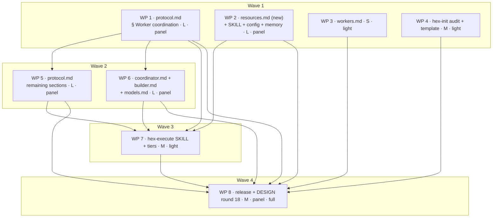

# Plan: adr_0013 — execution runtime contracts

## Status

- State:   done
- Tier:    high
- Approved: owner autonomous-goal directive 2026-09-05
- Verify-default: scoped
- Updated: 2026-09-06
- Reviewed: fbc89f0dd89f4e9997ff1157cc27514ac94dd4b4
- Next:    (none — approved)
- Finalized: 2026-09-06 by /hex-finalize — branch recomposed to 5 commits on main; verification green (task publish -- --dry-run, task nox:verify)

## Overview

Implements [`adr_0013_runtime_contracts.md`](../adrs/adr_0013_runtime_contracts.md)
and its companion [`adr_0013_system_design.md`](../adrs/adr_0013_system_design.md)
into the `hex/` bundle: **worker liveness** (a heartbeat file, a five-value
state enum, a four-rung escalation ladder run by the top orchestrator alone),
the **resource contract** (a `limits.heavy` `flock` semaphore, a measured
resource profile, a three-check preflight, a per-run scratch environment and
orchestrator-owned teardown, all in a new `resources.md`), **per-work-package
sub-orchestration** (the existing `coordinator` role's single spawn gate splits
into two questions, and its behavioural riders retarget onto the *decomposing*
kind), and **run telemetry** (a second `## Schedule log` line kind and a
six-figure handoff rollup, with **no new file and no new writer**).

**Forty-nine contract changes across forty-one edit sites in twenty files under
`hex/`, one of them new**, plus one errata entry appended to the ADR. Every
change is markdown; nothing executable ships and nothing this plan writes ever
enters a checkout.

## Objective

Land `adr_0013`'s twenty-four live contracts (`C-1201`–`C-1226`, less the
withdrawn `C-1203` and `C-1209`) and thirteen scenarios (`S-1201`–`S-1213`) as
shipped bundle text, so that a `/hex-execute` run detects a silently dead
worker in minutes rather than at the next human glance, bounds concurrent heavy
commands against the host it is actually running on, overlaps ready work
packages instead of queueing them behind a sibling's review round, and records
where its own wall clock went.

## Scope

### In Scope

- `hex/hex-core/references/protocol.md` — the liveness subsection, the cap
  amendment, the allocation invariant, the preflight table, the extended
  schedule-log grammar, the teardown amendment, **every** `coordinator-owned`
  rider retargeting, and the handoff rollup.
- `hex/hex-core/references/resources.md` — **new file**, the sole definition
  site for the whole resource contract.
- `hex/hex-core/SKILL.md`, `hex/hex-core/references/workers.md`,
  `hex/hex-core/references/workers/coordinator.md`,
  `hex/hex-core/references/workers/builder.md`,
  `hex/hex-core/references/models.md`,
  `hex/hex-core/references/config.md`, `hex/hex-core/references/memory.md`.
- `hex/hex-execute/SKILL.md`, `hex/hex-execute/tier-low.md`,
  `hex/hex-execute/tier-medium.md`, `hex/hex-execute/tier-high.md`.
- `hex/hex-init/SKILL.md`, `hex/hex-init/references/audit.md`,
  `hex/hex-init/assets/templates/plan.md`.
- Release bookkeeping: `hex/publish.toml`, `hex/CHANGELOG.md`,
  `hex/README.md`, `hex/DESIGN.md` (round 18), and an errata entry appended to
  `adr_0013_runtime_contracts.md` § Changelog.

### Out of Scope

- **`nox/`** — this ADR requires no nox-side change. `nox/src/nox/liveness.py`
  is the `C-1010` liveness-class policy whose silence-over-progress principle hex's contract shares, expressed as hex's own observation modes (protocol.md § Adversary contract), not as liveness classes; it is read as
  precedent and never edited. `task nox:verify` is therefore not a gate here.
- **`.agents/memory/hex.md`** — the Upkeep step's own write, not a work
  package.
- **Everything `plan_adr_0012_per_wp_effective_tier.md` owns.** That plan
  executes first on this branch; § Parallelization's seam table is the
  authority on every shared file, and each contract below names the sections it
  must not touch.
- **`C-1203` and `C-1209`, and constitutional amendment 1** — withdrawn in the
  ADR's 2026-09-05 fix round. **No work package may implement either**, and no
  shipped file may describe a progress-delta test or a generated client hook.
- **`.gitignore`** — this design writes nothing into a checkout, so no
  gitignore line and no gitignore audit item exists.
- **Refreshing the dogfooded copies under `.claude/skills/hex-*`** — a
  separate chore commit after the merge, per the ADR's rollout note.

## Research

Persisted, pre-existing, and read in full during Discover:

- [`parallel-resource-pitfalls.md`](../research/parallel-resource-pitfalls.md)
  — the knob sheet, containment ladder and preflight that WP 2 transcribes.
- [`liveness-heartbeat-precedent.md`](../research/liveness-heartbeat-precedent.md)
  — Kubernetes startup probes, systemd `WATCHDOG_USEC`/`EXTEND_TIMEOUT_USEC`,
  Temporal `heartbeat_details`, OTP `intensity`/`period`.
- [`semaphore-containment-portability.md`](../research/semaphore-containment-portability.md)
  — the `flock` portability ladder and the cgroup detection probes.
- [`suborchestration-telemetry-precedent.md`](../research/suborchestration-telemetry-precedent.md)
  — the Airflow `SubDagOperator` deadlock, OpenTelemetry GenAI attributes.
- [`rca-review-fix-loop-wall-clock.md`](../research/rca-review-fix-loop-wall-clock.md)
  — the traced 186-minute work package and its 53-minute queue tail.

## Technical Approach

### Architecture Changes

**One new file, one new subsection, and a set of one-clause qualifiers.** The
sole-definition-site rule (`DESIGN.md` round 10) governs throughout: canonical
text lands once and every other site links.

| Concern | Sole definition site | Everything else |
|---|---|---|
| Liveness (heartbeat, enum, cadence, checkpoint, ladder, evaluator) | `protocol.md` § Worker coordination › **new** `### Worker liveness` | `workers.md` rule 9, `coordinator.md`, `hex-execute/SKILL.md` link |
| Resources (profile, semaphore, scratch, containment, knobs, teardown, output signals) | **new** `hex-core/references/resources.md` | `protocol.md`, `workers.md` rules 10–11, `config.md`, `memory.md` link |
| Preflight (three checks before every spawn wave) | `protocol.md` § Worker coordination, after the fan-out-mechanism block | `resources.md` § 4 is **one line** pointing here |
| Telemetry (the `phase` line kind, the field set, the rollup) | `protocol.md` § Parallel-by-default decomposition › the schedule-log bullet | plan template comment, `hex-execute` tier files, § Handoff contract |
| The two coordinator kinds (`pipeline` / `decomposing`) | `workers/coordinator.md` § coordinator — the Mission clause | `protocol.md`'s rider retargetings, `hex-execute/SKILL.md`, `models.md` |
| The Q1/Q2 gate | `hex-execute/SKILL.md` § Coordinator spawn (Q1); `coordinator.md` (Q2) | `protocol.md`'s launch/ready-set bullet links both |

### Key Decisions

1. **Contract IDs take the `C-13xx` / `S-13xx` block.** `adr_0013` declares
   `C-1201`–`C-1226` contiguous and greps for that range in its own
   § Validation; extending the block from a plan would break that check.
   `adr_0012`'s plan owns `C-938`–`C-962` and `S-918`–`S-925`, `adr_0011` owns
   up to `C-1044`, `adr_0012` owns `C-1101`–`C-1124` / `S-1101`–`S-1111`.
   `C-13xx` / `S-13xx` is the next free block and collides with nothing.
   `protocol.md` § Traceability IDs prefers IDs carried through unrenumbered;
   `plan_adr_0012` established the renumbering practice for a plan implementing
   an ADR, and § Notes carries the ADR→plan map that keeps the ADR's own
   coverage check runnable.
2. **`protocol.md` is split across two work packages, serialized, never
   concurrent.** The ADR's own rollout says it: *"Same file as class 1,
   different sections: serialize class 3 behind class 1 rather than merging two
   edits to one file concurrently."* WP 1 owns § Worker coordination; WP 5 owns
   every other section and depends on WP 1.
3. **Liveness before sub-orchestration, always (hard).** The cap amendment is
   stated in terms of the state enum — *"an agent in state `blocked` does not
   occupy a slot"*. Without the enum the amendment is unenforceable prose, and
   without the amendment Part 3 deadlocks by construction. WP 5, WP 6 and WP 7
   therefore depend on WP 1.
4. **Resources before sub-orchestration, as a safety edge.** The system design
   states it: *"Shipping D without C is technically fine and operationally the
   exact mistake the evidence names."* WP 7 — which arms Q1 and widens real
   parallelism across work packages — therefore depends on WP 2, which ships
   `limits.heavy` and the semaphore.
5. **Five edit sites this plan adds beyond the ADR's per-file table**, each
   recorded as ADR errata in WP 8:
   - `workers/builder.md` carries a **fourth copy** of the leaf-under-a-
     coordinator carve-out that nothing in the ADR's table scopes. Left alone,
     Q1 would strip the Implement gate from every work package through that
     copy alone.
   - `hex-core/SKILL.md` § References needs a `resources.md` row, or the
     conditional-load contract `C-1218` states has no mechanism. **The ADR's
     per-file table records no registration site at all**; `README.md` appears
     there only as release bookkeeping, and `hex-core/SKILL.md` § References is
     the actual reference enumeration.
   - `hex-init/SKILL.md` § 1. Audit project context carries a bulleted mirror
     of the audit items; three items added to `audit.md` need three bullets
     here or the wizard never asks them.
   - `hex-init/assets/templates/plan.md` § Schedule log has **no row** in the
     ADR's per-file table, though the rollout section refers to "the
     plan-template row" as if it did.
   - `workers.md` already carries **eight** numbered universal rules; the ADR's
     table says "new rule 8 / 9 / 10". The new rules are **9, 10 and 11**.
     This is a correction to the ADR's rows, not a new site.
6. **`limits.heavy` is a v1 additive key, not a v2 bump — a correction to the
   ADR.** `config.md` marks only `workflows` as v2; `limits.adversary-timeout`
   is additive under the frozen `limits` key and is marked v1. `DESIGN.md`
   round 14 item 3 settled the identical move and states that for an additive
   key under an existing frozen top-level key the
   `# hex config, vocabulary vN` comment is **unchanged**. The ADR's
   § Validation says "the key table and the v2 paragraph"; the v2 paragraph is
   `workflows`' and is not touched. Recorded as errata in WP 8, and the move
   carries its own Constitution Deviations row (amendment 9).
7. **No client-specific enforcement of any kind ships.** `C-1209` and
   amendment 1 — the `/hex-init`-generated post-tool-call hook — are withdrawn.
   Every mechanism here is prompt text an agent executes with one foreground
   tool call. `DESIGN.md` § Spec-kit comparison round (2026-07-19, round 5)'s
   non-adopt of the extension-hook stack needs no carve-out.
8. **`DESIGN.md` takes round 18.** The file ends at round 16 on this branch (Wave 0 landed rounds 14–16);
   `plan_adr_0012` takes round 17.

### Portable floor / client ceiling, per part

hex ships one contract and detects capabilities per run; a client that has more
gets more, and every degrade prints its own `Degraded:` line. **Capability
classes only — no harness primitive name enters any shipped file.**

| Part | Portable floor (prompt-and-file, every client) | Client ceiling (capability class, announced) |
|---|---|---|
| **1 Liveness** | The beat is one foreground tool call the agent makes itself. The evaluator globs the flat directory at turn boundaries it was taking anyway (ladder rung 3): zero added turns, detection up to ~28 min. | *Condition-waiting* → one armed wait per spawn wave (rung 1). *Scheduled-wake* → one wake per 5 min (rung 2). *Agent messaging* → the L1 ping. *Agent termination* → the L3 stop; absent, L3 reports and marks the WP `failed` instead. Detection ≤ 13 min. |
| **2 Resources** | POSIX `flock(1)` slot files, a bounded wall-clock backstop, and a measurement ladder probed with a no-op rather than branched on `uname`. | *Cgroup containment* (`systemd-run --user --scope -p MemoryMax=`, gated on the binary **and** `/run/systemd/system`) → rung 1; else delegated cgroup v2, else `nice`/`ionice`, else backstop only. `/proc/pressure/memory` present → the third preflight check; absent → the check is **skipped and announced**, never reported as passed. |
| **3 Sub-orchestration** | Q2 (decomposition) is the existing judgment and is unchanged. | *Nested spawning* → Q1 gives every ready WP a pipeline coordinator. Absent → the existing `Degraded: flat execution — no nested spawn; coordinators inlined` and today's behaviour exactly. |
| **4 Telemetry** | Entirely floor. The parent brackets what it runs with `date -u +%FT%TZ` and reads per-phase timings out of the structured result each coordinator already returns. No file, no writer, no capability. | None. |

## Constitution Deviations

<!-- hex/DESIGN.md is the constitution. Rows 2-8 are adr_0013's own proposed
     amendments; row 9 is added by this plan for a deviation the ADR did not
     record. WP 8 writes all eight into DESIGN.md as round 18. -->

| Violation | Why needed | Simpler alternative rejected because |
|---|---|---|
| **Amendment 2** — ephemeral runtime state. Amends `adr_0010` driver 5 ("No nested state files, at any depth") and `C-914`'s "no per-coordinator state" clause. Boundary: the four conditions — ephemeral (teardown-deleted, outside every checkout, never committed), never authoritative, never read by resume, one flat directory per run. | A silent death is only detectable if something outside the dead agent records that it was alive. `C-912`'s four objections are answered or dissolved: no split record, **zero gitignore lines**, teardown already exists for the scratch root, resume still reads only the plan. | **Keeping all state in the plan** was rejected — a plan is committed, and a per-beat commit is a write storm on the one durable record. **A per-coordinator directory** was rejected — driver 5's flat surface is preserved literally, not by analogy. |
| **Amendment 3** — the concurrency cap counts live model-compute. Amends `protocol.md` § Worker coordination's recursive counting so an agent in state `blocked` does not occupy a slot. Boundary: `blocked` is a declared state with a `blocked_on` value, never an inference; recursive counting, `min(8, max-workers)`, the clamp and the federated single-lead read are unchanged. | Deadlock avoidance, not an optimization. Charging a coordinator that waits on its own children against the pool those children draw from is the Airflow `SubDagOperator` deadlock, and Part 3 deadlocks by construction without it. | **Raising the cap instead** was rejected — it removes the bound rather than fixing the accounting, and the OOM evidence says the bound is needed. **Inferring blocked-ness** was rejected — an inference cannot be audited at a merge gate. |
| **Amendment 4** — the coordinator gate splits in two. `hex-execute/SKILL.md` § Coordinator spawn's single gate becomes Q1 (does this WP get a coordinator — yes when the ready set holds ≥ 2 WPs and the harness can nest) and Q2 (does it further decompose — the existing ≥ 3-independent-sub-task judgment, unchanged). Boundary: no new role, no new level, and **no change to the join *rules* or the file-set intersection check**; the Mission, Fan-out, Join and Tools/Model clauses gain a kind qualifier and the spawn prompt gains input lines, under amendments 6 and 8. | One gate has been answering two unrelated questions. "Is this WP internally decomposable?" and "should this WP's pipeline run concurrently with its siblings'?" have different answers, and conflating them is what leaves a ready WP queued behind a sibling's review round. | **A new sub-orchestrator role** was rejected — it adds a level, a state and a persona for behaviour the coordinator already has. **Widening Q2's threshold** was rejected — it would force decomposition on WPs that are not decomposable. |
| **Amendment 5** — one artifact enters the bundle's set: `hex-core/references/resources.md`, conditional-load. | The resource contract has nine sections of knob-sheet and ladder detail; putting it in `protocol.md` would load it on every run of every skill for a contract most runs never exercise. | **Folding it into `protocol.md`** was rejected on load cost. **A second bundle member** was rejected — it is a reference file inside the existing `hex-core` skill directory, so `hex.toml` and `grimoire.toml` are untouched. |
| **Amendment 6** — every `coordinator-owned` rider keys on the *decomposing* kind. Amends `protocol.md` § Worktree work-package mechanics (the full-verification `join` trigger), § Checkpoints (the counter reset), **§ Verification › Scoped check (gate site 3 and the merge-site scope bullet)** and **§ The Review-Fix Loop (the leaf-under-a-coordinator carve-out, restated at § Scoped check, in `workers/builder.md` and in `workers/coordinator.md` — four copies in all)** to read "**decomposing**-coordinator-owned". **This changes `adr_0010` `C-901`'s firing condition** and is stated as such. Boundary: only the firing condition moves; the scoped/full distinction, `M = 3`, `C-901`'s other triggers and `C-904`'s bisection walk are unchanged. | Under Q1 every ready WP gets a coordinator. Unretargeted, the merge riders make every merge pay a full verification run and reset the counter, and **the leaf carve-out degrades every Implement gate to a compile-only check** whose stated backstop — "the coordinator runs the one authoritative verification at the WP join" — is false for a pipeline coordinator, which has no join. | **Leaving the riders on any coordinator** was rejected — it charges the full gate to work that did not decompose and removes the Implement gate from work that has no join to compensate. **Deleting the triggers** was rejected — a decomposing coordinator's join genuinely warrants both. |
| **Amendment 7** — review breadth is decoupled from coordinator existence. Deletes from `hex-execute/SKILL.md` § Coordinator spawn's WP-merge bullet the clauses *"a coordinator WP is by definition `panel`"* and *"`self`/`light` WPs never qualify for a coordinator"*, **keeping** *"`panel` = the tier baseline"*. Boundary: the `Review` cell's semantics, its lower-only budget and `adr_0012` `C-1112`'s `Review: panel` escape hatch are unchanged; only the coordinator-implies-`panel` inference is removed. | Under Q1 every ready WP gets a coordinator, so the first clause would raise **every** WP to `panel` and invert `adr_0010` `C-905`'s lower-only budget, and the second clause contradicts Q1 head-on. Breadth is a property of the work, not of who spawns the phases. | **Exempting `self`/`light` WPs from coordinators** was rejected — it re-serializes exactly the small cheap WPs Part 3 exists to overlap. **Reading breadth from the coordinator kind** was rejected as a second competing source for a value `C-905` and `adr_0012` already resolve. |
| **Amendment 8** — a pipeline coordinator's capability class follows the work package. Amends `models.md`'s `coordinator` row and its rule-5 tier gate: the matrix gains a **pipeline** row resolving per the WP's own effective tier with **all three cells filled** (never `—`), while the **decomposing** row keeps `deep-reasoning` and the medium/high gate. Boundary: capability classes only — no literal model name enters `models.md`; the decomposing row is unchanged; `C-1109`'s `min(T, medium)` floor stays scoped to the decomposing kind. | Under Q1 a `low`-tier WP would otherwise resolve against a cell reading `—` — "never spawned at that tier" — which is the exact unresolvable state the amendment exists to remove. | **Keeping one row for both kinds** was rejected — it either over-spends on trivial WPs or leaves the gate unresolvable. **A literal model name** is forbidden by the constitution and was never considered. |
| **Amendment 9 (plan-added)** — the frozen six-key config vocabulary admits a **second** additive key: `limits.heavy`. Boundary: additive under the existing frozen `limits` top-level key, **neither a rename nor a seventh key**; `config.md`'s `# hex config, vocabulary vN` comment is **unchanged** and the key is marked v1. | The identical move to `DESIGN.md` round 14 item 3 (`limits.adversary-timeout`), and it needs the same adjudication rather than riding that one. The freeze's stated harm is **renaming**, and this is not a rename: a reader predating the key meets an unknown key under `limits` and degrades correctly by merge rule 8 to today's unbounded behaviour. | **A plan-table column** was rejected — a plan travels between machines and this value is a property of the host, not of the work. **Renaming `limits.max-workers`** was rejected outright — renaming a frozen key is a silent no-op in every consumer `hex.md`. |
| **Amendment 1 — WITHDRAWN.** No client-specific enforcement is proposed. | — | The carve-out would have been the first time hex writes executable configuration, for a mechanism nothing requires and nothing measures. Preserved as the ADR's deferred finding **D-4**. |

## Component Contracts

Numbered `C-13xx`; scenarios `S-13xx`. **Edit sites are named by file and
heading, never by line number** — `hex/**` changes under active execution.

### WP 1 — `protocol.md` § Worker coordination

| ID | Contract | Edit site |
|---|---|---|
| **C-1301** | The concurrency-cap bullet reads that `min(8, max-workers)` counts **live model-compute — agents in state `working`** — and that an agent in state `blocked` (on children, on a heavy slot, on a lock) does not occupy a slot. Names the ground: charging a blocked parent against the pool its children need is the documented nested-pool deadlock. Recursive counting, the clamp above 8 and the federated single-lead read are otherwise unchanged. | `## Worker coordination` — the cap bullet (amended clause) |
| **C-1302** | A new `### Worker liveness` subsection is created under `## Worker coordination` as **the sole definition site** for Part 1. It states the heartbeat file at `${XDG_CACHE_HOME:-$HOME/.cache}/hex/<run-id>/hb/<agent-id>.json`, **outside every checkout**, and why (an in-tree control surface is attacker-plantable by the repository under work; `<run-id>` also fixes the two-runs-one-checkout collision); the **eight** fields `seq`, `parent`, `state`, `step`, `checkpoint`, `ts`, `expect_next_s`, `blocked_on`; **no `id` field** (byte-identical to the filename stem) and **no `children` field** (the directory is flat and every file carries `parent`); temp-then-rename writes; **exactly one writer, always — the agent the filename names**; `seq` as the torn-write guard and never a liveness grade; and that the file is ephemeral, teardown-deleted, never read by resume. **The orchestrator resolves every path under `${XDG_CACHE_HOME:-$HOME/.cache}/hex/` once from its own unredirected environment and passes each as an absolute path in every spawn prompt; a worker never expands it itself.** `<run-id>` and every `<agent-id>` are orchestrator-minted and slugified to `[a-z0-9][a-z0-9-]{0,63}`, never taken from a plan cell or filename. | `## Worker coordination` → new `### Worker liveness` (new text, sole source) |
| **C-1303** | The same subsection states the **five-value state enum** `spawning \| working \| blocked \| done \| failed`, with `spawning` carrying the cold-start-budget rationale, `blocked` load-bearing for exactly one thing (it exempts the agent from the concurrency cap), `blocked_on` present only in `blocked`, a `blocked` beat without it graded as **nothing**, and `failed` meaning "the agent reported its own failure" and never "the parent declared it dead". It states the **four cadence obligations** — at spawn within 2 minutes in `spawning`; at every phase boundary with `step` changed; at least every 5 minutes while `working`; and before any tool call expected to exceed the current deadline, declaring a larger `expect_next_s` — the `expect_next_s / 2` free-choice rule, the default `expect_next_s = 300`, and that **every beat is one foreground tool call by the agent itself: no background process, no timer, no daemon, no client hook**. An agent that was passed no path writes no beat and is exempt from the ladder. | `## Worker coordination` → `### Worker liveness` |
| **C-1304** | The same subsection states the `checkpoint` field's **two forms, attributed by agent kind**: a **commit SHA** for a coordinator (its last sub-WP join commit) and a **path, never a SHA** for a leaf (its last durable artifact), because `workers.md` rule 5 forbids a leaf to commit. `null` where nothing durable exists, and a re-spawn restarts the phase. The value is **advisory to the re-spawn prompt and never authoritative over the plan**. | `## Worker coordination` → `### Worker liveness` |
| **C-1305** | The same subsection states the **four-rung ladder**: **L0 fresh** (last beat within `expect_next_s`) → nothing. **L1 stale** (`now − ts > 2 × expect_next_s`) → wait 3 minutes and best-effort ping over the *agent-messaging* capability — **the wait is the rung, the ping is not a gate**. **L2 unresponsive** → read the agent's output if the harness exposes it; **tool calls still flowing ⇒ alive and violating the beat contract: log a `Warn` finding (`adr_0006` `C-502`) and do NOT kill**; silent ⇒ L3. **L3 dead** → stop over the *agent-termination* capability and re-spawn from `checkpoint`. **One retry per phase; a second death in the same phase marks the work package `failed` and surfaces it.** Nobody writes a dead agent's beat — the outcome is recorded in the plan's Parallelization-table **Status** column. A missed startup beat is the only L1 that skips straight to L2. **L3 on a coordinator stops its children first**, identified by `parent`. Any worker text this rung reads is quoted and truncated per `protocol.md` § Untrusted-text echoes — **linked, never restated**. Where messaging is absent L1 waits out its 3 minutes; where termination is absent **L3 does not kill** — it reports, marks the WP `failed`, and lets `adr_0010` `C-913`'s cascade govern. Each degrade prints its own `Degraded:` line. | `## Worker coordination` → `### Worker liveness` |
| **C-1306** | The same subsection states that **a coordinator is a worker like any other for liveness: it writes its own beat and runs no ladder**, and that **the top orchestrator is the sole ladder runner for the whole fleet at every depth** — the directory is flat and every beat carries `parent`, so one glob gives every agent's state at every depth. It states the **three-rung evaluation-mechanism ladder**, resolved once per run and announced: (1) *condition-waiting* capability → one armed wait per spawn wave returning on completion or on a stale beat; (2) else *scheduled-wake* → one wake per 5 minutes; (3) else **turn-boundary checks** — glob the whole directory unfiltered at each phase boundary and each turn the orchestrator takes anyway. Rung 3 is **zero added turns and not a failure mode**, and its detection figure is bounded by the orchestrator's own turn cadence and is honestly larger. **Capability classes only; no harness primitive name appears.** | `## Worker coordination` → `### Worker liveness`, the evaluator paragraph |
| **C-1307** | The allocation invariant lands beside the existing fan-out-budget rule: every live coordinator gets a **floor of 1 leaf slot** it can never be starved of, plus borrowing up to a ceiling from idle siblings, **partitioned per wave at schedule time, never contended at runtime**. Effective parallel WP count = `min(|ready set|, effective max-workers)`, additionally bounded by `limits.heavy` for heavy phases — **the two caps compose rather than substitute**. This is `C-1221`'s one home; § Parallel-by-default decomposition links here and restates nothing. | `## Worker coordination` — beside the existing fan-out-budget rule (sole source) |
| **C-1308** | The **three-check preflight table** lands after the fan-out-mechanism block, beside `C-1309`'s heavy-slot pointer. It **defines the term "spawn wave"** — the launch of one ready-order batch, linking § Parallel-by-default decomposition's launch/ready-set bullet — because the section carries no wave or batch language today. Before **every** spawn wave, under 2 seconds: disk headroom; `/proc/pressure/memory` `full avg10` above 10 %; stale worktrees. On any trip the orchestrator **holds, never spawns**: a bounded 60-second hold, up to 3 retries, then surface to the human naming the tripped check. **A missing check is never a passed check** — a host without a probe skips it and announces the reduced check set. Preflight lives here rather than in `resources.md` because it is **scheduling, not a resource knob**: two of its three checks do not care whether the gate is heavy, and `resources.md` is conditional-load. | `## Worker coordination`, after the fan-out-mechanism block (sole source) |
| **C-1309** | Beside the preflight table, a pointer states the **conditional-load rule** for `resources.md` (read only when a run will issue a heavy command), **names what that file owns** (the measured profile, the semaphore, the per-run scratch, the containment ladder, the knob sheet, teardown, output signals), **notes that preflight is not among them**, and states that heavy commands take one of `limits.heavy` `flock` slots held **around the command, not for the worker's lifetime**. **It defines nothing else** — the path, the idiom and the portability ladder are `resources.md`'s. | `## Worker coordination`, after the fan-out-mechanism block (link only) |

### WP 2 — `resources.md` (new), its registration, and the config surface

| ID | Contract | Edit site |
|---|---|---|
| **C-1310** | `hex/hex-core/references/resources.md` is created with the nine sections of the system design § 8.1 outline: **1. Scope**, **2. The measured resource profile**, **3. The heavy semaphore**, **4.** *(one line — preflight lives in `protocol.md`)*, **5. Per-run scratch environment**, **6. Containment ladder**, **7. Per-ecosystem knob sheet**, **8. Teardown**, **9. Output as a resource signal**. § 1 states the **conditional-load rule**, links (never copies) the rule that hex never defines how to verify a project, and states that this file is a knob sheet, not a policy. | **new file** `hex-core/references/resources.md` |
| **C-1311** | § 2 states the one-shot measurement at `/hex-init`: the portable ladder `/usr/bin/time -v` → `/usr/bin/time -l` → `gtime -v`, **each probed with a no-op first** rather than branched on `uname`; the `light \| heavy` classification; and that where none is reachable **no number is fabricated** — the profile is recorded absent, `limits.heavy` falls back to 1, and the degrade is announced. The derivation is stated here as sole source: `heavy = clamp(floor((RAM − headroom) / peakRSS), 1, nproc)` with `headroom = max(2 GB, 25 % RAM)` and **`RAM` computed cgroup-effective** (`min(hostRAM, cgroupLimit)`), never host-total. | `resources.md` § 2 (sole source) |
| **C-1312** | § 3 states what takes a slot (`builder:implement`, `tester`, the merge and checkpoint verification gates) and what never does (reviewers, explorers, researchers, doc-writers, architects, a coordinator between phases); that **the slot is held around the documented verification command, not for the worker's lifetime**; the **host-global** lock path `${XDG_CACHE_HOME:-$HOME/.cache}/hex/locks/heavy-{1..N}`, why it is host-scoped, why differing `N` values bound the host at `max(N)` rather than summing, and that the orchestrator resolves it once and passes it absolute (linking `protocol.md` § Worker liveness for that rule, never restating it). It carries the **heavy-slot idiom verbatim** from the ADR § The heavy-slot idiom — the non-blocking `1..N` scan, the **fail-closed** `flock -w` fallback with no fall-through, `9>&-` so descendants never inherit the fd, exit 111 for busy and 75 for queue-budget-exhausted, `$WALL` default 1800 (4 × the measured gate wall time, floor 600) and `$QUEUE_WAIT` default 60. It states the **portability ladder** `flock(1)` → `python3` with `fcntl.flock` → `mkdir` plus PID-staleness (announced), the **mandatory wall-clock backstop** (`timeout` → `gtimeout` → `perl -e 'alarm shift; exec @ARGV'` — **no acceptable absent outcome**), that a `blocked` beat with `blocked_on` is written **before** the first bounded wait, and that the zero-byte tokens are **permanent and never deleted by anything**. | `resources.md` § 3 (sole source) |
| **C-1313** | § 5 states the **three** redirected variables `TMPDIR`, `XDG_CACHE_HOME`, `XDG_STATE_HOME`, the disk-backed per-run root `${XDG_CACHE_HOME:-$HOME/.cache}/hex/<run-id>/<wp>/`, why disk-backed (a tmpfs `/tmp` makes "disk full" an out-of-memory event in disguise), and **why `XDG_CONFIG_HOME` is deliberately not in the set** — redirecting it drops `url.*.insteadOf` and registry pinning, a supply-chain downgrade. **`HOME` is not in the set either**; it is a `/hex-init` audit opt-in, and the cost is stated plainly: redirecting `HOME` breaks every tool that reads real credentials from it. | `resources.md` § 5 (sole source) |
| **C-1314** | § 6 states the **containment ladder**, four rungs with their detection probes: `systemd-run --user --scope -p MemoryMax=` gated on the binary **and** `/run/systemd/system`; raw cgroup v2 on a delegated user cgroup; `nice`/`ionice`; nothing but the backstop. **Never `ulimit -v` / `RLIMIT_AS` for compiled languages; never `cgcreate`.** § 7 carries the **per-ecosystem knob sheet** as a table, not prose — parallelism default, cap knob, per-worktree artifact, share/redirect, retention — trimmed from `parallel-resource-pitfalls.md`. | `resources.md` §§ 6–7 (sole source) |
| **C-1315** | § 8 states the **teardown checklist** as sole source: the orchestrator's teardown owns the worktree, redirected build directories, caches, the scratch root, the run's heartbeat directory, daemons, containers and recorded process groups — **never a worker `trap`**, because `SIGKILL` skips one. It carries the three safety rules in full: `docker container prune -f --filter label=<the run's own label>` and **only** where the run set that label (never `docker system prune -f --volumes`); signalling **only** orchestrator-recorded `setsid` process groups; and **refusing any delete target that does not resolve under the run's own run-root prefix**. A run deletes only its own `<run-id>` subtree; a killed run's leftovers are **swept and reported by the next run, never deleted**. The heavy-slot tokens are the one permanent exception. | `resources.md` § 8 (sole source) |
| **C-1316** | § 9 states the **three-way triage as the section's spine**: a wait on **hex's own** heavy slot is the mechanism working and is **not a signal**; a **build tool's own** lock wait is a shared build directory — **warn and name it, never lower `heavy`**; only **resource-exhaustion evidence** (an OOM kill, a V8 heap line, a `dmesg` OOM, `ENOSPC`, or over profile × 1.5) lowers `heavy` by one for the remainder of the run, and **only after host-source corroboration**. The orchestrator **never re-parses raw repository-controlled build output** — the worker classifies and returns a bounded token, per `workers.md`; echoes follow `protocol.md` § Untrusted-text echoes, linked. | `resources.md` § 9 (sole source) |
| **C-1317** | `hex/hex-core/SKILL.md` § References gains one row for `references/resources.md`, in the table's existing shape, marked **Conditional-load — read only when a run will issue a heavy command**. Without it `C-1218`'s conditional-load contract has no mechanism. **Plan-added edit site**, recorded as ADR errata in WP 8. | `hex-core/SKILL.md` § References — the table |
| **C-1318** | `config.md` § Key vocabulary gains **exactly one row**: `limits.heavy`, **marked v1 (✅) like its sibling `limits.adversary-timeout`**, int ≥ 1, ceiling-only, **defaulting to the derived value** in `resources.md` § 2 so an unconfigured project reads nothing and gets a measured number rather than a guess. A reader predating the key meets an unknown key under `limits` and degrades by merge rule 8 — warn once, ignore, continue — to today's unbounded heavy commands. **`limits.max-workers` is NOT renamed**: it is a frozen v1 key and renaming it would be a silent no-op in every consumer `hex.md`. **The `# hex config, vocabulary vN` comment and the § v2 vocabulary section are unchanged** (`DESIGN.md` round 14 item 3's rule for an additive key under a frozen top-level key). **The whole `config.md` diff is the one key-table row and nothing else.** | `config.md` § Key vocabulary — the table |
| **C-1319** | `memory.md` § The three sections — the `## Pointers` row's content description is widened by one clause to admit a measured profile alongside cached locations, so the section's own definition stays true, and the enumeration gains two entries: **`Resource profile:`** — the measured peak RSS, wall time, `light \| heavy` class and the derived `heavy` value, re-measured at upkeep on drift — and **`Scratch:`** — the disk-backed per-run root. Both are **cache, never authoritative**, under the row's existing ownership rule. | `memory.md` § The three sections — the `## Pointers` row |
| **C-1320** | `memory.md` § Example file gains both pointer lines once, beside the existing `Worktrees:` bullet, in the example's own shape. | `memory.md` § Example file |

### WP 3 — `workers.md`

| ID | Contract | Edit site |
|---|---|---|
| **C-1321** | § Universal worker protocol gains **three new rules, appended after the existing final rule and numbered 9, 10 and 11** as the file then stands (the file already carries eight; the ADR's table assumed seven — recorded as errata in WP 8). **Rule 9 — beat.** Write a heartbeat per the cadence in `protocol.md` § Worker coordination › Worker liveness, at the absolute path the spawn prompt gave; one foreground tool call, **no background process and no hook**; link rule 2's canonical text rather than restating it. **Rule 10 — run under the per-run scratch env.** Use the `TMPDIR`, `XDG_CACHE_HOME` and `XDG_STATE_HOME` the spawn prompt gave, never re-derived; take a heavy slot around the documented verification command; treat a slot wait as **not** a signal. Link `resources.md`. **Rule 11 — classify and return a bounded token.** On a lock wait or a resource event, classify it into the three classes and return a bounded token; **never retry any of the three as a flake**, and never hand raw build output upstream. | `workers.md` § Universal worker protocol — three appended rules |
| **C-1322** | The role index gains a **one-clause qualifier** naming the heavy roles (`builder:implement`, `tester`) as the ones that take a heavy slot, linking `resources.md`. One clause, no mechanism. | `workers.md` — the role index |

### WP 4 — `hex-init`

| ID | Contract | Edit site |
|---|---|---|
| **C-1323** | `audit.md` § Audit items gains **exactly three** new items, immediately after `### Cross-model adversary skill installed?`, transcribed from the system design § 8.2 in the file's own **Look for / Where / Documented looks like / De facto discovery** shape: **"Resource profile measured?"**, **"Agent worktrees excluded from watchers and indexers?"**, and **"Scratch / temp convention documented?"** — the last carrying the **`HOME`-redirect opt-in** in its De facto discovery clause and naming **two** reasons to take it: a suite known to write to `$HOME`, and **credential exposure to a verification command the project does not fully trust**. **There is no fourth item** — the drafted "Beat enforcement hook installed?" item is dropped with `C-1209` and amendment 1 — **and no gitignore item**, because this design writes nothing into a checkout. | `audit.md` § Audit items, after `### Cross-model adversary skill installed?` |
| **C-1324** | `hex-init/SKILL.md` § 1. Audit project context gains **three matching bullets** in the existing list's shape, each linking its `audit.md` anchor. Without them the wizard never asks the three items. **Plan-added edit site**, recorded as ADR errata in WP 8. | `hex-init/SKILL.md` § 1. Audit project context — the bulleted list |
| **C-1325** | The plan template's `## Schedule log` HTML comment gains the **`phase` line grammar** beside the existing `merged` grammar, byte-unchanged, plus the one-line note that consumers filter on the first word after the first `·`. **Plan-added edit site** — the ADR's per-file table carries no row for it. **The `## Parallelization` comment and the `## Status` block are `plan_adr_0012` WP 3's and are not touched.** | `hex-init/assets/templates/plan.md` § Schedule log — the comment |

### WP 5 — `protocol.md`, remaining sections

| ID | Contract | Edit site |
|---|---|---|
| **C-1326** | The schedule-log bullet gains a **second line kind**, discriminated by the first word after the first `·`: `- <ISO-8601 UTC> · phase <WP>/<phase> · model <class> · work <elapsed> [· wait <elapsed>] [· rounds <n>]`. The existing `merged` grammar stays **byte-for-byte unchanged**. The **compatibility filter is written explicitly**: existing consumers — `adr_0010` `C-904`'s bisection walk among them — read only `merged` lines. `<class>` is **always a capability class, never a literal model name**. | `## Parallel-by-default decomposition` — the schedule-log bullet, the grammar line |
| **C-1327** | Beside the grammar, the **per-phase field set** is stated: `ts`, `run`, `wp`, `phase`, `event`, `model`, `agent`, `work_ms`, `wait_ms`, plus `rounds` on review phases — **fields in the structured result each coordinator already returns, not a line in any new file**. **`wait_ms` has exactly one definition and no other: the interval from the phase becoming runnable to its worker beginning work**; every coarser formulation is that same interval at a coarser grain. **Where the start is unknown the field is absent, never zero.** The parent times what it runs itself from its own `date -u +%FT%TZ` brackets. **No file, no second writer.** OpenTelemetry GenAI attribute names may be borrowed where they fit — the names, not the wire format, and no SDK dependency. | `## Parallel-by-default decomposition` — beside the schedule-log grammar |
| **C-1328** | § Handoff contract gains the **six-figure rollup**: total wall clock, per-work-package wall clock, per-phase wall clock, the work/wait split, review rounds, and adversary-gate time — read from the plan the run just wrote. **Where `phase` lines are absent or partial the handoff names which figures are missing** rather than omitting the section or estimating. The tier files link here. | `## Handoff contract` |
| **C-1329** | § Worktree work-package mechanics — the delete-the-worktree bullet gains **one clause**: teardown is the **orchestrator's**, never a worker `trap`, and it sweeps and **reports rather than deletes** on ambiguity. **The checklist itself is `resources.md` § 8's and is linked, not restated** — this contract enumerates nothing. | `## Worktree work-package mechanics` — the delete-the-worktree bullet |
| **C-1330** | § Verification gains a **one-clause qualifier**: where the documented gate is classed `heavy`, it runs under a heavy slot per `resources.md`. **No restatement of the mechanism**, and the section's governing sentence — hex never defines how to verify a project — is untouched. | `## Verification` |
| **C-1331** | `### Checkpoints` gains a **one-clause qualifier** that the checkpoint verification gate takes a heavy slot, linking `resources.md`. The firing condition is `C-1332`'s business, not this clause's. | `### Checkpoints` |
| **C-1332** | **Every `coordinator-owned` rider in this file is retargeted to read "decomposing-coordinator-owned"** — **six sites** (four named below, plus two in `### The effective tier`'s coordinator-owned-parents paragraph, found during execution 2026-09-06; that section is `plan_adr_0012`'s, so the two-word qualification is a recorded seam crossing and takes an errata row), not two: the `join` full-verification trigger (§ Worktree work-package mechanics, the merge-gate bullet); the `M = 3` counter reset (`### Checkpoints`, condition 1); **§ Verification › Scoped check gate site 3** (*"except a coordinator-owned WP's merge, which pays the project's full documented verification instead"*); and **§ Verification › Scoped check's merge-site scope bullet** (*"a coordinator-owned WP's own merge … pays the full verification rather than this check"*). **This changes `adr_0010` `C-901`'s firing condition and the plan says so.** The scoped/full distinction, the `M = 3` value, `C-901`'s other triggers and `C-904`'s bisection walk are **unchanged**, and a decomposing coordinator's join still fires both. | `## Worktree work-package mechanics` — the merge-gate bullet; `### Checkpoints` — condition 1; `## Verification` › `### Scoped check` — gate site 3 and the merge-site scope bullet |
| **C-1333** | **The leaf-under-a-coordinator verification carve-out is scoped to the decomposing kind at both its sites**: § The Review-Fix Loop (*"Carve-out for a leaf under a coordinator: it runs a scoped compile/parse check only … and the coordinator runs the one authoritative verification at the WP join"*) and § Verification › Scoped check gate site 1 (*"except a leaf under a coordinator, which runs half (b) alone"*). Both now read "a leaf under a **decomposing** coordinator". **Without this, Q1 degrades every work package's Implement gate to a compile-only check whose stated backstop is a join a pipeline coordinator does not have.** `coordinator.md`'s copy is declared a non-source there and follows this text. | `## The Review-Fix Loop` — the carve-out; `## Verification` › `### Scoped check` — gate site 1 |
| **C-1334** | § Parallel-by-default decomposition's launch/ready-set bullet **names the two coordinator kinds — `pipeline` and `decomposing`** — and states that the spawn gate is two questions, deferring **Q1** to `hex-execute/SKILL.md` § Coordinator spawn and **Q2** to `workers/coordinator.md`. Every rider retargeted by `C-1332` and `C-1333` keys on that distinction, so the file that carries them must name it. It also **points at** the allocation invariant in § Worker coordination and defines none of it — `C-1307` has exactly one home. | `## Parallel-by-default decomposition` — the launch/ready-set bullet |

### WP 6 — `coordinator.md`, `builder.md` and `models.md`

| ID | Contract | Edit site |
|---|---|---|
| **C-1335** | The **Mission** clause is the **sole definition site for the two kinds**: a **pipeline** coordinator owns one work package and runs its whole phase pipeline; a **decomposing** coordinator additionally fans that package out into sub-WPs. The **Preconditions** clause becomes **Q2** — the existing ≥ 3-independent-sub-task, decomposable, ≤ 8–12-files test, **whose ≥ 3 test stays byte-unchanged**. The clause's **outcome** sentences are *not* frozen and were reworded at the convergence pass (2026-09-06): "else the orchestrator runs the WP with a single builder" is false under Q1, where a work package answering no to Q2 still gets a **pipeline** coordinator that runs that builder. § Fan-out's cycle fallback carried the same error and is reworded with it. **No new role, no new level, no new state.** | `workers/coordinator.md` § coordinator — the **Mission** and **Preconditions** clauses |
| **C-1336** | The **Fan-out** clause, the **Join** clause's 1-round join-loop sentence and its leaf-compile-check sentence, and the **Tools**/**Model** clause are each **scoped to the decomposing kind**. A pipeline coordinator splits nothing, runs no join loop, and takes its capability class from `models.md`'s pipeline row. The leaf-verification sentence continues to defer to `protocol.md` as the single source (`C-1333`). `adr_0010`'s and `adr_0012`'s contracts are **referenced, never pre-empted**. | `workers/coordinator.md` § coordinator — the **Fan-out**, **Join** and **Tools**/**Model** clauses |
| **C-1337** | After the **Join** clause, one clause states that the coordinator **writes its own beat like any other worker and runs no ladder**, and that its `checkpoint` value is **the SHA of its last sub-WP join commit** — the reset point the Join paragraph already describes. Links `protocol.md` § Worker coordination › Worker liveness; **restates nothing**. | `workers/coordinator.md` § coordinator, after the **Join** clause |
| **C-1338** | The spawn-prompt block gains the fields the orchestrator resolves once and passes absolute — the heartbeat directory, the agent id, the per-run scratch variables and the host-global lock directory — and the **return template gains the per-phase timing fields** (`phase`, `event`, `model`, `agent`, `work_ms`, `wait_ms`, `rounds` on review phases), plus the "beat before returning after a failure" obligation. **No new file and no new writer.** | `workers/coordinator.md` § coordinator — the spawn-prompt block and the return template |
| **C-1349** | `workers/builder.md` carries a **fourth copy** of the leaf carve-out (*"leaf under a coordinator, which runs its half (b) alone"*). It is scoped to read "a leaf under a **decomposing** coordinator", matching `C-1333`'s two `protocol.md` sites and `C-1336`'s `coordinator.md` clause. **Found by re-validation; the ADR's per-file table names no `builder.md` row** — recorded as ADR errata in `C-1348`. | `workers/builder.md` — the scoped-check clause |
| **C-1339** | `models.md` § The matrix **splits the `coordinator` row in two**. The **decomposing** row is today's, byte-unchanged: `— \| deep-reasoning \| deep-reasoning`. The **pipeline** row has **all three cells filled and none reading `—`**: it resolves to the work package's own effective tier, so `low` → `fast-balanced`, `medium` → `fast-balanced`, `high` → `deep-reasoning`. § Rules rule 5's tier gate is **scoped to the decomposing kind**, since a pipeline coordinator exists at every tier. **Capability classes only — no literal model name.** **§ Rules rule 2 and the clause under the matrix are `plan_adr_0012` WP 2's and are not touched.** | `models.md` § The matrix — the `coordinator` row; § Rules — rule 5 |

### WP 7 — `hex-execute`

| ID | Contract | Edit site |
|---|---|---|
| **C-1340** | § Schedule gains **two steps after step 2 (Compute the ready-set)**, renumbering the two existing later steps: **resolve and announce the evaluation mechanism** for the liveness ladder (the three-rung capability resolution, one `Degraded:` line per degraded axis), and **run the three-check preflight** before every spawn wave, holding rather than spawning on a trip. Both link `protocol.md`; **neither is a new question and neither is a second gate**. The renumber of the existing steps is recorded in the commit body. | `hex-execute/SKILL.md` § Schedule — after step 2 |
| **C-1341** | § Coordinator spawn splits into **Q1** — does this work package get a coordinator: **yes when the ready set holds ≥ 2 work packages and the harness can nest** — and **Q2** — does that coordinator further decompose, the existing judgment, deferred to `coordinator.md` and **never restated here**. From the WP-merge bullet, the clauses *"a coordinator WP is by definition `panel`"* and *"`self`/`light` WPs never qualify for a coordinator"* are **deleted**, keeping *"`panel` = the tier baseline"* (amendment 7). The two non-spawn cases are stated: **(a)** a ready set of exactly one work package → the parent runs the pipeline **inline**; **(b)** the fan-out ladder's degraded-flattening rung → the existing `Degraded: flat execution` line, **no new degrade line invented**. Both degrade to today's behaviour. | `hex-execute/SKILL.md` § Coordinator spawn |
| **C-1342** | § 2. Resolve the target — the resume paragraph gains one clause: **a resuming run re-reads the plan and never reads the run's runtime root.** The surrounding resume rule is unchanged. This is condition 3 of the ephemeral/durable split made greppable. | `hex-execute/SKILL.md` § 2. Resolve the target — the resume paragraph |
| **C-1343** | `tier-low.md`, `tier-medium.md` and `tier-high.md` each gain **the identical one clause with the identical link** in `## Upkeep and handoff`: the handoff prints the six-figure rollup per `protocol.md` § Handoff contract. **One clause, no mechanism.** **The intro paragraphs and the Stub/Specify/Implement phases are `plan_adr_0012` WP 4's and are not touched.** | `hex-execute/tier-{low,medium,high}.md` § Upkeep and handoff |

### WP 8 — release, `DESIGN.md` round 18, ADR errata

| ID | Contract | Edit site |
|---|---|---|
| **C-1344** | `hex/publish.toml` takes a **minor version bump** — `resources.md` is a reference file inside the existing `hex-core` skill directory, **not a new bundle member**, so `hex.toml` and `grimoire.toml` are untouched. The bump is computed from the file as it then stands, and any drift against `CHANGELOG.md`'s latest released heading is reconciled and noted in the commit body. | `hex/publish.toml` — `version` |
| **C-1345** | `hex/CHANGELOG.md` § `[Unreleased]` gains an `### Added` entry (the liveness contract, the resource contract and `resources.md`, the `limits.heavy` key, the three audit items) and a `### Changed` entry (the cap amendment, the coordinator gate split and rider retargetings, the extended schedule-log grammar, the handoff rollup), in the file's existing one-paragraph-per-bullet shape with doc-anchor links. | `hex/CHANGELOG.md` § `[Unreleased]` |
| **C-1346** | `hex/README.md` gains **one line** naming the liveness and resource contracts. **The § Tier grammar section is `plan_adr_0012` WP 7's and is not touched.** | `hex/README.md` |
| **C-1347** | `hex/DESIGN.md` gains **round 18** — `## Execution-runtime round (2026-09-05, round 18)` in the file's fixed heading shape — carrying **eight amendments: the ADR's seven live ones (2–8) and this plan's amendment 9** (`limits.heavy` as a second additive key under the frozen `limits` key), each with its boundary, and recording **amendment 1 as withdrawn with `C-1209`**, its number kept dead. **Round 15 is `plan_adr_0012` WP 7's; this round is appended after it and the file's append-only, strictly-increasing convention holds.** | `hex/DESIGN.md` — appended round |
| **C-1348** | `.agents/adrs/adr_0013_runtime_contracts.md` § Changelog gains one **errata** entry recording: the four plan-added edit sites (`hex-core/SKILL.md` § References — the per-file table records **no** registration site; `hex-init/SKILL.md` § 1's bullets; `hex-init/assets/templates/plan.md` § Schedule log; **`workers/builder.md`'s copy of the leaf carve-out**); the `workers.md` rule renumber from 8/9/10 to 9/10/11; the `limits.heavy` v2→v1 correction; the two extra `coordinator-owned` rider sites in § Verification › Scoped check and the leaf carve-out's two sites; the added amendment 9; **the heavy-slot idiom's out-of-band acquisition
signal** (the ADR's `111` exit-status inference is unsound against a
repository-authored gate command, and its `flock -E` mitigation does not
close it); and **the ADR § Migration's reversibility lever** ("set
`limits.heavy` high to neutralize the semaphore"), which the key's
ceiling-only merge rule makes unreachable; the **three further plan-added
edit sites** § Notes records (the § Adversary contract pointer, the
`workers.md` role-index description, and the leaf spawn templates' missing
liveness and scratch fields); the **second seam touch**, dropping
`plan_adr_0012`'s "rather than being `panel` by definition" trailer in
`hex-execute/SKILL.md` § Coordinator spawn, whose only purpose was to contrast
with the inference `C-1341` removes; and the **third seam touch**, retargeting
`hex-execute/SKILL.md` § 6's `Recursion:` example lines, which still read
"others → single builder (below gate)" — false under `C-1341`'s Q1, and the
very block `C-1340`'s new Schedule step feeds; and the **fourth seam
touch**, `hex-execute/SKILL.md`'s worker-assignment phase table, whose
coordinator row read "0–1 per qualifying WP … granularity gate", false
under Q1; the **seam crossing** into
`### The effective tier`'s coordinator-owned-parents paragraph, which makes
`C-1332` six sites rather than four; and the **`phase` line grammar's `wait`
field**, which `C-1327` makes absent when its start is unknown and which the
ADR's grammar wrote unbracketed. **Five of the plan's own Phase 3 check
rows were unsatisfiable against their own contracts or against pre-existing
text** and were corrected during execution — `C-1315`, `C-1321`, `C-1341`,
`S-1311` and `S-1314` — each by the negative-clause or section-scoping idiom
the same table already used elsewhere; recorded here because the class, not
any single row, is the finding. **The ADR's `**Status:** Proposed` is not touched** — acceptance is the owner's. | `adr_0013_runtime_contracts.md` § Changelog |

## User-Experience Scenarios

| ID | Scenario |
|---|---|
| **S-1301** | **A run on a client with a condition-waiting capability.** The orchestrator resolves rung 1, announces it, and arms one wait per spawn wave that returns on wave completion or on a stale beat. A leaf dies silently at 14:02 with `checkpoint: src/index/claim.rs`; L1 fires at `2 × expect_next_s`, the ping goes unanswered, L2 finds no output, L3 stops the agent and re-spawns from the path — **detection ≤ 13 minutes**, and the outcome is written to the plan's Status column, never into the dead agent's beat file. *(Covers C-1302, C-1304, C-1305, C-1306.)* |
| **S-1302** | **The portable floor: no messaging, no termination, no condition-waiting.** The run announces three `Degraded:` lines. The evaluator falls to rung 3 and globs the flat directory at turn boundaries it was taking anyway — **zero added turns**, detection up to ~28 minutes. L1 waits out its 3 minutes with no ping. **L3 does not kill**: it reports the dead agent, marks the work package `failed`, and lets `adr_0010` `C-913`'s cascade govern. Nothing in the run depends on a harness primitive by name. *(Covers C-1305, C-1306.)* |
| **S-1303** | **Alive but not beating.** A tester forgets the cadence for twenty minutes. L2 reads its output, finds tool calls still flowing, and logs a **`Warn` protocol violation without killing it**. Separately, a healthy implement phase beats on time for twenty minutes without ever changing `step`, and **nothing fires** — the withdrawn `C-1203` delta test is nowhere in the shipped text. A `blocked` beat with no `blocked_on`, and a worker that restarts `seq` at 1, are both graded as nothing. *(Covers C-1303, C-1305; the negative check on C-1203.)* |
| **S-1304** | **A second death in the same phase stops the retrying.** The worker re-spawned in S-1301 dies again during the same implement phase. The ladder reaches L3 a second time; **the one-retry-per-phase rule forbids a third spawn**, so the work package is marked `failed` in the Status column and surfaced, and the run continues on other eligible work packages under `adr_0010` `C-913`'s cascade. *(Covers C-1305.)* |
| **S-1305** | **A `light` verification gate never touches the semaphore.** arcana's documented gate is `grim build <skill-dir>` — parse-only. `/hex-init` classes it `light`, so no lock file is created at all, `resources.md` is never even loaded, and eight work packages verify concurrently. *(Covers C-1310, C-1311, C-1312.)* |
| **S-1306** | **The derivation, end to end, and the queue it produces.** A Rust project measures peak RSS 6 GB on a 31 GB host: `headroom = max(2 GB, 7.75 GB) = 7.75 GB`, `floor(23.25 / 6) = 3`, clamped to `[1, nproc]` → `limits.heavy = 3`. Four builders reach their implement gate together: three take slots immediately, the fourth's bounded 60-second `flock -w` wait times out and **re-scans all three slots rather than staying pinned**, beating `blocked` with `blocked_on: heavy slot` throughout — and it is therefore exempt from the concurrency cap. **The wrapper never runs the command unlocked.** *(Covers C-1303, C-1311, C-1312.)* |
| **S-1307** | **A macOS host announces three degrades in one block.** The semaphore detects `flock(1)` absent and falls to the `python3`/`fcntl.flock` rung; the containment ladder finds no `systemd-run` and falls to `nice`/`ionice` with the wall-clock backstop still running via `perl -e 'alarm shift; exec @ARGV'`; preflight finds no `/proc/pressure/memory` and **skips that check while announcing the reduced check set** — never a false pass. *(Covers C-1308, C-1312, C-1314.)* |
| **S-1308** | **Preflight holds a wave three times, then surfaces.** Memory pressure reads 18 %, 15 %, 12 % across three 60-second holds. The orchestrator spends the hold budget and surfaces to the human naming the tripped check, rather than spawning into the pressure or waiting indefinitely. *(Covers C-1308.)* |
| **S-1309** | **Three lock waits in one run, triaged three ways, and only one moves the cap.** A builder waiting on `heavy-2` is already `blocked` and produces **no signal**. A second builder waits on the build tool's own lock: the orchestrator **warns and names the shared build directory** and does **not** lower `heavy`. A third is OOM-killed; only after `/proc/pressure/memory` corroborates from the host does `heavy` drop by one for the rest of the run. **Planted repository text alone can never move the cap.** *(Covers C-1316, C-1321, C-1322.)* |
| **S-1310** | **A `/hex-init` run on a host with no peak-RSS probe.** All three ladder rungs fail their no-op probe. The audit **records the profile absent, sets `limits.heavy = 1`, and announces the degrade** — it fabricates no number. The three new audit items are asked from the wizard's own bulleted list, and the agent-worktree and scratch items **propose a path and never rewrite the project's config**. *(Covers C-1311, C-1319, C-1323, C-1324.)* |
| **S-1311** | **A plan authored before `adr_0013` executes unchanged.** No `limits.heavy` in `hex.md`, no resource-profile pointer, no `phase` lines. Each reader branches on **presence**: the missing key hits merge rule 8 and degrades to today's unbounded behaviour, the missing pointer suggests `/hex-init` and the run proceeds, the missing lines mean a pre-`adr_0013` run. **No version field is read and the plan is never rewritten.** *(Covers C-1318, C-1326.)* |
| **S-1312** | **The schedule log carries both line kinds and the bisection still resolves.** After a multi-WP run the section holds `merged` and `phase` lines, **written by the parent and by nobody else**. `adr_0010` `C-904`'s bisection walk filters on the first word after the first `·` and is unaffected. The handoff prints **six** figures including the work/wait split, and names any figure it cannot compute rather than estimating it. *(Covers C-1325, C-1326, C-1327, C-1328, C-1343.)* |
| **S-1313** | **Three ready work packages, three pipeline coordinators, one serial merge lane.** Q1 answers yes for all three; Q2 answers no, so each merges through the **ordinary scoped check** — not the `join` full gate — with **no checkpoint-counter reset**, no forced review breadth, and **an Implement gate that still runs the project's documented verification** rather than the decomposing kind's compile-only carve-out. A coordinator blocked on its children **takes no cap slot**, so a sibling still spawns its own leaf under `effective max-workers = 3`. On a harness with no nesting the same plan announces `Degraded: flat execution` and behaves exactly as today; with a ready set of one, the parent runs the pipeline inline. *(Covers C-1301, C-1307, C-1332, C-1333, C-1334, C-1335, C-1341.)* |
| **S-1314** | **The bundle validates and nothing lands in a checkout.** `grim build` passes for every changed skill directory and `task publish -- --dry-run` passes for the full sweep. `grep -rn '\.hex' hex/` returns no hits, `git diff` touches no `.gitignore`, `grep -rn 'hook' hex/` shows nothing this change added, `grep -rn 'limits.heavy' hex/` shows exactly one defining occurrence plus links, and `grep -rn 'XDG_CACHE_HOME' hex/` never hits `hex-execute/SKILL.md`'s resume block. *(Covers C-1317, C-1342, C-1344; the negative checks on C-1203 and C-1209.)* |

## Parallelization

| WP | Scope | Expected Files | Size | Wave | Depends on | Review | Verify | Status |
|----|-------|----------------|------|------|------------|--------|--------|--------|
| WP 1 | Covers C-1301 – C-1309; S-1301, S-1302, S-1303, S-1304, S-1306, S-1307, S-1308, S-1313 | `hex/hex-core/references/protocol.md` | L | 1 | — | panel | scoped | merged |
| WP 2 | Covers C-1310 – C-1320; S-1305, S-1306, S-1307, S-1309, S-1310, S-1311, S-1314 | `hex/hex-core/references/resources.md`, `hex/hex-core/SKILL.md`, `hex/hex-core/references/config.md`, `hex/hex-core/references/memory.md` | L | 1 | — | panel | scoped | merged |
| WP 3 | Covers C-1321, C-1322; S-1309 | `hex/hex-core/references/workers.md` | S | 1 | — | light | scoped | merged |
| WP 4 | Covers C-1323, C-1324, C-1325; S-1310, S-1312 | `hex/hex-init/references/audit.md`, `hex/hex-init/SKILL.md`, `hex/hex-init/assets/templates/plan.md` | M | 1 | — | light | scoped | merged |
| WP 5 | Covers C-1326 – C-1334; S-1311, S-1312, S-1313 | `hex/hex-core/references/protocol.md` | L | 2 | WP 1 | panel | scoped | merged |
| WP 6 | Covers C-1335 – C-1339, C-1349; S-1313 | `hex/hex-core/references/workers/coordinator.md`, `hex/hex-core/references/workers/builder.md`, `hex/hex-core/references/models.md` | L | 2 | WP 1 | panel | scoped | merged |
| WP 7 | Covers C-1340 – C-1343; S-1302, S-1308, S-1312, S-1313, S-1314 | `hex/hex-execute/SKILL.md`, `hex/hex-execute/tier-low.md`, `hex/hex-execute/tier-medium.md`, `hex/hex-execute/tier-high.md` | M | 3 | WP 1, WP 2, WP 5, WP 6 | light | scoped | merged |
| WP 8 | Covers C-1344 – C-1348; S-1314 | `hex/publish.toml`, `hex/CHANGELOG.md`, `hex/README.md`, `hex/DESIGN.md`, `.agents/adrs/adr_0013_runtime_contracts.md` | M | 4 | WP 1 – WP 7 | panel | full | merged |

**Budget histogram** (grammar:
[`protocol.md` § Parallel-by-default decomposition](../../hex/hex-core/references/protocol.md#parallel-by-default-decomposition)):

```
S:light 1 · M:light 2 · M:panel 1 · L:panel 4
```

**Both directions of the budget guard were run, in the directions
`protocol.md` defines them.**

*Upward* — the guard bites `self` or `light` on a security-sensitive,
hot-path, **large or cross-area** work package. Three `light` cells remain and
each clears it: WP 3 is `S` and one file; WP 4 and WP 7 are `M` and each stays
inside **one** skill directory. **WP 8 did not clear it** — it is `M` and
spans the bundle root plus the ADR, and it writes the constitution round
itself — so **its `Review` is raised to `panel`**, which is the guard doing its
job rather than a preference. arcana documents no security-sensitive-path
convention in `hex.md › Pointers`, so that conjunct is unmet everywhere.

*Downward* — the guard bites `panel` on a size **S** or **M**, **single-area**
work package whose file set carries no security-sensitive and no hot-path
file. **No `panel` cell trips it**: WP 1, WP 2, WP 5 and WP 6 are all `L` and
cross-area, and WP 8's `panel` sits on a cross-area file set, leaving the
single-area conjunct unmet. WP 6 is sized `L` for that reason: six contracts
rewriting Mission, Fan-out, Preconditions, Join, Tools/Model, the spawn-prompt
block and the return template, plus `builder.md`'s carve-out and two
`models.md` sites.

`panel` is therefore spent on five work packages, each carrying a one-way-door
surface: WP 1 (the security argument for the out-of-tree heartbeat path, and
the kill ladder), WP 2 (the fail-closed semaphore idiom and the `rm -rf`
prefix guard), WP 5 (the `adr_0010` `C-901` firing-condition change and the
leaf carve-out), WP 6 (the coordinator identity split) and WP 8 (the
constitution round).



**Critical path:** WP 1 → WP 5 → WP 7 → WP 8 (L → L → M → M). WP 1 is the
critical path because it is the sole definition site for the state enum, and
both the cap amendment and every wave-D contract are stated in terms of it.

**Shippable after wave: 2** — Parts 1, 2 and 3's contract text are complete
and self-consistent, and Part 4's grammar and rollup are in `protocol.md`.
**Two clauses land later and the line does not claim otherwise**: the tier
files' handoff clause (`C-1343`) and the Schedule arming and preflight steps
(`C-1340`) are wave 3, so until WP 7 merges an orchestrator resolves the
evaluation mechanism from `protocol.md` and no tier file prints the rollup.
**Wave 1 alone already ships Part 1 and Part 2** as readable contracts, each of
which the ADR states ships alone.

**Merge order (serialized, topological):** WP 1, WP 2, WP 3, WP 4, **WP 6,
WP 5**, WP 7, WP 8. WP 1 merges first among wave 1 so wave 2 unblocks
earliest, and **WP 6 merges before WP 5 within wave 2** because `C-1332`,
`C-1333` and `C-1334` write "decomposing coordinator" into `protocol.md` while
`C-1335` is the term's sole definition site; the reverse order would leave the
branch in a state where the adjective has no definition.

**Parallelization justification.** Eight work packages against forty-one edit
sites is the widest cut the file sets permit, and two deliberate narrowings
are recorded rather than left silent:

1. **`protocol.md` is two serialized work packages, not two parallel ones.**
   Eighteen edit sites land in one file. Cutting them into two concurrent
   worktrees would mean merging two edits to one file, which the ADR's own
   rollout explicitly rejects. WP 5 therefore depends on WP 1 for file
   serialization, not for content.
2. **Five sub-overhead work packages are folded into their nearest siblings**
   per the protocol's counterweight rule: `config.md` and `memory.md` (one
   table row, two `## Pointers` entries, two example bullets — all of them
   `resources.md` § 2's own derived values) fold into WP 2; `models.md` (one
   table row plus one rule clause) folds into WP 6, whose amendment 8 it
   implements; `hex-core/SKILL.md` (one table row) folds into WP 2, which
   creates the file that row registers; the plan-template comment and the
   three `hex-init/SKILL.md` bullets fold into WP 4, which owns the same skill
   directory and therefore the same `grim build` check; the three
   `hex-execute` tier-file clauses fold into WP 7, likewise one skill
   directory and one check. Isolating any of them would cost a worktree, a
   spawn, a review and a merge for a single clause.

**Sibling-plan seam.** `plan_adr_0012_per_wp_effective_tier.md` executes
**before** this plan on this branch and shares **seven sites across eleven
files** with it. Every shared file is edited here **by a different heading**,
and each contract above names the sections it must not touch.

| File | `plan_adr_0012` owns | This plan owns |
|---|---|---|
| `protocol.md` | § Parallel-by-default decomposition › new `### The effective tier` (**except** its coordinator-owned-parents paragraph, whose two `coordinator-owned` occurrences this plan qualifies — a recorded seam crossing, `C-1332`); **its assignment bullet, its two-direction budget guard, one clause on its `Verify` bullet, its merge-time re-validation sentence, and its budget-histogram bucket key** (C-944, C-945, C-946, C-949); § The Review-Fix Loop's canonical four-phase list, budget-consumption bullet, mandatory-review clause and loop-rounds ceiling (C-943, C-944, C-947, C-948); § The meta-plan approval gate; one clause beside "Presence checks, not a version field"; one cross-reference in § Verification › Checkpoints | § Worker coordination (all of it); the schedule-log bullet and its field set; **the launch/ready-set bullet**; the delete-the-worktree and merge-gate bullets; `### Checkpoints` condition 1; § Verification's heavy-slot clause and **its § Scoped check gate sites 1 and 3 and merge-site scope bullet**; **§ The Review-Fix Loop's leaf-under-a-coordinator carve-out**; § Handoff contract |
| `models.md` | § The matrix — one clause under the table; § Rules — rule 2 | § The matrix — the `coordinator` row; § Rules — rule 5 |
| `memory.md` | § Pointers — the security-sensitive / hot-path entry | § The three sections — the `## Pointers` row's content clause and its `Resource profile:` and `Scratch:` entries; § Example file |
| `archive.md` | the terminal-review-state clause | *(untouched here)* |
| `hex-init/assets/templates/plan.md` | § Status; § Parallelization's comment | § Schedule log's comment |
| `hex-execute/SKILL.md` | § 6. Announce the resolved config, § Handoff, § Work packages, the phase table | § Schedule, § Coordinator spawn, § 2. Resolve the target |
| `hex-execute/tier-{low,medium,high}.md` | the intro paragraphs, Stub / Specify / Implement phases | § Upkeep and handoff |
| `hex-plan/SKILL.md`, `hex-review/*` | § The plan artifact; § Precedence; the tier and structural-marker tables; § The review report | *(untouched here)* |
| `DESIGN.md`, `CHANGELOG.md`, `README.md` | round 16; § Tier grammar; its own entries | round 18; its own entries |

**`config.md` is `plan_adr_0012`'s stated non-change**, so WP 2's one-row edit
is uncontested. `workers.md` and everything under `references/workers/` are
untouched by that plan entirely.

## Implementation Steps

### Phase 1: Stubs

Every work package's target file already exists except one. **Stub work is
therefore headings only**, and each work package creates the headings its
contracts name before writing a word of body text:

- WP 1 — create `### Worker liveness` under `## Worker coordination`, empty.
- WP 2 — create `hex/hex-core/references/resources.md` with its nine section
  headings and nothing else, plus the `hex-core/SKILL.md` § References row
  pointing at it.
- WP 3, WP 4, WP 5, WP 6, WP 7 — no new headings; the edit sites are existing
  sections, bullets and clauses.
- WP 8 — create `## Execution-runtime round (2026-09-05, round 18)` in
  `DESIGN.md`, empty, and the `### Added` / `### Changed` subheadings under
  `## [Unreleased]` if absent.

**Gate:** every heading a contract names exists and is reachable by its anchor.

### Phase 2: Architecture Review

Confirm against `hex/DESIGN.md` before any body text lands:

- **Sole-definition-site rule** — each of the six concerns in § Architecture
  Changes has exactly one definition site, and every other mention links.
- **No literal model name** in any changed shipped file; **no harness
  primitive name** — every mechanism is named by capability class, with the
  primitive token list resolved at check time from the harness in use and
  never written into a shipped file.
- **No client-specific enforcement** — nothing generates executable
  configuration; the eight amendments are the only deviations, and each has a
  Constitution Deviations row above.
- **Thin dispatcher discipline** — `hex-execute/SKILL.md` gains steps and a
  gate split, never phase content.

**Gate:** the Constitution Deviations table matches `DESIGN.md` round 18 row
for row, and amendment 1 is recorded withdrawn.

### Phase 3: Specification Tests

hex ships markdown, so a runnable check is a `grep` for a distinctive phrase
under a named heading, plus `grim build`. **Every `C-13xx` and `S-13xx` below
carries one.** Each is run in its own work package's worktree and again at the
final gate.

| ID | Runnable check |
|---|---|
| C-1301 | `protocol.md` § Worker coordination's cap bullet matches `live model-compute` **and** `state ` + `blocked` + `does not occupy a slot`. |
| C-1302 | § Worker liveness exists and matches `hb/<agent-id>.json`, all eight field names, `temp-then-rename`, `exactly one writer`; and **does not** match `"id"` or `"children"` as a field. |
| C-1303 | § Worker liveness matches all five enum values, `2 minutes`, `every 5 minutes`, `expect_next_s / 2`, `300`, and `foreground tool call`. |
| C-1304 | § Worker liveness matches `commit SHA` near `coordinator` and `a path, never a SHA` near `leaf`, plus `advisory`. |
| C-1305 | § Worker liveness matches `L0`, `L1`, `L2`, `L3`, `2 × expect_next_s`, `3 minutes`, `One retry per phase`, and a link to `#untrusted-text-echoes`. |
| C-1306 | § Worker liveness matches `top orchestrator` + `sole`, and three `Degraded:` lines; `grep -rn 'Degraded:' protocol.md` shows the new rungs beside the existing ones. |
| C-1307 | § Worker coordination matches `floor of 1 leaf slot` and `min(|ready set|, effective max-workers)`; § Parallel-by-default decomposition contains **no** copy of either string. |
| C-1308 | § Worker coordination matches a three-row preflight table, `spawn wave`, `60`, `3`, and `never a passed check`. |
| C-1309 | § Worker coordination matches a link to `resources.md`, `conditional`, the seven owned subjects, and the one-sentence `limits.heavy`/`flock` pointer; **and does not** match `hex/locks/heavy-`, `9>&-`, `111` or `75` — it names the mechanism, it does not define it. |
| C-1310 | `resources.md` exists; `grim build hex/hex-core` exits 0; the file carries nine numbered section headings and § 4 is a single line linking `protocol.md`. |
| C-1311 | § 2 matches `/usr/bin/time -v`, `-l`, `gtime`, `no-op`, `clamp`, `max(2 GB, 25`, `min(hostRAM`, and `never fabricate`. |
| C-1312 | § 3 matches `builder:implement`, `tester`, `hex/locks/heavy-`, `9>&-`, `111`, `75`, `1800`, `600`, `fcntl.flock`, `alarm shift`. |
| C-1313 | § 5 matches exactly `TMPDIR`, `XDG_CACHE_HOME`, `XDG_STATE_HOME`, and matches `XDG_CONFIG_HOME` only in a negative clause; matches `insteadOf`. |
| C-1314 | § 6 matches `systemd-run --user --scope -p MemoryMax=`, `/run/systemd/system`, `nice`, `ionice`; **and does not** match `ulimit -v` or `cgcreate` except negatively. § 7 is a table. |
| C-1315 | § 8 matches `docker container prune -f --filter label=`, `setsid`, `run-root prefix`; and matches `docker system prune` **only in a negative clause** — the contract requires the forbidden command be named as forbidden, so a bare absence check is unsatisfiable (corrected during execution 2026-09-06, same idiom as `C-1313` and `C-1314`). |
| C-1316 | § 9 matches the three class names, `corroborat`, and a link to `#untrusted-text-echoes`. |
| C-1317 | `hex-core/SKILL.md` § References has a `references/resources.md` row matching `Conditional-load`. |
| C-1318 | `git diff hex/hex-core/references/config.md` touches only the key table; the new row matches `limits.heavy` and `✅`; `grep -c 'vocabulary v2' config.md` is unchanged; `grep -rn 'limits.heavy' hex/` shows exactly one **defining** row — the `config.md` key-table row — plus references elsewhere, which is what `S-1314` states; a bare occurrence count is wrong, since `C-1309`'s own pointer is one of those references (clarified during execution 2026-09-06). |
| C-1319 | `memory.md` § The three sections matches `Resource profile:` and `Scratch:` and a widened content clause admitting a measured value. |
| C-1320 | `memory.md` § Example file matches both pointer lines beside `Worktrees:`. |
| C-1321 | `workers.md` § Universal worker protocol has three new numbered rules whose numbers are `existing count + 1..3`; they match `heartbeat`, `TMPDIR`, and `bounded token`; and match `hook` **only in a negative clause** — rule 9's own text states "no background process and no hook", so a bare absence check is unsatisfiable (corrected during execution 2026-09-06, same idiom as `C-1313`'s `XDG_CONFIG_HOME` row and `C-1314`'s `ulimit -v` row). |
| C-1322 | The role index matches `builder:implement` and `tester` in one qualifier linking `resources.md`. |
| C-1323 | `audit.md` has exactly three new `### ` items after `### Cross-model adversary skill installed?`, each with the four-bullet shape; **and no** item matching `hook` or `gitignore`. |
| C-1324 | `hex-init/SKILL.md` § 1's bullet list has three new bullets, each linking an `audit.md` anchor that resolves. |
| C-1325 | The plan template's `## Schedule log` comment matches both grammar lines and `first word after the first`; the `merged` line diffs byte-unchanged. |
| C-1326 | The schedule-log bullet matches the full `phase` grammar; the `merged` grammar line diffs byte-unchanged. |
| C-1327 | Beside it, all nine field names plus `rounds`; matches `absent, never zero` and one definition of `wait_ms`. |
| C-1328 | § Handoff contract matches six enumerated figures and `names which figures are missing`. |
| C-1329 | The delete-the-worktree bullet matches `orchestrator`, `never a worker`, `reports rather than deletes`, and a link to `resources.md`; it is **one clause** and enumerates no targets. |
| C-1330 | § Verification matches `heavy` and a link to `resources.md`; the "hex never defines how to verify" sentence diffs byte-unchanged. |
| C-1331 | `### Checkpoints` matches `heavy slot` and a link to `resources.md`. |
| C-1332 | `grep -c 'coordinator-owned' protocol.md` equals `grep -c 'decomposing-coordinator-owned' protocol.md` — **every** occurrence is qualified, at all four sites; `M = 3` and `C-904` text diff byte-unchanged. |
| C-1333 | Both carve-out sites match `decomposing`; `grep -n 'leaf under a coordinator' protocol.md` returns no unqualified hit. |
| C-1334 | The launch/ready-set bullet matches `pipeline`, `decomposing`, `Q1`, `Q2` and links both owners; it defines no allocation numbers. |
| C-1335 | `coordinator.md`'s Mission matches both kind names; the Preconditions **≥ 3 test** diffs byte-unchanged — the clause's outcome sentences are excluded, narrowed at the convergence pass 2026-09-06 because Q1 falsified them. |
| C-1336 | Fan-out, the two Join sentences and Tools/Model each match `decomposing`. |
| C-1337 | A clause after Join matches `its own beat`, `runs no ladder`, `join commit`, and links `#worker-liveness`. |
| C-1338 | The spawn-prompt block matches the heartbeat directory, agent id, three scratch variables and lock directory; the return template matches `work_ms`, `wait_ms`, `rounds`. |
| C-1339 | `models.md` § The matrix has two coordinator rows; the pipeline row has **no `—` cell**; the decomposing row diffs byte-unchanged; rule 5 matches `decomposing`. |
| C-1349 | `grep -rn 'leaf under a coordinator' hex/` returns **no unqualified hit in any file** — all four sites (two in `protocol.md`, one in `builder.md`, one in `coordinator.md`) read `decomposing`. |
| C-1340 | § Schedule has two new steps after step 2, matching `evaluation mechanism` and `preflight`; the later steps' numbers advanced by two. |
| C-1341 | § Coordinator spawn matches `Q1` and `Q2`; `grep -c 'by definition' SKILL.md` is 0 and `grep -c 'never qualify for a coordinator' SKILL.md` is 0 — satisfiable file-wide, as the row states. The one pre-existing occurrence sat **inside § Coordinator spawn**, in `plan_adr_0012`'s generation-marker sentence as the trailer *"rather than being `panel` by definition"*, which existed only to contrast with the inference `C-1341` deletes; dropping the trailer is a **recorded seam touch** into that sibling plan's sentence, and the sentence's substance is unchanged (execution 2026-09-06); `panel` = the tier baseline survives. |
| C-1342 | The resume paragraph matches `never reads`; `grep -rn 'XDG_CACHE_HOME' hex/hex-execute/SKILL.md` returns nothing in the resume block. |
| C-1343 | Each of the three tier files' `## Upkeep and handoff` matches the identical clause and the identical link; the three clauses are byte-identical to each other. |
| C-1344 | `publish.toml`'s `version` is one minor above its prior value; `hex.toml` and `grimoire.toml` diff empty. |
| C-1345 | `CHANGELOG.md` `## [Unreleased]` has an `### Added` and a `### Changed` entry naming this ADR's four parts. |
| C-1346 | `README.md` has one new line matching `liveness` and `resource`. |
| C-1347 | `DESIGN.md` matches `round 18` in the fixed heading shape, carries eight amendment items, and records amendment 1 withdrawn. The heading takes **2026-09-06**, the day the round was written: the ADR's 2026-09-05 would make the file's dates regress against round 17 in an append-only record (corrected at the convergence pass). |
| C-1348 | The ADR's `## Changelog` has one errata entry naming all seven corrections; `grep -n '^\*\*Status:\*\*' adr_0013_runtime_contracts.md` still reads `Proposed`. |
| S-1301, S-1302, S-1304 | Walk `protocol.md` § Worker liveness against each scenario's narrative; every step names a clause that exists. |
| S-1303 | As above, **plus** `grep -rn 'delta\|progress test' hex/` returns nothing this change added (negative check on C-1203). |
| S-1305, S-1306, S-1307 | Walk `resources.md` §§ 2–3 and 6, and `protocol.md`'s preflight table, against each narrative. |
| S-1308 | Walk `protocol.md`'s preflight table: 60 s, ×3, then surface. |
| S-1309 | Walk `resources.md` § 9 and `workers.md` rule 11 together; the corroboration rule appears in exactly one of them. |
| S-1310 | Walk `audit.md`'s three items and `hex-init/SKILL.md`'s three bullets; each item's anchor resolves. |
| S-1311 | For each of `limits.heavy`, the pointer rows and the `phase` line, the reading file branches on **presence**; `grep -rn 'schema.version\|schemaVersion' hex/` adds no new hit against the pre-execution baseline (corrected during execution 2026-09-06: the bare form already hits pre-existing sites, so an empty result is unreachable). |
| S-1312 | Walk the two grammar lines and § Handoff contract; the `merged` line diffs byte-unchanged. |
| S-1313 | Walk `hex-execute/SKILL.md` § Coordinator spawn, `coordinator.md`'s Mission, and every site `C-1332`/`C-1333` retargeted; no rider fires on a pipeline coordinator. |
| S-1314 | `grim build` for `hex/hex-core`, `hex/hex-init`, `hex/hex-execute`; `task publish -- --dry-run`; `grep -rnP '(?<!\.)\.hex/' hex/` empty — the bare `\.hex` form already matches pre-existing text at the plan's base (`tiers.hex-execute`, `[bundles.hex]`, a `hex/<plan-slug>` example), so it is unsatisfiable as written and the anchored form is what the contract means (corrected during execution 2026-09-06); `git diff` touches no `.gitignore`; `grep -rn 'hook' hex/` matches only negative clauses and adds no hook mechanism (corrected during execution 2026-09-06: `C-1303` and `C-1321` both require the shipped text to *deny* a client hook, so a bare absence check is unsatisfiable — the check is that nothing generates or installs one). |

**Two range checks close the phase.** `C-1301`–`C-1348` and `S-1301`–`S-1314`
are contiguous and collide with nothing; **no `C-11xx`, `S-11xx`, `C-12xx` or
`S-12xx` is claimed**. And the ADR's own coverage check runs against § Notes'
ADR→plan map: every live `C-12xx` and every `S-12xx` maps to at least one work
package.

**Gate:** every check above is runnable and fails on a deliberate breakage.

### Phase 4: Implementation

Fill the stubbed headings and amend the named clauses, work package by work
package in merge order. Two rules bind every work package:

- **Link, never copy.** A contract whose Edit site says "link only" or
  "one-clause qualifier" writes at most one clause plus a link.
- **Byte-unchanged means byte-unchanged.** The `merged` line grammar, the
  Parallelization table header, `C-901`'s other triggers, `M = 3`, `C-904`'s
  bisection walk, the coordinator's Q2 preconditions and `models.md`'s
  decomposing row are all named as unchanged and must diff as such.

**Gate:** every contract's edit site holds its text, and every "unchanged"
clause diffs empty.

### Phase 5: Review & Documentation

- **WP 1, WP 2, WP 5, WP 6, WP 8** — `panel` review: `reviewer:spec` against
  the ADR, `reviewer:security` on WP 1's kill ladder, WP 2's `rm -rf` prefix
  guard **and WP 3's rule 11**, which is the worker-side half of the same
  untrusted-build-output trust boundary, `reviewer:quality` on the
  sole-definition-site discipline. WP 8's panel reads the constitution round
  against this plan's Constitution Deviations table, row for row.
- **WP 3, WP 4, WP 7** — `light` review.
- **WP 8** — `Verify: full`: `task publish -- --dry-run` across all bundles.
- Documentation lands in WP 8 and nowhere else.

**Gate:** `task publish -- --dry-run` passes and the handoff records the
deferred findings.

## Dependencies

### Code Dependencies

- **`plan_adr_0012_per_wp_effective_tier.md` executes first** on this branch.
  This plan reads its landed text at the shared sites and never re-edits it;
  the seam table in § Parallelization is the authority.
- **`adr_0013`'s `**Status:** Proposed`** — the plan implements the ADR as
  written and never edits its status. Acceptance is the owner's, and WP 8's
  `DESIGN.md` round 18 is where it is recorded.

### Service Dependencies

None. Nothing here calls a network service, and `grim build` and
`task publish -- --dry-run` run locally.

## Rollback Plan

**The bundle:** every change is a markdown edit on a feature branch, reverted
by discarding it. There is no non-markdown artifact and **no `.gitignore`
line at all**, because nothing this plan writes enters a checkout. The only
thing written that outlives a run is the directory of zero-byte lock tokens at
`${XDG_CACHE_HOME:-$HOME/.cache}/hex/locks/`, which carry no data and are inert
on a host that never runs hex again.

**One project:** the semaphore is neutralized by removing the `limits.heavy`
key and letting the derived value stand, or by classing the project's gate
`light` so no slot is ever taken — **not** by setting `limits.heavy` high,
which the key's ceiling-only merge rule clamps back to the derived value
(corrected during execution 2026-09-06; the ADR § Migration carries the same
false lever and takes an errata row under `C-1348`). The
liveness contract already degrades to a `Warn` finding rather than a kill
wherever the agent-termination capability is absent. **There is nothing to
un-migrate at either grain** — every change is additive and no migration step
exists.

## Risks

| Risk | Mitigation |
|---|---|
| **Two plans edit `protocol.md` on one branch.** `plan_adr_0012` WP 1 is an `L` edit to the same file, and it also amends four clauses inside § Parallel-by-default decomposition that this plan edits elsewhere. | It executes first and lands before wave 1 starts. WP 1 and WP 5 here are serialized against each other, and the seam table names its four in-section clauses explicitly so an executor does not treat the section as free. |
| **`workers.md` rule numbering drifts** if another change appends a rule between plan and execution. | `C-1321` numbers the new rules **as the file then stands**, appended after the existing final rule, rather than at fixed indices, and `C-1321`'s check asserts `existing count + 1..3`. |
| **Every agent pays a foreground tool call per beat** — one at spawn, one per phase boundary, one per five minutes of work, and one before every known-long call. On a chatty phase boundary that is transcript noise. | Charged, not hidden: it is the price of needing no background process, and it is what makes the whole contract satisfy the portability driver. |
| **The heavy semaphore serializes work that used to run concurrently.** On a small host with a heavy gate, `heavy` clamps to 1 and the fleet's build step becomes a queue. | Stated, not hidden: it is the correct outcome and the alternative to an OOM. `S-1305` shows a `light` gate never touching the mechanism at all. |
| **The pipeline coordinator is a real extra spawn per ready work package**, charged at +12 to +15 minutes. | Charged rather than absorbed in the ADR's § Quantified impact, and the published target is 135–150 minutes against the traced 186 — **not** the RCA's ≤ 30, which needs `adr_0012`. |
| **The ladder cannot see a worker progressing wrongly.** A fresh beat proves execution, not usefulness. | Deliberate — killing it is the worse error. The backstop is the phase gates and the plan's terminal escalation, recorded as the ADR's D-2. |
| **The semaphore's "host" means "one shared `$HOME`".** Separate containers or user accounts on one host each see their own slot set. | Recorded as the ADR's D-1 and not mitigated: closing it needs a cross-user permissions story hex does not want to own, and the containers that produce it usually carry their own memory bound. |

## Open Questions

Both are the owner's ADR-acceptance calls, carried forward with the ADR's own
recommendations. A plain approval accepts both.

- **[NEEDS CLARIFICATION: should `limits.heavy` ship as a new config leaf,
  against `adr_0010`'s zero-new-key posture?]**
  *Recommended: yes — add it,* as an **additive v1 key under the frozen
  `limits` top-level key**, exactly as `DESIGN.md` round 14 item 3 admitted
  `limits.adversary-timeout`. Unlike `M = 3`, this value is a **property of
  the host, not of the work**: a plan travels between machines, and a 32-core
  31 GB desktop and an 8 GB laptop must not read the same number out of the
  same committed plan.
- **[NEEDS CLARIFICATION: what belongs in the default scratch-environment set,
  given that redirecting `HOME` breaks credential-reading tools?]**
  *Recommended: three variables by default* — `TMPDIR`, `XDG_CACHE_HOME`,
  `XDG_STATE_HOME` — **with `HOME` opt-in per project** via the `/hex-init`
  audit item, and `XDG_CONFIG_HOME` deliberately excluded because redirecting
  it drops `url.*.insteadOf` and registry pinning, a supply-chain downgrade.

## Checklist

### Before Starting

- [ ] `plan_adr_0012_per_wp_effective_tier.md` has reached `State: done` on
      this branch.
- [ ] `hex/DESIGN.md` carries round 16 (Wave 0 landed 14–16); `plan_adr_0012` takes 17; this plan's round is 18.
- [ ] `workers.md`'s universal-rule count is re-read; the new rules take the
      next three numbers.
- [ ] `config.md`'s v1/v2 markers are re-read; `limits.heavy` takes the v1
      marker its sibling `limits.adversary-timeout` carries.

### Before PR

- [ ] `grim build` passes for `hex/hex-core`, `hex/hex-init`,
      `hex/hex-execute`.
- [ ] Every check in Phase 3's table returns its stated result.
- [ ] Every `C-13xx` and `S-13xx` maps to a merged work package and a passing
      check.

### Before Merge

- [ ] `task publish -- --dry-run` passes across all bundles.
- [ ] The Constitution Deviations table matches `DESIGN.md` round 18 row for
      row, all eight amendments.
- [ ] `adr_0013`'s `**Status:**` is still `Proposed` and untouched.

## Notes

**ADR → plan contract map** (the ADR's § Validation requires every live
`C-12xx` to map to at least one work package in the implementing plan):

| ADR contract | Plan contract(s) | WP |
|---|---|---|
| C-1201 | C-1302 | 1 |
| C-1202 | C-1303 | 1 |
| C-1203 | *withdrawn — implemented by nothing; negative check under S-1303* | — |
| C-1204 | C-1303, C-1321 | 1, 3 |
| C-1205 | C-1304, C-1337 | 1, 6 |
| C-1206 | C-1305 | 1 |
| C-1207 | C-1306 | 1 |
| C-1208 | C-1306, C-1340 | 1, 7 |
| C-1209 | *withdrawn — implemented by nothing; negative check under S-1314* | — |
| C-1210 | C-1318 | 2 |
| C-1211 | C-1301, C-1309, C-1322 | 1, 2, 3 |
| C-1212 | C-1309, C-1312 | 1, 2 |
| C-1213 | C-1311, C-1319, C-1323 | 2, 4 |
| C-1214 | C-1308, C-1340 | 1, 7 |
| C-1215 | C-1313, C-1321, C-1323 | 2, 3, 4 |
| C-1216 | C-1315, C-1329 | 2, 5 |
| C-1217 | C-1316, C-1321 | 2, 3 |
| C-1218 | C-1310, C-1314, C-1317, C-1344, C-1345, C-1346, C-1347 | 2, 8 |
| C-1219 | C-1332, C-1333, C-1334, C-1335, C-1336, C-1339, C-1341, C-1349 | 5, 6, 7 |
| C-1220 | C-1341 | 7 |
| C-1221 | C-1307, C-1334 | 1, 5 |
| C-1222 | *stated boundary — exempt; the negative check is that no contract here decides a model class or review breadth* | — |
| C-1223 | C-1327, C-1338 | 5, 6 |
| C-1224 | C-1325, C-1326 | 4, 5 |
| C-1225 | C-1327 | 5 |
| C-1226 | C-1328, C-1343 | 5, 7 |

Scenarios `S-1201`–`S-1213` map onto `S-1301`–`S-1314` one-for-one or in
pairs; each plan scenario names the contracts it covers.

Other notes:

- **Execution decision (2026-09-06, orchestrator).** Tier-high Phase 3
  (Verify-Architecture) is **folded into each work package's own review
  round** rather than run as a separate post-stub pass. This plan's Phase 1
  makes stub work *headings only* — WP 1, WP 2 and WP 8 create empty
  headings and WP 3–WP 7 create none — so a post-stub architect has no body
  text against which to check ADR compliance. The architect seat therefore
  sits in each `panel` work package's review round, where the contract text
  exists. The plan's own Phase 2 gate (the Constitution Deviations table
  matching `DESIGN.md` round 18 row for row) is only evaluable once WP 8
  writes that round, and is checked there.
- **Execution decision (2026-09-06, orchestrator).** Phases 2 and 4 (Stub and
  Specify) run as **one worker per work package**: for a markdown target the
  stub is the heading and the specification test is the plan's own Phase 3
  grep, so one spawn creates both and commits them together. The orchestrator
  re-runs the work package's check script at that commit and **requires it to
  fail** before the implement spawn launches — the same
  orchestrator-verifies-the-failing-test backstop `adr_0012` `C-1116`
  established for its collapsed builder. Phases stay distinct as gates; only
  the spawn is shared.
- **Execution decision (2026-09-06, orchestrator).** `loop-rounds` resolves to
  **1**, from `hex.md › Preferences` (`loop rounds 1`), which overrides the
  tier-high baseline of 3 under the config precedence rule. Announced as a
  config-disclosure line.

- **`C-1312`'s "verbatim" requirement is amended during execution
  (2026-09-06), and the amendment takes an ADR errata row under `C-1348`.**
  The ADR's heavy-slot idiom discriminates "this slot is busy" from "the
  command ran" on the subshell's exit status being `111`. The documented
  verification command is **repository-authored**, so it chooses its own exit
  status: a gate returning `111` is read as a busy slot, re-run against the
  next slot, and re-run again on every pass until the queue budget expires,
  which then reports `75` for what was a failing gate — amplification through
  the semaphore that exists to bound load. The mitigation the ADR names,
  `flock -E`, does not close it: that flag sets the code *`flock` itself*
  returns on non-acquisition, which `|| exit 111` already supplies, and it
  cannot stop the child returning the same value. The shipped idiom therefore
  signals acquisition **out of band** rather than inferring it from an exit
  status, and is verbatim from the ADR in every other respect. `111` survives
  as `flock`'s own non-acquisition code, so `C-1312`'s check is unaffected.
- **Three further plan-added edit sites, found at review (2026-09-06)**, each
  recorded as ADR errata under `C-1348`:
  - `protocol.md` § Adversary contract routes the reader to `adr_0013` — cited
    there as *Proposed* — for a liveness contract that now lives three sections
    above it in the same file. Retargeted to the in-file anchor by WP 5.
  - `workers.md`'s role index describes the coordinator as owning one
    **decomposable** work package, which is false for the pipeline kind. The
    same class of miss as `C-1349`'s: the ADR's per-file table names no
    `workers.md` role-index row.
  - No leaf spawn template shows the heartbeat, agent-id and scratch fields
    `C-1338` gives the coordinator's, so the block an orchestrator copies for a
    `builder`, `tester` or `reviewer` shows none of them — and `S-1301`'s dying
    agent is a **leaf**. Closed by one sentence in `workers.md` rather than a
    copy in each role file, per link-never-copy.
- **The matrix's coordinator rows are deliberately asymmetric.** `C-1339`
  requires the decomposing row byte-unchanged, so it keeps the bare
  `coordinator` label while the new row is `coordinator:pipeline`. Relabelling
  the bare row would rename a `role[:focus]` resolution key that
  `models.overrides` and every instantiated `hex.md` matrix already carry, which
  is a worse outcome than the asymmetry and is outside amendment 8's boundary.
  Rule 5 carries the disambiguation. Reviewed and accepted 2026-09-06.
- **`nox/` is untouched**, so `task nox:verify` is not a gate for this plan.
  The project's full sweep names both it and `task publish -- --dry-run`; only
  the second applies here.
- **The dogfooded copies under `.claude/skills/hex-*` go stale** the moment
  these edits land. Refreshing them is a separate chore commit after the
  merge, not part of any work package.
- **`plan_adr_0012` `C-949(b)`** replaces the budget-histogram bucket key only
  in plans carrying the derived-effective-tier marker. This plan carries no
  such marker, so its `S:light 1 · M:light 3 · L:panel 4` line stays correct
  after that plan lands.
- **Cross-model adversary pass (`066513a`, ported by the commit that adds this
  note).** The pass ran on the unmerged branch `hex/adr-0013-adversary` and was
  never merged; its five `resources.md` findings landed post-approval, ported
  by hand onto the later review fixes rather than cherry-picked. (a) The
  acquisition marker was a path the repository-authored gate could truncate or
  unlink, so acquisition now travels on **fd 8**, an anonymous pipe the wrapper
  opens before the command and closes to it — which also subsumes the `mktemp`
  and `true`-versus-`:` marker fixes, since there is no longer a marker file.
  (b) The no-token degrade named no serializer; already closed on this branch —
  the orchestrator serializes at spawn time and a worker exits `70` — so only
  the adversary's wording was dropped. (c) The block called `timeout`
  unconditionally while its fallbacks lived in prose; the ladder now resolves
  **once per run** into a `bound` shell function and an unresolvable backstop
  exits `70` before a slot is touched. (d) Teardown's prefix check was
  TOCTOU-raceable; resolution and deletion are now one **no-follow,
  descriptor-relative** walk, or teardown refuses. (e) A recorded process-group
  id is recyclable, so leader **creation-time identity** is re-checked before
  signalling and a mismatch is reported, never signalled. The `hex-execute`
  half of `066513a` was already on this branch, and `C-1315`'s `run-root
  prefix` token — lost when a later review reworded § 8 rule 3 — is restored by
  (d). Not ported: the ADR errata still describes the shipped idiom as writing
  an acquisition marker under the run's scratch, which (a) supersedes; the
  errata is append-only and is left for the owner.

## Deferred findings

Carried to `/hex-review` and to the owner. None blocks the branch; each is
recorded because a later reader will otherwise rediscover it.

1. **Three contract-forced readability defects.** `resources.md` § 4 is a
   184-column single line and `README.md`'s new line is 261 columns, both
   because `C-1310` and `C-1346` assert a **single line**; and `resources.md`
   is the only reference file under `hex-core/references/` using **numbered**
   section headings, so `#2-the-measured-resource-profile`-style anchors are
   position-brittle and break on any insertion — `C-1310` requires the numbers.
   Each is the contract binding tighter than the outcome it wanted. A follow-up
   should relax the three check rows rather than the text.
2. **`models.md`'s coordinator rows are asymmetric.** The bare `coordinator`
   row is the *decomposing* kind and the new row is `coordinator:pipeline`,
   because `C-1339` freezes the decomposing row byte-unchanged and relabelling
   would rename a `role[:focus]` resolution key that `models.overrides` and
   every instantiated `hex.md` matrix already carry. Two reviewers split on it;
   the freeze was held and rule 5 carries the disambiguation.
3. **`workers.md` rule 5 has no coordinator carve-out.** It reads a flat
   "Never auto-commit", while `protocol.md` now calls a coordinator the one
   worker that commits and `coordinator.md`'s Commit clause carries the
   carve-out. **Pre-existing drift**, not introduced by this plan, and out of
   every work package's file set; recorded rather than fixed.
4. **Five of this plan's own Phase 3 check rows were unsatisfiable as
   written** — `C-1315`, `C-1321`, `C-1341`, `S-1311` and `S-1314` — each
   forbidding a string its own contract requires, or one that pre-existing text
   already carried. The class, not any single row, is the finding: a check row
   authored as a bare absence assertion is wrong whenever the contract it
   guards must *name* the thing it forbids.
5. **The per-package review round could not see across packages.** Every
   contradiction that mattered — the heavy cap described as a spawn cut, the
   duplicated coordinator-kind definition, the unlocked join verification, the
   pipeline coordinator's null checkpoint — was found by a **cross-file**
   seat, not by any package's own panel. Eight workers wrote twenty-two files
   without seeing each other; that is the shape of the defect and it will
   recur.

## Spec Deltas

None. This plan implements an ADR into bundle documentation; no `.agents/specs/`
artifact is resolved or superseded by it.

## Schedule log

<!--
Append-only, one bullet per merge onto the feature branch and one per completed
phase, never edited or reordered. Two line kinds, discriminated by the first
word after the first `·`.
Grammar:

- <ISO-8601 UTC> · merged <WP> @ <post-merge SHA> · verify <scoped | full(<trigger>)> [<elapsed>] · ready: <ids | —> · blocked: <id (<blocker>), … | —>
- <ISO-8601 UTC> · phase <WP>/<phase> · model <class> · work <elapsed> [· wait <elapsed>] [· rounds <n>]

Existing consumers read only `merged` lines (C-904, C-1224).
-->

- 2026-09-06T06:52:00Z · merged WP 1 @ 5d0370d · verify scoped · ready: WP 2, WP 3, WP 4, WP 5, WP 6 · blocked: WP 7 (WP 2, WP 5, WP 6), WP 8 (WP 2 – WP 7)
- 2026-09-06T06:52:20Z · merged WP 2 @ aa88f36 · verify scoped · ready: WP 3, WP 4, WP 5, WP 6 · blocked: WP 7 (WP 5, WP 6), WP 8 (WP 3 – WP 7)
- 2026-09-06T06:52:40Z · merged WP 3 @ 951810b · verify scoped · ready: WP 4, WP 5, WP 6 · blocked: WP 7 (WP 5, WP 6), WP 8 (WP 4 – WP 7)
- 2026-09-06T07:44:00Z · merged WP 4 @ db5de44 · verify scoped · ready: WP 5, WP 6 · blocked: WP 7 (WP 5, WP 6), WP 8 (WP 5 – WP 7)
- 2026-09-06T07:44:20Z · merged WP 6 @ e875fc7 · verify scoped · ready: WP 5 · blocked: WP 7 (WP 5), WP 8 (WP 5, WP 7)
- 2026-09-06T07:44:40Z · merged WP 5 @ b114d6d · verify scoped · ready: WP 7 · blocked: WP 8 (WP 7)
- 2026-09-06T08:31:00Z · merged WP 7 @ f6ba41f · verify scoped · ready: WP 8 · blocked: —
- 2026-09-06T09:05:00Z · merged WP 8 @ 8f44e24 · verify full(level-clear) · ready: — · blocked: —

[note] The `phase` line kind was added mid-run, so this run's phases were not bracketed and its per-phase rollup figures are unavailable.

## Review record

Plan-artifact `/hex-review`, **tier high**. Target: this plan and the bundle
text it landed; resolved scope: `8b9d749..16cb0ec` plus the integration merge
`16cb0ec..2b87734`. Cross-model adversary **skipped for budget** — recorded
here rather than silently omitted.

**Round 1 (2026-09-06, breadth=full, 3 seats: liveness, resources,
telemetry): FIX REQUIRED.** 5 Block across the three seats, plus Highs and
Warns. The ladder header claimed a recursion the sole-runner rule denies; the
heartbeat teardown obligation lived only in a conditional-load file a `light`
gate never reads; a parent was permitted to delete a child's beat; the
missed-startup-beat rung had no trigger; L3's child cross-check had no source
at depth 2; agent ids were called orchestrator-minted while a coordinator
mints its leaves'; a pipeline coordinator was said to fan out no leaves; the
heavy-slot marker keyed on `$$`, so two invocations in one shell ran the gate
twice under one lock; `$LOCKS` and `XDG_CACHE_HOME` had no creator and no
guard; `:` is a POSIX special builtin that kills a dash script on redirect
failure; the documented `WALL`/`QUEUE_WAIT` defaults were never assigned; the
teardown prohibition named a mechanism (`trap`) rather than an actor; and
`hex-execute/SKILL.md` kept two clauses `DESIGN.md` round 18 amendment 7 locks
as deleted, against C-1341's own 0/0 grep check. Fixed in
`f5b2786`.

**Round 2 (delta at `f5b2786`, 3 seats, no Blocks anywhere): telemetry
APPROVE, resources APPROVE, liveness NEEDS WORK.** Surviving findings, all
applied here rather than in a third panel — the owner's round cap ends the
loop at two:

- **[High] `workers.md` rule 9** had lost the mechanism clause C-1321 requires
  in rule 9's *own* text; the plan's check row greps `workers.md` for `hook`
  in a negative clause and the file no longer matched. Restored.
- **[Warn] `protocol.md` § Worker liveness, depth-2 cross-check.** A
  coordinator's per-phase `agent=<id>` lines ship in its Return block, so they
  do not exist while it runs — every moment L3 can fire. Emphasis inverted:
  `parent` alone identifies depth-2 leaves at rung time; the returned lines
  corroborate afterwards.
- **[Warn] `protocol.md` § Worker liveness, id minting.** An id arriving *from*
  a coordinator is worker-supplied text reaching a re-spawn prompt. It is now
  re-checked against `[a-z0-9][a-z0-9-]{0,63}` before use, and `agent=<id>` is
  named in the echo list.
- **[Warn] `protocol.md` § Worktree work-package mechanics.** Teardown is the
  **top** orchestrator's, never a worker's and never a coordinator's — the
  actor phrasing `resources.md` § 8 already uses.
- **[Warn] `resources.md` § the semaphore.** "A worker never mints them" was
  false of the `9>` redirect below it; narrowed to the *directory*.
- **[Suggest] ×3, all one-clause, all taken.** The `flock` probe's `70` selects
  portability-ladder rung 2 rather than failing the run; the schedule log's
  `run` and `wp` come from the parent, not the coordinator's result;
  `hex-execute/SKILL.md`'s coordinator-WP breadth is that of the tier the WP
  resolves to, not of `min(T, medium)`.

The resources seat's remaining **[High]** — the terminal-state clause said a
parent may delete a child's beat at teardown — was **already closed at
`f5b2786`**; the quoted text is not present in the file. No edit was made for
it.

Fix commit: `dee2c00`.

**Dogfood-benchmark defects.** The
[2026-09-06 dogfood benchmark](../research/dogfood-benchmark-2026-09-06.md)
ran this bundle against a real change and recorded seven defects in the new
hex text. Items 1, 2, 3, 5 and 7 are fixed in
`fbc89f0`: the blocking-spawn degrade line for rung 3,
`hex-plan/tier-low.md` naming the `Verify` cell and the marker's raise-only
flip, the scoped check's test half having to prove a non-empty selection, the
converse gitignore question in the `hex-init` audit, and a budget for the
collapsed builder's commit-1 ordering check.

**Residue, deferred by decision, not by omission:**

- **Dogfood defect 4** — `models.overrides` is tier-blind, so a derived `low`
  lowers the builder while pinned reviewer roles still run at the ceiling. The
  vocabulary has no per-tier override spelling. **Owner decision**, and an
  `adr_0012` erratum candidate.
- **Dogfood defect 6** — a stale global install silently shadows the artifact
  under test. Not hex text; **owner decision** on whether the audit should
  catch it.
- The cross-model adversary pass, skipped for budget above.

**Gates at approval:** `grim build` exit 0 for `hex-core`, `hex-execute`,
`hex-plan` and `hex-init`; `task publish -- --dry-run` exit 0; no shipped
shell block was touched by either fix commit; no new literal model name in any
shipped file; every anchor added resolves.

**Verdict: APPROVE.**
