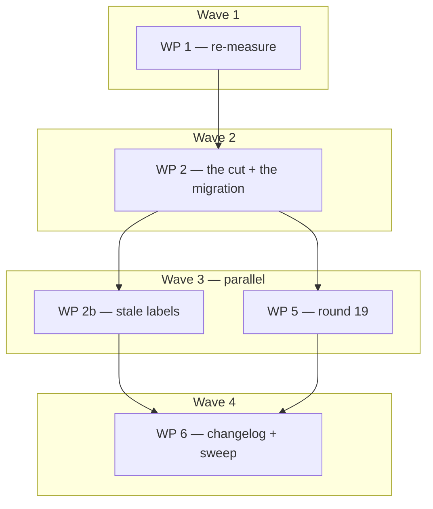

# Plan: adr_0014 instruction diet — split `protocol.md` by consumer set

## Status

- State:   executing
- Tier:    medium
- Effective-tier: derived
- Updated: 2026-09-06
- Reviewed: 3e03c21   <!-- last code commit; f18da5b is this Status write -->
- Next:    /hex-execute .agents/plans/plan_adr_0014_instruction_diet.md "WP 7 — C-975 remedy"

---

## Overview

**Status:** Approved
**Author:** /hex-plan (medium)
**Date:** 2026-09-06
**Issue/Ticket:** N/A
**Related PRD:** N/A
**Related ADR:** `.agents/adrs/adr_0014_instruction_diet.md` (Proposed)
**Related Spec:** N/A

## Objective

Cut `hex/hex-core/references/protocol.md` (**149,072 bytes, 18 `##`
sections** as re-measured at WP 1; the ADR's 123,031 / 19 is the
pre-`adr_0013` baseline) into a spine plus six per-topic sibling files, rewrite every
inbound anchor link, re-home the two worker personas that read a small
rule out of the large file, and record the constitutional amendment as
`hex/DESIGN.md` round 19. No rule's text changes and no rule gains a
second home.

## Scope

### In Scope

- The seven-file split defined in `adr_0014` § The split (C-970), cut at
  `##` boundaries only.
- The load map and the what-moved-where pointer table in the spine.
- The anchor-link rewrite across `hex/` (313 links, 38 files) and the
  prose `§`-citation corrections in shipped `hex/` files.
- Re-homing `references/workers/builder.md` and
  `references/workers/reviewer.md`.
- `hex/DESIGN.md` round 19; `hex/CHANGELOG.md`; the `grim build` sweep.

### Out of Scope

- **`/hex-execute`'s own instruction diet.** `hex-execute/SKILL.md`
  (38,543 bytes) and its three tier files are a separate ADR — see
  `adr_0014` § Quantified Impact, which records execute at 90% and names
  why splitting `protocol.md` cannot fix it.
- **Editing past ADRs or plans.** `adr_0010`, `adr_0012` and `adr_0013`
  cite by heading and quote; C-970 preserves every heading, so they stay
  correct. Their line-number pins were already drifted before this plan
  and are not repaired here.
- **`.claude/skills/`.** A `grim`-installed mirror, regenerated on
  install, never hand-edited.
- Any change to what a rule says. This is a relocation.

## Research

Complete and recorded in `adr_0014` — three measurement passes over the
current tree covering per-mode load bytes, the per-`##` section
inventory, the inbound-link graph, and the ADR citation forms. No
further research phase runs. **Every byte figure in that ADR is a
baseline for the decision, not an acceptance criterion**; WP 1
re-measures against the merged tree before any cut.

## Technical Approach

### Architecture Changes

```
hex/hex-core/references/
  protocol.md    50,330  spine + load map + what-moved-where pointer
  loop.md        22,682  Review-Fix Loop (+4 ###), Convergence contract
  decompose.md   32,146  Parallel-by-default decomposition (+ effective tier)
  worktree.md    20,315  Worktree work-package mechanics
  verify.md      14,603  Verification (+ Scoped check, Checkpoints)
  adversary.md   10,396  Adversary contract
  severity.md     2,202  Finding severity
                -------
                152,674  = 149,072 (today's protocol.md, byte for byte)
                          + 3,602 authored: the spine's pointer table,
                          load map and their prose, and each sibling's
                          title plus its back-pointer to the spine
```

**Measured section inventory (WP 1, against `7cdce1b`).** Per-`##` bytes,
in file order; the file column is the C-970 destination.

| `##` section | Bytes | Destination |
|---|---:|---|
| *(preamble)* | 224 | `protocol.md` |
| Shared shape | 411 | `protocol.md` |
| Tier grammar | 1,413 | `protocol.md` |
| Overlay grammar | 413 | `protocol.md` |
| The meta-plan approval gate | 8,922 | `protocol.md` |
| Spawn-selection precedence | 2,081 | `protocol.md` |
| The Review-Fix Loop *(+4 `###`)* | 19,864 | `loop.md` |
| Worker coordination *(+ `### Worker liveness`)* | 25,961 | `protocol.md` |
| Parallel-by-default decomposition *(+ `### The effective tier`)* | 31,889 | `decompose.md` |
| Traceability IDs | 1,290 | `protocol.md` |
| Finding severity | 2,094 | `severity.md` |
| Untrusted-text echoes | 644 | `protocol.md` |
| Worktree work-package mechanics | 20,088 | `worktree.md` |
| Verification *(+ `### Scoped check`, `### Checkpoints`)* | 14,352 | `verify.md` |
| Constitution gate | 1,306 | `protocol.md` |
| Adversary contract | 10,253 | `adversary.md` |
| Convergence contract | 2,492 | `loop.md` |
| Handoff contract | 1,346 | `protocol.md` |
| Upkeep step | 4,029 | `protocol.md` |

**Anchor map (WP 1).** 26 live heading slugs, 347 inbound
`](…protocol.md#…)` links across 42 files in `hex/`. 14 slugs move
(180 links); 12 stay in the spine (167 links).

| Destination | Slugs |
|---|---|
| `loop.md` | `the-review-fix-loop`, `the-last-reviewed-anchor`, `anchor-validation`, `delta-round-scope`, `the-diminishing-returns-stop`, `convergence-contract` |
| `decompose.md` | `parallel-by-default-decomposition`, `the-effective-tier` |
| `worktree.md` | `worktree-work-package-mechanics` |
| `verify.md` | `verification`, `scoped-check`, `checkpoints` |
| `adversary.md` | `adversary-contract` |
| `severity.md` | `finding-severity` |
| `protocol.md` *(unchanged)* | `shared-shape`, `tier-grammar`, `overlay-grammar`, `the-meta-plan-approval-gate`, `spawn-selection-precedence`, `worker-coordination`, `worker-liveness`, `traceability-ids`, `untrusted-text-echoes`, `constitution-gate`, `handoff-contract`, `upkeep-step` |

### Key Decisions

- **Cut at `##` boundaries only.** No `##` section is split internally
  and no heading text changes. This is what keeps every heading citation
  in the three prior ADRs valid without editing them.
- **All new files are siblings of `protocol.md`.** Every relative link
  prefix already resolves, so the migration is a basename substitution
  per anchor — not a path rewrite.
- **One commit per topic file, each carrying its own link rewrite.** No
  commit may leave the tree with a broken link.

## Constitution Deviations

| Rule | Deviation | Justification |
|---|---|---|
| Single-source contracts — canonical text lands once **in `protocol.md`** (`hex/DESIGN.md` § Per-WP effective-tier round, round 17) | The destination generalises to "in `hex-core/references/`, in the topic file whose consumer set it serves" | The rule's substance — one home per contract, consumers link and never restate — is unchanged and unweakened. Only the sentence's hardcoded file name becomes a property. Recorded as round 19's single amendment (C-973). |

Thin dispatchers + per-tier phase files, capability classes never
literal model names, and the two-layer knowledge model are **not
deviated from** — every moved section is Layer-0 reference text, no
dispatcher changes, and no model name appears in any moved or authored
line.

## Component Contracts

- **C-970 — the split.** `protocol.md` is cut at `##` boundaries only.
  Every moved section keeps its heading text and heading level verbatim,
  so every anchor slug is unchanged. No `##` section is split
  internally. *Testable:* concatenating the seven files reproduces the
  pre-cut content with nothing added or removed except the spine's load
  map and pointer table; every `##`/`###` heading present before the cut
  is present after it, byte-identical.
- **C-971 — the load map.** The spine carries one table naming, per mode
  and per worker persona, the topic files it opens. It is a budget rule,
  not a permission: a mode opens a topic file when a phase it is running
  executes against that contract, never because prose mentions it.
  *Testable:* the table exists in `protocol.md`, names all seven files,
  and covers all five orchestrators plus `builder`, `reviewer` and
  `coordinator`.
- **C-972 — anchor migration.** For each live anchor,
  `<prefix>protocol.md#<slug>` becomes `<prefix><newfile>#<slug>`, with
  `<prefix>` and `<slug>` preserved verbatim and `<newfile>` taken only
  from the C-970 table. *Testable:* zero occurrences of
  `protocol.md#<moved-anchor>` remain anywhere in `hex/`, and every
  `<file>.md#<slug>` link in `hex/` resolves to a heading in that file.
  Baseline is clean — there are zero dead anchors today.
- **C-973 — round 19.** `hex/DESIGN.md` gains one round recording: the
  single amendment to the single-source rule's destination; the new
  binding "Load only what runs" rule for orchestrators, quoted from
  `workers.md`; the old→new section mapping table; and the "Considered
  and not deviated" paragraph naming thin dispatchers, capability
  classes, the two-layer knowledge model, and `config.md` gaining no
  key. *Testable:* the round heading follows the shipped convention
  `## <title> (YYYY-MM-DD, round 19)`, and the mapping table has one row
  per moved `##` section.
- **C-974 — rollout order.** Execution starts only after
  `hex/adr-0013-integration` has merged, and round 19 is appended only
  after round 18 exists in `hex/DESIGN.md`. *Testable:* `git
  merge-base --is-ancestor` proves the integration branch landed;
  `grep '(.*round 18)' hex/DESIGN.md` matches before WP 5 writes.
- **C-975 — the budget.** Post-cut protocol-family bytes are ≤50% of the
  **re-measured** pre-cut total (149,072 — the ADR's 123,031 is the
  pre-`adr_0013` baseline) for `/hex-plan`, `/hex-review`,
  `/hex-architect` and `/hex-finalize`, and ≤15% for every worker
  persona. `/hex-execute` is an explicit non-goal and carries no target.
  *Testable:* derive each closure from the mode's **own files**, then
  measure it. Walk that mode's `SKILL.md`, `classify.md`, `overlays.md`
  and tier files for the imperatives that make a contract *run* — "Run
  the [Review-Fix Loop]", "re-run the file-set intersection check", "the
  single source, never restated here" — and take the union of the topic
  files those imperatives reach. The load map is checked **against** that
  walk and is a consequence of it, never its premise: a map that
  under-reports what a mode opens is precisely what this test exists to
  catch, and re-measuring *per the map* cannot catch it.

  **WP 1 projection, and the misses.** The WP 1 *projection*, computed
  before any mode's files were walked, read `/hex-architect` 32.2%,
  `/hex-finalize` 41.9%, `/hex-review` 48.6%, `builder` 9.6%, `reviewer`
  1.4% and **`/hex-plan` 53.6%**. The walked closures are larger (Final
  measurement, below): **`/hex-review` at 72.0%**, **`/hex-plan` at
  70.5%** and the **`coordinator` persona at 70.5%** against the ≤15%
  worker target. Cause, larger half first: `/hex-plan` **runs the
  Review-Fix Loop as a numbered phase at every tier**, so it opens
  `loop.md` (22,682 B) — the projection and the first load map both
  missed this; `/hex-review` opens `loop.md` too, and `decompose.md`
  besides, because its Approve cannot write the terminal review state
  without deriving the **stranded set**, whose sole definition lives
  there; and `adr_0013` landed `### Worker liveness` inside the spine's
  `## Worker coordination` **after** the target was set — **16,139 B**,
  measured from the `### Worker liveness` heading line through the byte
  before the next `##` heading, not the ~21 KB first recorded here.
  Removing liveness alone leaves `/hex-plan` at 89,019 B = **59.7%** and
  `/hex-review` at 91,221 B = **61.2%, still misses**. The split that
  would remove it promotes `### Worker liveness` to its own topic file,
  which **C-970 forbids** ("no `##` section is split internally") — the
  same trade the ADR already resolved for `/hex-execute` in favour of
  stating the miss. Held as a deferral, not silently re-scoped. The cap
  that WP 2 worked to — **authored spine additions ≤ 2,000 bytes**, set
  to keep `/hex-review` inside 50% — no longer buys that target and is
  itself breached: WP 2 authored 1,256 B, the two review fix passes added
  504 B and 402 B, **2,162 B in all, 162 B over**, and `/hex-review`
  measures 72.0% either way. Recorded, not re-engineered; trimming the
  map back under the cap would mean under-reporting again.
- **C-976 — worker re-homing.** `references/workers/builder.md` points
  at `verify.md#scoped-check`; `references/workers/reviewer.md` points at
  `severity.md#finding-severity` and `loop.md#the-review-fix-loop`.
  *Testable:* no persona file under `references/workers/` links
  `protocol.md` for a contract that moved.

## User-Experience Scenarios

- **S-001 — a reviewer worker spawns.** *Action:* an orchestrator
  dispatches the `reviewer` persona. *Expected:* the spawn prompt sends
  it to `severity.md`, 2,094 bytes, not to a 123 KB file. *Error case:*
  the persona still names `protocol.md#finding-severity` — caught by
  C-972's acceptance grep, which finds the stale anchor.
- **S-002 — an orchestrator resolves a contract mid-run.** *Action:*
  `/hex-review` needs the convergence rule. *Expected:* it follows
  `loop.md#convergence-contract` and opens 21,784 bytes. *Error case:*
  the link still names `protocol.md` and resolves to a file where the
  heading no longer exists — caught by C-972's second check, which
  requires every `#anchor` to resolve in the file it names.
- **S-003 — a maintainer reads an old ADR.** *Action:* someone follows
  `adr_0010`'s "`protocol.md` § Worktree work-package mechanics".
  *Expected:* the spine's what-moved-where pointer, and round 19's
  mapping table, resolve the heading to `worktree.md`. *Error case:* no
  pointer table — the citation dead-ends. Prevented by C-971 and C-973.
- **S-004 — a later ADR adds to a contract.** *Action:* a future round
  extends the Review-Fix Loop. *Expected:* it grows `loop.md` only, and
  `/hex-plan`, `/hex-architect` and `/hex-finalize` are unaffected.
  *Error case:* the author lands the text in the spine out of habit —
  caught at review against C-973's amended destination rule.

## Parallelization

| WP | Scope | Expected Files | Size | Wave | Depends on | Review | Verify | Status |
|----|-------|----------------|------|------|------------|--------|--------|--------|
| WP 1 | Covers C-974, C-975 (baseline) | `.agents/plans/plan_adr_0014_instruction_diet.md` | S | 1 | — | self | scoped | merged |
| WP 2 | Covers C-970, C-971, C-972 (anchors), C-976 — the cut, the load map, and the whole-`hex/` anchor migration in one merge | `hex/hex-core/references/{protocol,loop,decompose,worktree,verify,adversary,severity}.md` + every `hex/` file carrying a moved anchor (35 files, incl. `hex/DESIGN.md`, `hex/CHANGELOG.md`, `hex/hex-core/references/workers/{builder,reviewer}.md` — link targets only) | L | 2 | WP 1 | panel | full | merged |
| WP 3 | **Folded into WP 2** — a cut without its link rewrite leaves a broken tree, which the ADR's own commit-granularity resolution forbids | — | — | 2 | WP 1 | — | — | folded |
| WP 4 | **Folded into WP 2** — C-976's whole deliverable is the same link rewrite, on two of the 35 files | — | — | 2 | WP 1 | — | — | folded |
| WP 2b | Covers C-972 clause 2 (prose `§`-citations) — the 87 stale link **labels** and 19 prose citations WP 2 left naming `protocol.md` for a section that moved; live instruction files only | `hex/hex-*/**`, `hex/hex-core/references/**`, `hex/README.md`, `hex/hex-init/assets/templates/plan.md` | M | 3 | WP 2 | light | full | merged |
| WP 5 | Covers C-973 — appends round 19 only; its file's *links* were migrated by WP 2 | `hex/DESIGN.md` | M | 3 | WP 2 | panel | scoped | merged |
| WP 6 | Covers C-975 (acceptance) — the 0.4.0 entry, the version bump, the byte re-measurement, the whole-bundle sweep | `hex/CHANGELOG.md`, `hex/publish.toml` | S | 4 | WP 2b, WP 5 | self | full | merged |
| WP 7 | **Convergence gap, /hex-review round 2 — C-975 `partial`.** The ≤50% target is missed by `/hex-plan` (70.5%) and `/hex-review` (72.0%), and the ≤15% worker target by `coordinator` (70.5%); the ≤2,000 B authored-spine sub-cap is breached at 2,162 B. No remedy exists inside C-970 ("cut at `##` boundaries only"): closing it means promoting `### Worker liveness` (16,139 B) to its own topic file and re-homing `coordinator`'s cited contracts. **Blocked on a C-970 amendment** — an ADR-level scope decision, not a work package this plan can run. Owner decides: fund the follow-on ADR, or accept the misses and close the plan with C-975 recorded partial | `hex/hex-core/references/{protocol,loop,decompose}.md`, `hex/hex-core/references/workers/coordinator.md`, `hex/DESIGN.md` | M | 5 | WP 6 | panel | full | blocked |



**Critical path:** WP 1 → WP 2 → WP 5 → WP 6. WP 2b runs in parallel
with WP 5 — file-disjoint, because WP 5 owns `hex/DESIGN.md` and WP 2b
is scoped to exclude it.

**Shippable after wave:** 2 — the split, the rewritten links and the
re-homed personas all land in one merge; the bundle is coherent and
every link resolves. Wave 3 adds the constitutional record, wave 4 the
release record.

**Merge order:** WP 1, WP 2, WP 2b, WP 5, WP 6 — serialized
topological order, with the scoped check after each merge onto the
feature branch and full verification on the documented triggers.

**Parallelization justification:** every wave is a single WP, and none
of it is a missed parallelization opportunity. Wave 2 writes all seven
reference files at once — splitting it per topic file would leave
`protocol.md` half-cut between merges, and every WP would name it in
`Expected Files`. The old WP 3 (link rewrite) and WP 4 (personas) were
**folded into WP 2 at WP 1** for a correctness reason, not a scheduling
one: the ADR resolves commit granularity as *"one commit per topic file,
each carrying its own link rewrite … a half-migrated tree has broken
links, so no commit may leave one"*, and WP 2-then-WP 3 is exactly a
half-migrated tree at WP 2's merge gate — 180 dead links across 35
files. WP 4's entire deliverable (C-976) is that same rewrite applied to
two of those 35 files. Waves 1, 3 and 4 are single WPs by dependency.

**Verify justification:**
- WP 2 `full` — the cut rewrites the file every orchestrator reads and
  touches every skill directory in the bundle; a byte-level
  reconstruction error is invisible to a scoped check, and `grim build`
  must pass for all eight skill dirs.
- WP 6 `full` — the release gate; the whole-bundle sweep
  (`task publish -- --dry-run` and `task nox:verify`) is the point of
  the WP.

## Implementation Steps

### Phase 1: Stubs

Create the six topic files as empty files carrying only their `##`
headings, with `protocol.md` still intact. This is the public surface:
seven files, twenty-four anchors, one load map.

### Phase 2: Architecture Review

Confirm against `adr_0014` § The split that each heading landed in the
file the table names, that no heading text or level changed, and that
the spine retains exactly the eleven sections listed. Confirm round 18
exists in `hex/DESIGN.md` before WP 5 begins (C-974).

### Phase 3: Specification Tests

Two runnable checks, both greps, both part of every WP's verification
from WP 2 onward:

1. **Reconstruction** — the seven files' section content concatenates to
   the pre-cut `protocol.md` content, modulo the spine's two new tables.
2. **Link resolution** — no `protocol.md#<moved-anchor>` remains in
   `hex/`, and every `<file>.md#<slug>` link in `hex/` resolves to a
   heading in that file.

Both must fail before the cut and pass after it.

### Phase 4: Implementation

WP 2 moves the text. WP 3 rewrites the links, one `sed -E` per anchor
driven off the C-970 table, then corrects the shipped prose `§`
citations that name the file. WP 4 re-points the two personas. WP 5
writes round 19.

### Phase 5: Review & Documentation

Per-WP review budgets as tabled. WP 6 writes the `CHANGELOG.md` entry
and runs the whole-bundle sweep.

## Dependencies

### Code Dependencies

- `hex/adr-0013-integration` must be merged before WP 1 starts (C-974).
  That branch adds liveness and resources sections to `protocol.md`;
  they are assigned to a file by the same `##`-boundary rule at WP 1.

### Service Dependencies

- `grim` CLI for `grim build` per changed skill directory.
- `task` for `task publish -- --dry-run` and `task nox:verify`.

## Rollback Plan

Every WP is a separate commit and the change is pure relocation, so
`git revert` of the WP range restores the single file with no state to
unwind. Partial rollback is not safe: reverting WP 2 without WP 3 leaves
links pointing at files that no longer exist, which is why no commit may
leave a broken link (Key Decisions).

## Risks

- **A link is missed and silently resolves to a heading that moved.**
  Mitigated by the Phase 3 link-resolution check, which requires every
  `#anchor` to resolve in the file it names — not merely that the file
  exists. Baseline is clean: zero dead anchors today.
- **`adr_0013`'s new sections shift the inventory between the ADR's
  measurement and the cut.** Mitigated by WP 1, which re-measures and
  rewrites the split table in this plan before WP 2 reads it.
- **Round 19 is written before round 18 lands, colliding on numbering.**
  Mitigated by the C-974 precondition checked in Phase 2.
- **A reviewer reads the amendment as weakening the single-source rule.**
  Mitigated by round 19 stating the amendment as a destination
  generalisation with the substance explicitly unchanged, and by the
  Constitution Deviations row above.

## Open Questions

Both resolved at WP 1 as recommended (orchestrator decision, no
mid-flow question):

- **`hex/CHANGELOG.md` prose `§` citations are not corrected** — a
  changelog is a historical record like an ADR; correcting it rewrites
  what was true at the release it names. WP 3's rewrite therefore
  excludes `hex/CHANGELOG.md`; WP 6's new entry is authored against the
  post-cut file names. Note this makes the anchor gate's
  `](…protocol.md#…)` links inside `hex/CHANGELOG.md` **expected
  survivors** — they are historical and are exempt from C-972's zero-
  occurrence check, but they must still resolve, so any moved anchor
  cited there is rewritten to its new file (a dead link is not a
  historical record).
- **The bundle takes a minor bump: `0.3.0` → `0.4.0`** — consumers'
  forked workflow files may link `protocol.md#anchor` and those links
  break, which is consumer-visible.

## Checklist

### Before Starting

- [x] `adr_0013` landed (C-974) — no branch named
      `hex/adr-0013-integration` exists; the evidence is `7cdce1b`
      *chore(adr-0013): review approved — State done* on this branch and
      round 18 present in `hex/DESIGN.md`
- [x] `adr_0014` reviewed; its three open questions accepted as
      recommended (`verify.md` as tabled; execute's 90% does not block;
      one commit per topic file)
- [x] WP 1 re-measurement done and this plan's split table updated

### Before PR

- [x] Reconstruction check passes — byte-identical after link normalisation
- [x] Link-resolution check passes across `hex/` — 0 dead anchors
- [x] `grim build` exits 0 for all eight skill directories
- [x] No literal model name in any moved or authored line

### Before Merge

- [~] Per-mode byte re-measurement meets C-975 **except `/hex-review`
      (72.0%), `/hex-plan` (70.5%) and the `coordinator` persona (70.5%,
      worker target ≤15%)**; see C-975 › *WP 1 projection, and the
      misses*
- [x] Round 19 present, numbered after round 18, with the mapping table
- [x] `task publish -- --dry-run` and `task nox:verify` both green

## Notes

**Execution waits for `hex/adr-0013-integration` to merge.** That branch
lands liveness and resources sections into `protocol.md`. Every
inventory in this plan and in `adr_0014` — the 19-section split table,
the 123,031-byte total, the per-section byte figures, the 313-link and
24-anchor counts, and the per-mode budget table — is a **pre-merge
baseline recorded for the decision, not an acceptance criterion**. WP 1
re-measures all of it against the merged `protocol.md` at Stub time,
assigns any new `##` section to a file by the same `##`-boundary rule,
and rewrites this plan's Parallelization table before WP 2 reads it. A
figure in this plan that disagrees with the merged tree is stale by
design, not a defect.

`hex/DESIGN.md` round 18 belongs to `adr_0013` and is in flight. Round
19 is this plan's and is appended only once 18 exists.

**WP 1 — re-measurement against `7cdce1b` (2026-09-06).** Run in the
orchestrator's pre-gate window rather than in a worktree: the WP writes
only this plan file, so a worktree and a merge would add a branch for a
zero-code diff.

- `protocol.md` is **149,072 B / 18 `##` sections**, not the ADR's
  123,031 / 19. **No new `##` section exists to assign** — `adr_0013`'s
  liveness contract landed as `### Worker liveness` *inside*
  `## Worker coordination` (which grew ~5.1 KB → 25,961 B), and its
  resources contract landed as a **separate sibling file**,
  `hex-core/references/resources.md` (32.4 KB), which this plan does not
  touch. The C-970 destination table therefore stands unchanged; only
  its byte column is restated (Technical Approach › Architecture
  Changes).
- Link inventory is **347 links / 26 slugs / 42 files** in `hex/`, not
  313 / 24 / 38. The anchor map above is the authoritative rewrite
  driver for WP 3.
- **C-974 satisfied by evidence, not by branch name.** No branch
  `hex/adr-0013-integration` exists in this repo; `adr_0013` landed on
  this feature branch (`7cdce1b`) and round 18 is present in
  `hex/DESIGN.md` at line 1794. Both clauses of C-974 hold.
- **The `Repo` column is deleted.** Every cell was `.`, and the shipped
  plan template states that a column's *presence* is the federation
  signal and instructs deleting it on a single-repo plan. `hex.md`
  carries no `Federation:` bullets, so leaving it would have tripped
  C-323's federation refusal on a plan with no satellite.
- **Baselines recorded before the cut:** `task publish -- --dry-run`
  exit 0; anchor sweep over `hex/` **0 dead anchors** (clean baseline, as
  the ADR asserts). The sweep is `.tmp/anchor_gate.py` — an
  orchestrator-local checker, not a shipped artifact; it resolves every
  `](<file>.md#<slug>)` in `hex/` against the headings of the file it
  names, using GitHub's slug rule (whitespace is *not* collapsed, so
  `— ` yields a double dash).
- **C-975 misses.** The WP 1 **projection** put `/hex-plan` at 53.6%; the
  walked closure measures 70.5% (Final measurement, below), and the
  `coordinator` persona misses the ≤15% worker target at 70.5% — a second
  miss the projection never measured, because the projection read the
  load map instead of the persona file. `/hex-review` is the largest miss
  at 72.0%, for the same reason: it opens `decompose.md` for the stranded
  set and `loop.md` for the ceiling-floor precondition. Cause, rejected
  remedy and the ≤2,000 B authored-spine cap are recorded under C-975
  above. Deferred to `/hex-review`.
- **Deferred remedy — a follow-up ADR's, not this plan's.** Promoting
  `### Worker liveness` (16,139 B) out of `## Worker coordination` into
  its own topic file would cut 16,139 B from **every** mode at once, and
  re-homing the contracts `workers/coordinator.md` cites — the
  leaf-verification carve-out and the file-set intersection check — would
  bring that persona under the ≤15% worker target. Both need C-970
  ("`protocol.md` is cut at `##` boundaries only") amended, and C-970 is
  **this plan's own scoping line**, not an external invariant: it is
  amendable by the ADR that supersedes it, and amending it here would
  invalidate the reconstruction check every WP has already passed against.
- **WP 3 and WP 4 folded into WP 2.** Recorded in Parallelization ›
  justification. Net effect on the contracts: none — C-972 and C-976 are
  delivered, and *verified*, at WP 2's merge gate instead of two merges
  later. Net effect on the schedule: the plan is now fully serial,
  4 merges instead of 6.
- **Intra-file anchors are part of the migration.** `protocol.md` carries
  **92 bare `](#slug)` links** among its own sections. After the cut a
  bare anchor is only correct when source section and target section land
  in the *same* file; every other one needs a basename. This is not in
  the ADR's 313-link count and is the single largest correctness risk in
  WP 2, so the reconstruction check normalises every protocol-family
  `](<file>.md#slug)` **and** `](#slug)` to a common form on both sides
  before comparing.
- **WP 2b added at WP 2's merge.** WP 2 migrated every link *target* and
  left every link *label* — 97 of them read ``[`protocol.md` § Verification](verify.md#verification)``:
  correct target, wrong file name in the visible text — plus 41 prose
  `§` citations naming `protocol.md` for a moved section. Not dead
  links, so no gate caught them; reader- and agent-facing wrongness
  across 28 files. WP 2 was right to leave them: editing a label inside a
  moved block would have broken its own C-970 reconstruction check,
  which normalises link *targets* only.
- **Which citations get corrected, and which do not.** Corrected: live
  instruction files — the skill directories, `hex-core/references/**`,
  `hex/README.md`, and the shipped plan template. A wrong file name there
  misroutes a running agent. **Not corrected:** `hex/CHANGELOG.md` (9
  labels, 9 prose) and `hex/DESIGN.md`'s existing rounds (1 label, 13
  prose) — both are historical records of what was true at a release or
  a round, and the ADR names round 19's old→new mapping table as exactly
  their compatibility record. Their link *targets* were already migrated
  by WP 2, so nothing dead-ends.

## Schedule log

- WP 1 — merged `7e96537` (2 commits, no worktree: plan file only).
- WP 2 — merged `734f000` (6 commits on `hex/adr-0014--wp2-migration`;
  worktree + branch removed). protocol.md 149,072 → 49,424 B; six topic
  files; 347 inbound + 92 intra-file anchors migrated across 35 files;
  reconstruction byte-identical; anchor gate 0; `grim build` 0 ×8;
  `task publish -- --dry-run` 0; `task nox:verify` 0.
- WP 2b — merged `0f9a17c` (1 commit). 87 stale link labels + 16 prose
  `§` citations across 27 live instruction files; `hex/CHANGELOG.md` and
  `hex/DESIGN.md` deliberately untouched.
- WP 5 — merged `7d9532f` (1 commit). `hex/DESIGN.md` round 19
  *Instruction-diet round*, 8,934 B appended, 152 lines.
- WP 6 — merged `3e03c21` (1 commit). `hex/CHANGELOG.md` 0.4.0 and the
  `hex/publish.toml` minor bump; `nox/publish.toml` left at its
  documented static placeholder, matching the 0.3.0 precedent.

**Final measurement (C-975, against the corrected load map).** Pre-cut
every row was 149,072 B. Each closure is the union walked from that
consumer's own files, not read off the map.

| Consumer | Opens beyond the spine | After | % of before | Verdict |
|---|---|---:|---:|---|
| `/hex-architect` | `loop.md` | 73,012 | 49.0% | pass |
| `/hex-finalize` | `verify.md` | 64,933 | 43.6% | pass |
| `/hex-review` | `decompose.md`, `loop.md`, `severity.md` | 107,360 | 72.0% | **miss** |
| `/hex-plan` | `decompose.md`, `loop.md` | 105,158 | 70.5% | **miss** |
| `/hex-execute` | `decompose.md`, `worktree.md`, `loop.md`, `verify.md` | 140,076 | 94.0% | non-goal |
| `builder` worker | `verify.md` only | 14,603 | 9.8% | pass |
| `reviewer` worker | `severity.md` only | 2,202 | 1.5% | pass |
| `coordinator` worker | the spine, `loop.md`, `decompose.md` | 105,158 | 70.5% | **miss** |
| any mode, `adversary=on` | `+ adversary.md` | +10,396 | — | — |
| `/hex-review`, federated target | `+ worktree.md` | 127,675 | 85.6% | — |

**Gates at handoff:** anchor sweep over `hex/` 0 dead anchors; stale
moved-anchor grep empty; stale citations outside the two frozen
historical files 0; `grim build` exit 0 ×8; `task publish -- --dry-run`
exit 0 (artifacts tag 0.4.0); `task nox:verify` exit 0.
