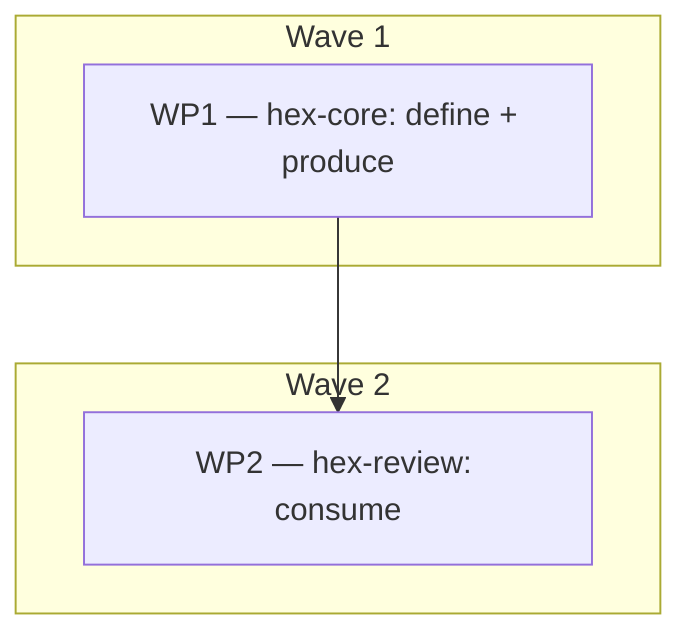

# Plan: Implement adr_0006 — finding-severity contract

## Status

- State:   done
- Tier:    medium
- Updated: 2026-07-21
- Next:    (none — landed on main as merge 24937c7; branch-review Approve after one High fix)

## Overview

Implement [adr_0006](../adrs/adr_0006_finding_severity_contract.md)
(**Accepted** 2026-07-20): a `[Block | High | Warn | Suggest]` severity tag
on the `reviewer.md` worker finding line, single-sourced as a new
`protocol.md § Finding severity` section. No table, no synthetic ID. Six
markdown files across two skills; the ADR's Normative specification contains
the exact text — this plan sequences and verifies it, it does not re-design.

## Objective

After execution: the severity vocabulary hex branches verdicts on is defined
exactly once and linked everywhere it is used; reviewer workers emit tagged
findings at medium/high; the handoff carries tagged lines instead of counts;
and two latent bugs are fixed (`High` gains its missing Needs Work verdict
home; the phantom `suggest` *disposition* is retired from the tier files).

## Scope

### In Scope

- `hex/hex-core/references/protocol.md` — new `## Finding severity` section
  (C-501–C-506), inserted between § Traceability IDs and § Worktree
  work-package mechanics (verified boundary: `:372→:373`).
- `hex/hex-core/references/workers/reviewer.md` — severity bullet, tagged
  return lines, self-check word (C-507; verified `:45-47`, `:52-53`, `:58`).
- `hex/hex-review/SKILL.md` — tagged-lines handoff, `#finding-severity`
  link, `High` folded into Needs Work, synthesis self-check (C-508, C-511;
  verified `:265`, `:271`, `:326-328`).
- `hex/hex-review/tier-medium.md` + `tier-high.md` — retire the phantom
  `suggest` disposition, fold `High` into Needs Work (C-509; verified
  `:77`/`:164` and `:91-92`/`:173`).
- `hex/hex-review/overlays.md:60` — `#finding-severity` link (C-510).

### Out of Scope

- `hex/hex-review/tier-low.md` and
  `hex/hex-core/references/workers/doc-reviewer.md` — **unchanged by
  contract** (C-503, C-505). A diff touching either is a defect.
- The `.claude/skills/` install sync (`grim install`) — Michael's step,
  post-merge (the W3 caveat: undocumented sync).
- adr_0003/0004/0005 interactions — all still Proposed; adr_0006 § Constitution
  deviations records why acceptance order is safe.

## Research

None run this plan (`research=skip`, announced at the gate): the design came
from a 3-candidate workflow + 3-lens judge + adversarial verify, then a
two-reviewer ADR pass, all 2026-07-20. Prior art is cited in adr_0006
§ Industry Context.

## Technical Approach

### Architecture Changes

None structural — the change adds one section to the shared contract file
and one field to a worker output contract. Single-source discipline:
`protocol.md § Finding severity` is the only definition site; all nine other
touchpoints link `#finding-severity`.

### Key Decisions

All made in adr_0006 (Accepted); binding here:

- Option A — tagged line, no table, no synthetic ID (`file:line` is the key).
- Severity is a medium/high construct, **omitted at tier low** (C-503).
- Max-wins dedup; escalation provenance stays in the Cross-Model section
  (C-504, C-506).
- `doc-reviewer` grades map at synthesis (`Critical→High`, `Medium→Warn`,
  `Accuracy→Block`); `doc-reviewer.md` untouched (C-505).
- Orchestrator synthesis self-check mirrors the worker self-check (C-511).

## Constitution Deviations

None. adr_0006 § Constitution deviations adjudicates the three suspect
surfaces (link-never-copy; sections-are-conventions-not-schema;
client-is-the-runtime) as honoured — the plan introduces nothing beyond the
ADR's mechanism.

## Component Contracts

The coverage join keys are **adr_0006's own contracts C-501…C-511 and
scenarios S-501…S-507** — restating them here would violate single-source;
see [adr_0006 § Component contracts](../adrs/adr_0006_finding_severity_contract.md#component-contracts).
WP Scope cells below cite them directly. Summary of the split:

- **C-501…C-507** — definition + producer (protocol.md section, reviewer.md
  tag). Delivered by WP1.
- **C-508…C-511** — consumers (SKILL.md handoff + verdict floors + synthesis
  self-check, tier files, overlays link). Delivered by WP2.
- **S-501…S-507** — acceptance scenarios, exercised by the Validation sweep
  and the first real `/hex-review` run after merge.

## User-Experience Scenarios

Adopted verbatim from adr_0006 (S-501…S-507): tagged medium review; untagged
low review; max-wins duplicate; doc-reviewer mapping; cross-model
escalation; clean-review empty case; workflow-fork survival. Error cases:
a missing/misspelled tag degrades to an untagged-but-reported finding (never
dropped, never rejected — no schema).

## Parallelization

| WP | Scope | Expected Files | Size | Wave | Depends on | Review | Status |
|---|---|---|---|---|---|---|---|
| WP1 | Define + produce: `## Finding severity` section (C-501–C-506); reviewer.md tag + self-check (C-507) | `hex/hex-core/references/protocol.md`, `hex/hex-core/references/workers/reviewer.md` | S | 1 | — | light | merged |
| WP2 | Consume: SKILL.md handoff/floors/self-check (C-508, C-511); tier files — suggest-retire + High fold + RCA-header links (C-509, C-510); overlays link (C-510) | `hex/hex-review/SKILL.md`, `hex/hex-review/tier-medium.md`, `hex/hex-review/tier-high.md`, `hex/hex-review/overlays.md` | S | 2 | WP1 | light | merged |

- **Critical path:** WP1 → WP2 (the whole graph).
- **Shippable after wave: 1** — after WP1 the vocabulary is defined and
  reviewers emit tags; consumers still read counts. adr_0006's own Wave 1
  ("nothing breaks — an untagged consumer ignores the prefix").
- **Merge plan:** serialized topological order — WP1 onto the feature
  branch, verify, then WP2, verify.
- **Justification (fewer WPs than file-disjointness allows):** WP2's four
  files are mutually disjoint and could be 4 WPs, but each is a 1–3-line
  edit — far below the worktree overhead floor — and all four consume WP1's
  anchor, so they fold into one WP as sequential steps. WP1/WP2 stay
  separate (not folded into one) because they are distinct `grim build`
  units (hex-core / hex-review), the ADR's migration defines them as
  separate waves with a stated intermediate state, and WP2's
  `#finding-severity` links dangle until WP1's section exists.
- **Review budgets:** `light` on both — small markdown edits with the exact
  text pre-written and twice-reviewed in the ADR, and `protocol.md` is not
  hot-path by this bundle's own vocabulary (inert prose, no runtime). The
  branch-level `/hex-review` pass before landing is the panel backstop — the
  plan's own documented next step, not a protocol mandate (that rule binds
  only plans containing a `self`-budget WP, which this plan has none of).

## Implementation Steps

### Phase 1: Stubs (per WP)

- [x] WP1: insert the `## Finding severity` heading + subsection skeleton at
      `protocol.md:372→373` (anchor `#finding-severity` becomes real);
      add the empty `Severity —` bullet slot to reviewer.md's Classify block.
- [x] WP2: no stub — the anchor targets exist after WP1; WP2 edits are
      single-pass (stub+implement collapse; noted per protocol, small-WP
      shape).

### Phase 2: Architecture Review

- [x] Skipped as a separate pass (two-way-door, `light` budget): the
      spec-focus reviewer in each WP's Review-Fix loop checks placement
      against the ADR instead.

### Phase 3: Specification Tests

Markdown has no test suite; the executable specification is the Validation
sweep, written **before** Implement so it fails on the stub state:

- [x] Anchor sweep: every `#finding-severity` reference in the 6 files
      resolves (`/usr/bin/grep` — rtk-shadowed `grep` false-negatives;
      always use the absolute path).
- [x] Single-source sweep: the four severity words as a *ladder* (table +
      floors) appear in exactly one file (`protocol.md`); consumers only
      link.
- [x] Contract checks: `tier-low.md` and `doc-reviewer.md` byte-unchanged
      (`git diff --stat` clean on both); "actionable, deferred, or suggest"
      returns 0 hits post-WP2; "Warn-tier findings remain" returns 0 hits
      (SKILL.md fold); "Warn-tier findings exist" returns 0 hits (tier-file
      fold — both `tier-medium.md:164` and `tier-high.md:173` must read
      "High- or Warn-tier").
- [x] `grim build ./hex/hex-core` and `./hex/hex-review` exit 0.

### Phase 4: Implementation

- [x] WP1: fill the section with adr_0006's Normative-specification text
      verbatim (the fenced block is the source); apply the three reviewer.md
      edits (C-507).
- [x] WP2: apply C-508 (handoff block + `:265` link + `:271` High fold),
      C-511 (synthesis self-check bullet list in § The review report),
      C-509 (both tier files: suggest-retire at `tier-medium.md:77` /
      `tier-high.md:91-92`, High fold at `:164` / `:173`), C-510
      (`overlays.md:60` **and** the two tier RCA phase headers that name
      Block/High scope — `tier-medium.md` Phase 4, `tier-high.md` Phase 4 —
      per the ADR's C-510 text; the Home column names only overlays.md, the
      contract text names both).

### Phase 5: Review & Documentation

- [x] Per-WP `light` review (spec focus): edits match the ADR text, no
      unrequested drift, links resolve.
- [x] Run the full Phase-3 sweep on the final state.
- [x] No separate doc pass — the change *is* documentation.

## Dependencies

### Code Dependencies

None — pure markdown; `grim` (already installed) is the only tool.

### Service Dependencies

None.

## Rollback Plan

`git revert` of the feature-branch merge (or branch deletion pre-merge).
No data, no migrations, no installed-state coupling — the `.claude/skills/`
copies only change when `grim install` is run, which is outside this plan.

## Risks

- **Line drift between plan and execution** — mitigated: all 12 cites
  byte-verified MATCH at plan time (Discover, 2026-07-20); Stub re-anchors
  on headings, not line numbers, if anything shifts.
- **Severity restated instead of linked** (drift seed) — mitigated by the
  single-source sweep in Phase 3.
- **Scope creep into tier-low/doc-reviewer** — mitigated by the
  byte-unchanged contract check.

## Open Questions

None. (The ADR's one open question — calling out the `High → Needs Work`
floor change in the Wave 2 commit message — is accepted as recommended and
folded into WP2's commit message requirement.)

## Checklist

### Before Starting

- [x] adr_0006 Status is Accepted (verified 2026-07-20 — it is).
- [x] Working tree state understood: large uncommitted session diff exists;
      execution works on a feature branch per protocol worktree mechanics.

### Before PR

- [x] Phase-3 sweep green on the merged feature branch.
- [x] WP2 commit message names the `High → Needs Work` behavior change.
- [x] Handoff notes the follow-up: `grim install` sync of
      `.claude/skills/` (Michael's step).

### After `grim install` (live-skill self-test — closes S-501/502/503/505)

Deliberately deferred past this plan's merge: the modified skill is not live
until the installed copies sync, and that sync is Michael's step. Then:

- [ ] One tier-medium `/hex-review`: findings carry `[severity]` tags; a
      duplicate `file:line` resolves max-wins (S-501, S-503, S-505).
- [ ] One tier-low `/hex-review`: no `[severity]` prefix appears (S-502).
