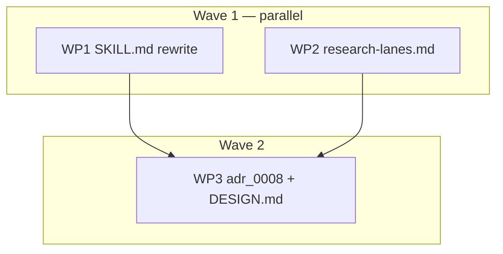

# Plan: hex-discuss interactive rework

## Status

- State:   done      <!-- planning → plan-approved → executing → review → done -->
- Tier:    medium
- Updated: 2026-08-30
- Next:    —
- Finalize: 2026-08-30 — recomposed 10→3 signed commits (tip de95cd1, tree-identical); gate declined → local-only, no remote acts; backup/hex/discuss-ux-rework-54639ac

---

## Overview

**Status:** Approved
**Author:** /hex-plan (tier medium, architect=inline, research=skip, adversary=on)
**Date:** 2026-08-30
**Issue/Ticket:** N/A
**Related ADR:** `.agents/adrs/adr_0008_pre_plan_discussion_mode.md` (amended in place by this plan)
**Input dossier:** `.agents/discussions/hex-discuss-ux.md` (`Ratified: 2026-08-30 → plan`)

## Objective

Rework `hex/hex-discuss` into an interactive, answer-first discussion mode:
automatic entry recon wave, user-only drain, leads-fed multi-select research
lanes replacing the quick-check/deep-sweep two-gear, dependency-batched
design questions, a shipped researcher spawn contract with structured
`negative:`/`leads:` returns, and an opt-in perspective-council lane
(cross-model seats deferred) — with adr_0008 and `hex/DESIGN.md` amended
to match.

## Scope

### In Scope

- `hex/hex-discuss/SKILL.md` body rewrite (10 mapped locations) +
  frontmatter `description` refresh.
- New `hex/hex-discuss/references/research-lanes.md` (spawn contract,
  open-ended lane menu, return schema).
- `adr_0008` in-place amendments (contract text, changelog rows, the 10
  stale sites listed in C-011).
- `hex/DESIGN.md` dated amendment round (two-gear retirement at :598, :611).

### Out of Scope

- Other hex modes' research triggers and gears.
- `hex/hex-discuss/references/reach.md`, `hex-init` templates
  (`discussion.md`, `research.md`), `hex-core` shared contracts — all
  confirmed untouched by Discover.
- Cross-model council seats — a future ADR; the adversary contract's
  scopes stay code-diff/plan-artifact, and no new role or capability
  class ships.
- `hex/hex-state.md` and `.claude/rules/hex-state.md` — the freeze
  predicate (`State: active` + git status) is unchanged by this rework.

## Research

**Research artifacts:** `.agents/research/discuss-ux-sota.md`,
`discuss-ux-community.md`, `discuss-ux-adjacent.md` (vintage 2026-08-30,
expire 2027-02-28) — produced by the source discussion; no new research run
(`research=skip`, announced at the gate). Key groundings: explicit
user-owned termination is the field norm; batched questions beat
one-at-a-time; background results surface at turn boundaries flagged as new;
proactive research must ground, never take over reasoning.

## Technical Approach

### Architecture Changes

```
hex/hex-discuss/
  SKILL.md                    body rewrite, stays ≤400 (C-701 ceiling)
  references/reach.md         untouched
  references/research-lanes.md  NEW — spawn contract + lane menu (2nd split)
.agents/adrs/adr_0008_…md     amended in place (C-70x text, Validation ×2)
hex/DESIGN.md                 new dated round (retire two-gear vocabulary)
```

### Key Decisions

| Decision | Rationale |
|----------|-----------|
| Lane menu + spawn contract live in the new reference file, not SKILL.md | Body is at 397/400; explorer found no inline landing site. References/ split is the pressure-relief valve; SKILL.md keeps one pointer (reach.md precedent). Alternatives weighed: folding into `reach.md` (rejected — unrelated topic, client-reach table); two files (rejected — one concern, one file). |
| Second `references/` split is authorized via an adr_0008 amendment to **C-701** | C-701 (not C-721) holds the "split is spent" clause; a silent second split would violate the ADR. The amendment states the new budget: reach.md + research-lanes.md, further splits need their own amendment. |
| Council lane stays in-plan, reframed as a perspective council | Owner decision, 2026-08-30. The panel's Block applied to *cross-model* council (no permissible route: researcher pinned `fast-balanced` by C-706, new roles barred by C-707, adversary scopes don't fit). Reframed: N same-class researcher seats with assigned perspectives + orchestrator-side synthesis — fits every existing constraint, no ranking step (same-family mutual ranking measures noise; self-preference bias moot by construction). Cross-model seats → future ADR. |
| Entry wave gets no opt-out knob | A flag or Preferences key reintroduces the turn-zero config DESIGN round 9 exists to avoid — considered and declined. |
| Amend existing ADR contract IDs, mint no new ones | Every decision has a home in C-701–C-721; adr_0009 errata-fold is the precedent for in-place amendment. |
| WP3 (ADR + DESIGN) runs after the text WPs | Amendments restate final normative wording (restatement-relation norm); quoting drafts invites drift. |
| Inline drain now "nets zero discussion files", not "zero files" | The entry wave may land research artifacts before an inline drain; they persist in the shared research home and are listed in the terminal report. |

## Component Contracts

<!-- Plan-local join keys. "ADR:" names the adr_0008 contract each amends. -->

- **C-001** `Entry sequence (answer-first)` — the opening turn's substance
  (engagement with intake slot 1) is composed and emitted before the entry
  wave dispatches: the shared-contract reads gate the dispatch, never the
  reply. Ordering contract: substance first, then the mandated one-liners
  as an ordered sequence of independent lines — C-712's no-block rule
  untouched. Home resolution, header-only stub, and the
  `— discussion notes:` disclosure stay at entry (stub arms the hex-state
  freeze). Edge: resumed artifact → header refresh, still answer-first.
  ADR: C-701, C-715.
- **C-002** `Entry recon wave` — automatic at entry, fixed 2 lanes: codebase
  recon + prior-art web scan, prompts seeded from slot-1 text; runs within
  the default 3-concurrent gear leaving 1 slot free; no approval gate;
  grounding/facts only, never position-taking (blindness extended); model
  disclosure line fires per first-spawn rule. Entry paths (review round 1,
  High): with slot-1 text, the wave fires in the opening turn after the
  substance; without it (bare invocation or vague description-match), the
  composite intake ask IS the opening turn's substance and the wave defers
  until slot 1 lands, then fires seeded from it; only an
  already-dispatched wave is non-repeatable — a resume re-fires nothing
  that already ran, but a discussion parked before slot 1 ever landed
  still gets its wave when it does (lanes stay available on demand). Normative home: SKILL.md body
  (WP1) — the reference file carries only preamble, lane catalog, and
  return schema. Spend threshold: automatic spend ≤ the default gear and
  announced; anything above is user-initiated. Edge: degraded harness →
  wave runs inline per § Worker coordination, announced once.
  ADR: C-705(d), C-706, C-712.
- **C-003** `Three spawn classes` — (a) entry recon: automatic; (b) opt-in
  lanes: user-selected via multi-select; (c) disputed-fact spawns:
  skill-initiated, old C-706 rule unchanged. "Never on an opinion" binds
  (a) and (c); (b) may target judgment questions (the council lane) —
  user-opted and spend-confirmed, the exception lexically scoped to
  opt-in lanes in the ADR text. Edge: a lane the repo answers is read,
  not spawned. ADR: C-706.
- **C-004** `Lane multi-select` — replaces the quick-check/deep-sweep
  two-gear entirely (vocabulary removed bundle-wide); offered once
  immediately after entry-wave dispatch, seeded with default lanes;
  re-offered only on user demand or a new `leads:` lane; running spend
  total in chip text; hard cap 12 researchers per expansion, demand above
  truncates and announces once; concurrency per § Worker coordination.
  Edge: skip selected → no re-offer until demand/leads. ADR: C-707.
- **C-005** `Spawn-contract reference` — new
  `references/research-lanes.md`: researcher preamble (neutrality; the
  opt-in-lane opinion exception stated — never restating the
  disputed-fact-only trigger the C-706 amendment scopes; artifact
  header contract per the research template) extending
  `workers/researcher.md` by link, never copy; the lane menu (defaults +
  council; open-ended — new lanes arrive via `leads:` or a later release); the
  return schema: findings+sources, `negative:` (dead ends, contradicting
  evidence — never silently dropped), `leads:` (adjacent lanes, one line
  each). SKILL.md links it once. ADR: C-701 — the "split is spent" clause
  lives there, not in C-721 (untouched); the amendment authorizes this
  second split and states the new budget.
- **C-006** `Turn-boundary fold-in` — a landed result surfaces at the next
  natural turn boundary as a one-line aside, flagged as new, never spliced
  mid-turn; a result changing a live thread feeds the next question;
  `leads:` entries join the offerable lane set. Edge: dead worker →
  transport note once (unchanged); nothing-useful → folded silently
  (unchanged). ADR: C-706, C-712.
- **C-007** `Cadence` — design questions ship in dependency-batched sets of
  ≤3, each option carrying a recommendation; inventory composite ask and
  never-re-ask rules unchanged. Edge: >3 pending → highest-priority 3, rest
  carried. ADR: C-703.
- **C-008** `User-only drain` — the skill never offers to end the
  discussion; one drain-affordance line at entry, never repeated; the
  restate-gate and terminal report are unchanged as the completeness check
  and closing summary; inline drain nets zero *discussion* files — landed
  research artifacts persist and are listed in the terminal report.
  ADR: C-709.
- **C-009** `Council lane (perspective council)` — opt-in lane: one
  judgment question goes to N researcher seats (default 3, bounded by the
  effective concurrency cap) at the pinned `fast-balanced` class, each
  assigned a distinct perspective from the lane's own perspective list in
  `research-lanes.md` (e.g. premortem seat, user-advocate seat,
  operability seat) — seat perspectives are worker-prompt framings, not
  grill techniques, so rule (c)'s two-technique inline cap never engages;
  seats are blind to the user's leaning and to each other. No mutual
  ranking — same-family seats ranking each other measures noise (moots
  self-preference bias, arXiv:2410.21819, by construction); the
  orchestrator synthesizes agreements, divergences, and one
  recommendation into a single aside (mechanically the sweep-dedup
  precedent; evaluatively the same duty the skill already exercises
  answering design questions with recommendations — no new role, no +1
  spawn). Cost: N spawns, stated in chip text.
  Edge: seat dies → transport note; cross-model seats out of scope
  (future ADR). ADR: C-706 exception (lexically scoped to opt-in lanes),
  C-707 intact.
- **C-010** `Announce form deltas` — the entry-wave dispatch folds into
  the existing `— discussion notes:` line (one combined line, not a second
  item); the drain-affordance sentence lives in C-008's prose, not the
  C-712 disclosure list (no mandating contract); two-gear items reworded
  to lane vocabulary; all existing mandated lines kept; still no blocks.
  Opening-turn ceiling: the combined line + model line (+ degraded/limits
  when in force), all after the substance (C-001). ADR: C-712.
- **C-011** `adr_0008 amendments` — owner-attributed changelog rows;
  amended text for ADR C-701 (entry clause + split budget), C-703,
  C-705(d), C-706 (three spawn classes + the opinion exception lexically
  scoped to opt-in lanes), C-707 (retitled "Lane expansion"), C-709,
  C-710 (names C-707's renamed mechanism), C-712, C-715
  (restatement-relation, not byte-quote; C-721 untouched). Complete stale-site list from panel audit:
  `:260` (docket wording "Deep-sweep gear via capability classes"),
  `:410` (S-701), `:420` (S-711), `:433` (NFR "≤12 total in a sweep"),
  `:721-725` (grep-sweep exclusion list gains research-lanes.md),
  `:726-732` (rule-deletion end-to-end bullet), `:757-759` (dogfood
  bullet), `:808-813` (quiet-announce lines), `:834-837` (sweep-cap
  boundary bullet), `:853-858` (open question still presenting the cap as
  unresolved — annotated with its ratified resolution, never rewritten).
  The round-9 fenced block `:454-537` and all changelog
  history stay verbatim — "history is annotated, not rewritten".
- **C-012** `DESIGN.md round` — a full new dated round, not in-place
  surgery: re-argues round 9's deviation-1 premise, which the entry wave
  falsifies (the spawn set is no longer wholly conversation-discovered) —
  replacement argument: a fixed two-lane wave inside the default gear is
  grounding, not turn-zero config, and the spend threshold is stated
  (automatic ≤ default gear, announced; above → user-initiated). Retires
  the two-gear vocabulary (`:598`, `:611` superseded); round 9 gains an
  erratum pointer, its bytes unchanged.
- **C-013** `Frontmatter description` — reflects answer-first + entry wave
  ("researches disputed facts in the background" is stale); trigger
  phrases preserved so description-match entry still fires.
- **C-014** `Body budget` — SKILL.md body (H1 onward) ≤400 lines
  post-rework; funded by the two-gear prose cut (~15–20 lines), the
  one-per-turn clause swap, and the reference-file offload; overflow
  valve: surplus § Research prose moves to `research-lanes.md` (in-WP, no
  third split). `grim build hex/hex-discuss` green.

## User-Experience Scenarios

| ID | Action | Expected outcome | Error cases |
|---|---|---|---|
| S-001 | `/hex-discuss <topic>` | First turn: substantive engagement, then the combined `— discussion notes: <path> · recon: 2 dispatched` line, model line, one drain-affordance sentence | Degraded harness: `Degraded: inline workers` line, recon runs inline |
| S-002 | Researcher returns mid-conversation | One-line aside at next turn boundary; thread-relevant result feeds the next question | Worker never returns → one transport note; empty result → folded, no aside |
| S-003 | Lane multi-select offered once post-dispatch; user picks lanes | Spawns within cap, batched per § Worker coordination, spend in chip text | Demand >12 → truncate to 12, announced once; "skip" → no re-offer until demand/leads |
| S-004 | Researcher returns `leads:` entries | New lanes enter the next offer (on demand), spend total carried | Duplicate lead → first-seen wins, deduped |
| S-005 | Open design choice surfaces | ≤3 dependency-batched chips, each with a recommendation | >3 pending → top 3 by decision-relevance, rest held |
| S-006 | User says "drain"/"wrap up" | Restate-gate → separate explicit yes → drain + terminal report | Soft yes → explicit yes re-asked; restate gap → gap named, back to conversation. No unprompted drain offer, whole run |
| S-007 | User picks the council lane on a judgment question | N perspective seats run; one synthesized contrast aside (agreements, divergences, recommendation) | Seat dies → transport note once; N > cap → batched per § Worker coordination |
| S-008 | Trivial topic drains inline after wave fired | Stub deleted; research artifacts that crossed the paragraph persistence bar persist, listed in terminal report | — |
| S-009 | Entry with no slot-1 text (bare invocation / vague description-match) | Intake ask is the opening substance; wave defers, fires once when slot 1 lands; only an already-dispatched wave is non-repeatable on resume | Never a re-ask of slot 1; never a wave with nothing to seed it; a park-before-slot-1 resume still gets its wave |

## Parallelization

| WP | Scope | Expected Files | Size | Wave | Depends on | Review | Status |
|----|-------|----------------|------|------|------------|--------|--------|
| WP1 | C-001, C-002 (normative home), C-003, C-004, C-006, C-007, C-008, C-010, C-013, C-014; S-001–S-006, S-008 | `hex/hex-discuss/SKILL.md` | M | 1 | — | panel | merged |
| WP4 | Review-round-1 fixes: C-002 entry paths (S-009), C-006 passive leads re-offer, C-005 blindness pointer+delta + spend-text example, checklist coverage | `hex/hex-discuss/SKILL.md`, `hex/hex-discuss/references/research-lanes.md` | S | 3 | WP1, WP2, WP3 | light | merged |
| WP2 | C-002 (lane catalog + schema detail), C-005, C-009; S-003, S-004, S-007 | `hex/hex-discuss/references/research-lanes.md` | M | 1 | — | panel | merged |
| WP3 | C-011, C-012 | `.agents/adrs/adr_0008_pre_plan_discussion_mode.md`, `hex/DESIGN.md` | L | 2 | WP1, WP2 | light | merged |



**Critical path:** WP1/WP2 → WP3 (WP3 waits on both wave-1 WPs; WP1 is the
expected longer leg)

**Shippable after wave:** 2 — wave 1 alone leaves shipped text ahead of its
ADR record (contract drift this repo treats as a review finding).

**Merge order:** WP2, WP1, WP3 — `grim build hex/hex-discuss` after each
merge onto the feature branch; `task publish -- --dry-run` after WP3.

**Parallelization justification:** WP3 stays isolated despite M size —
amendments must restate final merged wording (Key Decisions).

## Implementation Steps

> Contract-first TDD, doc-flavored: stubs are section skeletons + link
> targets; specification is a runnable checklist derived from C-IDs before
> body text is written.

### Phase 1: Stubs

- [ ] **Step 1.1:** WP2 — `research-lanes.md` skeleton: H1, section heads
      (Preamble · Lane menu · Return schema · Council), link lines (paths relative
      to `hex/hex-discuss/references/`):
      `../../hex-core/references/workers/researcher.md`,
      `../../hex-core/references/models.md` researcher row,
      `../../hex-core/references/protocol.md#worker-coordination`,
      `../../hex-init/assets/templates/research.md`.
- [ ] **Step 1.2:** WP1 — SKILL.md: new/renamed section heads (entry wave
      para stub, lane-offer stub replacing deep-sweep para, reference
      pointer line), old text untouched elsewhere.

Gate: `grim build hex/hex-discuss` passes on stubs.

### Phase 2: Architecture Review

Skipped — ≤3 files, design ratified in the input dossier.

### Phase 3: Specification Tests

- [ ] **Step 3.1:** Checklist derived from contracts. Verification
      mechanism per contract: grep checks — C-003/004/005/007/008/012/014;
      scenario walkthrough (Step 3.2) — C-001/002/006/009/010/013;
      amendment-diff review — C-011; dogfood (Step 5.3) — the S-flows.
      Grep gates: zero case-insensitive `deep[- ]sweep`/`quick[- ]check`
      hits in normative text — under `hex/` outside `CHANGELOG.md` and
      outside DESIGN.md rounds carrying C-012's superseded-by-erratum
      marker (round-9 bytes stay verbatim); named pre-existing exemption:
      `hex/hex-review/tier-low.md:7` "a quick check against
      `--base=HEAD~1`" — ordinary English predating this rework, not the
      retired gear vocabulary; in adr_0008 only Component
      contracts / UX scenarios / NFR / Validation sections held to zero —
      the round-9 fenced block (`adr_0008:454-537`) and changelog history
      stay verbatim (C-004, C-011, C-012); body ≤400 H1-onward (C-014); every
      `](path#anchor)` in touched files resolves (manual sweep — grim
      build does not check links); `negative:`/`leads:` present in return
      schema (C-005); one drain-affordance sentence, zero drain-offer
      sentences (C-008); "strictly one per turn" absent, batch ≤3 present
      (C-007); three spawn classes named exactly once (C-003).
- [ ] **Step 3.2:** Scenario walkthrough table S-001–S-009 embedded in the
      checklist for reviewer use (each scenario → the SKILL/reference
      sentence satisfying it).

Gate: checklist exists, fails against stubs.

### Phase 4: Implementation

- [ ] **Step 4.1:** WP2 body — preamble, lane menu (defaults + council,
      open-ended), return schema, council mechanics (C-009);
      extend-by-link discipline.
- [ ] **Step 4.2:** WP1 body — the explorer-mapped change sites, 10
      distinct locations
      (explorer map: cadence :72-75, grill (d) :110-113, research intro
      :117-124, gear :126-137, sweep para :138-146, stop rule :168-175,
      lazy-materialization note :192-199, announce items :326-358,
      constraints, frontmatter description) with the cut-funding plan.
- [ ] **Step 4.3:** WP3 — adr_0008 contract-text amendments + changelog
      rows + 2 § Validation bullets; DESIGN.md dated round.

Gate: checklist passes; builds green.

### Phase 5: Review & Documentation

- [ ] **Step 5.1:** Per-WP review budgets (table); spec focus verifies
      C-/S- coverage against the checklist.
- [ ] **Step 5.2:** Final sweep `task publish -- --dry-run` exit 0.
- [ ] **Step 5.3:** Dogfood docket — one real `/hex-discuss` run per the
      dossier's Verification section (entry wave, fed question, leads
      offer, user-called drain, zero unprompted offers).

## Rollback Plan

1. Feature branch only until review converges — revert = delete branch.
2. Post-land: `git revert -m 1 <merge>` where a merge commit exists, else
   revert the WP commit range; adr_0008/DESIGN amendments revert in the
   same operation (single logical unit).
3. Verify: `grim build hex/hex-discuss` + dry-run sweep green on trunk.

## Risks

| Risk | Mitigation |
|------|------------|
| Body budget overrun (397/400 pre-rework) | Reference-file offload + measured cuts; checklist enforces ≤400 before review |
| Anchor drift in new links | Manual `](path#anchor)` sweep in Phase 3 checklist — grim build won't catch it |
| Amendment/skill wording drift | WP3 sequenced after WP1/WP2 merge; restatement-relation norm applies |
| RTK mangles diff output during execution | Use `rtk proxy git diff …` (known issue) |

## Checklist

### Before Starting

- [x] Input dossier ratified (2026-08-30 → plan)
- [ ] Feature branch `hex/discuss-ux-rework` created from trunk

### Before PR

- [x] Phase 3 checklist green; builds green; body ≤400
- [x] Documentation updated (frontmatter, DESIGN round)

### Before Merge

- [x] Review budgets discharged; dry-run sweep exit 0

## Notes

adr_0008 C-7xx IDs referenced above are ADR contract IDs; plan C-/S- IDs
are this plan's coverage join keys. No new ADR range claimed.

## Progress Log

| Date | Update |
|------|--------|
| 2026-08-30 | Plan authored (tier medium; discover ×3, research=skip) |
| 2026-08-30 | Panel round 1 (spec + architect + researcher): 3 Block, 7 High, 5 Warn, 6 Suggest — all actionable applied; council lane deferred (C-009/S-007 withdrawn, marker added); WP2 → panel, WP3 → L |
| 2026-08-30 | Re-validation: 3 residuals fixed. Codex adversary (plan-artifact, one-shot): 1 Block, 2 High, 2 Warn — 5/5 actionable, applied (grep gate scoped to normative text; C-011 → 10 sites; C-001 wording; critical path WP1/WP2→WP3; explicit link paths) |
| 2026-08-30 | Owner decision: council stays in-plan, reframed as perspective council (C-009/S-007 reinstated with new mechanics — same-class perspective seats, orchestrator synthesis, no ranking; C-706 exception lexically scoped; cross-model seats → future ADR). Open Questions marker resolved and removed. |
| 2026-08-30 | Opus delta-check: 3 Block constraints satisfied, coherence/stale sweeps clean; 1 High fixed (seat perspectives decoupled from grill technique set — rule (c) untouched) + 2 Suggests applied (C-005 preamble names the exception; synthesis-precedent claim qualified) |
| 2026-08-30 | **Executed** (tier medium, review=full, loop-rounds=1 ceiling, adversary=on). Branch `hex/discuss-ux-rework` off `f680fee`: WP2 `4cfec3a` (41/41), WP1 `45469bd` (panel: 1 Warn dedup fixed; body 400/400), merge `0e01edd`, WP3 `aae9acf` (Opus builder, 31/31, 9 contracts incl. C-710, DESIGN round appended pure-append), adversary fixes `8aba99a` (3 High: neutral lane returns, council under 12-cap, per-home containment). All gates green: wp1/wp2/wp3 checklists, grim build, `task publish -- --dry-run` exit 0. State → review |
| 2026-08-30 | **/hex-review round 1** (tier medium, artifact target, 5-seat panel + codex plan-artifact): **Needs Work** — Converged 22/22; 1 High (argument-absent entry path undefined) + 3 actionable Warns (passive leads re-offer ambiguity, blindness restatement, checklist coverage) + 1 deferred Warn (unconditional lane offer — ratified decision, stands); 1 codex claim dropped as incorrect (merge order held). C-002/S-009 amended into the design record |
| 2026-08-30 | **WP4 fix pass** `961862e`: entry paths (S-009), passive leads re-offer, blindness pointer+delta, spend-text example, +9 checklist checks. Gates green; body 398/400. State stays executing pending review round 2 |
| 2026-08-30 | **/hex-review round 2**: Needs Work — 3 High (ADR C-706 + DESIGN round 11 entry-path drift; codex: once-rule suppresses wave on park-before-slot-1 resume), 4 Warn (dangling fragment, dropped link, "delta" term collision, S-009 walkthrough range). **WP5 fix pass** `a3b31ac` + attribution correction `83309e4`: dispatch-keyed two-path rule landed in SKILL.md/adr_0008/DESIGN round 11; all Warns fixed; checklists extended two-direction-verified |
| 2026-08-30 | **/hex-review round 3: Approve.** Spec seat: all 6 round-2 findings closed, cross-file restatement consistent. Gates: wp1 51/51, wp2 48/48, wp3 31/31, grim 0, dry-run 0, body 399/400. Codex final: 1 High (lane-menu "automatically on entry" residue) → fixed `5eab897` (dispatch timing now pointer to SKILL.md § Entry wave), wp2+grim re-verified. Converged 23/23. State → done |
