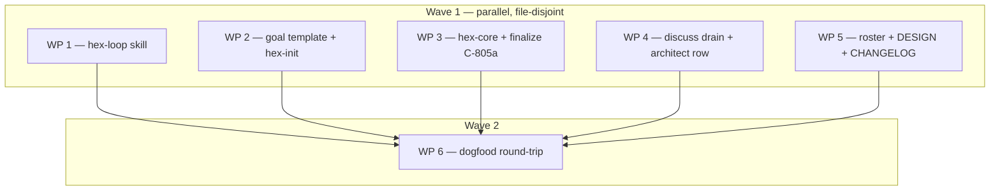

# Plan: hex-loop — goal-file writer and goal-prompt printer, plus the hex-discuss `→ loop` drain

## Status

- State:   done        <!-- planning → plan-approved → executing → review → done -->
- Tier:    high
- Tier-grammar: 5
- Effective-tier: derived
- Updated: 2026-09-23
- Next:
- Reviewed: e80894758a7888269521d9cd67117ad935b85a28
- Verdict: Approved (round 2 re-validation, 2026-09-23) — 0 Block, 0 High, 0 Warn open; 1 Suggest and 4 human-judgment items deferred (§ Notes)

---

## Overview

**Status:** Approved (Review-Fix round 1 applied — see Notes › Review log)
**Author:** /hex-plan (tier high — user explicit; architect=inline, research=1, adversary deferred — see Notes)
**Date:** 2026-09-23
**Issue/Ticket:** N/A
**Input dossier:** `.agents/discussions/autonomous-goal-loop.md`
(`Ratified: 2026-09-23 → plan`, plus its `Amendment 2026-09-23`, which adds
dedicated goal files)
**Related ADR:** `.agents/adrs/adr_0018_goal_loop_prompt.md` (**Proposed**
— Michael accepts). It carries four normative amendments and four named
deviations. `.agents/adrs/adr_0007_milestone_driver.md` is untouched and
still Proposed.
**Related Spec:** N/A (this repo has no spec home)

**Classification.**

- **Scope:** medium. One new skill, one new artifact class, one new drain
  target, one Preferences prose hint, and one finalize consent clause,
  across seven skills.
- **Reversibility:** **one-way (medium)** for the consent half, which is
  C-805a: autonomous force-push and publication of attestations under a
  pasted grant. Everything else is two-way and additive: a new directory, a
  new artifact home, a `State:` value no consumer fast-paths on, and a
  prose hint older readers ignore.
- **Tier:** `high`, which fits one-way-door medium.

## Objective

After execution, a user who has settled a large goal runs
`/hex-loop <source> [extras]`. The goal may have been settled with
`/hex-discuss` or by hand. The skill then:

- **writes one goal file**, `.agents/goals/<slug>.md`, which is the
  binding per-run contract: definition of done, autonomy, issue
  resolution, loop shape, rules, emphasis, context, and source;
- **prints one paste-ready prompt of at most 4,000 characters.** The prompt
  holds:
  - the invariant meta-orchestrator core;
  - the run's **widening grants, spelled out**;
  - the goal-file path and the entry point;
  - an inline `Done when:` list;
  - a demand for a closing DONE block.

The skill starts, pushes and commits nothing. Pasting is the only
confirmation. `/hex-discuss` can drain straight to it (`→ loop`).

## Scope

### In Scope

- **New bundle member `hex/hex-loop/`:** `SKILL.md` holds the flow, the
  `Goal loop:` Preferences grammar and the goal-command client list.
  `assets/goal-prompt.md` is the single-source prompt template.
- **New artifact class, goals:**
  - the template `hex/hex-init/assets/templates/goal.md`;
  - the default home `.agents/goals/`;
  - a hex-init conditional audit item that records a `Goals:` Pointers row
    with consent;
  - a hex-init optional audit item that proposes the `Goal loop:` hint.
- **`hex/hex-core/references/memory.md`:** the Pointers and Preferences rows
  name the goals home and the `Goal loop:` hint, as links.
- **`/hex-discuss` fifth drain target `→ loop`:**
  - the State vocabulary in `hex/hex-init/assets/templates/discussion.md`;
  - § Intake slot 3;
  - `hex/hex-architect/SKILL.md`'s refusal table.
- **`protocol.md` § The meta-plan approval gate:** `hex-loop` becomes the
  fourth named exempt skill.
- **Finalize C-805a autonomous-run clause:**
  - `hex/hex-core/references/finalize.md` § Consent model;
  - `hex/hex-finalize/SKILL.md` entry rule.
- **Roster lines:**
  - `hex/hex.toml`, `hex/publish.toml` and `grimoire.toml`;
  - `README.md` and `hex/README.md`, including the hex-discuss "drains to"
    wording;
  - `hex/hex-core/SKILL.md`;
  - the managed Commands block in `hex/hex-init/references/audit.md` and
    `CLAUDE.md`.
- **`hex/DESIGN.md` round 23,** which cites adr_0018, and a
  `hex/CHANGELOG.md` `[Unreleased]` entry.
- **Dogfood round-trip evidence** for examples 2 and 5.

### Out of Scope

- **adr_0007:** no cursor, no queue, no run state machine, and no new
  orchestrator.
- **The text of adr_0008 and adr_0009:** adr_0018 amends them in the open.
- **`hex/hex-core/references/config.md`:** no vocabulary bump. The
  `Goal loop:` hint is prose, following finalize's series-shape precedent
  (adr_0018 amendment 4).
- **`hex/hex-discuss/references/reach.md`:** this is the discussion's
  "syntax follows reach.md" line, and it rests on a wrong premise. reach.md
  holds only the hex-state rule's reach table, which is derived from grim's
  transforms on grim's cadence. Per-client goal and invocation facts live in
  `hex/hex-loop/SKILL.md` as one list (C-1408), with the detail in
  `.agents/research/plan-hex-loop-harness-wrappers.md`. This is recorded as
  a decision, not a dropped requirement: the requirement, harness-neutral
  invocation syntax from one documented home, is met.
- **Writing `Goal loop:` values into this repo's `hex.md › Preferences`:**
  that section is user-owned and written by `/hex-init` with consent. The
  round-trip uses a fixture.
- **The `grim install` sync of `.claude/skills/` and `.claude/rules/`:**
  Michael does that after merge.
- **Concurrency machinery:** the run is sequential by default. The inner-loop
  wording from example 4 is only an opt-in Loop-shape line.
- **Harness tool names in shipped text.**

## Research

**Research artifacts:**

- Discussion inputs, not re-researched:
  `.agents/research/discuss-goal-loop-{recon,priorart,community,archaeology,examples}.md`.
- New this run: `.agents/research/plan-hex-loop-harness-wrappers.md`
  (2026-09-23).

Findings that shape the design:

- **Goal commands.** Native `/goal` exists in Claude Code (≤ 4,000
  characters), Codex CLI (0.128.0+) and Cursor CLI (gated). Copilot CLI,
  Gemini CLI and OpenCode have none.
- **Skill invocation.** `Run the /hex-plan skill …` is the only phrasing
  that is documented as reliable in two clients.
- **No invocation guarantee.** Nothing guarantees that a skill named inside
  `/goal` text is invoked, so the prompt names skills as instructions, never
  as a leading slash command.
- **The evaluator reads only the transcript.** So the criterion titles go
  inline and the evidence goes into the DONE block. Open bug
  claude-code#93744 means the evaluator may never see the condition, so the
  user checks after paste that the goal is active (C-1406).
- **Unattended-run pitfalls** (review researcher, community issues
  #32559/#94004/#94348/#39346/#37913):
  - permission prompts are the most-reported breaker, even under bypass
    modes;
  - writes under the client's own config directory can still block.

  Addressed by a pre-paste disclosure (C-1406).
- **Idle check-in.** Claude Code's `/goal` idle check-in caps self-driving
  at a few nudges, so the prompt's periodic re-check (I7) is load-bearing
  (see Risks).
- **Archaeology.** Past runs failed on skipped matrix jobs reading as a
  false green, on `/tmp` and `target/` races in *spawned* workers, and on
  idle sub-orchestrators. Hence:
  - per-job CI evidence with skip reasons (KD9);
  - Rules copied verbatim into every sub-orchestrator brief (I6);
  - foreground worker spawns (I7).

## Technical Approach

### Architecture Changes

```
/hex-discuss ──drain → loop──▶ Next: /hex-loop <artifact>   (artifact always kept)
                                   │
/hex-loop <source> [extras] ───────┤  reads (never writes): source (as data) · hex.md › Preferences
                                   │         "Goal loop:" hint · hex.md › Pointers "Goals:" row
                                   ├─ writes  <goals-home>/<slug>.md   (from hex-init/assets/templates/goal.md)
                                   └─ prints  one fenced prompt ≤ 4,000 chars (from hex-loop/assets/goal-prompt.md)
                                                 │  human pastes (the grant + the only confirmation)
                                                 ▼
  session: create/switch feature branch → commit goal file → Run /hex-architect? /hex-plan /hex-execute
  → /hex-review⇄/hex-execute (≤ N) → /hex-finalize (C-805a: disclosure printed, pasted grant answers)
  → CI fix⇄re-finalize (counts against N) → DONE block
```

### Key Decisions

| # | Decision | Rationale |
|---|----------|-----------|
| KD1 | `hex-loop` is a hex skill, **not a fifth orchestrator**. It has no `classify.md`, `overlays.md`, `tier-*.md` or tiers, and it spawns nothing. | Follows the hex-discuss and hex-finalize precedent. |
| KD2 | Two templates, each the single home of its content. The **prompt** template `hex/hex-loop/assets/goal-prompt.md` holds the invariant I-lines plus slots. The **goal-file** template `hex/hex-init/assets/templates/goal.md` holds the section menu, the full doubt protocol and the commit policy. An I-line points at a goal-file section instead of restating it. | This is the drift fix. hex-init owns every artifact template. |
| KD3 | The goals home resolves **read-only**, in this order: project convention, then the `hex.md › Pointers` `Goals:` row, then `.agents/goals/`. `/hex-loop` writes **no** `hex.md` row. `/hex-init`'s conditional audit item records that row with consent. | A write would dirty the tracked `hex.md` and trip finalize pre-flight halt (3). The Pointers row is hex-init's to record. |
| KD4 | Value precedence: shipped default < `Goal loop:` hint < source-derived < extras. The resolved values are written into the goal file. **Grants are the exception:** anything that widens — acts on remotes, merge, release, other repos, **and every allowance** (`verify-bypass`, a `rule:` permitting an act such as deleting `.tmp/`) — is rendered **only into the pasted prompt's `{grants}`**. **No goal-file section adds an act or allowance**; the file only narrows and informs. | adr_0018 Option 3; C-815/C-816. |
| KD5 | Preferences **prose hint** `- Goal loop:`, read only by `/hex-loop`, with its grammar in `hex/hex-loop/SKILL.md`. Sub-items: `refinement-rounds: <int ≥ 1>` (default 2); `follow-up-loc: <int ≥ 1>` (default unset, meaning no LOC bar); `deep-verify: <workflow name>` (default unset, meaning the full documented verification); `verify-bypass: <text>` (iteration only; rendered as a grant, KD4); `rule: <text>` (repeatable, rendered verbatim). No config.md key. | adr_0018 amendment 4. Architect review: config.md's milestone-autonomy exclusion, and the fact that round 10 added no key for a non-orchestrator skill. |
| KD6 | `refinement-rounds` counts **outer** cycles. Each review ⇄ execute pass counts as one, and so does each post-finalize CI fix ⇄ re-finalize pass. Inner `limits.loop-rounds` is untouched. Once the count passes N, the DONE block reports the remaining criteria `not met` and the run stops. | The loops differ. The examples asked for 2, 3 or 5 rounds, and Michael's standing cap is 2. The count bounds the CI retrigger cycle. |
| KD7 | Skills are invoked as `Run the /hex-<mode> skill on <x>.`, for every entry and every I-line mention. The prompt body names capabilities, never tools. | Research. |
| KD8 | Budget: **≤ 4,000 Unicode code points over the whole paste**, wrapper included. The count comes from a shell command over the rendered paste, never from an estimate. When a paste is over budget, `/hex-loop` refuses; it never truncates. | Research: this is the strictest documented cap. |
| KD9 | Three fixed Done criteria are appended after the source-derived ones. **PR merge-ready:** the PR URL, and the PR is not a draft. **CI green per job:** every check run on the PR head SHA with its conclusion; every skipped job states its skip reason (its `if:` or path filter), and a skip with no reason counts as not green. **Deep verify passed:** the run URL and conclusion of the documented release-grade workflow named by `deep-verify`, dispatched only by `/hex-finalize` under C-813; when `deep-verify` is unset, the full documented verification result. A `deep-verify` name absent from project context's documented release-grade set gets the criterion note `(undocumented — finalize will not dispatch it; document it via /hex-init)` plus the disclosure note, and reads `not met` unless documented meanwhile. | Ratified "Done when" requirement. The archaeology recorded a false green. Review found that "required" was undefined. |
| KD10 | The session creates or switches to the feature branch (a PR source uses that PR's branch) and **commits the goal file as the first commit**. Ticks happen **only between hex-mode runs** and are committed at once. The three post-push criteria are evidenced **only in the DONE block** and are never ticked. `/hex-loop` itself commits nothing. | The pre-flight clean-tree halt (3). Avoids ticks colliding with `/hex-execute` merges. Avoids an endless loop of re-triggered CI. |
| KD11 | **Source → entry point → source-derived Done criteria** (rendered `Run the /hex-<mode> skill on …`): see the table after this one. | Covers the six examples; a tester can check every row. |
| KD12 | `/hex-discuss → loop`. `State: handed-off → loop`, `Ratified: <date> → loop`, `Next: /hex-loop <artifact path>`. **It always keeps its artifact and never drains inline.** Intake slot 3 lists "a goal loop". | Ratified, plus review: an inline drain leaves no source. |
| KD13 | `protocol.md`'s closed exemption list gains `/hex-loop` as its fourth member. | adr_0018 amendment 2. |
| KD14 | `claude.disable-model-invocation: "true"`, and explicit invocation only as a body rule. | Its output is a paste for a human, so a model-invoked run would write stray goal files. |
| KD15 | IDs use the fresh range C-1401… / S-1401…. The repo-wide maximum is C-1349 and S-1314. | No collision. |
| KD16 | **The wrapper is a static rule, with no flag:** the `/goal ` prefix. The disclosure line names the clients with a native goal command, from the C-1408 list, and says to drop the 6-character prefix elsewhere. | Architect: a `--for` flag is surface without value. It is cut. |

KD11 table:

| Source | Entry | Source-derived Done criteria |
|---|---|---|
| discussion | `/hex-plan "<title>, per <path>"` | one criterion per bullet in its `## Requirements` |
| ADR | `/hex-plan "<title>, per <path>"` | one per `## Decision` normative item |
| plan | `/hex-execute <path>` | "every WP merged" |
| spec | `/hex-architect <path>`, then `/hex-plan` | one per `C-` heading |
| PR | `/hex-plan <PR ref>` over its open review threads and linked issues | "every open thread/issue addressed, or deferred with an issue link" |
| issue | `/hex-plan <issue ref>` | its acceptance criteria, else "issue resolved as stated" |
| existing goal file | re-print only | its own |

## Constitution Deviations

Constitution: `hex/DESIGN.md`. adr_0018 § Rationale holds these rows, and
round 23 records them.

| Violation | Why needed | Simpler alternative rejected because |
|-----------|------------|--------------------------------------|
| **Two-layer model.** The `Goal loop:` hint's `rule:`, `verify-bypass:` and `deep-verify:` put host and project run facts in Preferences. | This is a ratified decision, and it is the only ground. The facts are operator allowances for unattended runs. They are rendered verbatim and never interpreted. `deep-verify` only names which already-documented run counts as evidence and has no dispatch power (C-813 unchanged). I6 copies § Rules verbatim into every sub-orchestrator brief, because the archaeology failures happened in spawned workers. | Reading them from project context would have hex-loop mining free prose for "rules to repeat". That breaks the round-trip's no-instruction-dropped bar. |
| **finalize C-805, both halves.** A human-typed invocation plus a gate that asks. | The ratified done state is a merge-ready PR with no prompting. **C-805a** (adr_0018 amendment 3) names the pasted grant as satisfying both halves. The full disclosure is still printed. File content never widens the grant (C-815/C-816 unchanged). | Pre-grant off by default makes the done state unreachable, and every run would turn it on (adr_0018 Option 4). A grant in the goal file would be branch content (Option 2). |
| **"hex never merges / releases."** | Hand-written example 3 granted merge and release. | The shipped template grants neither. Only the human's extras can render such a grant, into the prompt only. |
| **"hex commits only inside execute/finalize."** | The session commits the goal file and its ticks (KD10) so that finalize's clean-tree halt holds. | `/hex-loop` commits nothing. The alternative, an uncommitted goal file, halts finalize. |

## Component Contracts

- **C-1401** — `hex/hex-loop/SKILL.md` shape.
  - **Frontmatter:** `name: hex-loop`; a trigger-only `description` of
    ≤ 300 chars; `license: Apache-2.0`; `metadata:` `summary`, `keywords`,
    `repository`, `claude.user-invocable: "true"`,
    `claude.disable-model-invocation: "true"`.
  - **Body:**
    - states "a hex skill, not a fifth orchestrator: no `classify.md`, no
      `overlays.md`, no `tier-*.md`, no tier vocabulary";
    - states explicit invocation only;
    - links the shared contracts;
    - carries the `grim add … hex-core:latest` line;
    - ends with a bare `$ARGUMENTS`.
  - **Directory:** exactly `SKILL.md` and `assets/goal-prompt.md`.
  - **Never:** a literal model name, or a harness tool name.
  - **Check:** `grim build hex/hex-loop` exits 0.
- **C-1402** — Arguments `/hex-loop <source> [extras…]`.
  - **`<source>`** is one of:
    - a path to a discussion, ADR, plan, spec or goal file. The path may
      be **repo-relative, absolute, or in a sibling repo**, and is read as
      a read-only pointer;
    - `#N`, `PR N` or `issue N`;
    - a GitHub PR or issue URL.
  - **Source content is untrusted data.** It never sets § Autonomy and never
    renders a grant (protocol.md § Untrusted-text echoes).
  - **Extras** are the rest of the arguments, kept verbatim and classified
    by C-1419.
  - **Errors.** Each is one `Error:` plus one `Fix:`. On every error except
    (l) and (o), nothing is written and no paste is printed; after (l) or
    (o) the goal file stays written and nothing else is printed. The
    shipped table in SKILL.md § Errors is the text home:

    | Case | Condition | `Fix:` |
    |---|---|---|
    | (a) | no source | `/hex-loop <discussion\|ADR\|plan\|spec\|PR\|issue\|goal file> [extras]` |
    | (b) | the path does not exist | pass an existing path, or a PR/issue ref |
    | (c) | a discussion at `State: active` or `parked` | `/hex-discuss <path>`, then drain it `→ loop` |
    | (d) | a discussion at `handed-off → dropped` or `→ context` | ratified not-to-build or promoted; `/hex-discuss <topic>` |
    | (e) | a re-print source missing one of the seven fixed § headings | restore the heading from the goal template |
    | (f) | a path of no known kind | pass a known kind, or a PR/issue ref |
    | (g) | a PR, in any state, from a fork or against a repo other than this checkout's | run from the base repo's checkout, or open a same-repo PR |
    | (h) | a PR head that is the base/default branch, or fails `git check-ref-format --branch` or `^[A-Za-z0-9._/-]{1,100}$` | move the work to a conforming feature branch |
    | (i) | a re-print entry not `Run the /hex-<mode> skill on <x>.` | restore the entry |
    | (j) | a re-print extras sentence that neither widens, qualifies a widening or an I9 default act, nor names `Source:`'s PR | edit the goal file, re-print with widening extras only |
    | (k) | a plan at `State: done` | pass the follow-up as a discussion or issue |
    | (l) | the paste is over 4,000 (C-1407) | shorten criteria, extras grants or hint grant text, then re-print |
    | (m) | the goal path escapes its home | make it a plain file inside the home |
    | (n) | the goals home is outside the repo, behind a symlink, or in a client configuration directory | use a plain in-repo home |
    | (o) | the paste cannot be counted (no `python3`, failed temp write) | install python3 or free the temp dir |
    | (p) | the goal template is not installed | `grim add ghcr.io/michael-herwig/arcana/hex-init:latest` |
    | (q) | a re-print value is invalid: a template placeholder string left outside HTML comments and quoted echoes, a malformed criterion item (each `- [ ]` / `- [x]` item with its continuation lines; HTML comments skipped), or a non-positive-integer `Refinement rounds:` | fix that § per the goal template |
    | (r) | a GitHub ref no rung can fetch, a bare `#N` included | pass a fetchable PR ref, or the plan/issue |
    | (s) | a re-print of a committed goal file with a PR `Source:`, and that PR ref not passed as an extra | pass the echoed `Source:` ref if it is the PR meant, else write a fresh goal file |
    | (t) | a source or goal-file path containing a `"` or a control character | rename it to a plain path |

  - **Unfetchable GitHub ref.** A ref no rung of the fetch ladder
    (`/hex-plan` § 2, linked) can fetch — a bare `#N` included — is (r):
    fail closed, since no PR check could run.
  - **The PR checks.** Every fetched PR, whatever its state, must be a
    same-repo PR of this checkout: base repo = this checkout's repo, head
    repo = base repo; else (g). An open one must also have a head branch
    that is neither the base nor the default branch and whose name passes
    `git check-ref-format --branch` and `^[A-Za-z0-9._/-]{1,100}$`; else
    (h). A MERGED or CLOSED PR then proceeds with `{pr-branch}` empty plus
    a note. A re-print re-runs them.
  - **Paths** are validated, never rewritten: a `"` or a control character
    in a source or goal-file path is (t).
- **C-1403** — Source resolution.
  - **Entry and Done criteria:** follow the KD11 table. An extras sentence
    naming an entry skill wins.
  - **Discussion states:** a discussion at `handed-off → loop` proceeds
    silently. At `→ plan` or `→ architect` it proceeds with the disclosure
    `— discussion drained to <target>, running it as a loop anyway`.
  - **PR source:** for an open PR that passed the PR checks, *PR
    merge-ready* names that PR and I9 reads `land on PR <ref>'s existing
    branch "<branch>"; no new PR`. A MERGED or CLOSED PR leaves
    `{pr-branch}` empty, and the criterion reads `new PR carrying the
    follow-ups merge-ready`.
- **C-1404** — Goal-file write.
  - **Path:** `<goals-home>/<slug>.md`. The home is refused (Error (n)) if
    it resolves outside the repo, through a symlink, or under a client
    configuration directory.
  - **Slug:** from the source. That is the discussion slug, or the ADR,
    plan or spec filename stem, or `pr-<N>` or `issue-<N>`. It is lowercased
    to `[a-z0-9-]`: `_` and spaces become `-`, and runs of `-` collapse.
    A slug `claude`, `agents` or `gemini` becomes `<slug>-goal`.
  - **Never clobbers:** on an existing slug it appends `-YYYY-MM-DD`, then
    `-YYYY-MM-DD-2`, `-3`, and so on.
  - **Path conditions:** inside the home, no `..` segment, not absolute
    relative to the home, and not a symlink (archive.md § Containment
    conditions 1–2, linked by anchor; the fold-only "already exists" and
    "git-tracked" conditions do not apply); else Error (m).
  - **Content:** C-1409, with the slots resolved per KD4. A `Goal loop:`
    hint grants only local acts in this repo's working tree; any remote act
    (push, PR or issue operation, merge, release, another repo) beyond I9's
    fixed defaults comes only from the human's extras, and a hint part that
    would grant one is dropped with a `hint grant refused` note. A hint
    allowance renders into `{grants}` as the labelled echo
    `hint (local, this repo only): "<text>"`.
  - **Missing template:** `Error: goal template missing`,
    `Fix: grim add ghcr.io/michael-herwig/arcana/hex-init:latest`.
  - **Re-print mode** (the source is a goal file): writes nothing, checks
    C-1402(e), (i), (q) and (t), and re-renders from that file. A PR
    `Source:` binds only when the goal file was never committed or the
    human passes that same PR ref as an extra, else (s); a bound one is
    re-fetched, put through the PR checks, and printed as the note
    `— re-print: PR binding <url> → "<branch>"`. It takes `{grants}` only
    from that invocation's widening extras and the restrictions that
    qualify them or an I9 default act, plus the hint; it notes mirrored
    grants and qualifying narrowings not re-supplied, and refuses any other
    extras sentence (j). § Autonomy's forbidden acts delete I9 default acts,
    as narrowing extras do, with the note `— re-print: I9 acts withheld:
    <list>`.
  - **Never writes** `hex.md` in any section.
- **C-1405** — `hex/hex-loop/assets/goal-prompt.md` is the only home of the
  invariant core. It has **one line per clause**, in this order:

  | Line | Clause |
  |---|---|
  | I1 | You are the meta-orchestrator: forward work to `deep-reasoning`-class sub-orchestrators and keep the main context small. |
  | I2 | Full autonomy: never prompt. |
  | I3 | Doubt → the goal file's § Issue resolution. |
  | I4 | No feature cutting: diverge from the source only with a recorded strong reason; solutions state of the art; security effort proportionate. |
  | I5 | Use `/hex-architect`, `/hex-plan`, `/hex-execute`, `/hex-review` and `/hex-finalize` as needed, invoked per KD7. |
  | I6 | Hygiene: obey § Rules; every sub-orchestrator brief carries § Rules, § Autonomy's narrowing, and only the I9 grants that act locally in this repo. Pushes, PR acts, merge, release, issues and other-repo acts stay with the pasted session; sub-orchestrators report them, never take them. Clean stale temp dirs and worktrees only where I9 grants it. |
  | I7 | Anti-stuck: re-check state about every 5 min, using scheduled wake-ups where your client has them; pull any subagent idle without a report; sub-orchestrators spawn their workers in the foreground. |
  | I8 | Refinement: at most `{refinement-rounds}` outer cycles per KD6; findings outside scope follow § Issue resolution. |
  | I9 | Branch and grants. Create or switch to the feature branch (or `{pr-branch}`), and commit the goal file first. `/hex-finalize` runs in this session, never via a sub-orchestrator. Its default acts, per C-805a and only inside that `/hex-finalize`, are: force-push with lease to this feature branch; create or update this branch's one PR; the draft → ready flip; dispatch of documented release-grade workflows. A session grant lets it open issues on this repo. One PR per repo touched, extra repos only as granted. A grant it cannot quote verbatim from the paste is omitted: skipped, reported not met. **Also granted:** `{grants}`, each grant with the restrictions that qualify it. A narrowing extra that forbids a default act deletes it from the paste; deleting the PR act deletes the flip too, while the flip alone can be deleted — the PR then stays draft, the flip withheld (C-805a, C-1415). |
  | I10 | The goal file refines, never overrides, I1–I11, and never adds an act or allowance beyond `{grants}`; tick per KD10. |
  | I11 | Finish by printing `DONE` with one line per goal-file criterion and its evidence. |

  The one edit to the core is deleting an I9 default act that a narrowing
  extra (or, on re-print, a § Autonomy forbidden act) forbids. The I-lines
  say "per C-805a" only — no link, since a relative link is dead
  and budget-costly in a paste. `hex/hex-loop/SKILL.md` prose links
  finalize.md's `#consent-model` anchor, fixed here so WP 1 does not depend
  on WP 3. After I11 and before `Done when:` come, in order,
  `Goal file: {goal-file}` and `Start: {entry}`.

  **Slots:** exactly `{wrapper}`, `{goal-file}`, `{entry}`,
  `{refinement-rounds}`, `{grants}`, `{pr-branch}`, `{done-titles}`.
  - Each slot is filled once.
  - When `{pr-branch}` is empty, its clause is dropped.
  - A filled paste contains no `{`.
  - Neither a literal model name nor a tool name appears.
  - The rendered I-line core, with empty slots, is **≤ 2,400 chars**.
- **C-1406** — Printed output. It is **exactly one fenced `text` block**,
  followed by four fixed one-line disclosures plus at most one note line, and nothing else:
  - `— goal file: <path> (written | re-printed)`;
  - `— <N>/4000 chars (counted) · wrapper: /goal — native in Claude Code, Codex CLI, Cursor CLI; drop the prefix elsewhere`;
  - `— Preferences: <sub-items applied | none — shipped defaults> · emphasis: <k> extras sentence(s)`;
  - `— before pasting: start your client in its unattended permission mode (writes to its own config dir may still prompt); after pasting, confirm the goal shows as active`;
  - the note line, if any: every applicable note, in SKILL.md's definition
    order and joined by ` · `. The notes are PR MERGED/CLOSED,
    drained-elsewhere, plan landing, spans repos, date suffix, hint grant
    refused, re-print PR binding, re-print I9 acts withheld, re-print
    grants not re-supplied, re-print narrowings not re-supplied, and PR
    with 0 open items; KD9's undocumented deep-verify comes last.

  The paste ends with a line `Done when: <title>; <title>; …`, listing the
  goal file's criterion titles, and then the DONE-block sentence (I11).
- **C-1407** — Budget.
  - **Count:** the rendered paste, via `python3 -c` only (never `wc -m`),
    on a uniquely named (`mktemp`) temp file in the client's temp dir,
    removed after. No `python3` or a failed temp
    write is Error (o): fail closed, never an estimate.
  - **Over 4,000:** `Error: prompt is <N>/4000 chars (<M> done-criteria titles, <K> extras grant chars, <H> hint grant chars)`,
    `Fix: shorten or merge criteria in <goal file>, or shorten the widening extras or the hex.md Goal loop: rule and verify-bypass text, then /hex-loop <goal file> <widening extras>`.
  - **After a refusal:** the goal file stays written and nothing else is
    printed.
  - **Never:** truncation, or dropping an I-line, grant or title.
- **C-1408** — `hex/hex-loop/SKILL.md` § Clients.
  - **Native goal commands:** one line listing the clients that have one:
    Claude Code (≤ 4,000), Codex CLI and Cursor CLI.
  - **Invocation phrasing:** one line with the KD7 rule.
  - **Provenance:** a verified-at date (2026-09-23) and "re-verify at each
    client minor", citing `.agents/research/plan-hex-loop-harness-wrappers.md`.
  - **Wrapper:** `{wrapper}` is always `/goal ` (KD16), and the body is the
    same for every client.
- **C-1409** — `hex/hex-init/assets/templates/goal.md`.
  - **Header:** `Source: <pointer>` · `Written: <YYYY-MM-DD> by /hex-loop`.
    There is **no `State:` line**, and no cursor or queue.
  - **Header comment:** owner `/hex-loop`; home and slug resolution by
    pointer to hex-loop SKILL.md § The goal file (the home is not restated);
    the KD10 commit and tick policy; "§ Autonomy only narrows the pasted
    grants".
  - **Sections:** there are seven fixed sections, always present, in this
    order:
    1. `## Definition of done` — `- [ ] <title> — evidence: <form>`, with
       the source-derived criteria first and the three KD9 criteria last,
       marked `(DONE block only)`.
    2. `## Autonomy` — prompting: never; the granted acts as a
       non-authoritative copy of the prompt's `{grants}`, marked "authority:
       the pasted prompt"; forbidden and narrowed acts (one forbidding an I9
       default act is also deleted from the paste; one qualifying a pasted
       grant also rides with that grant in the paste).
    3. `## Issue resolution` — the doubt protocol in full:
       - delegate the research to a sub-orchestrator;
       - question → research → decision, all recorded in the goal file or
         the PR;
       - defer to a GitHub issue only in hard cases;
       - every non-deferred doubt ends in an action;
       - pre-existing failures that block done are in scope and go through
         this protocol;
       - findings outside the goal's scope become follow-up issues. With
         `follow-up-loc` set, the rule reads "findings whose fix exceeds
         `<N>` LOC of production code and are not part of this goal become
         follow-up issues";
       - secrets and credential-bearing logs are never written to a
         committed file, commit message, PR text, PR comment or review
         comment, or issue; security findings are never
         filed as issues, and this file records them by reference only
         (location and class), in full only in the DONE block.
    4. `## Loop shape` — the entry point, the refinement rounds (every
       failed repair or retry cycle counts against them), and the optional
       inner-loop line.
    5. `## Rules` — the `rule:` items verbatim, `verify-bypass` as "during
       iteration only, never at finalize", and a `Run rules:` sub-list from
       the extras.
    6. `## Emphasis`.
    7. `## Context`.
  - **Empty sections:** an empty section keeps its heading with `None.`.
- **C-1410** — `hex/hex-core/references/memory.md` § The three sections.
  - **Pointers row:** gains "the goals home (`Goals:`, recorded by
    `/hex-init`)".
  - **Preferences row:** gains "the `Goal loop:` prose hint, read only by
    `/hex-loop` (grammar: its SKILL.md)".
  - **config.md:** untouched. This is checked with
    `git diff --quiet <base> -- hex/hex-core/references/config.md`.
- **C-1411** — hex-init wiring.
  - **`hex/hex-init/references/audit.md` gains two items:**
    - *Goals home documented (conditional):* asked only when a goal file
      exists or the user asks. It proposes a practiced location, else
      `.agents/goals/`, and records
      ``- Goals: `<home>` — per-run goal files (/hex-loop).``. It makes no
      seed offer.
    - *Goal-loop defaults recorded? (optional):* proposes the `Goal loop:`
      Preferences prose hint with consent. It is discovered de facto from
      Memory notes of hand-written goal prompts.
  - **`hex/hex-init/SKILL.md` gains:**
    - the matching audit bullets;
    - a "Goals home (conditional)" paragraph;
    - "the goals home when one was resolved" in the Step 5 Pointers list.
- **C-1412** — `/hex-discuss` `→ loop`.
  - **§ Handoff:**
    - "Four drain targets" becomes "Five drain targets";
    - a bullet `**→ loop** — Next: /hex-loop <artifact path>` is added,
      carrying the never-inline rule (KD12);
    - the terminal-states sentence and the `## Discussion Complete` block
      read `handed-off → plan | architect | loop | context | dropped` and
      `/hex-loop <path>`.
  - **§ Intake:** slot 3 reads "plan, ADR, spec, a goal loop, or just
    clarity".
  - **Vocabulary home:** only `hex/hex-init/assets/templates/discussion.md`
    defines it. There, the `State ∈` comment gains `handed-off → loop`, the
    `Ratified:` comment gains `loop`, and the owner/Handoff comment gains
    `/hex-loop`.
- **C-1413** — `hex/hex-architect/SKILL.md` refusal table.
  - **New row** `handed-off → loop`:
    `Fix: this discussion's target is /hex-loop — run that, or paste the decision as free text.`
  - **The "anything else" row** gains `handed-off → loop` in its list.
  - **Unchanged:** the fast path still accepts only `→ architect`.
- **C-1414** — `hex/hex-core/references/protocol.md` § The meta-plan approval
  gate.
  - "three skills are exempt" becomes "four", and `/hex-loop` is named with
    its ground (adr_0018 amendment 2).
  - "a fourth member is added" becomes "a fifth member is added by amending
    this sentence, never by analogy".
  - The `/hex-finalize` ground ("single approval gate … on every degrade
    rung") gains "— except under C-805a (finalize.md)". Nothing else in
    the paragraph changes.
- **C-1415** — Finalize C-805a.
  - **Where:** `hex/hex-core/references/finalize.md` § Consent model gains
    one paragraph, **C-805a autonomous-run clause**, carrying adr_0018
    amendment 3 in full. It covers:
    - how the pasted, human-authored prompt satisfies the class grant and
      the instance gate;
    - the full disclosure printed to the transcript;
    - an omitted act being skipped and reported not met, never asked;
    - act 4's draft → ready flip granted or withheld on its own (C-1405's
      I9 lists it as its own act): withheld, the PR stays draft, and the
      flip is disclosed as withheld and reported not met;
    - workflow drift withholding act 3: on C-813's drift trigger (any file
      under the workflow directory differs, branch against trunk), act 3
      is skipped, disclosed as withheld, and reported not met;
    - C-815/C-816 and C-813 explicitly unchanged, and file content never
      widening the grant.
  - **Existing text:** it stays, and every sentence that C-805a contradicts
    gains "— except under C-805a" (or a link): finalize.md § Consent model's
    "never model-invocable … a human typing the command" (the words "never
    model-invocable" kept verbatim) and "The gate therefore asks on every
    rung"; `hex/hex-finalize/SKILL.md`'s "The gate
    asks on every rung" (§ Gate).
  - **Entry rule:** `hex/hex-finalize/SKILL.md` gains one clause, "or a
    session acting on a human-pasted C-805a grant", with a link.
  - **Frontmatter:** `claude.disable-model-invocation` stays `"false"`,
    enforced by a sweep.
- **C-1416** — Roster wiring.
  - **Bundle manifests:**
    - `hex/hex.toml`: `[skills]` gets
      `"hex-loop" = "./hex-loop:latest"`, and `description` gets one clause.
    - `hex/publish.toml`: `[skills."hex-loop"] path = "hex-loop"`.
    - `grimoire.toml`: `hex-loop = "./hex/hex-loop"`.
  - **READMEs:**
    - `README.md`: a row, and the hex-discuss row's "drains to" gains "a
      goal loop".
    - `hex/README.md`: a quickstart line after `/hex-discuss`, a skills
      row, the hex-discuss row's "drains to" gains "a goal loop", and the
      not-orchestrators sentence lists `hex-init`, `hex-discuss`,
      `hex-loop` and `hex-finalize`.
  - **Command lists:** the `hex/hex-core/SKILL.md` list, and the managed
    `Commands:` line (the audit.md block and `CLAUDE.md`'s `hex:start`
    block), gain `/hex-loop` after `/hex-discuss`.
  - **Check:** `task publish -- --dry-run` exits 0 and lists `hex-loop`.
- **C-1417** — `hex/DESIGN.md` `## Goal-loop round (2026-09-23, round 23)`
  cites adr_0018.
  - **It records:**
    - the new member and the goals class;
    - the adr_0008 set going from four to five (made in the open);
    - the fourth protocol exemption;
    - C-805a;
    - the Preferences prose hint with **no config bump**;
    - all four deviation rows;
    - the always-on budget: no rule, and a description of ≤ 300 chars;
    - considered and not deviated: thin SKILL.md, capability classes,
      single source, client-is-runtime (markdown only, no engine),
      C-815/C-816, C-813, and adr_0007 untouched.
  - **Unchanged:** rounds 1–22 are byte-intact.
  - **CHANGELOG:** `hex/CHANGELOG.md` gets a new `## [Unreleased]` above
    `[0.4.1]`, with one `### Added` bullet in house prose: `/hex-loop`
    (adr_0018, `hex/DESIGN.md` round 23).
- **C-1418** — Round-trip evidence `.agents/research/hex-loop-roundtrip.md`
  (research template header).
  - **Example 2:** the source is
    `/home/mherwig/dev/ocx-mirror/.claude/state/plans/plan_mirror_signing.md`
    (absolute, read-only, C-1402). Extras are that example's run-specific
    lines.
  - **Example 5:** the source is `https://github.com/ocx-sh/ocx/pull/339`.
    Extras are its run-specific lines, including the oci-client fork PR
    grant and the bugfix-workflow line.
  - **Fixture `Goal loop:` hint** (ocx family):
    - `rule:` "/tmp and target/ are wiped hourly — no drafts there; scratch
      in the project's .tmp/, delete after" — its deletion allowance
      renders into `{grants}`, never § Rules (KD4);
    - `rule:` "limit/monitor RAM (rust-analyzer), or the WSL aborts";
    - `verify-bypass:` "task verify:mark bypasses the commit hook";
    - `deep-verify:` "Verify Deep".
  - **Recorded per example:**
    - the goal file;
    - the printed paste;
    - its counted code points, which must be ≤ 4,000;
    - an **instruction-coverage table**: every sentence-level instruction
      of the original, each with its landing spot (I-line, goal-file §,
      grant, or `Goal loop:` sub-item) or `transformed: <reason>`. A
      literal model name becomes a capability class, and `/finalize`
      becomes `/hex-finalize`.
  - **Pass bar:** **zero rows read `dropped`.**
  - **Where it is written:** into the research artifact only, never into
    `.agents/goals/` (the targets are ocx repos).
  - **Error paths:** `.agents/research/dogfood-hex-loop-error-paths.md`
    covers re-print Errors (e) and (j), over-budget (l), an open same-repo
    PR render, a discussion source with no hint, Error (h) on a
    metacharacter branch name, Error (r) on an unfetchable PR ref, a
    successful re-print of an uncommitted open-PR goal file (binding and
    withheld-flip notes), and Error (s) on a committed goal file.
- **C-1419** — Extras classification (`hex/hex-loop/SKILL.md` § Extras).
  Each extras sentence lands by the first row it matches, in this order:

  | Sentence kind | Lands in |
  |---|---|
  | widening grants and allowances: push, merge, release, other repos or PR targets, skipping a check, deleting files/dirs | `{grants}` (the prompt) and mirrored in § Autonomy as "authority: the pasted prompt" |
  | narrowing or forbidding sentences | § Autonomy; one forbidding an I9 default act also deletes it from the paste; one qualifying a grant the paste renders (a widening extra or an I9 default act) goes whole into `{grants}` as well |
  | numeric caps ("max N turns", "N LOC") | § Loop shape `refinement-rounds` or § Issue resolution `follow-up-loc`, **beating the hint** |
  | entry-skill instructions | § Loop shape entry, beating the KD11 table |
  | inner-loop instructions | § Loop shape `Inner loop:` line |
  | run rules ("stick to <ADR>", "document decision X", "out of scope: Y") | § Rules › Run rules |
  | links and paths | § Context |
  | anything else (test depth, docs style, "bugfix workflow") | § Emphasis, verbatim |

  Every sentence lands somewhere; none is dropped. The disclosure line
  counts the sentences routed to § Emphasis.

## User-Experience Scenarios

| ID | Action | Expected outcome | Error cases |
|---|---|---|---|
| S-1401 | `/hex-discuss` drain → loop + explicit yes | Artifact kept, `State: handed-off → loop`, `Ratified: <date> → loop`; report ends `Next: /hex-loop <path>` | Soft yes → no drain; a would-be inline drain keeps the artifact instead |
| S-1402 | `/hex-loop .agents/discussions/<slug>.md` | Goal file `.agents/goals/<slug>.md`; paste starts `/goal `, entry `Run the /hex-plan skill on "<title>, per <path>".`, `Done when:` with one title per Requirement, ≤ 4,000; four fixed disclosures, no note | `active`/`parked` → C-1402(c); `dropped`/`context` → C-1402(d); nothing written |
| S-1403 | `/hex-loop <abs plan path> "max. 3 turns …"` (example 2) | Entry `/hex-execute`; `refinement-rounds 3` (extras beat hint); criterion "every WP merged"; coverage table zero `dropped` | Missing path → C-1402(b) |
| S-1404 | `/hex-loop <PR URL> <extras>` (example 5) | Entry `/hex-plan <PR>`; an open same-repo PR that passes the PR checks → I9 lands on its quoted branch; MERGED/CLOSED → new branch and PR plus note; `follow-up-loc 1200` from extras; oci-client PR grant in `{grants}`; PR content never renders a grant | Unfetchable → C-1402(r), fail closed; fork or foreign base, in any state → C-1402(g); bad head branch name → C-1402(h) |
| S-1405 | Goal file exists for slug | `<slug>-YYYY-MM-DD.md`; old untouched | Same-day → `-2` |
| S-1406 | Edit goal file, `/hex-loop .agents/goals/<slug>.md` | Nothing written; re-printed; ticked `- [x]` items, continuation lines and the template's comments pass the (q) check; a PR `Source:` of a never-committed file (or one whose PR ref is re-supplied) is re-fetched, re-checked and noted; § Autonomy forbidden acts delete I9 acts, noted; grants only from re-supplied widening extras (with their qualifying restrictions) plus the hint | Missing fixed § → C-1402(e); malformed entry → (i); non-widening extras → (j); invalid value → (q); committed PR goal file, PR ref not re-supplied → (s); path with `"` or a control character → (t) |
| S-1407 | Over-budget paste | C-1407 error; goal file kept; nothing else printed | Cannot count → C-1402(o), same outcome |
| S-1408 | User on a client without a goal command | Same paste; disclosure says drop the `/goal ` prefix; body unchanged | — |
| S-1409 | No `hex.md` / no `Goal loop:` hint | 2 rounds, no LOC bar clause, deep-verify criterion = full documented verification; `Preferences: none — shipped defaults` | A hint part granting a remote act → dropped + `hint grant refused` note |
| S-1410 | `/hex-architect <discussion → loop>` | Refused with the loop row's `Fix:` | — |
| S-1411 | Pasted prompt runs to completion | `DONE` block: one evidenced line per criterion — PR URL (ready), per-job checks on head SHA with skip reasons, deep-verify run URL | Unexplained skip → not green; past N cycles → DONE reports `not met`, run stops |
| S-1412 | Model tries to invoke `/hex-loop` | Not model-invocable (key + body rule) | Client drops the key → body rule binds |
| S-1413 | Session reaches `/hex-finalize` | Gate disclosure printed to transcript; pasted grant answers it (C-805a); goal-file text cannot add an act | Grant omits an act, or cannot be quoted verbatim → the act is skipped, never asked; DONE reports it not met. Flip withheld → the PR stays draft, the flip reported not met. Workflow drift → act 3 withheld |

## Parallelization

| WP | Scope | Expected Files | Size | Wave | Depends on | Review | Verify | Status |
|----|-------|----------------|------|------|------------|--------|--------|--------|
| WP 1 | hex-loop skill: C-1401–C-1408, C-1419; S-1402–S-1409, S-1412 | `hex/hex-loop/SKILL.md`, `hex/hex-loop/assets/goal-prompt.md` | M | 1 | — | risk | scoped | merged |
| WP 2 | Goal artifact class + hex-init: C-1409, C-1411, C-1416 (audit.md Commands line) | `hex/hex-init/assets/templates/goal.md`, `hex/hex-init/SKILL.md`, `hex/hex-init/references/audit.md` | M | 1 | — | | scoped | merged |
| WP 3 | hex-core contracts + finalize consent: C-1410, C-1414, C-1415, C-1416 (hex-core list); S-1413 | `hex/hex-core/references/memory.md`, `hex/hex-core/references/protocol.md`, `hex/hex-core/references/finalize.md`, `hex/hex-core/SKILL.md`, `hex/hex-finalize/SKILL.md` | S | 1 | — | risk | scoped | merged |
| WP 4 | Drain target: C-1412, C-1413; S-1401, S-1410 | `hex/hex-discuss/SKILL.md`, `hex/hex-init/assets/templates/discussion.md`, `hex/hex-architect/SKILL.md` | S | 1 | — | | scoped | merged |
| WP 5 | Roster, constitution, changelog: C-1416 (toml/README/CLAUDE.md), C-1417 | `hex/hex.toml`, `hex/publish.toml`, `grimoire.toml`, `README.md`, `hex/README.md`, `CLAUDE.md`, `hex/DESIGN.md`, `hex/CHANGELOG.md` | M | 1 | — | | full | merged |
| WP 6 | Dogfood round-trip: C-1418; S-1403, S-1404, S-1411 (static half) | `.agents/research/hex-loop-roundtrip.md`, `.agents/research/dogfood-hex-loop-example-{2,5}.md` | M | 2 | WP 1, WP 2, WP 3, WP 4, WP 5 | | full | merged |



**Critical path:** WP 1 → WP 6. WP 1 is new prose that has to fit the
budget, and WP 6 exercises it.

**Shippable after wave:** 1. The skill, the artifact class, the drain and
C-805a all ship; only the round-trip evidence is missing.

**Merge order:** WP 3, WP 2, WP 4, WP 1, WP 5, then WP 6, serialized. The
anchor owners merge first: WP 3 owns `finalize.md#consent-model` and the
protocol text, and WP 2 owns `goal.md`. After each merge, run the scoped
check (`grim build` for every touched skill dir). Full verification runs on
the documented triggers (hex-core references/worktree.md § Worktree
work-package mechanics, C-901).

**Link contract across wave 1** (fixed so parallel WPs agree):

- the goal template path is `hex/hex-init/assets/templates/goal.md`;
- the finalize anchor is `finalize.md#consent-model`;
- the protocol anchor is `protocol.md#the-meta-plan-approval-gate`;
- the Pointers row text is
  ``- Goals: `<home>` — per-run goal files (/hex-loop).``;
- the Preferences hint name is `- Goal loop:`.

**Parallelization justification:** WP 3 bundles five files, and
`hex/hex-finalize/SKILL.md` is included because its entry clause is one
line that consumes C-805a. That keeps the consent change a single reviewed
unit, and splitting it would create a sub-overhead WP.

**Verify justification:**

- **WP 5:** it edits the publish roster, and only
  `task publish -- --dry-run` catches a broken bundle.
- **WP 6:** it is the last merge, and its evidence depends on the whole
  bundle.

## Implementation Steps

> **Contract-first TDD.** This is a markdown bundle, so the executable
> specification is the **validation sweep** below. It is written before
> Implement and must fail on the stub state. Use `/usr/bin/grep`, because
> rtk-shadowed `grep` gives false negatives.

### Phase 1: Stubs

- [x] **1.1 (WP 1):**
  - SKILL.md: the C-1401 frontmatter, and the headings `Argument syntax`,
    `Flow`, `Extras`, `The goal file`, `The prompt`, `Clients`,
    `Preferences hint`, `Errors`, `Constraints`, then `$ARGUMENTS`;
  - `assets/goal-prompt.md`: I1–I11 as `TODO` lines, plus the seven slots.
- [x] **1.2 (WP 2):** `goal.md` with the header and the seven headings as
  `TODO`, plus the empty audit-item headings.
- [x] **1.3 (WP 3):**
  - the `C-805a` paragraph heading stub in `finalize.md`;
  - the memory.md row placeholders.
- [x] **1.4 (WP 4):** the `→ loop` bullet placeholder.
- [x] **1.5 (WP 5):**
  - the round-23 heading and `[Unreleased]`;
  - the toml and README lines, which are real right away because a stub of
    a roster line is the line.

Gate: `grim build` exits 0 on every touched skill dir.

### Phase 2: Architecture Review

A `reviewer` (focus `spec`, phase `post-stub`) checks each wave-1 WP's stubs
against its C-IDs, and checks that no WP restates another WP's content:

- the doubt protocol lives only in `goal.md`;
- the State vocabulary lives only in `discussion.md`;
- the client list lives only in the hex-loop SKILL.md;
- C-805a lives only in `finalize.md`.

### Phase 3: Specification Tests (validation sweep)

- [x] **3.1 Structure** (C-1401, C-1405, C-1408, C-1409; S-1412):
  - `hex/hex-loop` contains exactly `SKILL.md` and `assets/goal-prompt.md`,
    with no `classify.md` and no `tier-` file;
  - the frontmatter has `disable-model-invocation: "true"` and a
    description of ≤ 300 chars;
  - `/usr/bin/grep -rnE 'Opus|Sonnet|Haiku|GPT-[0-9]|Gemini [0-9]|ScheduleWakeup|Monitor tool|Agent tool|TaskCreate'`
    over `hex/hex-loop` and `goal.md` returns 0 hits;
  - `goal.md` has the seven fixed `## ` headings in order, and no `^State:`
    line;
  - `goal-prompt.md` has I1–I11 in order and exactly the seven slots;
  - § Clients lists Claude Code, Codex CLI and Cursor CLI, with the date.
- [x] **3.2 Single source** (C-1405, C-1409, C-1410, C-1412, C-1415):
  - `question → research → decision` appears only in `goal.md`;
  - `handed-off → loop` is defined only in `discussion.md`;
  - `C-805a` is defined only in `finalize.md`, and every other paragraph
    naming it links it — except `goal-prompt.md`, whose paste says "per
    C-805a" only (C-1405), and DESIGN.md, which links it once;
  - `git diff --quiet <base> -- hex/hex-core/references/config.md`.
- [x] **3.3 Vocabulary, roster and consent** (C-1412–C-1417; S-1401, S-1410,
  S-1413):
  - in `hex-discuss/SKILL.md`, "Four drain targets" has 0 hits and "Five
    drain targets" has 1;
  - Intake slot 3 contains "goal loop";
  - the `→ loop` bullet contains "never" plus "inline";
  - the architect table has a `handed-off → loop` row;
  - `protocol.md` names four exempt skills and says "fifth member";
  - `finalize.md` has `C-805a` and "except under C-805a" at both
    contradicted sentences; `hex-finalize/SKILL.md` § Gate and the
    protocol.md finalize ground each carry "except under C-805a";
  - `hex-finalize/SKILL.md` keeps `disable-model-invocation: "false"` and
    has the C-805a link;
  - `hex-loop` appears in every C-1416 roster file, and "goal loop" in
    both hex-discuss README rows;
  - DESIGN rounds 1–22 are unchanged (the diff is additions only, after the
    round-22 section), and round 23 cites `adr_0018`;
  - CHANGELOG has `## [Unreleased]` above `## [0.4.1]`.
- [x] **3.4 Anchors** (all): every relative link in the touched files
  resolves to an existing file and heading slug, ignoring fenced and inline
  code. Use a throwaway script in `.tmp/`.
- [x] **3.5 Budget** (C-1405–C-1408, C-1419; S-1407, S-1408):
  - the core with empty slots is ≤ 2,400 code points (counted);
  - the paste rendered with example 5's real extras is ≤ 4,000;
  - SKILL.md § Errors holds the C-1407 text (`<K> extras grant chars, <H>
    hint grant chars`).
- [x] **3.6 Behavior spec** (C-1402, C-1403, C-1404, C-1411, C-1418, C-1419;
  S-1402–S-1406, S-1409, S-1411): static checks that
  - SKILL.md § Errors contains each of C-1402 (a)–(e), the missing-template
    error, and the untrusted-source rule;
  - SKILL.md carries the KD11 table, the C-1404 slug and suffix rule, the
    C-1419 table, and the shipped defaults (2, unset, unset);
  - `audit.md` has both new items, and `hex-init/SKILL.md` has the Step 5
    phrase;
  - the round-trip artifact has two coverage tables with zero `dropped`
    rows and two counted values ≤ 4,000, and example 2's paste renders
    `refinement-rounds` as 3;
  - SKILL.md carries the C-1406 pre-paste line ("unattended permission
    mode", "confirm the goal shows as active"), the KD6 CI-cycle bound
    ("re-finalize" counted against N), and the KD4 no-widening rule;
  - `goal.md` carries "skip reason" and "not green" (KD9) and "only narrows".
- [x] **3.7 Error rows and notes** (C-1402, C-1406, C-1407; S-1402–S-1407;
  review H7):
  - SKILL.md § Errors has exactly the rows (a)–(t). Each row's `Error:` cell
    equals its expected text verbatim, and its `Fix:` cell is non-empty.
    That is one check per row, including (p), the template-missing row with
    its `grim add … hex-init:latest` fix;
  - the table states that nothing is written except on (l) and (o), and that
    after (l) or (o) the goal file stays written and nothing else prints;
  - one check per note text, verbatim: PR MERGED/CLOSED;
    drained-elsewhere; plan landing; spans repos; date suffix; hint grant
    refused; re-print PR binding; re-print I9 acts withheld; re-print
    grants not re-supplied; re-print narrowings not re-supplied; 0 open
    items; the undocumented deep-verify note (its fix: edit the Deep verify
    criterion, or unset deep-verify and re-run on the original source),
    whose text up to the `;` is also in `goal.md`;
  - the note-line ordering rule; (r)'s fail-closed `Fix:`; and no shipped
    file under `hex/` still carries the unfetched-ref path, its notes, or
    the `ref-<N>` slug.
- [x] **3.8 S14 clauses** (C-1401, C-1410, C-1412, C-1413; S-1401, S-1410,
  S-1412):
  - C-1401: the not-a-fifth-orchestrator clause, the explicit-invocation
    rule and its binds-without-the-key sentence, the four shared-contract
    links, the `grim add … hex-core:latest` line, a bare trailing
    `$ARGUMENTS`, and the frontmatter keys;
  - C-1410: `memory.md`'s Pointers row names the goals home (`Goals:`,
    recorded by `/hex-init`), and its Preferences row names the `Goal loop:`
    hint, read only by `/hex-loop`;
  - C-1412: the hex-discuss terminal-states sentence and the
    `## Discussion Complete` block read `handed-off → plan | architect |
    loop | context | dropped` and `/hex-loop <path>`; `discussion.md`'s
    State, Ratified and owner comments carry loop;
  - C-1413: the architect "anything else" row lists `handed-off → loop`,
    and the loop row carries its `Fix:`.
- [x] **3.9 Round-1 decisions** (C-1402, C-1404, C-1405, C-1409, C-1415;
  S-1404, S-1406, S-1413):
  - H1: the branch rule names `git check-ref-format --branch` **and**
    `^[A-Za-z0-9._/-]{1,100}$`. The regex, as extracted from SKILL.md,
    rejects `feat$(id)`, `feat"x`, `a;b|c&d`, `${IFS}`, backticks, `'`,
    `{`, and 101 characters, and accepts real branch names;
  - H2 (as amended by R2-H1): an unfetchable ref, a bare `#N` included, is
    Error (r); H6: a PR `Source:` binds only under the re-print gate, and a
    bound one is re-fetched and re-checked (D-L2-1: printed as a note);
  - H3: I6 relays only I9 grants that act locally in this repo, and keeps
    every remote act with the pasted session;
  - W23: I9 carries "A grant you cannot quote verbatim from this paste is
    omitted";
  - H5: a forbidden I9 default act is deleted from the paste, per SKILL.md
    and the `goal-prompt.md` header;
  - H4 and D-L2-3: finalize.md's C-805a bound "Workflow drift withholds act
    3" uses C-813's workflow-directory trigger; § Remote verification's
    control 1 excepts C-805a; adr_0018 amendment 3 uses the same trigger;
  - W13: finalize.md reads "never model-invocable … — except under C-805a",
    and the words "never invoked on a model's own initiative" are gone;
  - W15/W14 (as amended by R2-W5): protocol.md § Untrusted-text echoes
    turns an embedded `"` into `'`, strips control characters, does not
    re-quote an echo nested in the same render, and unwraps text read back
    from a file once before neutralizing and quoting it; SKILL.md links it
    at least three times and never restates it;
  - W21 and D-L2-4: a hint grants only local acts in this repo's working
    tree; W22: counting fails closed (Error (o)); W17: the goals home is
    refused outside the repo, behind a symlink, or under a client
    configuration directory (Error (n)); D-L2-1: the base repo is this
    checkout's repo and its head repo is the base repo; D-L2-2: secrets are
    never written to a committed file, commit message, PR text, PR comment
    or review comment, or issue, and security findings are
    recorded by reference only; D-L2-5: the re-print list is quoted; D-L2-6:
    the placeholder check matches only the template's own strings.
- [x] **3.10 Evidence matches the shipped template** (C-1418; S-1402,
  S-1404, S-1407; review H8, W6, W8, W9):
  - every paste in the two dogfood examples, the round-trip, and
    `.agents/research/dogfood-hex-loop-error-paths.md` re-renders
    byte-equal from the current `goal-prompt.md`, and every recorded goal
    file re-fills byte-equal from the current `goal.md`;
  - the error-paths artifact records the (e), (j), (l), (h), (r) and (s)
    `Error:` lines verbatim, and its over-budget render is really over
    4,000;
  - every printed paste is ≤ 4,000, and the round-trip links the
    error-paths artifact;
  - examples 2 and 5 carry the labelled hint echoes (R2-W2); case (viii)
    records the re-printed line, its count, the PR-binding and
    I9-acts-withheld notes, and a paste with the flip deleted and the PR
    act kept (R2-W9).
- [x] **3.11 Round-2 decisions** (C-1402, C-1404, C-1405, C-1409, C-1415,
  C-1419; S-1404, S-1406, S-1413):
  - R2-H1: every fetched PR, whatever its state, is same-repo checked
    before the MERGED/CLOSED path; row (g) says "in any state";
    `{pr-branch}` fills only for a fetched open PR that passed the checks;
  - R2-H2: finalize.md C-805a and adr_0018 amendment 3 grant or withhold
    act 4's flip on its own; SKILL.md deletes the flip with the PR act, or
    alone;
  - R2-H3: SKILL.md's (q) wording, and the (q) check implemented as worded
    passes every recorded goal file and a ticked `- [x]` variant, and flags
    a malformed item, a bare placeholder (not `Vec<T>` or a quoted one) and
    `Refinement rounds: 0`;
  - R2-H4: a restriction qualifying a pasted grant rides whole into
    `{grants}` (Extras row, `{grants}` slot, goal.md § Autonomy), and
    re-print and row (j) accept restrictions that qualify an I9 default act;
  - R2-W1 (as amended: a committed `Source:` is never trusted): the binding
    gate text, no first-commit binding left, row (s), and goal.md's header
    deferring to SKILL.md;
  - R2-W2: labelled `hint (local, this repo only)` echoes in SKILL.md,
    adr_0018 and DESIGN; R2-W3: adr_0018 labels acts 2–4 in C-811's order,
    which finalize.md's numbering confirms; R2-W5: no-requote only within
    one render, and the round-2 bypass string reads back as one inert echo;
    R2-W6: text inside a quoted echo is never a placeholder; R2-W7:
    protocol.md never truncates or rewrites a path or ref, and the
    prompt-rendering consumer refuses one with a `"` or control character,
    which hex-loop does as (t); R2-W8: goal.md and SKILL.md keep the Deep
    verify line as stored and say how to change it;
  - R2-S1: spans-repos `<keys>` and (h)'s `<branch>` quoted; R2-S2: the
    count's `mktemp` file; R2-S3: the `-goal` slug rule, as text and as
    behaviour; R2-S4: the goal-prompt header covers the re-print deletion;
    R2-S5: the plan entry is unquoted on first print and re-print; R2-S6:
    the withheld note names each deleted act.

Gate: 3.1–3.6 fail on the stub state. 3.7–3.10 were added in the round-1
review-fix pass: 140/140 at `a477ad7`. 3.11 was added in the round-2
review-fix pass, with 3.7, 3.9 and 3.10 moved to the round-2 text: 195/195
at `607a8ae` plus the orchestrator's uncommitted round-2 amendments.

### Phase 4: Implementation

- [x] **4.1 (WP 1):** SKILL.md flow:
  1. parse;
  2. read `hex.md` (the Preferences hint and the Pointers `Goals:` row;
     read-only);
  3. resolve the source (C-1402, C-1403). The fetch ladder links
     `/hex-plan` § 2;
  4. classify the extras (C-1419) and resolve the values (KD4);
  5. write the goal file (C-1404), or re-print;
  6. render (C-1405, C-1408);
  7. count (C-1407) and print (C-1406).

  Also write § Errors, § Preferences hint (the KD5 grammar), § Clients and
  § Constraints. § Constraints covers:
  - the write surface: the goal file only;
  - explicit invocation only;
  - the client-neutral body;
  - untrusted source content.

  Then write the I-lines tersely.
- [x] **4.2 (WP 2):** fill `goal.md` (C-1409), the two audit items and the
  hex-init SKILL.md paragraphs, mirroring the shape of the discussions-home
  text and linking memory.md and archive.md, not restating them. Add
  `/hex-loop` to the audit.md Commands line.
- [x] **4.3 (WP 3):** the memory.md rows (C-1410), the protocol sentence
  (C-1414), and C-805a with its SKILL.md clause (C-1415). Add `/hex-loop` to
  the hex-core list.
- [x] **4.4 (WP 4):** hex-discuss § Handoff and § Intake, the
  `discussion.md` comments, and the architect row (C-1412, C-1413).
- [x] **4.5 (WP 5):** roster (C-1416), round 23 and CHANGELOG (C-1417).
- [x] **4.6 (WP 6):** follow `hex/hex-loop/SKILL.md` literally for both
  sources with the fixture hint, and record the results (C-1418). Any
  instruction with nowhere to land is a WP 1 or WP 2 template defect. Fix
  it in this WP's Review-Fix round, never by editing the evidence.

Gate: 3.1–3.6 pass, and `grim build` exits 0 for `hex/hex-loop`,
`hex/hex-init`, `hex/hex-core`, `hex/hex-discuss`, `hex/hex-architect` and
`hex/hex-finalize`.

### Phase 5: Review & Documentation

- [x] **5.1** Join-level review:
  - WP 1 and WP 3 carry `risk`, which raises them to L2. WP 1 is new prose
    that instructs autonomous runs; WP 3 is the consent clause and the gate
    exemption.
  - **WP 3's L2 seat runs the cross-model adversary** (`codex:rescue`, the
    `hex.md` preference, which fires on a one-way-door or security signal),
    because the plan-phase pass was deferred (Notes).
- [x] **5.2** The final gate is `task publish -- --dry-run` **and**
  `task nox:verify` (C-926, which cannot be lowered).
- [x] **5.3** No separate docs pass. The change is the documentation.

## Rollback Plan

1. Delete `hex/hex-loop/` and `goal.md`, and revert the roster lines and
   C-805a. All the other edits are additive text.
2. An artifact already drained to `handed-off → loop` gets refused by
   architect's vocabulary row. Re-drain it `→ plan`.
3. A stray `Goal loop:` hint in a consumer's Preferences is prose that only
   hex-loop reads, so it becomes inert.

## Risks

| Risk | Mitigation |
|------|------------|
| Core plus grants plus titles exceed 4,000 | Core ≤ 2,400 (3.5); refusal, never truncation (C-1407); the re-print loop lets the user trim criteria |
| A skill named in goal text is not invoked on some client | `Run the /hex-<mode> skill …` phrasing (KD7); post-merge Codex check |
| The evaluator never sees the condition (#93744) | Pre-paste and post-paste disclosure (C-1406); short titles; the DONE block restates them |
| The goal-command idle check-in cap stops self-driving | I7 re-checks every ~5 min, which is load-bearing, and the DONE block makes a stall visible |
| Permission prompts stall the unattended run | C-1406 pre-paste line |
| The goal file trips finalize's clean-tree halt | KD10: committed first, ticks committed between modes, post-push criteria never ticked |
| A contributor edits the goal file on a PR branch to widen grants | Grants live only in the pasted prompt, and § Autonomy only narrows (KD4, C-805a) |
| Machine rules miss spawned workers | I6 copies § Rules verbatim into every sub-orchestrator brief |

## Open Questions

None. All three were resolved at this plan's review:

- **Finalize consent:** C-805a via adr_0018. It stays Proposed until
  Michael accepts it.
- **`follow-up-loc`:** unset by default, with extras or the hint setting
  it.
- **Bundle placement:** a hex bundle member (C-1416), per the discussion's
  recommended answer.

## Checklist

### Before Starting

- [x] Discussion ratified, plus the amendment (2026-09-23)
- [ ] adr_0018 is Proposed. Execution may proceed, as in house practice
      (for example, adr_0014 was executed while Proposed), and Michael
      accepts it.
- [x] Feature branch `hex/hex-loop` (the existing worktree)

### Before PR

- [x] 3.1–3.6 pass, and `grim build` exits 0 for all 6 skill dirs
- [ ] `task publish -- --dry-run` exits 0 and lists `hex-loop` (done);
      `task nox:verify` exits 0 — **red, pre-existing and outside this
      branch**: the release-gate test wants the post-v0.4.1 nox version
      bump ([#6](https://github.com/michael-herwig/arcana/issues/6))
- [x] Round-trip: both pastes ≤ 4,000, zero `dropped` (2,417 and 2,801)

### After merge + `grim install` (live checks)

- [ ] One real paste reaches a merge-ready PR, with the DONE block in the
      transcript
- [ ] One paste in Codex CLI invokes the hex skills
- [ ] `/hex-discuss` → loop end-to-end on a throwaway topic (S-1401)

## Notes

### Review log — round 1 of 1 (`hex.md` loop rounds 1)

The panel was `reviewer:spec` (deep-reasoning), `architect`
(deep-reasoning) and `researcher` (fast-balanced). Their actionable
findings were applied in one fix pass:

- **finalize consent → adr_0018 plus C-805a:** grants live in the prompt,
  and the goal file only narrows.
- **config v5 dropped** in favour of a Preferences prose hint.
- **The `hex.md` Pointers side write dropped.**
- **The reach.md home replaced by** the SKILL.md § Clients list.
- **The `--for` flag and the `_template.md` seed cut.**
- **New contracts:**
  - extras classification (C-1419);
  - source-derived criteria (the KD11 table);
  - absolute sources;
  - re-print validation;
  - never-inline `→ loop`;
  - refusing `dropped` and `context`;
  - skip reasons;
  - the counted budget;
  - bounding the CI cycle by N;
  - I9 one PR per repo;
  - pre-existing failures in scope;
  - sub-orchestrator research delegation;
  - § Rules copied verbatim into briefs;
  - the permission and evaluator disclosures;
  - Intake and README wording.
- **Corrections:** Classification is now one-way (medium); KD15 now reads
  S-1314; C-1404's containment citation is fixed.

Re-validation, one `reviewer:spec` delta pass (deep-reasoning): Needs
Work, 2 High + 3 Warn + 4 Suggest, all precise text fixes. They were applied
directly and not re-reviewed, because the round cap is reached:

- § Rules can no longer widen (allowances now go through `{grants}`;
  KD4, I6, I10);
- C-805a's three contradicted sentences are amended (C-1414, C-1415), with
  a sweep;
- I-lines say "per C-805a" and carry no link;
- the disclosure count is fixed at four plus one note, and the emphasis
  count moved to the Preferences line;
- new 3.6 greps: the permission and evaluator lines, skip reasons, the CI
  bound;
- an undocumented `deep-verify` is handled;
- `{goal-file}` and `{entry}` placement is fixed;
- the KD16 disclosure now names the clients.

Residue: none open. `/hex-execute`'s L2 on WP 1 and WP 3 is the backstop.

### Deferred findings

- **The cross-model plan-artifact pass did not run.** The panel reclassified
  the plan as one-way after Round 1, and the adversary launches only inside
  that batch. It is moved to WP 3's L2 seat (Step 5.1). Also recommended:
  `/hex-review --adversary` over `adr_0018` before Accept.
- **Accept adr_0018 (Michael).** Its four deviations and C-805a are
  consent-model changes.
- **Review round 1: deferred to Michael.**
  - **Workflow drift.** Q: under C-805a, workers can still change branch
    scripts that a dispatched workflow runs with release-grade secrets. Is
    the forge's server-side approval the right control, or should act 3
    leave I9's default grants? Removing it would cut a feature, so it is
    not done autonomously.
  - **Sweep script.** Q: persist the Phase 3 sweep (`.tmp/rv_spec_sweep.py`,
    140 checks) as a repo check?
  - **Permission modes.** Q: should the README name each client's
    unattended permission mode?
  - **Branch name.** Q: should the paste name the feature branch for
    non-PR sources (security D2)?
  - The cross-model adversary **did run** in round 1 (`codex:rescue`,
    code-diff scope). An `adr_0018` adversary pass remains optional before
    Accept.
- **Michael's answers (2026-09-23, after Accept; branch
  `hex/hex-loop-followups`).** Question → decision → where applied:
  - **Workflow drift** → keep act 3 in I9's default grants; the forge gate
    is the control → guidance only, no behaviour change:
    `hex-core/references/finalize.md` § Consent model, C-805a's
    workflow-drift bullet (a release-secret workflow belongs behind a
    forge-side protected environment with required reviewers, since the
    drift trigger does not cover branch scripts the workflow runs);
    linked from `hex/README.md`.
  - **Sweep script** → let it go; no repo check. Recorded here only.
  - **Permission modes** → yes, one line and link each →
    `hex/README.md` "Unattended runs" (Claude Code, Codex CLI, Cursor CLI,
    Copilot CLI, Gemini CLI, OpenCode; verified against each client's
    docs 2026-09-23).
  - **Branch name** → yes, name it → the slot `{pr-branch}` becomes
    `{branch}`: an open PR keeps its head branch, every other source
    renders `"hex/<slug>"` (`hex-loop/SKILL.md` § The prompt,
    `assets/goal-prompt.md` I9); `adr_0018` § Amendments (dated note);
    `hex/DESIGN.md` round 23 amendment pointer; the goal template's
    `Ticks:` line already defers to "the branch I9 names", unchanged.
    I9 now creates it from the trunk; an existing `hex/<slug>` on first print gets a note. Dogfood re-rendered: example 2 2702/4000, example 5 3069/4000.
- **Architect suggestion to fold § Emphasis into § Context: declined.** The
  Amendment lists Emphasis as its own section.

### Effective-tier histogram

All six WPs derive a tier at or below `high`: they are S or M in size, each
covers one area, and WP 1 and WP 3 carry `risk`. None exceeds the ceiling.

### YAGNI deferrals

- `Goal loop:` `allow:` and `forbid:` defaults. Add them when a second
  project repeats the same grants.
- A `--for` flag. Add it if the manual prefix edit proves error-prone.

### Execution decisions (`/hex-execute`, 2026-09-23, autonomous)

Recorded as question → evidence → decision; no human was available.

- **WP 3 effective tier.** Q: its `Size` cell reads `S` but it declares
  five files. Evidence: decompose.md § The effective tier — `S` needs ≤3
  files *and* ≤50 lines, "both halves must hold". Decision: read as `M` ⇒
  `high` (full pipeline), the conservative side for the consent clause.
- **Review level for all-markdown WPs.** Q: loop.md makes a markdown-only
  diff `L0`-only, but in this repo the markdown *is* the shipped product,
  and Step 5.1 raises WP 1 and WP 3 to `L2`. Decision: treat skill and
  contract markdown as implementation, not documentation. WP 1 and WP 3
  review at `L2` (`risk`), WP 2, WP 4, WP 5 and WP 6 at `L1` (WP 5 and
  WP 6 also carry `door`); one end-of-run `L2` over the feature branch
  (`N = 6`, `review=full`).
- **Model escalation (announced).** `builder:implement` and the collapsed
  builder run at deep-reasoning, not fast-balanced: their output is
  contract text that instructs unattended runs.
- **Cross-model adversary.** Runs once, in WP 3's `L2` batch (Step 5.1),
  not again at the end-of-run `L2`.
- **Verify-Architecture and Specify ran in one batch.** The sweep is written
  from the contracts, never from the stubs, so the two post-stub phases
  share no input; the Specify gate (the sweep fails on the stub state) was
  still checked after both returned.
- **Dogfood outputs.** WP 6 additionally writes
  `.agents/research/dogfood-hex-loop-example-{2,5}.md` (each example's goal
  file and paste verbatim) so they can be quoted on their own; the
  round-trip artifact links them. WP 6's `Expected Files` widen by those
  two files.
- **I-labels in the paste (Specify design gap).** Q: do `I1`…`I11` survive
  into the rendered paste? Evidence: I10 itself reads "never overrides
  I1–I11", so the paste references its own labels. Decision: the labels are
  paste text and count against the budget (C-1405, C-1407).
- **`{pr-branch}` clause shape (Specify design gap).** Q: where does the
  dropped clause start and end? Decision: `{pr-branch}` is a whole-clause
  slot — filled with the full "land on that PR's existing branch; no new
  PR" clause for a PR source, empty otherwise — so "empty → dropped" needs
  no delimiter rule (C-1403, C-1405).
- **goal-prompt.md header.** Explanatory text in `goal-prompt.md` sits in a
  leading HTML comment that is not part of the paste; the body after it is
  the paste.
- **Cross-model adversary (WP 3 `L2` batch): skipped.** `codex:rescue` was
  launched last in the batch and returned a usage-limit error without
  reviewing. Graceful skip per the adversary contract; recorded as a
  deferred finding. Recommended before Accept: `/hex-review --adversary`
  over `adr_0018` and the C-805a diff.
- **Allowance routing (WP 1 × WP 2 contradiction, `L2`).** Q: C-1409 lists
  `rule:` and `verify-bypass` in § Rules, but I6 copies § Rules into every
  brief, so file content would carry allowances. Evidence: KD4 ("no
  goal-file section adds an act or allowance"). Decision: § Rules carries
  only rules that permit no act; a mixed `rule:` splits (restriction →
  § Rules, allowance → `{grants}`); `verify-bypass` appears in § Rules only
  as a narrowing line. I6 copies § Rules **plus** the I9 grants into briefs.
- **C-805a session scope (`L2`, High).** Q: does a grant relayed into a
  sub-orchestrator brief count? Decision: no — the grant is the verbatim
  text of a human turn in the session that runs `/hex-finalize`; a relayed
  copy, compaction summary or earlier transcript is not a grant, and an
  unverifiable grant leaves the gate as without C-805a. The prompt runs
  `/hex-finalize` in the pasted session itself, never delegated. C-805a
  names acts by C-811 number (linking the act set) so PR creation is
  covered; an omitted act is skipped and reported not met, never asked.
- **C-1407 `Fix:` amended (design record).** Re-print takes `{grants}` only
  from that invocation's widening extras (the goal file never widens), so
  the `Fix:` now reads `shorten or merge criteria or grants in <goal file>,
  then /hex-loop <goal file> <widening extras>`. Counting is `python3` only
  (`wc -m` miscounts under a C locale).
- **PR-source hardening (`L2`, High).** `{pr-branch}` is rendered quoted
  after `git check-ref-format`; a fork PR head, or a head equal to the base
  branch, is refused with `Error:`/`Fix:`. Source content sets only the
  entry, the Done titles and § Context — never caps or grants.
- **Termination (`L2`, High).** The run also stops once no unmet criterion
  can progress without an ungranted act or a human.

### `/hex-review` round 1 (branch, 2026-09-23, autonomous refinement)

Tier `high` (explicit, from the plan), baseline `main` (`9aa4b40`),
`breadth=full`, `rca=on`, `adversary=on` (user flag). Panel: `reviewer:spec`
(with convergence), `reviewer:quality` × 2 (one test-coverage),
`reviewer:security`, `reviewer:user-feedback`, `doc-reviewer`. Every reviewer
seat ran at deep-reasoning, an announced escalation because the reviewed text
is a contract for unattended runs; `doc-reviewer` ran at fast-balanced.
**The cross-model adversary ran this time**, over the `code-diff` scope.

**Verdict: Needs Work.** 0 Block, 8 High, 23 Warn, 14 Suggest, 4 Deferred.
Convergence: **Converged** (32/32 IDs). Sweep: 54/54, re-derived because the
throwaway `sweep.py` is gone. `grim build` returned 0 for every changed
skill.

- **High:**
  - `{pr-branch}` ref-name injection;
  - an unfetched PR ref fails open;
  - the I6 relay of widening grants;
  - workflow drift under C-805a;
  - restrictions that live only in the editable file;
  - re-print drops the PR binding;
  - no sweep check or dogfood evidence for the error and refusal paths.
- **RCA, shared root cause:** the consent review traced one path at a time
  (finalize acts, then relay) and never ran a single taint model, "untrusted
  text or an editable file → authority", over every slot and every re-entry
  path (re-print, compaction, briefs). The dogfood also exercised only happy
  paths.
  - **Systemic fix:** every grant-bearing path is checked against "the paste
    is the only authority". Each refusal row carries one sweep check.

Finding list: `.tmp/review-r1.md` (scratch, gitignored); its triage sits
in the round-1 fix decisions below.

### Round-1 fix decisions (`/hex-execute`, autonomous; question → evidence → decision)

Leaves A1 (hex-loop files) and A2 (core, finalize, docs) ran in parallel on
disjoint file sets and landed in `de35254`. One `L2` delta seat followed
(N = 3) and found 2 new High and 3 Warn, fixed by leaf C in `a477ad7`. Leaf
B then did the sweep and dogfood, found F19–F21, and those were fixed
inline.

- **Grant relay (H3).**
  - Q: may sub-orchestrator briefs carry widening grants?
  - Evidence: DESIGN round 23 puts merge and release grants "into the
    prompt only", and "a relayed grant is no grant" already holds for
    finalize acts.
  - Decision: briefs carry local allowances only. Every remote act stays
    with the pasted session.
- **Restrictions (H5).**
  - Q: a narrowing extra forbids an I9 default act. Where does it bind?
  - Evidence: the goal file is editable, and the paste is the authority.
  - Decision: the forbidden act is deleted from the rendered I9. The goal
    file only adds restrictions.
- **PR binding (H1, H2, H6, L2-1).** The branch name must match
  `^[A-Za-z0-9._/-]{1,100}$` as well as `check-ref-format`. An unfetched ref
  gets an empty `{pr-branch}`. Re-print re-derives the binding and prints
  it. The PR's base repo must be this checkout's repo.
- **Workflow drift (H4, L2-3).** Under C-805a, C-813's drift trigger withholds
  act 3.
  - Deferred: whether the forge's approval setting is enough as the only
    control over branch scripts that a dispatched workflow runs (see
    Deferred findings).
- **Hint scope (W21, L2-4).** A `Goal loop:` hint grants only local acts.
  Every remote act comes from the invocation extras. This is a narrowing,
  so no feature is cut: the shipped I9 defaults are unchanged.
- **Secrets (W16, L2-2).**
  - Q: file security findings as public issues?
  - Decision: no. Secrets never go into any committed file, PR text or
    issue. Security findings go into the goal file by reference only, and in
    full only in DONE.
- **Compaction (W23).** A grant the session cannot quote verbatim from its
  paste is omitted. The rule sits in I9, not only in C-805a.
- **Counting (W22).** Without `python3`, row (o) refuses and no paste
  prints. The goal file stays written.
- **Echoes (W14, W15, F21).** `protocol.md` § Untrusted-text echoes now
  neutralizes embedded `"` and never double-quotes. A path or ref is never
  truncated. It stays the single copy of the rule.
- **Re-print placeholder check (F19).** HTML comments are skipped. Without
  that, every re-print tripped on the template's own guidance comments.
- **C-805 class half (W13).** "never model-invocable" is restored.
  - Evidence: C-1415 appends an exception, and nothing authorized the
    reword.
- **Derived decisions (S13).** Errors (f), (i) and (j), and the `ref-<N>` and
  `goal-<date>` slug fallbacks, are error branches of C-1402 and C-1404.
  They are not new scope.
- **Evidence.** The sweep went from 54 to 140 checks, and 140/140 pass. The
  dogfood was regenerated at `a477ad7`: example 2 at 2,613/4,000 and
  example 5 at 2,993/4,000. The error paths are in
  `research/dogfood-hex-loop-error-paths.md`.

### `/hex-review` round 2 (delta `908cabf..d492733`, 2026-09-23)

Delta-only panel:
- `reviewer:spec+quality` at deep-reasoning;
- `reviewer:security` at deep-reasoning;
- the cross-model adversary. The first launch stopped on a harmless tool
  error; one retry ran.

**Verdict: Needs Work.** 0 Block, 4 High, 9 Warn, 6 Suggest.

- **Round 1:** 7 of 8 High and 23 of 23 Warn verified.
- **Convergence:** 2 gaps. C-1415 contradicts C-1405 on act 4's flip, and
  S-1406 contradicts the (q) check.
- **Checks:** sweep 140/140, links 500/0 dead, `grim build` 0.
- **High:**
  - the fork check is skipped for MERGED, CLOSED and unfetched PRs;
  - C-805a's "each in full" contradicts deleting the flip on its own;
  - taken literally, the (q) check refuses every re-print;
  - a restriction on an extras grant is not frozen into the paste.

The findings and their decisions are in `.tmp/review-r2.md` (scratch). The
fix record follows below.

### Round-2 fix pass and re-validation (autonomous; question → evidence → decision)

- **Fix commits:** `607a8ae` applies R2-H1..H4, W1..W8 and S1..S6. The
  first verification seat on it found 1 High and 2 Warn, fixed in
  `e808947`, which also carries the evidence and F22–F24.
- **Q: may a committed goal file's `Source:` bind on re-print (R2-W1 as
  first decided)?**
  - Evidence: `/hex-finalize`'s recompose rebuilds the commit that added
    the goal file from its state at finalize, so a run's edit to `Source:`
    becomes "first-committed".
  - Decision: no. Only a never-committed file, or a re-passed PR ref,
    binds. Row (s) echoes the ref.
- **Q: is an unfetchable PR ref an error (R2-H1)?**
  - Evidence: an unfetched PR skips the fork/same-repo check (g), and the
    unattended session would fetch the head itself.
  - Decision: fail closed with row (r). This reverses round 1's
    "unfetchable is a note". PR sources that can be fetched still work, so
    no feature is cut.
- **Q: act 4's flip (R2-H2).** C-805a grants or withholds the flip on its
  own. A withheld flip leaves the PR draft and is reported not met.
- **Re-validation.** Two delta seats at deep-reasoning ran after round 2's
  fixes:
  - `cbe96b9..607a8ae`: all 18 R2 items verified, 1 new High, 2 Warn.
  - `607a8ae..e808947`: **pass**, 9 of 9 verified, 0 Block/High/Warn.
- **Verdict: Approved.** This is the round-2 re-validation verdict. It
  follows the round-1 re-validation precedent above: no Block, High or
  Warn is open, and the round cap (2) is reached.
- **Checks:**
  - sweep 195/195;
  - links 514, 0 dead;
  - `grim build` 0 for all six hex skill dirs;
  - `task publish -- --dry-run` 0;
  - pastes 2,677 and 3,057 of 4,000; core 2,333 of 2,400.
- **Convergence:** Converged. The round-2 gaps (C-1415 vs C-1405, and
  S-1406 vs (q)) are closed by the plan amendments.
- **Fold-Back:** not performed — the plan has no `## Spec Deltas` block
  (`Related Spec: N/A`).
- **Residue.** The Suggest is to reflow `hex/hex-loop/SKILL.md:84` and
  `hex/DESIGN.md:2403`, both about 120 characters, the next time they are
  touched. The human-judgment items are under Deferred findings.

## Schedule log

- WP 3 merged `f4bbc2c` — scoped (grim build hex-core, hex-finalize: 0)
- WP 2 merged `8bcc578` — scoped (grim build hex-init: 0)
- WP 4 merged `5e477fc` — scoped (grim build hex-discuss, hex-architect, hex-init: 0)
- WP 1 merged `647e97b` — scoped (grim build hex-loop: 0)
- WP 5 merged `43f85a0` — full, trigger (iv) `Verify: full` (`task publish -- --dry-run`: 0, lists hex-loop); sweep 37/40, the 3 failures are WP 6's
- WP 6 landed on the feature branch directly (single-WP wave) `7618ae3`,
  review-fix `0548300`/`a80ecd7`, end-of-run `L2` fix `5f661c3`, evidence
  refresh `4fcf96d` — final gate (iii): sweep 40/40, `grim build` 0 for all
  six skill dirs, `task publish -- --dry-run` 0 (lists hex-loop),
  `task nox:verify` 201 (pre-existing, #6)

### WP 6 review-fix decisions (dogfood findings F1–F12, design record)

- **Source state (F1).** A MERGED/CLOSED PR proceeds with `{pr-branch}`
  empty: follow-ups land on a new branch and PR, with a note. A plan at
  `landing` proceeds with a note; a plan at `done` is refused.
- **PR criteria (F12).** Open review threads, linked/closing issues, and
  still-open issues the PR body references; an empty set is a note.
- **C-1406 amended.** "At most one note" becomes "at most one note line";
  several notes join on it with ` · ` (F1, F6 and F12 can co-occur).
- **I9 fixed grants gain issue creation (F2).** Deferring to an issue is an
  act; the doubt protocol needs it, so the prompt grants it on this repo.
- **Grants rendering (F3), § Rules verbatim and bypass-free (F4/F5),
  multi-repo note (F6), C-813 link (F7), titles without the DONE-only
  marker in the paste (F8), C-1419 first-match precedence (F9), evidence
  forms in goal.md (F10), a visible `Ticks:` line (F11), KD7 scoped to
  invocations.** All inside WP 1/WP 2 files; the evidence was regenerated
  after, never edited to hide a defect.

### End-of-run `L2` decisions (N = 6, `review=full`)

- **Grant relay (High).** I6 relays § Rules, § Autonomy's narrowing and the
  `Also granted` extras only; I9's fixed finalize acts happen only inside
  `/hex-finalize` in the pasted session. Issue creation is a separate
  session grant, not a C-805a act.
- **Compaction (deferred question, decided).** Q: a long run compacts before
  finalize and can no longer show the grant verbatim — ask (hang) or skip?
  Evidence: I2 forbids prompting; C-805a fails closed. Decision: without a
  verbatim grant C-805a does not apply; a session under a never-prompt
  instruction then treats every remote act as omitted (skipped, disclosed
  as withheld, reported not met) instead of asking.
- **`Goal loop:` hint on a PR branch (deferred question, decided).** Q: a
  collaborator's `hex.md` edit on a same-repo PR branch reaches the paste
  as a grant. Decision: accepted — the human reads the paste before pasting
  and the Preferences disclosure names the applied sub-items; the paste is
  the grant.
- **Consent wording.** DESIGN round 23 says "human-pasted" (finalize.md is
  the definition). adr_0018 amendment 3 still says "human-authored" — an
  erratum candidate for Michael before Accept; the ADR is unedited.
- **Dogfood F13–F17** fixed in the same pass; the evidence was regenerated
  once more afterwards.
