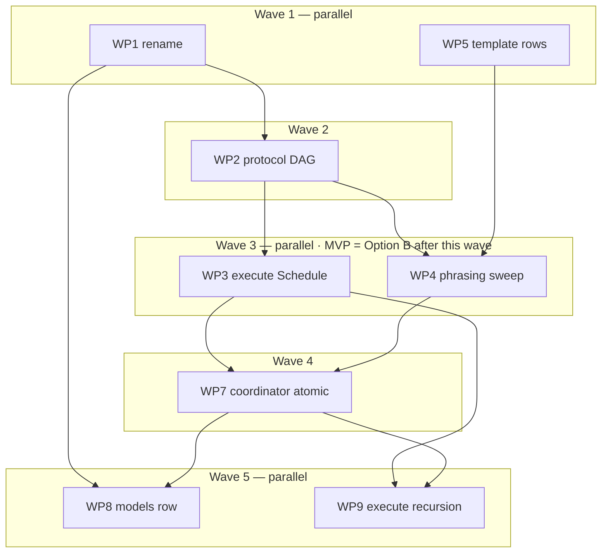

# Plan: Execution scheduling + recursive orchestration (adr_0002) with class rename (adr_0001 C-007)

## Status
- State:   review         <!-- planning → plan-approved → executing → review → done -->
- Tier:    high
- Updated: 2026-07-19
- Next:    /hex-review .agents/plans/plan_scheduling_recursion.md

## Classification
- Scope: large — cross-area contract change across the whole hex bundle
  (hex-core references + all four orchestrator skills + templates).
- Reversibility: one-way (high) — the single-level invariant amendment and
  the `coordinator` role vocabulary freeze at first `grim release`; the
  rename freezes the class vocabulary the same way. Window: `hex/` is
  untracked and unpublished. **This plan's pre-execution step commits the
  bundle** (required by the worktree execution model, below), which crosses
  the ADRs' "first commit" cost threshold — still pre-release and
  pre-publish, on a local feature branch, so the window stays cheap; it is
  no longer free.
- Tier: high (user explicit).
- Overlays: architect=consume-existing (adr_0002 + system design are the
  tier's mandatory ADR), research=skip (four 2026-07-19 axis artifacts),
  adversary=on → skipped, none configured (surfaced in handoff).

## Sources (single-source rule: contracts live in the ADRs, not here)
- Decision: `.agents/adrs/adr_0002_execution_scheduling_recursion.md`
  (C-101…C-109)
- Buildable spec: `.agents/adrs/adr_0002_system_design.md`
  (full contract bodies §5, pseudocode §4, migration §6)
- Rename: `.agents/adrs/adr_0001_model_matrix_capability_classes.md`
  (C-001 definition, C-002 exclusion rule, C-003 degraded format,
  C-007 site list)
- Research: `.agents/research/{hierarchical-execution-performance,
  hierarchical-orchestration-precedent, nested-execution-tooling,
  plan-schema-evolution}.md

Open questions: **none.** The ADR's three `[NEEDS CLARIFICATION]` markers
were resolved at this plan's meta-plan gate by accepting their recommended
answers: (1) WP-join tiny loop fixed at spec+quality, 1 round; (2) free-text
Schedule defaults to a single WP; (3) coordinator model cell =
`deep-reasoning` at medium+high, never low. The WPs below bake these in.

## Discover corrections (verified 2026-07-19; supersede the ADR's anchors where they differ)

1. **Convergence append site is protocol.md:315-318**, not :316-318 (the
   "Append-only growth" header and the word "one" sit on :315).
2. **Template launch phrasing missed by the ADR:** plan-template
   `hex-init/assets/templates/plan.md:122-123` ("/hex-execute launches each
   wave's WPs concurrently") is wave-barrier launch language; the ADR's site
   5b covers only :124/:154 merge-order wording. Owned by WP4 (with the
   other C-101-derived template phrasing; see WP5 split note).
3. **`hex/DESIGN.md:128-129`** ("serialized, in wave / order" — wrapped
   across the line break, so the ADR's single-line validation grep never
   sees it: it would *silently survive*, not fail the grep) is absent from
   the ADR's §6.1 list. Folded into WP1 (DESIGN.md is already in WP1's
   rename scope at :87/:90).
4. **Anchor slugs are load-bearing:** `#work-packages` (11 refs across the
   three hex-execute tier files) and `#the-plan-artifact` (3 refs) — 14
   cross-references total — must survive the hex-execute rewrite. The new
   Schedule content gets its own `### Schedule` heading (new anchor) inside
   `## Work packages` so existing pointers stay valid and tier files can
   point at `#schedule` specifically.
5. **Dual-copy rule refined:** every WP edits `hex/<path>` and syncs the
   installed copy `.claude/skills/<path>` — full file (frontmatter
   included) for the four skills whose copies are identical today;
   **body-only** for `hex-core/SKILL.md` and `hex-init/SKILL.md`, whose
   installed frontmatter carries installer normalization that must not be
   overwritten. Sync happens **after** the WP's merge (see Implementation
   Steps preamble).
6. **hex-init needs no wave-2 edit:** C-107 capabilities are
   detect-and-announce and never stored (so no `arcana:hex` scaffold line),
   and hex-init Step 4 presents the matrix from models.md (so C-108's row
   flows through without a hex-init edit). WP1's hex-init edit (rename,
   C-004 presentation) is the only hex-init change in this plan.
7. **Concurrency cap is 8** (protocol.md:147). **WP2 does not touch the
   cap paragraph at all** — before C-104 lands no worker can spawn a
   worker, so any counting-rule change would sit in tension with the
   still-untouched :144-145 invariant across the wave-3 MVP state. WP7
   makes the **sole** cap-paragraph amendment, atomically with C-103/C-104:
   recursive counting (leaves inside coordinators count), fan-out
   budget/slot share.
8. **adr_0001 do-not-touch list honored:** the five adjacent `fast-balanced`
   sites (hex-plan/overlays.md:50, hex-plan/tier-medium.md:48,
   hex-architect/overlays.md:40, hex-architect/tier-medium.md:42,
   hex-execute/tier-high.md:47) stay unchanged in WP1.
9. **Execution substrate:** `hex/` is untracked; git worktrees carry only
   committed content, so WP worktrees would otherwise contain no bundle at
   all. **Pre-execution step (before WP1):** on the plan's feature branch,
   commit the current `hex/` state — **`hex/` only** — as the baseline
   commit. `.claude/` stays untracked: WP builders never read it, the
   post-merge sync runs from the main checkout, and tracking it would turn
   every sync into accumulating dirty tracked changes (and sweep unrelated
   installed skills onto the branch). `.agents/` stays untracked likewise;
   the plan file's Status mutations don't need git.
10. **Shipped branch naming self-collides (found live at execution):**
   protocol.md/SKILL.md name the feature branch `hex/<plan-slug>` and
   ephemeral WP branches `hex/<plan-slug>/<wp-slug>` — git refs are paths,
   so both cannot exist at once (`cannot lock ref`, reproduced in this
   run). This run uses hyphenated ephemeral branches
   `hex/<plan-slug>--<wp-slug>` (the same convention adr_0002 C-103 uses
   for isolation sub-branches). The shipped convention must be fixed:
   WP7's § Worktree mechanics edit restates ephemeral branch naming as
   `hex/<plan>--<wp>`; WP3's announce-block edit fixes the SKILL.md:154
   `Branches:` example line to match.

## Component contracts

Contracts are defined in the ADRs (join keys below); this table adds the
plan-level acceptance criteria a tester can execute without reading code.
C-110 is plan-assigned (the system design's migration row 11, which had no
contract ID — the traceability scheme requires the C- prefix).

| ID | Contract (defined in) | WP | Acceptance criteria (testable) |
|---|---|---|---|
| C-007 (+C-001/2/3/4) | Class rename `strongest` → `deep-reasoning`; exclusion rule; degraded single-session-model variant; hex-init presentation (adr_0001) | WP1 | `grep -rn "strongest" hex/` returns **zero**. models.md defines `deep-reasoning` with the non-superlative note + the C-002 exclusion-rule blockquote. protocol.md:64 announce example renamed; § Worker coordination gains the C-003 "no per-spawn override" degraded variant with exact line `Degraded: single session model — no per-spawn override; matrix advisory`. memory.md:55-56 example renamed. hex-init Step 4 presents `deep-reasoning`. The five fast-balanced do-not-touch sites byte-identical. DESIGN.md :87/:90 renamed and :128-129 restated to topological order. |
| C-101 | DAG launch rule (adr_0002; body: system design §5 C-101) | WP2 (+WP7 for coordinator-aware parts) | protocol.md § Parallel-by-default contains the "Launch on dependency-ready, not wave" block: eligibility = all `Depends-on` merged; ready-set recomputed per merge; critical-path-first ordering; base = current feature-branch tip; waves = derived reporting; staleness flag on long-`active` WPs. :174's "reading the wave column — no graph traversal" sentence is **rewritten, not appended to** (no barrier assertion survives). :224 restated "serialized, in a valid topological order". The cap paragraph (:147) is untouched here (Discover-7). Coordinator-aware parts — the sole cap-paragraph amendment, per-coordinator rollup progress line — land in WP7, not here. |
| C-102 | Schedule step (adr_0002; body: system design §5 C-102) | WP3 (+WP9 for recursion announce) | hex-execute SKILL.md § Work packages gains `### Schedule` (own anchor; `#work-packages` and `#the-plan-artifact` slugs unchanged — all 14 existing cross-refs resolve). Behavior: read table → ready-set → prepare ready worktrees → feed the existing announce block. Free-text: inline mini-table, same 7 columns, single-WP default; the existing "free-text high routes through /hex-plan" rule (classify.md:47-49) stays. Announce block shows `Work packages: … DAG launch — ready now: …` + critical path. Tier-medium :25-26 and tier-high :30-31 "wave by wave" sentences replaced by one dep-ready sentence pointing at `#schedule`; the launch-action resume phrases (tier-medium :24/:32/:41, tier-high :29/:37) restated dep-ready; :103/:123 merge lines + :3 frontmatter description restated topological. `Recursion:` announce lines, capability-mechanism selection, and nested-spawn Degraded stacking are **WP9**, not here — the wave-3 state announces DAG only. |
| C-103 | `coordinator` role (adr_0002; body: system design §5 C-103) | WP7 | workers.md gains `## coordinator` after `architect` (house format: Mission/Preconditions/Fan-out/Join/Tools/Model + fenced spawn template with Return contract, exactly the system-design entry incl. gate-selected answers: tiny loop = spec+quality 1 round; ≥3-sub-task gate conservative default; **default fan-out = the WP's single shared worktree, no sub-branches ever; hyphenated leaf branch `hex/<plan>/<wp>--` only for a declared true-isolation need, never a deeper slash path**; topo-sort acyclicity fallback; file-set intersection re-check; fan-out budget; scoped-compile leaves + one authoritative join verify; commit per sub-WP join). Contains the literal sentence "Never spawn another coordinator." |
| C-104 | Single-level invariant amendment (adr_0002) | WP7 | protocol.md:144-145 — replace **only the invariant sentence** ("Workers never share state and never spawn workers (single level only)."), preserving the surrounding dispatch prose on :144 — with the system-design C-104 text (bounded exception, orchestrator → coordinator → leaf, hex-enforced, rationale). **Same WP, same commit as C-103** — atomicity is structural. |
| C-105 | Sub-WP schema (adr_0002; body: system design §5 C-105) | WP5 + WP7 | WP5: template § Parallelization gains the dotted example rows (WP3/WP3.1/WP3.2 with `2*` parent wave) + rollup note. WP7: protocol.md § Worktree mechanics gains the two-clause branching rule — (a) only leaf rows are branch/worktree-eligible, (b) **the default is the parent WP's single shared worktree with no sub-branches; a hyphenated leaf branch only for declared true-isolation** — plus dotted-ID rules and the normative rollup algorithm (system design §4.2, incl. "no 5th status; join work is an ordinary sibling row"). Old-plan vacuity stated. |
| C-106 | Join-scoped review hierarchy (adr_0002) | WP7 + WP9 | Tiny loop defined inside the C-103 workers.md entry (1 round, spec+quality). WP9: hex-execute § Work packages maps the three join scopes and states branch-panel-reviews-the-WP-diff (ffwll rule); branch/swarm levels = existing text, no behavioral edit. |
| C-107 | Capability gates (adr_0002; body: system design §5 C-107) | WP7 + WP9 | protocol.md degraded-mode section gains both gates with the 3-step mechanism selection and normative line `Degraded: flat execution — no nested spawn; coordinators inlined`, stacking with C-003's variant. Never stored; class-not-primitive wording. WP9 wires mechanism choice into Schedule and the announce block's Degraded stacking. |
| C-108 | models.md coordinator row (adr_0002) | WP8 | Matrix gains row `coordinator | — | deep-reasoning | deep-reasoning` + the definition note reinforcing the C-002 exclusion rule. |
| C-109 | Convergence append rows (adr_0002) | WP2 + WP4 | protocol.md:315-318 restated to append **rows** (wave derives; byte-identical when converged). hex-review SKILL.md:233 restated "appends any gap as new WP rows (their wave derives)"; :275/:283 "convergence wave" → "convergence rows" for consistency. |
| C-110 | Leaf-verify carve-out (system design §6.1 row 11 — plan-assigned ID) | WP7 | protocol.md:113-114 Implement-phase rule gains the carve-out: a leaf under a coordinator runs a scoped compile check only; the coordinator's join verify is authoritative. Single source — workers.md C-103 points here, never restates. |

## User-experience scenarios

| ID | Scenario | Expected | Error cases |
|---|---|---|---|
| S-001 | `/hex-execute` on a multi-WP plan | After wave 3: announce shows `Work packages: N WPs, DAG launch — ready now: …` + critical path. After wave 5 (full): plus `Recursion: WPx → coordinator (…)` / `others → single builder (below gate)` lines with sources | Plan lacks `Depends-on`/`Status` columns → existing fallback (branch scan / column-missing) still works; announce says so |
| S-002 | Execute on a harness without nesting or programmatic orchestration (post-wave-5) | `Degraded: flat execution — no nested spawn; coordinators inlined`; every WP runs single-builder + normal panel; stacks with `Degraded: single session model …` when both apply | Neither capability *and* no subagents at all → existing `Degraded: inline workers` baseline still announced first |
| S-003 | Old plan (zero dotted rows) under the new contracts | Byte-identical execution; linear/all-wave-1 plan schedules identically to the old barrier | None — every new rule is vacuous by construction (validated per WP) |
| S-004 | Resume (`State: executing`) after interruption | Ready-set recomputed from `merged` rows (relaunches ≥ what wave-barrier resume would); interrupted coordinator resumes as flat execution of its unfinished sub-WP rows from the last committed sub-WP boundary; tiny loop not re-established (branch panel is the backstop — announced). Resume also re-verifies dual-copy sync for already-merged WPs (Discover-5) | Sub-WP branches found but rows missing → existing branch-scan fallback naming applies (dotted slugs are just longer slugs) |
| S-005 | Post-migration validation (cross-cutting; owned by the Verification section, enforced in WP1/WP3/WP4 acceptance) | All Verification checks pass at their scheduled points | Any hit = the owning WP is not done — acceptance blocks merge |

## Parallelization

<!-- This plan is executed by TODAY'S hex-execute (wave-barrier): waves
below are computed topological levels and the merge plan is serialized in
wave order per current protocol.md. Pre-execution step (Discover-9) commits
the untracked bundle first — the worktree mechanics require committed
content. WP numbering: WP6 (originally C-104 alone) was folded into WP7 at
authoring time — atomic per the ADR's ordering constraint; the number is
retired, not reused (append-only ID discipline). -->

| WP | Scope | Expected files (hex/ path + `.claude/skills` mirror) | Size | Wave | Depends on | Status |
|----|-------|------------------------------------------------------|------|------|------------|--------|
| WP1 | C-007 (C-001/2/3/4), Discover-3, S-005 | hex-core/references/{models,protocol,memory,workers}.md; hex-plan/{SKILL,overlays,tier-high,tier-medium}.md; hex-execute/{SKILL,tier-high}.md; hex-review/{SKILL,tier-high}.md; hex-architect/{SKILL,tier-high,tier-medium}.md; hex-init/SKILL.md; DESIGN.md | M | 1 | — | merged |
| WP5 | C-105 (template example rows only — dep-free per migration row 4) | hex-init/assets/templates/plan.md (§ table + rollup note only) | S | 1 | — | merged |
| WP2 | C-101 (role-neutral parts), C-109 (protocol part), S-003 | hex-core/references/protocol.md | M | 2 | WP1 | merged |
| WP3 | C-102 (DAG parts), S-001, S-003, S-004, S-005 | hex-execute/{SKILL,tier-medium,tier-high}.md (tier-low untouched — verified single-WP, no wave language) | L | 3 | WP1, WP2 | merged |
| WP4 | C-109 (review part), Discover-2, migration 5b phrasing sweep, S-005 | hex-review/SKILL.md; hex-plan/{SKILL,tier-medium,tier-high}.md; hex-init/assets/templates/plan.md (:121-124, :154 phrasing) | M | 3 | WP1, WP2, WP5 | merged |
| WP7 | C-103, C-104, C-101/C-105 (coordinator-aware protocol parts), C-106, C-107, C-110, S-002 | hex-core/references/{protocol,workers}.md | L | 4 | WP2, WP3, WP4 | merged |
| WP8 | C-108 | hex-core/references/models.md | S | 5 | WP1, WP7 | merged |
| WP9 | C-102 (recursion announce + spawn conditions), C-106, C-107 (execute part), S-001, S-004 | hex-execute/SKILL.md | M | 5 | WP3, WP7 | merged |

**Critical path:** WP1 → WP2 → WP3 → WP7 → WP9 (bounds wall-clock).

**Shippable after wave: 3** — ADR migration wave 1 complete = Option B (DAG
launch + Schedule + rename), a coherent, self-contained release: no text in
the wave-3 state names the `coordinator` role, recursion, or nesting
capabilities (Discover-7; C-101/C-102 splits above). Recursion (waves 4-5)
can stop here with the DAG win banked.

**Merge order:** wave order, serialized — WP1, WP5, WP2, WP3, WP4, WP7,
WP8, WP9 — with verification (the Verification checks scheduled for that
point, the dual-copy sync of the WP's touched files, and a read-through of
every edited section's cross-links) after each merge onto the feature
branch.

**Parallelization justification:** WP7 is file-eligible for wave 3
(protocol.md is free after WP2; workers.md after WP1) but is deliberately
held to wave 4: "shippable after wave 3" is the ADR's Option-B MVP
boundary, and recursion must never land ahead of the DAG substrate it
gates on.

## Implementation Steps

**Pre-execution (before WP1, on the feature branch):** commit the current
untracked `hex/` state — `hex/` only, never `.claude/` or `.agents/` — as
the baseline commit (Discover-9). Worktree mechanics operate on committed
content only.

Each WP runs Stub → Specify → Implement → Review (adapted for markdown
contracts: Stub = heading/anchor skeleton in place, cross-refs resolving;
Specify = the WP's acceptance greps/checks written into the WP worktree
notes; Implement = full text per the system-design contract bodies; Review
= per-WP panel). **After** each WP's serialized merge onto the feature
branch — from the main checkout, never from inside a WP worktree — sync the
merged content of its touched files to `.claude/skills/` per Discover-5,
before the next WP launches. On resume, re-verify sync for already-merged
WPs and re-sync divergence from the feature branch (feature branch wins).

- [ ] **WP1 — rename.** Semantic edits: models.md (C-001 definition +
      non-superlative note, C-002 exclusion blockquote, advisory note, all
      matrix cells + §Rules examples); protocol.md (:64 example; C-003
      degraded variant added to § Worker coordination); memory.md (:55-56);
      hex-init/SKILL.md (:100-105 Step 4). Mechanical: the 15 pointer sites
      (workers.md:283; hex-plan SKILL:138/overlays:29/tier-high:72/
      tier-medium:74; hex-execute SKILL:150/tier-high:72,85; hex-review
      SKILL:156/tier-high:55,83; hex-architect SKILL:128,139/tier-high:69/
      tier-medium:65) + DESIGN.md:87,90. Plus DESIGN.md consistency sweep:
      :128-129 → "in a valid topological order" (Discover-3) and :250
      ("appends … as a new parallel WAVE" — stale under C-109, invisible to
      the grep via uppercase) → "as new WP rows (wave derives)". Accept:
      C-007 row criteria + Verification 1.
- [ ] **WP5 — template example rows.** Dotted example rows + rollup note
      (system design C-105 table verbatim, incl. `2*` parent-wave marker
      and the no-5th-status join rule). Nothing else in the file — the
      C-101-derived phrasing at :121-124/:154 is WP4's. Accept: C-105
      (template) criteria; template renders (table + mermaid untouched
      elsewhere).
- [ ] **WP2 — protocol DAG (role-neutral).** Rewrite § Parallel-by-default
      (:171-177) to the C-101 block — including **replacing** :174's
      "reading the wave column — no graph traversal" sentence (never
      append-only) — with the ready-set rule, critical-path-first, derived
      waves, base = current feature-branch tip, staleness flag; leave the
      :147 cap paragraph untouched (Discover-7); annotate :220-221
      dependency-tip clause as the never-taken pipelining option; restate
      :224; rewrite :315-318 to append-rows (C-109). No text names
      `coordinator`. Accept: C-101 (role-neutral) + C-109 (protocol)
      criteria; § headings/anchors unchanged.
- [ ] **WP3 — execute Schedule (DAG only).** `### Schedule` subsection
      inside § Work packages (anchor-preserving, Discover-4) with
      read-table → ready-set → prepare-worktrees → announce behavior +
      free-text mini-table rule (single-WP default; high-tier routing rule
      untouched); rewrite the "2+ work packages" bullet to dep-ready
      launch; extend the announce block (:137-156) with `DAG launch —
      ready now` + critical path; tier-medium/tier-high launch sentences
      (:25-26/:30-31) → one pointer sentence each; launch-action resume
      phrases (tier-medium :24/:32/:41, tier-high :29/:37) restated
      dep-ready; :103/:123 merge lines + :3 frontmatter description
      restated topological. No `Recursion:` lines, no capability-gate
      references (WP9). Accept: C-102 (DAG) criteria; all 14 anchor refs
      resolve; classify.md free-text section untouched; Verification 2
      scoped to hex-execute passes.
- [ ] **WP4 — phrasing sweep.** hex-review SKILL.md:233 append-rows
      restatement + :275/:283 consistency; hex-plan SKILL:237,
      tier-medium:111, tier-high:106 "serialized wave-order merge plan" →
      "serialized topological-order merge plan (waves derived)"; template
      :121-124 comment (keep "Wave is computed, not asserted", replace the
      launch sentence with dep-ready launch + topological merge) and :154
      Merge-order line. Accept: C-109 (review) criteria; hex-review
      convergence section format (:253-256) untouched; Verification 2
      passes bundle-wide after this WP merges.
- [ ] **WP7 — coordinator (atomic).** One commit: workers.md
      `## coordinator` full entry (system design C-103 verbatim, house
      format per existing roles, incl. the literal "Never spawn another
      coordinator" and the shared-worktree-default/no-sub-branches rule)
      **and** protocol.md invariant-sentence replacement (C-104 text,
      preserving surrounding :144 prose) **and** § Worker coordination
      degraded gains C-107 (3-step selection + normative flat-execution
      line, stacking) + the **sole** :147 cap-paragraph amendment
      (recursive counting — leaves inside coordinators count toward the
      cap — fan-out budget/slot share; Discover-7) **and**
      § Parallel-by-default gains the per-coordinator rollup progress line
      (C-101's coordinator-aware part) **and** § Worktree mechanics gains
      the two-clause branching rule + dotted-ID rules + normative rollup
      (system design §4.2, incl. join-work-as-sibling-row) **and**
      :113-114 leaf-verify carve-out (C-110). Accept:
      C-103/C-104/C-105(protocol)/C-106(tiny loop)/C-107(protocol)/C-110
      criteria; Verification 6 passes; no state where one file ships the
      role and the other forbids it.
- [ ] **WP8 — models row.** Coordinator row (`— | deep-reasoning |
      deep-reasoning`) + definition note under the matrix. Accept: C-108
      criteria; row uses post-WP1 vocabulary.
- [ ] **WP9 — execute recursion.** § Work packages gains coordinator spawn
      conditions (granularity gate wording: conservative default, judgment
      not mechanical count), the three-join review-scope mapping (C-106)
      with ffwll sentence, capability-mechanism selection at Schedule time
      (C-107) with `Recursion:` announce lines and nested-spawn Degraded
      stacking in the announce block, resume note for interrupted
      coordinators (flat re-run from last committed sub-WP boundary; tiny
      loop not re-established — announced). Accept: C-102 (recursion)/
      C-106/C-107 (execute) criteria; S-001 full-state, S-004.

## Verification

Project has no documented verification command (no `.agents.md`).
This plan's verification, run after every WP merge and once at the end:
1. `grep -rn "strongest" hex/` → exactly 3 hits, all inside models.md's
   C-002 exclusion-rule blockquote where "strongest" is a plain English
   adjective in adr_0001's verbatim text ("the strongest worker-appropriate
   model/class") — never the class token (from WP1 on; criterion amended at
   execution per the living-design-record rule).
2. `grep -rniE "wave by wave|wave[ -]order|wave's|wave column" hex/` → 0
   bundle-wide from WP4's merge on (before that, only sites owned by
   unmerged WPs may remain; the pattern deliberately includes the *launch*
   phrasings — "wave's WPs", "wave column", "wave's worktrees" — not just
   merge-order wording).
3. Dual-copy sync (post-merge): for each touched file, installed copy ==
   hex/ copy (full-file for the four identical skills; body-only for
   hex-core/SKILL.md and hex-init/SKILL.md — Discover-5).
4. Cross-link check: every `[...](...)` edited or added resolves (anchors
   per Discover-4).
5. Read-through of the S-003 vacuity claims on the final state: zero
   dotted rows → all new rules vacuous.
6. Depth-cap invariant present (from WP7 on):
   `grep -rn "Never spawn another coordinator" hex/hex-core/references/workers.md`
   and `grep -rnE "orchestrator → coordinator → leaf" hex/hex-core/references/protocol.md`
   both non-empty.

## Constitution

None named (`arcana:project` absent) — no constitution gate.

## Deferred findings

- **ADR-level defect (design-owner decision):** adr_0002 §6.1 places the
  recursion-aware announce lines and the coordinator-naming cap clause in
  migration wave 1, which would leave Option B's "coherent MVP" naming an
  undefined role. This plan fixes it operationally (C-101/C-102 splits:
  role-neutral parts in WP2/WP3, coordinator-aware parts in WP7/WP9);
  whether to amend adr_0002's wave-1 boundary to match is Michael's call.
- **Both ADRs are still `Proposed`.** This plan implements both; execution
  should not start until Michael flips them to Accepted (standing rule:
  ADR acceptance is a user decision).
- memory.md gap (Discover): no defined behavior for recording the
  active-plan pointer when `.agents.md` doesn't exist. This run
  hits it (pointer not recorded). Out of adr_0002 scope — candidate
  follow-up: one sentence in memory.md § Location and resolution, or run
  `/hex-init`.
- Dual-copy frontmatter drift (hex-core/SKILL.md, hex-init/SKILL.md) is
  installer normalization — accepted, documented in Discover-5, not fixed.
- Pre-execution commit (Discover-9) crosses the ADRs' "first commit"
  reversibility threshold — acknowledged; still pre-release/pre-publish.
- C-110 is plan-assigned, mildly bending "contracts live in the ADRs" —
  candidate follow-up: amend the system design §6.1 row 11 to carry C-110.
