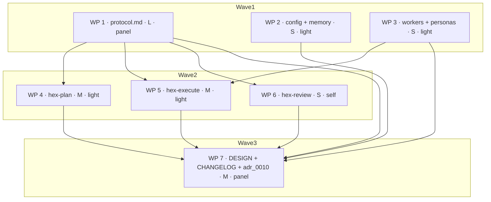

# Plan: Wave 0 — execution-performance quick wins

## Status

- State:   done
- Tier:    medium
- Updated: 2026-09-06
- Next:    —
- Reviewed: 78f32d376fa81b724383323eb1f3d70702ecd49b
- Approved: owner autonomous-goal directive 2026-09-05
- Verify-default: scoped
- Finalized: 2026-09-06 by /hex-finalize — branch recomposed to 5 commits on main; verification green (task publish -- --dry-run, task nox:verify)

---

## Overview

Five contract changes to the shipped `hex/` bundle, all prose, all aimed at
the same measured defect: **wall clock scales with serial worker round-trips,
and hex's gates are unbounded** (`.agents/research/rca-review-fix-loop-wall-clock.md`).
Wave 0 removes the two unbounded costs (an adversary pass with no deadline,
full-workspace verification at every Implement and loop-exit gate) and closes
three spec holes that let a run grow round-trips silently (a budget guard that
only ever escalates, project rules inventing phases, worker briefs carrying the
whole plan).

No new mechanism ships. Every change is a sentence moved, bounded, or mirrored.

## Objective

Halve WP-1-class wall clock (size S, no risk flag) from ~3h toward the
program's ≤30 min target, without lowering the run's terminal verification.

## Scope

### In Scope

1. Adversary stall bound + `limits.adversary-timeout`.
2. Scoped Implement-phase and Review-Fix-Loop exit gates when a WP resolves
   `Verify: scoped`.
3. Downward budget guard (`panel` on a small single-area WP = plan defect) and
   a budget histogram.
4. Project rules add perspectives, never phases or stages.
5. Worker briefs carry excerpts, never the plan body.
6. The record: `hex/DESIGN.md` round 14, `hex/CHANGELOG.md`, an `adr_0010`
   supersession-by-pointer row.

### Out of Scope

- Every ocx-side change in `.tmp/waves.md` item 4 and item 6 (deferred, other repo).
- Wave 1 (`adr_0012` per-WP effective tier, `adr_0013` runtime contracts) and
  Wave 2 (telemetry, benchmark, instruction diet).
- `.agents/memory/hex.md` — its Preferences section is `/hex-init`-owned with
  owner consent (`hex/hex-core/references/memory.md:254-258`). See Open Questions.
- Any Python under `nox/`. No `task nox:verify` in this plan's gates.

## Research

`.agents/research/rca-review-fix-loop-wall-clock.md` — the evidence.
`.agents/research/parallel-resource-pitfalls.md` — background.
Discover + Research phases produced no artifact-length new findings; the three
load-bearing discoveries are folded into Key Decisions below.

## Technical Approach

### Architecture Changes

`hex/hex-core/references/protocol.md` is the hub: four of the five items edit
it, and every other file links into it. It is therefore one work package with
four ordered steps, and it gates wave 2.

### Key Decisions

**D1 — hex's deadline and the adversary's own timeout are different events.**
The contract already requires the skip to carry "the reason the skill itself
gave" (`protocol.md:1226-1233`). The shipped adversary, `nox`, already enforces
a 900 s wall clock and reports `timed_out` (`nox/src/nox/outcome.py:69-70`,
`nox/src/nox/config.py:170`). Hardcoding `deadline` for that case would
launder nox's reason. So: `deadline` names **hex's own** enforcement, used only
when hex observes the stall window pass with no progress signal; a skill that
reports its own timeout keeps its own reason. The two measure different things,
so neither launders the other and each names its source.

**D2 — the loop's exit gate and the run's final gate are two gates, conflated
in one sentence.** `protocol.md:267-269` states one "Exit gate"; C-901's trigger
(iii) equates it with the plan's terminal verification and locks it
"mandatory, un-lowerable" (`hex/DESIGN.md:863-864`). Scoping the per-WP loop
exit is only safe once the two are textually separated. That separation is the
substance of item 2, not a side effect.

**D3 — the budget guard is not in `protocol.md` today.** Two `hex-plan` tier
files state it byte-identically and link to `protocol.md` as if it owned the
sentence (`hex/hex-plan/tier-medium.md:157-160`, `tier-high.md:151-154`).
DESIGN round 13 names this exact pattern as the constitution's known defect and
prescribes the repair: "for `protocol.md` to own the sentence and the tier files
to link it" (`hex/DESIGN.md:1062-1068`). Item 3 therefore lands both directions
in `protocol.md` and deletes the restatements — a net reduction.

**D4 — `/hex-plan`'s announce block cannot carry the histogram.** It prints at
dispatch step 6, before the tier file runs, and Decompose is phase 5 inside that
tier file. There is no WP table at announce time. The histogram prints at the
Decompose gate instead. `/hex-execute`'s announce block does read the plan's
table and gets the histogram as briefed. Its grammar is stated once, in
`protocol.md`; both printing sites link — the same single-source discipline D3
applies to the budget guard.

**D6 — the Implement gate is decoupled from the `Verify` cell; only the loop
exit gate is coupled.** Considered and taken over the briefed shape. Coupling
Implement to the cell would make a `Verify: full` WP pay three full runs for one
work package — Implement, loop exit, merge — where one at the merge boundary is
the check that matters. So the Implement gate becomes the scoped check
**unconditionally** (C-925), and the `Verify` cell widens only to the loop exit
gate that immediately precedes the merge it already governs (C-924). This keeps
the amendment of `protocol.md`'s "and nothing else" to one adjacent gate rather
than two, and removes the tier-conditional Implement behaviour entirely.

**D7 — rejected: inferring the budget from WP size instead of the cell.** The
constitution already settled this: inference "drops the author-judgment cases
the predicate cannot see" (`hex/DESIGN.md:941-948`). Also rejected: a second
per-WP verification dial as a new column, which would reopen round 12's live
*Plan visualization* column lock a fourth time for no gain in expressiveness.

**D5 — item 4 is a documentation change, not a mechanism.** A `perspectives.always`
rule naming an absent phase is already dropped by merge rule 9
(`hex/hex-core/references/config.md:194-196`), and phase identifiers are already
a closed set (`config.md:171-181`). The gap is that nothing *states* the
prohibition or names the orchestrator-side violation. Two sentences, no code.

## Constitution Deviations

| Decision | Deviation | Justification | Remedy |
|---|---|---|---|
| `adr_0010` **C-905**, recorded as `hex/DESIGN.md` round 12 amendment 2 (the budget-column family) and shipped at `protocol.md:538-540`: the `Verify` column "sets the WP's **merge gate** … and nothing else" | C-924 widens the cell's reach by exactly one adjacent gate — the Review-Fix-Loop exit gate that immediately precedes the merge the cell already governs | The clause was written when the merge gate was the only scoped-check site. Running the full documented verification at the loop exit and then a scoped check at the merge moments later is incoherent, and it is where the RCA measures the cost. The lock round 12 actually defends — "the final gate is unchanged, mandatory, and un-lowerable by any per-WP budget" (`hex/DESIGN.md:863-864`) — is preserved verbatim by C-926. The Implement gate is deliberately **not** coupled (D6), keeping the amendment to one gate | `hex/DESIGN.md` gains round 14 recording the amendment (C-936); `adr_0010`'s changelog gains a supersession-by-pointer row naming **C-905**, per round 11's convention. `adr_0010`'s Status is unchanged |
| `adr_0010` **C-901**: "The Implement-phase verification is not this gate and does not change" (`protocol.md:784-787`) | C-925 changes it — the Implement gate becomes the scoped check at every tier | A scope statement about `adr_0010`'s own delta, not a policy. Its stated reason (phase 3 "already reads for changed files") is preserved and sharpened: "for changed files" becomes the scoped check, one vocabulary instead of three. Tier high loses its only pre-merge whole-workspace proof; the backstop is named in C-925 rather than assumed | Same round-14 record; `adr_0010` changelog row names C-901 |
| **C-203 / C-223** — the six Tier A config keys froze at the first `grim release` (`hex/hex-core/references/config.md:36-45`), and six DESIGN rounds audit "`config.md` gains no key" (`hex/DESIGN.md:625, 755, 804, 980, 1069`) | C-921 adds `limits.adversary-timeout` | The freeze's stated harm is renaming — "renaming a frozen key is a silent no-op in every consumer `hex.md`" (`config.md:38-39`). This is **additive under an existing frozen top-level key**, and a reader that predates it degrades correctly by merge rule 8 (warn once, ignore, continue) to the resolved liveness-class default. No consumer `hex.md` breaks, and the alternative — a fixed bound with no escape — leaves a genuinely slow adversary no way out | Round 14 records the addition and the reasoning; `config.md`'s vocabulary-version comment is unchanged, since this adds no top-level key |

## Component Contracts

| ID | Contract |
|---|---|
| **C-920** | The adversary pass carries **a stall bound wherever silence is observable, and a total wall clock only where it is not**. The bound comes from **the adversary's own published contract where it states one, and otherwise from how hex invoked the call**, in three observation modes. **(a) skill-enforced** — the skill runs under its own liveness policy and reports the outcome (`nox-review`'s published contract bounds a review at 900 s of wall clock and 120 s of silence and reports `reason: timed_out`); hex trusts that verdict and its own bound is only the same fixed **15-minute** wall clock (c) uses, **started by the elapse of the skill's own published bound rather than at invocation**, so it reaches only a skill *process* that never returned after that bound should have fired and the two bounds cannot double-count. **(b) pollable background** — the call runs as a background task whose output the orchestrator reads **without blocking** (a background agent or shell task, its output file's mtime, a non-blocking task-output read), so hex observes `byte_activity` and the stall window is measured from the **last output growth, never from invocation**, leaving total elapsed time unbounded while output keeps growing. **(c) foreground blocking** — the call blocks, so silence is unobservable and a fixed **15-minute** wall clock stands in, announced as the `process_only` degrade on a `Degraded:` line; the contract tells the orchestrator to **prefer (b) wherever the harness offers it**. Modes are resolved in order — (a) where the skill's own published contract documents a timeout or silence outcome it enforces itself, else (b) where hex invoked it as a background task whose output hex can read without blocking, else (c); (a) **takes precedence over the invocation mode rather than composing with it**, so a skill that bounds itself is not bounded twice. (b) and (c) are properties of the call, never claims about the skill — `codex:rescue` is (c) as a foreground subagent and (b) when the orchestrator backgrounds it. On elapse of whichever bound the mode resolved to the orchestrator **stops waiting**, takes the existing graceful skip, and proceeds — it discards whatever the call may still return and does not attempt to terminate the underlying process, since no shipped file gives an orchestrator that capability. It follows that **the (a)/(c) backstop fires only where the invocation itself carries a settable timeout**; where the spawn carries none, hex regains control only when the call returns and the backstop is **nominal** — a bound hex documents but cannot enforce, rendered as such on the `Degraded:` line. Stated once, in `protocol.md` § Adversary contract. |
| **C-921** | `limits.adversary-timeout` — new `limits.*` key. Type: integer minutes ≥ 1. Default **5**. The key governs **the mode-(b) stall window and nothing else**. **Mode (c)'s backstop is fixed and is not this key** — with no observable output there is nothing to tune, and it announces on a `Degraded:` line rather than on `Limits:`. **Ceiling semantics like every other limit**: a project value below the default lowers the window; a value above it clamps to the default, and the clamp prints on the gate's `Limits:` line. Defined in `config.md` § Key vocabulary; enumerated in `memory.md`'s Preferences row. |
| **C-922** | **Reason attribution.** The skip line grammar is unchanged (`Cross-model review skipped: <reason>`). An outcome the adversary skill reported is logged with the skill's own word in every mode — the existing passthrough rule, unchanged. Under **(a)** hex defers to the skill's verdict outright and writes no `deadline` for a call the skill's own bound reached — hex's clock does not start until that bound has elapsed unheard. Under **(b)** the two are genuinely orthogonal: a skill's own timeout bounds its run from the inside, hex's `deadline` is silence hex actually observed over the output, so neither can launder the other and each names its source — `deadline` is written **only** where the stall window elapsed with no output growth. **(c) is the one disclosed race** — with no observable output the backstop measures the same quantity a skill's own timeout would, so a `deadline` logged under (c) asserts only that **hex stopped waiting**, never that the adversary failed, timed out, or found nothing. A `deadline` is written under (a) or (c) only where the invocation carried a settable timeout for hex to stop at; where the spawn carries none the backstop is nominal, hex regains control when the call returns, and no `deadline` is written at all. |
| **C-923** | Every tier file across `hex-execute` and `hex-review` that invokes the adversary **links** § Adversary contract; none restates the bound, the default, or the reason vocabulary. |
| **C-924** | The `Verify` cell sets the WP's **merge gate and the Review-Fix-Loop exit gate that immediately precedes it** — one verification budget for one merge boundary. Amends `protocol.md`'s "and nothing else" by exactly that one adjacent gate. The Implement-phase gate is **not** coupled to the cell (D6, C-925). The column stays raise-only with `scoped` as the floor; nothing else about the column changes. |
| **C-925** | **Implement-phase gate — the scoped check, unconditionally, at every tier.** It runs the WP's own contract tests plus the project's cheapest documented assembly gate. Replaces all three current phrasings ("for changed files", "each work package's changed files", "across the whole workspace") with the one scoped-check vocabulary. The leaf-under-coordinator compile-only carve-out is unchanged. **The contract states its own backstop:** tier high thereby loses its pre-merge whole-workspace proof, and what catches a defect in an untouched module is checkpoint trigger (ii) — `M = 3` merges, a cleared dependency level, or a high-risk merge, whichever fires first — with `adr_0010` C-904's bounded bisection attributing the failure across at most three merges, plus trigger (i) at a coordinator join and the terminal final gate. |
| **C-926** | **The Review-Fix Loop's exit gate is not the run's final gate.** The loop's exit gate runs the WP's resolved verification (C-924); it fires once per work package, in that WP's worktree, before merge. Merge-gate trigger (iii) is amended to name only the plan's terminal verification, run once at the end of the run, **mandatory, un-lowerable, reached by every run that completes** — that clause survives verbatim. |
| **C-927** | The three `hex-execute` tier files state their Implement and Review-Fix gates by **linking** C-925/C-926's definition site; none restates the check. Tier-high's whole-workspace Implement gate is removed, not made conditional. |
| **C-928** | **The budget guard is stated once, in `protocol.md` § Parallel-by-default decomposition, and runs in both directions.** Upward (unchanged in substance): `self` or `light` on a security-, hot-path-, large or cross-area WP is a plan defect. Downward (new): `panel` on a size **S or M**, **single-area** WP whose expected file set contains **no** security-sensitive or hot-path file is equally a plan defect. The WP's declared `Expected Files` set is the discriminator in both directions. |
| **C-929** | The three `hex-plan` tier files **link** C-928 instead of restating it. The two byte-identical restatements and tier-low's narrower one-direction sentence are deleted. |
| **C-930** | **Budget histogram — grammar stated once, in `protocol.md` § Parallel-by-default decomposition; both printing sites link.** One line, buckets keyed `<Size>:<Review>`, dot-separated, ordered by `Size` then `Review` in the order each vocabulary declares them (`S, M, L`; `self, light, panel`): `S:light 2 · M:panel 1 · L:panel 3`. A bucket with count 0 is omitted. Printed by `/hex-execute` in its announce block, and by `/hex-plan` at the **Decompose gate** (D4 — the announce block precedes decomposition and has no WP table). |
| **C-931** | Spawn-selection precedence layer 2 gains an explicit negative: project hints contribute perspectives, research axes, path-triggered escalations and model overrides — they **never add, remove, or reorder a phase or stage**. The phase set is the resolved tier file's, rewritten only by `tiers.inherits` / `workflows` at layer 1. |
| **C-932** | An orchestrator that runs a stage absent from its resolved tier file commits a **spec violation**, announced to the same standard `models.md` § Rules sets for a silent model escalation. |
| **C-933** | `workers.md` § Universal worker protocol gains one rule: **the orchestrator reads the plan in full once; a worker brief carries the excerpt, never the plan body.** The excerpt is exactly, save rule 8's two carve-outs: the WP row and that WP's own `## Implementation Steps` entries; the `C-`/`S-` contracts its `Scope` cell names, and the UX scenarios those reference; the changed-file list or diff; the project-rule pointers for the worker's area. The plan path may be named for reference. |
| **C-934** | `reviewer.md`'s spawn-prompt template gains the contract-excerpt field it currently lacks. `builder.md`, `tester.md` and `coordinator.md`'s existing "plan section" / "design record" fields are pinned to C-933's itemization. |
| **C-935** | `hex-execute`'s tier files reference C-933 at their spawn sites; none restates the excerpt list. |
| **C-936** | `hex/DESIGN.md` gains **round 14**, recording all three Constitution Deviations — the C-905 budget-column widening, the C-901 Implement-gate supersession, and the C-203/C-223 additive config key — plus C-928's two-direction guard, and auditing itself against every prior locked decision in the shipped round format. `adr_0010`'s changelog gains supersession-by-pointer rows naming **C-905** and **C-901**, per round 11's convention. Neither file's Status changes. |
| **C-937** | `hex/CHANGELOG.md` gains an `## [Unreleased]` section with one entry per shipped-behaviour change in this plan. |

## User-Experience Scenarios

| ID | Action | Expected outcome | Error cases |
|---|---|---|---|
| **S-911** | hex's own bound elapses — mode (b)'s stall window, or mode (a)'s / mode (c)'s fixed 15-minute backstop | The orchestrator stops waiting, logs `Cross-model review skipped: deadline`, and continues; the gate is satisfied by the logged skip, never by an empty finding list. Under (a) and (c) the backstop can elapse only where the invocation itself carries a settable timeout; where the spawn carries none it is nominal — hex regains control when the call returns and abandons nothing before then | The skill itself reports its own timeout → the logged reason is the skill's own (`timed_out` for nox), not `deadline`; under mode (a) hex writes no `deadline` for a call the skill's own bound reached — a `deadline` under (a) reports only a skill process that never returned at all. Under mode (c) the two bounds measure the same quantity and genuinely race, so a `deadline` logged there asserts only that hex stopped waiting |
| **S-912** | A project sets `limits.adversary-timeout: 45` for a mode-(b) pollable background adversary call | Clamped to 5; the clamp prints on the gate's `Limits:` line | Value `0` or non-integer → malformed value under a known key: merge rule **9** — that key alone is ignored, the shipped default of 5 stands, one warning |
| **S-913** | Any WP finishes Implement, at any tier | The scoped check runs — that WP's contract tests plus the project's cheapest assembly gate — not the full documented sweep, and not the whole workspace at tier high | No runner-addressable WP tests, or no discoverable assembly gate → degrade to full for that run of the check, announced once at the Implement gate; logged `full(degrade)` only at the merge site. A defect in a module the WP did not touch reaches the feature branch and is caught by checkpoint trigger (ii), attributed by C-904's bounded bisection across at most three merges |
| **S-914** | The run's last WP merges | The final gate runs the project's **full** documented verification, regardless of every `Verify: scoped` cell in the table | A `Verify-default: scoped` line cannot reach it; there is no path that lowers the final gate |
| **S-915** | A planner writes `panel` on a size-S single-area docs-only WP | The plan reviewer raises it as an actionable finding; the Decompose-gate histogram shows `S:panel 1` | The WP's expected file set does contain a security-sensitive or hot-path file → not a defect; the file set is the discriminator |
| **S-916** | A project's `perspectives.always` rule names a phase absent from the resolved tier file | Merge rule 9 drops it, warn-once, run continues | The orchestrator runs the stage anyway → spec violation, announced like a silent model escalation |
| **S-917** | A builder is spawned for WP 2 | Its brief carries WP 2's row, the `C-`/`S-` text its Scope names, the referenced UX scenarios, its owned file list, and the area's project-rule pointers | The orchestrator pastes the plan body into the brief → violates C-933 |

## Parallelization

`hex/hex-core/references/protocol.md` carries four of the five items and is a
single file, so those four are sequential steps of WP 1 rather than four WPs —
file-disjointness, not a decomposition failure. `hex/CHANGELOG.md` and
`hex/DESIGN.md` are likewise owned by one late WP so that every earlier WP's
entry lands in one append rather than seven conflicting ones; this follows the
`adr_0010` precedent (its WP 6 owned the release files).

| WP | Scope | Expected Files | Size | Wave | Depends on | Review | Verify | Status |
|----|-------|----------------|------|------|------------|--------|--------|--------|
| WP 1 | Covers C-920, C-922, C-924, C-925, C-926, C-928, C-930 (definition site), C-931, C-932; S-911, S-913, S-914, S-915, S-916 | `hex/hex-core/references/protocol.md` | L | 1 | — | panel | scoped | merged |
| WP 2 | Covers C-921; S-912 | `hex/hex-core/references/config.md`, `hex/hex-core/references/memory.md` | S | 1 | — | light | scoped | merged |
| WP 3 | Covers C-933, C-934; S-917 | `hex/hex-core/references/workers.md`, `hex/hex-core/references/workers/builder.md`, `hex/hex-core/references/workers/tester.md`, `hex/hex-core/references/workers/reviewer.md`, `hex/hex-core/references/workers/coordinator.md` | S | 1 | — | light | scoped | merged |
| WP 4 | Covers C-929, C-930 (plan printing site); S-915 | `hex/hex-plan/tier-low.md`, `hex/hex-plan/tier-medium.md`, `hex/hex-plan/tier-high.md`, `hex/hex-plan/SKILL.md` | M | 2 | WP 1 | light | scoped | merged |
| WP 5 | Covers C-923 (execute side), C-927, C-930 (execute printing site), C-935; S-913, S-914 | `hex/hex-execute/tier-low.md`, `hex/hex-execute/tier-medium.md`, `hex/hex-execute/tier-high.md`, `hex/hex-execute/SKILL.md`, `hex/hex-execute/overlays.md` | M | 2 | WP 1, WP 3 | light | scoped | merged |
| WP 6 | Covers C-923 (review side); S-911 | `hex/hex-review/tier-low.md`, `hex/hex-review/tier-medium.md`, `hex/hex-review/tier-high.md`, `hex/hex-review/overlays.md` | S | 2 | WP 1 | self | scoped | merged |
| WP 7 | Covers C-936, C-937 | `hex/DESIGN.md`, `hex/CHANGELOG.md`, `.agents/adrs/adr_0010_execution_performance.md` | M | 3 | WP 1, WP 2, WP 3, WP 4, WP 5, WP 6 | panel | scoped | merged |
| WP 8 | Convergence gap — **C-925 `partial`**: the `builder` persona still names the retired "for the changed files" phrasing at all three of its Implement sites | `hex/hex-core/references/workers/builder.md` | S | — | WP 1, WP 3 | light | scoped | merged |
| WP 9 | Convergence gap — **C-927 `partial`**: `hex-execute` tier medium/high schedule no site for merge-rule trigger (iii); tier low gained one | `hex/hex-execute/tier-medium.md`, `hex/hex-execute/tier-high.md`, `hex/hex-execute/SKILL.md` | S | — | WP 1, WP 5 | light | scoped | merged |
| WP 10 | Convergence gap — **C-924 / C-925 / C-928 ripple, unscoped by this plan**: the shipped plan template still states the pre-branch gate contracts | `hex/hex-init/assets/templates/plan.md` | S | — | WP 1 | light | scoped | merged |
| WP 11 | Convergence gap — self-consistency repairs inside the new text, plus **S-912 `partial`** and **S-913 `contradicts`** in this plan's own scenario rows | `hex/hex-core/references/protocol.md`, `hex/hex-core/references/config.md`, `hex/hex-core/references/workers.md`, `.agents/plans/plan_wave0_quick_wins.md` | M | — | WP 1, WP 2, WP 3 | panel | scoped | merged |
| WP 12 | Convergence gap — **C-933 `partial`**: rule 8's excerpt list is exhaustive and starves two shipped consumers — the ADR-compliance `architect` and the C-311 federated integration WP | `hex/hex-core/references/workers.md` | S | — | WP 3, WP 11 | light | scoped | merged |
| WP 13 | Convergence gap — **C-920 / C-922 `partial`**: the shipped 15-minute default equals the shipped adversary's own 900 s bound, so hex always elapses first and `deadline` launders `timed_out` — the exact laundering D1 forbids; plus the `Limits:`-line clamp grammar C-921 assumes | `hex/hex-core/references/protocol.md`, `hex/hex-core/references/config.md` | S | — | WP 1, WP 2, WP 11 | light | scoped | merged |
| WP 14 | Convergence gap — **C-937 `partial`**: `## [Unreleased]` was written at WP 7 and records none of WP 8–13's behaviour deltas; the tier-high whole-workspace claim overstates; the plan's own budget histogram predates WP 8 | `hex/CHANGELOG.md`, `hex/DESIGN.md`, `hex/hex-core/references/memory.md`, `.agents/plans/plan_wave0_quick_wins.md` | S | — | WP 12, WP 13, WP 15, WP 16 | panel | scoped | merged |
| WP 15 | Single-source residuals C-928 / C-924 left in tier files: the surviving upward-guard restatement, and the two WP-table column enumerations that omit `Verify` | `hex/hex-execute/tier-high.md`, `hex/hex-execute/SKILL.md`, `hex/hex-plan/tier-medium.md`, `hex/hex-plan/tier-high.md` | S | — | WP 1, WP 4, WP 5 | light | scoped | merged |
| WP 16 | Template residuals the WP 10 pass missed: the Before-Merge Definition-of-Done checkbox still names the full documented verification, and two histogram rules are restated beside their `Substance:` pointer | `hex/hex-init/assets/templates/plan.md` | S | — | WP 10 | light | scoped | merged |
| WP 13b | Owner redirect — a fixed total wall clock is the wrong primitive for an adversary that may legitimately run long. WP 13's raised default is replaced by a **stall bound**: silence over the adversary's progress signal, with liveness classes mirroring nox's C-1010 | `hex/hex-core/references/protocol.md`, `hex/hex-core/references/config.md` | S | — | WP 13 | light | scoped | merged |
| WP 14b | Record catch-up for WP 13b — `CHANGELOG.md`, `DESIGN.md` round 14, `memory.md`'s sample `Limits:` line and this plan's own C-920 / C-921 / C-923 / S-911 / S-912 rows and Open Question 2 all state WP 13's raised wall-clock default, which no longer ships | `hex/CHANGELOG.md`, `hex/DESIGN.md`, `hex/hex-core/references/memory.md`, `.agents/plans/plan_wave0_quick_wins.md` | S | — | WP 13b, WP 14 | panel | scoped | merged |
| WP 13c | Citation repair in WP 13b's text — `adr_0013` was named without its section heading or its `Proposed` status, against that record's own Citations convention | `hex/hex-core/references/protocol.md` | S | — | WP 13b | self | scoped | merged |
| WP 17 | Convergence gap — **C-920 / C-922 `partial`**: the stall bound asserts an observation capability hex does not have and misclassifies the one shipped adversary, so every class collapses to a total wall clock measured from invocation and hex's `deadline` preempts the skill's own reason on every slow run; plus the `process_only` degrade has no announce site | `hex/hex-core/references/protocol.md` | M | — | WP 13b, WP 13c | panel | scoped | merged |
| WP 18 | Convergence gap — **C-924 `partial`**: `hex-plan/SKILL.md` still tells the planner the `Verify` cell is the merge-gate budget, the one surviving restatement of the pre-C-924 reach; plus the four `overlays.md` adversary-contract enumerations omit the stall bound that round 13 calls a live lock | `hex/hex-plan/SKILL.md`, `hex/hex-plan/overlays.md`, `hex/hex-execute/overlays.md`, `hex/hex-review/overlays.md`, `hex/hex-architect/overlays.md` | S | — | WP 1, WP 4 | light | scoped | merged |
| WP 19 | Record and self-consistency catch-up for WP 17–18, plus the residuals this round found in the shipped record: the changelog's false "the way tier `low` already did", the template's undefined `—` exit-gate resolution, the coordinator persona's pre-scoped-check verification line, and this plan's own stale budget histogram and two cross-area `light` cells | `hex/CHANGELOG.md`, `hex/DESIGN.md`, `hex/hex-init/assets/templates/plan.md`, `hex/hex-core/references/workers/coordinator.md`, `hex/hex-core/references/workers/reviewer.md`, `hex/hex-core/references/config.md`, `hex/hex-core/references/protocol.md`, `hex/hex-core/references/memory.md`, `hex/hex-execute/SKILL.md`, `hex/hex-execute/tier-high.md`, `hex/hex-plan/SKILL.md`, `hex/hex-review/SKILL.md`, `.agents/plans/plan_wave0_quick_wins.md` | M | — | WP 17, WP 18 | panel | scoped | merged |
| WP 17b | Owner redirect — WP 17 conceded that hex cannot observe an adversary at all and made `process_only` the default. The owner's direction is narrower: **the invocation mode, not a claim in the skill's docs, decides what hex can observe**, and a stall bound stands wherever silence *is* observable. § Adversary contract gains an observation-mode table; the `process_only` wall clock returns to a fixed 15 min announced as a `Degraded:` line, and `limits.adversary-timeout` reverts to the stall window only | `hex/hex-core/references/protocol.md`, `hex/hex-core/references/config.md`, `hex/hex-core/references/memory.md`, `hex/CHANGELOG.md`, `hex/DESIGN.md`, `hex/hex-plan/SKILL.md`, `hex/hex-review/SKILL.md`, `hex/hex-execute/SKILL.md`, `hex/hex-plan/overlays.md`, `hex/hex-execute/overlays.md`, `hex/hex-review/overlays.md`, `hex/hex-architect/overlays.md`, `.agents/plans/plan_wave0_quick_wins.md` | M | — | WP 17, WP 19 | panel | scoped | merged |
| WP 20 | Convergence gap — **S-911 `contradicts`**, and the observation-mode table's remaining unhonourable claim: under (c) the orchestrator is told it "stops waiting" at a fixed backstop, but (c) is defined as a call with no point of control between invocation and return, so on a harness whose foreground spawn carries no settable timeout the backstop cannot fire — and the contract's own worked example (`codex:rescue` as a foreground subagent) is exactly that case. Mode (a)'s backstop inherits it | `hex/hex-core/references/protocol.md`, `.agents/plans/plan_wave0_quick_wins.md` | S | — | WP 17b | panel | scoped | merged |
| WP 21 | Shipped-file self-consistency residue round 4 found: `config.md` rule 9's new out-of-range case contradicts `limits.loop-rounds`' own clamp-to-default promise; the `limits.adversary-timeout` cell restates the mode-(c) exclusion and ceiling semantics beside its own "restates none of it" pointer; both shipped examples of the key use a value that clamps and therefore demonstrates nothing; the mode table gives (b) no default where (a) and (c) both carry a figure; the `Limits:`-line clamp grammar leaves `<name>` unpinned with no rendered example of the new key; `architect.md`'s spawn template has no compliance-target field though rule 8's carve-out names one and C-934 pinned every other persona; `hex-execute/SKILL.md`'s Constraints bullet dropped the blocking imperative into a pointer whose targets do not carry it, and its parse-time paragraph enumerates `verify` without stating that column's missing-cell chain | `hex/hex-core/references/config.md`, `hex/hex-core/references/protocol.md`, `hex/hex-core/references/memory.md`, `hex/hex-core/references/workers/architect.md`, `hex/hex-execute/SKILL.md` | M | — | WP 17b, WP 19 | panel | scoped | merged |
| WP 22 | Record and template residue: the shipped template's `Verify-default: full` comment still names only merge gates though the cell now reaches two, `Verify` is the one budget column with no assignment criterion and no named location for its required justification, the sub-WP "n/a" clause is contradicted eight lines later by the `—` resolution rule, and the Before-Merge checklist no longer carries any item demanding the run's full documented final gate; `CHANGELOG.md`'s adversary bullet reproduces the whole contract `protocol.md` owns; three of four announce examples now render the same mode-(c) degrade as boilerplate while `hex-architect` was left unswept; plus this plan's own stale budget histogram, its Risks row's retired liveness-class vocabulary, its Phase 3 C-920 check bullet naming `semantic` and a 20-minute backstop, and its C-933 row itemizing four excerpt items where shipped rule 8 carries five; plus `hex/DESIGN.md`'s adversary rounds, which state the (a)/(c) 15-minute backstop unconditionally and name `codex:rescue` as the mode-(c) worked example — the settable-timeout condition WP 20 added to `protocol.md` needs recording as an erratum in the shipped round format | `hex/DESIGN.md`, `hex/hex-init/assets/templates/plan.md`, `hex/CHANGELOG.md`, `hex/hex-architect/SKILL.md`, `hex/hex-plan/SKILL.md`, `hex/hex-execute/SKILL.md`, `hex/hex-review/SKILL.md`, `.agents/plans/plan_wave0_quick_wins.md` | M | — | WP 20, WP 21 | panel | scoped | merged |

WP 6 carries a `self` budget, so the branch-level `/hex-review` pass before this
branch lands on the trunk is **mandatory** (`protocol.md` § The Review-Fix Loop,
per-WP review budget).

Every WP sits at or above the overhead floor: the smallest, WP 6, spans four
files across three tiers and cannot fold into a sibling without breaking
file-disjointness with WP 5.

**Budget histogram (this plan, per C-930):** `S:self 2 · S:light 11 · S:panel 3 · M:light 2 · M:panel 7 · L:panel 1`

**Critical path:** WP 1 → WP 5 → WP 7.

**Shippable after wave: 2** — all five contract changes are live in the shipped
bundle. Wave 3 adds the constitution round and the changelog entry that a
release requires.

**Merge plan (serialized, topological):** WP 1 → WP 2 → WP 3 → WP 4 → WP 5 →
WP 6 → WP 7.

## Implementation Steps

Every contract here is prose in a shipped markdown file. A "test" is therefore
a **contract-reading check**: a grep or read assertion against the shipped file
that fails if the sentence is absent or says something else. Each WP's Specify
phase writes its checks as a short list in the WP's worktree; the Implement
phase satisfies them; `grim build` is the mechanical gate alongside.

### Phase 1: Stubs

Not applicable in the code sense. Each WP's stub step is the **edit-site
inventory**: for every contract it owns, the exact file, section heading, and
whether the edit is an insert or a modify, written down before any prose is
drafted. WP 1's inventory is the one that gates wave 2 — the other WPs link
into the sentences it writes.

### Phase 2: Architecture Review

WP 1 only. Before its prose lands, verify that the C-926 split leaves trigger
(iii)'s "mandatory, un-lowerable, and reached by every run that completes"
clause byte-identical, and that the `Verify` column's raise-only direction rule
(`protocol.md:532-537`) still reads true after C-924 widens the cell's reach.
A change to either is a Block finding, not a fix.

### Phase 3: Specification Tests

Per WP, one contract-reading check per contract ID it owns. Shape:

- **C-920** — § Adversary contract states hex's bound as a function of how hex
  invoked the adversary, in a three-row observation-mode table — **(a)**
  skill-enforced, **(b)** pollable background, **(c)** foreground blocking —
  naming both kinds of bound: a stall window under (b), measured from the last
  output growth and never from invocation, and a fixed **15-minute** backstop
  under (a) and (c), whose clock under (a) starts when the skill's own
  published bound elapses. The mode-resolution order and (a)'s precedence over
  the invocation mode are stated, and the (a)/(c) backstop carries the
  settable-timeout condition.
- **C-921** — `config.md`'s Key vocabulary table has a `limits.adversary-timeout`
  row whose default cell reads `5 — the mode-(b) stall window` and whose effect
  cell scopes the key to the pollable-background stall window and names that
  default as its ceiling; **and** `memory.md`'s Preferences enumeration lists
  `adversary-timeout` alongside `max-workers` and `loop-rounds`.
- **C-922** — § Adversary contract distinguishes the skill-reported reason from
  hex's `deadline`, and the skip-line grammar is unchanged.
- **C-923** — every adversary invocation site in `hex-execute` and `hex-review`
  links `#adversary-contract`, and no tier file contains the bound's phrasing
  (`byte_activity`, `process_only`, `adversary-timeout`, `15 min`,
  `15-minute`). Assert on that phrasing, never on the bare digits — `>15 files`
  and `C-415` already ship in these files and would false-fail a bare-`15`
  grep.
- **C-924** — `protocol.md`'s `Verify` column paragraph no longer contains "and
  nothing else", names the merge gate and the loop exit gate, and names **no**
  third gate; the raise-only direction rule still reads true.
- **C-925** — the Implement gate names the scoped check with no tier condition
  and no `Verify` condition; the whole-workspace phrasing is gone from
  `hex-execute/tier-high.md`; the leaf-under-coordinator carve-out is unchanged;
  the backstop sentence names checkpoint trigger (ii) and C-904.
- **C-926** — the loop exit gate names the WP's resolved verification; trigger
  (iii)'s "mandatory, un-lowerable, and reached by every run that completes"
  clause is byte-identical to its pre-change text.
- **C-927** — no `hex-execute` tier file restates the scoped check; each links.
- **C-928** — § Parallel-by-default decomposition states both directions in one
  place, and names `Expected Files` as the discriminator.
- **C-929** — the two byte-identical restatements are gone from `hex-plan`.
- **C-930** — the histogram grammar appears **exactly once** in `protocol.md`;
  each of the two printing sites links it and states no grammar of its own.
- **C-931/C-932** — § Spawn-selection precedence contains the negative clause
  and the spec-violation sentence.
- **C-933/C-934/C-935** — `workers.md`'s Universal worker protocol has the new
  numbered rule, naming the WP row, that WP's own `## Implementation Steps`
  entries, the `C-`/`S-` contracts its Scope cell names with the UX scenarios
  those reference, the changed-file list or diff, and the worker area's
  project-rule pointers; `reviewer.md` has a contract field.
- **C-936/C-937** — round 14 exists and audits prior locks; `## [Unreleased]`
  exists with one entry per behaviour change.

Each UX scenario is checked by reading the contract it exercises, in the WP
that owns it: S-911 via C-920 and C-922 (WP 1) and C-923 (WP 6); S-912 via
C-921 (WP 2); S-913 and S-914 via C-925 and C-926 (WP 1) and C-927 (WP 5);
S-915 via C-928 (WP 1) and C-929/C-930 (WP 4); S-916 via C-931 and C-932
(WP 1); S-917 via C-933 and C-934 (WP 3). A scenario whose error case is not
stated in the shipped sentence is an actionable finding, not a pass.

### Phase 4: Implementation

Draft the prose. Two standing constraints, both from `hex/DESIGN.md`:
single-source — write the sentence once and link it everywhere else; and
capability classes — no literal model name enters a shipped file.

### Phase 5: Review & Documentation

Per each WP's `Review` cell. The branch-level `/hex-review` pass is mandatory
before this branch lands (WP 6 is `self`).

### Phase 6: Convergence gaps (appended by `/hex-review`, 2026-09-05)

Same contract-reading-check shape as Phase 3. One check per row.

- **WP 8** — `builder.md` contains no occurrence of "documented verification
  for the changed files" (three sites: the focus table, the shipped spawn
  prompt, the self-check list); each names the [scoped
  check](../../hex/hex-core/references/protocol.md#scoped-check) by link, and
  the leaf-under-coordinator compile-only carve-out stays visible in the
  persona. C-925's own words are "Replaces all three current phrasings" —
  the persona the builder actually reads is one of them.
- **WP 9** — `hex-execute/tier-medium.md` and `tier-high.md` each carry a
  Phase 7 `**Gate**` line naming merge-rule trigger (iii), matching
  `tier-low.md`'s; and neither file's trigger-list sentence implies the final
  gate is merge-scoped (`protocol.md` states it "is not a merge and produces
  no log entry"). Failure shape: a single-package plan at medium or high
  completes having scheduled no full documented verification anywhere.
- **WP 10** — `hex-init/assets/templates/plan.md` states the `Verify` column
  as one budget over two adjacent gates; drops "only feature-branch merges
  are gate sites"; corrects the coordinator-row `—` guidance (trigger (i)
  supersedes the merge gate, not that WP's loop exit gate); its Phase 4 gate
  names the scoped check; and its Parallelization comment gains a `Size`
  assignment rule.
- **WP 11** — in `protocol.md`: the checkpoint counter's "since the last full
  verification of any kind" is narrowed to merge-site runs (it currently
  contradicts the new "never the in-worktree exit-gate run" clause and can
  delay the very checkpoint C-925 names as its backstop); merge-rule trigger
  (v) is qualified to the gate's own run of the check now that the check has
  three sites; the `Size` bullet's "nothing gates on it" is reconciled with
  the downward guard's `S`/`M` conjunct and gains a missing-cell default; the
  `self`-budget sentence says "the WP's resolved verification" rather than
  "the scoped check". In `config.md`: the `limits.adversary-timeout` effect
  cell states the malformed-value path (merge rule **9**, not 8). In
  `workers.md`: rule 8 gains the carve-out for a worker whose target *is* the
  plan or ADR artifact. In this plan: **S-913**'s error case is corrected to
  "announced once at the Implement gate; logged `full(degrade)` only at the
  merge site" — the shipped rule is the coherent one — and **S-912**'s cited
  merge rule is corrected from 8 to 9.

### Phase 7: Convergence gaps (appended by `/hex-review` round 2, 2026-09-05)

Same contract-reading-check shape as Phase 3. One check per row.

- **WP 12** — `workers.md` rule 8 either names the design-record excerpt the
  ADR-compliance `architect` is spawned to check against
  (`hex/hex-execute/tier-high.md` Phase 3 and Phase 6 Round 1, both pinned to
  rule 8), and the WP's own `## Implementation Steps` entries that C-311
  requires the federated integration WP's command to be authored in, or its
  carve-out is widened to cover both. Failure shape: a worker is spawned to
  check compliance against a document its brief forbids it to read.
- **WP 13** — § Adversary contract's default bound is **not** equal to or
  below the shipped adversary's own (`nox` `DEFAULT_TIMEOUT_S = 900`, i.e.
  15 min), **or** the section states that passthrough attribution requires
  `limits.adversary-timeout` to exceed the configured skill's own bound.
  hex's clock runs "from invocation" and the skill's from inside its own
  process, so at equal values hex always elapses first and C-922's
  passthrough branch is unreachable. Separately: § The meta-plan approval
  gate's `Limits:`-line contract states a clamp annotation, as `max-workers`
  already does, so `config.md`'s "the clamp prints on the gate's `Limits:`
  line" resolves against a stated grammar.
- **WP 14** — `## [Unreleased]` carries one entry per behaviour delta from
  WP 8–13: trigger (v) narrowed to the merge gate's own run; the checkpoint
  counter narrowed to merge-gate runs, with in-worktree runs and bisection
  probes explicitly non-resetting; `Size` promoted to a read cell with an
  `L` missing-cell default and a histogram-omission rule; merge rule 9
  widened to out-of-range values; rule 8's artifact carve-out; the tier
  medium/high trigger (iii) scheduling site. The `Changed` entry's "Tier
  `high` no longer verifies the whole workspace before merge" is scoped to
  the Implement gate — tier-high's Stub gate still checks the whole
  workspace. The plan's own budget-histogram line is recomputed over the
  full WP set. **Added at execution (living design record):** WP 13 moved
  the adversary default off 15 minutes, so no file may still state the old
  one — `hex/DESIGN.md` round 14, `hex/hex-core/references/memory.md`'s
  sample `Limits:` line, and this plan's own C-920,
  C-921, C-923, S-911 and S-912 rows plus Open Question 2. `hex/DESIGN.md`
  and `memory.md` are added to WP 14's `Expected Files` for that reason;
  WP 15's gained `hex/hex-execute/SKILL.md`, where its round-1 reviewer
  found the same omitted-column defect contradicting the "same nine
  columns" line between the two enumerations.
- **WP 15** — `hex-execute/tier-high.md`'s Phase 6 budget sentence links the
  budget guard instead of restating "never on security- or hot-path work";
  `hex-plan/tier-medium.md` and `tier-high.md`'s WP-table column
  enumerations name `Verify` (C-924 just widened that cell to govern two
  gates, and the authoring skill never emits the column).
- **WP 16** — the template's Before-Merge checkbox names the merge gate's own
  check (scoped, or full on a trigger), matching `protocol.md`; the two
  histogram rules restated at the `Size` paragraph are dropped in favour of
  the `Substance:` pointer already beside them.

### Phase 8: Owner redirect — the adversary bound is a stall bound (2026-09-05)

Same contract-reading-check shape as Phase 3. One check per row. WP 13's
raised wall-clock default is **superseded**, not amended: the owner's
direction is that an adversarial review may legitimately run long, so a fixed
total cap is the wrong primitive.

- **WP 13b** — § Adversary contract states hex's bound as a **stall bound**
  that fires only on silence over the adversary's progress signal, with total
  wall clock **unbounded while the adversary is progressing**; names the three
  liveness classes mirroring nox's C-1010 (`nox/src/nox/liveness.py`) —
  `semantic` (structured events, 2 min silence), `byte_activity` (raw output
  bytes, 5 min, the class `codex:rescue` falls in today), `process_only`
  (silence uninformative, so a fixed 15-minute wall clock stays as the
  announced degrade) — and states that a skill's own docs declare its class,
  absent which it is treated as `byte_activity`. `limits.adversary-timeout` is
  the **stall window** in minutes, ceiling semantics unchanged; the
  `process_only` wall-clock fallback is fixed and is **not** the knob.
  Laundering resolves by **orthogonality, not margin**: nox's `timed_out` is
  nox's own bound and hex's `deadline` is hex-observed silence — both name
  their source, and neither is ever a clean pass (`adr_0011`'s rule stands).
  The observation primitive is the **last-output timestamp of the adversary's
  task stream**; `adr_0013` (execution runtime contracts) is cited by name as
  the general liveness contract with this bound as its first consumer, and no
  general worker-liveness text is written here. Failure shape: a wall-clock
  cap that kills a review which was still producing output.
- **WP 14b** — no shipped or plan file still states WP 13's raised wall-clock
  default as the contract. `## [Unreleased]`'s adversary entry records the
  stall bound, its three classes and the redefinition of
  `limits.adversary-timeout`'s meaning under the unchanged WP 2 key name;
  `DESIGN.md` round 14, `memory.md`'s sample `Limits:` line and this plan's
  C-920 / C-921 / C-923 / S-911 / S-912 rows and Open Question 2 all agree
  with the shipped contract. The budget-histogram line is recomputed over the
  now-eighteen-WP set.
- **WP 13c** — § Adversary contract's `adr_0013` reference names that record's
  section heading (§ A. The liveness contract) and its `Proposed` status, per
  the record's own Citations convention. Failure shape: a shipped file cites an
  unaccepted decision as if it were settled, and the reader cannot find it.

### Phase 9: Convergence gaps (appended by `/hex-review` round 3, 2026-09-05)

Same contract-reading-check shape as Phase 3. One check per row. The root
cause behind WP 17's three items is single: **hex has no channel through which
it can observe an adversary's output stream**, so the stall bound's
class-dependent windows all collapse to a total wall clock measured from
invocation — and a total wall clock measured from invocation always elapses
before the skill's own bound, which is the laundering D1 forbids.

- **WP 17** — § Adversary contract states *how* hex observes silence, or
  concedes that it cannot the same way the bullet already concedes it cannot
  terminate the process. Concretely, at least one of: (a) the invocation sites
  are changed to a form that yields a pollable progress surface, and the
  section names it; or (b) the absent-statement default becomes `process_only`
  (the fail-safe class — an unclassified skill is by definition one whose
  stream hex cannot characterise) and the hard-coded "`codex:rescue` is
  `byte_activity` today" is dropped or corrected. Independently: the
  `process_only` fallback is **not** 15 minutes while the shipped adversary's
  own bound is 900 s, or the section states why an equal-valued total wall
  clock does not launder — the orthogonality argument holds for a genuine
  stall bound and does **not** hold for the `process_only` class, whose
  fallback measures the same quantity as `nox`'s `timed_out`. And "announced as
  the degrade" resolves to a stated site and grammar, as C-921's clamp
  annotation now does: the `Degraded:` line's vocabulary is harness-capability
  values, the `Limits:` line prints only a limit in force, and
  `process_only` has no key by construction — so today it announces nowhere.
  Failure shape: an orchestrator reads the contract, has no way to execute it,
  and either ignores the bound or abandons a healthy review after five minutes
  of unobservable silence.
- **WP 18** — `hex/hex-plan/SKILL.md`'s Parallelization bullet names the
  `Verify` cell as one budget over the merge gate **and** the loop exit gate
  that immediately precedes it, matching `protocol.md` and the shipped
  template; and the four `overlays.md` "the full contract — scopes, one-shot
  rule, 4-way triage, graceful skip" enumerations name the stall bound.
  DESIGN round 13 calls that enumeration a live lock every overlay restates,
  amended in place rather than by pointer. Failure shape: the authoring skill
  teaches the pre-C-924 contract to every plan it writes.
- **WP 19** — `hex/CHANGELOG.md`'s tier-medium/high final-gate entry drops
  "the way tier `low` already did" (false against 0.3.0 — tier low gained its
  line on this same branch); the template states that `—` in a
  coordinator-owned parent's `Verify` cell reads as an empty cell for the exit
  gate's resolution, since `—` is outside the `scoped | full` vocabulary the
  fallback chain keys on; `coordinator.md`'s spawn prompt pins its
  verification line to the WP join rather than "every sub-WP through the
  project's documented verification"; `reviewer.md`'s spawn template names
  rule 8's `plan-artifact` carve-out; `hex-execute/tier-high.md`'s two
  blanket rule-8 lines name the `architect`'s in-full compliance target;
  `hex-execute/SKILL.md`'s `Budget:` example does not demonstrate a plan its
  own downward guard condemns; § Checkpoints states whether the level-clear
  trigger fires on a run's **last** merge, where trigger (iii) re-runs the
  identical verification moments later; and this plan's own budget histogram
  is recomputed over the full WP set (it is one WP stale — `S:self` is 2, not
  1, since WP 13c) while WP 14's and WP 14b's `light` cells are reconciled
  with C-928's upward guard, which the plan's own Notes read as making
  `hex/` plus `.agents/` cross-area.

  **Added at execution (living design record):** WP 17 made
  `limits.adversary-timeout` govern the `process_only` class and moved that
  class's bound off 15 minutes, so `hex/hex-core/references/config.md`'s key
  row and its worked-YAML comment, and `memory.md`'s sample `Limits:` line,
  all state a contract that no longer ships — the `config.md` comment worst of
  all, since it walks a reader into pinning a backstop below the shipped
  adversary's own bound. WP 17 also made the `process_only` backstop a
  mandatory `Limits:`-line item, which invalidates the three example gate
  renders that show an active `codex-adversary` with no `Limits:` line
  (`hex/hex-plan/SKILL.md`, `hex/hex-review/SKILL.md`,
  `hex/hex-execute/SKILL.md`). Those four files are added to WP 19's
  `Expected Files` for that reason, on the WP 14 precedent. `hex/DESIGN.md`
  additionally needs a round-15 erratum, not a silent edit: C-921 records the
  two-class default and the stall-window-only `deadline` condition, both now
  narrower than the shipped contract. `hex/hex-core/references/protocol.md`
  is added for the same reason: this round's § Checkpoints item lives in it,
  and no other in-scope WP can reach it.

### Phase 10: Owner redirect — the observation mode decides (2026-09-05)

Same contract-reading-check shape as Phase 3. WP 17 resolved the
unobservability gap by conceding hex can observe nothing and defaulting every
adversary to `process_only`. The owner's direction supersedes that: **a stall
bound, never a total wall clock where silence is observable** — fix the
observation claim, not the semantics.

- **WP 17b** — § Adversary contract states the bound as a function of **how
  hex invoked the adversary**, in a three-row observation-mode table, and the
  "the skill's docs name its class" resolution is gone:
  **(a) skill-enforced** — the skill enforces its own silence policy and
  reports it (`nox-review`: the `nox` C-1010 liveness classes, outcome
  `timed_out`); hex trusts that verdict and adds only the backstop for a hung
  skill *process*, so the two bounds never double-count.
  **(b) pollable background** — the skill runs as a background task whose
  output the orchestrator can poll without blocking (a background agent or
  shell task, its output file's mtime, a non-blocking task-output read); hex
  observes `byte_activity` and the stall window is measured from the **last
  output growth, never from invocation**; `limits.adversary-timeout` is that
  window.
  **(c) foreground blocking** — the skill runs as a blocking call, silence is
  unobservable, so a fixed **15-minute** wall clock stands in, announced as
  the `process_only` degrade on a `Degraded:` line at the gate, and the
  contract tells the orchestrator to **prefer (b) where the harness offers
  it**.
  `codex:rescue` is classified by mode, honestly: a foreground subagent today,
  so (c), unless the orchestrator runs it in the background, which makes it
  (b). Every sentence claiming hex reads a live event stream it cannot is
  deleted. `adr_0013` stays cited by heading with its `Proposed` status.
  The ripple this reverses or re-lands: `config.md`'s key row (the key is the
  (b) stall window only; the (c) backstop is fixed and is not that knob) and
  its worked YAML, `memory.md`'s sample, `CHANGELOG.md`'s `[Unreleased]`
  entry, `DESIGN.md` round 16 by erratum pointer over round 15, the
  `Limits:`-line third trigger and `shipped default` source WP 17 added (both
  dropped — the announce is a `Degraded:` line now), the three gate renders,
  the four `overlays.md` enumerations that name only the stall bound, and this
  plan's own C-920 / C-921 / C-922 / S-911 rows and Open Question 2.
  Failure shape: hex abandons a healthy background review it could have
  watched, or reports `deadline` for a skill that reported its own outcome.

### Phase 11: Convergence gaps (appended by `/hex-review` round 4, 2026-09-05)

Same contract-reading-check shape as Phase 3. One check per row. The single
root cause behind WP 20 is that rounds 13b through 17b each repaired one half
of the adversary bound — first *what* hex measures, then *whether hex can
observe it* — and never the third half: **whether hex can act on the bound it
resolved.** Modes (a) and (c) both end in a fixed backstop, and a backstop is
an act, not an observation.

- **WP 20** — § Adversary contract states, in the same bullet that already
  concedes hex terminates nothing, that the (a)/(c) backstop **fires only where
  the invocation itself carries a settable timeout**; where it does not, hex
  regains control when the call returns and the backstop is nominal. The
  concession as written ("under (c) a truly hung adversary is abandoned at a
  wall clock rather than at a stall window") is the sentence to repair: an
  orchestrator blocked inside a foreground subagent spawn abandons nothing.
  Independently, this plan's **S-911** row is reconciled with what ships — its
  error cell's absolute "under mode (a) hex writes no `deadline` at all"
  contradicts `protocol.md`'s narrower rule (no `deadline` *for a call the
  skill's own bound reached*; a `deadline` under (a) reports a process that
  never returned at all), and its Action cell omits mode (a)'s backstop, which
  the shipped table carries. Failure shape: an operator reads
  `Degraded: … process_only backstop 15 min`, believes hex will return control
  at 15 minutes, and finds the run still blocked at 40.
- **WP 21** — the shipped-file self-consistency list in the WP row above, each
  item a one-line reading check. Two are worth naming for their failure shape:
  `config.md` rule 9's new out-of-range case gives `limits.loop-rounds: 5` two
  contradictory handlings (clamp-and-annotate per its own row, ignore-and-warn
  per rule 9), so the resolution of a legal-looking config now depends on which
  paragraph the orchestrator read last; and `architect.md` is the one persona
  rule 8's carve-out names and the one C-934 did not pin, so an orchestrator
  spawning an ADR-compliance architect from the shipped template has no slot in
  which to name the compliance target the carve-out exists to deliver.
- **WP 22** — the record and template list in the WP row above. The load-bearing
  item is the template's Before-Merge checklist: WP 16 replaced its full-verification
  item with the scoped check, and no other item names merge-rule trigger (iii), so
  the shipped template a planner copies now contains **no** checklist item demanding
  the run's final gate — the one gate C-926 locks as mandatory and un-lowerable.
  Failure shape: a plan authored from the template ships with its terminal
  verification unrepresented in its own Definition of Done.

## Dependencies

None external. No new dependency, no new config key beyond `limits.adversary-timeout`.

## Verification

| WP | Gate command |
|---|---|
| WP 1, WP 2, WP 3 | `grim build hex/hex-core` |
| WP 4 | `grim build hex/hex-plan` |
| WP 5 | `grim build hex/hex-execute` |
| WP 6 | `grim build hex/hex-review` |
| WP 7 | `task publish -- --dry-run` — `hex/DESIGN.md` has no `grim build` target and `hex/CHANGELOG.md` is validated only by the dry run |

**Final gate** (trigger (iii), un-lowerable): `grim build` for
`hex/hex-core`, `hex/hex-plan`, `hex/hex-execute`, `hex/hex-review`, plus
`task publish -- --dry-run`. `task nox:verify` is **not** in this plan's gates —
no Python changes.

`grim build` exits 65 on validation failure.

## Rollback Plan

Every change is prose in git-tracked markdown. Rollback is `git revert` of the
WP's merge commit. No published artifact changes until a tag is pushed, which
this plan does not do.

## Risks

| Risk | Mitigation |
|---|---|
| C-926's split accidentally lowers the final gate | Phase 2 architecture review checks the locked clause byte-for-byte before the prose lands; S-914 is a contract-reading check |
| A WP's landed diff touches a file outside its `Expected Files` set — DESIGN round 13's named process defect | The merge-time file-set re-validation already fires; every WP row above lists its files exhaustively |
| `hex/DESIGN.md` is validated by nothing — no `grim build` target, not in any manifest | WP 7's review is a reading check, not a build; called out explicitly rather than assumed green |
| A project pins `limits.adversary-timeout` far below its adversary's real progress cadence, so hex abandons a review that was still producing output | The key only *lowers* the mode-(b) stall window from the shipped default, never raises it; recovery is raising the pin back up, or matching it to the output cadence hex actually observes for that call. The two clocks are orthogonal by design **wherever hex has a stall window** (`protocol.md` § Adversary contract) — no configuration can make hex's `deadline` launder a skill's own reported outcome. Under mode (c), where hex has no progress signal at all, the race is disclosed rather than denied: a `deadline` there asserts only that hex stopped waiting |

## Open Questions

1. `[NEEDS CLARIFICATION: /hex-plan's budget histogram cannot print in the announce block — the block precedes Decompose and has no WP table. Print it at the Decompose gate instead?]` **Recommended: yes, Decompose gate** — it is the first point where the data exists. Taken in this plan (C-930, D4); non-blocking.
2. `[NEEDS CLARIFICATION: should this repo's own .agents/memory/hex.md demonstrate limits.adversary-timeout?]` **Recommended: owner runs `/hex-init` after this lands** — the Preferences section is `/hex-init`-owned with owner consent, and this plan is barred from editing it. Non-blocking; the shipped default (5 — the mode-(b) stall window) applies with no pin, and a mode-(c) call is bounded by its fixed backstop, which no pin reaches.
3. `[NEEDS CLARIFICATION: tier high loses its pre-merge whole-workspace Implement proof — the gate becomes the scoped check at every tier, with no per-WP escape. Acceptable?]` **Recommended: yes** — a defect in an untouched module now surfaces post-merge instead of in-worktree, and checkpoint trigger (ii) with C-904's bounded bisection is the named backstop. The trade is a rare expensive recovery for a per-WP saving the RCA measures in tens of minutes; a plan that wants the old behaviour sets `Verify-default: full`, which restores full runs at both the loop exit and every merge. Taken in this plan (C-925, D6); non-blocking.

## Notes

The `Review` cells above are assigned under this plan's own C-928. WP 5 is
size M and single-area, so `panel` on it would be the very defect item 3
introduces — it stays `light`. WP 1 earns `panel` on size L alone. WP 7 earns
`panel` on the upward direction: it spans `hex/` and `.agents/adrs/`, which is
cross-area, and it is the WP that writes the constitution round.

WP 14's and WP 14b's cells read `panel` by WP 19's reconciliation, on the same
upward reading — both span `hex/` and `.agents/plans/`. **Both had already
merged under `light`, and no panel review ran on either**: the cell records the
plan-time assignment C-928 governs, not the review that was actually spawned.

Open question 3 as originally posed asked whether tier high's Implement gate
should become the `Verify: full` case. The review round replaced that shape
with D6: the Implement gate is decoupled from the cell entirely and is the
scoped check at every tier. The question below is restated to match.

## Schedule log

<!-- Append-only, one bullet per merge. Never edited or reordered.
Grammar: - <ISO-8601 UTC> · merged <WP> @ <post-merge SHA> · verify <scoped | full(<trigger>)> [<elapsed>] · ready: <ids | —> · blocked: <id (<blocker>), … | —> -->
- 2026-09-05T11:47Z · merged WP 2 @ b306c26 · verify scoped [~1m] · ready: — · blocked: WP 4 (WP 1), WP 5 (WP 1, WP 3), WP 6 (WP 1), WP 7 (WP 1, WP 3, WP 4, WP 5, WP 6)
- 2026-09-05T11:52Z · merged WP 3 @ 6211600 · verify scoped [~1m] · ready: — · blocked: WP 4 (WP 1), WP 5 (WP 1), WP 6 (WP 1), WP 7 (WP 1, WP 4, WP 5, WP 6)
- 2026-09-05T11:58Z · merged WP 1 @ af6d6c0 · verify full(M=3, level cleared) [~3m] · ready: WP 4, WP 5, WP 6 · blocked: WP 7 (WP 4, WP 5, WP 6)
- 2026-09-05T12:31Z · merged WP 4 @ e435c6d · verify scoped [~1m] · ready: — · blocked: WP 7 (WP 5, WP 6)
- 2026-09-05T12:33Z · merged WP 6 @ 249ddd3 · verify scoped [~1m] · ready: — · blocked: WP 7 (WP 5)
- 2026-09-05T12:38Z · merged WP 5 @ 82912eb · verify full(M=3, level cleared) [~3m] · ready: WP 7 · blocked: —
- 2026-09-05T13:12Z · merged WP 7 @ 521f07e · verify full(final gate) [~4m] · ready: — · blocked: —
- 2026-09-05T13:55Z · merged WP 8 @ 4da4768 · verify scoped [~1m] · ready: WP 10, WP 11 · blocked: —
- 2026-09-05T13:57Z · merged WP 9 @ 3253e1b · verify scoped [~1m] · ready: WP 10, WP 11 · blocked: —
- 2026-09-05T14:19Z · merged WP 10 @ 9d04758 · verify scoped [~1m] · ready: WP 11 · blocked: —
- 2026-09-05T14:19Z · merged WP 11 @ b4ad87c · verify scoped [~1m] · ready: — · blocked: —
- 2026-09-05T16:29Z · merged WP 12 @ 490e9c5 · verify scoped [~1m] · ready: — · blocked: WP 14 (WP 13, WP 15, WP 16)
- 2026-09-05T16:31Z · merged WP 13 @ 7717c02 · verify scoped [~1m] · ready: — · blocked: WP 14 (WP 15, WP 16)
- 2026-09-05T16:44Z · merged WP 15 @ 5ef2f41 · verify scoped [~1m] · ready: — · blocked: WP 14 (WP 16)
- 2026-09-05T16:45Z · merged WP 16 @ a015f88 · verify scoped [~1m] · ready: WP 14 · blocked: —
- 2026-09-05T17:12Z · merged WP 14 @ 76daa42 · verify full(final gate) [~2m] · ready: — · blocked: —
- 2026-09-05T17:35Z · merged WP 13b @ 07b4103 · verify scoped [~1m] · ready: WP 14b · blocked: —
- 2026-09-05T17:58Z · merged WP 14b @ 8935dd9 · verify full(final gate) [~2m] · ready: — · blocked: —
- 2026-09-05T18:06Z · merged WP 13c @ 44ebfc8 · verify scoped [~1m] · ready: — · blocked: —
- 2026-09-05T18:41Z · merged WP 18 @ 2e78fdb · verify scoped [~1m] · ready: — · blocked: WP 19 (WP 17)
- 2026-09-05T19:24Z · merged WP 17 @ 334b091 · verify scoped [~1m] · ready: WP 19 · blocked: —
- 2026-09-05T20:52Z · merged WP 19 @ 2380413 · verify full(counter) [~3m] · ready: — · blocked: —
- 2026-09-05T22:18Z · merged WP 17b @ 5931b8a · verify full(level-clear) [~3m] · ready: — · blocked: —
- 2026-09-05T21:36Z · merged WP 20 @ f0dc0d9 · verify scoped [~1m] · ready: WP 21 · blocked: WP 22 (WP 21)
- 2026-09-05T21:51Z · merged WP 21 @ 09c7414 · verify scoped [~2m] · ready: WP 22 · blocked: —
- 2026-09-05T22:12Z · merged WP 22 @ 73bafdd · verify full(final gate) [~2m] · ready: — · blocked: —
