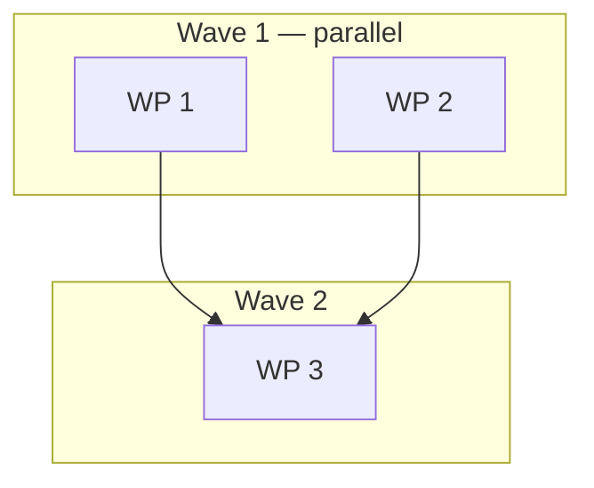

# Plan: [Task Name]

<!--
Implementation plan. Filename and location: this project's documented
plan convention; `.agents/plans/plan_[task].md` if undocumented.
Owner: /hex-plan or a human. Handoff to: /hex-execute, /hex-review.

Mark unresolved ambiguity inline as
`[NEEDS CLARIFICATION: <question>] Recommended: <answer> — <reason>` -
hard cap 3 per artifact. Each marker carries a recommended answer; a
plain approval at the meta-plan gate accepts all recommendations.
Resolve at the gate, never by pausing mid-execution.
-->

## Status

<!--
Status block - mandatory, must stay within the first 20 lines of the
file. Any tool locates the active plan by grepping for this block inside
the project's plan location. Read and mutated by /hex-plan, /hex-execute,
/hex-review, and whoever commits and finalizes the work.
-->

- State:   plan-approved      <!-- planning → plan-approved → executing → review → done; federated plans only (`Repo` column present): review → landing → done -->
- Tier:    [low | medium | high]
- Updated: [YYYY-MM-DD]
- Next:    /hex-execute [this plan's path]
- Repos:   <!-- optional — present only when the table carries a `Repo`
  column (C-324); written once at execution start, frozen, never
  re-resolved (C-317). Mechanics: hex-core references/protocol.md
  § Worktree work-package mechanics. Delete this line and its rows when
  the plan is single-repo. -->
  - `[key]` [/absolute/path/to/repo]  trunk `[branch]`  base `[full 40-char SHA]`  landed: [yes|no]

---

## Overview

**Status:** Draft | Approved | In Progress | Complete
**Author:** [Name]
**Date:** [YYYY-MM-DD]
**Issue/Ticket:** [link or N/A]
**Related PRD:** [Link to PRD]
**Related ADR:** [Link to ADR]
**Related Spec:** [Link to spec or N/A]

## Objective

[What this plan accomplishes, concise]

## Scope

### In Scope

- [Item 1]
- [Item 2]

### Out of Scope

- [Item 1]
- [Item 2]

## Research

**Research artifact:** [location per project conventions] or N/A

[Landscape research summary informing this plan, if a researcher pass ran.
Alternatives considered, adoption signals, trade-offs.]

## Technical Approach

### Architecture Changes

```
[Diagram or description of architectural changes]
```

### Key Decisions

| Decision | Rationale |
|----------|-----------|
| [Decision 1] | [Why] |
| [Decision 2] | [Why] |

## Constitution Deviations

<!--
Present ONLY when the project's constitution pointer is set
(hex.md › Pointers) AND this plan violates a principle - delete
otherwise. Every violation needs a row; an unjustified violation is an
automatic Request Changes in review. See hex-core
references/protocol.md § Constitution gate.
-->

| Violation | Why needed | Simpler alternative rejected because |
|-----------|------------|--------------------------------------|
| [principle violated] | [why this plan needs it] | [why the simpler route fails] |

## Component Contracts

<!--
The public surface touched: types, signatures, error variants, expected
behavior and edge cases. Testable enough that a tester could write
failing tests from this section alone, without reading any code.
IDs C-001, C-002, ... are stable coverage join keys - carried from the
spec when one exists, never renumbered. Every C-ID must appear in the
Scope cell of at least one WP and in at least one test step
(hex-core references/protocol.md § Traceability IDs).
-->

- **C-001** `[Component/function]` — [signature/shape]: [behavior; edge cases; error variants]
- **C-002** `[Component/function]` — [signature/shape]: [behavior; edge cases; error variants]

## User-Experience Scenarios

<!-- One row per user-facing behavior; error cases are mandatory.
S-IDs are coverage join keys like C-IDs - every S-ID needs a covering
WP and test. -->

| ID | Action | Expected outcome | Error cases |
|---|---|---|---|
| S-001 | [user action] | [observable result] | [what happens on failure] |

## Parallelization

<!--
Decompose to MAXIMIZE parallel execution (structural boundaries, not
feature slices; two tasks touching the same file = one sequential WP) —
but never below the overhead floor: a WP whose whole scope is a single
trivial concern (~≤50 expected lines) folds into its nearest sibling as
sequential steps; keeping it isolated needs a one-line justification.
Wave is computed, not asserted: WP is in wave N iff every dependency
sits in an earlier wave and N is minimal — /hex-execute launches each WP
the instant its dependencies merge (dependency-ready, waves are derived
reporting), one ephemeral branch + worktree per leaf WP, merged
serialized onto the plan's feature branch in a valid topological order.
Review is the per-WP review budget: self (docs-only/tiny low-risk —
builder self-check only), light (single-area moderate — one spec
reviewer), panel (large/security/hot-path — the tier's full set). A
missing cell = panel; a sub-WP inherits its parent's budget. Repo is the
WP's repo: a Federation key from `hex.md › Pointers`, or `.` (also the
empty-cell default) for the lead — absent the column, a plan is
single-repo and every federation rule is inert (C-302); delete the `Repo`
column entirely when the plan is single-repo — its presence is the
federation signal. A plan using a
`Repo` value other than `.` must carry a mandatory integration WP — see
hex-core references/protocol.md § Verification (C-311). Concurrently-running
WPs must additionally own disjoint
`(Repo, path)` pairs, not bare paths — substance in hex-core
references/protocol.md § Parallel-by-default decomposition (C-316).
Mechanics: hex-core references/protocol.md § Parallel-by-default
decomposition and § Worktree work-package mechanics. This table is the
source of truth; the diagram is a visual index and may be dropped by
renderers.
-->

| WP | Repo | Scope | Expected Files | Size | Wave | Depends on | Review | Status |
|----|------|-------|----------------|------|------|------------|--------|--------|
| [WP 1] | `.` | [Covers C-001, S-001] | `path/to/file` | [S/M/L] | 1 | — | [self/light/panel] | pending |
| [WP 2] | `.` | [Covers C-002] | `path/to/other` | [S/M/L] | 1 | — | [self/light/panel] | pending |
| [WP 3] | `.` | [Covers S-002] | `path/to/third` | [S/M/L] | 2* | WP 1, WP 2 | panel | pending *(rollup — computed)* |
| [WP 3.1] | *(inherits)* | [Covers S-002] | `path/to/third_a` | [S/M/L] | 2 | *(inherits WP 3's)* | *(inherits)* | pending |
| [WP 3.2] | *(inherits)* | [Covers S-002] | `path/to/third_b` | [S/M/L] | 3 | WP 3.1 | *(inherits)* | pending |

<!--
Dotted IDs (WP 3.1, WP 3.2, ...) are sub-WPs: same table, same columns,
same 4 statuses — no new schema, just a richer ID space. Parent Status is
a computed rollup, never set directly: failed if any child failed, merged
iff all children merged and the join check passes, active once any child
has started (is active or merged), else pending. Parent Wave is the min of its children's waves,
marked with a trailing `*`; reporting only — a parent row is never itself
launched. A sub-WP's Depends-on and Repo, if absent, inherit the parent's
— a sub-WP never names a different repo than its parent, since only leaf
rows are branch- and worktree-eligible, so a cross-repo split belongs at
WP grain, not sub-WP grain (C-302). Only leaf rows get a branch +
worktree — a parent with children is never itself branched. Genuine join
work is an ordinary sibling row (e.g. a
WP 3.3 depending on WP 3.1 and WP 3.2), not a 5th status. IDs are never
renumbered — the next sibling is the next integer. No schema-version
marker: the presence of dotted IDs is the signal. A plan with zero
sub-rows makes every rule above vacuous — byte-identical behavior.
-->



**Critical path:** [WP 1 → WP 3] (bounds wall-clock time)

**Shippable after wave:** [N — what already ships if work stops here.
Delete at tier low (single WP).]

**Merge order:** a valid topological order, serialized — [WP 1], [WP 2], [WP 3] — with
the project's documented verification after each merge onto the feature
branch.

**Parallelization justification:** [only when fewer parallel WPs than
file-disjointness allows, or a sub-overhead WP stays isolated — one line
why. Delete otherwise.]

## Implementation Steps

> **Contract-first TDD:** every feature follows Stub → (optional
> Architecture Review) → Specify → Implement → Review-Fix. Tests are
> written from this plan's design record *before* implementation, and
> validate the contract, not implementation details. See the Review-Fix
> Loop covered by `/hex-execute` and `/hex-review`.

### Phase 1: Stubs

Public API surface only: type signatures, interface definitions, function
shells. Bodies raise or return "not implemented" (e.g. `unimplemented!()`
in Rust, `raise NotImplementedError` in Python, a `TODO` stub in Go). Goal:
set the public shape, no business logic yet.

- [ ] **Step 1.1:** [Stub description — types, interfaces, signatures]
  - Files: `path/to/file`
  - Public API: [Signatures + types introduced]

- [ ] **Step 1.2:** [Stub description]
  - Files: `path/to/file`
  - Public API: [Signatures + types introduced]

Gate: the project's compile/type check passes against the stubs.

### Phase 2: Architecture Review

Review the stubs against this plan's design record (`reviewer`, focus
`spec`, phase `post-stub`). Verify: signatures match the documented
contract, module boundaries align with the Architecture section above,
error types cover the documented failure modes, no missing public surface
versus the design.

Gate: review passes before proceeding. *Optional for changes touching ≤3
files.*

### Phase 3: Specification Tests

Write tests from the design record, NOT from the stubs. Tests encode
expected behavior, edge cases, and the acceptance criteria above, and MUST
fail against the stubs (bodies still "not implemented").

- [ ] **Step 3.1:** Unit tests (from the design record's component
      contracts)
  - Files: `path/to/test`
  - Cases: [Happy path, error cases, edge cases from the design]
  - Covers: [C-001, C-002 — every C-ID needs at least one test]

- [ ] **Step 3.2:** Acceptance tests (from the design record's
      user-facing behavior)
  - Files: `path/to/test`
  - Scenarios: [User-facing behaviors from the design]
  - Covers: [S-001, S-002 — every S-ID needs at least one test]

Gate: tests compile/parse and fail with "not implemented" against the
stubs.

### Phase 4: Implementation

Fill stub bodies until every specification test passes. No new tests
needed here — if one is, the design record is incomplete; update it
instead of inventing a requirement.

- [ ] **Step 4.1:** [Implementation description]
  - Files: `path/to/file`
  - Details: [Additional context]

- [ ] **Step 4.2:** [Implementation description]
  - Files: `path/to/file`
  - Details: [Additional context]

Gate: all unit and acceptance tests pass; the project's documented
verification succeeds.

### Phase 5: Review & Documentation

- [ ] **Step 5.1:** Spec-compliance review (design record ↔ tests ↔
      implementation)
- [ ] **Step 5.2:** Code-quality review
- [ ] **Step 5.3:** Documentation updates
  - Update: [Files/sections]

## Dependencies

<!-- tier-scaled — delete when empty/N/A at tier low -->

### Code Dependencies

| Package | Version | Purpose |
|---------|---------|---------|
| [package] | [version] | [why needed] |

### Service Dependencies

| Service | Status | Notes |
|---------|--------|-------|
| [Service] | [Available/Needed] | [Notes] |

## Rollback Plan

<!-- tier-scaled — delete when empty/N/A at tier low -->

1. [Step to revert if issues arise]
2. [Step to restore previous state]
3. [Verification steps]

## Risks

<!-- tier-scaled — delete when empty/N/A at tier low -->

| Risk | Mitigation |
|------|------------|
| [Risk 1] | [How to handle] |
| [Risk 2] | [How to handle] |

## Open Questions

<!--
Unresolved ambiguities as [NEEDS CLARIFICATION] markers - hard cap 3.
Each carries a recommended answer; a plain approval at the gate accepts
all recommendations. More than three means the target is underspecified;
raise it at the meta-plan gate rather than guessing. Delete this section
when empty.
-->

- [NEEDS CLARIFICATION: <question>] Recommended: <answer> — <reason>

## Checklist

### Before Starting

- [ ] Spec/ADR approved
- [ ] Dependencies available
- [ ] Feature branch resolved (existing non-trunk branch, or
      `hex/<plan-slug>` created from the trunk)

### Before PR

- [ ] All tests passing
- [ ] No linting errors
- [ ] Documentation updated
- [ ] Self-review complete

### Before Merge

- [ ] Code review approved
- [ ] The project's documented verification passes
- [ ] No merge conflicts

## Notes

[Extra context, considerations, comments]

---

## Spec Deltas

<!--
OPTIONAL — absence is normal. Authored by /hex-execute at merge time, one or
more entries per work package (never at plan time); folded into the project's
documented spec home by /hex-review on an Approve + Converged terminal
review. Exactly one block, naming exactly one `Target:` spec file — grammar,
guards, halt semantics, and the fold receipt are defined once in
hex-core references/archive.md § Delta grammar; do not restate them here.
Delete this section if the plan carries no spec deltas.
-->

Target: [path/to/spec file]   <!-- exactly one target per plan -->

### ADDED
- C-00X — [full contract body, exactly as it will appear in the spec]

### MODIFIED
- C-00Y — Base: live {C-00Y.1, C-00Y.2}, N lines.
  [full replacement body, restating every part it keeps unchanged]

### REMOVED
- C-00Z — [one-line reason the contract was removed]

<!--
On a successful fold, /hex-review appends the receipt (append-only):

Folded: [YYYY-MM-DD] → path/to/spec file
  C-00Y written: {C-00Y.1, C-00Y.2}, N lines
  C-00X written: {C-00X}, N lines
  C-00Z removed
-->

---

## Progress Log

| Date | Update |
|------|--------|
| [Date] | [What was done] |
