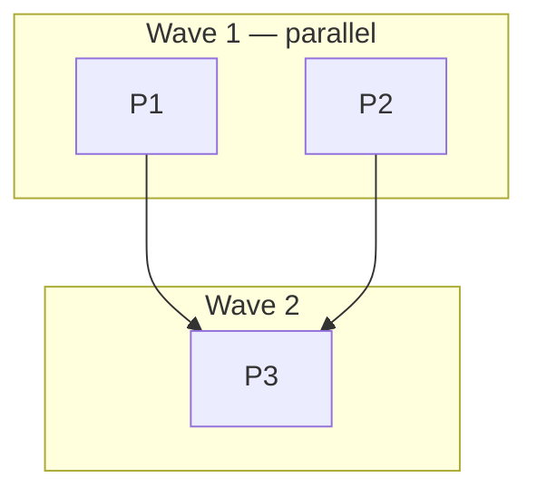

# Plan: [Task Name]

<!--
Implementation plan. Filename and location: this project's documented
plan convention; `.agents/plans/plan_[task].md` if undocumented.
Owner: /hex-plan or a human. Handoff to: /hex-execute, /hex-review.

Mark unresolved ambiguity inline as
`[NEEDS CLARIFICATION: <question>] Recommended: <answer> — <reason>` -
hard cap 3 per artifact. Each marker carries a recommended answer; a
plain approval at the meta-plan gate accepts all recommendations.
Resolve at the gate, never by pausing mid-execution.
-->

## Status

<!--
Status block - mandatory, must stay within the first 20 lines of the
file. Any tool locates the active plan by grepping for this block inside
the project's plan location. Read and mutated by /hex-plan, /hex-execute,
/hex-review, and whoever commits and finalizes the work.
-->

- State:   plan-approved      <!-- planning → plan-approved → executing → review → done; federated plans only (`Repo` column present): review → landing → done -->
- Tier:    [low | medium | high | xhigh | max]
- Tier-grammar: 5   <!-- written by /hex-plan; the grammar `Tier:` was written in. Absent ⇒ pre-`adr_0017` grammar: `Tier:` is read one step higher (low→medium, medium→high, high→xhigh) and announced, never rewritten — hex-core references/protocol.md § Tier grammar (C-997). -->
- Updated: [YYYY-MM-DD]
- Next:    /hex-execute [this plan's path]
- Reviewed: <full 40-char SHA>   <!-- optional — the last-reviewed anchor. Written by the reviewer, not the plan author: whoever completes a review pass over a diff headed at that SHA writes it. It records that every commit reachable from that SHA saw at least one pass, not that the pass was clean. Absent line ⇒ never reviewed ⇒ full-branch review — never an error, never a migration prompt. Mechanics: hex-core references/loop.md § The Review-Fix Loop. Delete this line until a review pass has run. -->
- Repos:   <!-- optional — present only when the table carries a `Repo`
  column (C-324); written once at execution start, frozen, never
  re-resolved (C-317). Mechanics: hex-core references/worktree.md.
  Delete this line and its rows when the plan is single-repo. -->
  - `[key]` [/absolute/path/to/repo]  trunk `[branch]`  base `[full 40-char SHA]`  landed: [yes|no]

---

## Overview

**Status:** Draft | Approved | In Progress | Complete
**Author:** [Name]
**Date:** [YYYY-MM-DD]
**Issue/Ticket:** [link or N/A]
**Related PRD:** [Link to PRD]
**Related ADR:** [Link to ADR]
**Related Spec:** [Link to spec or N/A]

## Objective

[What this plan accomplishes, concise]

## Scope

### In Scope

- [Item 1]
- [Item 2]

### Out of Scope

- [Item 1]
- [Item 2]

## Research

**Research artifact:** [location per project conventions] or N/A

[Landscape research summary informing this plan, if a researcher pass ran.
Alternatives considered, adoption signals, trade-offs.]

## Technical Approach

### Architecture Changes

```
[Diagram or description of architectural changes]
```

### Key Decisions

| Decision | Rationale |
|----------|-----------|
| [Decision 1] | [Why] |
| [Decision 2] | [Why] |

## Constitution Deviations

<!--
Present ONLY when the project's constitution pointer is set
(hex.md › Pointers) AND this plan violates a principle - delete
otherwise. Every violation needs a row; an unjustified violation is an
automatic Request Changes in review. See hex-core
references/protocol.md § Constitution gate.
-->

| Violation | Why needed | Simpler alternative rejected because |
|-----------|------------|--------------------------------------|
| [principle violated] | [why this plan needs it] | [why the simpler route fails] |

## Component Contracts

<!--
The public surface touched: types, signatures, error variants, expected
behavior and edge cases. Testable enough that a tester could write
failing tests from this section alone, without reading any code.
IDs C-001, C-002, ... are stable coverage join keys - carried from the
spec when one exists, never renumbered. Every C-ID must appear in the
Scope cell of at least one pipeline and in at least one test step
(hex-core references/protocol.md § Traceability IDs).
-->

- **C-001** `[Component/function]` — [signature/shape]: [behavior; edge cases; error variants]
- **C-002** `[Component/function]` — [signature/shape]: [behavior; edge cases; error variants]

## User-Experience Scenarios

<!-- One row per user-facing behavior; error cases are mandatory.
S-IDs are coverage join keys like C-IDs - every S-ID needs a covering
pipeline and test. -->

| ID | Action | Expected outcome | Error cases |
|---|---|---|---|
| S-001 | [user action] | [observable result] | [what happens on failure] |

## Parallelization

<!--
A few pipelines cut along contracts: one worktree each, steps run serially
inside, no gate or review between them; pipelines run in parallel and share
only contracts. Splitting into steps is cheap (small contexts); splitting
into pipelines pays only where a contract can be fixed up front. Expected
files are disjoint across pipelines (with a Repo column: disjoint
`(Repo, path)` pairs). Pipelines never edit contract-wave files and never
commit hub/generated files (lockfiles, baselines, goldens) - those
regenerate once at integration. Wave is computed, not asserted: a pipeline
is in wave N iff every dependency sits in an earlier wave and N is minimal;
/hex-execute launches each pipeline the instant its dependencies merge.
Marks is empty, `hard` (the pipeline's steps start at standard-high; at
most one pipeline in four) or `review` (the pipeline is reviewed on its own
before it lands) - rare. Status is pending | active | merged | failed.
Repo is the pipeline's repo: a Federation key from `hex.md › Pointers`, or
`.` (also the empty-cell default) for the lead - absent the column, a plan
is single-repo and every federation rule is inert (C-302); delete the
`Repo` column entirely when the plan is single-repo, its presence is the
federation signal. A plan using a `Repo` value other than `.` must carry a
mandatory integration pipeline - see hex-core references/verify.md
§ Verification (C-311). A one-pipeline plan has no contract wave.
Substance: hex-core references/decompose.md § Parallel-by-default
decomposition; mechanics: hex-core references/worktree.md § Pipeline
worktree mechanics. This table is the source of truth; the diagram is a
visual index and may be dropped by renderers.
-->

| Pipeline | Repo | Scope | Expected Files | Wave | Depends on | Marks | Status |
|----------|------|-------|----------------|------|------------|-------|--------|
| [P1] | `.` | [Covers C-001, S-001] | `path/to/file` | 1 | — | [hard, review or empty] | pending |
| [P2] | `.` | [Covers C-002] | `path/to/other` | 1 | — | | pending |
| [P3] | `.` | [Covers S-002] | `path/to/third` | 2 | P1, P2 | | pending |



**Critical path:** [P1 → P3] (bounds wall-clock time)

**Shippable after wave:** [N — what already ships if work stops here.
Delete when the plan is one pipeline.]

**Parallelization justification:** [only when fewer parallel pipelines than
file-disjointness allows — one line why. Delete otherwise.]

## Implementation Steps

> **Contract-first TDD:** the contract wave commits stubs and contract
> tests; inside each step the work is Specify → Implement. Tests are
> written from this plan's design record *before* implementation, and
> validate the contract, not implementation details. **Step feedback** is
> the only inner check: a step that changes behaviour runs the tests it
> wrote or touched once, with the narrowest command it picks, never the
> project's gate wrapper; a step with no behavioural effect runs nothing.
> The run's two full gates are the integration gate and the release gate
> (`/hex-finalize`). See `/hex-execute` and `/hex-review`.

### Contract wave

<!-- Delete this section for a one-pipeline plan. -->

Public API surface only: type signatures, interface definitions, function
shells with bodies that raise or return "not implemented" (e.g.
`unimplemented!()` in Rust, `raise NotImplementedError` in Python), plus the
contract tests written from the design record - NOT from the stubs - that
encode expected behavior, edge cases, and the acceptance criteria above.

- [ ] **Stubs:** [types, interfaces, signatures]
  - Files: `path/to/file`
  - Public API: [Signatures + types introduced]
- [ ] **Contract tests:** [what they pin]
  - Files: `path/to/test`
  - Covers: [C-001, C-002, S-001 - every C-/S-ID needs at least one test]

Check: the contract wave compiles/parses (the narrowest check that shows it).

### Pipeline steps

Each pipeline's steps run serially in its own worktree, in the order
listed: specification tests for the step's slice of the contract, then the
implementation that makes them pass. No new requirement is invented here -
if one is needed, the design record is incomplete; update it instead.

- [ ] **Step P1.1:** [Step description]
  - Files: `path/to/file`
  - Covers: [C-001]
  - Details: [Additional context]
- [ ] **Step P1.2:** [Step description]
  - Files: `path/to/file`
- [ ] **Step P2.1:** [Step description]
  - Files: `path/to/other`

### Integration and review

- [ ] All pipelines merged; hub/generated files regenerated once, minimally
- [ ] Integration gate (concurrent with the review)
- [ ] `/hex-review` over the landed range
- [ ] Documentation updates
  - Update: [Files/sections]

## Dependencies

<!-- tier-scaled — delete when empty/N/A at tier medium or below -->

### Code Dependencies

| Package | Version | Purpose |
|---------|---------|---------|
| [package] | [version] | [why needed] |

### Service Dependencies

| Service | Status | Notes |
|---------|--------|-------|
| [Service] | [Available/Needed] | [Notes] |

## Rollback Plan

<!-- tier-scaled — delete when empty/N/A at tier medium or below -->

1. [Step to revert if issues arise]
2. [Step to restore previous state]
3. [Verification steps]

## Risks

<!-- tier-scaled — delete when empty/N/A at tier medium or below -->

| Risk | Mitigation |
|------|------------|
| [Risk 1] | [How to handle] |
| [Risk 2] | [How to handle] |

## Open Questions

<!--
Unresolved ambiguities as [NEEDS CLARIFICATION] markers - hard cap 3.
Each carries a recommended answer; a plain approval at the gate accepts
all recommendations. More than three means the target is underspecified;
raise it at the meta-plan gate rather than guessing. Delete this section
when empty.
-->

- [NEEDS CLARIFICATION: <question>] Recommended: <answer> — <reason>

## Checklist

### Before Starting

- [ ] Spec/ADR approved
- [ ] Dependencies available
- [ ] Feature branch resolved (existing non-trunk branch, or
      `hex/<plan-slug>` created from the trunk)

### Before PR

- [ ] All tests passing
- [ ] No linting errors
- [ ] Documentation updated
- [ ] Self-review complete

### Before Merge

- [ ] Code review approved
- [ ] The integration gate passes
- [ ] The release gate passes - `/hex-finalize`, fresh with no cache, plus the
      project's hooks and lint over the final range
- [ ] No merge conflicts

## Notes

[Extra context, considerations, comments]

---

## Spec Deltas

<!--
OPTIONAL — absence is normal. Authored by /hex-execute when a pipeline lands, one or more
entries per pipeline (never at plan time); folded into the project's
documented spec home by /hex-review on an Approve + Converged terminal
review. Exactly one block, naming exactly one `Target:` spec file — grammar,
guards, halt semantics, and the fold receipt are defined once in
hex-core references/archive.md § Delta grammar; do not restate them here.
Delete this section if the plan carries no spec deltas.
-->

Target: [path/to/spec file]   <!-- exactly one target per plan -->

### ADDED
- C-00X — [full contract body, exactly as it will appear in the spec]

### MODIFIED
- C-00Y — Base: live {C-00Y.1, C-00Y.2}, N lines.
  [full replacement body, restating every part it keeps unchanged]

### REMOVED
- C-00Z — [one-line reason the contract was removed]

<!--
On a successful fold, /hex-review appends the receipt (append-only):

Folded: [YYYY-MM-DD] → path/to/spec file
  C-00Y written: {C-00Y.1, C-00Y.2}, N lines
  C-00X written: {C-00X}, N lines
  C-00Z removed
-->

---

## Schedule log

<!--
Append-only, one bullet per merge onto the feature branch and one per
completed step, never edited or reordered; created on first write. An absent
section is never an error. Grammar and substance: hex-core
references/decompose.md § Parallel-by-default decomposition. `<class>` is a
capability class, never a literal model name.

- <ISO-8601 UTC> · merged <pipeline> @ <post-merge SHA> · ready: <ids | —> · blocked: <id (<blocker>), … | —>
- <ISO-8601 UTC> · step <pipeline>/<n> · model <class> · work <elapsed> [· wait <elapsed>]
-->
